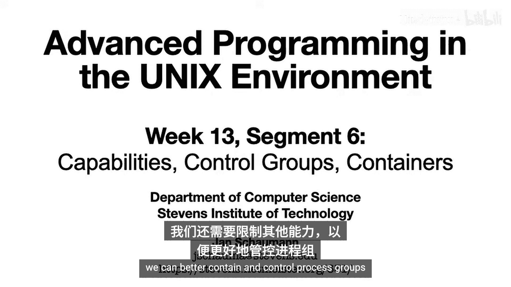
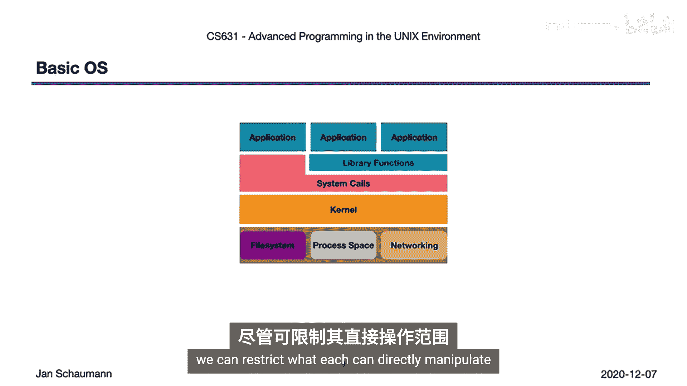
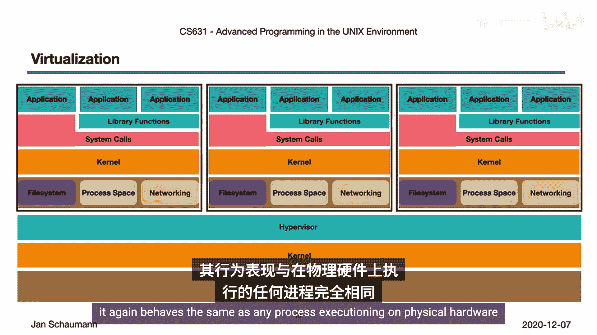
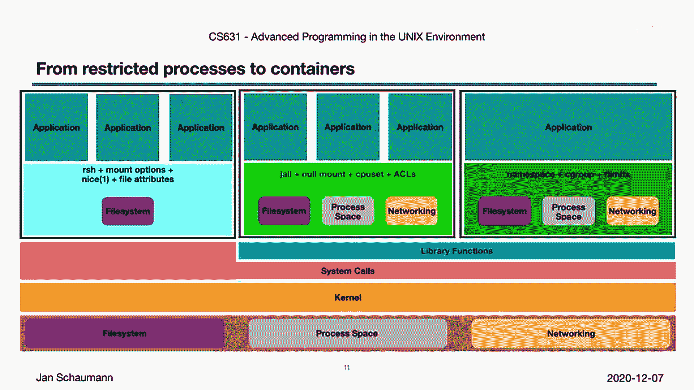

UNIX高级编程：13.6：能力、控制组与容器 🚀

在本节课中，我们将完成对进程限制方法的讨论，重点介绍POSIX能力、Linux控制组（cgroups），以及这些技术与我们之前讨论的其他方法如何共同构成了容器技术（如Docker或LXC）的基础。我们已经了解了限制CPU使用率、文件系统视图、内存和进程表访问的方法，本节将进一步探讨如何通过更精细的控制来更好地隔离和管理进程组。

---



### 概述：从能力到容器

上一节我们探讨了资源视图的限制。本节中，我们来看看如何通过定义进程的“能力”来实施更通用的权限控制，并介绍用于资源隔离的Linux命名空间和控制组，最终理解这些技术如何共同构建出轻量级的容器。

---

### POSIX能力模型

一种定义通用需求的方法是使用POSIX能力模型。在这个模型中，我们不是针对特定问题（如受限shell或chroot）提供具体解决方案，而是识别进程所需的通用“能力”，并授予对这些能力的细粒度访问控制。

例如，可以定义以下能力：
*   `CAP_CHOWN`: 更改文件所有者的能力。
*   `CAP_SETUID`: 允许设置用户ID（setuid）。
*   `CAP_LINUX_IMMUTABLE`: 允许设置文件的不可变标志（如`chattr +i`）。
*   `CAP_NET_BIND_SERVICE`: 允许将网络套接字绑定到1024以下的端口。
*   `CAP_NET_ADMIN`: 允许进行网络接口配置和路由表操作。
*   `CAP_NET_RAW`: 允许使用原始数据包（如ping）。
*   `CAP_SYS_ADMIN`: 一个更广泛的系统管理能力集合，提供诸如挂载文件系统、设置主机名、管理交换空间等特权。

不同操作系统对此标准的解释和实现方式各异。例如，FreeBSD通过Capsicum框架实现能力模型，而Linux系统的具体实现细节可以在 `capabilities(7)` 手册页中查阅。

---

### Linux命名空间

另一种划分系统、限制进程和进程组对资源可见性的方法是Linux命名空间，其灵感来源于贝尔实验室的Plan 9操作系统。

使用命名空间，一个进程组可以以不同于其他进程组的方式，或者完全看不到某些系统组件。这些资源可以存在于多个命名空间中，从而在划分系统、仅向特定进程组暴露必要资源方面提供了高度的灵活性。

以下是可通过命名空间进行虚拟化的资源类型：
*   **挂载点**：独立的文件系统视图。
*   **进程ID**：独立的进程ID空间，仅能看到本命名空间内的进程。
*   **网络**：虚拟化的网络栈，每个命名空间拥有自己的IP地址、路由表、防火墙规则等。
*   **System V IPC**：独立的信号量、共享内存和消息队列内核结构视图。
*   **UTS**：独立的系统主机名和域名。
*   **用户**：独立的用户ID映射，例如，可以将命名空间内的root用户映射到宿主系统的一个非特权用户。
*   **时间**：允许不同进程使用不同的系统时间。

---

### 控制组

控制组，最初称为“进程容器”，用于隔离我们之前讨论过的各种资源使用。

以下是cgroups允许进行控制的主要方面：
*   **内存限制**。
*   **CPU使用率、优先级和限制**。
*   **资源统计**：跟踪哪些进程以何种方式使用了哪些资源。
*   **进程控制**：允许暂停、中断、对进程进行检查点保存和恢复。

cgroups经历了至少一次重新设计，版本2目前支持以下控制器：
*   任务调度能力。
*   CPU和内存使用率。
*   cgroup自身的活动控制（例如，冻结组中的任务将不会被调度）。
*   大页支持和使用。
*   块设备I/O。
*   内存、内核内存和交换内存。
*   线程监控。
*   可用进程数量的限制。
*   远程目录内存访问。

cgroups通过虚拟文件系统实现，通常挂载在 `/sys/fs/cgroup`，并允许通过挂载选项启用不同的控制器。

以下是一个限制当前shell内存使用量的简单示例代码：

```bash
# 创建一个新的cgroup（在cgroup v2中，通常是在/sys/fs/cgroup下创建子目录）
sudo mkdir /sys/fs/cgroup/memory/my_group

# 将当前shell的进程ID写入cgroup.procs文件
echo $$ | sudo tee /sys/fs/cgroup/memory/my_group/cgroup.procs

# 设置内存限制（例如，限制为100MB）
echo “100M” | sudo tee /sys/fs/cgroup/memory/my_group/memory.max
```

`cgroups(7)` 手册页提供了非常详细和广泛的信息，建议你花时间阅读。

---

### 容器：技术的集大成者



最后，容器，顾名思义，是一种“容纳”进程的方式。它们在同一操作系统内核上提供了一个隔离的执行环境，这是与完全硬件虚拟化的重要区别，因此是一种更轻量级的方法。

为了“容纳”进程，你可能会组合使用以下技术：
*   使用 `chroot` 或联合挂载来提供正确的文件系统视图。
*   使用资源限制来避免进程干扰父系统或其他进程。
*   使用命名空间来限制文件系统、进程、网络等的可见性。
*   使用能力模型来限制进程可以执行的操作。



尽管我们在此上下文中讨论了许多应用此类限制的方法，但cgroups和命名空间经常被一起讨论，因为它们能很好地互补。事实上，cgroups和命名空间的结合构成了许多操作系统级虚拟化和容器技术（如CoreOS、LXC或Docker）的基础。

考虑我们从学期初就使用的操作系统基本分层模型：
1.  底层是硬件。
2.  内核管理硬件。
3.  系统调用是进入内核的接口。
4.  一系列库函数允许应用程序在操作系统内执行。

在传统模型中，内核拥有对硬件的广泛访问权，进程也大体上保留对硬件的相同视图。每个进程的文件系统、进程空间和网络能力是相同的，尽管我们可以限制每个进程能直接操作的内容。

在**完全硬件虚拟化**中，情况有所不同。我们在硬件和内核之上增加了一个**虚拟机监控程序**，它虚拟化硬件并将其提供给每个虚拟机。在虚拟机内部，每个客户操作系统只能看到虚拟机监控程序提供的资源。

而在**轻量级操作系统级虚拟化**中，我们从一个熟悉的基本视图开始，但可以应用本系列视频中的各种技术来创建受限环境。例如：
*   结合使用受限shell、特定挂载选项、固定的CPU优先级和一些文件属性，来构建受限的文件系统视图并限制进程执行能力。
*   结合使用`chroot` jail、CPU集和能力，来限制特定进程的进程、文件系统和网络视图。
*   创建由精心调优的命名空间、cgroups和资源限制组成的，针对每个进程或进程组的受限环境。

**容器本质上就是运行在我们通用UNIX操作系统上的进程，但我们对其进行了限制，使得它们只能看到或访问我们允许的资源视图。** 然而，请注意，与完全硬件虚拟化不同，容器仍然是进程或进程组。也就是说，它们仍然运行在与宿主机或父进程相同的操作系统内核上。这既是优势（虚拟环境的初始化比启动虚拟机快得多），也是限制（你只能运行与宿主机相同操作系统的容器，而不能运行另一个操作系统）。

---

### 总结与思考

本节课中，我们一起学习了限制进程的各种方法，以及这些技术如何最终催生了流行的容器技术。还有许多其他相关方法，我们只是浅尝辄止，但希望你已经看到，这其中并无魔法。本学期到目前为止所涵盖的所有内容，都应该能让你更好地理解Docker及其同类技术。

或许从这里可以得出的最重要经验是：
1.  大多数进程限制都可以通过某种方式被绕过。
2.  目标是**自愿地**限制自己，使得即使系统被攻破，攻击者也无法获得你之前可能拥有的攻击能力或提升的权限。
3.  理解Unix进程和基本语义对于设置和配置此类受限环境至关重要。

从我们的第一堂课到现在，我们已经走了很长一段路。或许现在可以带着对这些概念的理解，回头重新审视一些主题。



感谢观看，下次再见！👋