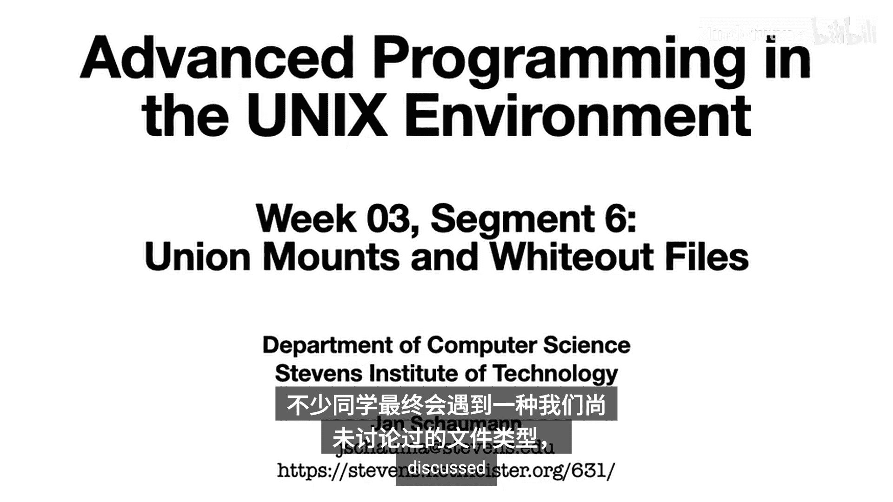
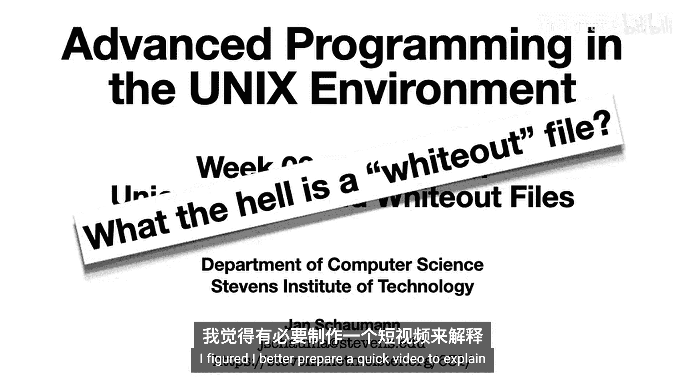
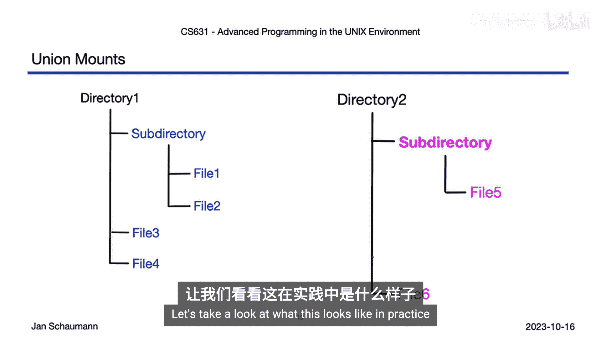
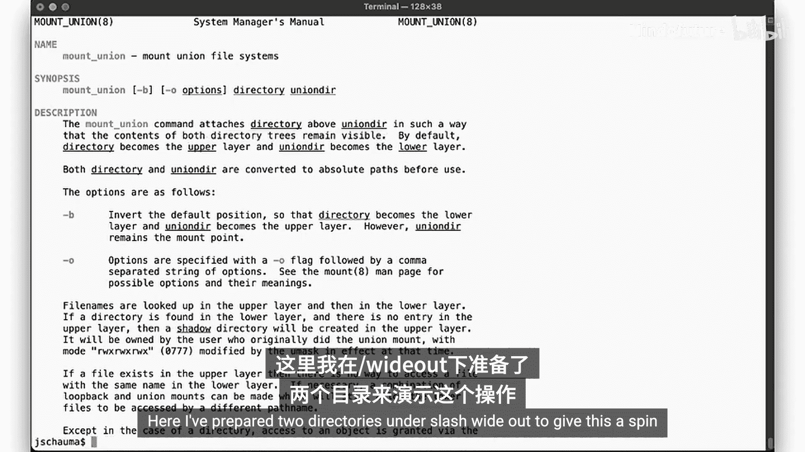
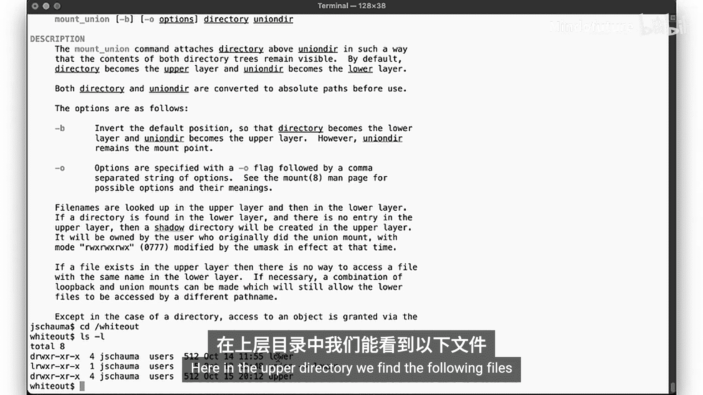
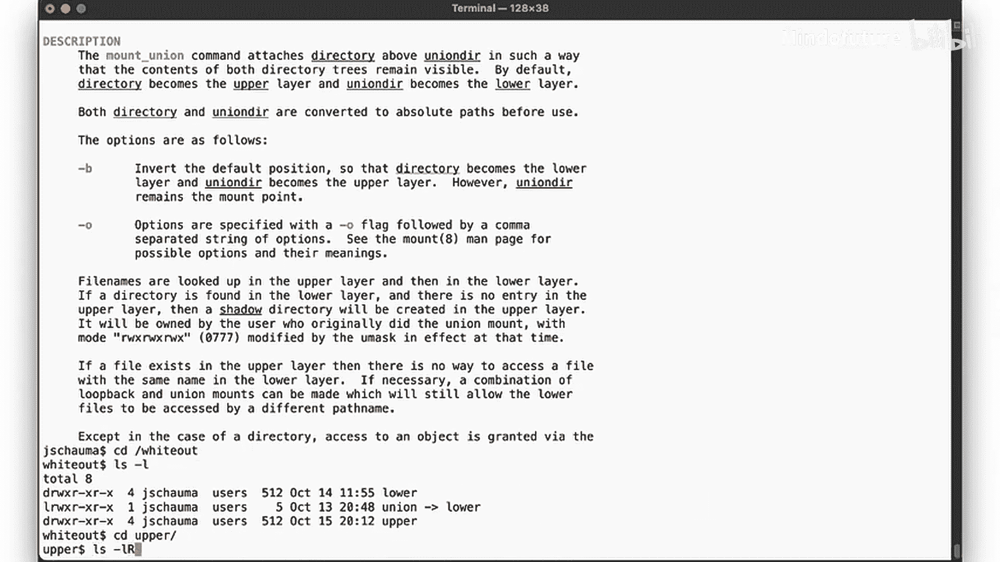
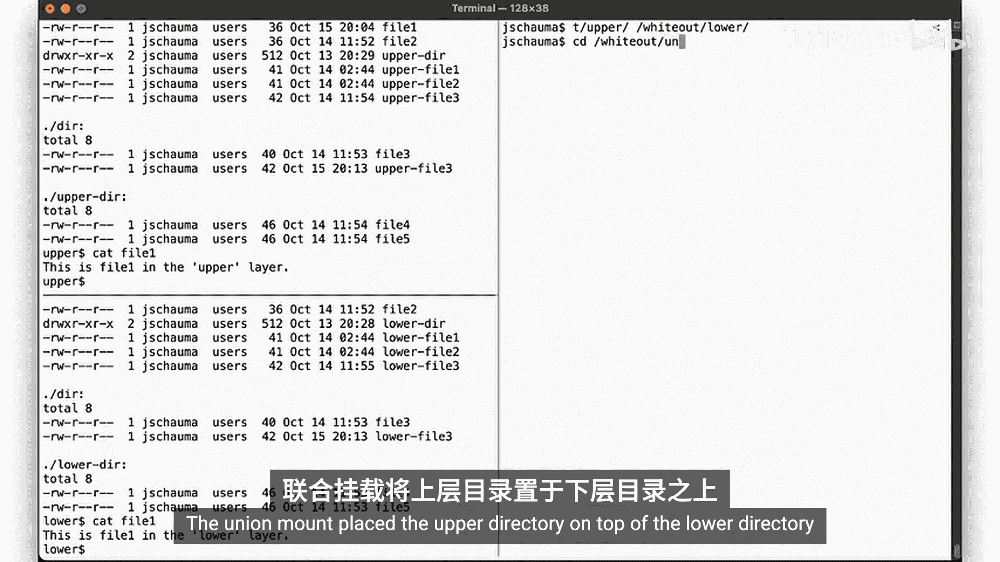
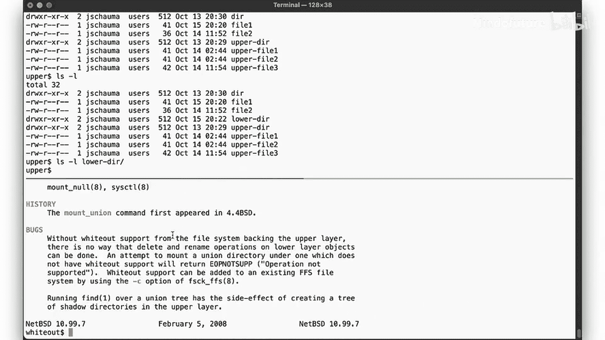
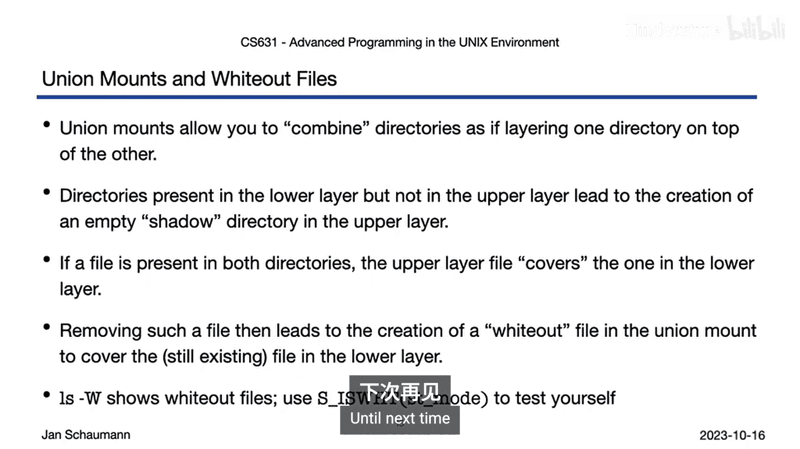

# 072：Union Mounts与Whiteout文件 🔍





在本节课中，我们将要学习UNIX文件系统中的两个高级概念：联合挂载（Union Mounts）和白化文件（Whiteout Files）。我们将从`struct stat`中未提及的一种特殊文件类型开始，逐步解释其作用原理，并通过实际操作演示其行为。

## 概述

在之前的课程中，我们详细讨论了`struct stat`结构体，它提供了文件的元信息，包括文件权限和类型。我们提到了常规文件、目录、套接字和符号链接等类型，但有一种特殊文件类型尚未涉及，即白化文件。本节课将解释白化文件的作用及其产生的背景——联合挂载。

## 联合挂载（Union Mounts）简介

上一节我们介绍了文件类型的基本概念，本节中我们来看看联合挂载。联合挂载允许你将两个目录的内容合并，使其在单一位置可见。这通过将一个目录挂载在另一个目录之上来实现，从而展示两个目录的联合内容。

以下是联合挂载的基本操作步骤：

1.  准备两个目录，例如`directory1`和`directory2`。
2.  使用`mount_union`命令将`directory2`挂载到`directory1`之上。
3.  访问挂载点，你将看到两个目录内容的合并视图。

## 白化文件（Whiteout Files）的作用

当在联合挂载的顶层目录中删除一个文件，而该文件在底层目录中仍然存在时，就会出现一个问题：删除操作不应让底层文件意外显现。为了解决这个问题，联合文件系统会动态生成一个白化文件。



白化文件的核心作用是**在联合挂载的视图内隐藏底层文件中仍然存在的文件**。它本身不是一个真实的文件，而是一个占位符。当卸载联合文件系统后，白化文件会自动消失。



## 实践演示：联合挂载与白化文件





现在，让我们通过一个实际例子来观察联合挂载和白化文件的行为。

### 实验准备

我们创建两个目录：`lower`（底层）和`upper`（顶层）。它们的初始内容如下：



**upper目录内容：**
```
file1 (内容: "This is file1 in the upper directory")
file2
subdir/file3 (内容: "This is file3 in the upper directory")
upper_file
upper_dir/
```

**lower目录内容：**
```
file1 (内容: "This is file1 in the lower directory")
file2
subdir/file3 (内容: "This is file3 in the lower directory")
lower_file
lower_dir/
```

### 创建联合挂载

我们执行以下命令创建联合挂载：
```bash
mount_union upper lower
cd lower  # 此时‘lower’目录是联合视图的挂载点
```
在联合视图（即`lower`目录）中执行`ls -l`，你会看到`upper`和`lower`目录内容的合并。对于同名文件（如`file1`、`subdir/file3`），显示的是顶层（`upper`）版本。

### 观察白化文件的产生

在联合视图中删除`file1`：
```bash
rm file1
```
此时，使用`ls -l`看不到`file1`。但使用`ls -lW`命令（`-W`选项用于显示白化文件），你会看到一个特殊的条目：
```
W--------- 1 user wheel 0 Jan 1 00:00 file1
```
这个类型为`W`、链接数和大小均为0的文件就是**白化文件**。它掩盖了底层目录中仍然存在的`file1`。

### 卸载与状态还原

卸载联合文件系统：
```bash
umount lower
```
检查原始目录：
*   `lower/file1` 依然存在且内容未变。
*   `upper/file1` 已被删除。
*   白化文件已随联合挂载的卸载而消失。

### 其他行为：影子目录（Shadow Directories）

如果在联合视图中访问一个仅存在于底层目录的子目录（例如`lower_dir`），系统会在顶层目录自动创建一个对应的**影子目录**。这个目录在顶层是空的，但确保了路径结构在联合视图中的一致性。

## 核心概念总结



本节课中我们一起学习了以下核心概念：

1.  **联合挂载**：将两个目录层叠合并的机制，顶层目录内容覆盖底层同名内容。
2.  **白化文件**：一种特殊的文件类型（`S_ISWHT(mode)`），用于在联合挂载中标记底层已被删除的文件，防止其暴露。可通过`ls -W`查看。
3.  **文件类型检测**：在代码中，可以使用`S_ISWHT(mode)`宏来检测一个文件是否为白化文件，就像使用`S_ISREG()`或`S_ISDIR()`一样。
    ```c
    #include <sys/stat.h>
    if (S_ISWHT(st.st_mode)) {
        // 这是一个白化文件
    }
    ```
4.  **系统依赖性**：白化文件和联合挂载的支持程度依赖于操作系统和文件系统。本课示例基于NetBSD，其他UNIX变体的实现可能有所不同。

## 总结



在本节课中，我们探讨了UNIX中的联合挂载机制及其产生的白化文件。联合挂载提供了合并目录内容的能力，而白化文件则巧妙地解决了在联合视图中删除文件时可能出现的逻辑冲突。理解这些概念有助于你深入理解某些文件系统（如OverlayFS、UnionFS）的工作方式。请注意，这些功能是系统相关的，在实际编程和应用时应查阅相关操作系统的手册页（man page）以确认其支持与具体行为。