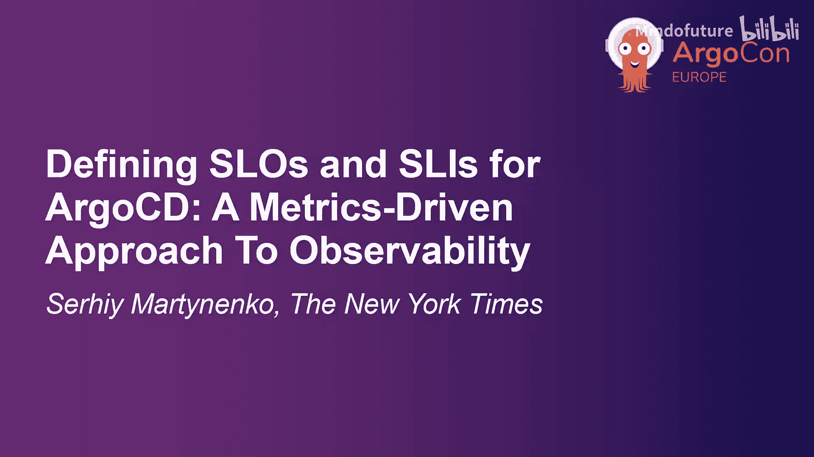
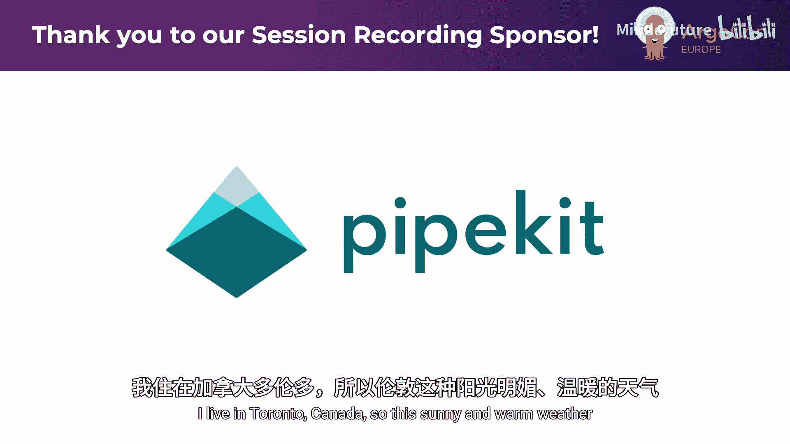
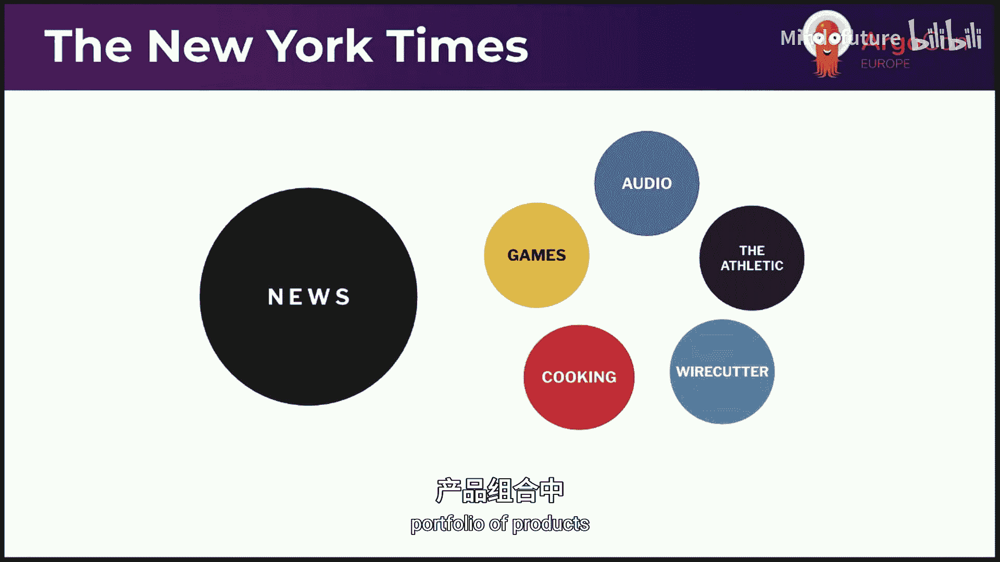
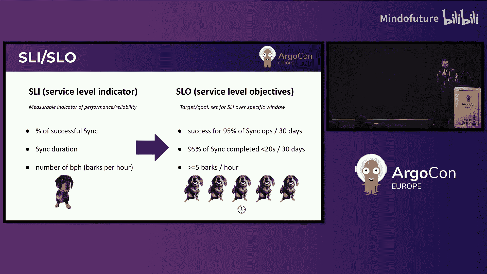
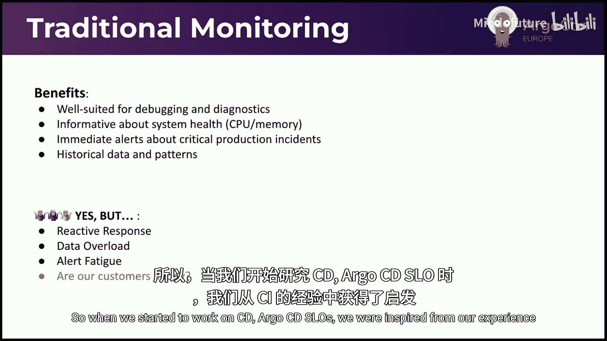
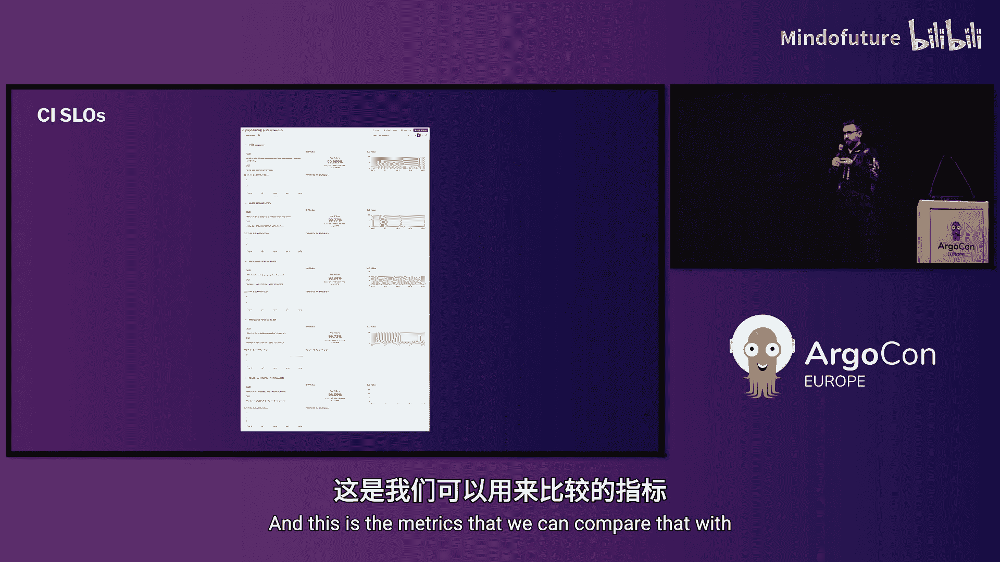
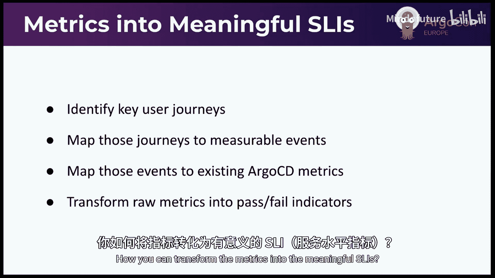
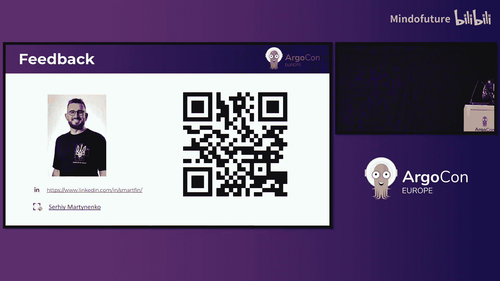

# 001：为 ArgoCD 定义 SLO 与 SLI —— 一种基于指标的可观测性方法

在本节课中，我们将学习如何为 ArgoCD 定义服务等级目标（SLO）和服务等级指标（SLI）。这是一种以指标驱动的方法，旨在提升系统的可观测性，并确保服务可靠性符合用户期望。

## 核心概念介绍

上一节我们介绍了课程主题，本节中我们来看看几个核心概念。

**服务等级指标** 是一个可测量的指标，用于指示系统的性能或可靠性。对于 ArgoCD，示例可以是同步操作的成功百分比或同步操作的持续时间。

**服务等级目标** 是为 SLI 设定的目标，需要在特定时间段内达成。对于 ArgoCD 的示例，目标可以是：在过去 30 天内，95% 的同步操作应在 20 秒内成功完成。

## 传统监控方法的利弊

传统监控方法是多年来系统可靠性的重要支柱。当需要调试某些事件或性能下降时，它是一个很好的工具。你可以构建仪表板，一眼就能看到所有系统信息。

以下是传统方法的一些优点：
*   它提供了历史数据和图表，使你能够分析并发现模式。
*   即时警报可以大大减少事件响应时间。

然而，传统方法也存在一些缺点：
*   它往往是反应式的。收到警报时，问题已经对客户产生了影响。
*   过多的警报会导致警报疲劳和数据过载。
*   一个最大的问题是：这些指标能回答“你的客户对服务满意吗”这个问题吗？

## SLO 与 SLI 方法的转变

SLO 和 SLI 方法改变了我们看待服务可靠性的方式。我们应该选择以客户为中心的指标，即那些对客户重要且有用的指标。

拥有**错误预算**为你提供了一个工具和框架，让你可以采用数据驱动的方法来选择下一步工作的优先级。简单来说，如果你的 SLO 是 99.9%，那么剩余的 0.1% 时间或错误事件就是你的错误预算。这是你假设可以接受的服务降级水平。

## 为 ArgoCD 定义 SLO 的实践步骤

当我们开始为 ArgoCD 制定 SLO 时，我们从 CI 系统的经验中获得了灵感。最初，我们面对 ArgoCD 提供的数十个指标感到无从下手。这些指标并没有帮助最终用户更好地理解我们系统的健康状况。

因此，我们退后一步，思考如何将指标转化为有意义的 SLO。以下是我们的方法：

首先，你需要识别关键用户旅程。思考用户在系统中为实现目标所采取的关键路径。然后，将这些旅程映射到每个步骤上的一些可测量事件。接着，这些事件应转化为来自 ArgoCD 或其周边系统的可用指标，以帮助你构建指标并将其转化为布尔指示器（成功或失败）。最后，你可以计算成功事件或失败事件的百分比。

一旦我们定义了指标，就需要为它们设定目标。如何做到这一点？首先，分析历史性能数据。基于此，我们可以设定既可实现又对我们平台工程师有意义的目
标。同时，我们还需要考虑用户期望和业务需求。我们的系统平台需要足够好，以满足他们的使用。

一个好的建议是从保守的目标开始，在达到较低目标后再向更高目标迈进。当然，由于在关键路径上的重要性不同，我们系统的不同组件可能有不同的目标。最后，我们始终需要与客户沟通，并根据他们的反馈进行调整。

## ArgoCD 部署流程与常见瓶颈

让我们思考一下 ArgoCD 内部部署流程中可能出现的常见瓶颈。以下是简化的部署流程：
1.  ArgoCD 触发检测（通过 Webhook 或从 Git 拉取）。
2.  获取 Git 仓库源码。
3.  通过 Helm 和 Kustomize 生成清单。
4.  应用控制器协调，获取应用期望状态并计算需应用的差异。
5.  使用 Kubernetes API 更新和创建新资源。
6.  评估这些资源的健康状况。
7.  同步完成，触发同步后钩子。
8.  发送配置的通知。

以下是该流程中常见的瓶颈：
*   **Git 操作**：大型仓库、网络问题或同时处理大量仓库可能导致请求耗时显著增加。
*   **清单生成**：复杂的 Helm 图表可能需要大量时间处理。
*   **资源更新与协调**：严重依赖目标 Kubernetes 集群的 API 速度。
*   **用户界面**：用户习惯通过 UI 检查部署状态，如果 UI 不可用或缓慢，会让他们感到焦虑。

但我们需要记住，这是我们作为平台工程师对部署旅程和流程的看法。对于许多开发者来说，他们需要简单性：提交代码，然后“黑箱”完成部署。对他们来说，重要的问题是：我的代码是否成功部署？部署花了多长时间？我能否检查部署状态？

## 优化 SLO 与 SLI 列表

我们开始着手改进 SLO 和 SLI 列表。首先，我们移除了一些不必要或无用的指标。例如，ApplicationSet 在我们平台中仅用于创建新服务，且服务上线流程耗时较长，但我们从未收到相关投诉，因此决定暂时隐藏这些指标。

接下来是重新审视一些 SLI 的查询。例如，最初我计算了所有事件，但后来意识到我们的 ArgoCD 同时处理生产和非生产环境的部署，包括一些设计上允许失败的预发布环境。因此，在查询中，我选择了仅针对生产目标集群的指标。

最后，我将一些指标合并为更复杂的查询。例如，Git 请求性能原本为不同类型的请求单独计算，但可以创建一个包含不同目标的查询，并将其合并为一个指标。

## 修订后的 SLO 列表示例

以下是修订后的 SLO 列表示例（部分目标仍在优化中）：
*   **应用健康与同步成功率**：仅计算生产环境的应用。
*   **Repo 服务器 Git 请求性能**：衡量 Git 操作性能。
*   **Pending Git 请求**：计算 5 分钟间隔内的最大值，有助于捕获未被第一个 SLI 覆盖的卡住事件。
*   **Pending Kubernetes 请求**：对 Kubernetes API 请求采用相同方法。
*   **Kubernetes 请求可靠性**：将 404 视为成功事件，因为并非所有资源在部署前都存在于目标集群。
*   **应用控制器协调性能**：为生产和非生产环境设置不同的 SLO。
*   **队列等待时间**：一个复杂的查询，合并了不同类型工作队列的计算，但设置了不同的目标。

为了弥补合并查询可能降低的可见性，我们构建了补充仪表板。例如，左侧显示一个错误率的数字，右侧则用图表展示不同类型事件的情况，这样就能清晰地看出是协调队列出了问题。

## 后续步骤与总结

我们可能的后续步骤包括：
*   **持续改进**：重新审视 SLO，并与关注它们的人员保持沟通。
*   **更新仪表板**：添加更多像上一节提到的补充图表。
*   **利用 CI 指标**：使用 CI 系统的指标来计算与 Git 流程相关步骤的性能和可靠性。
*   **利用 Webhook**：构想利用 ArgoCD 的 Webhook 通知来构建服务，计算端到端部署时间或应用处于不同步状态的时间等高级指标。

本节课中我们一起学习了为 ArgoCD 定义 SLO 和 SLI 的方法。总结如下：
1.  谨慎选择能代表系统潜在问题的正确指标和查询。
2.  在错误预算耗尽时设置警报，以便主动处理系统可靠性和性能问题。
3.  持续改进并与 SLO 的利益相关者保持沟通。
4.  采用基础设施即代码的方法（如 Terraform）来管理 SLO 配置，便于迭代和回滚。
5.  保持 SLO 简单明了：一个简单的数字，辅以解释性的附加信息。

感谢你的关注。