# 002：使用 Argo Rollouts 和 Kubernetes Gateway API 实现多向流量渐进式交付

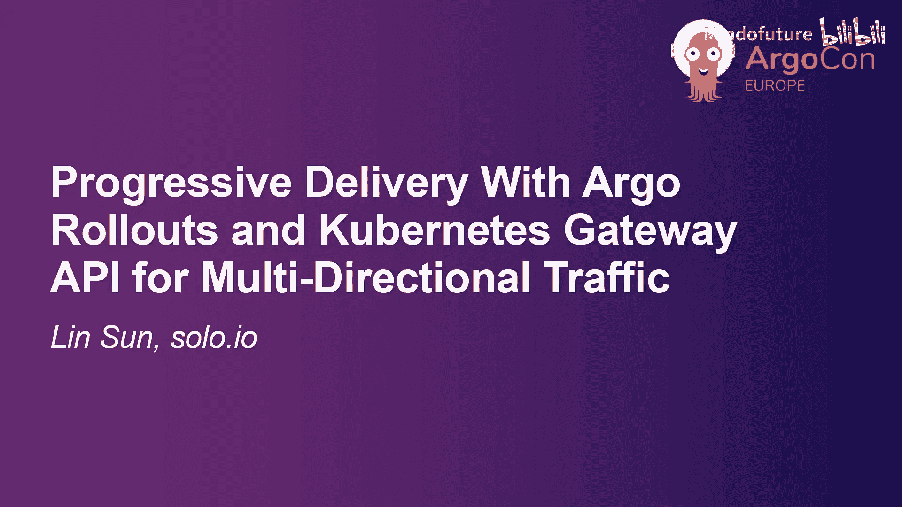

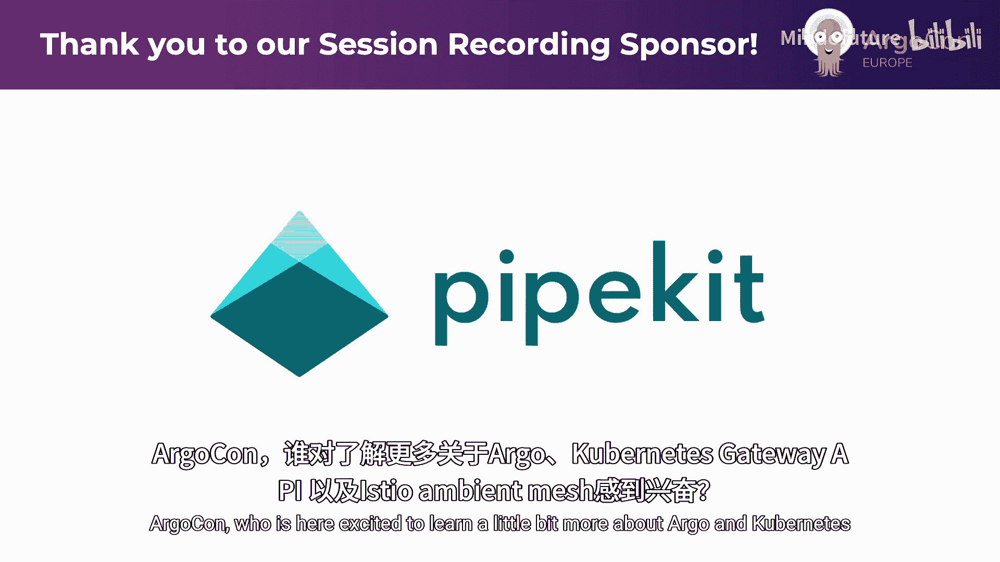

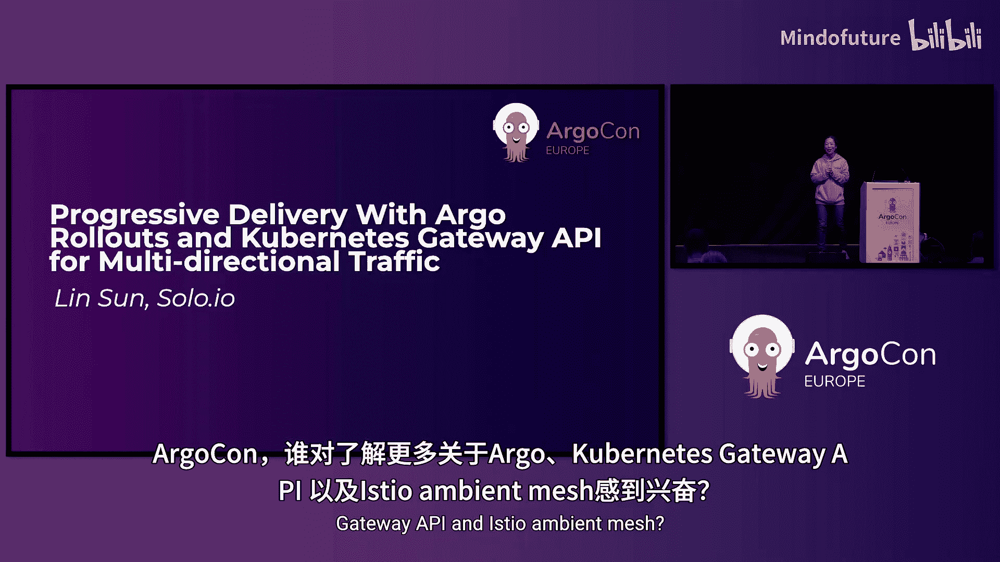

## 概述
在本节课中，我们将学习如何结合使用 **Argo Rollouts**、**Kubernetes Gateway API** 和 **Istio Ambient Mesh** 来实现一个面向生成式 AI 应用的、安全且可观测的渐进式交付流程。我们将通过一个实际演示，展示如何控制入口、出口和东西向流量，并安全地推出新版本应用。

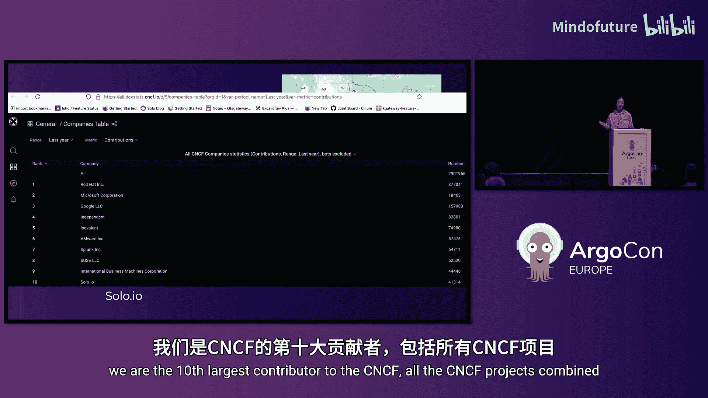

---

## 自我介绍与背景

我的名字是 Lynn Song，是 Solo.io 公司的开源负责人。我来自美国东海岸北卡罗来纳州的一个小镇。今天早上我了解到，我的公司是所有 CNCF 项目的最大贡献者，这让我作为开源负责人感到非常自豪。

今天，我将向大家介绍 Kubernetes Gateway API、Istio Ambient Mesh 和 Argo Rollouts，并展示一个我自己开发的生成式 AI 演示应用。

---

## 核心组件介绍

上一节我们进行了简单的介绍，本节中我们来看看演示中将用到的几个核心项目和概念。

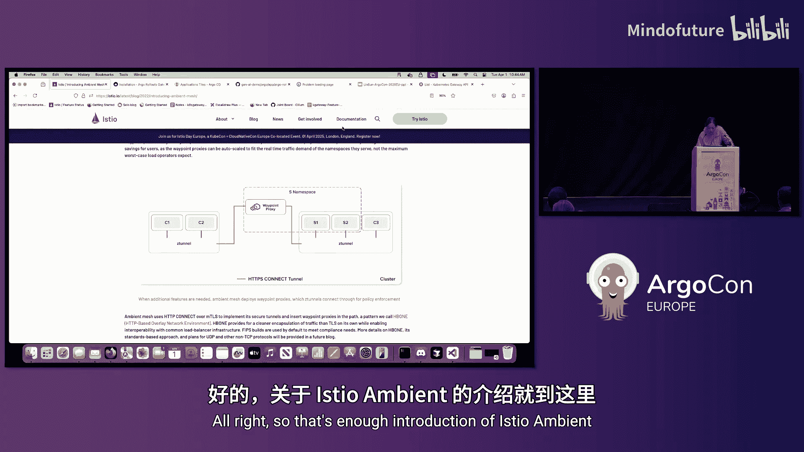

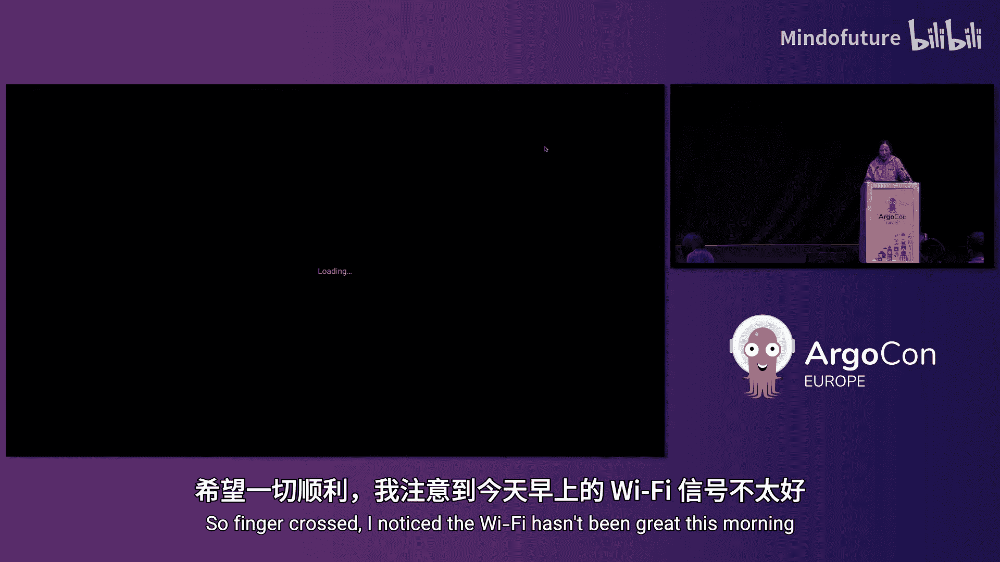

以下是本次演示将使用的主要组件：
*   **Kubernetes**：作为基础容器编排平台。
*   **FluxCD**：用于 GitOps 持续交付。
*   **Istio & Gateway API**：用于服务网格和流量管理。
*   **Argo Rollouts**：用于实现金丝雀发布等渐进式交付策略。
*   **Streamlit**：用于构建演示应用的前端 UI。
*   **Prometheus & Kiali**：用于监控和可视化服务网格流量。
*   **Ollama**：用于在本地运行大型语言模型（LLM）。

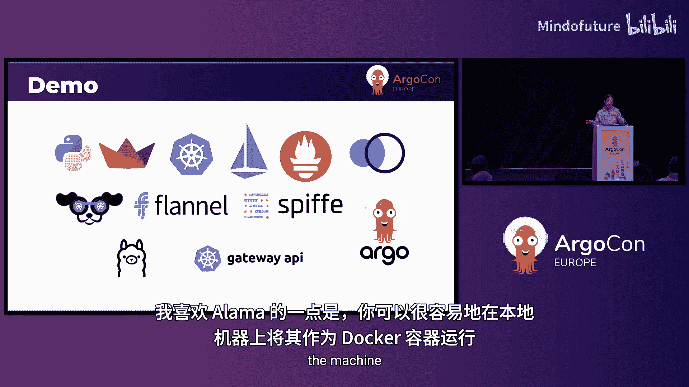

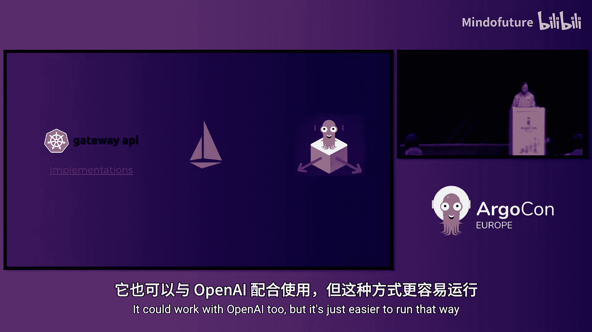

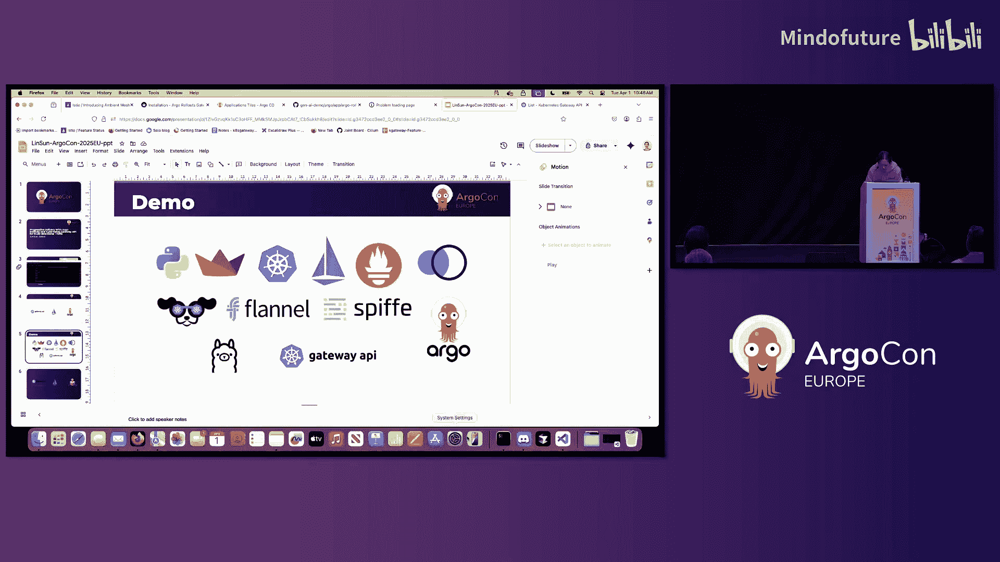

---

## Istio Ambient Mesh 简介

在深入演示之前，我们需要先理解 Istio Ambient Mesh 的核心概念。它与传统 Istio 的主要区别在于架构。

传统 Istio 在每个应用 Pod 中注入一个 Envoy 代理（sidecar）。而 Ambient Mesh 引入了两种新的组件：
1.  **ztunnel**：这是一个运行在节点上的 L4 代理，用于处理节点上所有 Pod 的相互 TLS（mTLS）和简单的授权策略。它用 Rust 重写，比 Envoy 更轻量。
2.  **waypoint proxy**：这是一个按需部署的 L7 代理。租户（例如命名空间）可以共享一个 waypoint 代理来处理 HTTP、gRPC 等 L7 流量，从而将代理与业务 Pod 解耦。

启用 Ambient 模式非常简单，只需为命名空间添加标签即可，无需重启应用 Pod。

```yaml
# 启用 Ambient Mesh 并指定使用 waypoint 代理
kubectl label namespace default istio.io/dataplane-mode=ambient
kubectl label namespace default istio.io/use-waypoint=true
```

---

## 演示环境概览

现在，让我们进入实际的演示环节。首先，我来展示一下预先设置好的 Kubernetes 集群环境。

我的 Kind 集群中已经安装了以下组件：
*   Argo Rollouts 控制器
*   Argo CD
*   一个简单的客户端应用（用于发送 curl 请求）
*   演示用的 AI 应用
*   部署在 `default` 和 `egress-istio` 命名空间中的 waypoint 代理
*   Istio Ingress Gateway
*   Istio Ambient（包含 ztunnel）
*   Prometheus 和 Kiali
*   在集群外本地运行的 Ollama（LLM 服务）

为了控制出口流量（例如访问集群外的 Ollama），我创建了一个 **ServiceEntry** 资源。它指示流量在访问特定主机时，应该经过 `egress` 命名空间的 waypoint 代理。

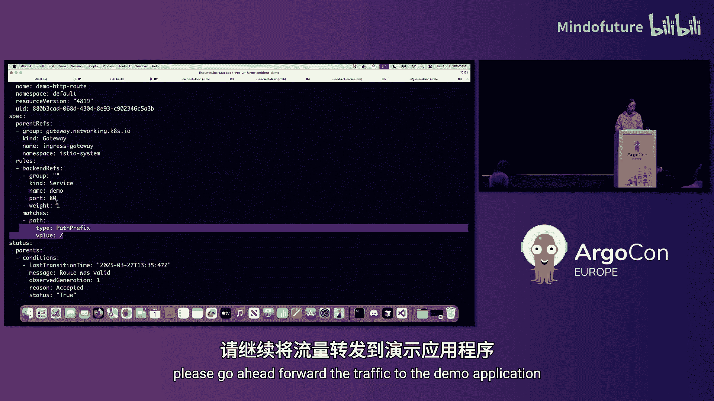

同时，我使用 **Kubernetes Gateway API** 定义了三种网关类（GatewayClass）来控制不同方向的流量：
*   **ingress** 类：控制从集群外部进入的流量。
*   **egress** 类：控制从集群内部流向外部服务的流量。
*   **waypoint** 类：控制集群内部服务间的东西向流量。

Gateway API 的 `status` 字段对于调试非常有用。

---

## 演示第一部分：基础应用与流量可视化

一切就绪，让我们启动演示应用。首先，我将端口转发到 Istio Ingress Gateway，以便从外部访问应用。

应用前端是一个简单的界面，允许用户提问。我问了第一个问题：“伦敦最值得做的三件事是什么？”。请求的流向是：
1.  用户 -> Istio Ingress Gateway
2.  Ingress Gateway -> 演示应用 Pod
3.  演示应用 Pod -> `egress` waypoint 代理
4.  `egress` waypoint 代理 -> 集群外的 Ollama 服务（使用 Llama2 模型）

现在，让我们在 **Kiali** 控制台中查看流量图。你可以清晰地看到请求是如何流经各个组件的：从 Ingress Gateway，到应用，再到 waypoint，最后到达外部服务。所有流量都通过 mTLS 进行了加密。

---

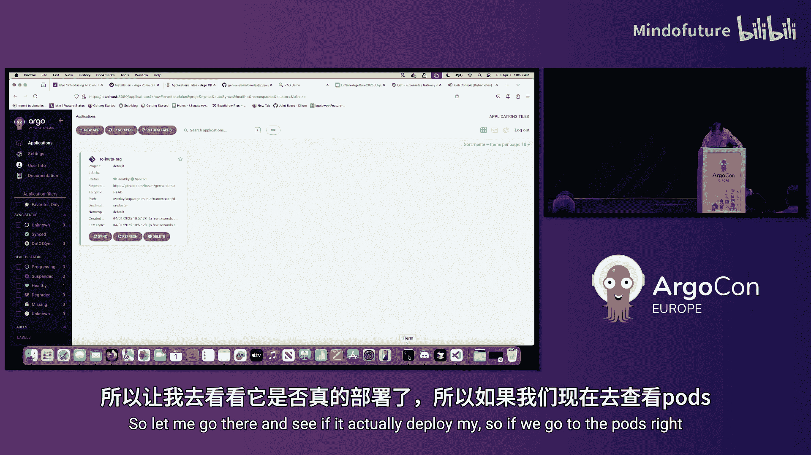

## 演示第二部分：集成 RAG 与 Argo Rollouts 发布

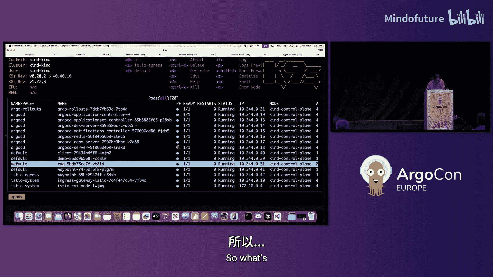

我对当前应用的回答质量不满意，因为它对特定领域知识（如 Argo Rollouts 和 Ambient Mesh）不了解。为了解决这个问题，我决定集成一个 **RAG（检索增强生成）** 微服务，它能够基于我提供的文档来回答问题。

我使用 **Argo CD** 来部署这个新的 RAG 服务。Argo CD 会监控我的 Git 仓库，并将其中定义的 Kubernetes 资源同步到集群中。这些资源包括：
*   RAG 服务的 Deployment 和 Service。
*   一个 **Rollout** 资源，定义了金丝雀发布策略。
*   一个 **AnalysisTemplate**，用于在发布过程中基于 Prometheus 指标（如 HTTP 成功率）进行自动验证。

部署完成后，我尝试上传一个关于 Ambient Mesh 的 PDF 文档，并再次提问。这次，RAG 服务成功地基于文档给出了准确的回答。

---

## 演示第三部分：执行金丝雀发布

虽然 RAG v1 能处理 PDF，但我希望 v2 版本还能支持 TXT 文件。我已经构建并推送了新的镜像。

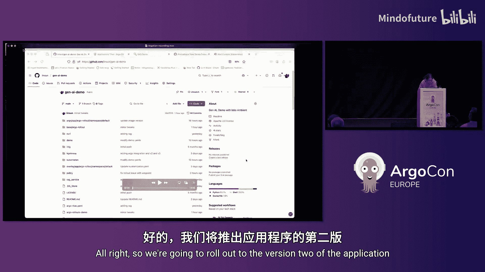

现在，我们使用 **Argo Rollouts** 来执行一次金丝雀发布，将应用从 v1 升级到 v2。

```bash
# 触发 Rollout，更新镜像版本
kubectl argo rollouts set image rag rag=your-image:v2
```

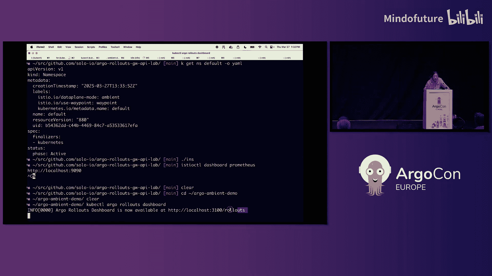

Rollout 过程开始：
1.  **暂停 - 手动验证**：首先，v2 的 Pod 启动，但流量不会自动过去。我通过设置特定的 HTTP 头（`X-Canary: rollout-canary`）将我的测试流量导向 v2，并验证 TXT 文件上传功能是否正常。
2.  **自动推进 - 60% 流量**：在 Argo Rollouts 仪表板上，我点击“Promote”。Rollout 进入下一阶段，将 60% 的流量切到 v2。Argo Rollouts 会自动查询 `AnalysisTemplate` 中定义的 Prometheus 指标，检查错误率。
3.  **自动推进 - 100% 流量**：由于指标健康，Rollout 自动完成，将 100% 流量切换到 v2，并逐步终止 v1 的 Pod。

在整个过程中，**Kubernetes Gateway API** 的 **HTTPRoute** 资源与 Argo Rollouts 协同工作，动态地将流量权重在 `stable` 和 `canary` 服务之间进行分配。

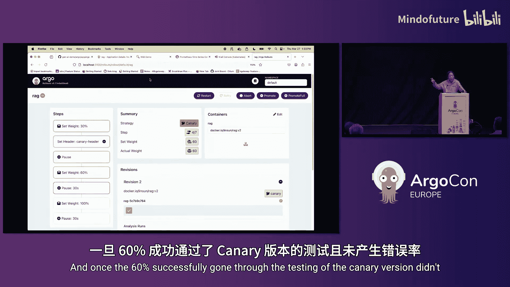

---

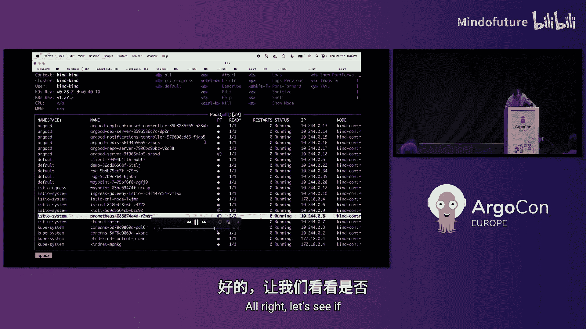

## 总结与挑战

本节课中，我们一起学习了如何构建一个现代化的云原生应用交付流水线。我们整合了多项技术：
*   使用 **Kubernetes Gateway API** 统一管理了入口、出口和东西向流量。
*   利用 **Istio Ambient Mesh** 提供了零信任安全层（mTLS），而无需修改应用。
*   通过 **Argo Rollouts** 实现了安全、自动化的渐进式发布。
*   借助 **Prometheus 和 Kiali** 实现了发布过程的可观测性。

最终，我们成功地将一个不理解领域知识的 AI 应用，通过集成 RAG 和安全地金丝雀发布，升级成了一个能够基于特定文档进行智能回答的应用。

我的挑战是：在了解了如何使用 Gateway API、Ambient Mesh、Argo Rollouts 和 Kubernetes 构建如此酷炫的应用之后，请你也动手构建一些有趣的东西吧！也许我们能在下一届 ArgoCon 大会上见到你的分享。

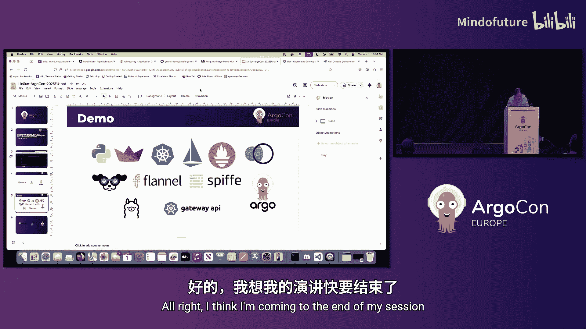

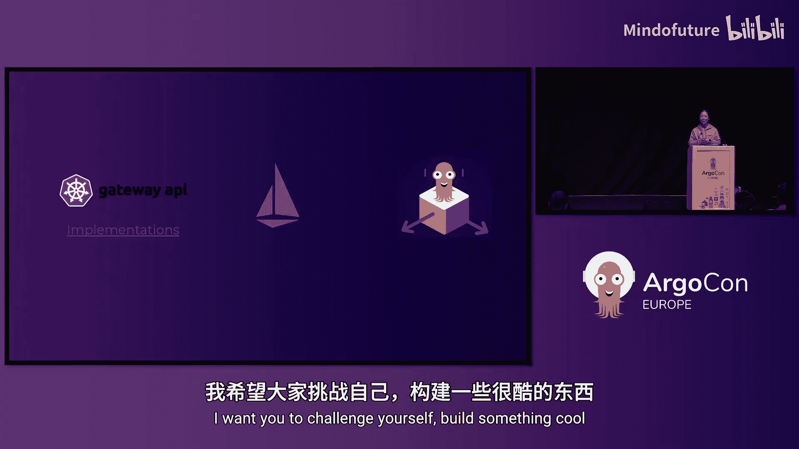

---