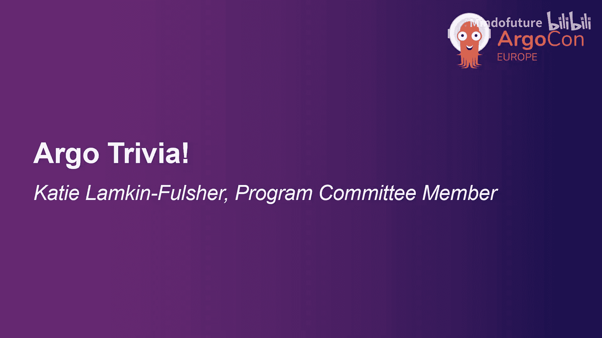
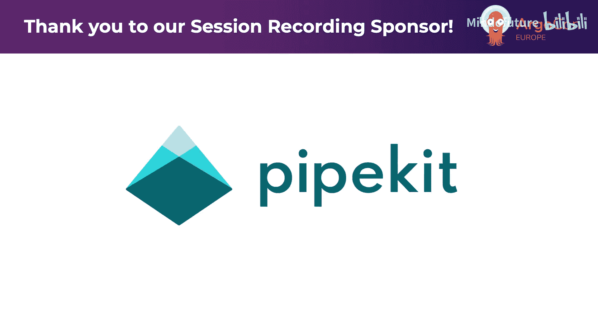
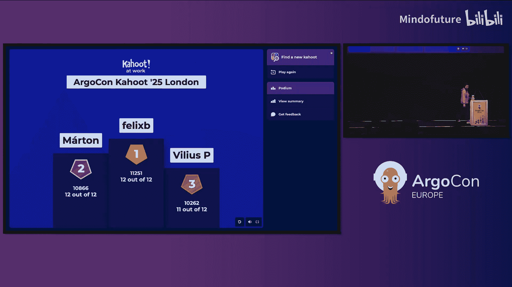

# 003：Argo 知识问答！

在本节中，我们将通过一个模拟的问答环节，快速回顾和测试关于 Argo 项目及其子项目的核心知识。我们将逐一解析问答中涉及的关键概念，帮助你巩固理解。

现在，让我们开始问答。

第一个问题：什么是 Argo 项目？

大多数人都答对了。Argo 是一个开源的云原生工具集，用于在 Kubernetes 上运行工作流、管理集群以及实现 GitOps 风格的持续交付。

第二个问题：哪个 Argo 子项目主要用于基于声明式 GitOps 的持续交付？

这个问题比较简单。答案是 **ArgoCD**。ArgoCD 是一个为 Kubernetes 而生的声明式 GitOps 持续交付工具。

上一节我们介绍了 ArgoCD 的用途，本节中我们来看看它的一个核心功能。

第三个问题：ArgoCD 的哪个功能能够实现 Git 仓库中应用清单的自动同步？

这个问题稍有难度。答案是 **自动同步（Auto-Sync）**。当启用此功能后，ArgoCD 会持续监控 Git 仓库，并在检测到清单文件与集群中运行的应用状态不一致时，自动进行同步。

接下来，我们关注另一个重要的子项目：Argo Rollouts。

第四个问题：Argo Rollouts 提供哪些高级部署策略？

今天上午已经有几个关于 Rollouts 的演讲，看看大家是否认真听了。答案是 **蓝绿部署和金丝雀发布**。Argo Rollouts 扩展了 Kubernetes 的 Deployment 资源，提供了这些更安全、可控的部署方式。

那么，Argo Rollouts 具体扩展了哪种 Kubernetes 资源呢？这就是我们的下一个问题。

第五个问题：在 Argo Rollouts 中，它扩展了哪种 Kubernetes 资源来实现渐进式交付？

答案是 **Deployment**。Argo Rollouts 通过自定义资源定义（CRD）引入了 `Rollout` 资源，它是对标准 Kubernetes Deployment 的增强。

现在，让我们转向用于事件驱动的子项目：Argo Events。

第六个问题：事件源（Event Source）在 Argo Events 中扮演什么角色？

很好，看来大家都了解 Argo Events。事件源负责 **从外部系统（如 webhook、消息队列、日历等）检测和消费事件**，并将其转化为 Argo Events 可以处理的内部事件。

了解了事件源，我们来看看触发器。以下是关于 Argo Events 触发器的问题。

第七个问题：以下哪项不是 Argo Events 中有效的触发器？

这个问题难住了一些人。常见的有效触发器包括启动一个 Argo Workflow、发送一个 Slack 消息等。无效的选项需要根据具体题目判断，但核心在于理解触发器是用于定义事件发生后要执行的动作。

接下来，我们回到 Argo Workflows。

第八个问题：使用 Argo Workflows 进行 Kubernetes 原生工作流编排的主要优势是什么？

除了它来自最棒的开源项目这一点。主要优势在于它能够 **将复杂的工作流定义为 Kubernetes 资源**，利用 Kubernetes 的调度、资源管理和弹性能力来运行多步骤的流水线或批处理作业。

现在，让我们深入一些中级问题，看看 ArgoCD 如何管理应用状态。

第九个问题：ArgoCD 如何检测 Kubernetes 应用中的漂移？

答案是 **通过持续比较 Git 仓库中声明的期望状态与 Kubernetes 集群中的实际运行状态**。当两者不一致时，ArgoCD 会将其标记为“不同步（OutOfSync）”。

最后是两个趣味知识题。

第十个问题：Argo 吉祥物头盔里有什么？

这可能是最难的问题。答案是 **太空章鱼**。Argo 的吉祥物是一只戴着太空头盔的章鱼，象征着其灵活、多触手（集成多工具）且适用于云原生“太空”的特性。

第十一个问题：第一届 ArgoCon 在哪里举行？

对于元老级用户来说，应该知道。答案是 **线上虚拟会议**。早期的 ArgoCon 是以虚拟形式举办的。

问答环节结束。恭喜获奖者！

以下是本场问答的最终排名：
*   第三名：Villiaus
*   第二名：Martton
*   第一名：Felix B

请注意，下一场演讲将在10分钟后开始。

本节课中我们一起学习了 ArgoCD 的自动同步与漂移检测、Argo Rollouts 的部署策略及其扩展的 Kubernetes 资源、Argo Events 的事件源与触发器角色，以及 Argo Workflows 的编排优势。通过问答形式，我们快速回顾了这些核心概念，希望帮助你加深对 Argo 项目生态的理解。

