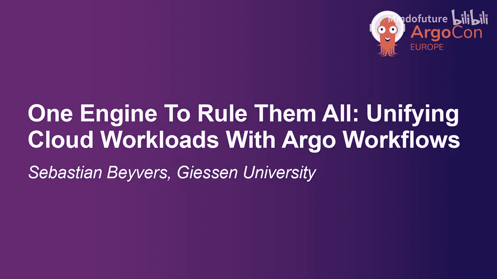
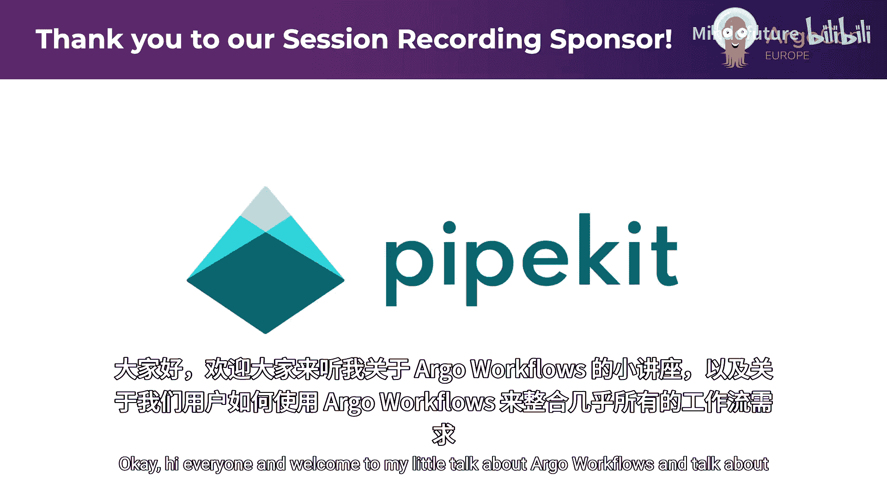
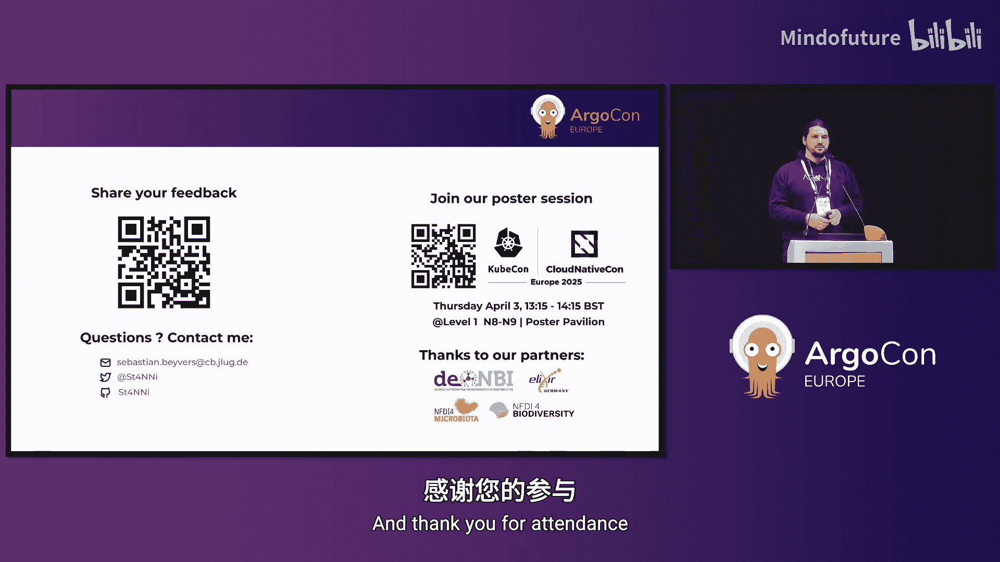

# 005：一统江湖的引擎——使用 Argo Workflows 统一云工作负载





在本节课中，我们将探讨如何利用 Argo Workflows 作为统一的调度引擎，来整合和管理多样化的云工作负载。我们将从背景和问题出发，介绍两种核心策略（迁移与集成），并通过具体示例说明实现方法，最后总结成果与展望。

## 背景介绍

我是 Sebastian，来自德国吉森大学，是一名分布式系统研究员和 DevOps 工程师。我们团队专注于云计算，特别是从计算角度为生命科学研究提供支持。作为生物信息学背景的研究者，我们需要处理海量序列数据的计算任务，因此对计算能力有很高要求。

我们大学是德国一个大型网络的一部分，为生命科学研究人员提供社区云服务。研究人员可以免费获得存储、计算等资源。我们提供了 OpenStack 环境，并大量投资于 Kubernetes，这也是我们今天讨论 Argo Workflows 的原因。此外，我们还拥有一些 HPC 实例和供用户使用的虚拟机。

我们的 Argo Workflows 之旅始于大约五年前。我的硕士论文主题就是关于如何利用 Kubernetes 和 Argo Workflows 来满足计算需求。我们在这方面相当成功，目前运行着近 12 个集群用于计算任务，最大的一个集群拥有约 5000 个核心。我们有些工作流会运行数天甚至数周，有些工作流则拥有大量 Pod（我见过最大的约有 3 万个 Pod）。我们主要将这些工作流用于分析任务：用户提交数据，进行分析，然后获得结果和可视化报告。

我们开发的一个非常有用的模式是：一个 Kubernetes 集群、一个允许用户上传数据的 Web 前端、一个简单的 API。这个 API 与 Argo Workflow 集群通信，基于工作流模板调度工作流。通过这种方式，我们建立了一个易于使用的按需计算系统。

## 为什么选择 Argo Workflows？

我们选择 Argo Workflows 的原因如下：
*   **灵活性高**：几乎可以用它完成所有任务。
*   **可扩展性强**：拥有插件系统和工作流模板，可以作为工作流的构建块。
*   **易于 API 访问**：可以通过标签和注解将数据与工作流一起存储，这样后端就不需要数据库了。
*   **事件系统完善**：可以通过外部事件触发工作流，便于与消息队列等外部世界进行深度自动化集成。
*   **与 Kubernetes 深度集成**：作为 Kubernetes 上事实标准的工作流引擎，几乎是唯一选择。
*   **生态系统庞大**：例如 Python 库、ArgoCD 集成、Argo Rollouts 等，使用起来非常方便。

## 面临的问题

然而，我们的现实情况有所不同。我们有许多用户，其中大多是博士生，他们带着自己的想法和各自的工作流引擎而来。因此，我们不得不管理一个由众多工作流引擎、工具和环境组成的“大杂烩”。其中很多系统在开发者离开后仍需维护，这给我们带来了巨大的管理负担。

公有云的承诺是“一切尽在掌握”，提供统一包装和 API。但自己搭建时，往往会得到许多专为特定场景设计的工具，它们不易集成，且维护成本高昂。这样做的好处是独立自主、数据保护更强，但缺点也很明显：同时维护数十个系统需要大量人力资源和专业知识，新成员上手也非常困难。

## 解决方案：统一调度引擎

大约两年前，我们提出了一个问题：**Argo Workflows 能否成为我们所有任务的通用调度引擎？**

最初的答案是“也许”。经过进一步思考，我们认为答案是“可以”。为此，我们制定了两种策略：

1.  **迁移**：将现有工作流改造成 Argo Workflow。
2.  **集成**：对于无法轻易迁移的系统，保持原样，使用 Argo Workflow 作为触发器来启动、监控并收集结果。

### 决策依据

我们制定了一些决策指标：
*   **是否有硬性要求**（如法规要求）必须使用现有系统？如果是，则只能选择**集成**。
*   工作流是否**非常复杂或小众**？如果是，**集成**可能是更好的策略。
*   团队是否拥有足够的**现有解决方案的专业知识**？如果只有一名即将毕业的博士生在维护，那么**迁移**的压力就很大。
*   你的流水线是否**可移植**？是否已经是**容器化**的？迁移到容器有时也很棘手。

## 策略一：迁移示例

我们尝试迁移了一些 HPC 工作负载。我们的 Slurm 集群中有许多工作流可以很容易地用 Argo Workflows 重写，因为它们模式简单：数据输入、处理、结果输出。

遇到的主要挑战包括：
*   **共享文件系统**：Slurm 集群通常有共享存储，而在 Argo 中可能需要通过对象存储（如 S3）或 `ReadWriteMany` 卷来传递数据。
*   **共享权限**：需要将 HPC 用户和基于角色的访问控制迁移到 Kubernetes 集群。
*   **内部数据库访问**：Kubernetes 集群可能无法直接访问某些内部数据库。
*   **专用硬件**：如 FPGA、GPU 等，需要在 Kubernetes 集群中提供同等能力。

对于 Apache Airflow 工作流，如果它们主要使用 Python 函数，那么迁移到使用 **Hera**（一个用于构建和运行 Argo Workflows 的 Python 库）就非常直接。通常可以重用原有函数，只需少量修改，一两天就能完成迁移。

对于无服务器函数（我们之前主要使用 Apache OpenWhisk），如果主要是 Python 函数，迁移也很容易。我们使用 **UV 模板**，UV 是一个快速的 Python 包安装器和解析器。它的优点是可以内联创建依赖，在运行时构建环境，之后自动清理，无需为每个任务构建专门的容器镜像。

## 策略二：集成示例

集成策略保持现有系统不变，使用 Argo Workflow 作为包装器。

以下是集成 HPC Slurm 工作负载的示例步骤：

1.  **准备步骤**：从一个简单的镜像（如 Debian/Alpine）开始，将输入数据从云环境（如 S3）放入 HPC 共享环境。
    ```yaml
    - name: prepare-data
      container:
        image: debian:latest
        command: [sh, -c]
        args: ["# 将数据从S3复制到HPC共享目录的代码"]
    ```
2.  **执行步骤**：运行 Slurm 命令（例如 `sbatch`），并使用 `--wait` 参数等待作业完成。
    ```yaml
    - name: run-slurm-job
      container:
        image: slurm-client-image
        command: [sbatch]
        args: ["--wait", "my_job_script.sh"]
    ```
3.  **收尾步骤**：从 HPC 共享环境中获取结果，并传回云存储（如 S3）。
    ```yaml
    - name: collect-results
      container:
        image: debian:latest
        command: [sh, -c]
        args: ["# 将结果从HPC目录复制回S3的代码"]
    ```

对于 Apache Airflow，集成方式类似：在 Argo Workflow 中触发一个已注册的 Airflow DAG，并轮询其状态直至完成。

对于 Apache Spark，可以利用 **Kubeflow Spark Operator**。在 Argo Workflow 中创建一个 SparkApplication 资源，并监控其状态。

## 成果与优势

通过实施这两种策略，我们获得了**统一的开发者体验**。所有工作流都可以在 Argo 仪表板中查看和管理，这为我们跟踪 KPI 和指标提供了便利。我们实现了类似大型云提供商“一切尽在掌握”的承诺。

**工作流模板**在这个过程中发挥了巨大作用，它极大地简化了新用户的上手过程，因为我们为各种常见任务准备了可复用的模板集合。

## 局限性与挑战

当然，这种方法也存在一些局限性和挑战：
*   **低延迟工作负载**：Argo Workflows 可能不是最佳选择。
*   **流处理**：持续处理数据流的环境具有挑战性。
*   **性能开销**：集成策略会引入额外的步骤，带来一定的性能开销。
*   **专用硬件支持**：如前所述，仍是问题。
*   **多集群管理**：管理多个 Argo Workflow 实例并进行联邦并不容易。

## 总结与展望

本节课中，我们一起学习了如何将 Argo Workflows 用作统一的云工作负载调度引擎。我们介绍了迁移和集成两种核心策略，并通过 HPC、Airflow 等实例说明了具体做法。工作流模板是成功的关键因素之一，它提升了开发体验和管理效率。

最后，我有一个关于 Argo Workflows 未来的愿望清单：
1.  **更好的多集群同步**：希望有一个代理 Argo 工作流集群能将状态同步回主集群。
2.  **更智能的资源请求与限制**：希望资源请求能根据历史运行情况更精细地调整，以应对资源需求波动大的工作负载。
3.  **与批处理调度器集成**：例如与 **Volcano** 或 **Kueue** 项目集成，以便在 Kubernetes 内实现更深度的作业优先级调度。
4.  **更好的数据管理集成**：例如与 FUSE 更好地集成，实现外部存储的便捷挂载。
5.  **自动化转换工具**：希望有更多工具能自动化从其他工作流系统（如 Airflow 到 Hera）的转换过程。



虽然我们尚未实现“一切皆用 Argo”的目标，但未来可期。