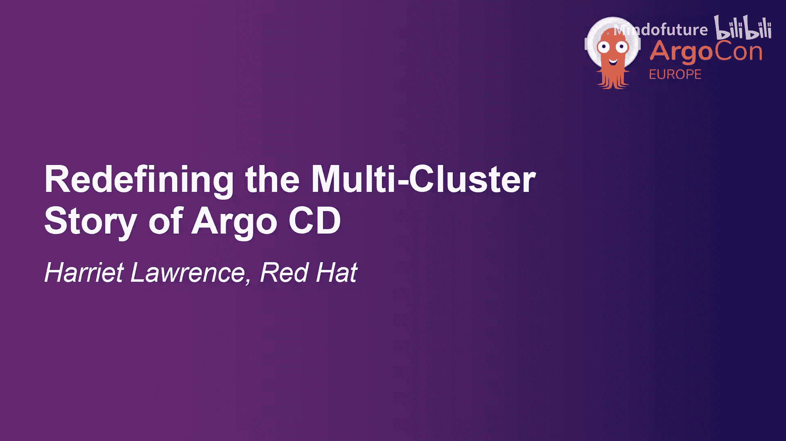
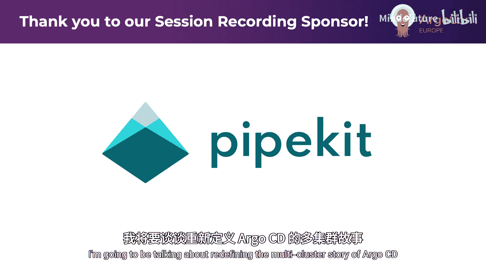
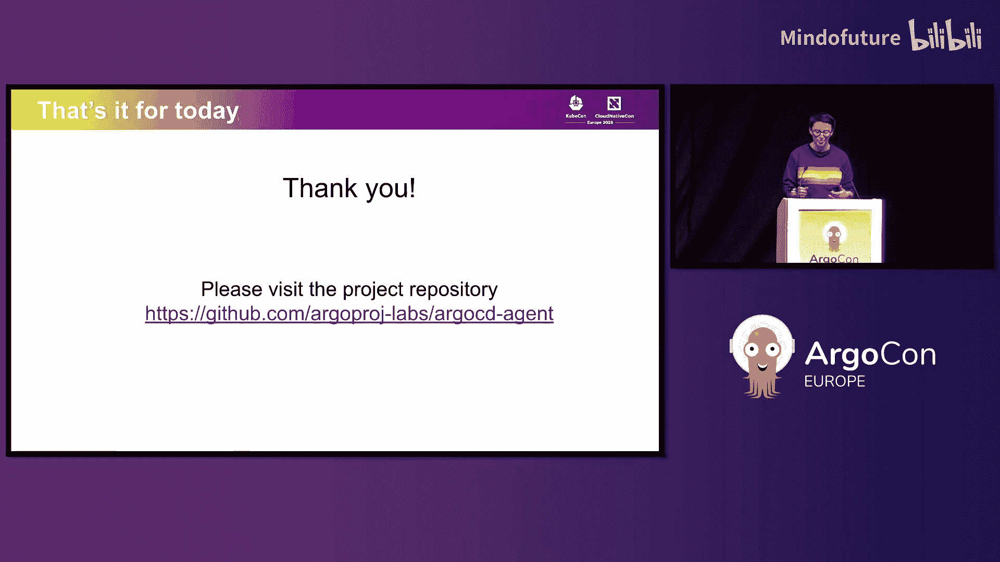
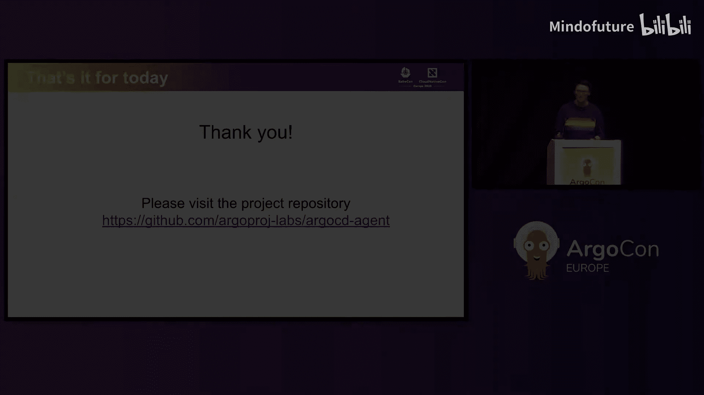

# 006：重新定义 ArgoCD 的多集群故事

在本教程中，我们将探讨 ArgoCD 多集群架构的演变历程、当前面临的挑战，并介绍一种有望解决这些问题的全新架构模式——ArgoCD Agent。我们将从历史回顾开始，逐步分析现有方案的优缺点，最后深入讲解新架构的设计原则、当前功能与未来规划。

## 历史回顾：ArgoCD 多集群架构的演变

最初，ArgoCD 仅通过一个单一的 **应用控制器 Pod** 来管理所有集群。这个 Pod 被配置了适当的凭证，可以连接到远程集群并在那里协调清单。

这是一种简单直接的机制，尤其适用于只有少数集群的场景。远程集群除了提供一个服务账户和适当的权限外，无需额外配置。

然而，这种机制也带来了一系列问题：

1.  **连接开销巨大**：ArgoCD 会与远程集群建立长连接并进行资源监视，以便对集群内的任何变化做出反应。根据集群的规模（资源数量）和活跃度（变更频率），应用控制器本身很快就会达到垂直扩展的极限。

## 水平扩展：集群分片

为了扩展到管理更多集群，项目引入了 **集群分片** 机制。

分片允许你水平扩展应用控制器，每个副本负责一组或一个“分片”的集群。

这种方法确实有助于提升可扩展性，但并未解决远程集群访问方式上的根本性挑战。你仍然需要稳定、低延迟的网络连接，维护高权限凭证，并且网络流量并未减少。

分片本身也带来了新的挑战：

*   当集群数量庞大时，你需要扩展控制平面集群以承载管理所有这些资源所需的所有应用控制器副本。
*   核心问题仍未解决：应用控制器的垂直扩展需求、集群到分片的映射策略、网络要求等。
*   一个重大挑战是：当你需要扩展时，必须根据最大、最繁忙的集群来调整配置，无法为每个集群单独优化。如果你的集群阵列是非同构的，最终可能导致大量资源浪费。

## 分布式部署：每集群一个 ArgoCD

为了解决上述问题，一些人尝试在每个集群上都安装一个 ArgoCD 实例。

这并非一个坏主意，它解决了许多之前提到的问题，因为每个 ArgoCD 实例只与其安装所在的集群通信。

但它也带来了新问题：

*   配置被有效地分散到了所有集群中。
*   缺乏集中的可观测性。
*   阻碍了通过 **ApplicationSet** 等方式实现更智能的高级应用推广模式。
*   你需要为所有 UI 保存一长串书签。

## 引入新范式：ArgoCD Agent

那么，能否在保留上述方案优点的同时，引入一个中央控制平面来处理可观测性和管理，并消除我们讨论过的所有负担呢？

答案是肯定的。这就是由 Jan 发起的开源项目——**ArgoCD Agent**。

让我们翻转一下视角，让工作负载集群中的组件“指向”中央控制平面。这样，我们就可以从一个地方管理和观察它们。

上图是一个简化示意图：
*   **蓝色方框**代表现有的 ArgoCD 组件。每个被管理集群上都有一个应用控制器，而承载 UI 的 ArgoCD API 服务器只安装在控制平面集群上一次。
*   **绿色方框**是 ArgoCD Agent 新增的组件。我们在控制平面上有一个“Principal”组件，在每个被管理集群上有一个“Agent”组件。

这些组件的主要目的是交换关于 ArgoCD 配置的信息，主要是 **Application** 资源，也包括其他配置如 AppProject 和仓库配置。

默认情况下，Agent 和 Principal 通过 **gRPC** 在 TLS 保护的连接上进行通信。简而言之，Principal 会通知 Agent 关于应用规约（Spec）的变更，而 Agent 会通知 Principal 关于应用状态（Status）的变更。

## ArgoCD Agent 的设计原则

上一节我们介绍了 Agent 的基本构成，本节中我们来看看指导其开发的核心设计原则。

1.  **Agent 主动发起连接**：拓扑结构上，Agent 需要知道如何到达 Principal，但 Principal 无需知晓 Agent 的位置信息。只要工作负载集群有办法回连到控制平面，它们无需对外暴露。
2.  **工作负载集群操作自治**：控制平面不会、也不会成为拓扑中的单点故障。即使控制平面或 Principal 宕机，你虽然无法配置新应用或修改/删除现有应用，也无法获得集中可观测性，但工作负载集群上的应用控制器仍能正常运作，可以获取 Git 提交并协调变更。
3.  **默认无外部依赖**：核心思想是让安装和起步变得简单。开箱即用，不需要持久化存储、第三方认证系统、数据库或消息队列。用户和开发者应该能够使用标准的 Kubernetes 集群即可开始。当然，我们也承认对于大规模设置这可能不够，因此我们在架构的关键部分添加了扩展点，以便在需要时与第三方系统集成。
4.  **与标准 ArgoCD 兼容**：你不需要任何特殊的、专为 Agent 定制的 ArgoCD 版本，无论是在 Agent 端还是控制平面端。我们围绕 ArgoCD 核心设计 Agent 功能，如果我们认为需要在 ArgoCD 核心中进行更改，我们会倡导在那里进行更改，而不是仅在 Agent 中实现。

## ArgoCD Agent 的当前能力与未来路线图

了解了设计原则后，现在我们来具体看看 ArgoCD Agent 目前能做什么，以及未来的发展计划。

目前项目处于早期开发阶段，但在本次会议前刚刚发布了首个公开版本。以下是已实现的核心功能：

*   **应用资源 CRUD 操作**：你可以在 Principal 上创建和操作应用，Principal 知道应该将变更提交给哪个 Agent。同样，Agent 会将状态变更提交回 Principal。
*   **近实时状态同步**：应用的所有状态，包括其同步状态，都将在 Principal 上近乎实时地可用。
*   **同步与刷新操作支持**：从 Principal 发起的同步和刷新操作将被传播到正确的 Agent。
*   **基础 AppProject 同步**：目前，Principal 上管理的所有 AppProject 会被同步到所有 Agent，而不是特定的某个。我们知道这并非最优，并计划改进。
*   **实时资源视图**：你将能够像在标准 ArgoCD 设置中一样，在 Principal 上集中查看来自 Agent 系统的实时资源。
*   **管理 CLI**：我们提供了一个 CLI，可用于管理 Principal 上的某些配置，例如 Agent 凭证。

对于今年余下的时间，我们有一个中短期路线图，高优先级事项包括：

1.  **弥合与标准 ArgoCD 体验的差距**：例如在 UI 中查看期望清单、计算并显示期望状态与实时状态之间的差异，以及提供深入应用洞察的资源树视图。
2.  **支持资源操作**：例如重新部署、删除 Pod 资源，以及任何已实现的自定义资源操作。
3.  **增强多租户体验**：改进 AppProject 的同步机制，实现选择性同步，仅同步到需要的地方。同样，未来也将支持私有仓库。
4.  **大规模场景优化**：探索比当前更高效的 Agent 与 Principal 之间的认证方式，并实现 Agent 向 Principal 的自动注册。我们正在考虑与 **SPIFFE/SPIRE**（CNCF 旗下的零信任工作负载认证协议）进行集成。

## 社区参与

最后但同样重要的是，我们需要社区的帮助。虽然目前主要是红帽的员工在推进这个项目，但这绝不是一个仅限于红帽的项目。Jan 在业余时间启动了它，我们有意在它所属的优秀开源社区——Argo 社区中培育它。

我们非常欢迎任何人花时间测试这个项目，验证我们的想法，提供反馈，提出新想法，或者分享你希望如何使用 Agent 的具体需求。即使是贡献一点文档，我们也非常欢迎。项目目前托管在 `argoproj-labs` 下，我们希望确保它适合所有人，并渴望听到你们的反馈。

这个项目的可能性才刚刚开始，是无穷无尽的，我们将感激收到的每一份社区贡献。

## 总结

在本教程中，我们一起学习了 ArgoCD 多集群管理架构的演进历程。我们从单一控制器模式开始，探讨了集群分片带来的扩展性与复杂性，并分析了每集群部署 ArgoCD 的优缺点。最后，我们重点介绍了全新的 **ArgoCD Agent** 架构，它通过引入 Principal 和 Agent 组件，在保持工作负载集群自治性的同时，提供了集中的管理和可观测性，并遵循简洁、兼容和无单点故障的设计原则。尽管项目处于早期阶段，但其路线图展示了解决现有挑战和增强多租户、大规模管理能力的清晰愿景。社区的参与和反馈对于这个项目的成功至关重要。

如果你有后续问题，可以在 CNCF Slack 的 `#argo-cd-agent` 频道中找到 Jan。此外，如果你正在考虑安装 Agent 并担心管理和维护的复杂性，今天晚些时候我们同事 Josh Packer 的演讲将展示如何将 ArgoCD Agent 模型与 Open Cluster Management 集成，从而简化生命周期管理和配置。

