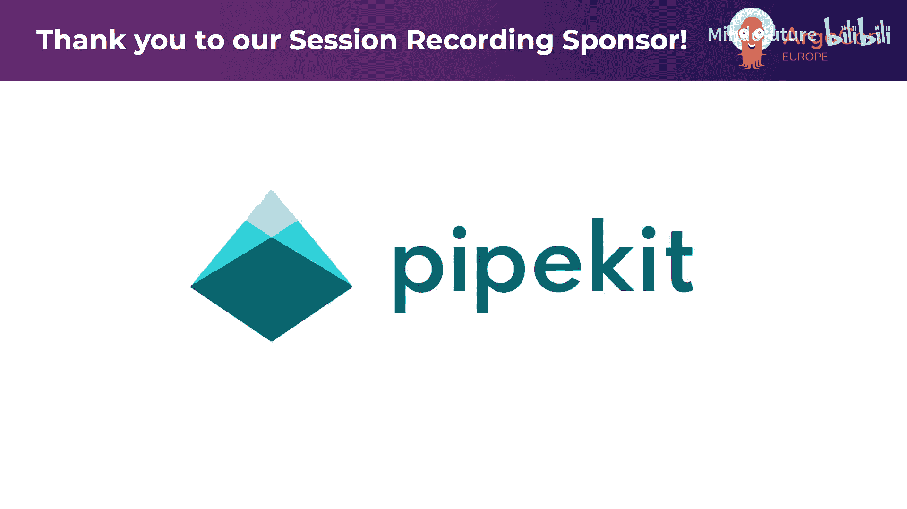
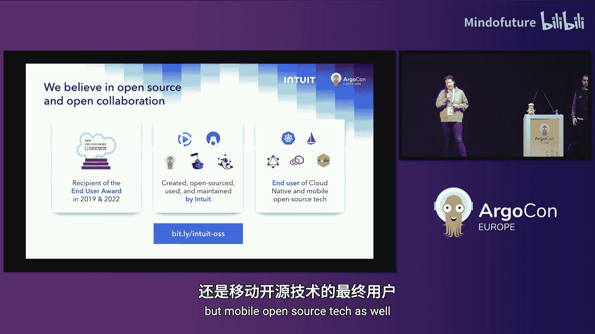
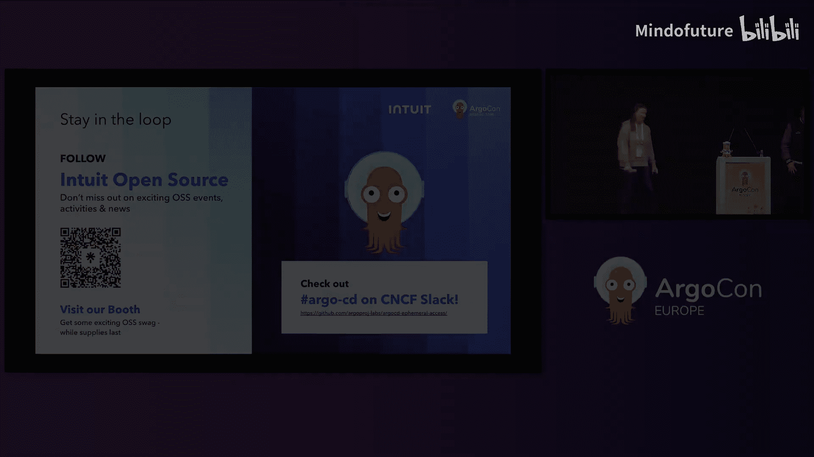

# 007：Argo CD 临时访问实战 - 在运行中汲取的经验教训

大家好。

我是 Kitty Lampkin，Intuit 公司的平台与开源部门高级产品经理。

我是 Leonardo，Intuit 公司的资深软件开发工程师，同时也是 Argo 项目的维护者。

在本教程中，我们将探讨 Argo CD 临时访问扩展的实际应用。这是 Argo Labs 项目之一，旨在解决 Argo CD 使用中可能遇到的一些问题。

## 课程概述

我们将首先介绍 Intuit 公司及其技术背景，然后深入探讨我们在开发者平台中遇到的问题。接着，我们会讲解对临时访问扩展所做的增强改进、取得的成果，并展望未来的计划。

## Intuit 公司及其技术栈

Intuit 是一家金融科技公司，为美国纳税人提供 TurboTax 等税务解决方案，也为加拿大市场及小型企业提供财务软件。

从屏幕上的数据可以看出，我们为外部客户运营的规模非常庞大。同样重要的是，我们必须确保内部开发者平台也能高效、大规模地运行。

## Intuit 的 ArgoCD 平台

我们以速度和精度运营 ArgoCD 平台。我们拥有超过 50 个 ArgoCD 实例和 345 个以上的 Kubernetes 集群，工作流规模巨大。每天处理超过 2400 个 PR，我们必须确保部署流程能够跟上这种速度和精度，以便为最终用户提供优质的财务服务体验。

在如此大规模运营的同时，由于身处金融行业，我们必须严格遵守合规要求。我们遇到了一些挑战。

## 面临的挑战

Leo 在之前的 ArgoCon 大会上曾介绍过临时访问扩展及其解决方案背景。为了让听众更好地理解本次内容，我们遇到的主要问题包括：

*   **缺乏细粒度权限控制**：无法精确分配不同级别的操作权限。
*   **安全风险**：不当的权限分配可能导致安全漏洞。
*   **部署冻结未强制执行**：无法有效阻止未经授权的部署。
*   **变更未记录**：所有对生产环境的变更，包括通过 ArgoCD UI 执行的操作，都需要有变更请求记录。

## 生产环境中的 UI 操作分析

以 Intuit 为例，我们观察了生产环境中每周通过 ArgoCD UI 执行的操作类型。

从饼图中可以看到，“删除资源”是 ArgoCD UI 中最常执行的操作。

“删除资源”可能意味着删除一个卡在“进行中”或“不健康”状态的 Pod 以重启它，这是一个常规操作。但它也可能意味着删除一个实时的 ReplicaSet、Deployment 或 Rollout 对象。

我们需要确保：第一，对这些操作有可追溯性；第二，只有了解其影响的人员才能执行这些操作。并非所有应用开发者都需要或应该拥有删除实时 Deployment 的权限。我们希望实施细粒度的策略，将高级权限授予少数特定人员，而让更多人只拥有删除 Pod 等基础权限。

## 引入临时访问扩展

我们引入了临时访问扩展。如上图所示，该扩展在 UI 顶部添加了一个“请求权限”按钮。默认情况下，用户只有只读权限。点击请求权限后，用户可以输入其角色（支持多角色），系统将处理该访问请求，批准或拒绝后，用户即可在 UI 内执行相应操作。

## 收到的反馈与改进方向

推出该扩展后，我们收到了内部用户的大量积极反馈，但也识别出可以改进的地方。软件需要持续迭代优化。本次演讲重点关注的四个改进主题是：

1.  **用户拥有多角色**：如前所述，不同开发者拥有不同权限，且单个开发者可能被分配多个角色。系统需要能够动态获取这些角色信息，Argo CD 不应预设角色定义，而应能对接外部角色管理系统。
2.  **动态角色支持**：系统需要能够动态响应用户的角色变化。
3.  **变更请求关联**：必须确保变更请求被正确提交和关联。
4.  **用户体验优化**：UI 需要为支持这些动态角色提供良好的用户体验。

接下来，我们将详细介绍如何解决这些问题。

## 增强功能一：多角色支持

在 Intuit，我们有多角色的概念。例如，通过开发者门户，用户可能拥有“开发者”、“DevOps工程师”等角色，这些角色允许他们执行不同的操作。我们希望将这种体验引入 Argo CD。

我们在临时访问扩展中添加了角色选择区域，允许用户选择执行特定应用操作所需的最低权限角色，这遵循了最小权限原则。

## 增强功能二：动态角色绑定

那么，如何启用这些角色，并使其能根据用户动态变化呢？这是通过临时访问扩展提供的两种 CRD 资源实现的。

第一种是 **`RoleTemplate`**。它包含名称、描述和策略列表，允许 Argo CD 管理员定义针对特定角色需要提升的权限策略。

第二种是 **`AccessBinding`**。它将上述的 `RoleTemplate` 与群组声明进行绑定。`AccessBinding` 中的主体列表与用户登录 Argo CD 时令牌中携带的群组声明相关联。

例如，在接下来的演示中，我的用户将关联到 `group1`，因此我将能够被提升到特定的角色。

## 增强功能三：插件机制

下一个增强功能是插件机制。我们引入插件概念的主要原因是 Intuit 要求所有对生产环境的变更都必须有已批准的变更请求，用户才能获得提升的访问权限。

但我们的变更请求 API 是专有的，而我们希望从第一天起就保持该解决方案对开源友好。这就是我们实现插件拆分机制的主要原因。

## 插件工作流程

插件如何与整个权限提升流程协作呢？

1.  用户正常登录 Argo CD，获得包含群组声明的令牌。
2.  用户启用临时访问扩展，点击权限按钮并选择提升权限的选项。
3.  此时会创建一个名为 `AccessRequest` 的新资源，触发临时访问控制器的调和循环。
4.  如果临时访问控制器配置了插件，调和循环将调用插件中的 `GrantAccess` 操作。
5.  `GrantAccess` 操作可以返回三种状态：`pending`、`granted` 或 `denied`。
    *   如果返回 `pending`，调和将结束并在一段时间后重新调度（例如每15秒或每分钟）。
    *   如果返回 `granted` 或 `denied`，流程将继续。
6.  假设返回 `granted`，临时访问控制器将继续操作为用户授予访问权限。这意味着更新 Argo CD 的 AppProject 资源，将用户与项目中定义的角色关联起来，从而提升其访问级别。

## 插件实现

插件是实现特定 Go 接口的二进制文件。该接口主要包含三个操作，其中顶部的两个（`Init` 和 `Revoke`）是可选的，`GrantAccess` 是唯一必需的操作，它驱动着上述整个流程。

我们为本次演讲创建了一个参考实现的“睡眠插件”。当调用 `GrantAccess` 操作时，它会睡眠15秒，然后返回 `granted` 或 `denied`，用于测试所有状态转换以及插件与控制器的互操作性。

## 增强功能四：条件化扩展

最后一个增强是条件化扩展。这是 Argo CD UI 的一个概念。对于 Intuit，我们需要临时访问提升操作仅对生产环境应用可用。因此，我们需要一种机制来引导扩展决定是否应启用。

这通过特定的配置驱动。在安装临时访问扩展时，可以应用一个补丁到 Argo CD API 服务器，配置条件化扩展。该配置告诉扩展，应查找具有特定键值对的标签，以决定是否启用临时访问扩展。

## 功能演示

现在进行演示。我在本地运行了两个 Argo CD 应用。

在第一个应用中，可以看到新的权限按钮和显示当前权限的小部件。而在另一个应用中，该按钮不存在。这正是条件化扩展的作用：第一个应用配置了标签 `argocon-demo: true`，因此启用了临时访问扩展。

点击权限按钮，可以看到我可以被提升到的当前角色列表。

在提升权限之前，我们先查看与此 Argo CD 应用关联的项目。可以看到，目前只配置了一个名为 `admin` 的角色。

再查看我的用户登录信息，可以看到我的用户关联了两个群组声明：`group1` 和 `group2`。正是这一点使得 `AccessBinding` 允许我在获得权限提升时被提升到特定角色。

回到应用列表，尝试执行一些操作。默认情况下，我的访问权限是只读的。尝试重启一个 Deployment，会收到权限被拒绝的提示。

现在，选择能重启 Deployment 的最低权限角色，即 `developer` 角色。点击请求按钮，可以看到访问请求的状态变为 `requested`。这个状态由插件驱动。插件将睡眠15秒，然后返回 `granted`。

一段时间后，状态更新为 `granted`，小部件也相应更新。现在再次尝试重启 Deployment，操作成功。

但如果尝试编辑 Deployment 的规格，仍然会被拒绝，因为 `developer` 角色不允许此操作。

因此，尝试将权限提升到允许编辑 Deployment 规格的角色，即 `devops` 角色。请求访问 `devops` 角色并获得授权后，可以将 Deployment 的副本数从2改为3并保存成功。

最后，演示删除一个 ReplicaSet，这是 `devops` 角色不允许但 `admin` 角色允许的操作。请求 `admin` 角色访问权限，获得授权后，即可删除 ReplicaSet。

现在回到项目查看角色配置。与之前不同，现在看到了三个由临时访问控制器动态创建的新角色。查看 `admin` 角色，因为我的访问尚未过期，所以我的用户名仍关联其中。而其他角色的访问已过期，我的用户名已不在其中。用户与特定角色关联的时间完全由控制器配置和管理。

## 安装与文档

关于安装，所有细节都记录在临时访问扩展的 GitHub 仓库中。仓库中有一个 `examples` 文件夹，除了作为参考实现的“睡眠插件”外，还有详细的插件实现文档，逐步说明了如何为公司实现自己的插件。

## 关键成果

我们实现了这个很酷的功能，演示也很成功。那么，我们取得了哪些成果呢？

*   **100% 的变更记录**：通过 Argo CD UI 对生产环境所做的所有变更，现在都关联了变更请求。从合规角度看，这是一个巨大的成就。
*   **遵循安全最佳实践**：通过查看每个角色的访问权限，开发者可以根据最小权限原则，选择执行操作所需的角色。这让安全团队非常满意。
*   **用户友好的体验**：UI 不仅显示“请求权限”，还能向开发者展示其当前角色，例如“开发者”、“DevOps工程师”、“管理员”等。这些角色可以针对您的组织进行定制。
*   **提升开发效率与保持控制**：允许开发者在日常工作中提高生产力，同时不损害控制力或合规与安全要求。
*   **100% 开源兼容**：Intuit 非常重视开源，我们希望确保在解决自身问题的同时，也能回馈社区。这个解决方案完全开源兼容。

Intuit 深度参与开源社区，不仅是 Argo 项目的创建者和维护者，还贡献于众多其他开源项目，并两次获得终端用户奖。

## 总结

在本教程中，我们一起学习了 Argo CD 临时访问扩展的核心概念、Intuit 在实际应用中遇到的挑战以及相应的增强解决方案。我们探讨了多角色支持、动态角色绑定、插件机制和条件化扩展等关键功能，并通过演示直观展示了其工作流程。最终，该方案实现了完全的变更可追溯性、细粒度的权限控制，并提升了开发者体验，同时保持了与开源社区的兼容性。

