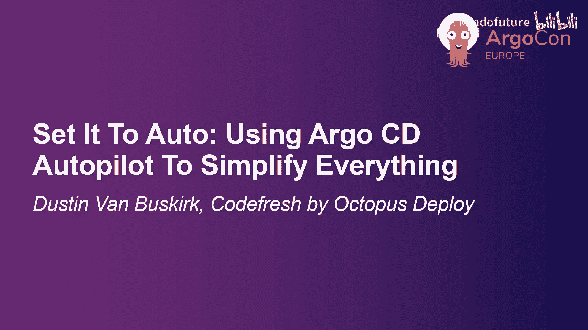
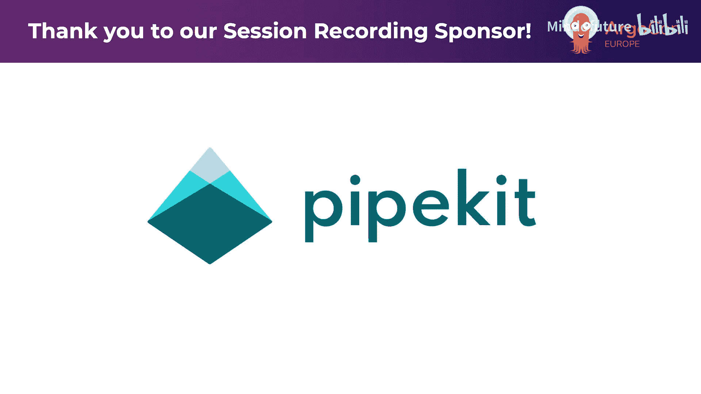

# 009：一键自动化 - 使用 Argo CD Autopilot 简化一切

## 概述

在本节课中，我们将学习如何使用 Argo CD Autopilot 项目来简化 Argo CD 的安装、管理和恢复过程。我们将探讨其核心概念、工作流程，并通过一个实际演示来展示如何从零开始恢复一个完整的 Argo CD 环境及其管理的应用。

## 章节 1：Argo CD Autopilot 项目简介

大家好。

今天下午大家感觉如何？是不是有点累了。

累是好事。好消息是我准备了一个演示，它可能会出错，也可能让今天变得非常精彩。

快速举手示意一下，我看不太清楚，但有多少人以前使用过 Autopilot 项目？哦，看来不多。是的，从贡献者的活跃度来看，这确实不是一个非常活跃的项目。我们将在最后讨论这一点。今天我将向你们介绍几个我自己的实际用例，正是这些用例让我重新开始使用它。

首先从这张幻灯片开始，这是我。

我叫 Dustin Van Busker，在 Codefresh 工作了七年半。当 Argo Autopilot 项目启动时，我参与了项目的初始阶段，后来离开了。目前我在 Octopus 工作。我最近的一个项目让我重新开始使用 Autopilot。我在寻找一种通过 GitOps 安装和管理 Argo CD 的方法。从 Codefresh 成立第一天起，我们就将 GitOps 作为标准实践，这意味着所有配置都存在于版本控制中，我们按照 GitOps 原则正确地执行所有操作。因此，我将做一个简短的闪电演讲，希望时间足够，我们看看演示效果如何。

Argo Autopilot 项目有几个常见的用例。

我今天的演讲基本上应用了所有这些用例。第一是帮助我简化 Argo CD 的安装，并将其置于 GitOps 管理之下。这意味着 Argo Autopilot 项目将在版本控制中帮我更新所需的路径、放置所需的配置，使 Argo CD 能够通过 GitOps 操作管理自身。

正如我提到的，这个项目大约始于四年前。当时 Codefresh 正在尝试为我们的用户寻找一种安装 Argo CD 的好方法。很多人都是 Argo CD 的新手，Helm 图表还不够成熟。你会看到 Autopilot 项目的一些设计理念与此产生共鸣。它使用 Kustomize 的方式是为 Kustomize 编程的，但这并不意味着你不能使用 Helm，只是 Helm 不是一等公民。它需要你启用 Helm 才能通过 Kustomize 部署，Helm 有一些优势，但也有一些不足。

第二点是，利用我为 Argo 安装本身建立的相同 GitOps 结构来管理我的应用程序。

理想情况下，我们希望所有配置都在版本控制中，并且结构相似。这样，当我们在查看不同环境时，不会发现环境之间的配置组织方式不同。这为我们未来进行环境间升级等操作提供了坚实的结构基础。我不会过多涉及环境间的升级，但我确实需要能够做到这一点，因为我自己的工作建立在这个基础之上，并且需要这个结构就位。

第三点对我来说是一个锦上添花的功能，并且我已经让一切正常运行：由于所有配置代码都有备份，我实际上可以使用 Argo Autopilot 来恢复整个 Argo 集群组件以及我自己的 Argo CD 应用程序。

## 章节 2：Autopilot 的工作原理与部署模型

现在深入了解 Autopilot 及其工作原理。Autopilot 是一个 Argo 项目，它是一个二进制文件，位于你、你的 Kubernetes API 和你的版本控制系统之间。它帮助从你的本地机器将这些组件连接起来。基本上，当你在本地机器上时，你可以引导一个集群、安装 Argo CD 并进行配置。你还可以添加额外的应用程序，它会帮你为你的 GitHub（我认为它也支持 GitLab、Bucket 等其他版本控制系统）建立应用程序的结构。它还会使用 `app install` 命令为你建立应用程序的结构。最后，你可以通过指定引导命令来安装 Argo，然后指向配置仓库的目录，从而将所有内容重新安装到一个新集群中。这就是我今天要演示的：使用那个引导功能，指向版本控制系统，并告诉它现在将所有内容部署到一个新集群上。

对我来说，它作为一个恢复过程也非常有效。

我的用例是，我最近接手了一个新项目，需要在多个不同的集群上安装 Argo CD。这通常不是我职责的一部分，因为我的公司已经有相关的自动化流程。但现在我们从不同的角度看待 Argo 开源项目，所以我必须找到一种新的安装方法。我选择了 Autopilot 并开始了部署。我的部署有点独特：我不想使用中心辐射模型。在很多情况下，很多人使用中心辐射模型，这没有问题。但我喜欢在每个集群上使用一个 Argo CD 来管理该集群，这对我来说更容易。这样做有一些好处，我稍后会介绍在每个集群上运行 Argo CD 的优势。但我立刻意识到，除非我有一种可预测的方式来安装和管理 Argo CD，否则我将陷入维护的噩梦。这就是为什么我选择了 Argo Autopilot 项目。

除此之外，我还需要将应用程序部署到位，以便通过我的项目管理这些应用程序。这些应用程序必须按照特定的结构部署，因为我需要将配置文件映射到从环境到环境的特定目录结构中，它们必须完全匹配，并且必须可预测地部署。最后，作为一名开发人员，有时我的集群会莫名其妙地消失，我经常自己不小心删除它们。

幸运的是，我是一名销售人员，所以没关系，我可以这样做并从中恢复。

以下是我采用的部署模型。我知道很多人使用中心辐射模型，这有很多优点。我们有一篇很棒的博客文章涵盖了每种 Argo 部署模型的优缺点。我为我的练习选择了独立模型。基本上，我想做的就是让 Argo CD 服务位于它所属的集群上。这样我获得了更好的隔离性。通过将 Argo CD 放在该集群中，我也获得了更高的可靠性。我不再依赖一个单一故障点来跨不同环境部署我所有的 Argo 应用。

当然，还有关注点分离和更好的安全性。例如，如果这个 Argo CD 是用于开发、预发布或生产环境，你可以设置特殊的 RBAC，给特定团队权限，不必担心中心辐射模型带来的那种多租户问题。你可以基本上分离这些不同的环境。此外，你不再需要在环境之间建立网络连接，不必担心这个 Argo CD 是否能连接到那个集群的 API，因为它将能够通过集群内 API 进行内部连接。

当然，这带来了复杂性。这里有一些缺点，我认为 Argo Autopilot 非常适合帮助我解决这些问题。其中一些就是管理和更新，比如如何可靠地更新我的 Argo CD 安装，如何管理它，以及如何恢复它。这些就是我将在我的用例中涵盖的内容，以及 Argo Autopilot 如何满足我的需求。实际上，我正是试图通过使用 Autopilot 来做这些事情来简化 Argo CD 的管理。

## 章节 3：使用 Autopilot 管理 Argo CD 与应用程序

第一点，管理 Argo CD 本身。我想要一种简单的方法来安装和配置一切，并且希望所有配置都进入版本控制。我打算使用一个单一仓库将所有配置放在一个地方，这样我就可以从一个地方查看和管理它们。当然，对于 Argo Autopilot 来说，这不是必须的。你可以将不同的集群指向不同的仓库，让它们分开管理，这取决于你。但这帮助我简化了到这些集群的边缘部署。我知道我需要多个安装，我希望它们都有备份。我该怎么做呢？我直接使用 Argo CD Autopilot 引导了我的每一个集群，配置它们，将它们放入版本控制系统仓库，包括所有相关配置。最终，我进入了应用程序部署阶段。

以下是该仓库布局的大致样子。有开发、预发布和生产环境。有不同的方式来组织这个结构，我们可以使用不同的仓库，也可以注入我们自己的文件夹结构，满足任何要求。然后我们可以使用 `owners` 文件来围绕这些不同的文件夹设置权限。在这里，我们可以看到当前由此集群管理的应用程序。`bootstrap` 文件夹将包含我需要的所有 Argo CD 配置文件。`kustomization.yaml` 将覆盖在 Argo CD 安装程序之上，允许我放入覆盖信息，指定并使该 Argo CD 安装具有我所需的配置、插件等。

当然，这一切都连接到内部集群。所以我不必管理一堆集群资源，而是只处理一个集群内资源。

现在，我需要考虑我的应用程序部署。我已经介绍了使用 GitOps 原则，拥有正确的仓库结构，这将帮助我以可预测的方式部署这些应用程序，然后我可以继续更新。更新作为自动化的一部分，我们希望它是可预测的。在很多情况下，你可以从 `values` 文件开始，设置路径映射，将环境名称作为路径的一部分，最终到达应用程序的 `values.yaml` 文件。这样，你只需通过更改路径就可以从系统到系统进行部署。这为我们提供了一种非常简单的方式来提升配置更改，也就是 `values` 文件的更改。顺便说一下，Helm 可以与此配合，或者 Kustomize 覆盖，任何这些都可以被引入。然后，就创建了一个简单的模式。这些都是它产生影响的不同方式，但你们都听说过，所以我将跳过，看看版本控制系统中的样子。

在这里，你可以看到我部署的演示应用程序。我有一个基础 `kustomization.yaml`，它指向我的其他 Kustomize 文件，基本上引入了 Kustomize 指针。然后我有一个覆盖层。在这个特定案例中，我只有一个。如果这是一个多集群方法，你可能会看到一个用于开发，一个用于预发布，一个用于生产。但在这里，我只有这个 Argo 管理的一个覆盖层，它与开发项目相关。项目是另一件你可以轻松创建的东西，Argo CD Autopilot 支持项目结构。你可以创建项目，并将你的应用程序归类到该项目下，就像我在这里做的那样。基本上，保持这种一致性对于我们在这些流程中开始提升非常重要。

## 章节 4：灾难恢复与现场演示

好的。另一件事，就像我说的，我可以在任何时候删除我的集群，可能是因为 IT 部门的人敲门说“哦，你的成本太高了，你能做点什么吗？”好吧，我可以直接让那些集群消失。我不必担心那些后果，因为现在我有了一个简单的方法，可以从版本控制系统轻松安装 Argo CD 以及该 Argo CD 安装下的所有应用程序。我可以将所有配置保存在版本控制系统中。无论出于什么原因我丢失了一个集群，比如我误操作了，或者我在清理资源的过程中不小心清理了错误的资源，我都可以使用这个命令。我只需从我的本地机器，正确设置到我想要恢复到的 Kubernetes 上下文的上下文，然后指定仓库并传入信息，这样我就可以点击按钮，从版本控制系统中存储的内容恢复一切。

现在是紧张刺激的演示时间。我将尝试切换屏幕，打开我的终端，希望你们能看到。好的，终端，大家都能看清吗？我就假设可以了。

好的，让我先确保我连接到了 Wi-Fi。我将从确保我的 Kubernetes 集群在线开始，给我一秒钟，它在下面。所以我得集中注意力看看。抱歉，他们不需要在那里看。只是试图确保这是正确的集群，它目前应该没有任何与 Argo CD 相关的东西。好的，是的，它上面只有 kube-system 和 metrics-server。

那么，我要尝试做的是使用 Argo CD Autopilot 来引导这个集群。让我看看我是否能真正看到它，好的。

嗯，等一下。回到这里。我从我的幻灯片中复制命令，因为不知为何我这里没有了，这让我担心这意味着我的令牌没有在这个特定的窗口上设置。我们希望它是设置好的。因为不知为何，我的终端没有任何历史记录让我恢复。也许我只是输错了。我确实输错了，我少打了一个破折号。基本上，我有我的仓库，好的，一切正常。让我们清除那个。这是二进制文件。我们有 `autopilot recover` 命令。好的，这就是我们想做的。基本上，我们将看到，我在这里运行它，它将开始从版本控制系统进行恢复过程，前提是它有网络连接。

我们希望它有。我相信从 Kubernetes 集群是有网络连接的。这个二进制文件的全部目的是，从我的本地机器，我希望能够将版本控制系统与我正在通信的 Kubernetes 集群（即那个 Kubernetes 上下文）结合起来。所以它会意识到它需要创建一切，目前什么都没有，然后它将恢复 Argo CD，并且我还有一些应用程序它也会恢复。我们应该能够看到，看看我能不能把它拖上来一点。我们可以看到最底部这里。我们应该能够看到一切被重新创建，然后希望我部署了 Sock Shop 应用，希望一切都能正常恢复。基本上，这将是我未来用来将整个演示站点安装到我的 Argo CD 集群的路径，我最终将拥有开发、预发布和生产环境。我计时过，恢复一切大约需要五分钟。但我保证我马上会展示 Argo CD 用户界面，然后大家可以鼓掌，我们会为此兴奋。

当 Argo CD 进入就绪状态后，这个进程最终会退出，然后 Argo CD 开始接手工作。基本上，Argo CD 被重定向到配置文件，它获取当前在下面的所有应用程序，开始部署所有这些应用程序，其中包括我的一堆演示应用：Sock Shop，我相信我还有一个 Guestbook，可能还有另一个演示应用在里面。

是的，一旦完成，我将打开并观察 Pod 一会儿，确保它们在线。一旦它们在线，它实际上还会在最后为我输出一个命令，让我可以执行端口转发代理到 Argo CD 用户界面。如果你已经注意到，我后面有一个浏览器打开，将导航到那个界面，并观察其他一切上线。

好的。Autopilot 已经完成了它需要做的工作，覆盖了一切。那么，我们继续，使用这个临时的用户名和密码。好的。

刷新这个窗口。当然，前面没有证书，因为我是一名销售人员。我不相信证书。好的。让我们在这里登录。

你会看到 Argo CD 在这里，而且版本控制仓库中的所有应用程序都在同步。你可能最关注、可能看不太清楚的是这里的 Sock Shop 项目。

我们可以看到我们的 Sock Shop 正在从版本控制系统启动。它有自己的覆盖层，我做一些额外的事情来为我的环境指定它，比如更改负载均衡器。是的，这一切都将启动并上线。它将在约五分钟内为我恢复一切。显然，这取决于你的集群有多少可用资源，以及你需要恢复多少应用。但这为你提供了一种可行的方法，从版本控制恢复到 Kubernetes 集群并连接一切。

我想我不会等它全部完成，除非有人想看到它进入健康状态。你至少可以看到它已同步，东西正在上线。我想我们可以往下看，看到我们有一些 Pod 仍在启动中。

但我要继续讲幻灯片了，因为我想谈到我认为最重要的事情之一。

## 章节 5：总结与行动号召

那就是我的行动号召。我注意到 Codefresh 仍然有一些贡献者在从事这个项目，但你知道，要让所有开源项目向前发展，我们需要更多的贡献者。所以我请求大家，如果你有兴趣推动这个项目前进，也许想看到 Helm 支持，或者看到恢复功能等其他方面的额外支持，请在演讲结束后，你可以通过日程表在线下载幻灯片。我将提供额外的资源。你可以参与 CNCF Slack 频道，你可以在 GitHub 上提供帮助，我们在那里有 issue。如果你打算使用它并想提交一些问题，请随意。我们仍在努力成为这个项目的主要贡献者。我本来应该有一位同事和我一起，他叫 Noam，Noam 今天在这里。如果你想和他聊聊 Argo Autopilot 以及我们未来的路线图，路线图也包含在 GitHub 仓库中。我们希望看到的一些改进，以及其他人提到的改进，以帮助我们推动这个项目向前发展，这些材料都在那里。所以，如果你想和 Noam 交流，你也可以找我谈谈我的使用经验。我已经离开它几年了，但大约三、四年前，我每天都在使用它来帮助大家安装 Argo。我知道很多人已经超越了那个阶段，他们有自己的 Argo 安装流程，也许是作为 Terraform 的一部分进行引导。但至少对于需要频繁创建和删除、并且希望恢复的集群，特别是从开发人员的角度来看，这可能是一个对你非常有价值的工具，对我来说就是如此。

是的，再次强调，这里有资源，你稍后可以获取。基本上，这是 Slack 频道，如果你想参与进来，和我以及 Noam 交流，向我们提出任何问题，或者成为贡献者，请联系我们。

## 总结

在本节课中，我们一起学习了 Argo CD Autopilot 的核心价值。它通过一个二进制工具，在本地机器、Kubernetes API 和版本控制系统之间架起桥梁，实现了 Argo CD 及其管理应用的声明式安装、配置和全量恢复。我们探讨了其在独立集群部署模型下的优势，如更好的隔离性、可靠性和安全性，并通过现场演示直观地展示了从零恢复整个环境的过程。最后，我们呼吁社区共同参与贡献，推动这个项目持续发展，以支持更多如 Helm 集成等高级功能。