# 010：从症状到解决方案的 ArgoCD 扩容指南


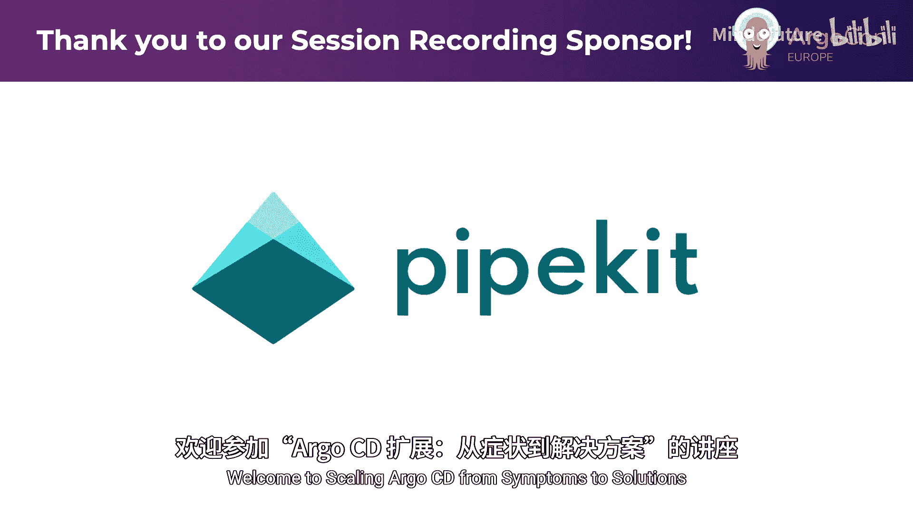

在本教程中，我们将学习如何诊断和解决 ArgoCD 在规模化部署中遇到的常见性能问题。我们将从 CPU 和内存使用率过高的症状入手，深入分析其根本原因，并提供具体的解决方案，而非简单的缓解措施。

## 概述

ArgoCD 是一个强大的 GitOps 工具，但随着管理集群、应用和资源的数量增长，可能会遇到各种性能瓶颈。本教程基于 Intuit 公司（ArgoCD 的主要贡献者）在运行多个不同规模实例时的实践经验，旨在帮助您系统地解决这些问题。

## 1：CPU 使用率过高问题

当您收到 CPU 使用率警报时，通常有两种选择：简单地增加 CPU 资源请求，或者深入调查根本原因。本节我们将探讨后者。

ArgoCD 应用控制器（Application Controller）的 CPU 消耗主要来自三个核心组件：

1.  **Kubernetes 资源监视引擎**：负责监视所有已连接集群中的资源更新。
2.  **应用调和循环**：当资源变更与应用相关时，触发此循环以判断应用是否“不同步”。
3.  **同步循环**：当应用不同步时，执行同步操作以应用资源。

其中，**调和循环**是 CPU 消耗的主要来源。它需要从仓库服务器获取清单，与 Kubernetes 中的实际状态进行比较，并计算差异。

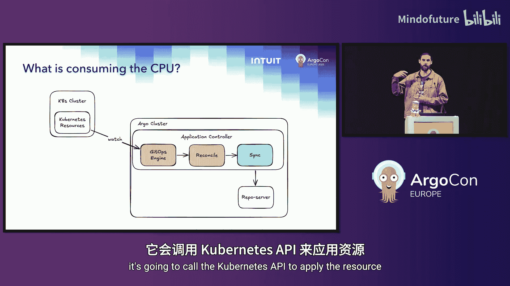

如果您想精确分析 CPU 消耗，可以使用 Go 的性能分析工具 `pprof` 生成火焰图。

### 诊断高 CPU 使用率

假设在周日（无部署活动时）收到 CPU 警报，并发现调和活动率恒定在 32，000 次/分钟。这显然不正常。

根本原因在于，Kubernetes 资源（如 Horizontal Pod Autoscaler）的状态字段会频繁更新，每次更新都会触发 ArgoCD 的调和循环，即使这些状态变更并不影响 Git 中定义的期望状态。

### 解决方案：忽略不必要的资源更新

以下是减少不必要调和事件的方法：

*   **排除无关资源**：配置 ArgoCD，使其不监视那些永远不会通过 ArgoCD 部署的资源类型。
*   **忽略资源更新**：对于需要监视的资源，可以配置忽略特定字段（如 `status`）的更新。

**具体操作**：通过启用调试日志（短暂开启，例如30分钟）来识别哪些资源在频繁触发调和。然后，配置 `resource.exclusions` 或 `resource.inclusions` 以及 `ignoreDifferences` 来过滤这些更新。

例如，忽略所有资源的 `status` 字段更新：
```yaml
apiVersion: v1
kind: ConfigMap
metadata:
  name: argocd-cm
data:
  resource.exclusions: |
    - apiGroups: ["*"]
      kinds: ["*"]
      clusters: ["*"]
      # 可以更精确地配置
```
应用此配置后，CPU 使用率从持续的 6-7 个核心降至接近零，仅偶尔出现峰值。

## 2：处理调和峰值与仓库服务器压力

上一节我们降低了平均 CPU 使用率，但引入了峰值。峰值会给系统其他部分带来压力，尤其是**仓库服务器**。

当调和循环需要访问仓库服务器，且所需清单不在缓存中时，操作会变慢（需要执行 Helm、Kustomize 等）。如果大量应用同时触发调和（例如，因缓存同时过期），仓库服务器的队列会被填满，导致同步操作严重延迟。

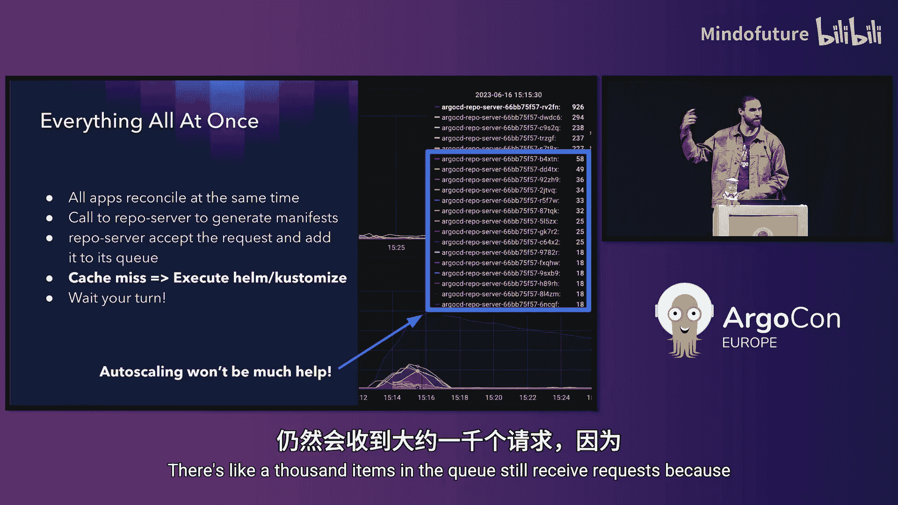

### 缓解与根本解决

以下是缓解峰值的方法：

*   **延长调和超时时间**：例如，从 3 分钟改为 1 小时。但这只是延迟了峰值，并未解决它。
*   **配置 Git Webhook**：确保代码提交后能立即触发调和，而不是等待超时。
*   **配置清单生成路径**：对于 Monorepo 或包含非部署文件（如 `README.md`, `Jenkinsfile`）的仓库，此配置至关重要。它可以避免无关文件的变更触发大量应用调和。

**根本解决方案是引入抖动**。

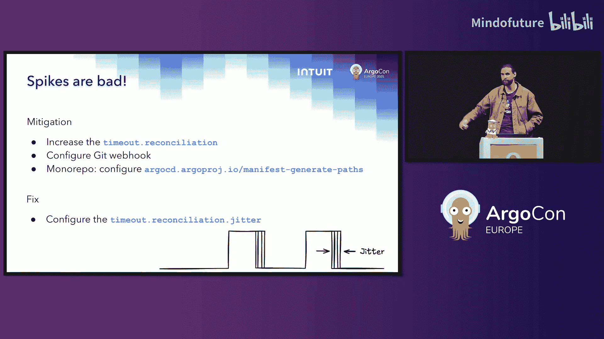


**什么是抖动？**
在调和超时时间的基础上，增加一个随机的时间缓冲区。例如，如果超时为 1 小时，抖动配置为 30 分钟，那么应用的实际刷新时间将分布在 1 小时到 1.5 小时之间。这能将潜在的峰值请求分散开。

配置示例（在 Application Controller 的部署参数中）：
```yaml
- --reconcile-timeout=3600s # 1小时
- --reconcile-jitter=1800s  # 30分钟抖动
```

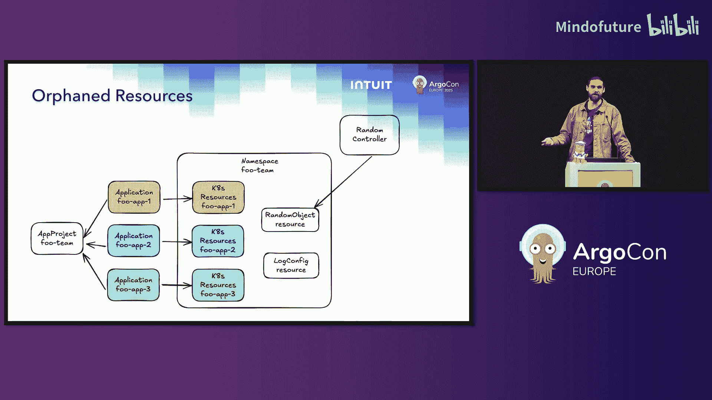

### 孤儿资源监视的影响

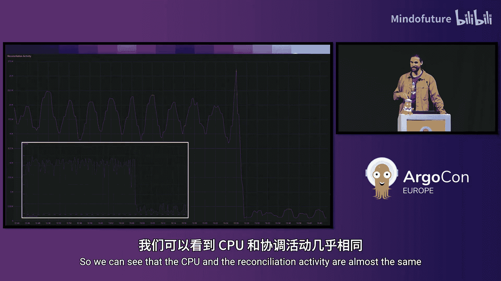

另一个可能导致调和率居高不下的因素是启用了“孤儿资源监视”。此功能会监视命名空间内**所有**资源的变更，而不仅仅是 ArgoCD 应用管理的资源。任何未知资源的变更都会触发调和。

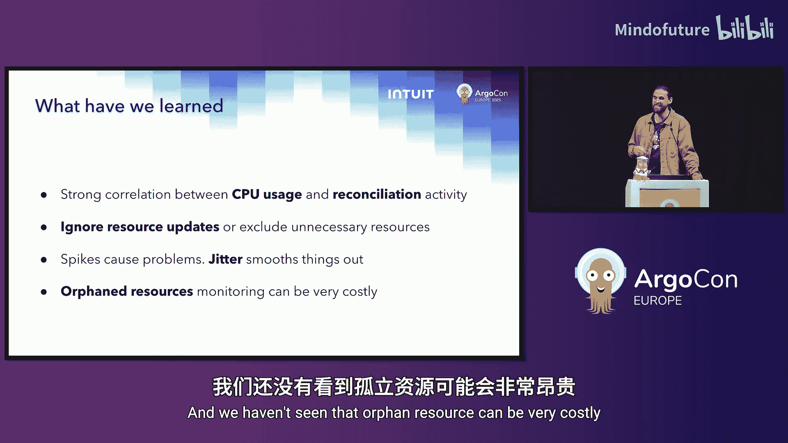

**建议**：评估是否真正需要此功能。社区中有用户在禁用此功能后，调和活动与 CPU 使用率均大幅下降。

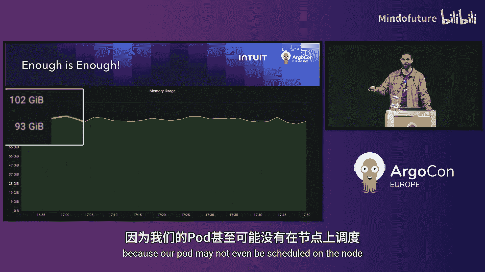

## 3：内存使用率过高问题

解决了 CPU 问题后，下一个常见警报是内存使用率过高，有时甚至达到 100 GB 以上，影响 Pod 调度。


内存消耗主要来自 **Kubernetes 资源监视引擎的缓存**。ArgoCD 会缓存它监视的所有资源对象。随着连接集群数量和集群内资源数量的增长，缓存会不断膨胀。

### 降低内存消耗的策略

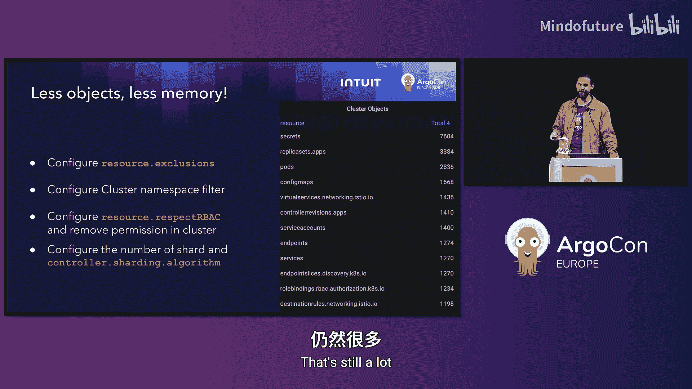

1.  **减少监视对象**：与优化 CPU 一样，排除不需要监视的资源类型。
2.  **配置集群命名空间过滤器**：如果您的应用只部署在某个集群的少数几个命名空间中，可以配置 ArgoCD 仅监视这些特定的命名空间，这能带来显著的内存改善。
    *   配置方式：在集群的 Secret 或 `argocd-cm` ConfigMap 中设置 `namespaces` 字段。
3.  **利用 RBAC**：通过 Kubernetes 的 Role 和 RoleBinding 限制 ArgoCD 服务账户的权限。ArgoCD 将无法监视它没有权限访问的资源，自然也不会缓存它们。

### 最终手段：分片

如果经过上述优化后内存使用仍然很高（例如 80 GB），最后的解决方案是**分片**。

**分片原理**：将应用控制器拆分为多个分片（Shard），每个分片负责管理一部分集群。这可以通过轮询调度或均匀分布算法实现。

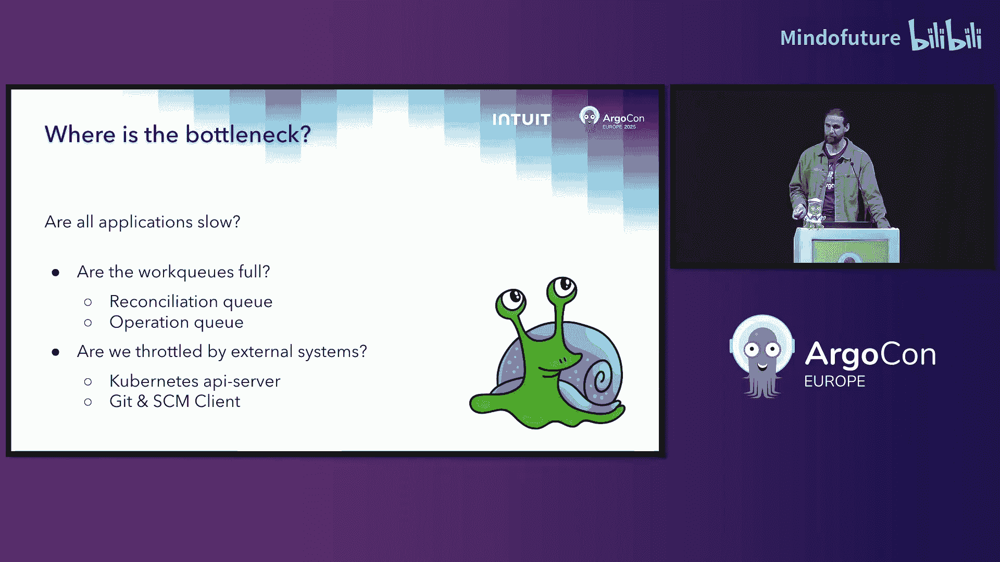

**挑战**：默认的分片策略可能不会考虑集群的“重量”（即资源多少）。一个生产集群的缓存可能远大于多个测试集群。

**解决方案**：手动将集群分配给特定的分片，以实现内存使用的均衡。您可以通过在应用控制器部署中设置 `--shard` 参数并手动分配集群来实现。

通过手动分片，可以将内存负载均匀分布到多个较小的 Pod 上（例如每个 Pod 15 GB），从而更容易被 Kubernetes 调度。

## 4：ArgoCD 响应缓慢问题

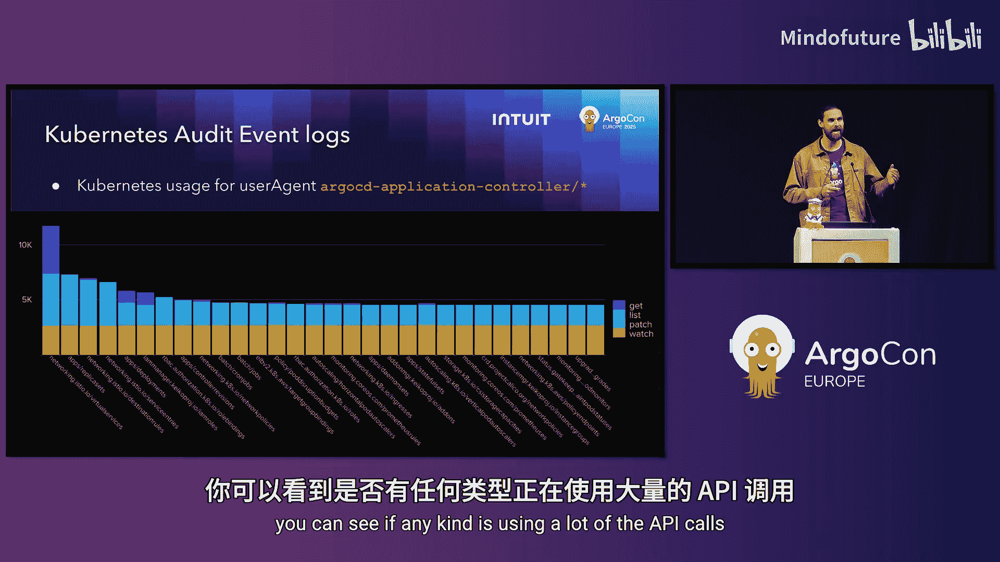

当用户报告“ArgoCD 变慢”时，需要系统性排查。

首先，确定问题是全局性的（所有应用都慢）还是仅限于特定应用。然后检查以下方面：

*   **工作队列**：检查应用控制器的队列深度。健康的系统队列应接近零。持续积压的队列是性能瓶颈的标志。
*   **CPU 限制与限流**：即使 CPU 使用率不高，如果设置了过低的 CPU 限制，也可能导致 CPU 被限流，从而拖慢所有操作。考虑适当提高或移除 CPU 限制。
*   **并行度设置**：ArgoCD 可以配置 `status.processors`（调和并行度）和 `operation.processors`（同步并行度）。**注意**：只有在 CPU 资源充足的情况下，增加并行度才能提升性能。否则会适得其反。
*   **外部依赖**：ArgoCD 严重依赖 Git 仓库和 Kubernetes API 服务器。
    *   **Kubernetes API 服务器**：可以使用 Kubernetes 审计日志来监控 ArgoCD 的 API 调用情况。从 ArgoCD 3.0 开始，提供了客户端指标，便于监控是否达到客户端速率限制或是否存在高延迟。
    *   **一个重要陷阱**：当您为了优化内存而配置集群命名空间过滤器时，可能会意外增加对 API 服务器的连接数。例如，从监视整个集群改为监视 6 个命名空间，连接数可能从 100 激增到 600，如果超过默认连接池限制（如 500），就会造成瓶颈和临时死锁。

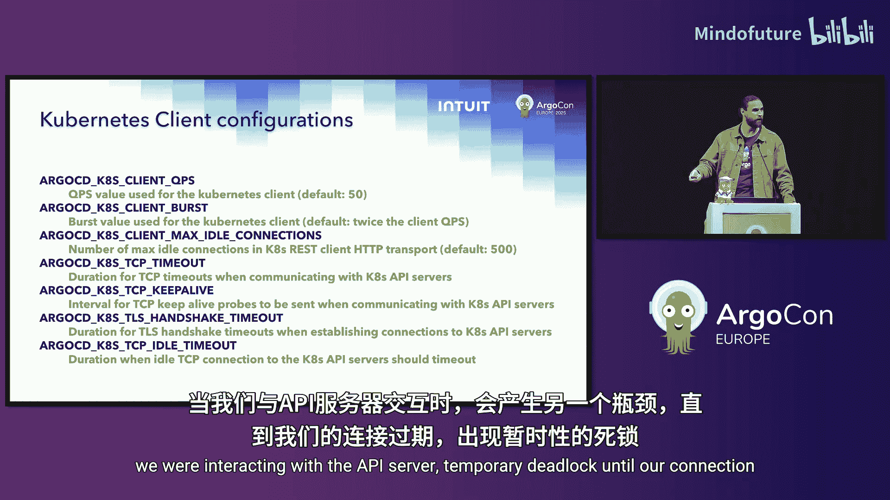

## 总结

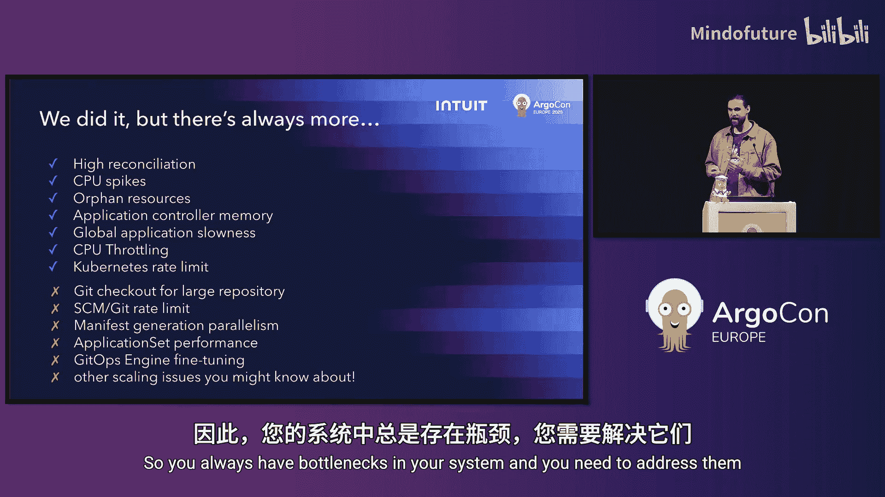

在本教程中，我们一起学习了诊断和解决 ArgoCD 规模化部署中核心性能问题的方法：

1.  **CPU 使用率高**：其与调和活动强相关。通过**忽略不必要的资源更新**（特别是 `status` 字段）可以大幅降低 CPU 消耗。
2.  **调和峰值**：峰值会给仓库服务器等组件带来压力。通过配置**抖动**，可以将集中式的调和请求分散开，使系统负载更平滑、可预测。
3.  **内存使用率高**：主要源于资源缓存。通过**排除资源**、**配置命名空间过滤器**、利用 **RBAC** 以及最终的**分片**策略，可以有效控制内存增长。
4.  **响应缓慢**：需要从队列、CPU 限流、并行度设置以及 **Git 和 Kubernetes API 服务器**这些外部依赖进行综合排查。

最后，请记住优化 ArgoCD 性能就像冲泡一杯完美的意式浓缩咖啡：**一次只调整一个参数，观察效果，然后迭代**。不要同时更改所有设置，否则您将无法确定是哪个更改带来了改善（或问题）。如果您在社区中解决了独特的性能问题，非常欢迎分享您的经验。