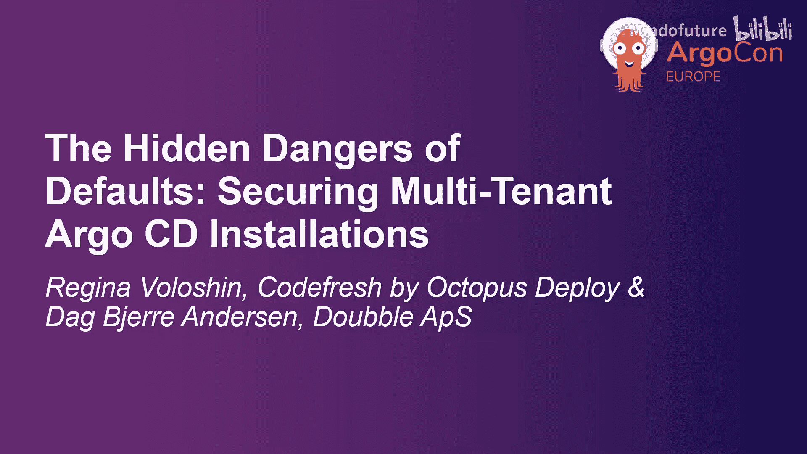
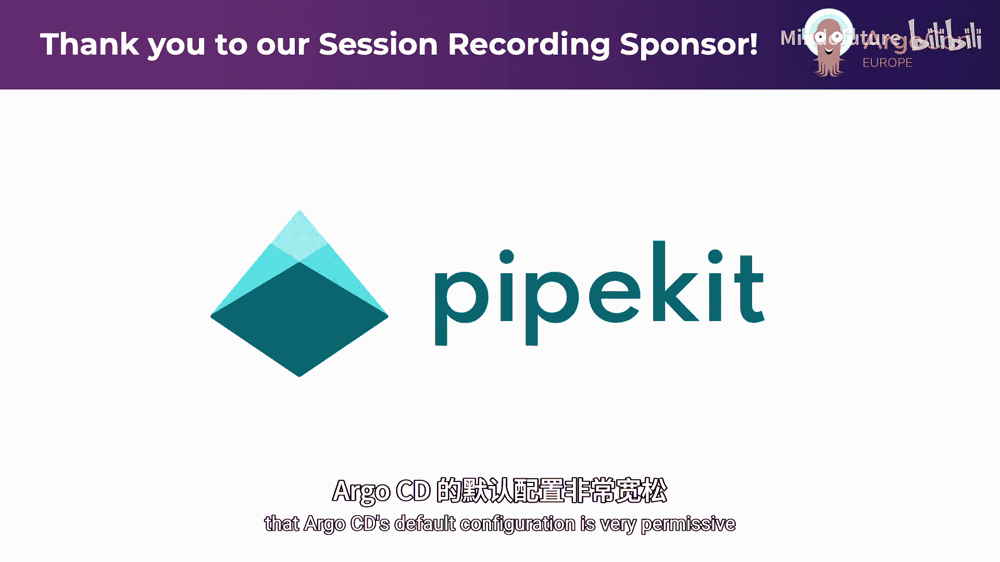
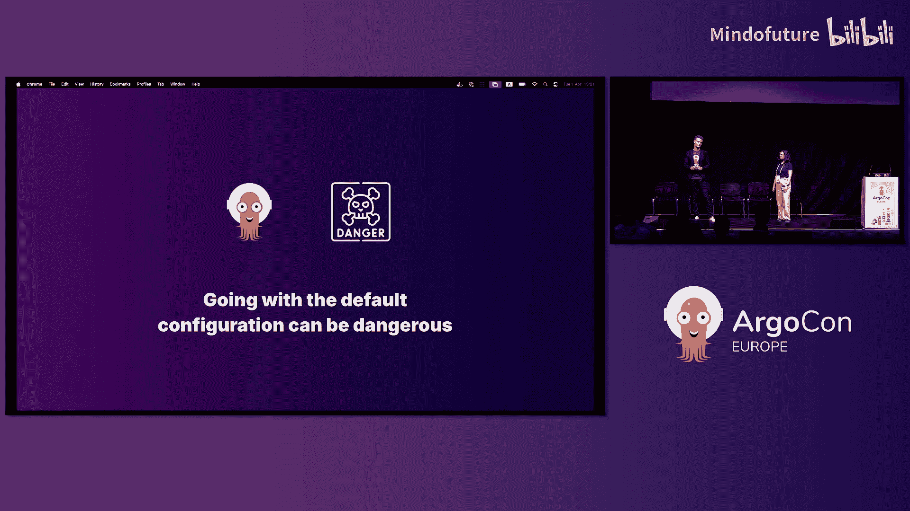
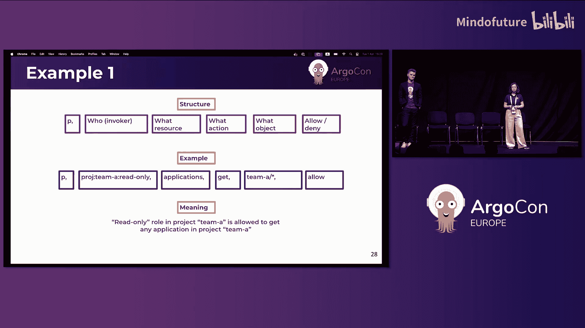
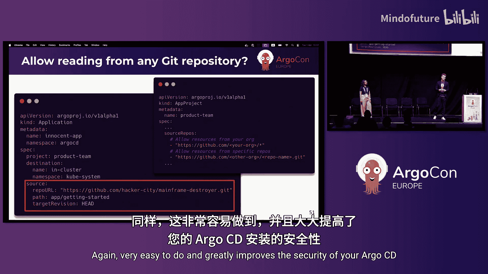
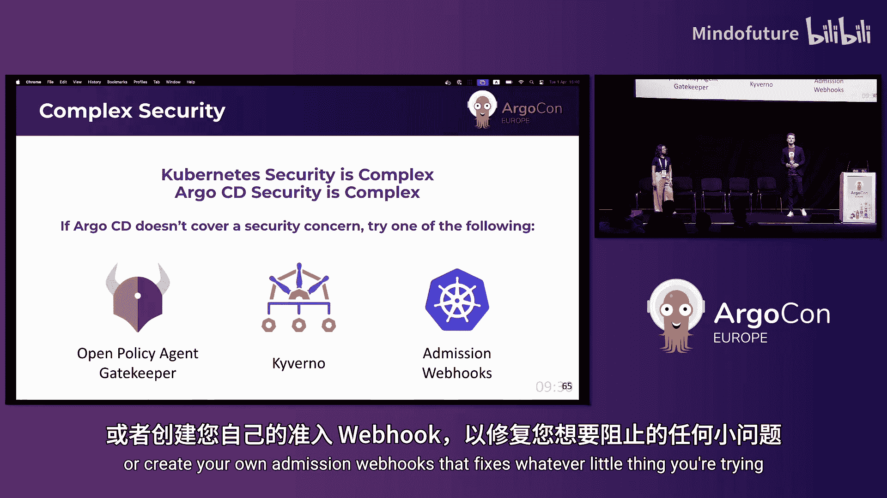
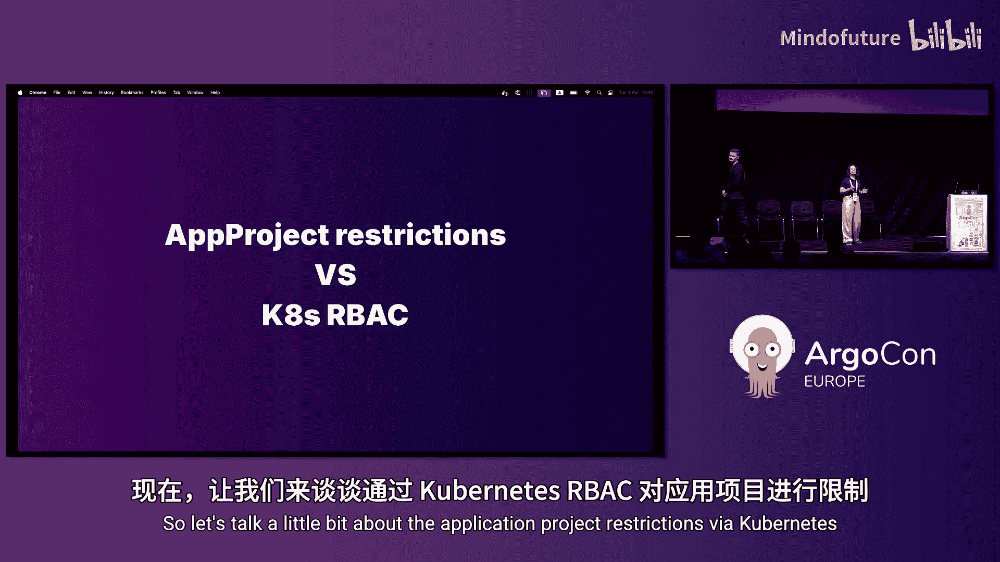
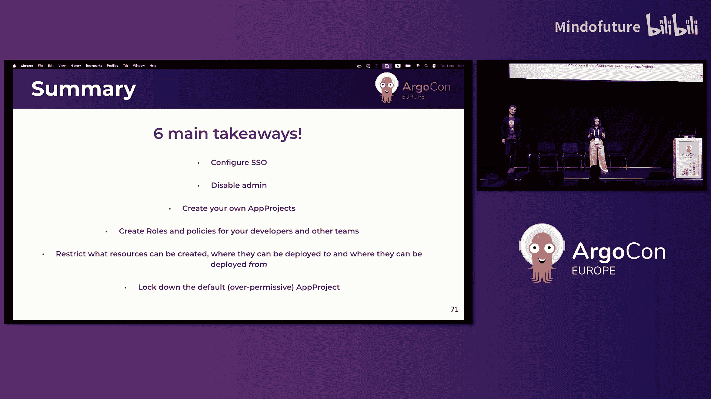

# 011：默认配置的隐患与多租户 ArgoCD 的安全加固





## 概述


在本教程中，我们将学习如何识别和修复 ArgoCD 默认配置带来的安全风险。ArgoCD 的默认设置非常宽松，旨在简化初始部署，但这在多租户环境中会带来严重的安全隐患。我们将从访问控制和资源限制两个方面，详细介绍如何通过配置应用项目、RBAC 策略和 Kubernetes 原生安全机制，来构建一个安全的 ArgoCD 环境。

---

## 默认配置的问题与挑战

ArgoCD 的默认配置非常宽松，几乎所有功能在默认情况下都是启用的。这是因为 ArgoCD 的设计初衷是易于设置和快速上手。安全方面的考虑通常需要在后续阶段进行。




许多管理员，即使阅读了关于如何正确配置 RBAC 和将应用拆分到不同项目的文档，在实际操作中仍倾向于使用默认配置。因为超越默认配置意味着需要投入更多的工作量，并维护更多的代码。通常，管理员只会进行最低限度的安全配置，例如设置单点登录、禁用默认的 `admin` 用户以及创建一些基本的 RBAC 规则。


然而，仅依赖这些基础配置是危险的，因为它假设开发者不会故意破坏系统。实际上，如果开发者有意为之，他们可以绕过这些限制。本教程的目标是展示默认配置的危险性，并提供简单的步骤来显著提升 ArgoCD 安装的安全性。

---

## ArgoCD 的演进：从单租户到多租户

在 ArgoCD 使用的初期，通常是一个开发者使用一个 ArgoCD 实例，部署一个应用到单个 Kubernetes 集群的单个命名空间中。这是一个单租户环境。

随着 ArgoCD 使用规模的扩大，多个团队开始访问同一个 ArgoCD 实例。这个实例现在管理着多个应用，这些应用将资源部署到不同集群的不同命名空间中。此时，单租户环境就演变成了多租户环境。

在多租户环境中，不同的安全需求开始出现：
1.  **团队访问控制**：平台团队通常可以访问所有业务应用和基础设施应用，而开发团队只能访问自己的应用，不能访问其他团队或基础设施的应用。
2.  **操作权限控制**：不同角色的人员应具有不同的操作权限。例如，A 开发团队可以查看和更新其应用，而 B 开发团队可能只能同步和查看其应用，平台团队则可以对任何应用执行任何操作。
3.  **Kubernetes 资源操作限制**：需要限制谁可以更新或查看应用 A 的资源，以及谁可以删除应用 B 的 Pod。

幸运的是，ArgoCD 拥有非常灵活的安全机制，可以支持广泛的需求。

---

## ArgoCD 安全概览

ArgoCD 的安全主要涉及两个相互独立的方面：
1.  **对 ArgoCD 资源的访问限制**：控制谁可以同步、查看或删除一个 ArgoCD 应用。
2.  **对 Kubernetes 资源的访问限制**：控制可以将哪些 Kubernetes 资源部署到哪些命名空间和集群。

**应用项目** 资源将这两个方面结合在一起。它用于分组应用，并控制以下内容：
*   受信任的 Git 仓库和 Helm Chart 仓库。
*   可部署的目标集群和命名空间。
*   可部署的 Kubernetes 资源类型。
*   通过 ArgoCD RBAC 控制用户对应用的访问权限。

接下来，我们将深入探讨第一个方面：控制对 ArgoCD 资源的访问。

---

## 控制对 ArgoCD 资源的访问

要理解这部分，首先需要了解 ArgoCD RBAC 模型的工作原理。

### ArgoCD 安全策略的构成要素

ArgoCD 安全策略由以下几个核心部分构成：

**资源**
资源是策略作用的对象，主要包括：
*   `applications`：应用。
*   `applicationsets`：应用集。
*   `projects`：项目。
*   `logs`：Pod 日志。
*   `exec`：在 Pod 中执行命令。

需要注意的是，`project` 本身也是一种资源。



**动作**
动作定义了可以对资源执行的操作，主要包括：
*   `get`：获取/查看。
*   `create`：创建。
*   `update`：更新。
*   `delete`：删除。
*   `sync`：同步。

并非所有动作都适用于所有资源。例如，`sync` 动作就不适用于 `applicationsets` 或 `projects`。
*   查看 Pod 日志 (`logs`) 本质上是只读操作，在语义上被视为 `get` 动作。
*   在容器中执行命令 (`exec`) 可能会改变运行中容器的环境，在语义上被视为 `create` 动作。
*   `update` 和 `delete` 动作可以在两个层面上操作：ArgoCD 应用层面，或该应用管理的资源层面。

### 策略语法与结构

策略的基本语法结构如下：
```
p, <subject>, <resource>, <action>, <object>, <effect>
```

以下是每个字段的含义：
*   `p`：策略的保留字。
*   `<subject>`：策略主体，即“谁”。可以是角色、用户或组。**建议使用角色**。
*   `<resource>`：策略作用的资源类型（如 `applications`）。
*   `<action>`：允许或禁止的动作（如 `get`, `sync`）。
*   `<object>`：策略作用的具体对象。可以是“项目中的某个应用”或“项目本身”。使用通配符 `*` 表示“任何”。
*   `<effect>`：效果，取值为 `allow`（允许）或 `deny`（拒绝）。

### 策略示例

以下是几个策略配置示例：

**示例 1：允许只读角色访问项目内所有应用**
```
p, role:team-a-readonly, applications, get, team-a/*, allow
```
这条策略表示：`team-a-readonly` 角色被允许获取（查看）`team-a` 项目中的任何应用。

**示例 2：拒绝只读角色访问特定应用的日志**
```
p, role:team-b-readonly, applications, get, team-b/app1, deny
```
这条策略表示：`team-b-readonly` 角色被禁止获取（查看）`team-b` 项目中 `app1` 应用的日志。

**示例 3：细粒度 RBAC - 允许删除特定应用中的 Pod**
```
p, role:team-b-delete-pods, applications, delete, team-b/app1, allow
```
这条策略的 `action` 字段为 `delete`，`object` 字段指定了应用 `team-b/app1`，表示允许该角色删除该应用管理的资源（在此上下文中特指 Pod）。这展示了如何控制对应用所管理资源的访问。

**示例 4：全局宽范围策略（平台管理员）**
```
p, role:platform-admin, applications, *, */*, allow
```
这条策略表示：`platform-admin` 角色被允许对任何项目中的任何应用执行任何动作。由于这个角色不局限于任何特定项目，此类全局策略应配置在 **ArgoCD RBAC ConfigMap** (`argocd-rbac-cm`) 中，而不是在单个应用项目里。

### 应用项目建模建议

一个常见的场景是为每个团队创建一个单独的应用项目。但请注意，没有放之四海而皆准的方案。您应该始终分析您的组织结构和对访问的不同安全需求，然后根据您的具体需求来建模应用项目。

---

## 控制对 Kubernetes 资源的访问

上一节我们讨论了如何限制对 ArgoCD 资源的访问，现在让我们深入探讨如何限制可以通过应用项目创建哪些 Kubernetes 资源。

### 默认应用项目的风险

首先，所有 ArgoCD 应用都必须与某个应用项目关联。ArgoCD 默认提供的应用项目配置如下：
*   对可以从哪个代码仓库读取清单**没有限制**。
*   对可以部署到哪个集群和命名空间**没有限制**。
*   对可以部署哪些资源到这些目标**没有限制**。

这本身看起来就很不安全，因此**不建议使用这个默认应用项目**。良好的实践是锁定默认应用项目，然后创建符合需求的新项目。

**锁定默认应用项目的方法**：您无法删除或禁用默认项目，但可以修改它。只需创建一个名为 `default` 的应用项目资源，移除其所有权限，然后应用到集群即可。这样，默认项目就变得完全无用。



### 创建安全的应用项目：五个风险示例与修复方案

假设我们要为一个产品开发团队创建一个新的应用项目。他们通常通过 Git 提交配置文件（如 ConfigMap、Deployment、Service）与 ArgoCD 交互，偶尔通过 UI 进行同步。

以下是五个如果使用默认配置可能出错的地方，以及我们如何通过新应用项目来修复它们：

**风险 1：创建高权限的 Kubernetes RBAC 资源**
*   **问题**：默认配置下，开发者可以创建 `ClusterRole` 和 `ClusterRoleBinding`。他们可以借此授予自己或其容器访问整个集群的权限，从而无限制地运行任何 `kubectl` 命令。
*   **修复**：在应用项目中，使用 `clusterResourceBlacklist` 字段来黑名单这些不需要的资源。
    ```yaml
    spec:
      clusterResourceBlacklist:
      - group: “rbac.authorization.k8s.io”
        kind: ClusterRole
      - group: “rbac.authorization.k8s.io”
        kind: ClusterRoleBinding
    ```

**风险 2：从任意 Git 仓库同步**
*   **问题**：默认配置下，应用可以从任何 Git 仓库读取清单。攻击者可以将应用指向包含恶意代码的仓库，一旦同步，危险代码就可能进入生产集群。
*   **修复**：在应用项目中，使用 `sourceRepos` 字段白名单允许的仓库。
    ```yaml
    spec:
      sourceRepos:
      - “https://github.com/your-org/your-repo“
      - “https://github.com/your-org/*” # 允许整个组织的仓库
    ```

**风险 3：部署到任意命名空间和集群**
*   **问题**：ArgoCD 应用清单时，效果等同于运行 `kubectl apply`。如果资源已存在，它会被覆盖。这意味着 ArgoCD 可以覆盖集群中的几乎任何资源。例如，开发者可以创建一个指向 `argocd` 命名空间的 ConfigMap 并覆盖 ArgoCD 自身的配置。
*   **修复**：在应用项目中，使用 `destinations` 字段白名单允许的部署目标，或使用 `deniedNamespaces` 等字段进行黑名单限制。
    ```yaml
    spec:
      destinations:
      - namespace: dev-team-a
        server: “https://kubernetes.default.svc”
      deniedNamespaces:
      - kube-system
      - argocd
    ```

**风险 4：创建 ArgoCD 应用资源**
*   **问题**：如果允许开发者创建 `Application` 资源，他们需要指定一个应用项目。如果他们指向一个限制宽松的项目（如未锁定的默认项目或基础设施团队的项目），他们就能绕过所有限制。
*   **修复**：如果开发者不需要自助创建应用，最简单的方法是在应用项目中黑名单 `Application` 资源。如果确实需要支持自助服务，则必须非常谨慎地设计项目引用规则和全局 RBAC。

**风险 5：创建 ArgoCD 应用项目资源**
*   **问题**：如果开发者可以创建 `AppProject` 资源，他们总能创建一个没有任何限制的新项目并使用它，这使得之前所有的安全配置都形同虚设。
*   **修复**：**开发者通常不应被允许创建 `AppProject` 资源**。您应该从其他地方（如平台团队）集中管理这些资源，并在应用项目中黑名单此资源。

### 超越 ArgoCD 的安全机制

Kubernetes 安全是复杂的，因此 ArgoCD 安全也很复杂。如果 ArgoCD 不支持您的特定用例或安全关切，您可以考虑集成其他项目，例如 OPA Gatekeeper、Kyverno，或者创建自己的准入控制 Webhook 来实施额外的策略。

---

## 通过 Kubernetes 原生 RBAC 进行限制

您可能会问，既然是在限制对 Kubernetes 资源的访问，为什么不能直接使用原生的 Kubernetes RBAC 呢？实际上，从 ArgoCD 2.13 开始，您可以通过一个 Alpha 特性来实现这一点：**模拟同步**。





### 模拟同步的工作原理

您可以**为每个应用目的地配置一个新的服务账户**。当 ArgoCD 执行同步操作时，将使用这个服务账户，而不是高权限的 ArgoCD 控制平面服务账户。这依赖于 Kubernetes 的模拟机制：一个用户（ArgoCD 服务账户）可以扮演另一个用户（您配置的低权限服务账户）。

这样，应用项目中对 Kubernetes 资源的访问控制就转化为了**原生的 Kubernetes RBAC**，可以简化 ArgoCD 管理员的配置工作。

### 配置步骤
1.  在 ArgoCD ConfigMap 中启用此 Alpha 特性。
2.  创建用于同步的低权限服务账户，以及所需的 Role、RoleBinding、ClusterRole 和 ClusterRoleBinding。
3.  在应用项目清单中，为相关目的地指定服务账户名称。
    ```yaml
    spec:
      destinations:
      - namespace: dev-team-a
        server: “https://kubernetes.default.svc”
        # 指定用于此目的地的服务账户
        serviceAccount: dev-team-a-sync-sa
    ```

这是一个 Alpha 特性，鼓励您进行测试、采用，并提供反馈以帮助其未来发展。

---

## 总结与核心要点

本节课我们一起学习了如何加固多租户 ArgoCD 环境的安全。以下是本次课程的六个核心要点：



1.  **配置单点登录**：确保每个开发者使用自己的身份登录。
2.  **禁用默认管理员用户**：不要使用本地 `admin` 用户进行人工登录。
3.  **创建自定义应用项目**：不要使用默认的、权限过大的应用项目。
4.  **为团队创建角色和策略**：根据职责分离原则，配置细粒度的 ArgoCD RBAC。
5.  **限制可创建的资源、来源和目标**：
    *   使用 `clusterResourceBlacklist` 等字段限制资源类型。
    *   使用 `sourceRepos` 白名单代码仓库。
    *   使用 `destinations` 或黑名单限制部署目标。
6.  **锁定默认应用项目**：通过创建一个无权限的 `default` 项目来使其失效。


请记住，安全是一个持续的过程。建议您阅读官方 ArgoCD 文档中关于 RBAC 的详细说明，并参考社区相关的安全实践博客文章，以持续优化您的 ArgoCD 部署安全。