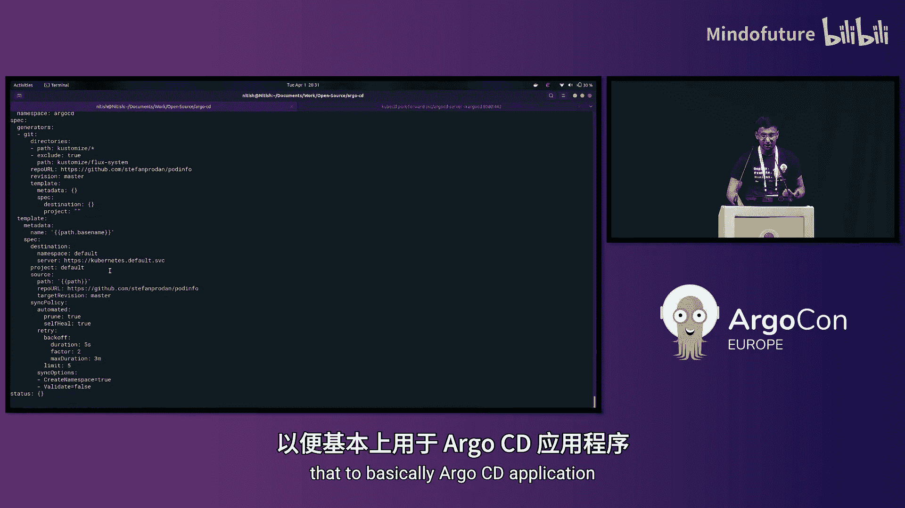

# 012：通过插件支持扩展 Argo CD CLI 功能 🚀

在本节课中，我们将学习 Argo CD 即将在 3.1 版本中引入的一项新功能：CLI 插件支持。我们将了解什么是 Argo CD 插件、它的工作原理、使用限制，并通过一个实际演示来加深理解。

## 什么是 Argo CD 插件？🤔


上一节我们介绍了课程概述，本节中我们来看看 Argo CD 插件的核心定义。

简单来说，一个 Argo CD 插件是一个独立的可执行文件。它的命名必须以 `argocd-` 作为前缀，并且需要存放在系统的绝对路径中。

它的核心作用是：任何放置在系统绝对路径中、以 `argocd-` 开头的二进制文件，都将成为 `argocd` 命令的一个子命令。这意味着你无需修改 Argo CD 的代码库或提交拉取请求，就能扩展其 CLI 功能。这与 Kubernetes 的 `kubectl` 插件系统工作原理类似。

## 插件的执行条件 ✅

了解了基本概念后，我们来看看一个二进制文件要作为 Argo CD 插件被执行，必须满足哪些条件。

以下是插件生效的三个必要条件：

1.  **命名前缀**：二进制可执行文件的名称必须始终以 `argocd-` 开头。这个约定是为了区分系统中可能与 Argo CD 关联的其他二进制文件。
2.  **执行权限**：二进制文件必须拥有可执行权限。否则，Argo CD 将忽略它。
3.  **存放路径**：二进制文件必须存放在系统的绝对路径中（例如 `/usr/local/bin`）。如果放在相对路径下，它将不会被执行。

## 插件命名与调用规则 📛

现在我们已经知道了插件的存放规则，接下来具体看看如何命名以及 Argo CD 如何调用它。

命名规则很简单：构建一个以 `argocd-` 为前缀的二进制文件，并将其放入系统绝对路径。

例如，如果你有一个名为 `argocd-demo-plugin` 的插件放在系统绝对路径中，那么：
*   `argocd-demo-plugin` 这个二进制文件将被执行。
*   在 CLI 中，它将成为 `argocd` 的一个子命令，调用方式为：`argocd demo-plugin`。
*   `argocd-demo-plugin` 这个二进制文件自身的任何参数或标志（flags），都会在 `argocd demo-plugin` 命令后传递并执行。

用伪代码表示这个调用关系是：
```bash
# 系统找到并执行： /absolute/path/argocd-demo-plugin --some-flag
argocd demo-plugin --some-flag
```

## 当前功能的限制 ⚠️

虽然插件系统很强大，但目前它存在一些限制，理解这些限制对于正确设计插件至关重要。

目前，该功能有两个主要限制：

1.  **无法覆盖现有命令**：不能创建会覆盖 Argo CD 原有内置命令的插件。例如，Argo CD 已有 `argocd version` 命令。如果你创建了一个名为 `argocd-version` 的二进制文件，当你执行 `argocd version` 时，Argo CD 会优先执行其内置的 `version` 子命令，而不会执行你的 `argocd-version` 二进制文件。因此，插件名称不应与任何现有的 Argo CD 子命令相同。
2.  **无法为现有命令添加子命令**：不能使用插件为现有的 Argo CD 命令添加新的子命令。例如，Argo CD 有 `argocd cluster` 命令。如果你想添加一个 `argocd cluster upgrade` 命令，你可能会尝试创建名为 `argocd-cluster` 的二进制文件，并期望 `upgrade` 作为其参数。然而，当你执行 `argocd cluster upgrade` 时，Argo CD 会识别出 `cluster` 是其内置子命令，因此会直接调用内置逻辑，而不会去查找和执行 `argocd-cluster` 这个二进制文件。

## 演示：插件实战 🎬

理论部分已经介绍完毕，本节我们将通过一个实际演示，看看插件是如何工作的。我们将以名为 `mta`（Manifest Transformation Advisor）的插件为例进行演示。

首先，我们查看当前系统绝对路径下有哪些相关的二进制文件：
```bash
ls /absolute/path/ | grep argocd
# 可能输出：argocd-cluster-list, argocd-helper, argocd-lovely-plugin, argocd-mta, argocd-version
```

*   **执行 `argocd-cluster-list`**：当我们运行 `argocd cluster-list` 时，Argo CD 会找到并执行 `argocd-cluster-list` 这个二进制文件。
*   **执行 `argocd-helper` 和 `argocd-lovely-plugin`**：同理，`argocd helper` 和 `argocd lovely-plugin` 也会调用对应的二进制文件。
*   **尝试覆盖内置命令**：如果我们执行 `argocd version`，即使存在 `argocd-version` 这个二进制文件，Argo CD 也会执行其内置的版本命令，而不是我们的插件。这验证了“无法覆盖现有命令”的限制。

现在，让我们聚焦到 `mta` 插件。它是一个 CI 工具，用于将 Flux 组件转换为 Argo CD 兼容的资源。

1.  **扫描资源**：我们可以使用 `argocd mta scan` 命令来扫描集群中的 HelmRelease 和 Kustomization 资源。
    ```bash
    argocd mta scan
    # 输出显示在 default 命名空间中找到的 HelmRelease 和 Kustomization 资源列表。
    ```
2.  **转换 HelmRelease**：我们可以将扫描到的 HelmRelease 资源（例如名为 `podinfo` 的资源）转换为 Argo CD 的 Application（应用）。
    ```bash
    argocd mta convert helmrelease podinfo -n default
    # 输出转换后生成的 Argo CD Application YAML 清单。
    ```
3.  **转换 Kustomization**：同样地，我们也可以将 Kustomization 资源转换为 Argo CD 的 ApplicationSet（应用集）。
    ```bash
    argocd mta convert kustomization <kustomization-name> -n default
    # 输出转换后生成的 Argo CD ApplicationSet YAML 清单。
    ```

通过这个演示，我们可以看到 `argocd-mta` 插件如何无缝地集成到 Argo CD CLI 中，并提供了强大的清单转换功能。

## 总结 📝

本节课中我们一起学习了 Argo CD CLI 的插件支持功能。

我们首先定义了 Argo CD 插件是一个以 `argocd-` 命名的独立可执行文件。然后，我们详细说明了插件生效的三个必要条件：正确的命名前缀、可执行权限以及存放在系统绝对路径中。接着，我们解释了插件的调用规则，即 `argocd-` 之后的部分会成为 `argocd` 命令的子命令。我们也指出了当前版本的两个主要限制：插件不能覆盖 Argo CD 的内置命令，也不能为现有命令创建新的子命令。最后，通过一个 `mta` 插件的实战演示，我们直观地看到了插件从安装到执行的全过程。




这项功能极大地增强了 Argo CD CLI 的扩展性和灵活性，允许社区和用户在不修改核心代码的情况下，为其添加新的定制化功能。