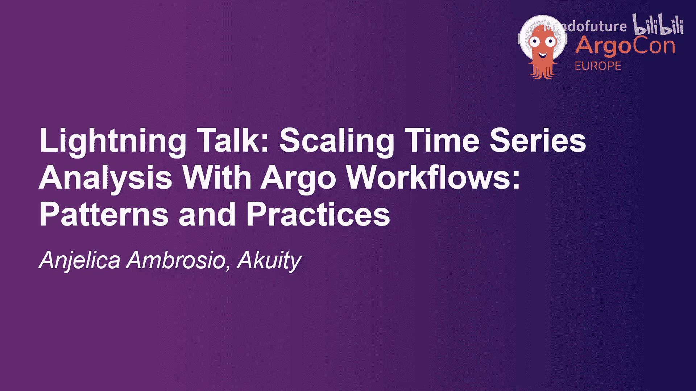
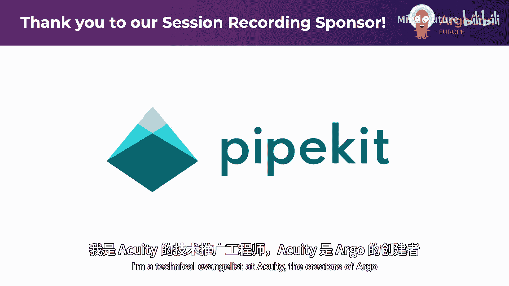
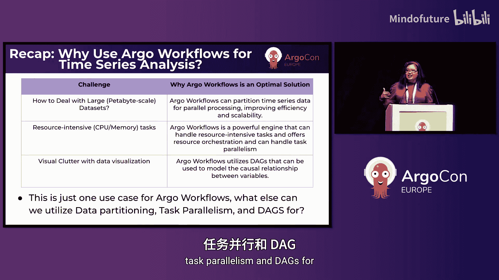

# 013：使用 Argo Workflows 扩展时间序列分析 📈





## 概述

在本教程中，我们将学习如何利用 Argo Workflows 这一云原生工作流引擎，来解决大规模时间序列分析中遇到的挑战。我们将探讨时间序列分析的核心概念、常见工具的限制，以及 Argo Workflows 如何通过并行处理、数据分区和有向无环图等特性，高效地处理海量数据。

---

## 1️⃣：认识时间序列分析

时间序列数据是一种记录特定时间间隔内趋势的数据类型，而非随机记录数据点。这些间隔可以从毫秒到年不等。收集这些数据点是为了分析趋势和模式，并用于进行预测，例如今日天气或交通拥堵时长。

以下是时间序列数据的更多示例。

*   **股票价格与市场趋势**：金融领域跟踪价格随时间的变化。
*   **应用程序性能**：监控软件在不同时间段的响应时间和资源使用情况。
*   **能源使用情况**：记录用电量以识别高峰时段。

通过分析时间序列数据，我们可以做出更明智的决策。例如，通过观察能源使用图表，我们可以发现用电高峰在下午3点到8点，从而决定在高峰时段减少空调使用以节省电费。

---

## 2️⃣：时间序列分析的价值与挑战

上一节我们介绍了时间序列分析的应用。本节中我们来看看它对组织的核心价值以及实施时面临的技术挑战。

组织可以利用时间序列分析来预测未来趋势、检测模式和异常、发现潜在风险、制定商业策略，并通过领先趋势、响应变化和做出数据驱动的决策来获得竞争优势。

然而，进行时间序列分析说起来容易做起来难。完整的分析流程通常包括以下步骤：

1.  收集数据
2.  处理数据
3.  创建可视化图表
4.  构建分析模型

手动完成这些步骤极其耗时。虽然存在如 `pandas`、`Matplotlib`、`Jupyter Notebooks` 等工具库，但它们也有其局限性。当处理海量数据集时，我们主要面临三大挑战：

*   **内存使用**：工具如 `pandas` 通常将整个数据集加载到内存中，处理GB、TB级数据时容易导致性能瓶颈甚至内存不足。
*   **性能限制**：许多工具是单线程的，严重限制了并行处理能力。处理海量数据时，“一次一个任务”的方式无法满足对速度的需求。
*   **数据可视化**：对于大型数据集，折线图等传统图表会因数据点过多而变得混乱难以解读，妨碍深度分析。

---

## 3️⃣：Argo Workflows 简介

面对上述挑战，我们需要一个强大的解决方案。这就是 Argo Workflows。

Argo Workflows 是一个开源的、容器原生的工作流引擎，用于在 Kubernetes 上编排并行任务。它专为运行容器化应用而设计，非常适合数据处理和机器学习等资源密集型任务。

让我们快速了解一个 Argo Workflows 的重要概念，它对于时间序列分析非常有用。

### 理解有向无环图

在 Argo Workflows 中，你可以将工作流定义为一个 **有向无环图**。DAG 更加灵活，允许任务在特定依赖项完成后立即开始运行。

你可以使用模板创建动态 DAG。这对于构建弹性的数据管道非常有用，可以提高效率和计算速度。对于复杂的工作流，DAG 更易于维护，并允许任务在运行时实现最大程度的并行化。

请记住 DAG 这个概念，因为它对解决之前提出的三个技术挑战至关重要。

---

## 4️⃣：使用 Argo Workflows 应对挑战

上一节我们介绍了 Argo Workflows 和 DAG 的核心概念。本节中我们具体看看如何用它来解决时间序列分析中的难题。

### 挑战一：解决内存使用问题

当处理 GB、TB 甚至 PB 级的数据集时，Argo Workflows 可以通过将数据划分为更小的分区来实现可扩展性，即 **数据分区**。

通过将处理步骤定义为容器，并利用共享存储卷中的工件来处理大型数据集和依赖关系，Argo Workflows 可以独立处理每个数据分区，从而提高效率和计算速度。

### 挑战二：突破性能限制

Argo Workflows 专为在 Kubernetes 上编排并行作业而设计。除了数据处理，时间序列分析还涉及模型训练、预测和特征提取等其他资源密集型任务。

Argo Workflows 提供了任务并行化、完成度跟踪和自动重试等机制。这非常适合时间序列分析，因为我们可以以分布式方式处理这些资源密集型任务。

例如，在以下工作流中，我们可以同时搜索数据集中的两个关键词（“hello”和“world”），而不是依次执行任务。

```yaml
# 简化的并行任务示例
apiVersion: argoproj.io/v1alpha1
kind: Workflow
metadata:
  generateName: parallel-search-
spec:
  entrypoint: main-dag
  templates:
  - name: main-dag
    dag:
      tasks:
      - name: search-hello
        template: search-template
        arguments:
          parameters: [{name: keyword, value: "hello"}]
      - name: search-world
        template: search-template
        arguments:
          parameters: [{name: keyword, value: "world"}]
  - name: search-template
    inputs:
      parameters:
      - name: keyword
    container:
      image: appropriate/search-image:latest
      command: ["./search"]
      args: ["{{inputs.parameters.keyword}}"]
```

### 挑战三：优化数据可视化

可视化是时间序列分析的重要组成部分。DAG 本身可以作为数据点之间因果关系的可视化表示。

DAG 中的箭头可用于建模因果影响，帮助识别时间序列的底层因果结构，揭示哪些变量正在影响其他变量以及影响的方向。与包含大量数据点的混乱折线图相比，DAG 通常更清晰易懂。

此外，Argo Workflows 还提供**工件可视化**功能，这对于需要使用 HTML、文本或 JSON 文件生成可视化结果的场景非常方便。

---

## 5️⃣：示例与总结

以下是演示如何使用时间序列数据和动态 DAG 的 GitHub 仓库二维码，可供参考。



### 总结

本节课中我们一起学习了：
1.  时间序列分析能带来巨大价值，帮助组织获得竞争优势。
2.  使用 `pandas` 或 `Jupyter Notebooks` 等常见工具进行时间序列分析可能非常耗费资源和时间。
3.  **Argo Workflows 是最佳解决方案**，因为它专为并行处理而构建，能提高效率和计算速度。
4.  它通过**数据分区**增强了可扩展性，并可用于为时间序列数据创建模型或可视化（如 **DAG**）。


但这只是 Argo Workflows 的一个用例。想象一下，我们还可以利用 Argo Workflows 强大的数据分区、任务并行化和 DAG 功能来做些什么。

感谢您的时间。


