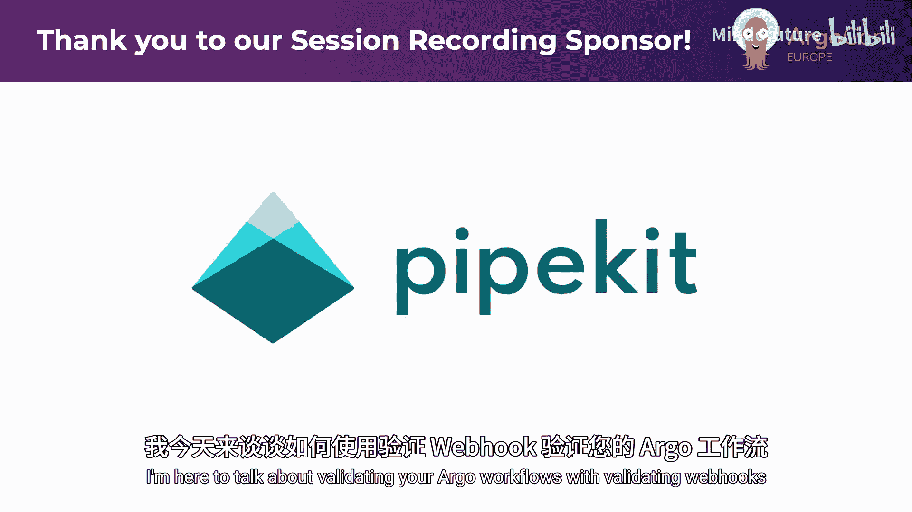
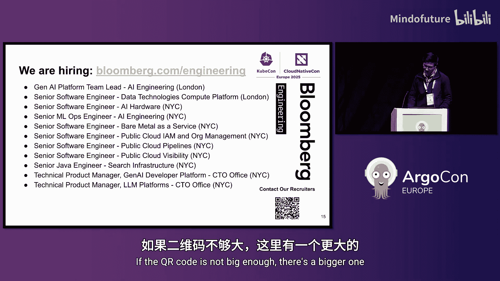

# 014：如何确保工作流有效？使用验证性 Webhook 双重检查你的 Workflow Spec 🛡️




在本教程中，我们将学习如何为 Argo Workflows 配置验证性 Webhook，以确保提交到 Kubernetes 集群的工作流定义在创建前就是有效的。我们将探讨默认验证机制的不足、验证性 Webhook 的工作原理、其带来的好处以及实施时需要考虑的注意事项。

## 问题陈述：无效的工作流为何能被接受？

上一节我们介绍了本教程的背景，本节中我们来看看 Argo Workflows 默认验证机制存在的问题。

Argo Workflows 通过 Kubernetes API 服务器提交时，默认不会进行完整的验证。这通常是因为 Argo 安装时使用了最小化的 CRD（Custom Resource Definition），其中包含的 OpenAPI 模式（schema）信息有限。这是由于 Kubernetes API 服务器对 CRD 大小的限制所导致的。

因此，如果你创建了一个包含无效定义的工作流（例如，在模板规范中使用了无意义的字段），API 服务器会直接接受它并返回 200 状态码。然而，当工作流在集群中实际执行时，它会失败并显示错误信息，指出定义中存在无效的规范。

更糟糕的是，即使工作流定义本身通过了模式验证，它也可能引用了集群中不存在的 WorkflowTemplate。这种情况同样不会在创建时立即失败，而是在工作流执行到后期阶段时才失败。

这两种情况都导致了糟糕的用户体验：用户提交工作流后收到了成功响应，但稍后在 Argo 服务器 UI 中查看时，却只看到执行失败和错误信息。

## 为何需要统一的入口点？

你可能会问，为什么不直接使用 Argo Server 或 Argo CLI 的 `lint` 功能呢？原因在于我们需要一个统一的入口点。

我们是一个多集群、多数据中心的平台，为租户提供跨多个数据中心的集群访问。除了工作流，我们还管理 ConfigMap 和 Secret 等资源。我们不希望用户需要记住不同的入口：创建工作流用 Argo Server，创建 ConfigMap 又得用 `kubectl`。

使用 Kubernetes API 服务器作为统一入口点，也使得与其他系统（如 GitOps 工具或开放集群管理）的集成更加容易，因为这些系统通常使用原生的 Kubernetes 清单，并不直接理解 Argo 的格式。

## 解决方案：验证性准入 Webhook 🎯

上一节我们明确了问题与需求，本节中我们来看看核心解决方案：验证性准入 Webhook。

验证性 Webhook 是 Kubernetes API 服务器准入控制的一部分。当你通过 API 服务器创建资源时，请求会经过一系列步骤：

1.  经过**变更性 Webhook**。
2.  进行针对 CRD 中定义的 **OpenAPI 模式验证**（这正是 Argo 最小化安装所缺失的）。
3.  经过**验证性 Webhook**。

我们正是在模式验证之后的这个阶段进行验证。API 服务器会调用我们的验证性 Webhook 服务，由该服务判断工作流定义是否合法，并据此决定拒绝或接受该请求。

具体实现上，我们使用 `kubebuilder` 来引导创建验证性准入 Webhook 服务。在底层，我们直接使用了 Argo 代码库中的验证函数。

以下是核心验证逻辑的示意代码：

```go
// 伪代码，示意调用 Argo 的验证函数
import “github.com/argoproj/argo-workflows/v3/pkg/apis/workflow/v1alpha1”

func validateWorkflow(workflow *v1alpha1.Workflow) error {
    // 调用 Argo 内置的验证逻辑
    return validation.ValidateWorkflow(workflow, workflowLister)
}
```

Argo 的验证函数（位于代码库的 `validate.go` 文件中）提供了非常全面的检查，它不仅是检查工作流规范是否符合模式定义，还会深入检查诸如模板调用的每个参数、所有必需参数是否都已提供、工作流中引用的模板是否真实存在等许多方面。

通过直接调用这个验证函数，而不是依赖 Argo Server，我们降低了对集群中 Argo Server 部署的依赖。即使没有运行 Argo Server，我们也能执行相同的验证逻辑。

## 实施验证性 Webhook 的好处 ✅

以下是实施验证性 Webhook 带来的主要优势：

*   **全面覆盖的验证**：所有通过任何媒介（Argo Server UI、Argo CLI、`kubectl`）提交的 Argo 资源都会得到验证。
*   **隐式且强制的检查**：用户无需额外执行 `argo lint` 或 `argo submit --dry-run` 等命令，每一次提交都会自动触发验证。
*   **即时反馈**：所有格式错误的工作流（如前文提到的无效字段）都会被立即拒绝，不会进入系统。引用无效 WorkflowTemplate 的工作流也会在创建时被拒绝。
*   **提升可观测性**：工作流不会再在执行的后期阶段因定义问题而失败。所有与定义相关的失败都会在创建时立即返回给用户。

## 注意事项与缓解措施 ⚠️

上一节我们看到了验证性 Webhook 的优点，本节中我们来看看实施时需要注意的一些问题和应对策略。

因为验证性 Webhook 是 API 服务器准入控制中的关键一环，其部署可能出现问题。

*   **服务可用性风险**：如果 Webhook 服务因故离线，根据其配置方式，可能导致工作流提交被阻塞，甚至可能影响整个集群的可用性。
    *   **缓解措施**：像对待任何关键部署一样，确保其高可用性。部署多个副本、设置完善的健康检查和就绪探针、在调用方配置适当的重试机制等。
*   **验证性能开销**：对于非常大的工作流定义，验证过程可能比较耗时。
    *   **缓解措施**：为 Webhook 配置一个合理的超时时间（例如 3 秒）。如果预期有特别庞大的工作流，可以适当增加超时设置。
*   **现有集群的兼容性**：如果将一个验证性 Webhook 安装到已经存在 WorkflowTemplate 的集群中，需要确保集群中所有现有的模板都是有效的。
    *   **原因**：Argo 的验证函数会去查找工作流中引用的所有模板。如果发现无效的模板，可能会导致解码错误，使验证函数以非预期的方式失败。
    *   **建议**：在开启 Webhook 之前，先使用 `argo lint` 等工具检查和清理集群中现有的无效模板。

## 总结

本节课中我们一起学习了如何利用 Kubernetes 的验证性准入 Webhook 来增强 Argo Workflows 的可靠性。



我们了解到，默认的 Argo 安装由于 CRD 限制，无法在 API 服务器层对工作流进行充分验证，导致无效工作流被接受并在后期失败。通过部署一个调用 Argo 内置验证函数的验证性 Webhook，我们可以为所有通过统一入口点（Kubernetes API 服务器）提交的工作流提供即时、全面、强制的验证。这极大地改善了用户体验和系统可靠性，确保只有有效的工作流才能进入执行阶段。在实施时，需要关注 Webhook 服务的高可用性、性能开销以及与现有环境的兼容性。