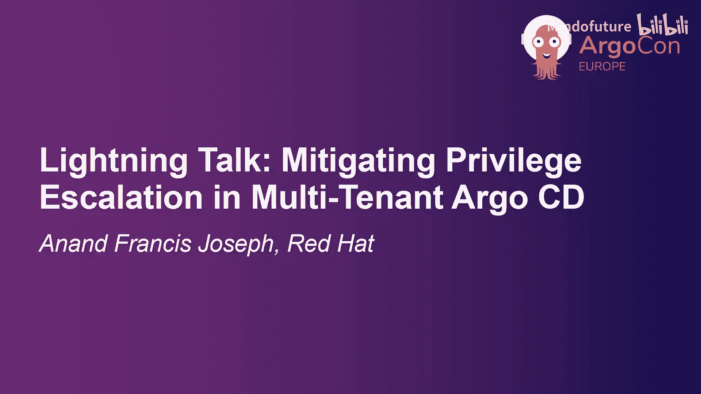
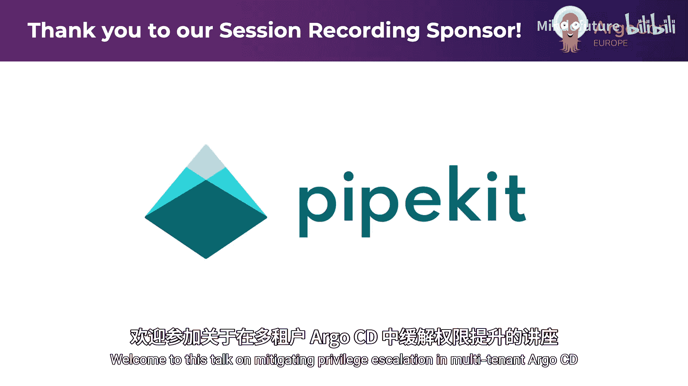
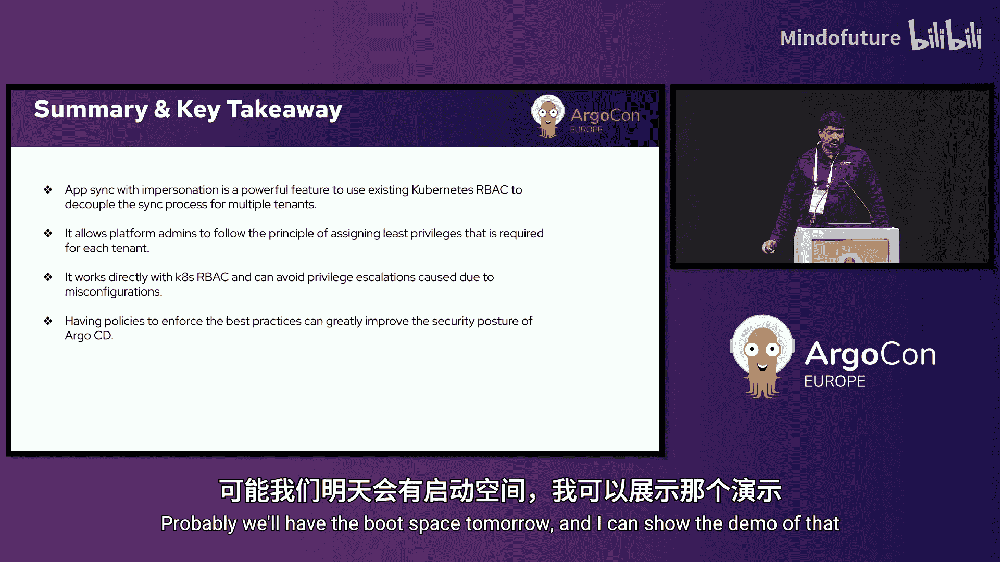

# 015：缓解 Argo CD 中的权限提升风险





在本教程中，我们将学习如何在多租户 Argo CD 环境中识别和缓解权限提升风险。我们将首先理解权限提升的概念，然后探讨 Argo CD 现有的多租户安全控制机制，最后介绍两种具体的缓解方法：使用 Kyverno 策略和启用新的“模拟身份同步”功能。

## 理解权限提升

权限提升是指攻击者利用系统漏洞、配置错误或安全弱点，试图从较低级别的访问权限获取更高级别系统或网络权限的行为。这与拥有初始访问权限但试图扩大其权限范围的攻击者有关。

一个常见的类比是国际象棋中的“兵升变”：当一枚最弱小的兵抵达棋盘底线时，它可以升变为威力最强的皇后。这形象地说明了低权限实体如何转变为高权限实体。

权限提升主要分为两种类型：
*   **垂直权限提升**：用户从低权限角色（如普通用户）提升为高权限角色（如系统管理员）。
*   **水平权限提升**：在多租户环境中，一个租户的管理员试图获取另一个租户的管理权限。

## Argo CD 中的多租户安全控制

上一节我们介绍了权限提升的基本概念，本节中我们来看看 Argo CD 为多租户环境提供的核心安全控制机制。

Argo CD 内置了多层安全控制来管理多租户访问：
1.  **基于角色的访问控制**：Argo CD 拥有自己的 RBAC 系统，同时依赖于底层的 Kubernetes RBAC。
2.  **应用项目**：`AppProject` 是 Argo CD 中的管理资源，用于定义应用程序可以部署的源仓库、目标集群以及可部署的资源类型，是实施多租户隔离的关键。
3.  **安装范围**：Argo CD 支持两种安装模式：
    *   **集群范围安装**：Argo CD 对整个集群拥有完全控制权。
    *   **命名空间范围安装**：Argo CD 仅能部署资源到特定的命名空间。

## Argo CD 中的权限提升问题

了解了基本的安全控制后，我们需要分析这些控制机制在特定场景下可能存在的弱点。在 Argo CD 的标准架构中，权限流如下所示：

```
Argo CD 最终用户 -> Argo CD RBAC -> Argo CD Application Controller Service Account -> Kubernetes RBAC -> 目标集群
```

这里存在一个关键问题：**Argo CD 应用控制器使用同一个高权限服务账户来同步所有租户的应用程序**。这意味着，如果某个租户的应用需要高权限来部署特定资源，那么所有租户实际上都间接拥有了这些高权限。这为水平权限提升创造了条件，因为一个租户可能利用共享的高权限服务账户，访问或影响其他租户的资源。

## 缓解方法一：策略强化的应用项目

一种常见的预防方法是正确配置 Argo CD 应用项目。通过为每个租户定义明确的项目边界，可以限制其操作范围。

以下是使用策略引擎（如 Kyverno）来强制执行最佳实践的关键策略示例：

*   **避免使用默认项目**：强制所有应用程序都必须归属于一个明确定义的非默认项目。
*   **强制执行全局项目**：创建一个包含所有资源黑名单和通用配置的全局项目，并让所有租户项目继承或引用它。
*   **实施命名空间隔离**：确保每个租户的项目仅能访问其专属的命名空间。

通过上述策略，平台管理员可以为每个租户创建一个严格限制的 `AppProject`，从而在 Argo CD 层面建立安全边界。

## 缓解方法二：使用模拟身份进行应用同步

虽然策略强化有效，但它仍然依赖于共享的高权限服务账户。为了更彻底地解决根本问题，Red Hat 为 Argo CD 引入了一项新的 Alpha 特性：**应用同步模拟**。

该功能的核心思想是：**允许 Argo CD 在同步应用程序时，模拟使用不同租户专属的 Kubernetes 服务账户**。这样，每个租户的同步操作将受到其专属服务账户所绑定的 Kubernetes RBAC 权限的限制，实现了权限的完全解耦。

要启用和使用此功能，请遵循以下步骤：

1.  **启用特性标志**：此功能默认禁用，需在 Argo CD 配置中通过 `argocd-cm` ConfigMap 显式启用。
2.  **启用“任意命名空间应用”**（可选）：为了灵活性，可以允许在每个租户的命名空间中创建 Argo CD 应用。
3.  **在 AppProject 中配置目标与服务账户**：这是最关键的一步。在 `AppProject` 资源的 `spec.destinations` 字段中，现在可以为每个目标集群指定一个 `serviceAccount` 名称。示例如下：
    ```yaml
    apiVersion: argoproj.io/v1alpha1
    kind: AppProject
    metadata:
      name: tenant-a-project
    spec:
      destinations:
      - server: https://kubernetes.default.svc
        namespace: tenant-a-namespace
        serviceAccount: tenant-a-sync-sa # 指定租户A专用的服务账户
    ```
    当属于此项目的应用向 `tenant-a-namespace` 同步时，Argo CD 将使用 `tenant-a-sync-sa` 这个服务账户的凭证和权限，而非控制器共享的高权限账户。

这种方法带来了显著优势：
*   **有效防止权限提升**：租户无法超越其服务账户的权限。
*   **支持更灵活的集群配置**：允许向同一集群 URL 使用不同的服务账户身份，突破了旧版本的某些限制。
*   **遵循最小权限原则**：平台管理员可以精确地为每个租户分配其所需的最小权限集。
*   **直接集成 Kubernetes RBAC**：无需在 Argo CD 的 `AppProject` 和 Kubernetes 的 `RoleBinding` 之间手动保持权限同步。

## 总结与关键要点

本节课中，我们一起学习了如何缓解多租户 Argo CD 环境中的权限提升风险。

关键要点总结如下：
*   **权限提升**是多租户环境的核心安全威胁，分为垂直和水平两种类型。
*   Argo CD 通过 **RBAC**、**AppProject** 和**安装范围**提供基础的多租户控制。
*   **标准架构**中共享的高权限服务账户是潜在的风险点。
*   **方法一（策略强化）**：通过正确配置 `AppProject` 并结合 **Kyverno** 或 **OPA** 等策略引擎强制执行最佳实践，可以在 Argo CD 层面建立有效的安全边界。
*   **方法二（模拟同步）**：新的 **应用同步模拟** 功能（Alpha 阶段）通过允许每个租户使用专属的 Kubernetes 服务账户进行同步，从根本上实现了权限隔离，是更推荐的长期解决方案。
*   **组合使用**：无论采用哪种方法，结合策略引擎来持续验证和强制执行安全配置，都能极大提升 Argo CD 的整体安全状况。



通过理解和应用这些概念与工具，平台团队可以构建更安全、合规且易于管理的多租户 GitOps 平台。