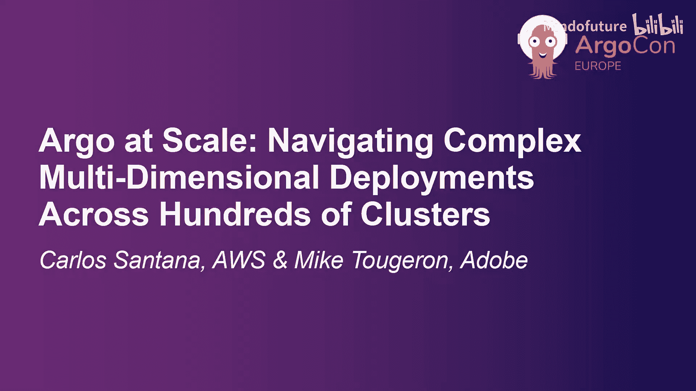
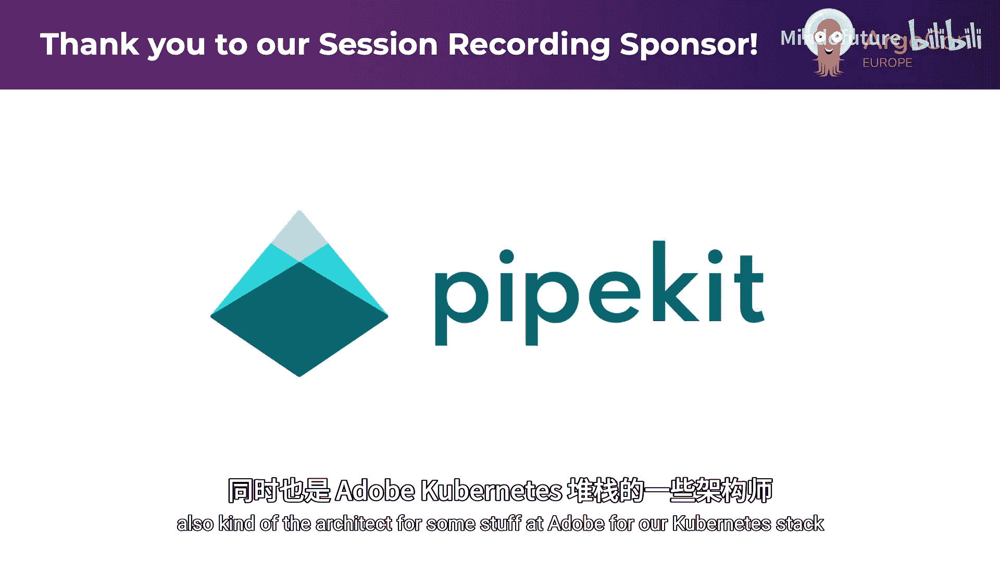
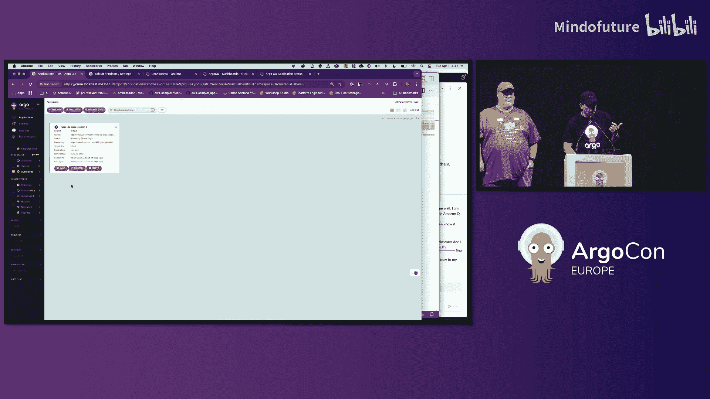

# 016：驾驭复杂的多维部署





在本教程中，我们将学习如何在大规模、多维度的 Kubernetes 环境中，使用 ArgoCD 高效、可靠地管理应用部署。我们将重点解决部署可见性、告警精准度和自动化流程等挑战。

## 概述

大家好，我是 Mike Tujaron，Adobe 公司的首席云工程师，负责 Kubernetes 技术栈的架构设计。这位是 Carlos Santaana，来自 AWS 的高级 EKS 解决方案架构师。

首先，快速了解一下 Adobe 的环境规模。我们运行着一个非常混合的环境，包含 Flatcar 和 Ubuntu 操作系统。我们使用多个云服务提供商，业务遍布全球。目前我们有 **430 个集群**，并且数量还在增长。我们拥有超过 **240 个 Helm Chart**，它们可能被部署到这些集群上。最重要的是，与本次分享相关的是，我们的基础设施工程团队有 **90 名开发者**，分布在 7 个不同的国家。这些数字和多样性，都影响着我们使用 ArgoCD 向集群部署应用的方式。

## 核心问题：如何保持系统稳定运行

我们的核心问题是：如何保持系统稳定运行？仅在今年二月，我们就向整个集群舰队进行了 **554 次** 集群附加组件部署。平均下来，每天约有 20 次部署。考虑到我们的规模，ArgoCD 自带的监控指标难以满足需求。我们需要结合 Prometheus 指标和 ArgoCD 通知来填补空白。

海量的变更以及应用版本与舰队属性的多种组合，给我们带来了**可见性问题**。下图（虚构数据）展示了这个问题的复杂性：不同的集群版本、不同的应用、每个应用的不同版本，我们需要一种清晰、直观的方式将它们整合展示出来。


接下来，Carlos 将介绍我们如何整合这些信息。

## 解决方案：使用集群分组与属性

在 Adobe，我们采用的方法是给集群赋予属性。这些属性可以是创建 ArgoCD 集群密钥（Secret）时的标签（Labels）和注解（Annotations）。这提供了基于维护需求对集群进行分组的能力。

我们为每个附加组件（Addon）使用一个 ApplicationSet。这个 ApplicationSet 负责从 240 个可能的 Helm Chart 中，将特定的附加组件部署到各个集群。关键在于，无论 ArgoCD 实例有多少（Adobe 有多个实例，每个处理约 200-500 个 ArgoCD 应用），都使用单一的 ApplicationSet。这样，我们就可以基于 ApplicationSet 分组进行推广（Promotion）。

以下是如何进行分组的一个例子。例如，“生产”（Production）环境是一个分组，但你需要第二层分组，我们称之为“维护组”（Maintenance Group）。你可以将其理解为生产舰队中，你希望一起升级或打补丁的一组集群。最佳实践是，随着推广信心的增加，后续的组应包含更多集群，以加速推广过程，而不是线性地逐个集群进行。


如上图所示，生产环境下的 Group A 有 2 个集群，Group B 有 4 个集群。

## ApplicationSet 配置示例

这在 ApplicationSet 中是如何体现的呢？以下是一个 ApplicationSet 的片段（非完整内容）。核心思想是使用扁平（flat）或合并（merge）集群生成器（Generator）。第一个生成器定义附加组件的默认版本，然后根据集群属性使用选择器（selector）。**集群的属性决定了它将获得哪个附加组件及其版本**。

例如，顶部的 `c` 或 `d` 环境获得版本 `1.1.7`。下一个是 `staging` 环境，它有 Group A 和 Group B，分别使用不同版本。再下一层是 `production` 环境，Adobe 在这里采用了金丝雀（Canary）发布：可能先在一个集群上部署，然后是 Group A（例如 2 个集群），再然后是 Group B（例如 3 个集群）。这样做的目的是**最小化爆炸半径**。

此外，Adobe 使用了大量自动化和 CI 工具来随时升级这些附加组件。我们通过拉取请求（Pull Request）进行管理，并使用 Prow 来管理这些 PR。随着渐进式同步（Progressive Sync）功能越来越稳定，我们计划未来采用它。目前它处于 Alpha 阶段，还缺少一些功能，比如处理同步波（Sync Waves）。

## 预期与非预期问题

随着部署的进行，你必须预料到各种问题。有些是预期的，有些则是非预期的。

*   **同步开始阶段**：可能出现 Git 访问权限缺失导致同步失败，或者应用/集群上设置了拒绝同步窗口（Deny Sync Window）。
*   **试运行（Dry Run）阶段**：可能因为集群上还没有所需的 CRD（Custom Resource Definition）而导致失败。例如，尝试部署 Prometheus 规则时，Prometheus Operator 可能尚未部署。
*   **准入控制器（Admission Controller）问题**：可能被 OPA Gatekeeper 策略阻止，或者我们内部的 `precincts` 组件会检查集群是否存在中断或客户事件，从而阻止同步，以便运维团队在排查重大事件时，集群不会发生变更。
*   **同步过程问题**：可能推送了错误的镜像标签，或者应用因 ConfigMap 尚未创建而启动失败。

当然，还存在许多其他可能性。我们最喜欢的挑战之一是：测试并不总是有效。

## 创建自定义指标以增强可见性

我们的解决方案是创建新的监控指标。你可能不知道，Kube-state-metrics 有一个很酷的功能：可以捕获由 CRD 创建的 CR（Custom Resource）中的字段，并将其作为指标发出。

这意味着，你可以从 ArgoCD 的 Application CR 中抓取信息，例如操作状态的开始时间（`operation.state.startedAt`）和结束时间（`operation.state.finishedAt`），或者源版本（`source.revision`）等属性。我们还会从 AppProject 中提取信息，以获取应用或集群的同步窗口信息。

然后，我们使用 **Prometheus 重写规则（Rewrite Rules）**。这部分有些复杂，我们有一个包含约 350 行 YAML 配置的代码库来处理所有这些。一旦运行起来，它实际上相当简单。我们处理这些数据，结合 ArgoCD 已发出的 `argocd_app_info` 指标，创建出详细的指标。

我们整合了从 Kube-state-metrics 创建的其他指标，能够生成：
*   **同步窗口指标**：了解哪些应用或集群有拒绝/允许同步窗口。
*   **长时间运行同步指标**：识别哪些应用的同步耗时过长。
*   **不同步应用指标**：了解哪些应用因故处于不同步状态。

最酷的是，我们可以将这些指标与同步窗口指标结合。例如，如果一个应用不同步但处于拒绝同步窗口，或者反之。

## 解决“别打扰我”问题：精准告警

ArgoCD 有很好的通知机制，可以通过通知插件在应用不同步、不健康、降级、进行中时发送告警。但这里存在“别打扰我”的问题。

*   如果一个应用不同步，但设置了拒绝同步窗口，开发者真的需要被通知吗？可能不需要，因为你设置拒绝窗口是有原因的。
*   如果一个应用处于允许窗口且状态为“进行中”，你需要被通知吗？可能不需要，因为你可能刚刚做了部署。
*   但如果这个“进行中”状态持续了**两个小时**，你可能就需要知道了，因为大多数 Kubernetes 部署不会花两小时。

内置的 ArgoCD 通知机制可能导致很多误报。我们的自定义指标帮助我们**过滤掉噪音，只获取真正失败的部署**。

我们的过滤逻辑是：
1.  首先收集不健康的应用程序（不健康、降级、不同步等）。
2.  然后找出那些开始于 90 分钟前但尚未结束的同步（长时间运行）。
3.  接着过滤掉那些处于拒绝同步窗口的应用。
4.  最后，你将得到真正需要关注的不同步应用列表。

你可以将其整合到一个漂亮的仪表板中，并基于此发送告警。这样，当告警触发时，无论是开发者还是运维团队，收到的都是**可操作且相关**的信息，他们可以立即采取行动确保应用健康。

## 实战演示：搭建本地多集群环境

接下来，Carlos 将展示一个非常酷的演示。

我们将展示一个由几个部分组成的演示。在屏幕底部，我们使用了一个名为 `idp-builder` 的 CLI 工具。这个工具可以一键式引导整个环境：它会创建一个 Kind 集群，部署 ArgoCD、Nginx 和一个本地 Git 服务器。它会获取所有 YAML 文件并创建 Git 仓库。如果你修改了 YAML 文件，它可以在监视模式下自动提交和推送。之后，就完全由 ArgoCD 接管了。

在这个演示中，我们使用 **vcluster** 来模拟大量具有特定属性的集群。我们部署了几个有问题的“假”应用，例如长时间运行的、不同步的、降级的应用。vcluster 通过 External Secrets 注册到 ArgoCD。我们还使用了 kube-prometheus-stack Helm Chart，它为我们提供了 Prometheus、Grafana 和 Kube-state-metrics（我们将用它来收集应用和项目的信息）。

演示的一行命令如下（你需要先安装 Docker）：
```bash
git clone <repo-url> && cd <repo-dir> && ./idp-builder up
```

在配置中，你可以看到 ApplicationSet 使用合并生成器来部署附加组件。我们还配置了 Kube-state-metrics 来抓取 ArgoCD 应用的同步开始/结束时间，并创建自定义指标。同时，我们从 AppProject 提取同步窗口信息，并使用 Prometheus 规则进行关联，最终生成我们关心的新指标。

在 ArgoCD UI 中，你可以看到一些应用处于降级状态。按照传统方式，你可能会收到告警。但在我们的方案中，如果这些应用有拒绝同步窗口，我们就不会收到打扰。Adobe 的做法是将其作为一个“闸门”：如果有人正在处理问题，他们会在应用上设置一个同步窗口，以停止告警。一旦窗口移除，就恢复正常监控。

另一个关键点是识别**长时间运行的健康应用**。在演示中，我们设置了一个规则：如果应用同步时间超过 30 分钟（生产环境可能设为 1 小时），就生成一个自定义指标。这在 ArgoCD 中很难直接发现。



## 可视化与告警集成

在 Grafana 仪表板中（这是自定义的，非 ArgoCD 自带），我们可以看到哪些集群和应用有同步窗口。这模拟了团队正在处理有问题的应用。如果我们移除了某个应用的同步窗口，它就会出现在仪表板底部的“需要关注”列表中，那里会显示降级的、不同步的以及长时间运行的应用。**这正是我们希望触发告警（如 Slack）的时刻**。

此外，我们计划将 Kube-state-metrics 配置示例和 Prometheus 规则贡献到 ArgoCD 上游，以便社区有更多可用的运维资产。

## 告警信息富化：精准触达负责人

我们过滤了信息，知道了问题所在，但有时这还不够：你该把问题告诉谁？你可以发送到一个通用的 Slack 频道，但如果负责人不在线呢？（我们有 90 人分布在 7 个国家）。

因此，我们需要用额外信息来丰富告警。我们运行一个代理，它会查找 ArgoCD 资源，追溯提交信息，找到是谁修改了应用、Helm Chart 或值文件仓库，然后用这些信息丰富告警，最后发送 Slack 消息。

消息不仅发送到通用频道，让所有人知道有问题，还会**直接@那个负责人**，说：“嘿，你的部署出了问题，需要处理一下。” 这对于长时间运行的同步特别有用，负责人不需要记得一小时后回来检查，系统会主动通知。

我们最近内部发布了这个功能，希望未来能将其通用化并贡献给社区。

## 总结与资源

本节课中，我们一起学习了在大规模、多维度 Kubernetes 环境中使用 ArgoCD 的挑战与解决方案。

我们探讨了如何通过**集群属性与分组**来管理复杂的部署矩阵，如何利用 **Kube-state-metrics 和 Prometheus 规则**创建自定义指标以增强部署可见性，以及如何**过滤噪音、实现精准告警**，并通过**信息富化**将问题直接推送给相关负责人。我们还看到了如何利用工具快速搭建本地演示环境。

相关资源（代码库、Prometheus 规则等）可以通过以下 QR 码获取。我们希望能将其纳入 ArgoCD Labs 或 ArgoCD 主代码库中。


感谢阅读，如果你有任何问题，可以通过 CNCF Slack 或 Kubernetes Slack 联系我们。