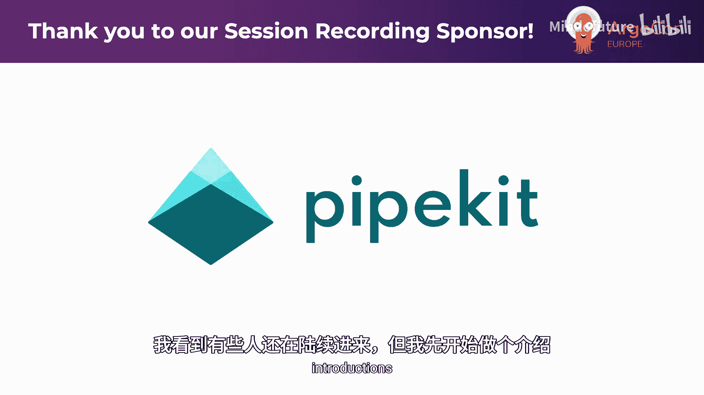
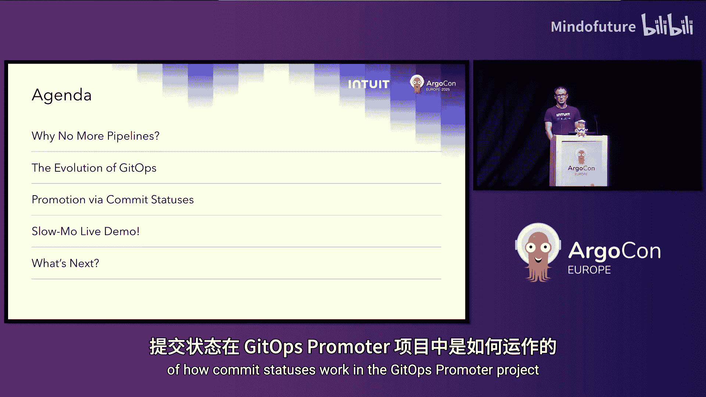
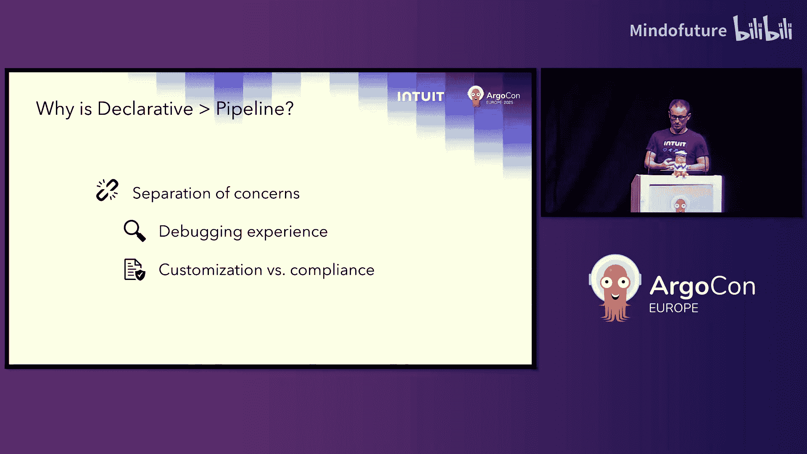
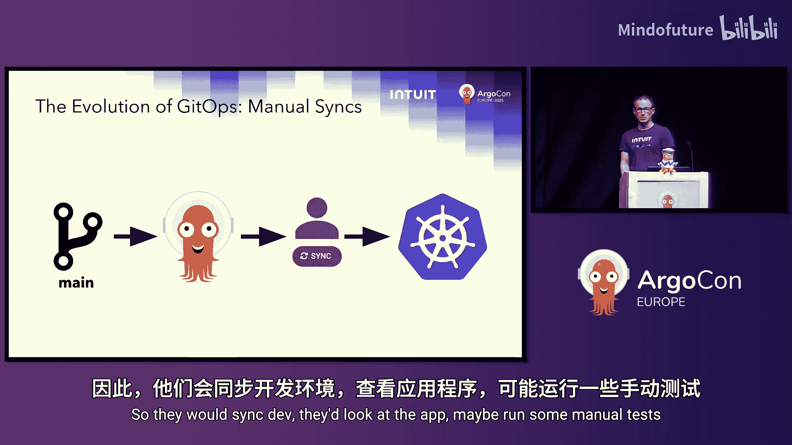
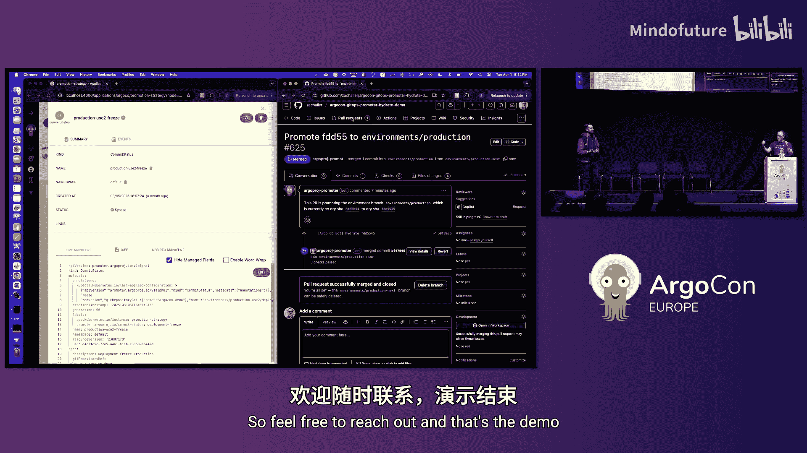
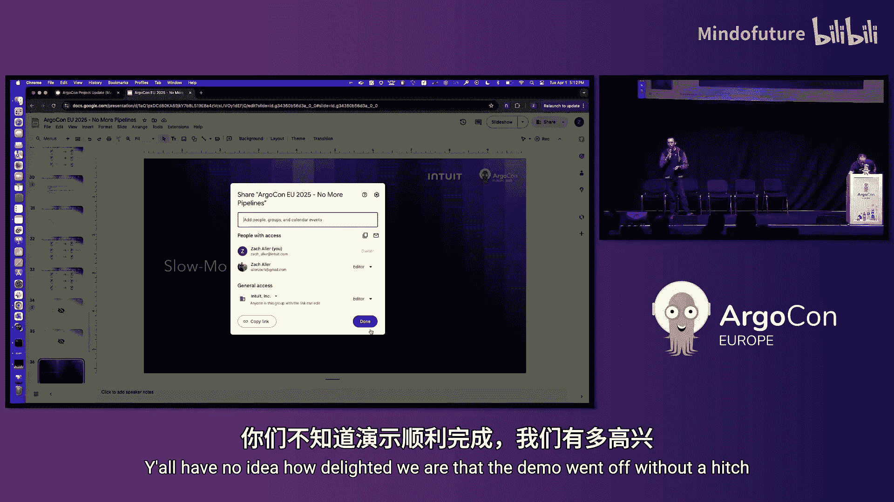
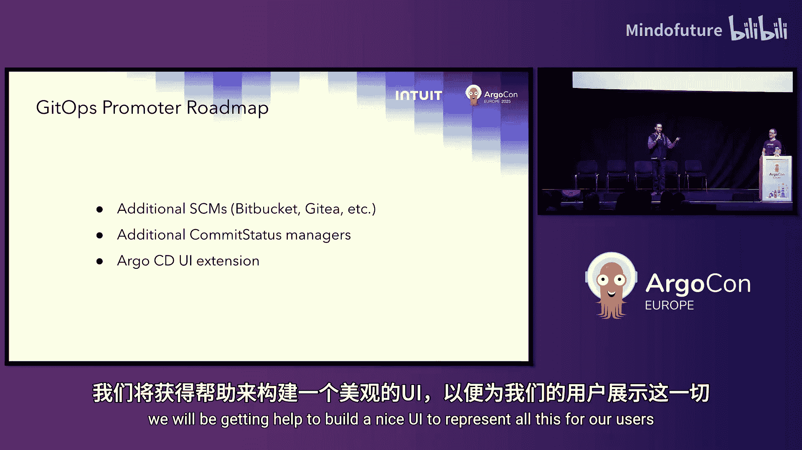

# 018：告别流水线——通过提交状态协调环境晋升

在本教程中，我们将学习如何利用声明式 API 和 Git 提交状态来替代传统的 CI/CD 流水线，实现自动化的、可控的环境晋升流程。我们将从 GitOps 的历史演变讲起，深入理解“无流水线”理念，并详细解析基于提交状态的环境晋升机制。

## 讲师介绍

我是 Michael Crenshaw，Intuit 公司的首席软件工程师，任职于 ArgoCD 和 Rollouts 团队，同时也是 Argo CD 项目的核心维护者之一。

这位是 Zach Uler，同样来自我们的 ArgoCD Rollouts 团队，他是 Argo Rollouts 项目的核心维护者。

关于 Intuit：我们是一家金融软件公司，提供会计软件、税务软件等服务。我们拥有庞大的用户基数，这意味着巨大的扩展性挑战。ArgoCD 和所有 Argo 项目是我们应对这些挑战的重要组成部分。Intuit 也是开源的大力支持者，曾两次获得 CNCF 终端用户奖，创建并开源了包括 Argo 在内的多个项目。我个人非常感谢 Intuit 允许我将维护开源软件作为工作的一部分。

## 议程概述

本次演讲名为“告别流水线”。我们需要了解为何要摒弃流水线，以及可能的替代方案。我们将回顾 GitOps 的演变历程，解释我们认为其未来的发展方向。我们将重点讨论环境晋升如何通过提交状态来实现。Zach 将为我们慢速演示 GitOps Promoter 项目中提交状态的工作机制，最后我们将探讨生态系统未来的发展。

## 告别流水线

首先，让我们明确什么是流水线，以及可能的替代方案。流水线包括 Argo Workflows、GitHub Actions、Jenkinsfile 等。声明式 API 则类似于 Kubernetes Pod 规范、StatefulSet 以及 ArgoCD Application 规范。声明式 API 更侧重于描述你“想要什么”，让系统自行解决如何实现；而流水线则更侧重于用非常明确的步骤描述“如何做”。

声明式 API 具有一些优势，我们将重点讨论**关注点分离**。在声明式 API 中，我可以提供一个用户关心的规范（例如环境晋升的步骤），而在后端，平台可以拥有另一个描述其关注点的独立规范。在流水线中，这些关注点往往会混杂在一起，形成“意大利面条式”的依赖关系。最终，开发人员不得不查看平台代码，而平台团队也需要查看开发人员的代码。这在调试体验中尤为明显，我的团队因此收到了大量支持请求。例如，当开发人员部署失败时，他们面对的是数千行 Jenkins 日志，其中大部分内容对他们毫无意义，因为这些代码是由平台团队编写的。因此，一个只关注其需求的声明式 API，可以让我们仅向用户暴露他们所需的错误信息和上下文。

关注点分离还能在**定制化与合规性**之间取得良好平衡。如前所述，流水线往往将事物紧密耦合。在 Intuit，我们曾提供一个 Jenkinsfile 作为晋升流水线，用户可以随意修改它，并且常常以平台团队不希望的方式修改。如果我们能提供一个声明式 API，只允许用户操作他们被允许的“旋钮”，那么对用户和平台双方来说，事情都会变得好得多。

## GitOps 的演变历程

为了了解未来，我们需要理解 GitOps 的历史。在“史前时代”，一切非常简单。你有一个包含“干燥”清单（dry manifests）的主分支，例如 Helm values、定制化覆盖层（overlays）。Argo CD 会动态地水合（hydrate）这些清单，然后自动同步到集群。

但这种模式很快就被打破了。我们关闭了自动同步，让用户手动点击同步按钮，原因有二：第一，我们希望用户在真正部署之前能看到水合后的清单差异，以便他们理解将要部署的内容；第二，他们需要进行手动环境晋升门控（gating）。他们会先同步到开发环境，查看应用，可能运行一些手动测试，然后再同步到预发布环境，依此类推。

手动操作非常繁琐，没有持续多久。我们用晋升流水线取代了这些用户交互。流水线中会运行 `argocd app sync`，等待 ArgoCD 应用就绪，可能还会运行一些测试，然后进入下一个环境。这样我们实现了自动化，但用户却脱离了水合清单的体验，他们不再审查这些清单。因此，我们回到了在流水线中渲染清单的模式，即“渲染清单模式”，这样我们至少拥有了渲染后清单的完整历史记录，即使用户在合并前没有第一时间查看。如图所示，这里有很多流水线，这也是 Intuit 目前所处的状态：使用 Jenkins 流水线进行清单渲染和晋升。

现在，我们可以开始讨论用声明式 API 来替代这些明确定义的问题和解决方案，从而简化流程。

## 迈向声明式 API：替换水合流水线

第一步是替换水合流水线。ArgoCD 2.14 引入了一个名为 **Source Hydrator** 的新功能，它是一个声明式 API。它只是 Application 规范中的一个字段，名为 `sourceHydrator`。它只需指定包含干燥清单的分支，ArgoCD 就会为你水合这些清单，并将其推送到 Git，从而获得完整的审计历史。

Source Hydrator 的一个很酷的功能是，你不仅可以推送到一个水合分支，还可以按环境推送到多个分支，或者按你想要的任何方式拆分。例如，你可以将与开发环境相关的所有应用，将其清单推送到一个 `dev` 分支；预发布和生产环境也各自拥有自己的水合清单分支。

这是我们从历史走向我们认为的 GitOps 环境晋升未来的转折点。在进入晋升部分之前，我们只需要对这个图景再做一次调整。但我想暂停一下，特别说明：

**这并非你听说过的基于分支的环境管理方式**。今天已经有好几个人来问我们：“等等，我们不是不应该把环境放在不同的分支里吗？” 是的，没错。不要告诉你的用户用不同的分支来代表他们的环境。所有内容都应该进入主分支。这里提到的分支是在后端自动生成的，它们是自动化的，不存在基于分支的环境管理所带来的问题。这是不同的概念，我想在进入晋升部分之前澄清这一点。

## 实现环境晋升的关键调整

这个调整使我们能够实现环境晋升。我们不是简单地将清单水合到每个环境的分支，而是为每个环境准备**一对分支**。这为你提供了一个在变更生效前暂存提议变更的地方。

因此，Hydrator 将渲染后的清单推送到 `dev-next`、`stage-next`、`prod-next` 分支。我们称这些为“提议水合分支”。然后，我们自动为每个分支创建拉取请求（PR），指向我们称为“活跃水合分支”的分支（例如 `dev`、`stage`、`prod`）。图中加入了用户图标，表示我们可以回到这个历史点，让用户查看 PR、合并它、在应用上运行测试，然后合并下一个环境的 PR。这就是手动晋升。

在历史上，我们通常会用流水线来替代这个手动步骤。但我们认为，在这个系统中，环境晋升的定义已经足够明确，我们可以直接跳转到声明式 API。

这就是 **Promotion Strategy**。它是一个真实的 CRD，由一个真实的控制器管理，该控制器位于 Argo Project Labs 下的 GitOps Promoter 代码仓库中。

我将带你了解它的三个不同部分：
1.  **环境**：这只是一个列表，列出了 ArgoCD 为每个环境自动同步的分支。这个列表的顺序决定了你晋升事物的顺序。但你仍然需要在环境之间设置门控。
2.  **提议提交状态**：这些是你在合并拉取请求之前就知道的事情，例如检查 YAML 语法或检查是否有部署冻结。你不需要查看实时状态来确定这些事情。
3.  **活跃提交状态**：这些代表在 PR 合并后你了解到的事情。例如，我的 Argo CD 应用在合并后是否变得健康？你可以根据需要为不同的环境运行不同的检查，例如，仅为预发布环境运行性能测试。

以上就是用户视角下的 GitOps 晋升体验。我们之前在“太空时代 GitOps”系列演讲中也讨论过这一点。现在，我们想带大家深入了解幕后，理解我们作为平台维护者如何为开发人员启用这种体验。

## 平台视角：简化与核心机制

让我们简化图表，只关注我们关心的部分。我们假设 Hydrator 正常工作并运行（尽管它目前处于 Alpha 状态，但我们会修复错误）。忽略图表的左侧。图表的右侧，ArgoCD 非常擅长自动同步，我们假设它能成功部署到 Kubernetes。中间部分是我们的工作。

我们有六个需要关注的分支。我们的工作就是对每个分支及其头部提交持有“意见”。这就是启用 GitOps Promoter 所需要做的全部事情：持有意见。

这些是我们持有的意见：
*   **提议端**：检查 YAML 语法，检查部署冻结。
*   **活跃端**：检查 ArgoCD 应用健康状态，运行性能测试。

我们需要将这些意见与 Promotion Strategy 控制器可以使用的东西关联起来。我们通过查看用户所做的“干燥”提交来实现这一点。例如，用户提交了“更新了镜像标签”，新提交的 SHA 是 `5a2c...`。

Hydrator 会向它推送到提议分支的水合清单提交中添加一个元数据文件，其中包含那个干燥提交的 SHA。当然，当 PR 被合并时，这个 SHA 也会出现在活跃分支中。但是，当我们需要向 Promotion Strategy 控制器表达我们的意见时，我们需要一种方法来区分这些不同的分支。我们利用 Git 的工作原理来实现这一点：每次提交都会获得一个唯一的 SHA。因此，每个位置都有一个我们可以关联意见的唯一 SHA。

我们使用另一个 CRD 来实现这种关联。这就是简化后的状态。作为平台管理员，为了给用户提供声明式的环境晋升，我们只需要关心这些。

这个 CRD 就是 **CommitStatus**。它同样位于 GitOps Promoter 项目中，目前已经可以工作。我们关心的部分是：
*   `key`：检查的名称，例如 `ArgoCDHealth`。
*   `sha`：例如 `4f6a1...`，如果你还记得上一张幻灯片，这对应右上角活跃开发分支的提交。
*   `phase`：状态，例如 `successful`。

这样，我们就表达了“该应用已健康”的意见，从而允许进入下一个阶段。

如果你精通 SCM（例如 GitHub），你会注意到，在 GitHub 中，你只能通过在**提议提交**（即你将要合并到下一个分支的提交）上设置提交状态来阻止 PR 合并。因此，我们需要在提议分支上创建一个**合成的提交状态**来代表前一个环境的状态。例如，我们希望在开发分支的提交变得健康之前，阻止 `stage-next` 合并。我们就创建这个合成提交状态。

Promotion Strategy 控制器会为你完成这个工作。重申一下，你只需要关心对这些提交持有意见。一旦你表达了意见，Promotion Strategy 控制器就会为你复制它。你不需要担心背后的细节。

为了持有这些意见，你可能需要编写自动化程序来管理这些提交状态。Zach 将慢速手动演示如何管理提交状态，这将展示你如何将其自动化。

## 慢动作演示：提交状态管理

这个演示更像是展示如果你要编写一个控制器来自动化这些步骤，你会做什么。它基本上是一个控制器为了对这些分支表达意见而必须执行的任务。

我们从 GitHub 上的一个定制化布局开始，包含 `base` 目录和 `dev`、`prod`、`staging` 环境。我将对 `base` 做一个会影响所有环境的更改，然后提交这个更改。

正如 Michael 所说，我们拥有这些分支对。现在，Hydrator 将运行，并将所有不同环境的渲染输出提交到它们各自的 `-next` 分支。

我们应该能在 ArgoCD 中看到一系列拉取请求开始出现，这些 PR 也会在 GitHub 上显示。现在我们有三个 PR，分别对应三个环境。每个 PR 上都有一些提交状态，例如 `ArgoCDHealth`、`Linting` 等。

作为 Linting 提交状态管理器，我需要对我提议的变更分支 `development-next` 表达意见。我可以轻松地获取 `development-next` 分支的 SHA，并创建一个 `CommitStatus` CR，将 `phase` 设置为 `pending`。在 GitHub 上，我们会看到这个检查出现并处于待定状态。

然后，我作为 Linter 检查 YAML，一切看起来都很好。我将更新 `CommitStatus` CR，将 `phase` 设置为 `success`。这会使检查变为绿色。现在，Promoter 获得了合并（即晋升）这个 PR 到活跃运行状态的许可。

由于这是第一个环境，没有前序环境，我们暂时不关心那些在尝试晋升预发布环境时才生效的活跃提交状态。

现在 PR 已合并。我切换到 ArgoCD Health 提交状态管理器的角色，需要对当前运行的开发分支表达意见。我获取开发分支的提交 SHA，并报告我的意见：ArgoCD 是健康的，一切已同步。

这时，Michael 提到的“魔法复制”开始起作用。如果我们查看预发布环境的 PR，我们会看到由 Promotion Strategy 控制器管理的一些提交状态。我们可以看到，针对开发环境的活跃检查 `ArgoCDHealth` 仍然处于待定状态。作为 ArgoCD 健康状态控制器，我已经检查过，ArgoCD 是健康的，一切已同步，所以我可以报告活跃开发环境现在是成功的。在预发布环境的 PR 上，我们应该看到相应的检查变为绿色。

然而，Linting 检查还没有被报告，这只是因为我手动操作太慢，不如自动化系统高效。让我们继续获取 `staging-next` 的 SHA，并报告其状态。我们将其保持为 `pending`。我们会看到状态仍然不是“可合并”，因为我们需要提议分支上的 Linting 通过。我们报告 Linting 成功，一切变为绿色，Promotion Strategy 控制器现在可以合并这个 PR，这意味着我们已经将变更晋升到了预发布环境。

最后，我们来看生产环境。生产环境有更多的检查。我们获取 `production-next` 的 SHA，并报告所有提议端的检查状态，例如 `DeploymentFreeze` 和 `Linting`。我们还需要对活跃的预发布环境表达意见，获取其提交 SHA，并报告 `IntegrationTest` 和 `ArgoCDHealth` 状态。

现在，在生产环境的 PR 上，我们应该有需要变绿才能合并的提交状态列表。作为控制器，我们持续监控这些状态。假设性能测试已在预发布环境通过，我们报告这个状态。同时，ArgoCD 健康状态也已同步并运行良好，我们将其设置为成功。

在 GitHub 上，我们可以看到前一个环境（预发布环境）的合成提交状态已经同步且健康。剩下的就是 Linting 检查，我们报告它已通过。最后，作为部署冻结检查管理器，我们查询变更管理系统，发现当前没有部署冻结，因此我们可以报告允许合并。

Promoter 现在将介入，合并那个 PR。至此，你已经通过这三个阶段完成了环境晋升。

目前，我们只编写了 ArgoCD 提交状态管理器，它是 GitOps Promoter 的一部分。安装 GitOps Promoter 后，你就会获得“我的前一个 ArgoCD 应用是否已同步且健康”的检查。我们期待有更多贡献来添加额外的提交状态控制器，欢迎大家联系我们。

## 生态系统展望与总结

我们对演示顺利进行感到非常高兴。尽管这是今天的最后一场会议，但大家似乎都非常专注，非常感谢。

正如 Zach 所示，那是慢动作下的工作原理，你可以将所有步骤自动化。再次强调，这些都是平台端的工作，是幕后的部分。你的用户不需要担心这些。我们做这些工作是为了让用户获得一个无需思考的、优美的自动化晋升体验。

那么，GitOps 晋升领域的下一步是什么？首先，介绍一下 GitOps Promoter 代码仓库近期的动态：正如 Zach 所说，他编写了 ArgoCD 提交状态控制器，因此你可以开箱即用地获得 ArgoCD 健康状态作为晋升门控。最近社区也有几个 PR：Robin Lee 添加了 GitLab 支持（他今天也在现场），还有人添加了自定义 PR 标题和正文模板支持，以便你可以根据组织需求定制那些自动生成的 PR。

展望未来，我们希望支持更多的 SCM。我们与大厅里的一些人交流过，他们非常需要 Azure DevOps 支持，我们期待相关的 PR。我们还希望添加除 ArgoCD 之外的更多提交状态管理器，以便提供一套开箱即用的门控选项。最后，我们想要一个漂亮的 ArgoCD UI。CRD 本身很好，状态字段包含了丰富的信息。但 Zach 和我都不是 UI 开发人员，因此我们将寻求帮助来为用户构建一个漂亮的 UI 来展示所有这些信息。

Intuit 开源项目，请扫描二维码查看我们的 LinkedIn，了解相关动态。右边的二维码包含指向 CNCF Slack 频道（关于 GitOps Promoter）或 GitHub 仓库等的链接。也欢迎直接与我们交流，本周在 KubeCon 期间，我们大部分时间都会在 Argo 项目展台。

## 总结

在本节课中，我们一起学习了如何通过声明式 API 和 Git 提交状态来革新传统的 CI/CD 流水线。我们从 GitOps 的演变历史出发，理解了流水线带来的问题，并深入探讨了基于“分支对”和提交状态的环境晋升机制。通过分离关注点，平台团队可以构建自动化的门控系统，而开发人员则获得了一个简洁、可控的晋升体验，无需深入复杂的流水线细节。GitOps Promoter 项目为实现这一愿景提供了具体的工具和模式，标志着 GitOps 实践向更声明式、更高效的方向迈进。