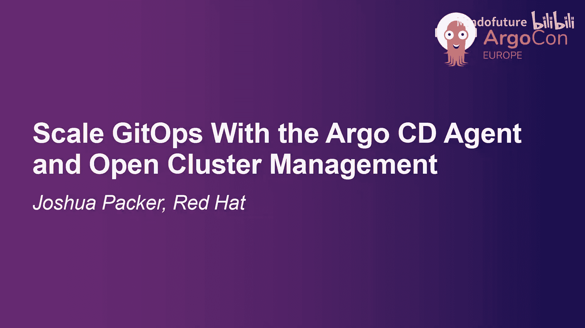
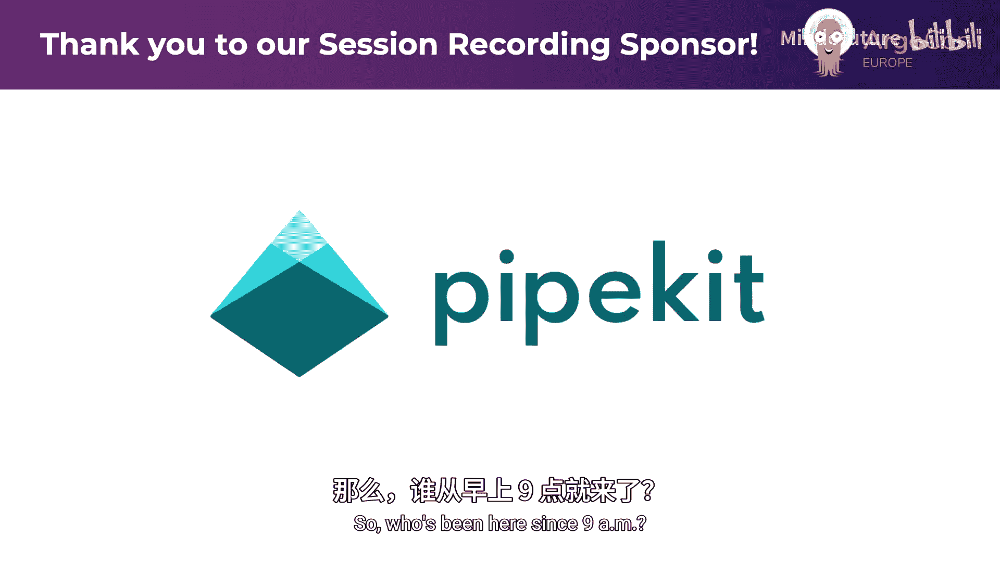
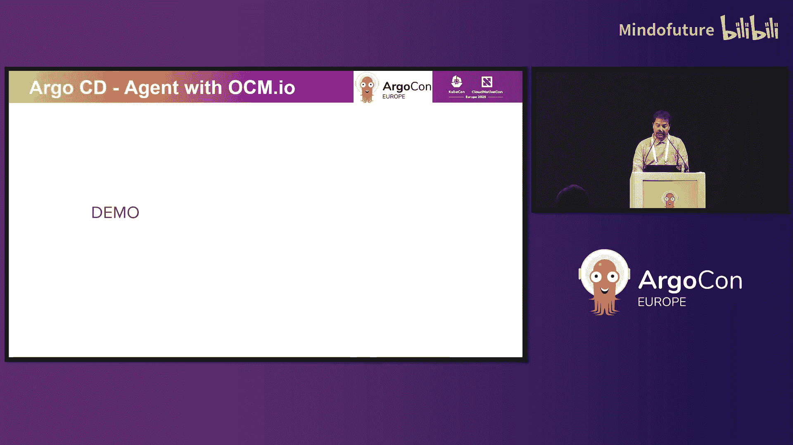
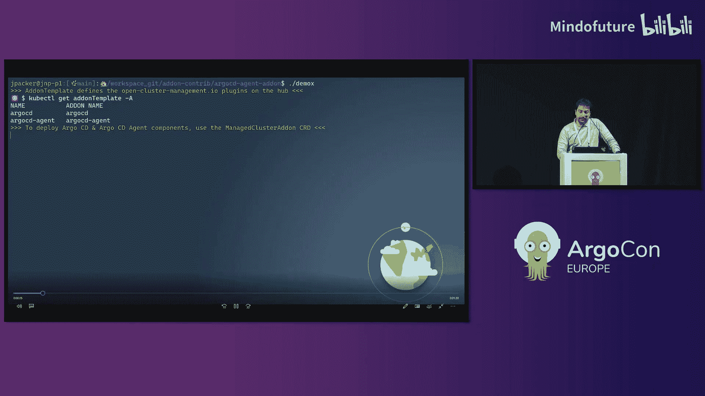
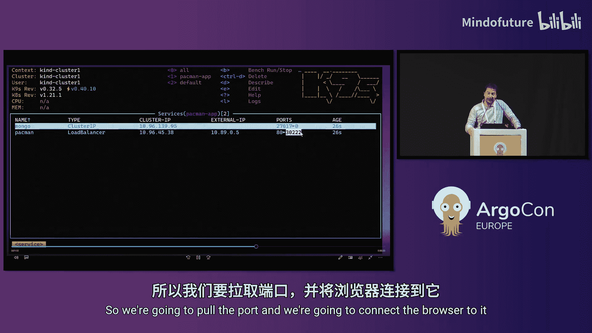
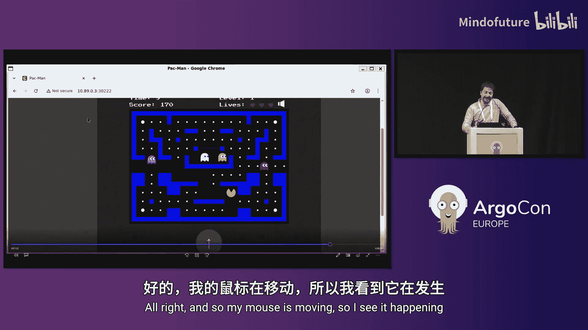
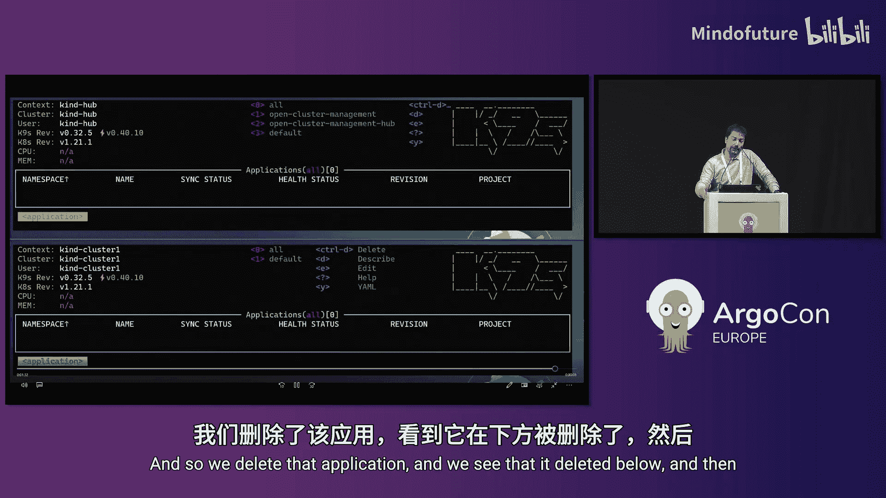
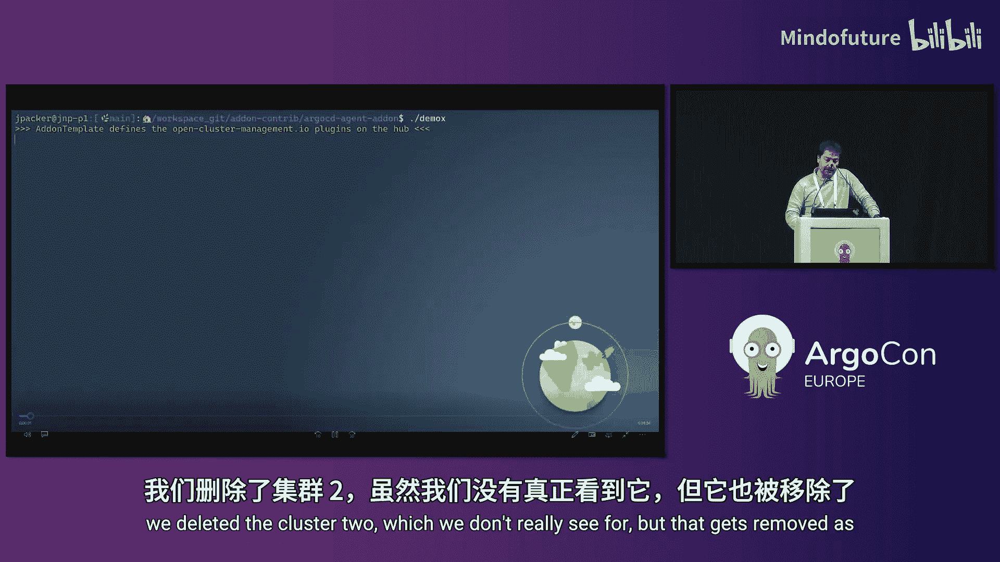
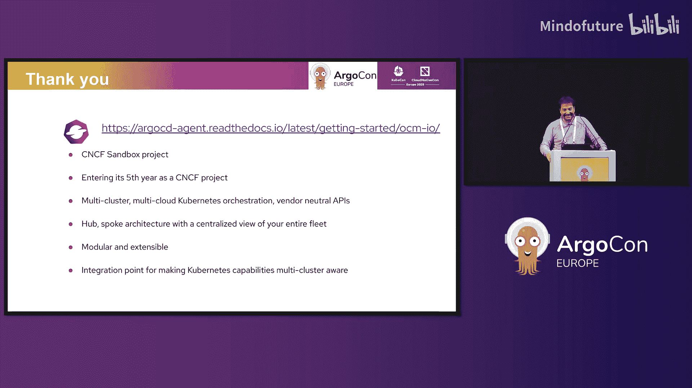

# 019：使用Argo CD Agent与Open Cluster Management实现可扩展的GitOps

在本教程中，我们将探讨如何结合使用Argo CD Agent与Open Cluster Management（OCM）来构建高度可扩展、安全且具有弹性的GitOps部署架构。我们将从基础概念开始，逐步深入到具体的集成模式和工作原理。

## 概述

Open Cluster Management是一个CNCF沙箱项目，专注于多集群、多云环境下的Kubernetes管理。它提供了一个供应商中立的API，并基于Kubernetes API构建，使其易于集成和使用。通过与Argo CD的集成，OCM能够将GitOps实践扩展到大规模、分布式的集群环境中。

## Open Cluster Management 核心概念

Open Cluster Management的核心架构基于中心辐射模型。您将集群注册到一个中心“Hub”集群，Hub会在每个被管理的“Spoke”集群上部署一个代理。

以下是其工作流程的关键组件：

*   **集群注册**：将您的Kubernetes集群注册到Hub。
*   **代理与插件**：Hub在每个Spoke集群上部署一个代理。这个代理可以加载各种“插件”来扩展功能。
*   **工作负载分发**：Hub可以将工作负载定义分发到选定的Spoke集群。这适用于分发像Argo CD `Application`这样的资源对象。
*   **放置规则**：这是OCM的“特殊酱料”。它允许您以动态和策略性的方式对集群进行过滤和分组。放置规则可以基于：
    *   集群标签
    *   **集群声明**：一种自定义CRD，Spoke集群可以动态地向Hub报告其属性（例如，GPU类型、可用区）。
    *   **放置分数**：基于资源利用率（如空闲CPU/内存）对集群进行排名。

## Argo CD 与 OCM 的集成模式

上一节我们介绍了OCM的基础，本节中我们来看看它与Argo CD集成的三种主要模式。

### 模式一：推送模型（传统增强）

这是我们最早的集成方式。它增强了标准的Argo CD中心部署模式。

*   **工作原理**：Argo CD运行在Hub上。OCM的“放置”功能被集成到Argo CD的ApplicationSet中，作为一个“自定义决策资源”。ApplicationSet可以查询OCM的放置规则，动态获取目标集群列表，从而将应用部署到正确的集群组。
*   **优点**：实现了基于策略的多集群应用部署。
*   **挑战**：架构上仍然是中心化的推送模式，存在单点故障风险，且Hub需要与所有Spoke集群保持高速网络连接并存储其kubeconfig。

### 模式二：拉取模型

这种模式将Argo CD实例部署到每个Spoke集群上，实现了工作负载的本地化处理。

*   **工作原理**：
    1.  用户在Hub上创建标准的Argo CD `Application` 资源。
    2.  一个特殊的注解会阻止Hub上的Argo CD控制器处理这个应用。
    3.  OCM控制器将这个`Application`资源封装到一个`ManifestWork`对象中。
    4.  OCM代理将`ManifestWork`拉取到目标Spoke集群。
    5.  Spoke集群上的本地Argo CD实例读取并同步这个应用。
*   **优点**：
    *   **Spoke集群自治**：即使Hub宕机，Spoke集群上的Argo CD仍能继续协调其应用。
    *   **消除高速链路依赖**：Spoke集群独立从Git仓库拉取代码，Hub只负责分发应用定义。
    *   **提升安全性**：Hub上无需存储Spoke集群的kubeconfig。
*   **当前限制**：应用状态的同步回Hub可能不完整，影响UI的完全展示。

### 模式三：Argo CD Agent 模型（推荐）

这是功能最全面、最具前景的集成模式，结合了前两种模式的优点。

*   **核心思想**：在Hub上运行一个轻量的“Principle”控制器，在每个Spoke集群上运行一个轻量的“Agent”控制器和必要的Argo CD组件（如Repo Server）。Agent主动从Principle拉取应用定义。
*   **架构组件**：
    *   **Principle**：运行在Hub，负责管理应用定义并响应Agent的请求。
    *   **Agent**：运行在每个Spoke集群，负责从Principle拉取分配给本集群的应用定义，并交给本地Argo CD控制器处理。
*   **OCM的增强作用**：
    *   **自动化部署**：OCM可以自动将Argo CD Agent及其相关组件（应用控制器、仓库服务器等）作为“插件”部署到新注册的Spoke集群。
    *   **配置管理**：简化整个Argo CD Agent体系的配置。
    *   **增强安全性**：贡献并集成了基于mTLS的认证，替代了默认的用户名/密码方式。

## Argo CD Agent 的优势总结

以下是使用Argo CD Agent架构带来的关键优势：

*   **高度可扩展**：采用中心辐射模型，轻松应对成百上千的集群规模。
*   **轻量级部署**：在Spoke集群上仅部署必需的Argo CD组件，而非完整套件。
*   **代理发起通信**：Spoke集群上的Agent主动连接Hub，更符合安全边界要求（拉取而非推送）。
*   **工作负载集群自治**：Hub故障不影响Spoke集群上现有应用的持续协调。
*   **消除高速网络依赖**：适合边缘、船舶、车辆等间歇性连接环境。
*   **安全设计**：
    *   Hub无需存储Spoke集群的kubeconfig。
    *   通过集成的mTLS认证，使用短期证书（OCM默认每小时轮换），安全性更高。

## 演示概览

在演示中，我们看到了如何使用OCM快速搭建Argo CD Agent环境：

1.  **定义插件模板**：在Hub上创建一个AddOn模板，定义了要部署到Spoke的Argo CD组件和Agent。
2.  **部署插件实例**：通过OCM的`ManagedClusterAddOn`，将模板实例化并部署到指定的Spoke集群。
3.  **创建应用**：在Hub上创建Argo CD `Application` 资源，目标指向特定的Spoke集群。
4.  **同步与删除**：Agent将应用定义拉取到Spoke，本地Argo CD开始同步。从Hub删除应用后，更改也会同步到Spoke并清理资源。

## 安全贡献：mTLS 集成

团队为Argo CD Agent的安全做出了重要贡献。默认的Agent使用用户名/密码认证，这仍然存在凭证管理的挑战。团队增强了其mTLS集成能力：

*   **工作原理**：Agent使用由OCM自动管理和轮换的客户端证书向Principle进行认证。
*   **优势**：
    *   **无需密码**：消除了静态密码的存储和管理。
    *   **自动轮换**：OCM默认每小时轮换证书，即使证书泄露，攻击窗口也极短。
    *   **集群标识**：从证书的Subject Name中提取集群名称，用于在Principle端标识请求来源。

## 总结

本节课中我们一起学习了如何利用Argo CD Agent与Open Cluster Management的强大组合来应对大规模GitOps部署的挑战。我们从OCM的基础概念出发，详细分析了三种集成模式，并重点介绍了最具优势的Argo CD Agent模型。该模型通过中心辐射、拉取通信、工作负载自治和安全设计等特性，为实现高度可扩展、弹性和安全的云原生GitOps架构提供了清晰的路径。您可以从Argo CD官方文档中关于OCM集成的部分开始实践。