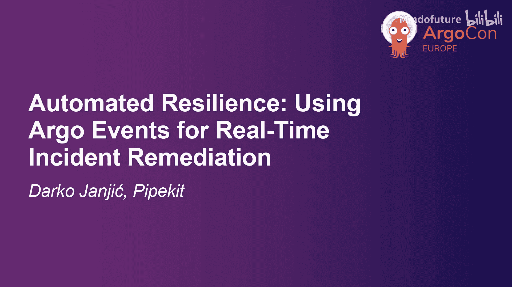
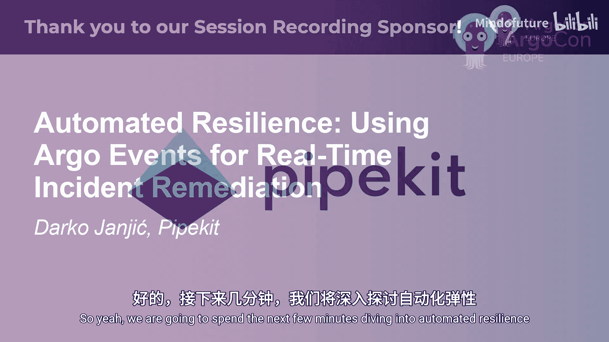
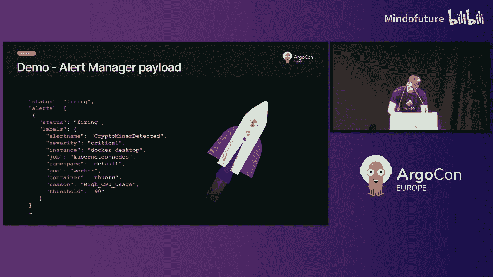
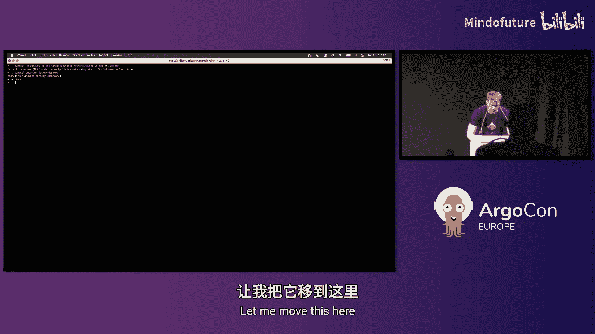
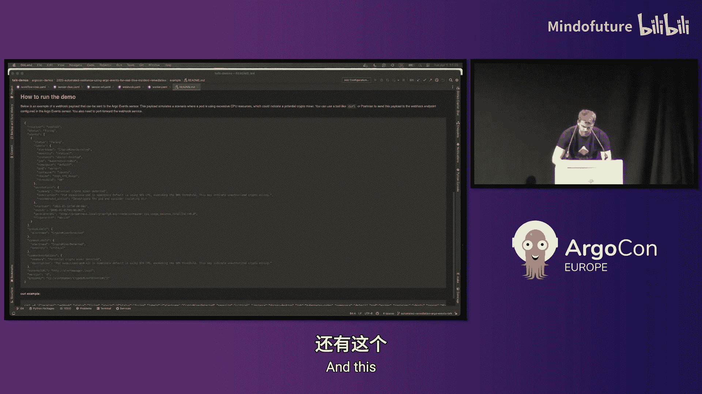
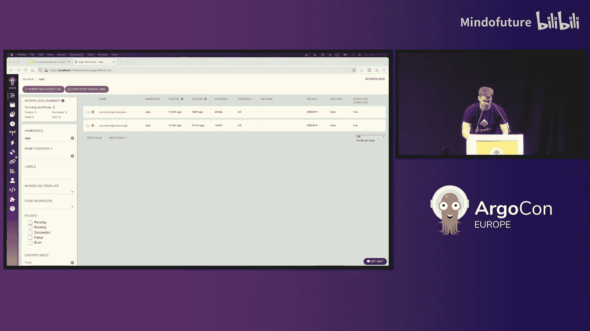
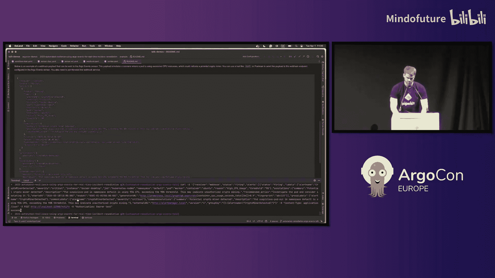
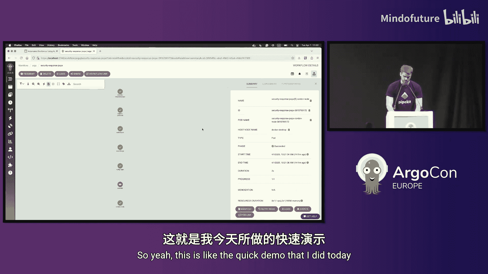
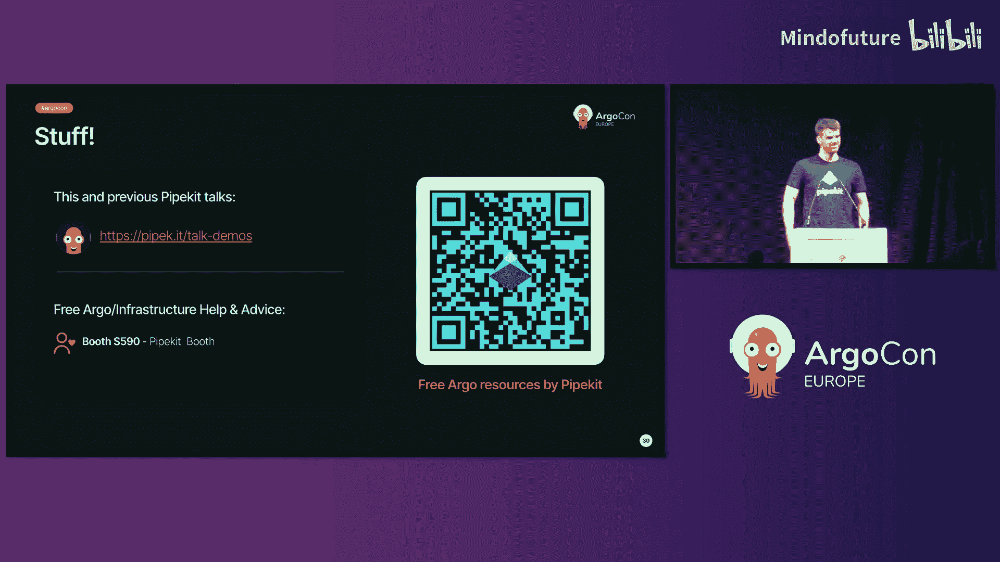

# 020：使用 Argo Events 实现实时事件自动修复 🛡️

在本节课中，我们将学习如何利用 Argo Events 构建自动化的弹性系统，实现实时事件的检测与修复。我们将从核心概念入手，通过一个具体的演示案例，展示如何将监控告警、决策判断和修复动作串联成一个完整的自动化流程。

## 概述：什么是自动修复？

自动修复是指系统自动检测并解决故障的过程。一个理想的自动修复系统能够发现问题并尝试解决它，从而实现应用和基础设施的自愈。

你可以将其与现有的开发工具或流水线集成，以提供实时的故障缓解。例如，一个应用在99%的时间里运行良好，但偶尔会出现功能异常，通常简单的重启就能解决问题。在这种情况下，自动修复可以通过检查日志并重启服务来缓解问题，之后你的团队再添加永久性修复。这可以节省成本、时间并减少人工操作。

## 自动修复的工作原理

自动修复通常包含三个核心阶段：**检测**、**决策**和**行动**。

上一节我们介绍了自动修复的基本概念，本节中我们来看看它的具体工作流程。

以下是自动修复的三个阶段：

1.  **检测**
    *   这是一个持续监控系统的工具。
    *   它通常检查系统中的所有日志、指标和活动。
    *   当检测到异常时，该组件会发出警报。例如，使用 Prometheus 和 Alertmanager 设置规则，当 CPU 使用率超过90%持续一段时间时触发告警；或者使用 Grafana Loki，在日志中发现可疑内容时发出通知。

2.  **决策**
    *   该组件接收来自检测组件的通知，对其进行验证，并根据信息采取行动。
    *   例如，你收到一个通知，称系统在某个端点上返回500错误。决策组件会验证此通知，并根据严重程度或其他预定义规则，决定是否触发修复动作。

3.  **行动**
    *   这是实际的修复动作。
    *   它接收来自决策引擎的命令，并基于该命令启动适当的操作。这个操作可以是一个工作流、一个无服务器函数，或者一个简单的命令来回滚系统中的更改。
    *   沿用上面的例子，修复动作可能是重启受影响的服务器，或者如果该服务最近有更新，则回滚到上一个版本。

## Argo Events 简介

了解了自动修复的流程后，我们需要一个强大的工具来充当“决策”和“触发”的核心。这就是 Argo Events。

Argo Events 允许你定义强大的事件驱动工作流，使你的系统能够对故障、安全漏洞或业务触发器等事件做出反应，而无需人工干预。

**Argo Events** 是一个 Kubernetes 原生的事件驱动工作流自动化框架。它使用户能够使用事件源、传感器和触发器来定义和管理基于事件的自动化。

例如，Argo Events 可以接收你的 Webhook 事件，并将其传递给相应的传感器。该传感器随后会触发适当的操作，在本例中，这个操作是一个工作流。

### Argo Events 的核心组件

Argo Events 主要由四个组件构成：

1.  **事件源**：定义了从外部源消费事件的配置。它可以转换事件，并将事件分派到事件总线。例如，如果你想消费一个 Webhook，就需要创建一个 Webhook 事件源配置。
2.  **事件总线**：传输层，负责将事件源连接到传感器。用于此目的的组件包括 Kafka、NATS JetStream 等。
3.  **传感器**：监听来自事件总线的事件，并触发相应的操作。
4.  **控制器管理器**：一个常规的 Kubernetes Operator，负责管理上述组件。

## 实战演示：自动响应加密挖矿告警

理论部分已经介绍完毕，现在让我们通过一个具体的演示来看看如何将 Argo Events 应用于实际场景。

在本演示中，我们将模拟一个场景：一个恶意行为者在夜间侵入你的环境，并在你的集群中运行加密挖矿程序。如果没有自动修复，你可能只有一些告警来告诉你 CPU 或 GPU 使用率激增，但这很可能被忽略直到早晨。因此，你需要一种更快应对此场景的方法。

演示流程如下：
1.  **检测**：使用 Prometheus Alertmanager 通知 Argo Events 集群中正在运行加密挖矿程序。
2.  **决策**：Argo Events 将接收此事件，对其进行过滤、处理，并触发高严重性的告警。
3.  **行动**：随后执行一个 Argo Workflow。该工作流将捕获受影响 Pod 的元数据，然后使用网络策略隔离该 Pod，使用 Trivy 扫描容器镜像，并通过 Slack 或 PagerDuty 发出警报。

以下是演示中关键配置的说明：

*   **事件源配置**：我们配置了一个 Webhook 事件源来接收来自 Alertmanager 的告警。我们指定了端口、端点和使用 POST 方法。同时使用了 Bearer Token 进行身份验证。Argo Events 会过滤所有请求，仅当告警状态为 `firing`、严重性为 `critical` 且告警名称为 `cryptominer-detected` 时才采取行动。
*   **传感器配置**：传感器接收到事件后，会将其转换为更友好的结构，提取 Pod 名称、命名空间、实例和受影响的容器等信息。然后，传感器启动一个 Argo Workflow，并将转换后的值作为工作流参数传递。
*   **修复工作流**：工作流包含多个修复和数据收集步骤，目的是快速捕获所有数据并限制 Pod，直到值班人员前来检查。
    1.  使用 `kubectl` 获取 Pod 日志和元数据，并将所有数据保存到 S3 以供进一步分析。
    2.  应用网络策略以隔离该 Pod，阻止其所有入站和出站流量。
    3.  使用 Trivy 扫描容器镜像以查找可能的安全问题。
    4.  通过 Slack 通知用户有关潜在加密挖矿程序的信息，并附上之前保存到 S3 的数据链接。
    5.  封锁节点，以防节点本身出现问题。

通过这个演示，我们看到了一个完整的自动修复流程如何从告警开始，经过决策判断，最终执行一系列复杂的修复动作，全部自动化完成。

## 最佳实践与优势

在构建自动修复系统时，遵循一些最佳实践至关重要：

*   **验证与过滤事件**：不要每次发生事件都触发修复，只在需要时才行动。
*   **添加重试策略和死信队列**：以防处理过程中出现故障。
*   **确保操作幂等性**：避免多次触发同一操作。
*   **为系统添加告警和监控**：监控自动修复流程本身。
*   **充分测试你的流水线**：模拟各种场景并观察系统的反应。

使用 Argo Events 构建自动修复系统能带来诸多好处：
*   **支持多种事件源和目的地**，是开源且容器原生的。
*   **即插即用**，易于扩展和维护。
*   **支持基本的事件过滤和丢弃**，对于更复杂的逻辑，可以轻松添加工作流来处理。
*   **可以组合多个事件源**，例如，可以同时使用 Alertmanager 和 AWS Guard Duty 来检测加密挖矿，只有从两者都收到通知时才确认事件，这用 Argo Events 很容易实现。
*   **通过自动化值班手册**，可以最大限度地减少人为错误，自动化响应速度远快于人工。
*   **降低运营成本和手动工作量**，让工程师从重复性的故障排查中解放出来，专注于创新。
*   **增强安全性**，可以检测安全异常并立即触发缓解措施。

## 总结

本节课中我们一起学习了如何利用 Argo Events 实现实时事件的自动修复。我们从自动修复的核心概念和工作原理讲起，深入介绍了 Argo Events 作为事件驱动自动化框架的组件与能力。通过一个完整的加密挖矿告警响应演示，我们看到了如何将检测、决策、行动三个阶段无缝衔接，构建出自愈系统。最后，我们探讨了实施自动修复的最佳实践及其为系统弹性、安全性和运营效率带来的显著优势。希望本教程能帮助你开始构建自己的自动化修复流水线。