# 021：利用 Argo CD 管理 OCI 源内容

## 概述

在本教程中，我们将学习 ArgoCD 如何实现对 OCI（Open Container Initiative）仓库的原生集成。我们将了解其背后的工作原理、带来的优势、开发历程以及如何开始使用这一新功能。通过本教程，初学者可以理解如何将 OCI 仓库作为应用清单的存储源，从而在 Git 受限或更偏好容器化工作流的环境中部署应用。

## 核心组件：Repo Server 的工作原理

上一节我们介绍了本教程的概述，本节中我们来看看实现 OCI 集成的核心组件——Repo Server 是如何工作的。理解后端机制有助于明白 ArgoCD 如何支持 OCI。

ArgoCD 包含多个组件，如应用控制器、应用集控制器等。其中，Repo Server 是后端访问 Git、Helm 以及现在 OCI 的接入点。Repo Server 维护着几种不同的缓存：

*   **内存缓存**：用于存储版本信息。对于 Git 仓库，这包括提交哈希、标签和分支名；对于 OCI 仓库，则是镜像标签。
*   **磁盘缓存**：用于存储从 Git、OCI 镜像等提取的所有文件。
*   **Redis 缓存**：用于存储渲染后的清单。

OCI 的实现需要与这些缓存和功能点集成。幸运的是，OCI 的工作方式与 Git 和 Helm 足够相似，使得集成变得相对顺畅。

在 Repo Server 内部，为了实现这些缓存和功能，OCI 层需要完成以下三个核心步骤：

1.  **解析版本**：访问 OCI 仓库，获取所有标签，根据用户指定的版本范围（如语义化版本）进行匹配，并找到最新的一个，然后将版本列表缓存起来。
2.  **获取制品**：拉取 OCI 清单（Manifest）制品。通常，一个 OCI 制品包含一个层（Layer），该层包含了用于生成清单的所有文件。
3.  **提取内容**：将上述文件提取到磁盘，使其可供渲染逻辑使用。

所有渲染逻辑在 Git、Helm 和 OCI 之间都是相同的，这保证了可靠性。但上述前三个阶段必须由 OCI 层具体实现。

## 使用 OCI 的优势

上一节我们了解了 Repo Server 如何支持 OCI，本节中我们来看看使用 OCI 作为源能带来哪些实际好处。

最大的优势在于，你无需改变现有的 ArgoCD 使用模式。你可以沿用与 Git 或 Helm 仓库相同的模式，只是将内容打包成新格式并推送到 OCI 注册表，而非 Git 仓库。

以下是使用 OCI 源的具体优势：

*   **突破环境限制**：在许多组织（尤其是受严格监管的行业）的生产环境中，可能不允许使用 Git。此时，可以使用必须可用的 OCI 制品注册表（如容器镜像仓库）来存储清单。
*   **简化演示与测试**：对于创建演示或测试场景，无需搭建 GitLab 或配置防火墙规则开放 Git 访问，可以直接使用 OCI 仓库中的内容。
*   **增强安全与元数据**：OCI 社区的工作使得可以在主要部署制品之外，存储各种额外的元数据和安全性制品。例如，你可以在包含 ArgoCD 所需文件的 tar 包上附加签名，或添加其他元数据，未来可能支持基于制品类型的搜索或过滤。
*   **提供更多选项**：对于 Helm 用户，现在有多种使用方式：作为扁平的 Git 仓库、OCI Helm 图表、传统 Helm 仓库，或作为 OCI 制品。这为在不同架构环境中工作提供了灵活性。

## 功能开发历程与社区协作

上一节我们探讨了使用 OCI 的优势，本节中我们来回顾一下这个功能从构想到实现的开发历程，这离不开开放的社区协作。

OCI 支持功能是许多人共同努力的成果。其愿景最初由 Red Hat 的 Andy 在两年前提出，并形成了详细的提案。来自 Akuity、Intuit、Microsoft 等公司的开发者（如 Blake、Michael）也基于客户需求（如在隔离环境中的部署需求）推动了这一功能的开发。

开发过程并非一帆风顺。从 2023 年到 2025 年，团队经历了漫长的努力。初始概念验证（POC）很快完成，但后续的“最后 10%”工作（如理解 OCI 规范细节、设计单层还是多层结构、如何与 ArgoCD 现有架构无缝集成）花费了大量时间进行打磨和重构。

跨社区协作是成功的关键。ArgoCD 社区与 OCI 规范社区（特别是 Auras 项目）保持了紧密沟通。通过专门的 Slack 频道，来自全球（北美、欧洲、亚太）的贡献者共同讨论、设计和实现。Microsoft 的团队也基于新的用例，投入资源帮助推进开发。

这个功能预计将在 ArgoCD 3.1 版本中正式发布。

## 组织支持对开源的重要性

上一节我们看到了社区协作的力量，本节中我们强调一个更深层的成功因素：组织对开源贡献的支持。

实现这样一个重大功能，需要贡献者投入大量连续的时间。如果没有所在组织的支持，允许员工在工作时间内参与开源开发，这几乎是不可能完成的。

*   **时间投入是关键**：开发者通常有繁忙的内部任务。获得组织批准，将一部分工作时间（即使是 5% 或 10%）用于特定开源功能开发，是极其宝贵的。
*   **多元贡献模式**：开源项目既需要能够快速提交错误修复的贡献者，也需要能够长期深入项目、负责设计评审和方向指导的资深贡献者。两者都需要组织的支持。
*   **互利共赢**：组织支持开源，不仅能推动项目发展，也能为组织带来技术影响力、人才吸引力和对项目方向的发言权。Microsoft 等公司投入开源，也需要了解社区的真实需求来指导投资方向。

## 如何使用 OCI 源

上一节我们强调了成功背后的支持体系，本节中我们回到技术层面，看看如何在 ArgoCD 中实际配置和使用 OCI 源。

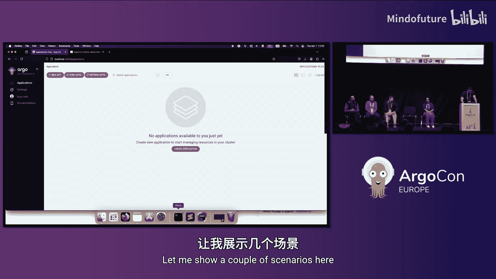

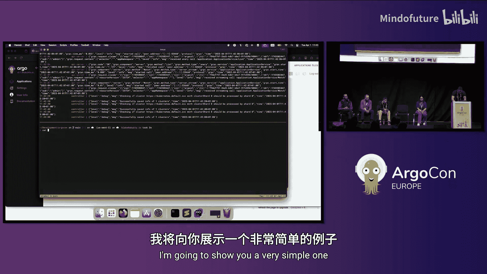

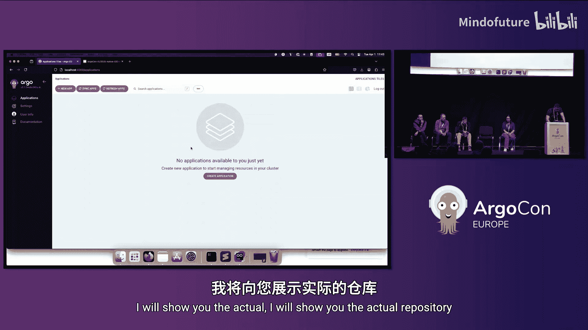

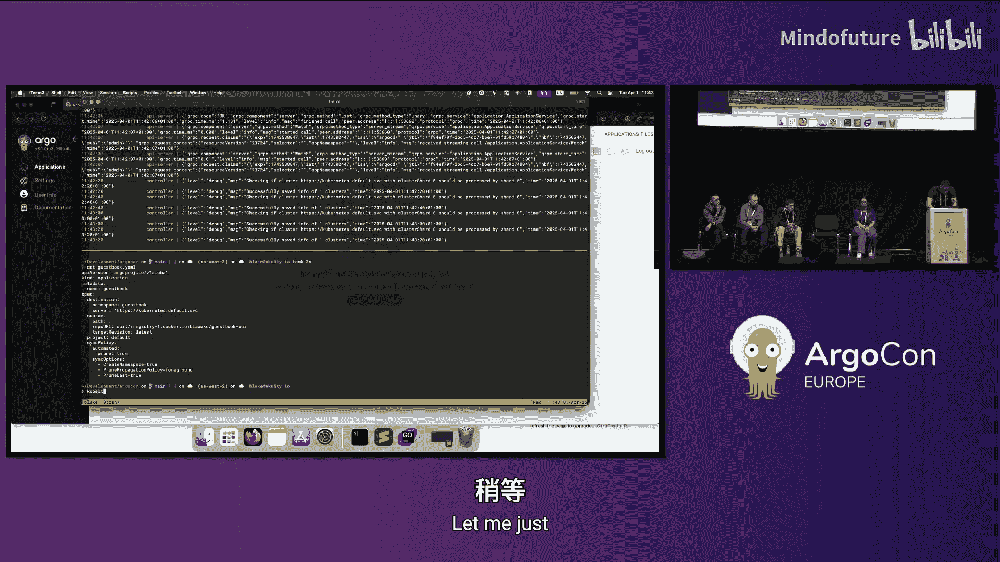

在即将发布的 ArgoCD 3.1 中，将引入一个新的 OCI 客户端类型。这意味着除了现有的 `git` 和 `helm`，现在多了一个 `oci` 源类型。

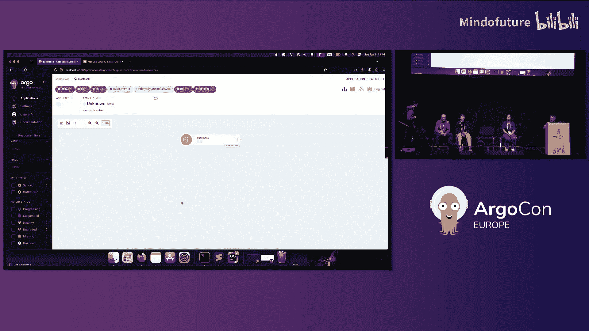

以下是配置的核心要点：

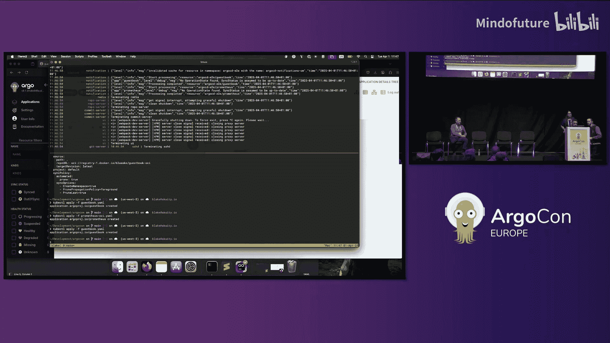

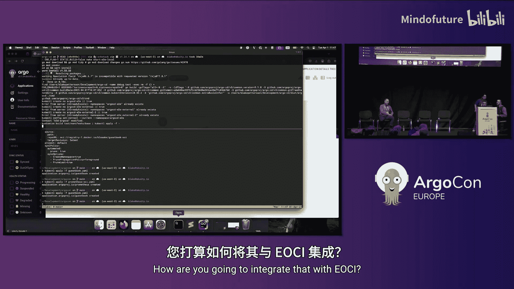

*   **协议前缀**：在配置仓库 URL 时，使用 `oci://` 作为协议前缀，ArgoCD 就会自动进入 OCI 模式。
*   **制品要求**：开箱即用地支持构建为特定 OCI 镜像类型（如 `application/vnd.oci.image.manifest.v1+json`）的单层制品。也可以通过环境变量添加对自定义媒体类型的支持。
*   **Helm OCI 图表**：原生支持 Helm OCI 图表，其处理方式有特殊逻辑。
*   **路径与版本**：`targetRevision` 对应 OCI 仓库中的标签。`path` 取决于制品构建方式，通常是制品层中的目录路径。对于 Helm OCI 图表，路径固定为当前目录（`.`）。
*   **凭证**：OCI 仓库凭证的配置方式与其他源类型类似，支持 HTTPS 和 HTTP（不推荐）。

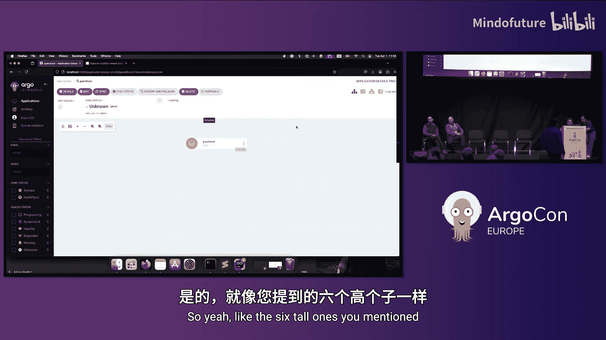

创建 OCI 制品的过程与使用 `docker push` 类似。你可以使用 `oras` 等工具，将包含清单文件的目录推送到兼容 OCI 的注册表（如 Docker Hub、GHCR、ACR 等），并可以添加作者、描述等 OCI 元数据。

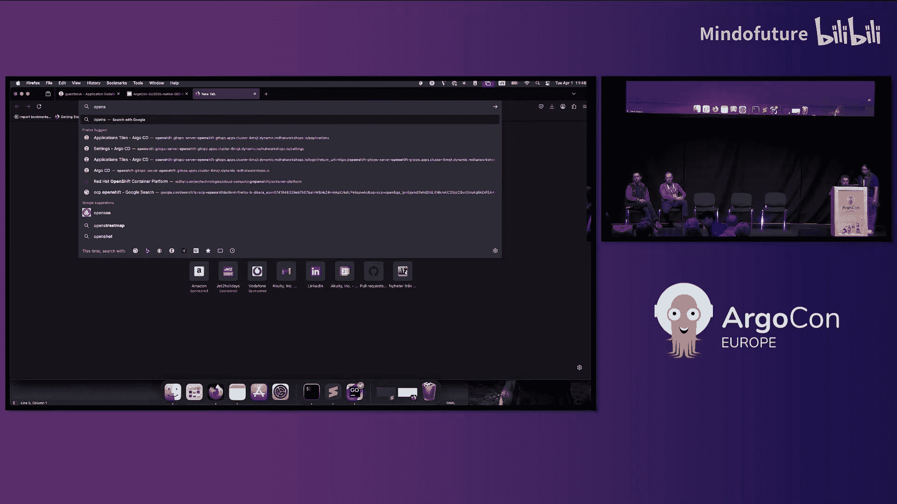

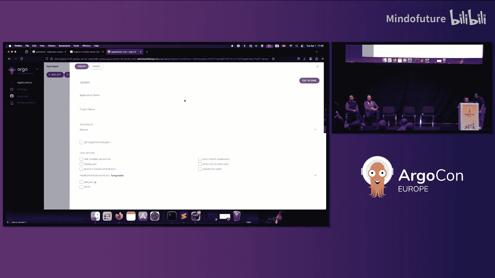

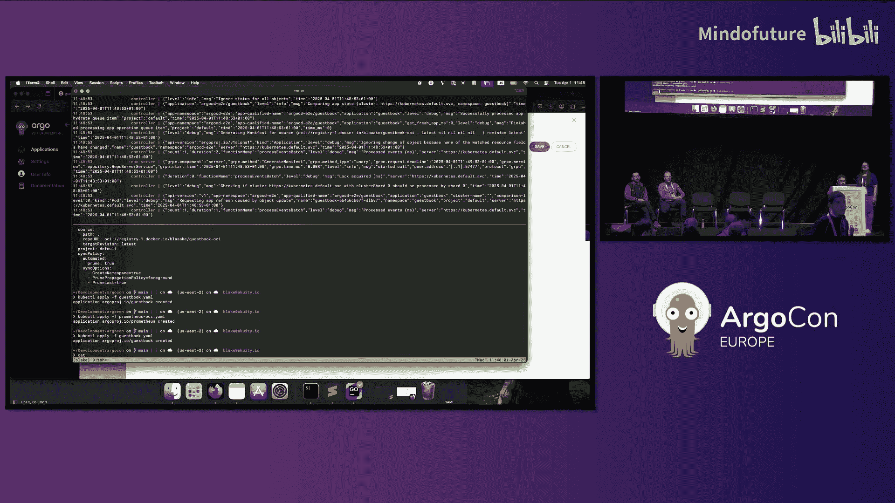

## 总结

在本教程中，我们一起学习了 ArgoCD 原生集成 OCI 仓库的方方面面。

我们首先了解了 **Repo Server** 是实现此功能的核心，它通过解析版本、获取制品和提取内容三个步骤来处理 OCI 源。接着，我们探讨了使用 **OCI 源的优势**，包括突破 Git 环境限制、简化流程、增强安全性与元数据支持，并为部署提供了更多选项。然后，我们回顾了这个功能的 **开发历程**，看到了从提案到实现过程中，全球开源社区的紧密协作。我们也认识到 **组织支持** 对于完成此类大型开源功能至关重要。最后，我们介绍了如何在 ArgoCD 中 **配置和使用 OCI 源**，包括协议前缀、制品要求和凭证配置。

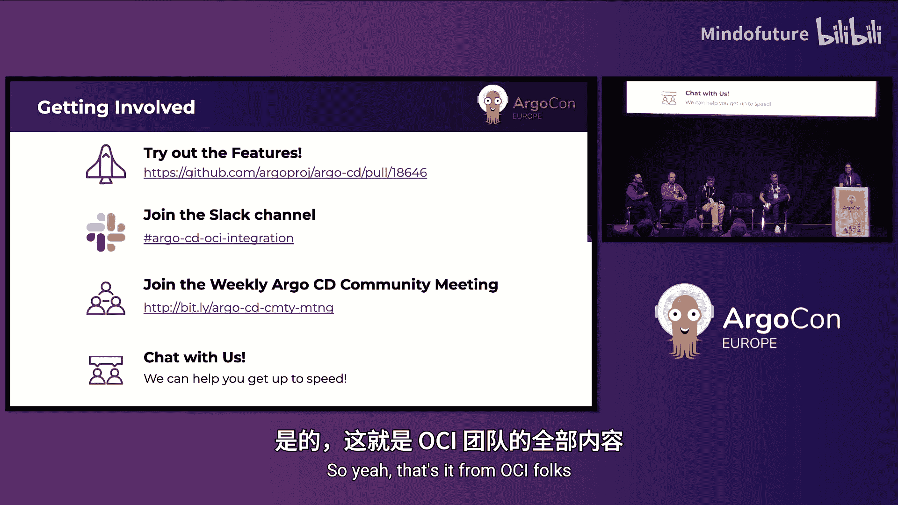

虽然现场演示因网络问题未能完美展示，但该功能已基本就绪，等待社区试用和反馈。这是一个通过社区协作克服挑战、扩展 ArgoCD 适用性的优秀范例。