# 023：自动扩缩与渐进式交付——天作之合

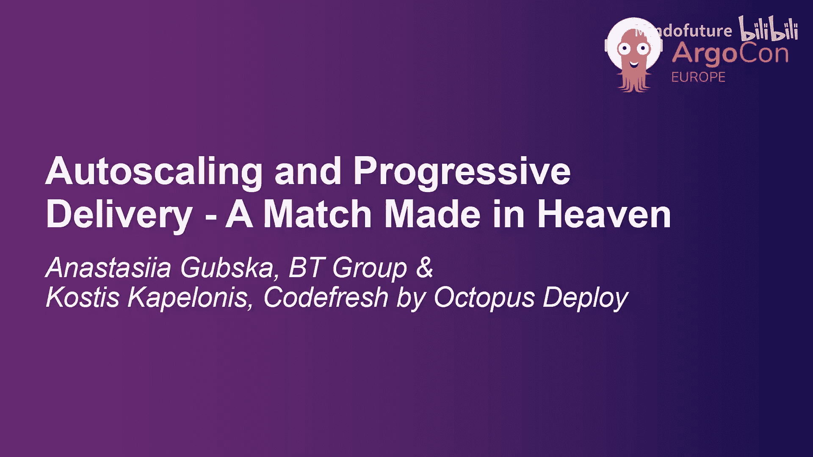

在本节课中，我们将要学习如何将 Argo Rollouts 与 Horizontal Pod Autoscaler (HPA) 结合使用，以实现既安全又经济的渐进式交付。我们将探讨成本挑战、解决方案以及两者协同工作的具体方式。

## 课程概述

大家好，我是 Cosmin，来自 Octopus Deploy 的开发者布道师，也是专注于 Argo Rollouts 和 Argo CD 的 Argo 团队成员。今天与我一同演讲的是 Anastasiia。

大家好，我是 Anastasiia Gubska，来自英国电信的 SRE/DevOps 工程师，也是 CNCF 大使。我们致力于推广 Argo Rollouts。

本次演讲将深入探讨在采用渐进式交付策略时，如何利用 Argo Rollouts 和 HPA 来应对成本挑战。

## 渐进式交付与 Argo Rollouts 基础

让我们从基础开始。Argo Rollouts 是一个用于实现渐进式交付的工具或解决方案。

**渐进式交付** 主要包含两种策略：蓝绿部署和金丝雀发布。

*   **蓝绿部署**：同时运行两个环境。蓝色环境运行应用的稳定版本，绿色环境运行新版本。当新版本在绿色环境就绪后，再将流量完全切换过去。
*   **金丝雀发布**：同样使用两个环境，但会逐步将流量从旧版本迁移到新版本。这让我们有机会在增加流量前验证应用运行状况，或在发现问题时快速回滚。

使用渐进式交付策略的好处在于，可以在零停机的情况下发布新版本，并能自动化处理回滚以解决问题。

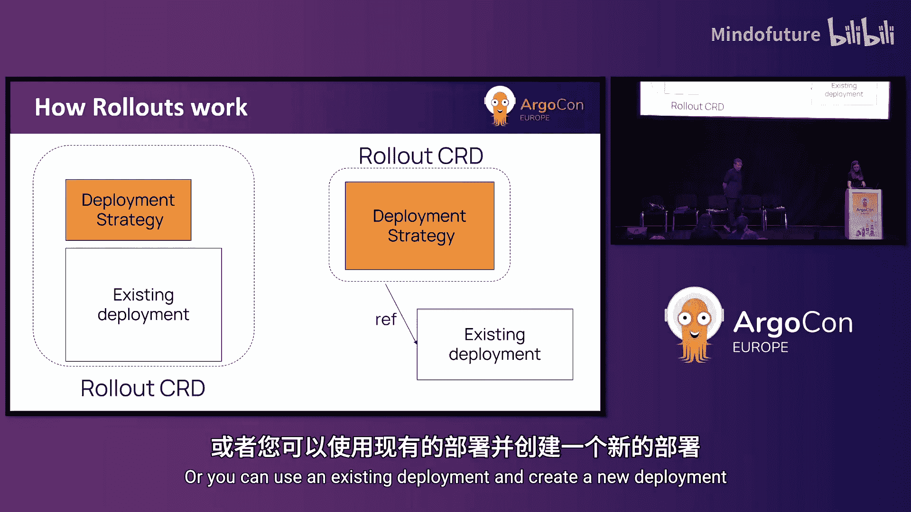

Argo Rollouts 是 Kubernetes 原生的，它**不依赖** Argo CD，两者可以独立工作。

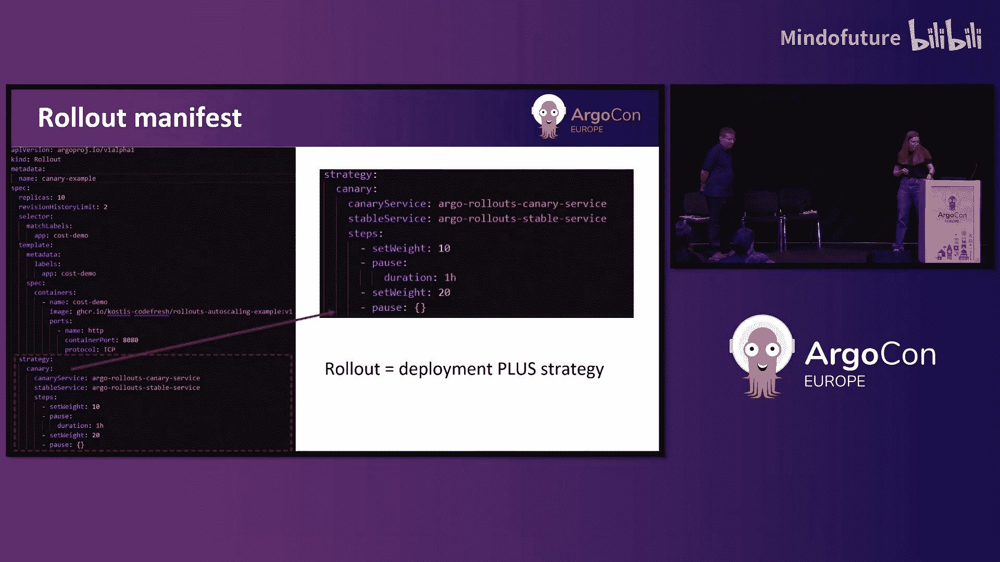

安装 Argo Rollouts 后，你会获得一个新的 Kubernetes 资源类型：`Rollout`。这意味着你可以通过两种方式使用它：

1.  为现有的 `Deployment` 添加渐进式交付策略。
2.  直接创建一个新的 `Rollout` 资源。

以下是一个金丝雀策略的 `Rollout` 配置示例：

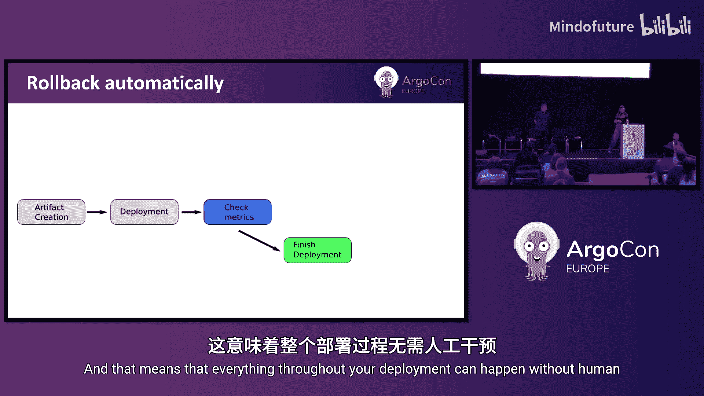

```yaml
apiVersion: argoproj.io/v1alpha1
kind: Rollout
metadata:
  name: example-rollout
spec:
  replicas: 10
  strategy:
    canary:
      steps:
      - setWeight: 10
      - pause: {duration: 1h}
      - setWeight: 20
      # ... 更多步骤
```

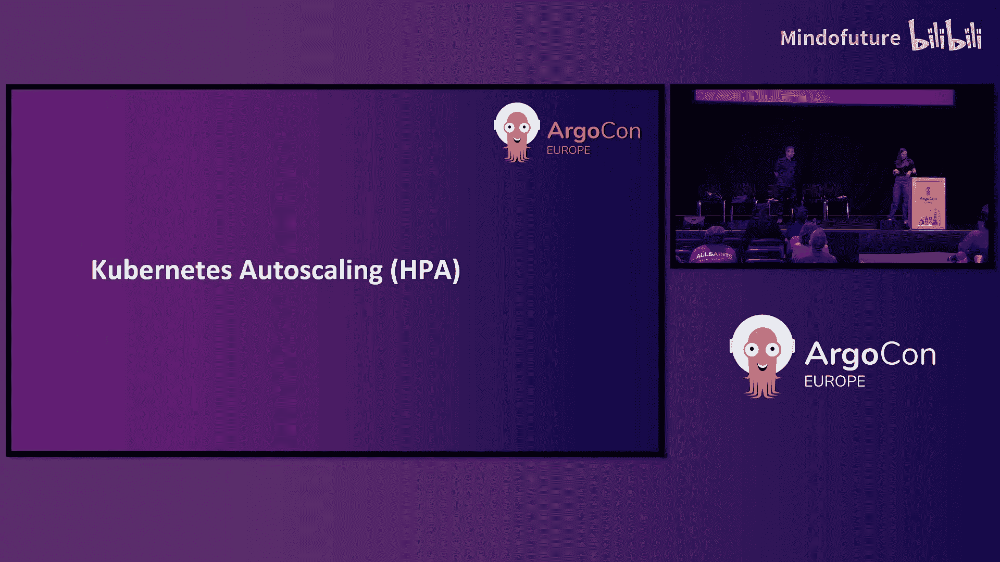

如代码所示，你可以从 10% 的流量开始，暂停一小时后，再将流量提升至 20%。

Argo Rollouts 提供了仪表盘，可以实时查看部署状态。你能看到稳定的旧版本 Pod 和预览的新版本 Pod 的数量及流量分配情况。

Argo Rollouts 的一个强大特性是自动化监控。它会持续检查应用的性能和健康状态。如果发现问题，它会自动回滚并标记部署失败；如果一切顺利，则自动完成部署并标记成功。这意味着整个部署过程可以无需人工干预。

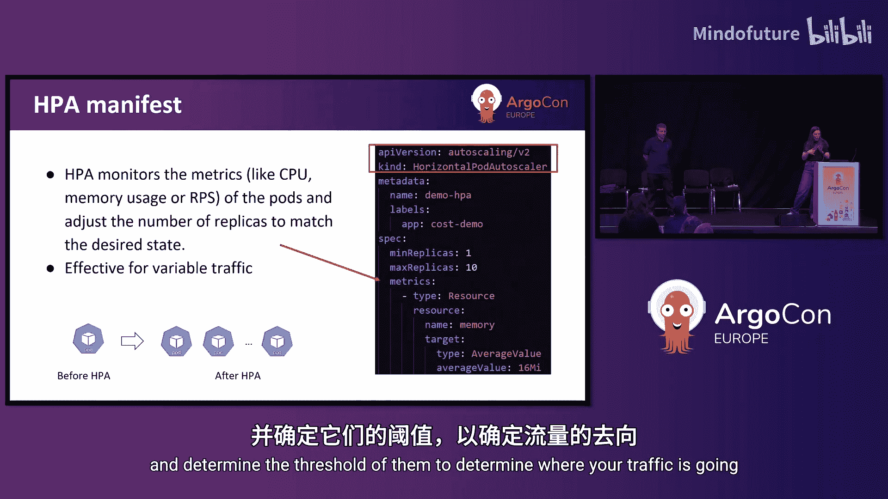

想象一下，你的团队可以在周五下午 5 点发起一个部署，然后安心下班，Argo Rollouts 会替你完成后续所有工作。


## 认识 Horizontal Pod Autoscaler (HPA)

接下来，我们谈谈自动扩缩。

本次讨论聚焦于 **Horizontal Pod Autoscaler**。HPA 会根据需求自动增加或减少 Pod 的数量。还有其他类型的扩缩器，如垂直扩缩、集群扩缩、基于自定义指标的扩缩以及 Kubernetes 事件驱动扩缩，你可以查阅官方文档了解更多。

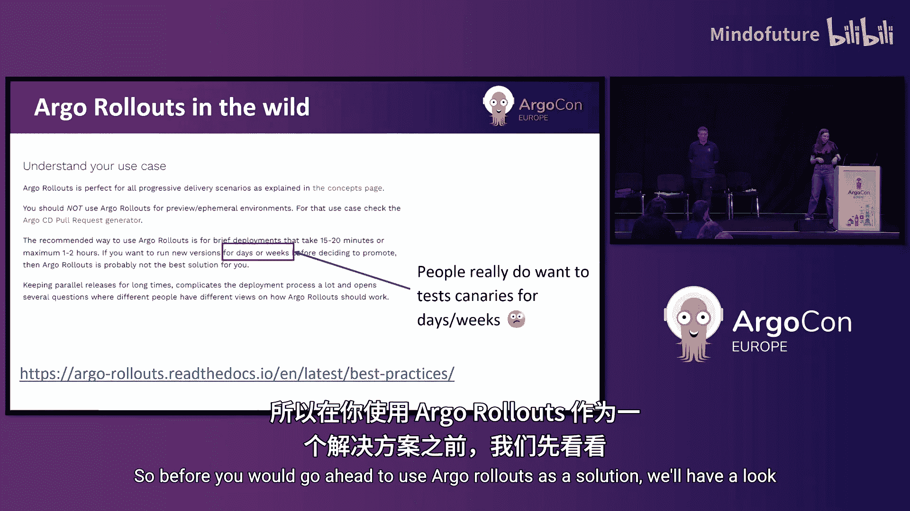

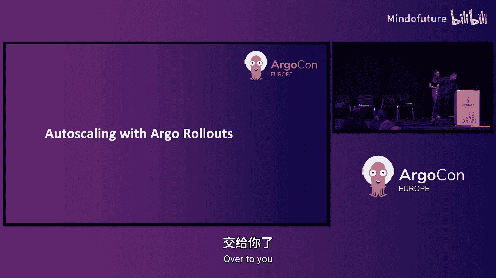

HPA 监控 CPU 等指标，并在负载增加时（例如，黑色星期五促销或国际足球赛事期间流量激增）自动扩容。它使用 `replicas` 并设定阈值来决定何时扩缩。

**公式**: HPA 的核心是根据目标指标（如 CPU 使用率）动态调整 Pod 副本数，其行为可描述为：`期望副本数 = ceil[当前副本数 * (当前指标值 / 目标指标值)]`。

## 渐进式交付的成本挑战与基础优化

当你在云环境中采用渐进式交付策略时，成本可能成为一个显著问题。我们来看看如何降低相关成本影响。

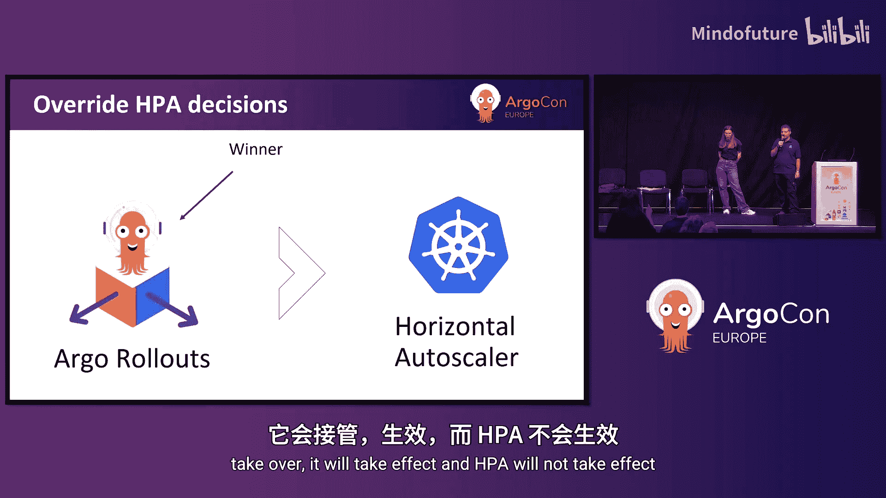

在蓝绿部署示例中，两个环境各有 10 个 Pod，这可能会使部署成本翻倍。同样，在金丝雀发布中，当流量完全切换到新版本时，你也会暂时拥有双倍的 Pod 数量，导致成本增加。

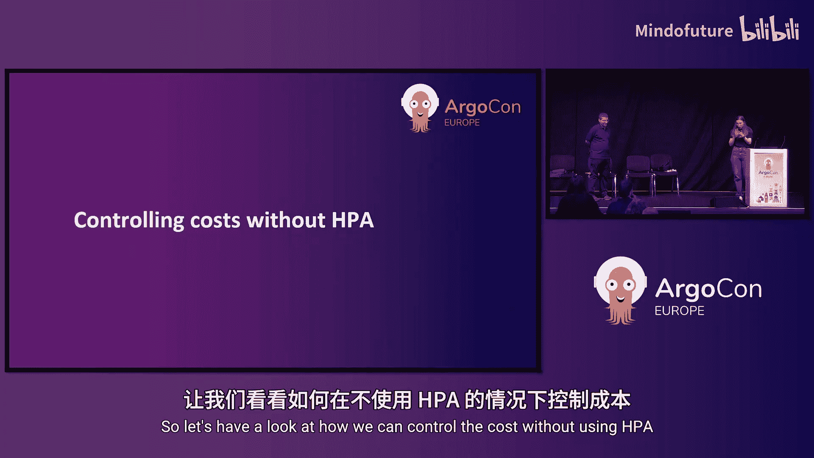

有些人喜欢让测试运行数天甚至数周，但这并非使用 Argo Rollouts 最有效的方式。Argo Rollouts 更适合快速部署。不过，我们理解某些场景下确实需要长时间测试。

在直接使用 HPA 之前，让我们先看看 Argo Rollouts 本身提供的成本控制选项。

以下是无需 HPA 即可控制成本的方法。

有些人想直接使用 HPA，但我们可以先通过调整 Rollout 设置来管理成本。配置中高亮的属性可以帮助你管理成本，并固定部署期间使用的 Pod 数量。

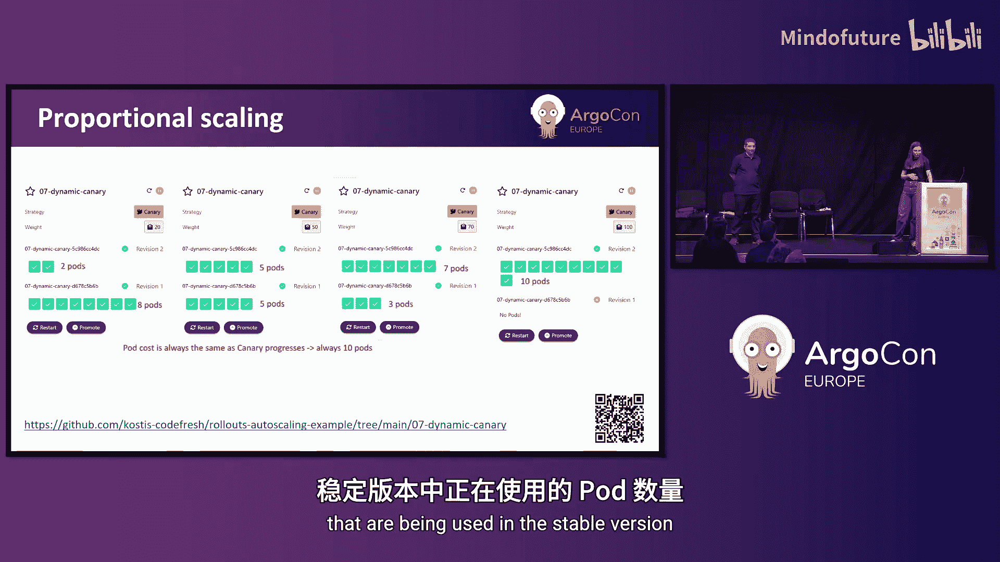

我们建议你先了解这些选项，再尝试使用 HPA 策略。


*   **蓝绿部署的成本控制**：通过设置 `previewReplicaCount` 字段，可以固定预览环境的 Pod 数量。例如，将其设为 5，意味着预览版本将只有 5 个 Pod，这能自动将部署成本降低 50%。
*   **金丝雀部署的成本控制**：在金丝雀发布中，你可能同时运行 20 个 Pod，导致成本翻倍。通过设置 `dynamicStableScale: true` 属性，系统可以在增加新版本 Pod 时，自动减少稳定版本中的 Pod 数量，从而控制总资源消耗。

我们还有另一个解决方案可以讨论。

## 使用流量管理进行成本优化

在金丝雀发布中，除了控制 Pod 数量，我们还可以使用流量控制器来管理发送到每个 Pod 的流量比例。

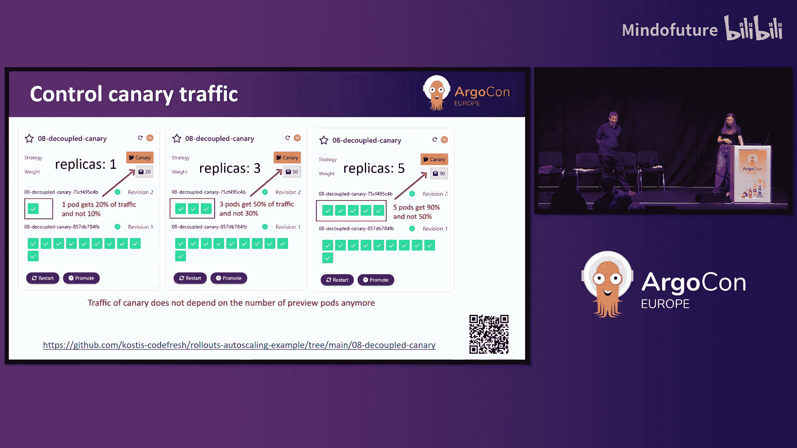

左侧是没有流量管理的例子，每个 Pod 接收固定的流量比例（例如，一个 Pod 接收 10% 流量）。右侧是使用流量管理（本例使用 Linkerd）的例子，你可以将 80% 的流量导向一个 Pod。

这样，我们可以固定 Pod 数量（例如 5 个），但通过流量管理决定新版本接收多少流量（例如 50%）。这有助于通过减少稳定版本的 Pod 数量来管理成本。

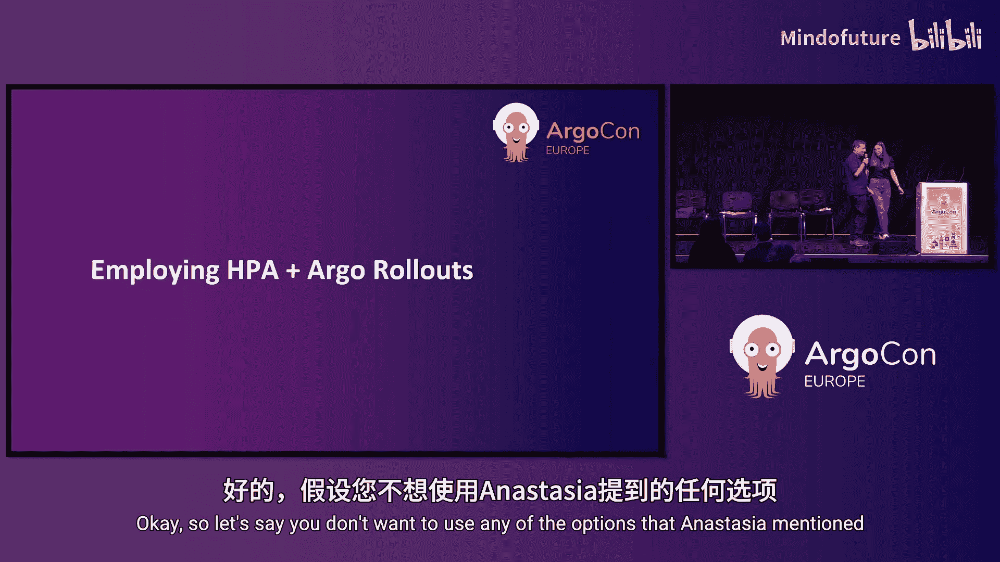

配置中，我们添加了 `maxTrafficPercentage: 50` 等字段来限制发送到新版本的最大流量比例。

## 整合 HPA 与 Argo Rollouts

假设你不想使用 Anastasiia 提到的那些选项，而由于某些原因想使用 HPA。第一个问题是：HPA 能与 Argo Rollouts 一起工作吗？

答案是肯定的。你可能已经将 HPA 用于普通的 `Deployment`。本质上，HPA 可以与任何实现了 `scale` 子资源的对象一起工作。Argo Rollouts 实现了这个端点，因此两者可以协同。

`scale` 端点有三个属性：当前副本数、期望副本数和状态。由于 Argo Rollouts 已实现此端点，我可以创建一个 HPA 配置并将其指向 `Rollout`（而不是 `Deployment`），它就能正常工作。

在我们的示例中，我们创建了一个 HPA 配置，设置最小 1 个 Pod，最大 10 个 Pod，并基于内存使用率进行扩缩。代码库中还包含一个示例应用，每次调用会多占用 1MB 内存，你可以将其与 HPA 一起应用，观察 HPA 的实际工作方式。

当两者一起使用时会发生什么？在蓝绿部署中启用 HPA 后：
*   在内存使用较低时（左图），HPA 决定只需要 3 个 Pod，并将相同数量应用于预览 Pod 和稳定 Pod。
*   在内存使用较高时（右图），HPA 决定需要更多 Pod，并同时控制预览 Pod 和稳定 Pod 的数量。
*   **结论**：在蓝绿部署中，HPA 同时影响所有 Pod。

在金丝雀部署中也是如此。在流量 50% 导向新 Pod 的中间阶段，Argo Rollouts 通常规定预览 Pod 数量是稳定 Pod 的一半。HPA 会根据负载决定具体的 Pod 数量（例如，低负载时需要 4 个预览 Pod 和 8 个稳定 Pod；高负载时需要 5 个预览 Pod 和 10 个稳定 Pod）。这是开箱即用的工作方式。

## 冲突解决：当 Argo Rollouts 遇到 HPA

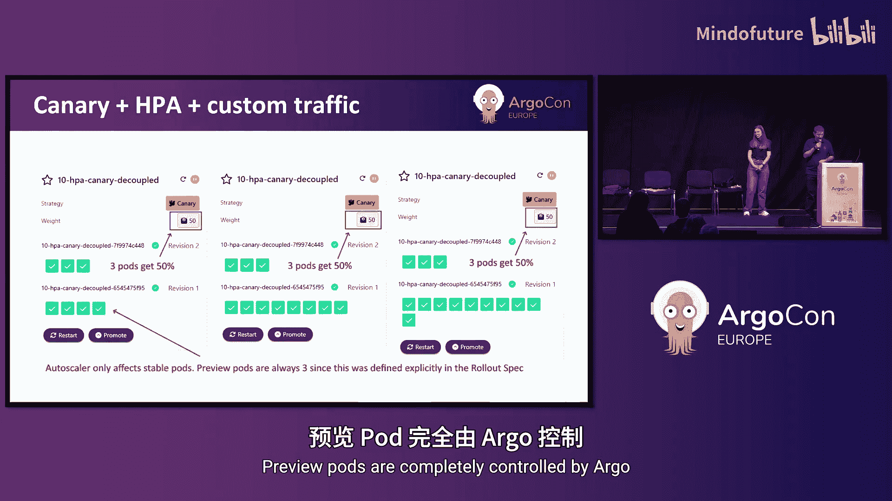


我知道你在想什么：如果同时使用 HPA 和 Anastasiia 提到的选项，会发生冲突吗？

正如之前剧透的，**Argo Rollouts 会胜出**。它将接管控制权。

例如，在同时使用 HPA 并设置了 `previewReplicaCount: 3` 的场景中，Argo Rollouts 将接管控制，预览 Pod 数量将始终为 3，无论 HPA 如何指示。在这种场景下，HPA 只控制稳定 Pod，不控制其他。

在金丝雀部署中也是如此。如果我指定将 50% 的流量发送给 3 个 Pod，这将被强制执行，并覆盖 HPA 的指示。HPA 将只影响稳定 Pod，预览 Pod 完全由 Argo Rollouts 控制。

## 总结与资源

谢谢 Cosmin。让我们来总结一下。

Argo Rollouts 使你的部署变得简单且安全。正如我们之前所示，在跳转到使用 HPA 之前，了解其他可用选项和一些有助于控制 Rollout 的属性非常重要。评估成本节约、业务需求和部署的灵活性也至关重要。

我们展示的选项应该能让你在不使用 HPA 的情况下使用 Argo Rollouts，从而简化事务。并且，正如 Cosmin 所说，在发生冲突时，Argo Rollouts 的规则将始终覆盖 HPA。

我们鼓励你查看官方文档。我们稍后会分享一些链接。

首先，我们想分享这张幻灯片，它总结了今天讨论的所有用例。标为橙色的单元格是人们经常混淆的例子，值得仔细研究并试验，看看哪种最适合你的业务场景。你可以拍下这张幻灯片，或者使用幻灯片底部的二维码链接查看。

最后，我们提供了一些有用的链接：
1.  [Argo Rollouts 概念文档](https://argo-rollouts.readthedocs.io/en/stable/concepts/)
2.  [Argo Rollouts 特性文档](https://argo-rollouts.readthedocs.io/en/stable/features/)
3.  [本次演讲的示例代码库](https://github.com/argoproj-labs/rollouts-hpa-examples)
4.  [为活动组织者提供的无障碍指南](https://dei.cncf.io/guides/event-organizers/)

如果你有任何问题，可以通过 Slack 联系我们。也请反馈你对今天演讲的看法，告诉我们你喜欢的内容或未来希望听到更多的话题。

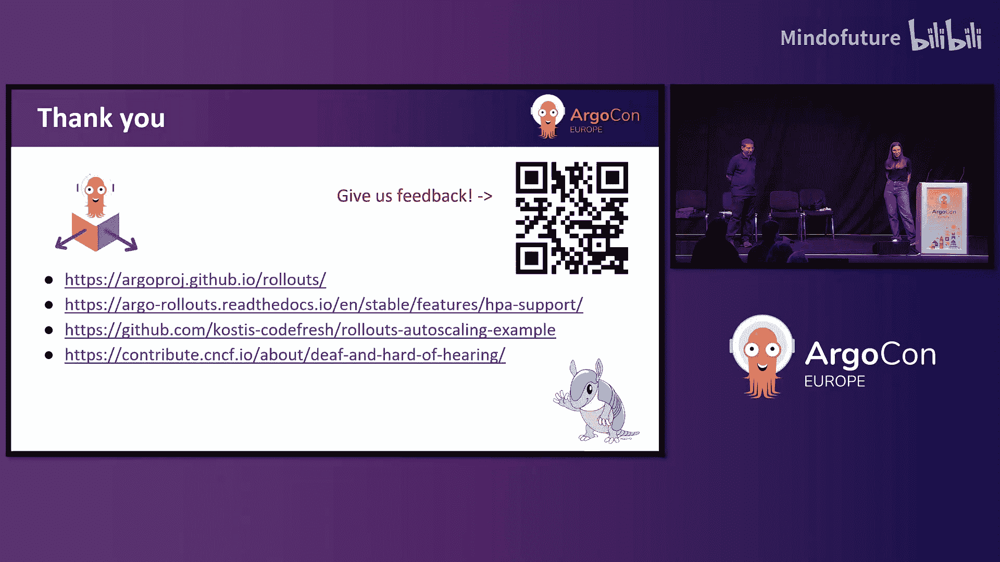

本节课中，我们一起学习了 Argo Rollouts 与 HPA 的集成，了解了渐进式交付的成本优化方法，以及两者协同工作时的优先级规则。希望这些知识能帮助你构建更高效、更经济的云原生交付流程。