# 001：A代表Amazon API Gateway 🚪

在本节课中，我们将要学习AWS云服务系列的第一个核心服务：Amazon API Gateway。这是一个用于创建、发布、维护和保护API的全托管服务。

## 什么是Amazon API Gateway？

Amazon API Gateway是一项**完全托管**的**无服务器**服务。你可以使用它在AWS上创建、发布、维护和托管你的API。

它支持多种类型的API，包括：
*   **HTTP APIs**
*   **REST APIs**
*   **WebSocket APIs**

## 核心功能与集成


上一节我们了解了API Gateway的基本定义，本节中我们来看看它的核心功能和如何与其他服务协同工作。

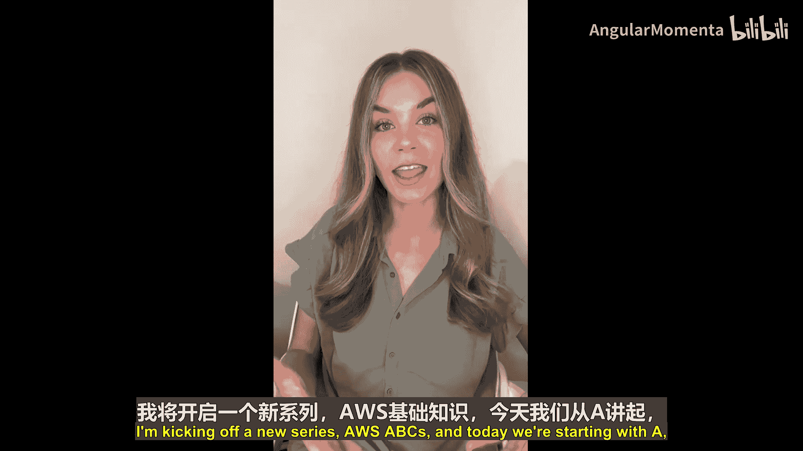

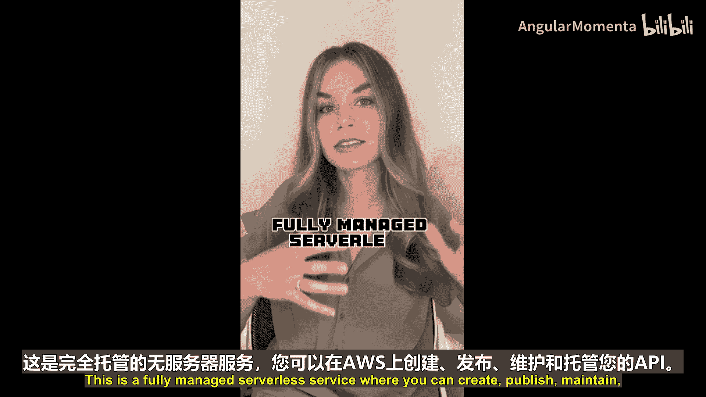


API Gateway可以与许多不同的后端AWS服务集成。一个非常常见的集成模式是与**AWS Lambda函数**结合使用。

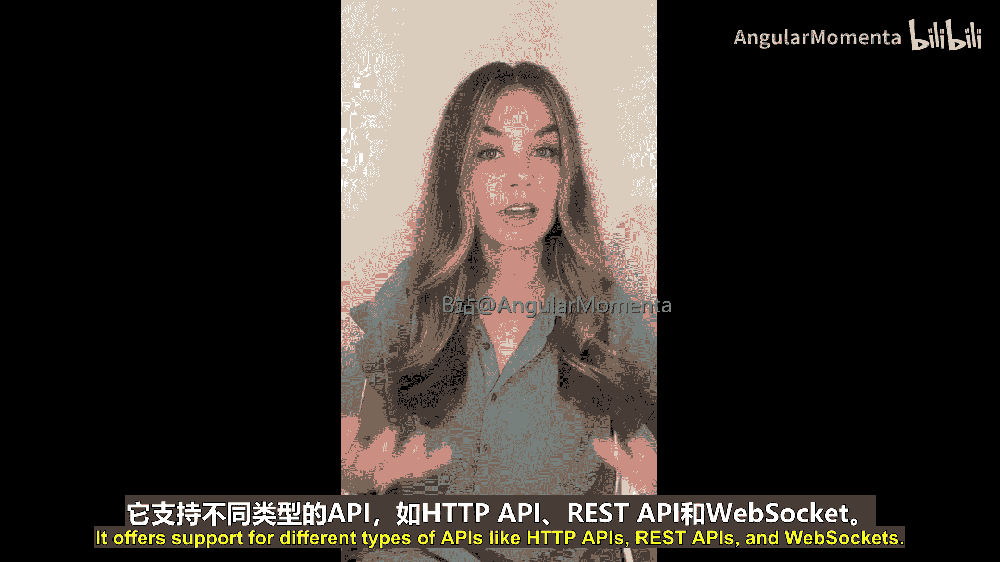


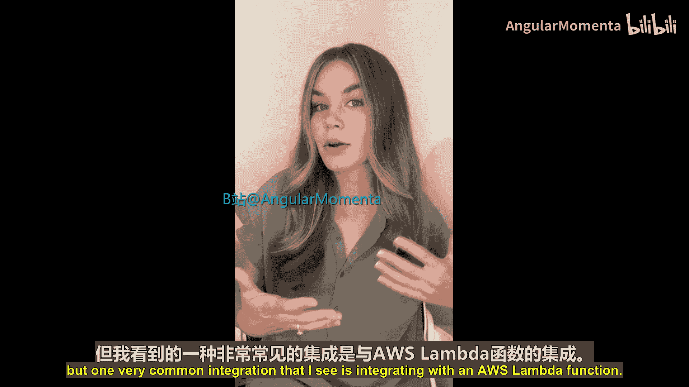

你可以将AWS Lambda函数配置为API Gateway的后端，从而允许用户通过API Gateway来调用该Lambda函数。这通常通过以下方式实现：
```yaml
# 示例：在CloudFormation中关联API Gateway与Lambda
MyApi:
  Type: AWS::ApiGateway::RestApi
  Properties:
    ...

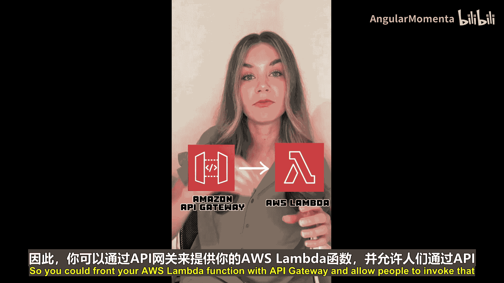


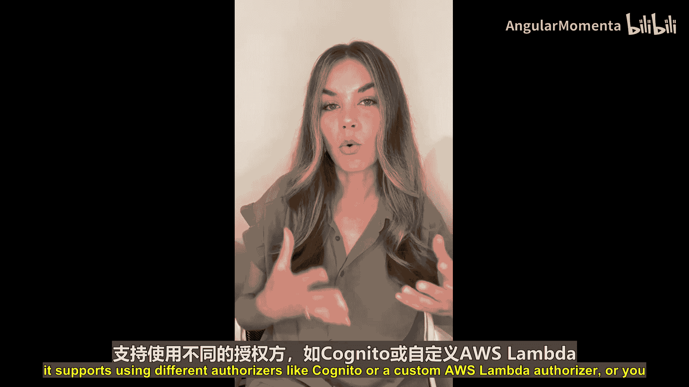

MyResource:
  Type: AWS::ApiGateway::Resource
  Properties:
    RestApiId: !Ref MyApi
    ParentId: !GetAtt MyApi.RootResourceId
    PathPart: "myendpoint"


MyMethod:
  Type: AWS::ApiGateway::Method
  Properties:
    RestApiId: !Ref MyApi
    ResourceId: !Ref MyResource
    HttpMethod: GET
    Integration:
      Type: AWS_PROXY
      IntegrationHttpMethod: POST
      Uri: !Sub "arn:aws:apigateway:${AWS::Region}:lambda:path/2015-03-31/functions/${MyLambdaFunction.Arn}/invocations"
```

## 安全性

在将API暴露给外部后，保护它们至关重要。API Gateway提供了多种方式来确保API的安全。

以下是API Gateway支持的主要授权和认证方法：
*   **API密钥**：用于控制对API的访问。
*   **授权器**：
    *   使用**Amazon Cognito**进行用户身份验证和授权。
    *   使用**自定义的AWS Lambda授权器**来实现复杂的授权逻辑。
*   **IAM授权**：通过使用AWS Identity and Access Management (IAM) 角色和策略来控制访问权限。

## 管理与部署

作为一个完全托管服务，其可扩展性是内置的。你通常无需手动扩展服务，只需管理配额即可。

你可以为API设置节流限制，并且账户内也有配额来决定可以进行的并发API调用数量。你可以调整这些设置，但底层的可扩展性由AWS管理。

当你对API Gateway进行更改时，需要将其部署到所谓的**阶段**。阶段可以指向不同的环境，例如生产环境、QA环境或开发环境。它还可以并行托管多个版本的API。如果你有多个需要不同版本的API消费者，可以将它们托管在不同的阶段中。此外，通过使用阶段，它还支持你进行**金丝雀发布**。


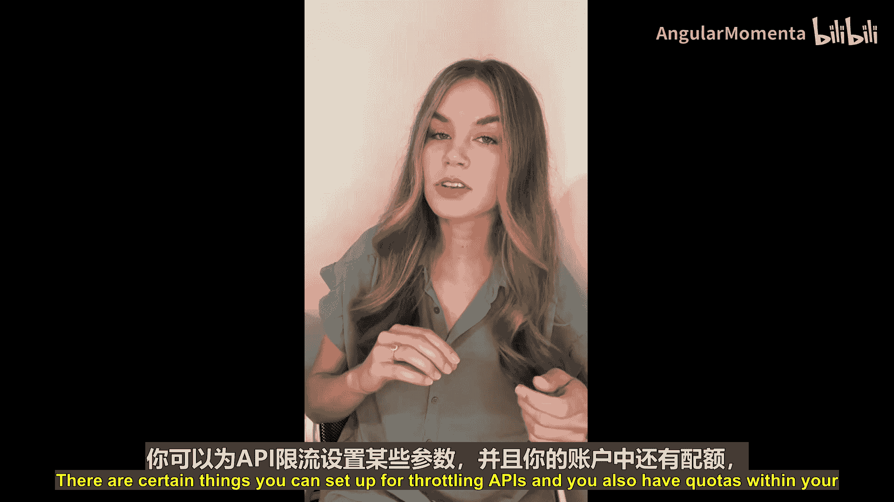

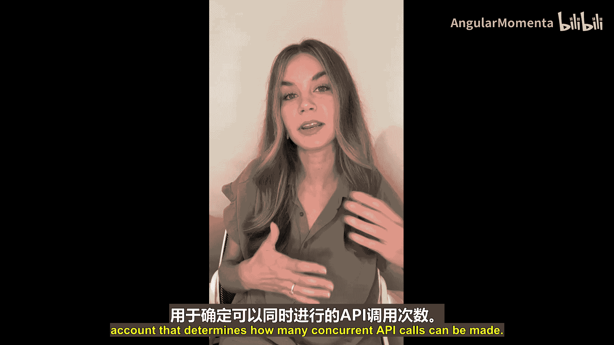

## 监控

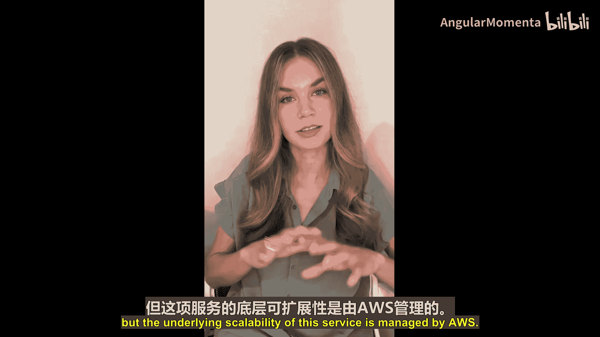

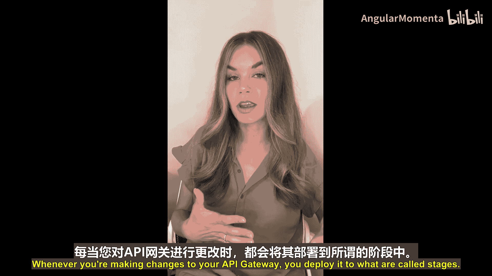

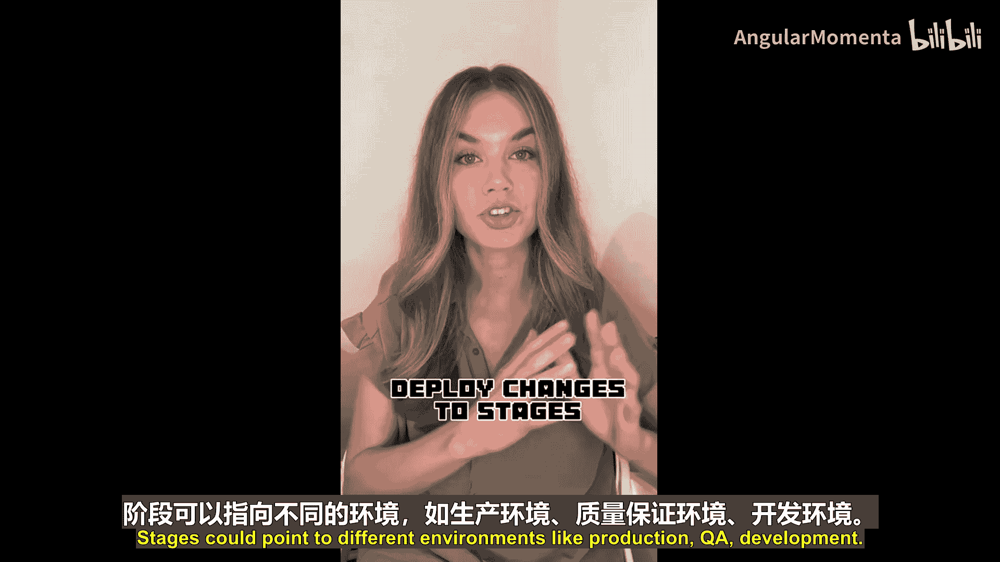

为了确保API的健康运行，监控是必不可少的。API Gateway与AWS的监控服务深度集成。


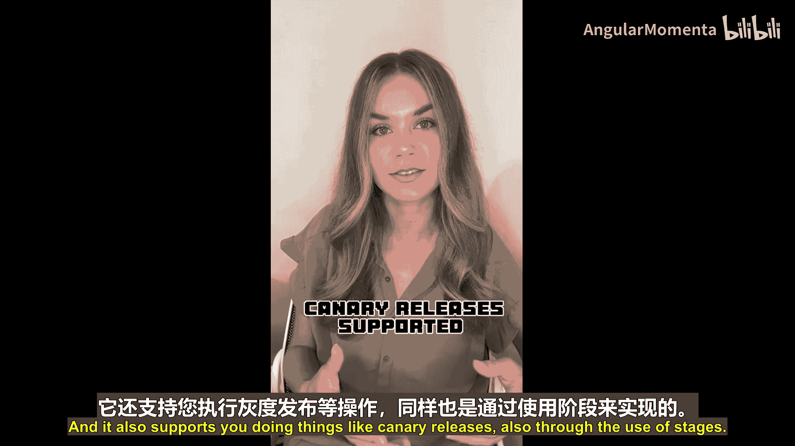

API Gateway与**Amazon CloudWatch**以及**AWS X-Ray**集成，使你能够深入了解API的运行状况和性能。

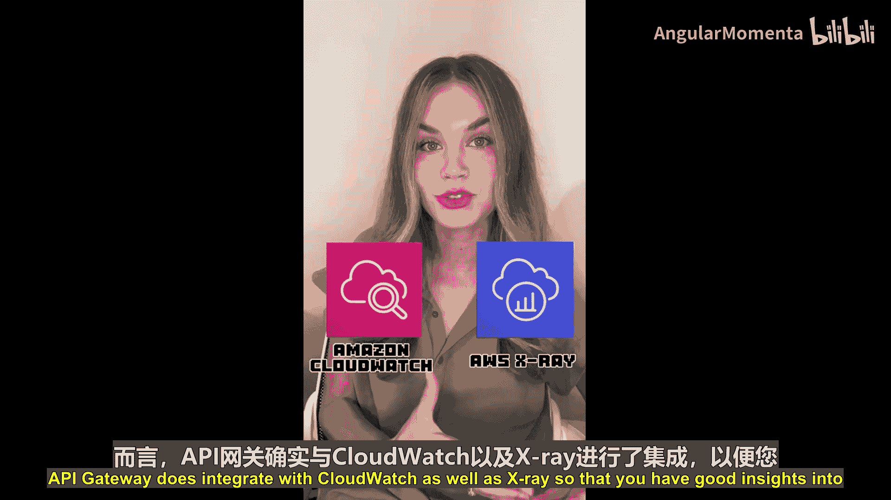

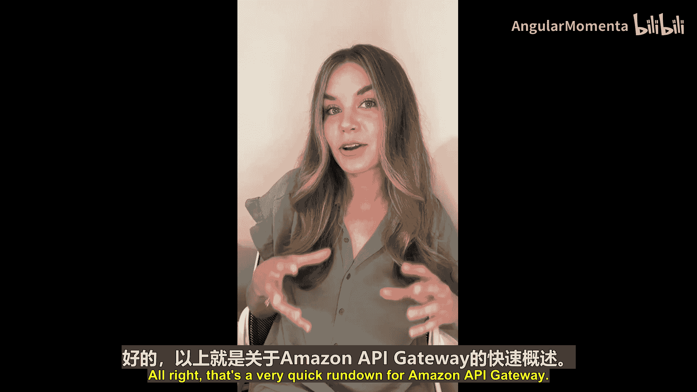

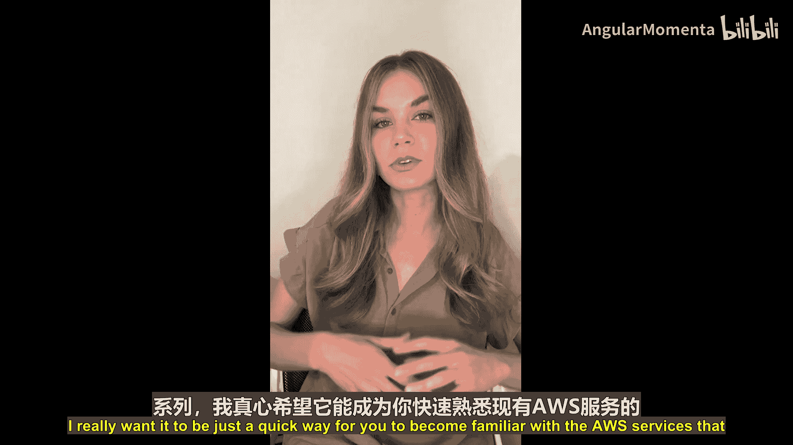

---

本节课中我们一起学习了Amazon API Gateway的基础知识。我们了解到它是一个用于创建和管理API的全托管、无服务器服务，支持多种API类型和强大的安全功能，并能与Lambda等服务无缝集成。其内置的可扩展性、阶段化部署以及集成的监控工具，使得构建和维护API变得简单高效。


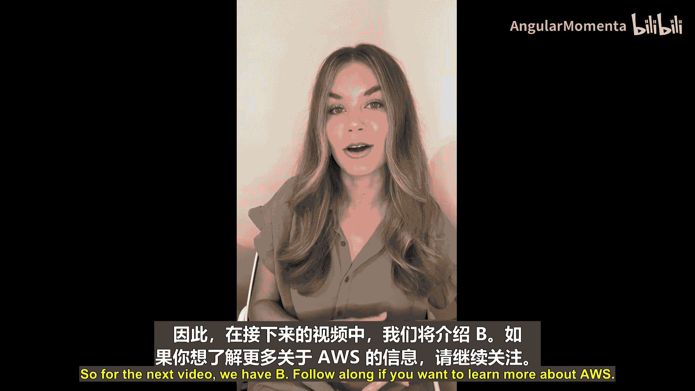

在下一节课中，我们将继续AWS ABC系列，学习以字母“B”开头的AWS服务。