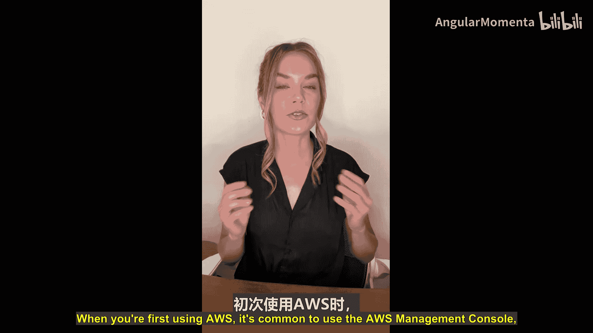
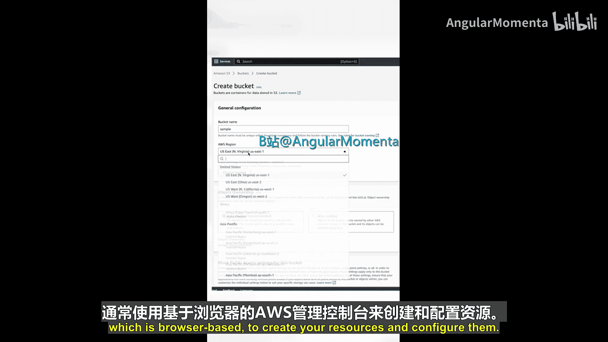
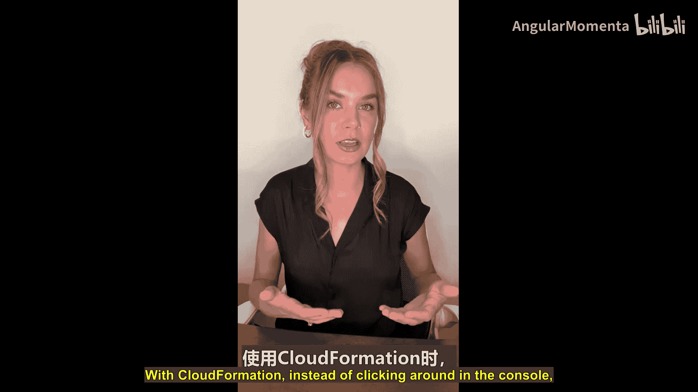
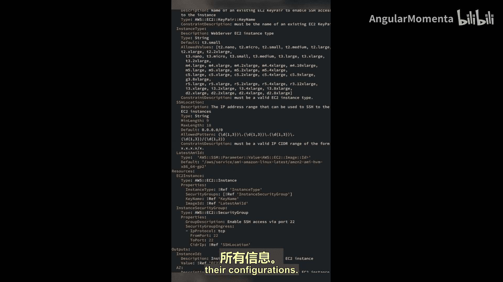
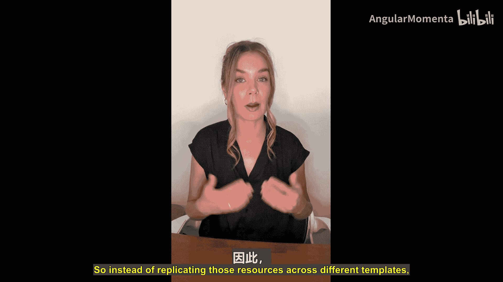
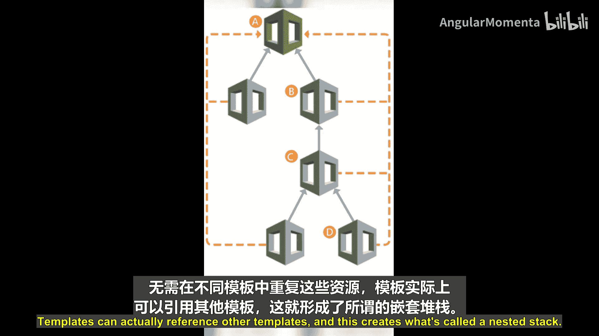
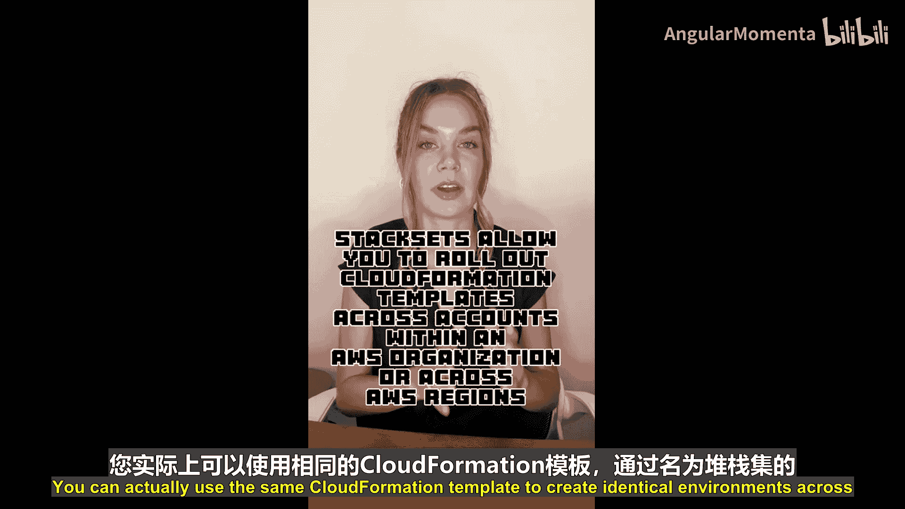
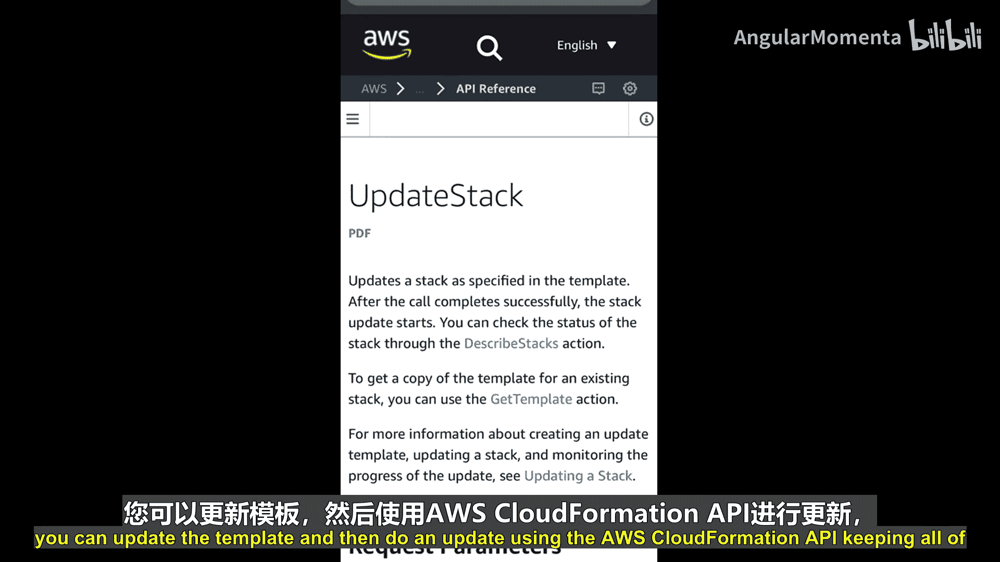

# 003：AWS CloudFormation - 基础设施即代码 🏗️

在本节课中，我们将学习AWS CloudFormation，这是一个用于自动化、可重复地创建和管理AWS资源的服务。我们将了解它如何帮助您从手动配置转向代码驱动的资源管理。

## 概述

当您初次使用AWS时，通常会使用基于浏览器的AWS管理控制台来创建和配置资源。然而，如果您希望将一个AWS账户中的所有基础设施复制到另一个账户，使用控制台操作会非常繁琐且容易出错。因此，虽然控制台适合学习，但在实际工作中，我们应当以自动化和可重复的方式配置资源。

上一节我们讨论了手动配置的局限性，本节中我们来看看如何通过AWS CloudFormation实现基础设施即代码。



## 什么是AWS CloudFormation？





AWS CloudFormation是一个基础设施即代码工具，它可以帮助您以可重复且可靠的方式自动化资源供应。使用CloudFormation，您无需在控制台中点击操作，而是创建基于JSON或YAML格式的文档。

这些文档被称为**模板**，它们包含了您要创建的所有资源及其配置信息。CloudFormation会读取此模板，并代表您配置资源。

**核心概念公式：**
`基础设施状态 = CloudFormation模板`

## CloudFormation的核心优势

CloudFormation能够处理资源间的依赖关系、参数化输入，以及在供应过程中出现错误时自动回滚资源。它能确保资源按照您提供的配置以正确的顺序创建，与手动配置相比，这节省了时间并降低了错误风险。



**核心概念代码示例（YAML片段）：**
```yaml
Resources:
  MyEC2Instance:
    Type: AWS::EC2::Instance
    Properties:
      InstanceType: t2.micro
      ImageId: ami-0abcdef1234567890
```

## 模板与堆栈





在一个模板中创建的所有资源会形成一个称为**堆栈**的单元。您可能会根据应用程序、团队或堆栈的不同层级来组织多个CloudFormation模板。如何组织代码完全取决于您，但我们确实将其视为代码，因此建议您将模板检入源代码控制仓库，并像对待其他代码工件一样管理它。

以下是组织模板时的一些常见考虑：

*   **嵌套堆栈**：相同的资源可能被多个堆栈使用。为了避免在不同模板中重复定义这些资源，模板可以引用其他模板，从而创建所谓的嵌套堆栈。
*   **多环境管理**：考虑一个场景，您有多个AWS账户分别承载测试、QA和生产环境。您可以使用相同的CloudFormation模板，借助**堆栈集**功能在这些账户中创建完全相同的环境。当需要对资源进行更改时，您可以更新模板，然后通过AWS CloudFormation API执行更新，从而以自动化方式保持所有环境的一致性。

## 总结与后续学习



本节课中我们一起学习了AWS CloudFormation的基础知识。我们了解到它是一个强大的基础设施即代码服务，通过模板自动化资源供应，支持堆栈管理、嵌套引用和多环境部署，从而提升了效率、可靠性和一致性。





CloudFormation是一个庞大的主题，本视频只是一个非常简短的介绍。如果您想了解更多，建议查阅AWS官方文档，并阅读《DevOps简介》白皮书。您可以通过提供的链接直接跳转到该白皮书中关于CloudFormation的章节。