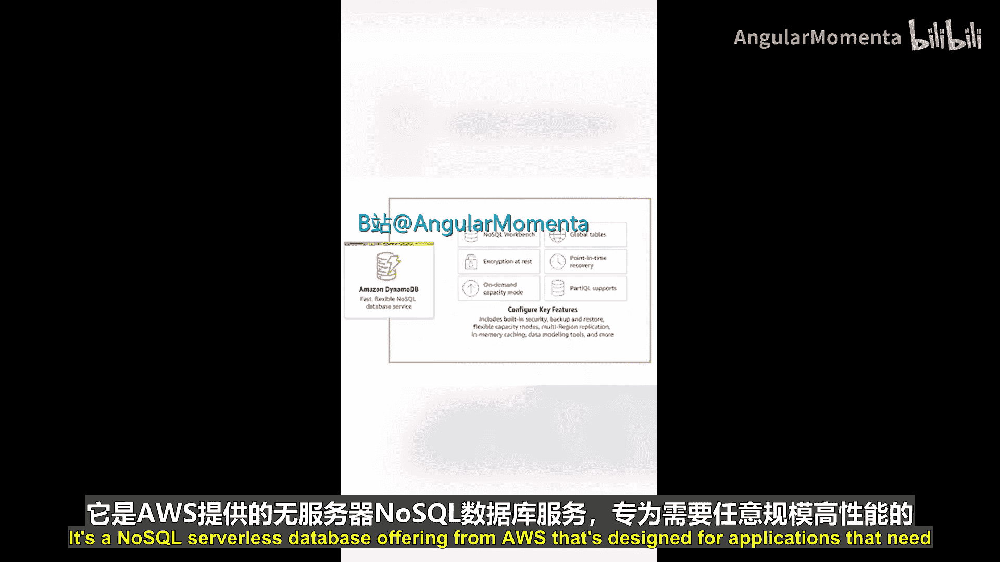
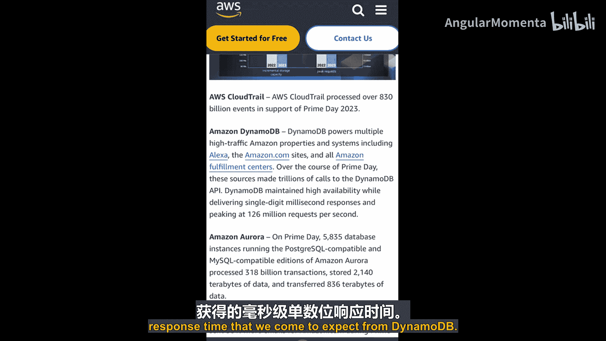
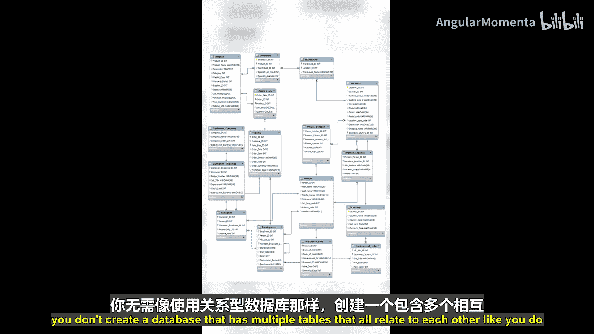
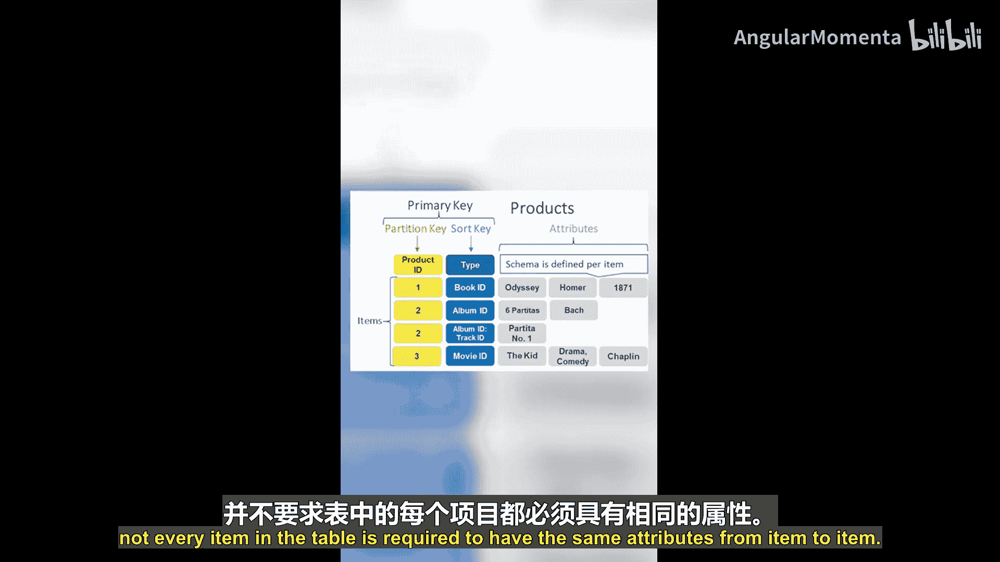

# 004：D代表Amazon DynamoDB 🗄️

在本节课中，我们将要学习AWS的NoSQL数据库服务——Amazon DynamoDB。我们将了解它的核心概念、特点以及它与传统关系型数据库的区别。

过去，关系型数据库确实是大多数应用程序的默认选择。但现在我们有了更多选择。NoSQL数据库非常适合需要灵活模式、大规模可扩展性或需要个位数毫秒级响应时间的场景。Amazon DynamoDB是AWS提供的一款NoSQL无服务器数据库服务，专为需要任何规模下高性能的应用程序而设计。

例如，在最近的亚马逊Prime会员日期间，DynamoDB API接收了数万亿次请求，其峰值达到每秒约1.26亿次请求。它始终保持了高可用性以及我们所期待的个位数毫秒级响应时间。这项服务是真正为大规模可扩展性而构建的。

## DynamoDB核心概念

上一节我们介绍了DynamoDB的定位，本节中我们来看看它的基本概念。

与创建包含多个相互关联表的关系型数据库不同，在DynamoDB中，您创建的是独立的表。这些表包含项目。DynamoDB表中的每个条目都称为一个**项目**。项目具有**属性**，这类似于关系型数据库中的列。

然而，区别在于，DynamoDB提供灵活的模式，这意味着表中的每个项目并不要求拥有完全相同的属性。尽管如此，表中的每个项目都必须有一个**分区键**，这是项目的唯一标识符。您还可以选择性地定义一个**排序键**，当仅凭分区键不足以使项目唯一时，可以使用排序键。排序键也可用于各种不同的用例。

之所以提到这一点，是因为分区键和排序键是表中唯一可直接查询的属性（如果您没有定义任何二级索引的话）。但这并不意味着您不能查询非分区/排序键的其他属性。只是您需要使用**扫描API**，它的效率低于**查询API**。

了解查询和扫描之间的区别非常重要，同时也要了解您的表设计或定义的分区键和排序键如何影响表的性能以及您与表的交互方式。

## 高级功能与学习资源

如果您希望有更多可以查询的属性选项，可以创建**二级索引**。二级索引包含表中属性的一个子集，以及一个用于支持查询操作的备用键。

DynamoDB的其他功能包括**自动扩展**以处理需求变化，以及**备份**功能以确保数据安全且可恢复。

关于DynamoDB，有很多知识需要学习，我们在这个简短的视频中只是触及了皮毛。因此，我建议您查阅AWS开发者指南，您可以通过以下链接访问，在那里您可以了解更多信息。

本节课中我们一起学习了Amazon DynamoDB，这是一款高性能、无服务器的NoSQL数据库服务。我们了解了它的核心概念，如项目、属性、分区键和排序键，以及查询与扫描操作的区别。我们还提到了其自动扩展和备份等高级功能。请继续关注更多AWS ABCs课程。