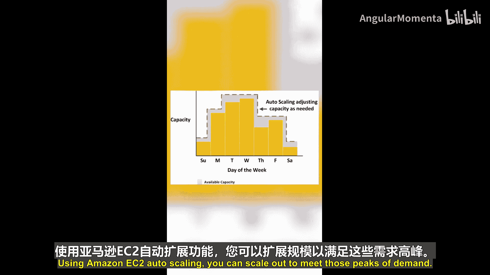
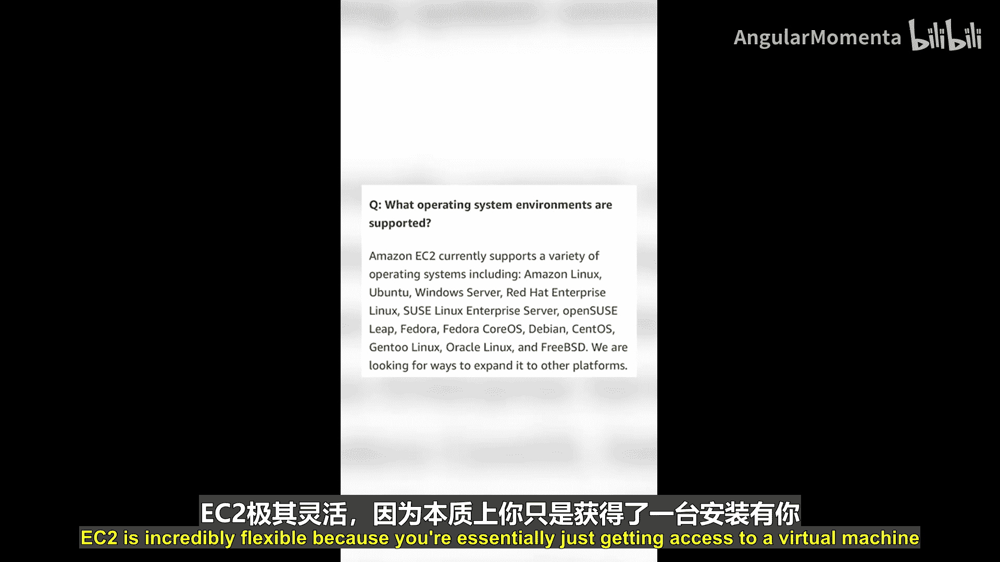
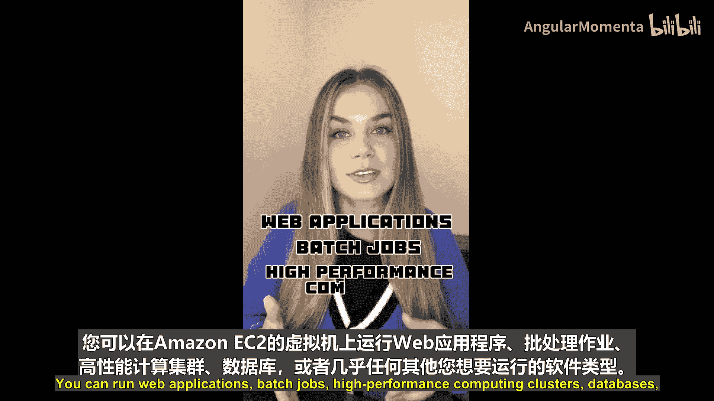
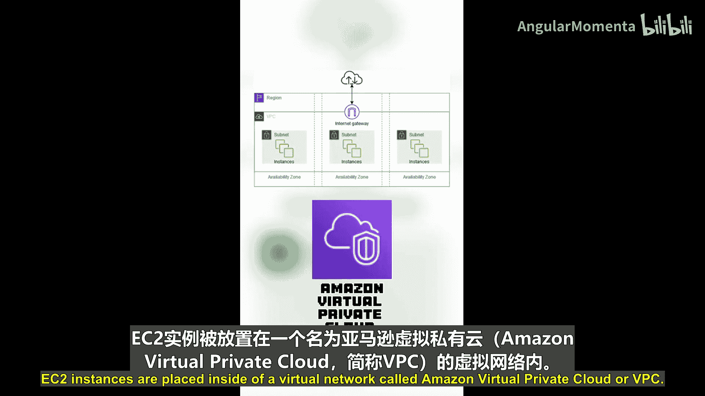
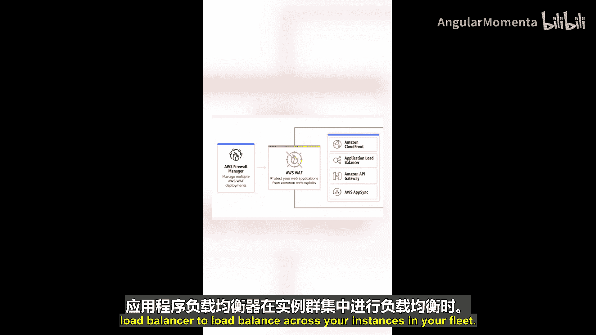
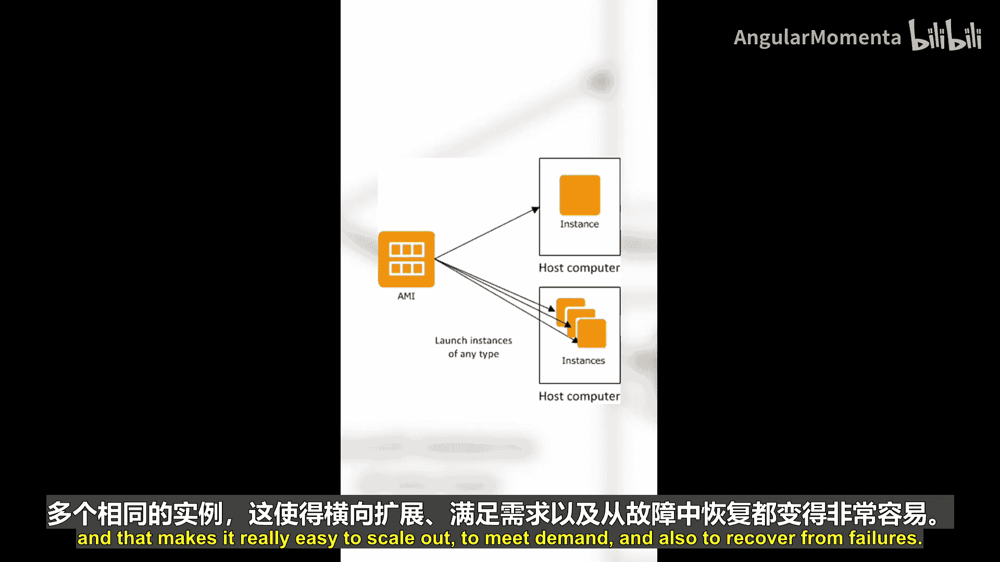
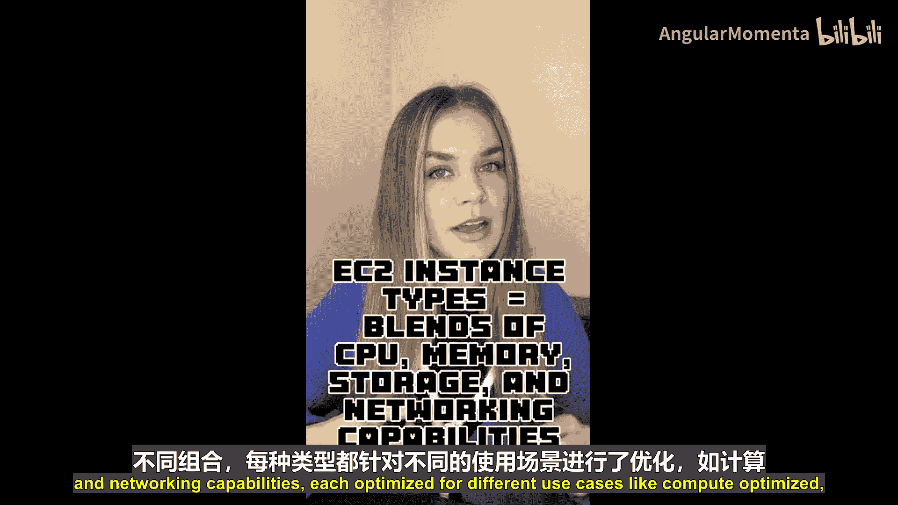
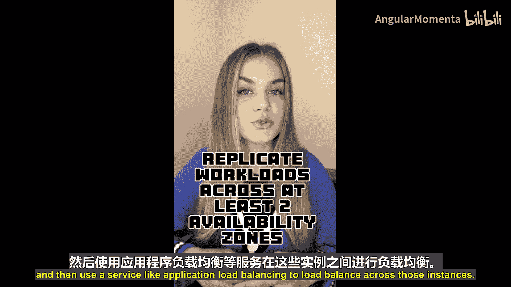
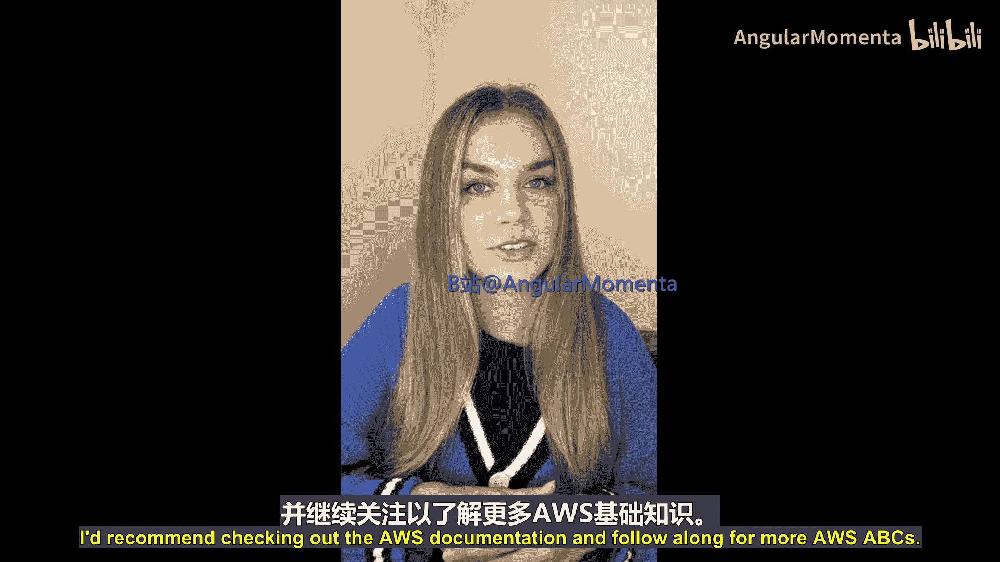

# 005：E代表Amazon EC2 🖥️

在本节课中，我们将要学习AWS云服务中的核心计算服务——Amazon Elastic Compute Cloud（EC2）。我们将了解EC2是什么、它的核心特性、如何工作以及它如何帮助您灵活、经济高效地运行应用程序。

---

## 什么是Amazon EC2？

Amazon EC2是AWS提供的弹性计算云服务。应用程序需要在计算资源上运行，当您使用AWS时，可以通过Amazon EC2创建虚拟机。您创建的每一台虚拟机都称为一个**Amazon EC2实例**。

EC2遵循**按需付费**的定价模式，这意味着您只需为实际使用的资源付费。

---

## EC2的核心特性与优势

上一节我们介绍了EC2的基本概念，本节中我们来看看它的一些核心特性和优势。

### 弹性伸缩

假设您在EC2上运行一个工作负载，当该工作负载的需求突然激增时，您可以使用**Amazon EC2 Auto Scaling**功能进行横向扩展，以满足需求高峰。当需求下降时，您可以再缩减规模。在缩减时，您可以停止或终止不再需要的EC2实例，同时停止为这些实例付费。

### 灵活性

EC2具有极高的灵活性，因为您本质上获得了一台安装了您所选操作系统的虚拟机。您可以在上面运行各种软件。

以下是您可以在EC2实例上运行的一些常见工作负载类型：
*   Web应用程序
*   批处理作业
*   高性能计算集群
*   数据库
*   几乎所有其他您想在虚拟机上运行的软件类型

---

## EC2的架构与组件

了解了EC2的用途后，我们来看看构成一个EC2环境的主要组件。

### 虚拟网络与安全

EC2实例被放置在一个称为**Amazon Virtual Private Cloud**的虚拟网络中。您可以使用多种工具来控制哪些类型的流量可以到达您的EC2实例。

以下是用于保护EC2实例的主要安全机制：
*   **安全组**：充当实例的虚拟防火墙。
*   **网络访问控制列表**：在子网级别提供额外的安全层。
*   **AWS WAF**：如果您使用**Application Load Balancer**在实例群之间进行负载均衡，可以配合使用AWS Web Application Firewall来保护Web应用。

### 存储

您可以使用**Amazon Elastic Block Store**为EC2实例附加持久化的存储卷。可以将其想象成连接到笔记本电脑的外置硬盘。

### 实例模板

实例是使用**Amazon Machine Image**创建的。AMI就像是EC2实例的一个快照，它包含了操作系统、预装软件以及启动一个EC2实例所需的其他组件。您可以从单个AMI启动许多完全相同的实例，这使得横向扩展以满足需求以及从故障中恢复变得非常容易。

---

## 选择与部署EC2实例

当您准备启动一个EC2实例时，需要为其选择大小和类型。这是云计算的优势之一：有大量不同类型的EC2实例可供您选择。

这些EC2实例类型提供了**CPU、内存和网络能力的不同组合**，每种类型都针对不同的使用场景进行了优化。

以下是几种主要的实例类型优化类别：
*   **计算优化型**：适用于计算密集型任务。
*   **内存优化型**：适用于处理大型数据集的工作负载。
*   **通用型**：为计算、内存和网络资源提供平衡配置。

关于EC2的一个最佳实践是：将您的工作负载复制到至少**两个可用区**中，然后使用**Application Load Balancer**等服务在这些实例之间进行负载均衡，以提高可用性和容错能力。

---

## 总结

本节课中我们一起学习了AWS的基础计算服务——Amazon EC2。我们了解到EC2提供了可调整大小的虚拟服务器（实例），采用按需付费模式，并具备弹性伸缩能力。我们还探讨了其关键组件，包括用于网络的VPC、用于存储的EBS、用于模板的AMI，以及用于安全的安全组和NACL。最后，我们介绍了如何根据CPU、内存和网络需求选择不同类型的实例，并了解了跨可用区部署以实现高可用的最佳实践。

这只是对Amazon EC2的初步介绍，还有更多内容值得深入学习。如果您有兴趣了解更多，建议查阅AWS官方文档。请继续关注更多AWS基础知识。