# 006：F代表AWS Fargate 🚢

在本节课中，我们将要学习AWS Fargate，这是一个用于在AWS上运行容器的无服务器计算引擎。我们将了解它的核心概念、工作原理、适用场景以及如何实现成本优化。

---

## 概述

AWS Fargate是一个无服务器计算引擎，专为在AWS上运行容器而设计。它允许开发者无需预置、配置或管理底层服务器集群，即可部署和扩展容器化应用程序。本节课将详细介绍Fargate如何与容器编排服务（如Amazon ECS和EKS）协同工作，以及它相较于传统EC2实例集群的优势。

---

## 什么是AWS Fargate？

AWS Fargate是一个**无服务器计算引擎**，用于在AWS上运行容器。与任何应用程序一样，容器需要计算资源才能运行。在Fargate出现之前，您通常需要创建一个Amazon EC2实例集群来运行容器，这意味着您需要负责预置、配置和扩展这个EC2集群。


使用AWS Fargate，您可以创建一个用于容器托管的**无服务器集群**。这意味着托管您集群的底层基础设施的预置、配置和扩展工作都由AWS处理。

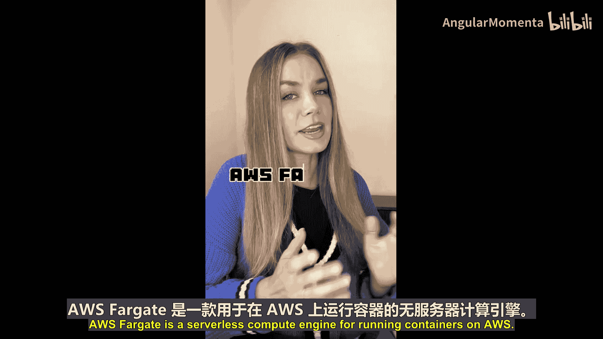


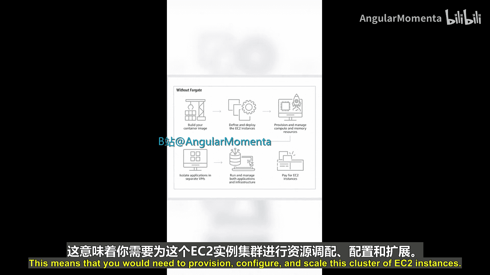

---

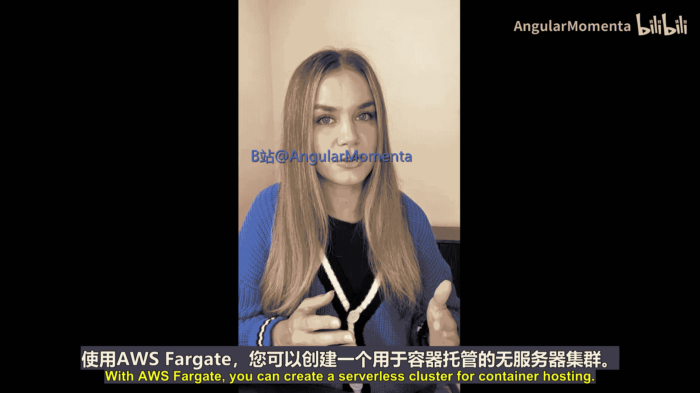

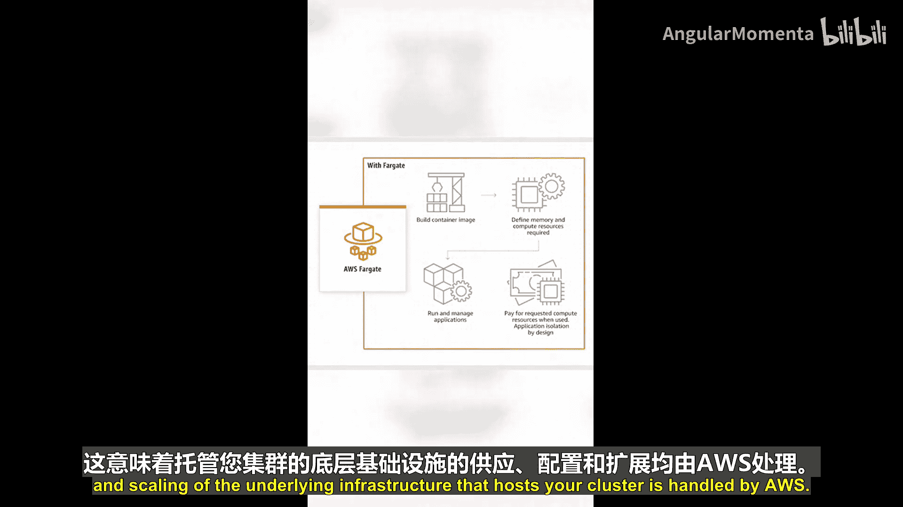

## 容器编排与计算选项

然而，要成功大规模运行容器，仅靠计算资源是不够的。在AWS上托管容器时，您首先需要选择一个容器编排服务，例如**Amazon Elastic Container Service (ECS)** 或 **Amazon Elastic Kubernetes Service (EKS)**。

容器编排是指对容器进行自动化管理，例如在服务器集群中部署、扩展或管理容器。

选择了容器编排服务后，您接下来需要选择要使用的计算选项。这将是以下两者之一：
*   一个Amazon EC2实例集群。
*   一个AWS Fargate集群（无服务器）。

Fargate与ECS和EKS都兼容。

---

## 如何选择：Fargate vs. EC2

以下是选择计算选项时的关键考虑因素：

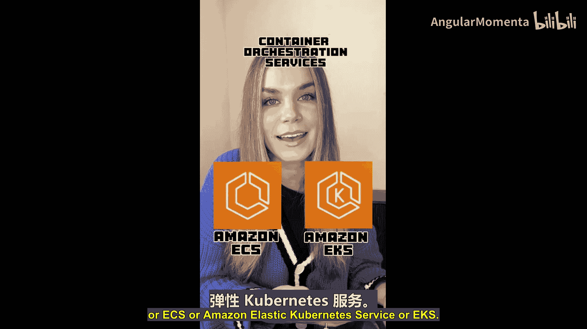

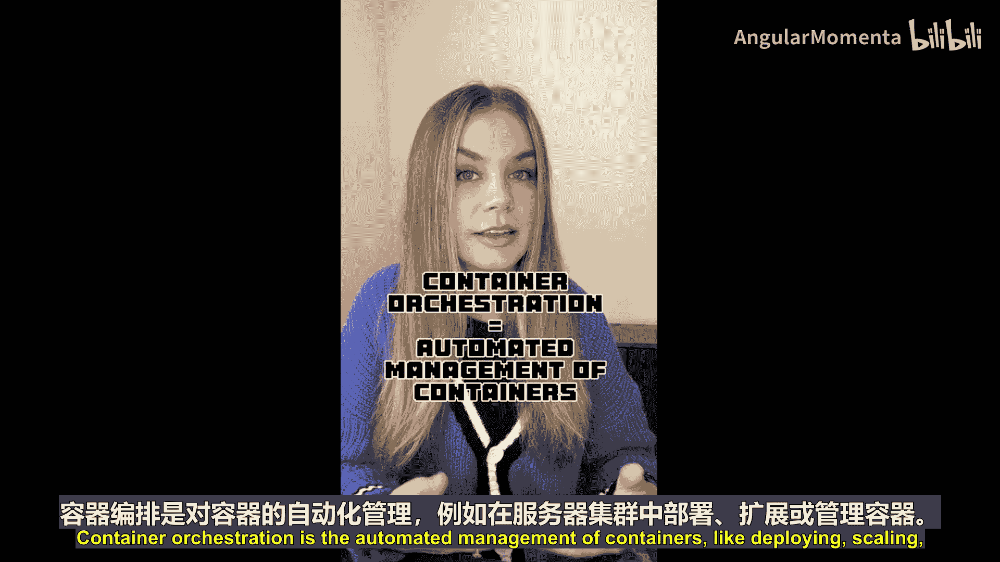

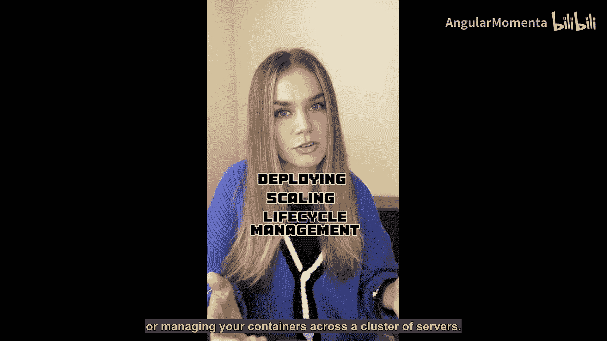

*   **选择Amazon EC2的情况**：如果您的合规性或安全要求规定您需要访问底层操作系统，或者需要对运行容器的实际主机拥有完全控制权，那么Amazon EC2将是您的最佳选择。
*   **选择AWS Fargate的情况**：如果您没有上述任何要求，那么您可以利用AWS Fargate的无服务器特性。这使您能够更专注于构建应用程序，而减少在管理服务器上的精力。

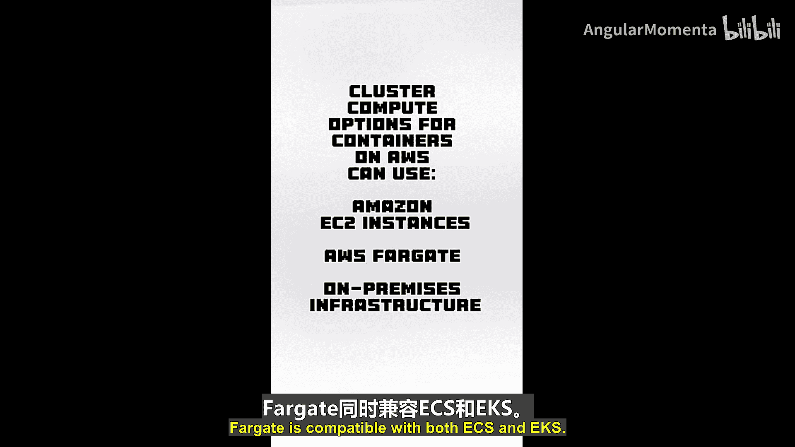


---

## Fargate的扩展性

关于在Fargate上运行容器的扩展性，需要理解两个层面：

1.  **容器本身的扩展**：由容器编排服务处理。例如，如果您使用ECS，您可以使用**服务自动扩展**来控制在任何给定时间要运行多少个容器。其配置可能类似于：
    ```json
    {
      "serviceAutoScalingConfiguration": {
        "minCapacity": 2,
        "maxCapacity": 10,
        "targetCpuUtilization": 70
      }
    }
    ```
2.  **底层计算基础设施的扩展**：由AWS Fargate处理。它会根据工作负载的需求自动扩展底层计算资源。

---

## 成本优化：Fargate Spot

为了提升成本效益，AWS Fargate提供了**Fargate Spot**。它的运作方式与Amazon EC2 Spot实例非常相似。

Fargate Spot让您能够以更低的价格运行容器。其工作原理是：AWS有时会有额外的计算容量，这些额外容量可以通过Fargate Spot提供给您使用，从而让您享受到更低的价格点。这是一个非常经济高效的选择。

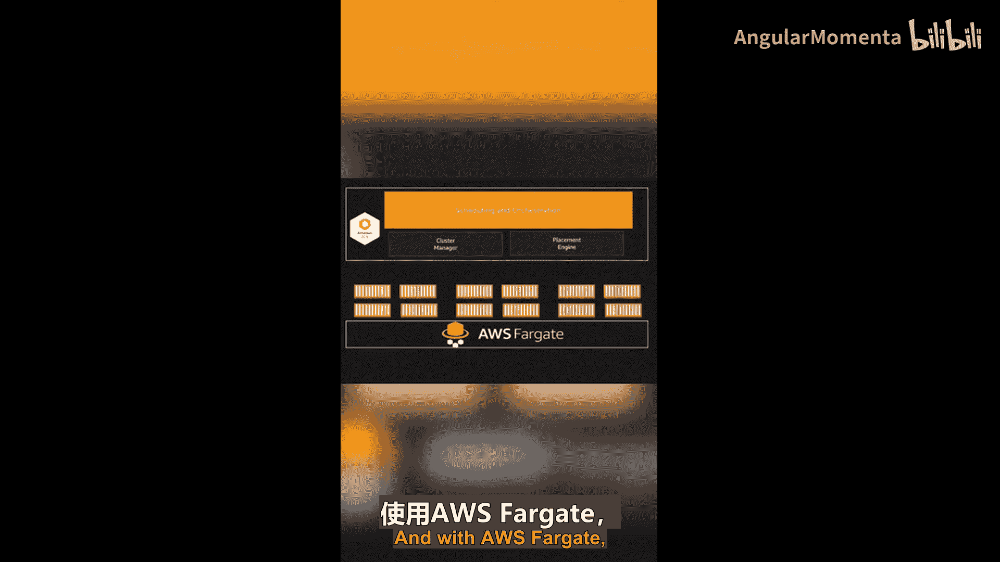


然而，当AWS需要收回这些容量时，它会向运行在Fargate Spot上的容器发送一个**两分钟的通知警告**。这为您的容器提供了时间来完成它们正在处理的任务，然后AWS才会回收该容量。

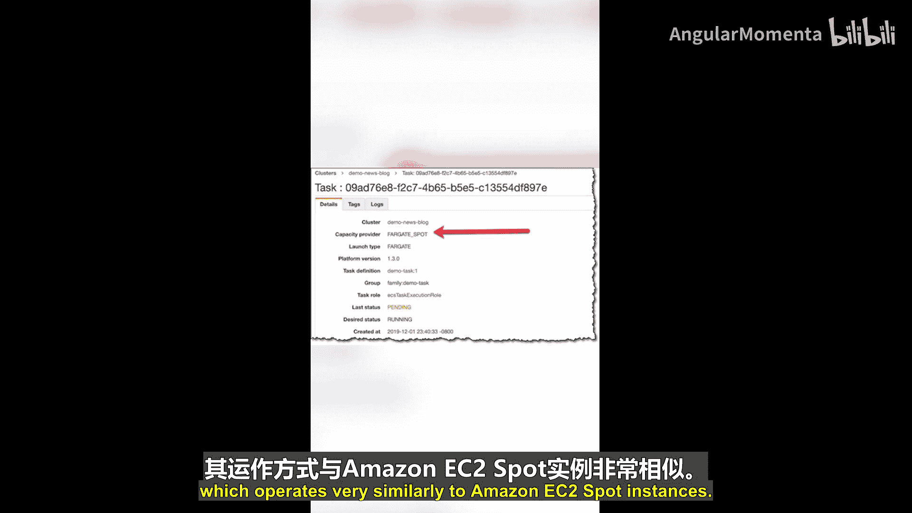

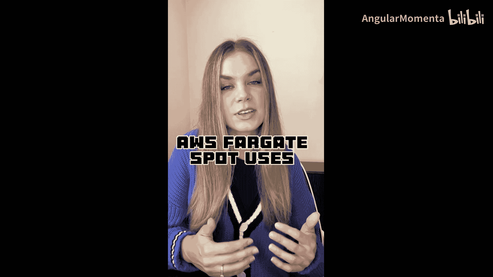

---

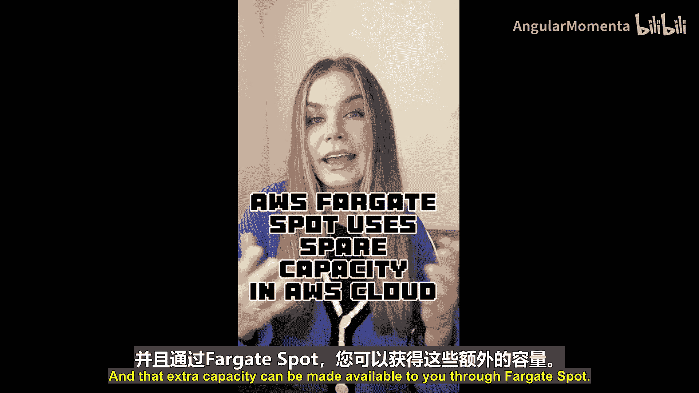

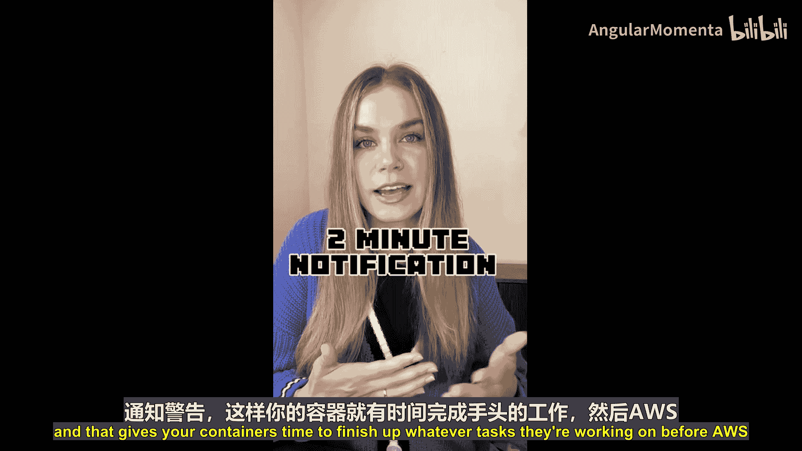

## 总结

本节课中，我们一起学习了AWS Fargate。总结如下：

*   **AWS Fargate** 是AWS上用于容器的无服务器计算引擎。
*   它允许您更专注于构建应用程序，而减少管理服务器的工作。
*   它与 **Amazon ECS** 和 **EKS** 兼容，用于容器编排。
*   选择Fargate还是EC2，取决于您对底层基础设施控制权的需求。
*   利用 **Fargate Spot** 可以显著优化运行成本。

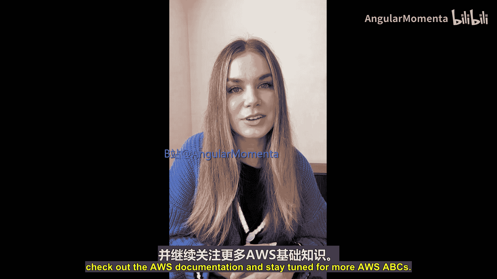

如果您想了解更多信息，请随时查阅AWS官方文档。请继续关注更多AWS ABCs课程。