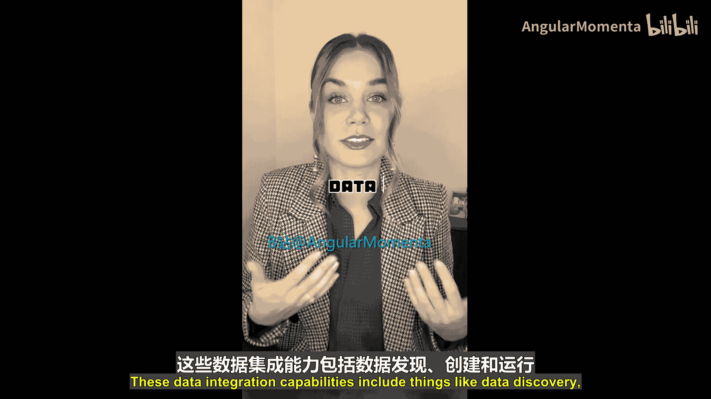
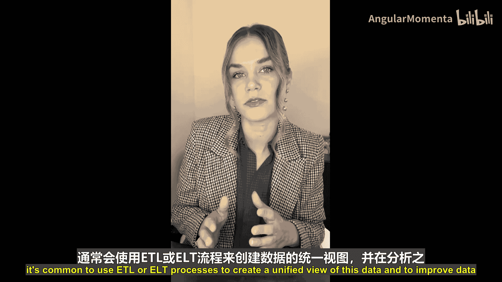
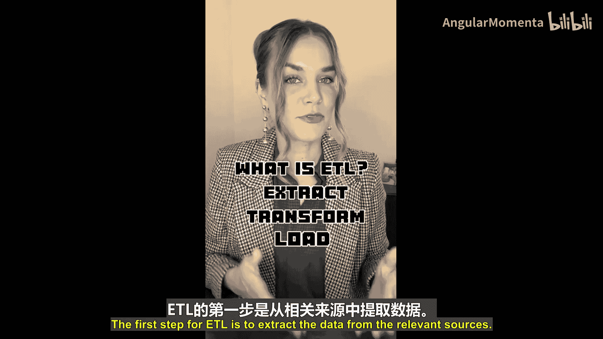
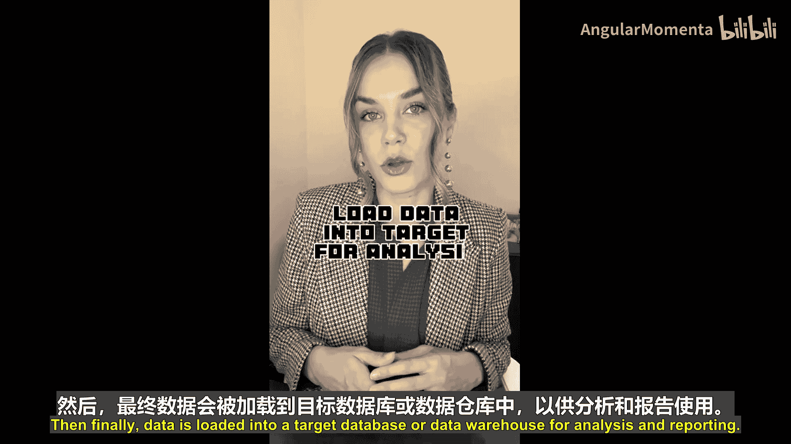
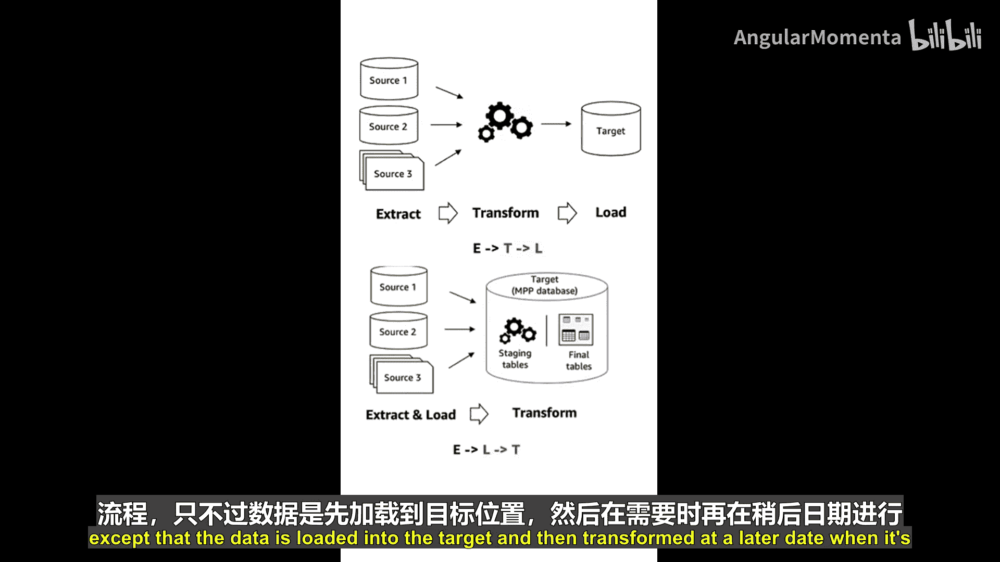
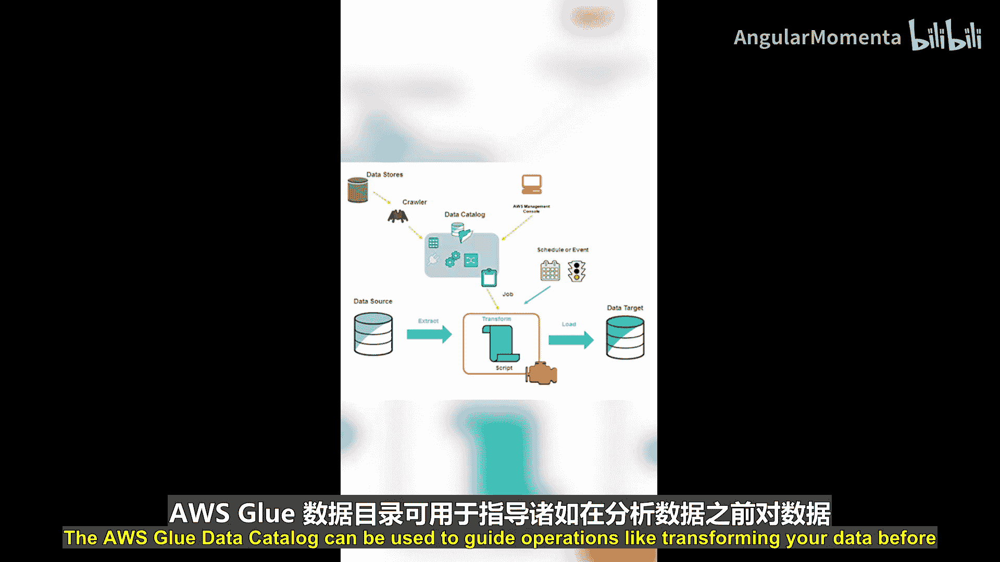
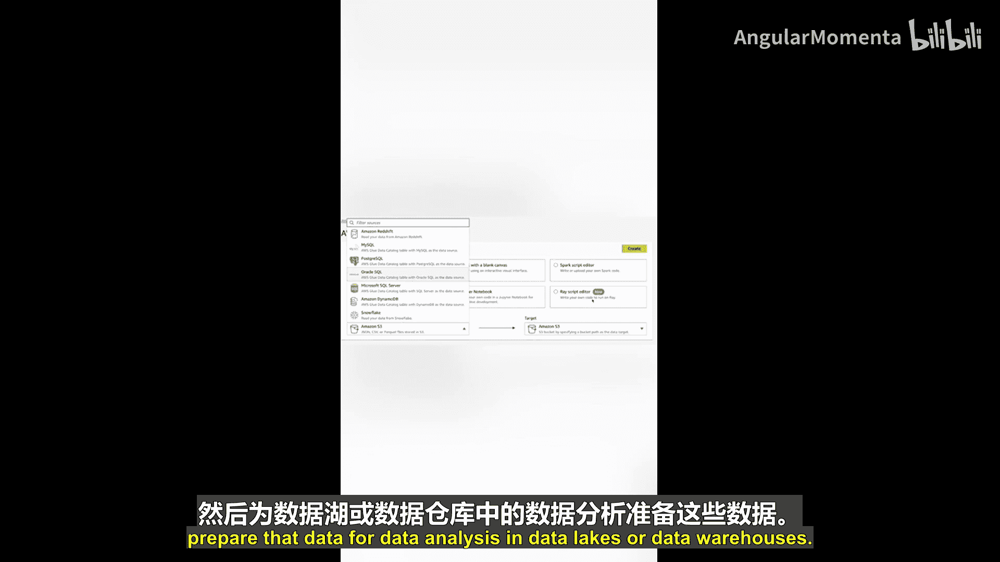
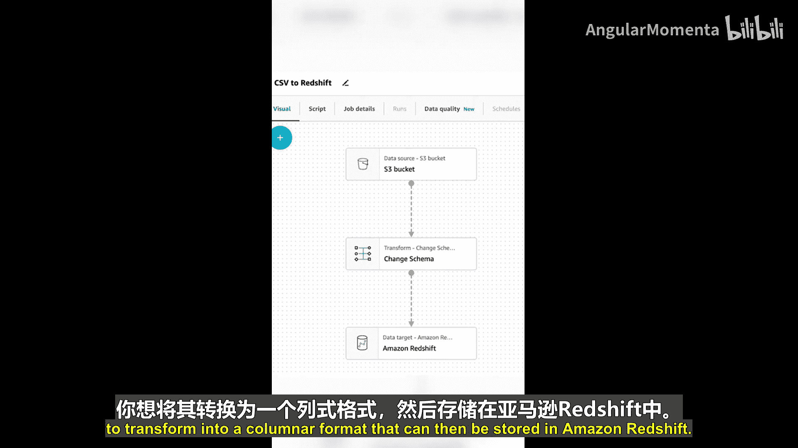

# 007：G代表AWS Glue 🧩

在本节课中，我们将学习AWS Glue，这是一个无服务器的数据集成服务。我们将了解它的核心功能，包括数据发现、ETL/ELT作业、数据清洗、转换以及数据目录管理。通过本教程，你将理解AWS Glue如何帮助整合和分析分散在不同来源的数据。

AWS ABCs系列课程按字母顺序介绍不同的AWS服务。今天的字母是G，对应的服务是AWS Glue。

AWS Glue是一个无服务器数据集成服务，它提供了完成大数据和数据分析任务所需的各种数据集成能力。这些能力包括数据发现、创建和运行ETL或ELT作业、数据清洗、数据转换以及为数据提供集中式目录管理。

数据通常分散在许多不同的来源中。为了有效地分析这些数据，通常需要使用ETL或ELT流程来创建数据的统一视图，并在分析前提升数据质量。

## 什么是ETL？🔍

ETL代表**提取（Extract）、转换（Transform）、加载（Load）**。

ETL的第一步是从相关来源**提取**数据。数据被提取后，会暂存在某个地方，例如Amazon S3（这是一个常用于数据湖存储层的AWS服务）。接着，数据会被**转换**成更适合数据分析工具（如Amazon QuickSight、Amazon Athena或Amazon EMR）使用的格式。最后，数据被**加载**到目标数据库或数据仓库中，用于分析和报告。

**ETL流程可以概括为：**
`数据源 -> 提取 -> 暂存 -> 转换 -> 加载 -> 目标（数据仓库/数据库）`

ELT是一个非常相似的过程，区别在于数据会先被**加载**到目标位置，然后在需要时再进行**转换**。

你可以创建AWS Glue作业来自动化处理数据移动和转换所需的工作。为了有效地大规模组织和使用数据，你需要对数据进行编目，以便了解自己拥有什么数据以及可以处理什么数据。

## AWS Glue数据目录 📚

AWS Glue为此提供了**AWS Glue数据目录**。这是一个用于存储数据元数据的集中式中心。AWS Glue数据目录可用于指导操作，例如在分析数据前对其进行转换。

在转换数据方面，AWS Glue作业表现出色。你需要某种代码或脚本来完成这部分工作。AWS Glue可以为你生成脚本，你也可以自己提供脚本。

你还可以使用**AWS Glue Studio**，在那里可以通过可视化方式组合和运行数据转换工作流。在AWS Glue Studio中，你可以从多种数据源和目标中进行选择，然后为数据湖或数据仓库中的数据分析准备数据。

## 数据转换示例 💡

假设你在Amazon S3中有一个CSV文件，你想将其转换为列式格式，然后存储到Amazon Redshift中。这类处理过程就可以通过AWS Glue作业来完成。

当AWS Glue中的所有组件都设置妥当后，你就可以启动ETL作业了。你可以按需运行它，也可以设置触发器在特定条件下（例如，当新数据到达时）自动运行。

---

**本节课总结**

本节课我们一起学习了AWS Glue。我们了解到它是一个无服务器的数据集成服务，核心功能是处理ETL（提取、转换、加载）和ELT（提取、加载、转换）流程。AWS Glue通过其数据目录集中管理元数据，并通过Glue作业（支持自动生成或自定义脚本）以及可视化的Glue Studio来简化数据转换工作流的创建和执行。这些功能共同帮助用户整合分散的数据源，为大数据分析和报告做好准备。