# 009：I代表AWS IAM 👤

在本节课中，我们将要学习AWS身份与访问管理服务，即IAM。IAM是管理对AWS访问的核心服务，它决定了谁可以访问您的AWS资源，以及他们能对这些资源执行什么操作。

在深入IAM概念之前，我们首先需要了解认证与授权的区别。

## 认证与授权 🔐

**认证**意味着证明“你就是你所说的那个人”。这通常通过用户名和密码或生物识别技术等系统来验证身份。认证的核心是确认身份。

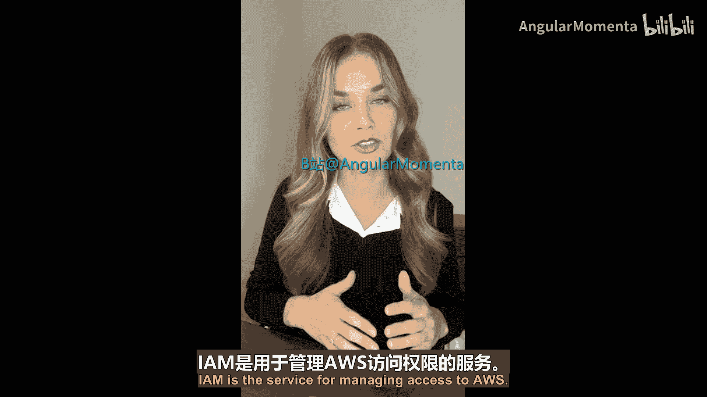

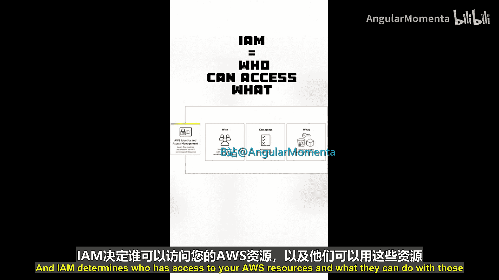

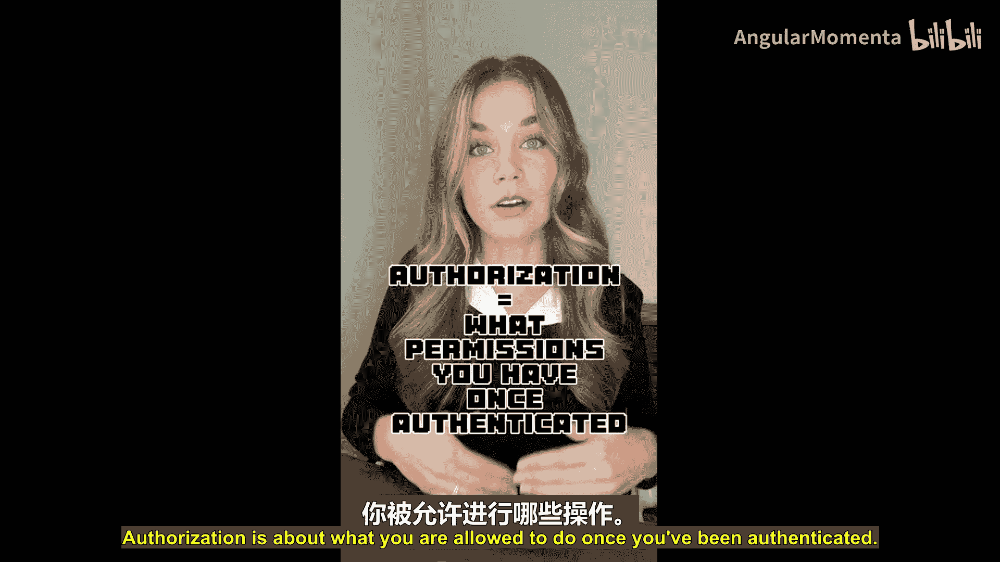

**授权**则关乎权限。即使你成功认证了身份，也不意味着你可以为所欲为。授权决定了你在通过认证后，被允许执行哪些操作。在AWS的上下文中，授权控制着你被允许对AWS账户内的不同资源发起哪些AWS API调用或请求。

IAM服务同时处理认证和授权。

上一节我们介绍了认证与授权的区别，本节中我们来看看IAM的核心概念，以便更好地理解如何设置这些内容。

## IAM核心概念 🧩

以下是IAM中的几个核心实体和概念。

### 用户 👤

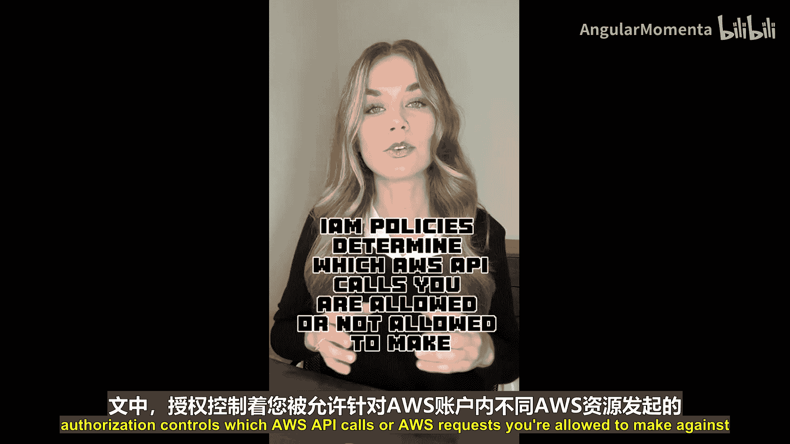

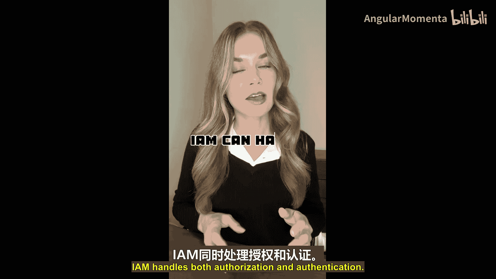

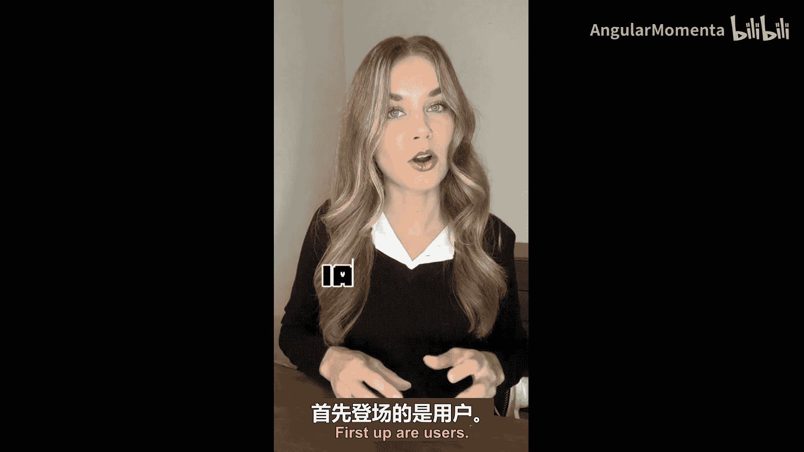

用户是获取AWS账户访问权限的主要方式之一。用户拥有静态凭证，如用户名和密码，可用于登录AWS管理控制台。用户身份通常由单个人使用。

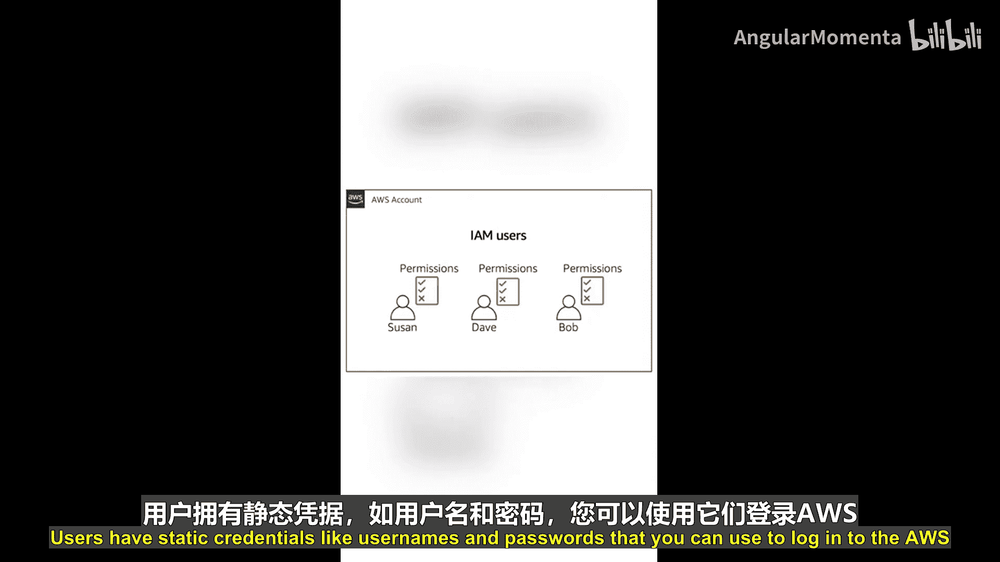

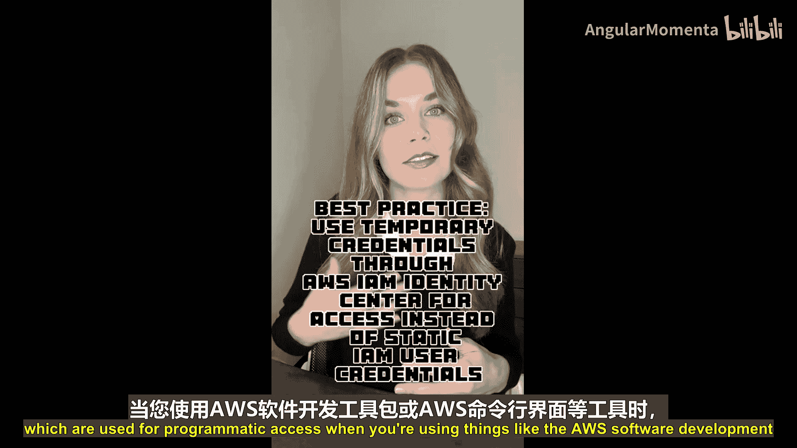

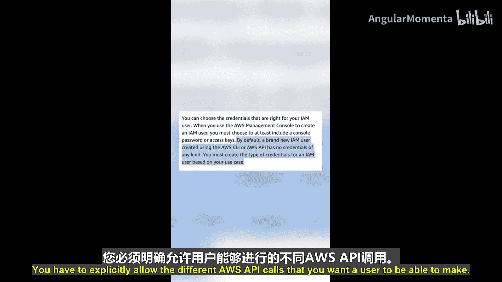

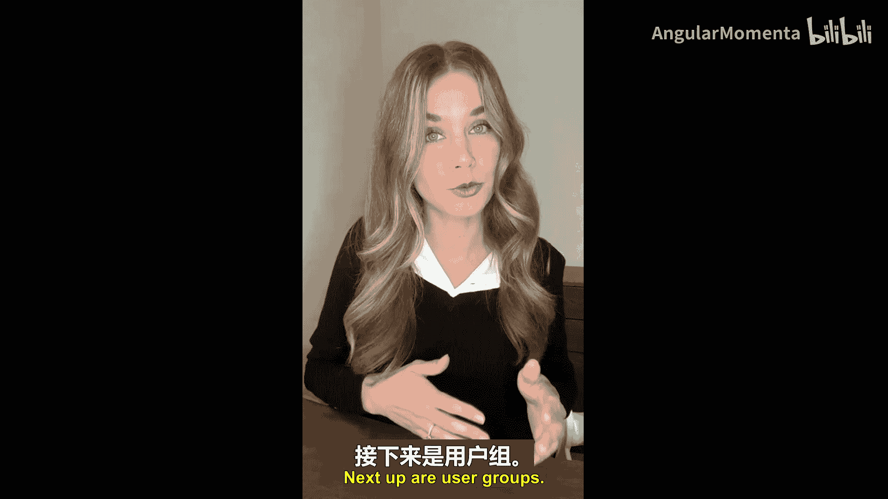

用户也可以关联AWS凭证，用于通过AWS软件开发工具包或AWS命令行界面进行编程访问。默认情况下，用户没有任何权限，您必须明确允许用户执行所需的AWS API调用。

### 用户组 👥

用户组是用户的集合。通过将具有相似角色或属于同一团队的用户分组，可以更轻松地管理权限。

### 权限与策略 📜

权限和策略控制着授权过程。权限规定了您可以在AWS资源上执行或禁止执行哪些AWS操作。您在策略对象中定义这些权限。

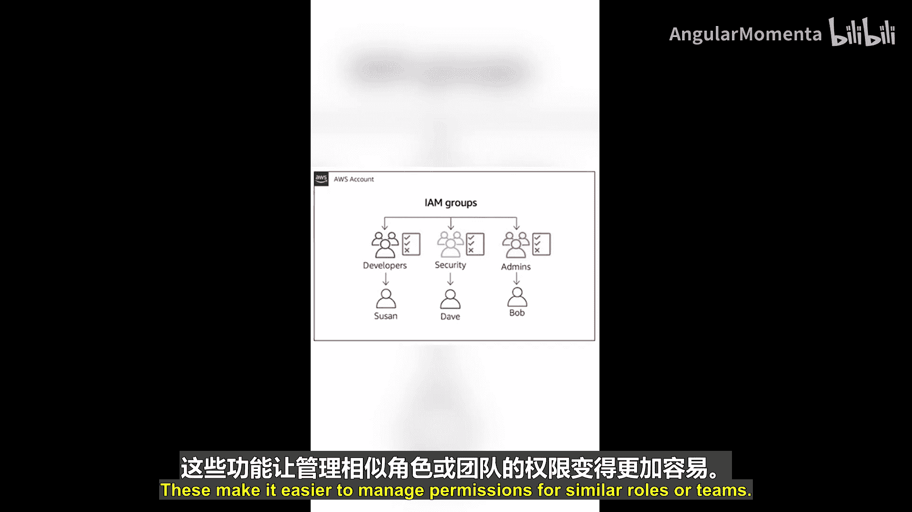

策略随后可以与用户、用户组、角色或AWS资源关联。这些策略可以非常精细，使您能够遵循**最小权限原则**，即只授予AWS身份执行其所需AWS操作的精确权限，不多不少。

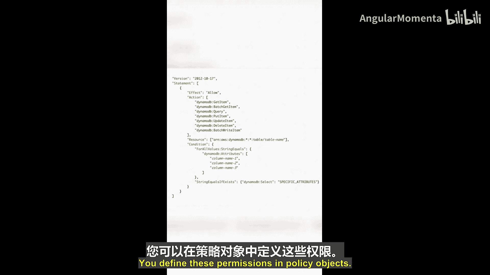

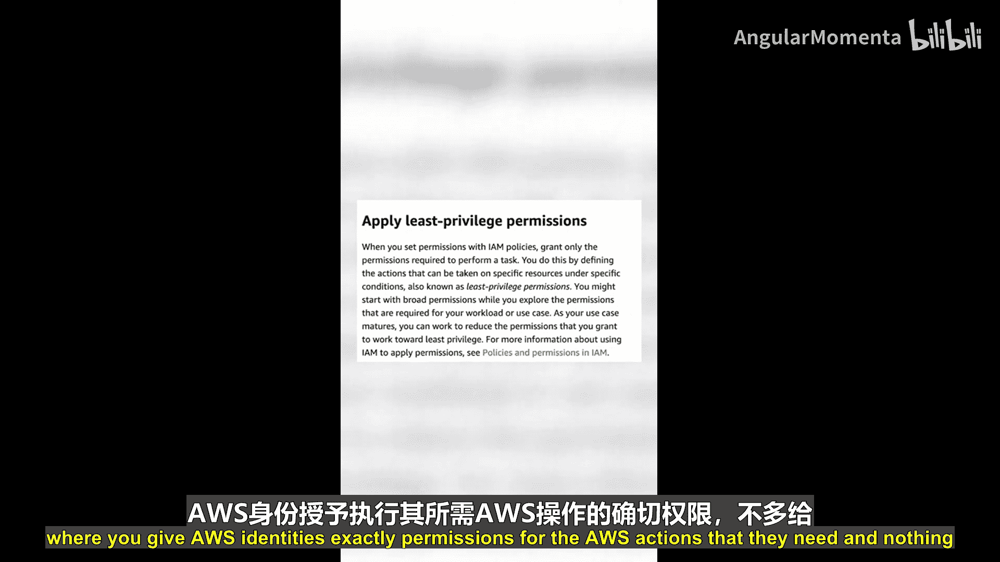

### 角色 🎭

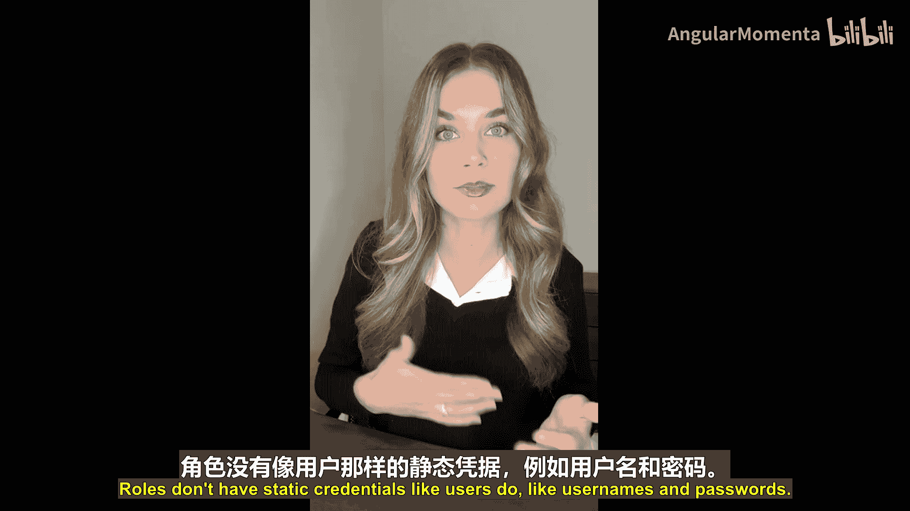

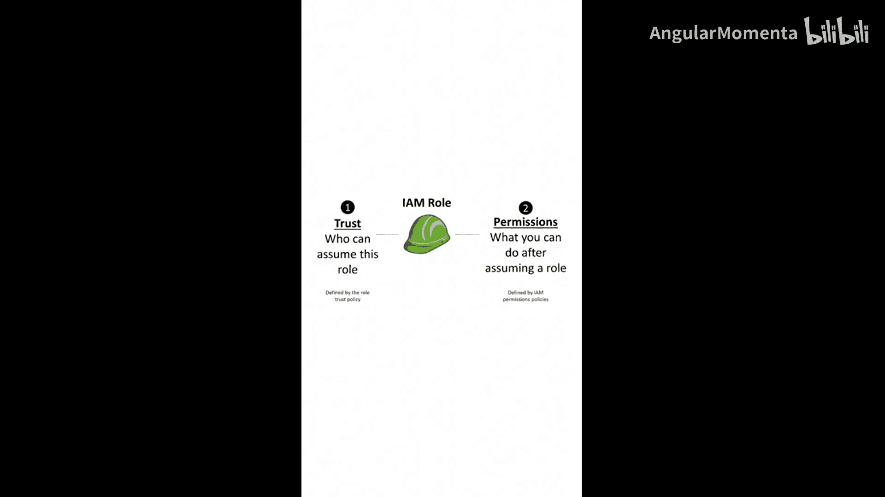

角色与用户类似，但有重要区别。角色不像用户那样拥有用户名和密码等静态凭证。相反，您需要使用`AssumeRole` API调用来“扮演”一个角色。

角色提供会过期和轮换的临时凭证。这在某些场景下非常有用，例如，一个运行在Amazon EC2上的应用程序需要访问Amazon DynamoDB表。您可以将一个IAM角色与EC2实例配置文件关联，然后应用程序就可以访问由该角色设置的临时凭证，从而获得访问DynamoDB的权限。

## 总结 📝

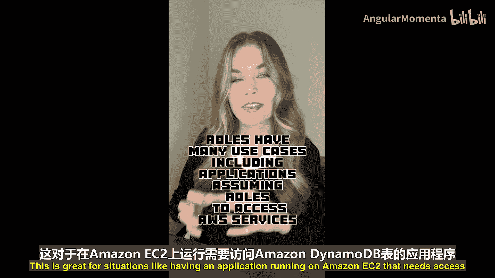

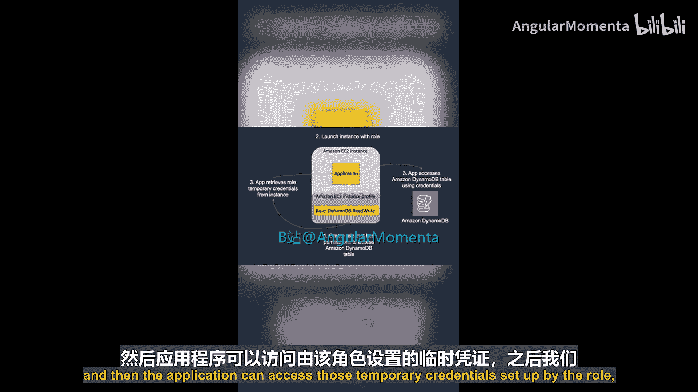

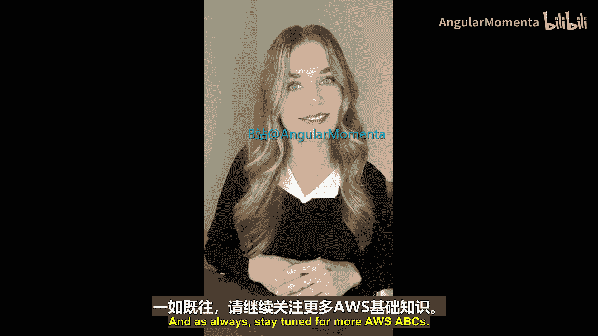

本节课中我们一起学习了AWS身份与访问管理服务。我们首先区分了**认证**（验证身份）和**授权**（授予权限）的概念。接着，我们探讨了IAM的核心组件：**用户**是拥有静态凭证的个体身份；**用户组**帮助批量管理用户权限；**权限**和**策略**是定义和控制访问规则的核心；而**角色**则提供临时凭证，适用于需要动态、短期访问权限的场景，如应用程序访问AWS服务。理解这些概念是安全、高效使用AWS云服务的基础。