# 010：J代表AWS Jam 🎮

在本节课中，我们将学习AWS培训与认证产品——AWS Jam。这是一个结合了学习与实践的平台，旨在通过挑战赛的形式帮助用户提升AWS技能。

欢迎回到AWS ABCs系列课程，我们按字母顺序介绍不同的AWS服务。今天的字母是“J”。不过，我们并非要介绍一项AWS服务，而是要介绍一个名为**AWS Jam**的AWS培训与认证产品。

## 什么是AWS Jam？🤔

AWS Jam是一个平台，你可以在此参与动手实践的AWS挑战。通过完成挑战来赚取积分，并与其他参与者竞争。所有的AWS Jam活动都在一个托管的AWS环境中完成，因此你无需拥有自己的AWS账户。

AWS Jam巧妙地将学习与游戏相结合，同时验证你的AWS技能。

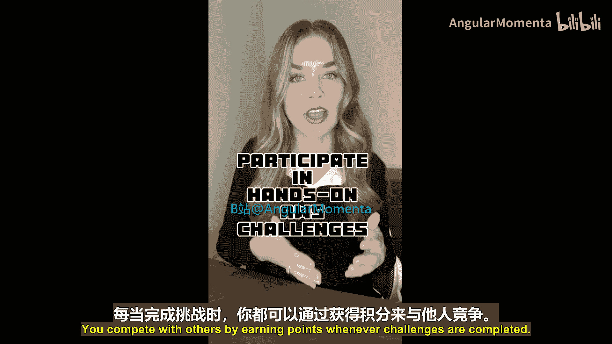

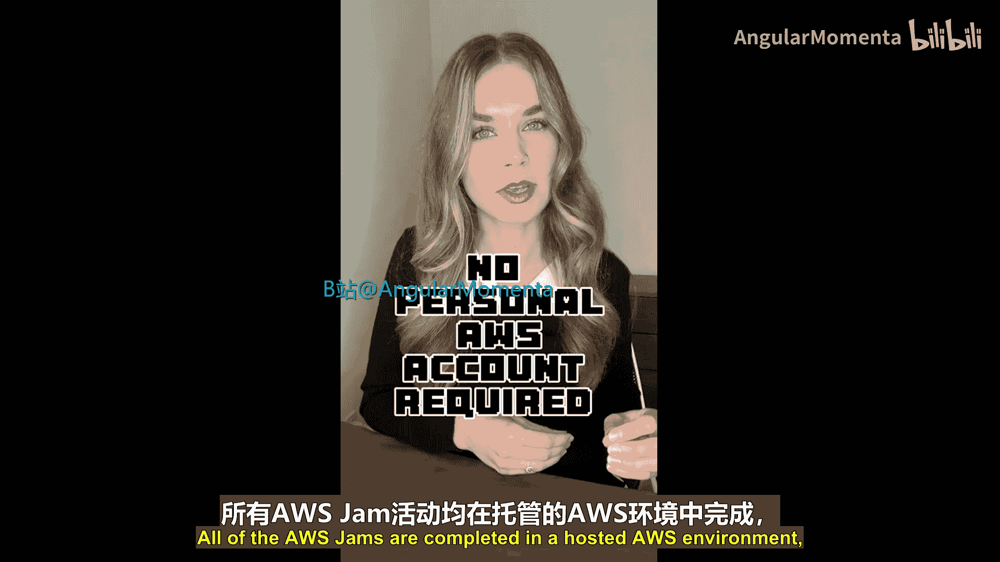

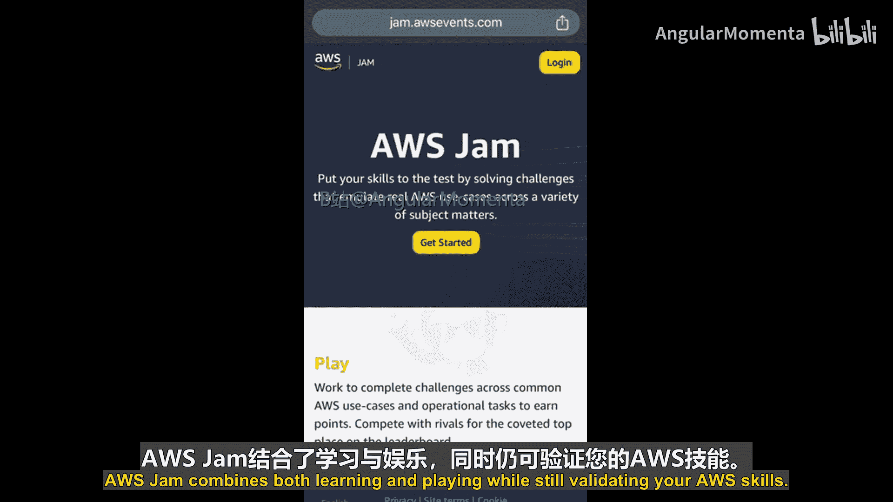

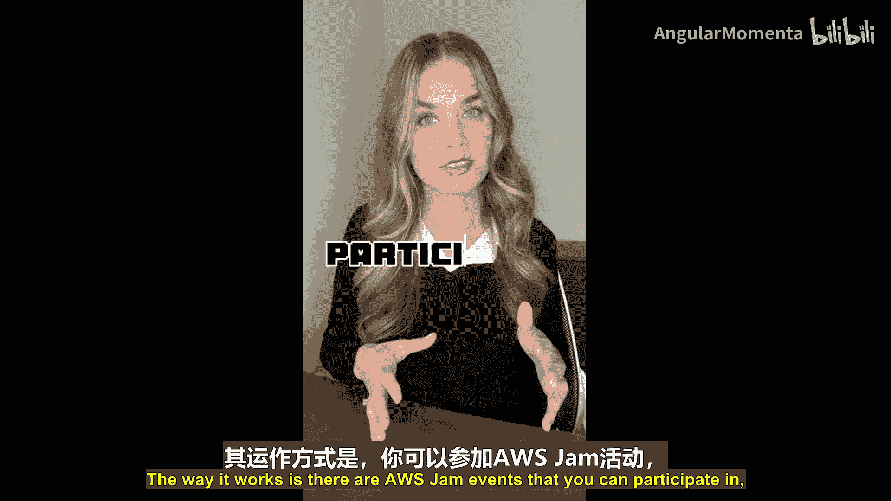

## AWS Jam如何运作？⚙️

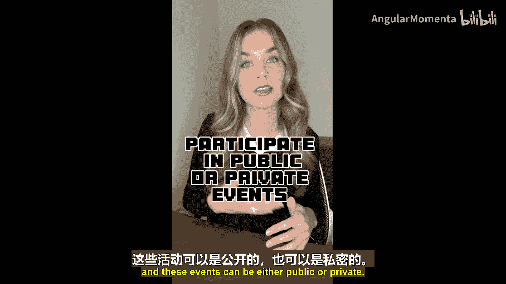

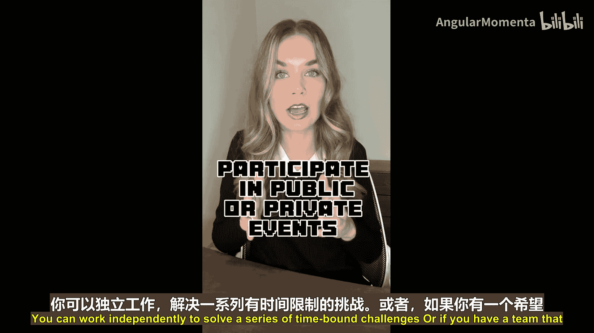

其运作方式围绕“AWS Jam活动”展开。以下是其核心特点：

*   **活动类型**：活动分为**公开活动**和**私有活动**。
*   **参与形式**：你可以独立解决一系列有时限的挑战。如果你的团队希望提升AWS技能，也可以为团队主办一场AWS Jam，以小组形式协作。
*   **核心体验**：在解决挑战的过程中相互竞争，同时学习和探索AWS。

这些挑战旨在教授与安全、DevOps、迁移、AI/ML等主题相关的AWS最佳实践。

## AWS Jam的独特之处 ✨

AWS Jam产品内置了验证逻辑，会在你完成任务的过程中进行验证，并根据完成情况为你或你的团队授予积分，争夺排行榜的榜首位置。

AWS Jam有一个非常酷的特点，使其不同于其他动手实验：它不提供逐步的操作指南。相反，它只给出一个挑战，然后由你自己去思考如何解决问题。这种方式能真正测试你的AWS知识，找出知识盲区，同时巩固你已经掌握的概念和想法。

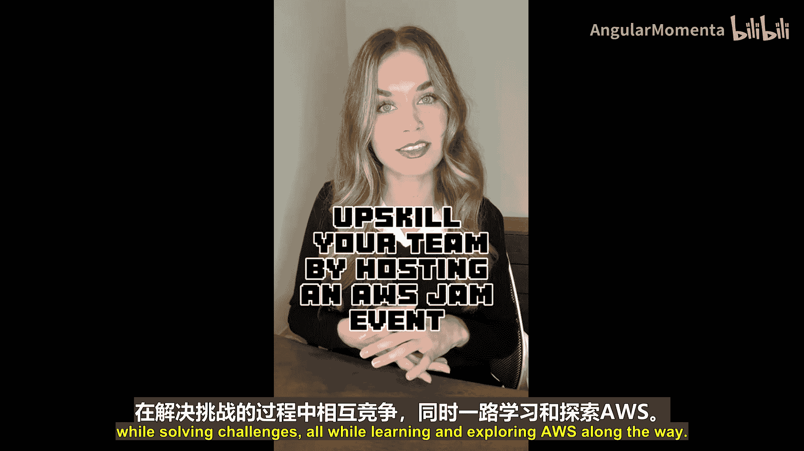

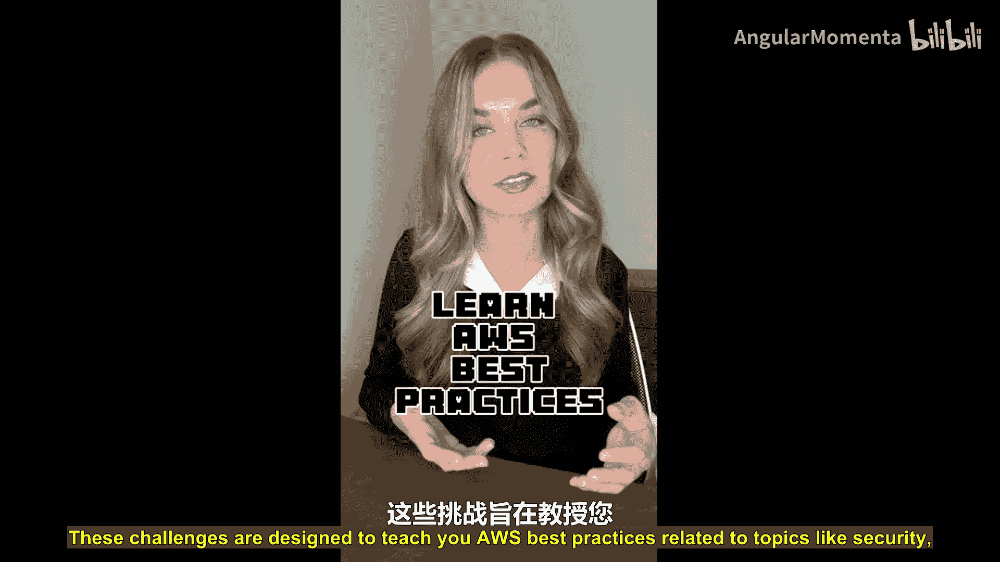

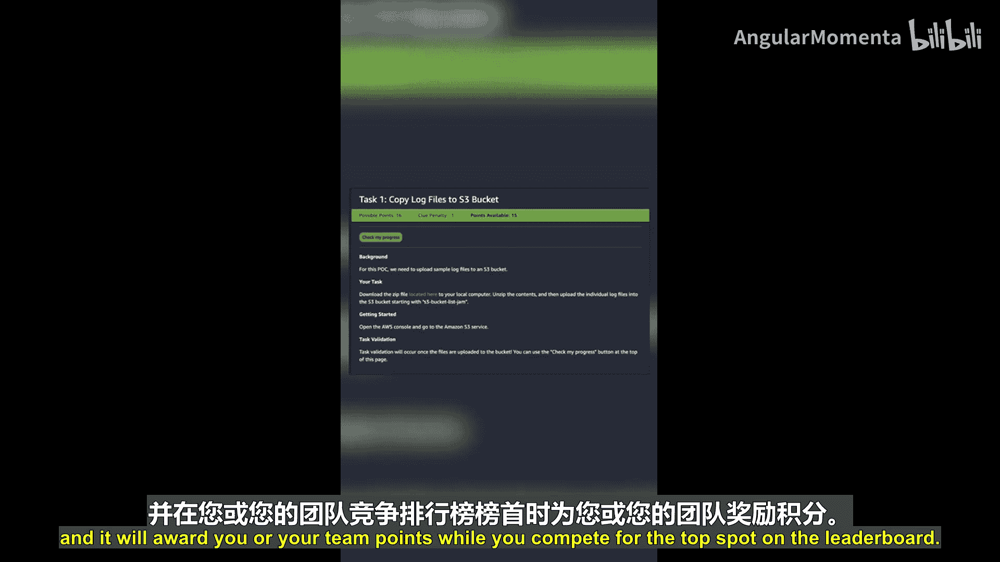

## 适合人群与获取帮助 👐

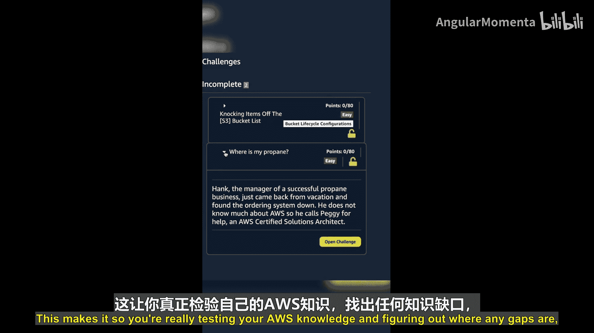

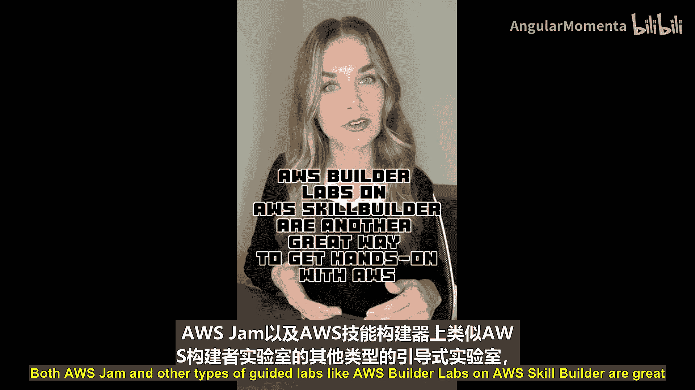

AWS Jam和AWS Skill Builder上的AWS Builder Labs等其他类型的指导实验，都是动手实践AWS服务的绝佳方式。AWS Jam的设计面向所有技术水平的个人。因此，如果你是AWS新手也无需担心，你仍然可以参与Jam。

以下是为你提供的支持：

*   平台内置了线索，可以在你需要时帮助你应对挑战。
*   现场也有AWS专家协助引导活动。
*   这些活动真正旨在促进自主探索和学习。

## 如何参与？🚀

如果你目前是AWS客户，并有意为你的团队主办一场AWS Jam活动，请联系你的AWS客户代表。

如果你个人希望参与下一次公开的AWS Jam活动，则需要订阅**AWS Skill Builder**。通过此订阅，你还可以访问各种其他有用的学习材料。请访问 `skillbuilder.aws` 以了解更多信息。

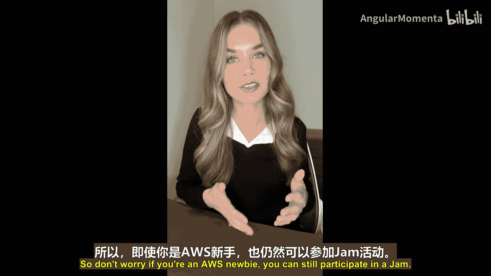

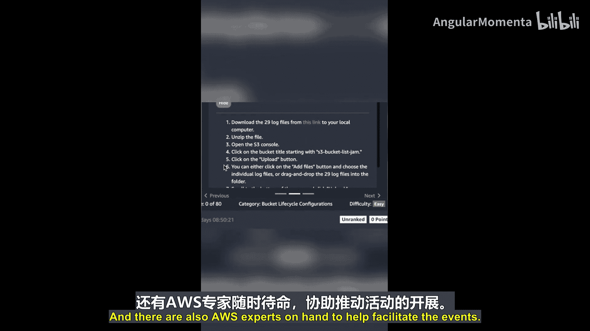

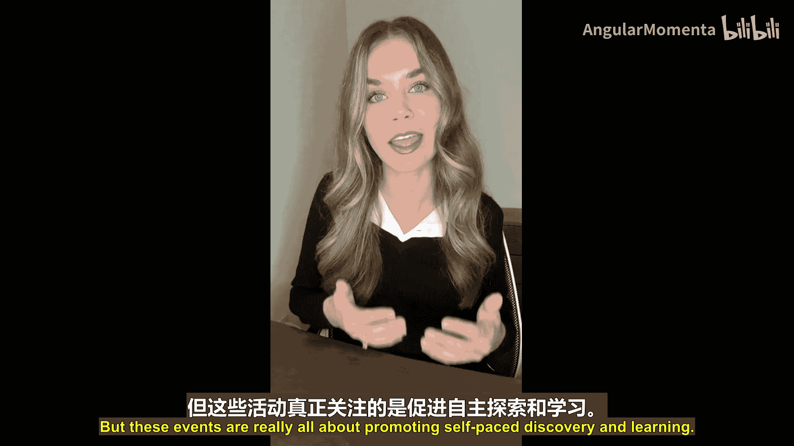

---

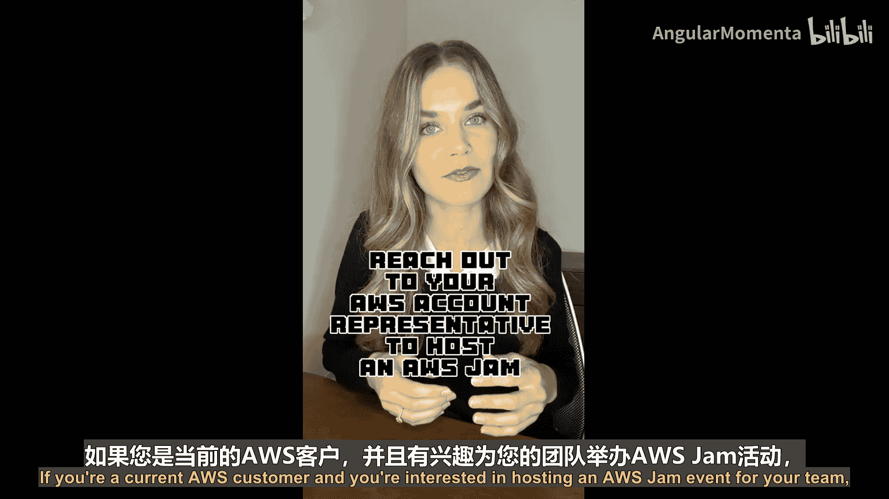

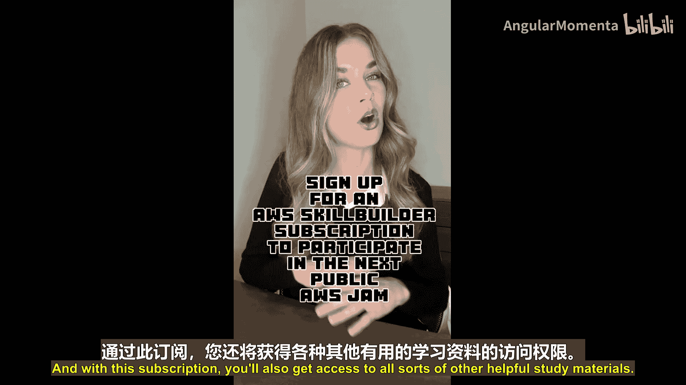

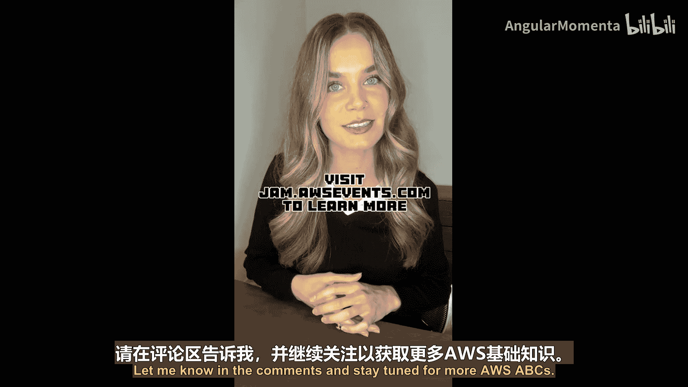

本节课我们一起学习了AWS Jam。这是一个通过游戏化挑战来实践和验证AWS技能的平台，适合所有水平的学习者参与。接下来我们将介绍字母“K”代表的服务，敬请期待更多AWS ABCs内容。