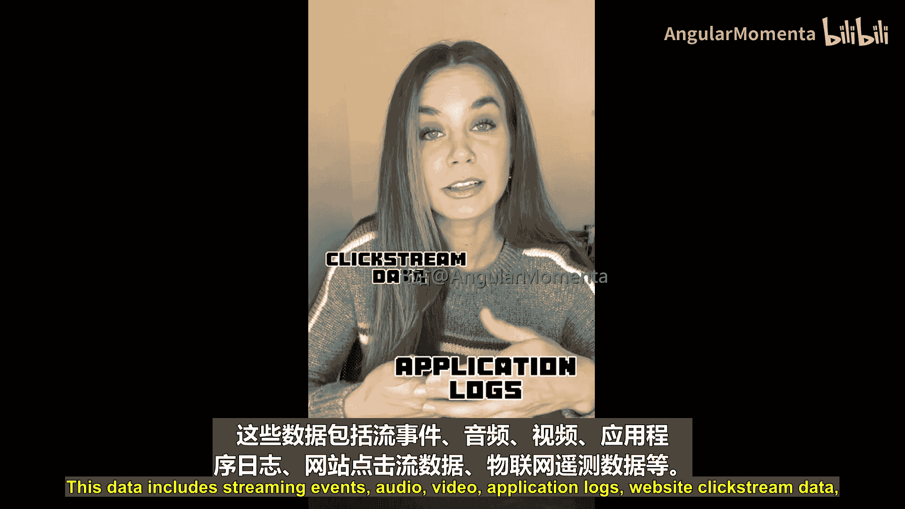
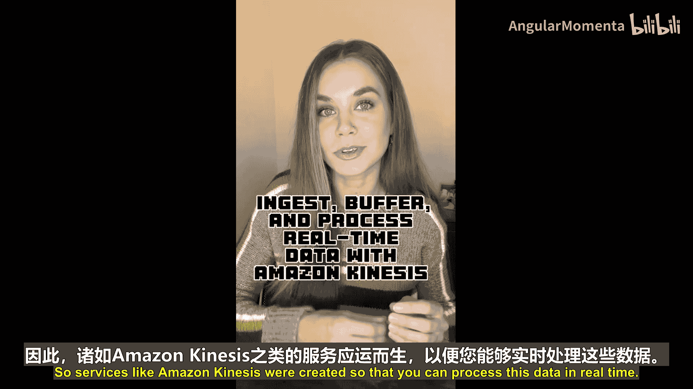
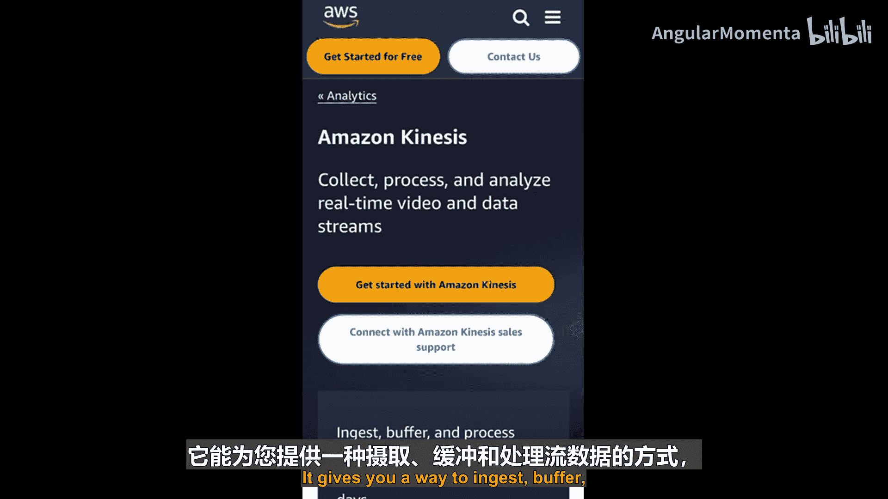
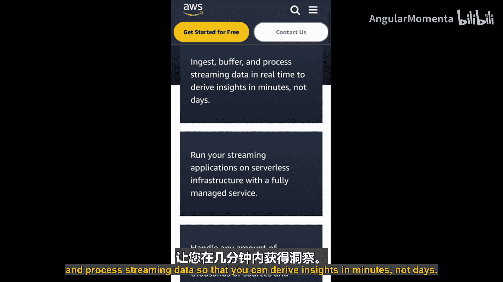
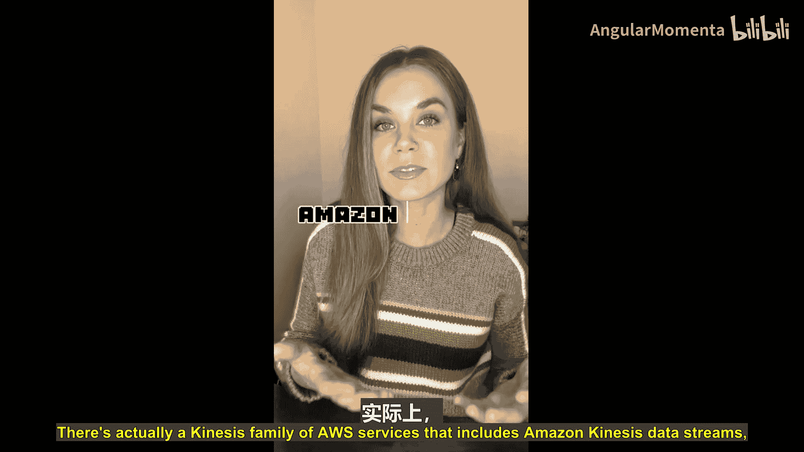
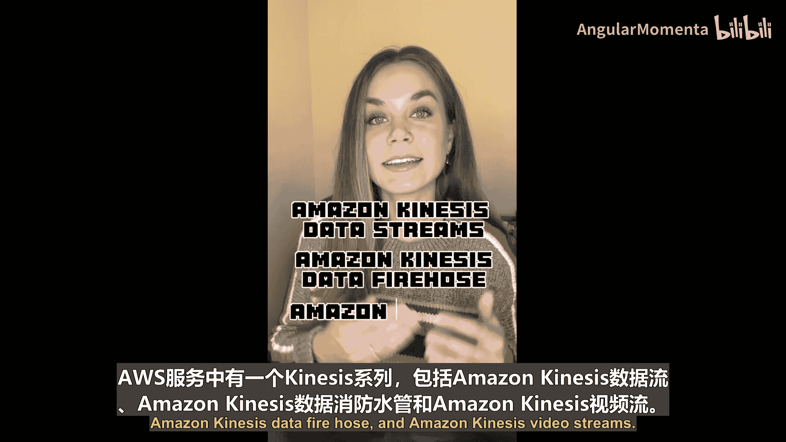
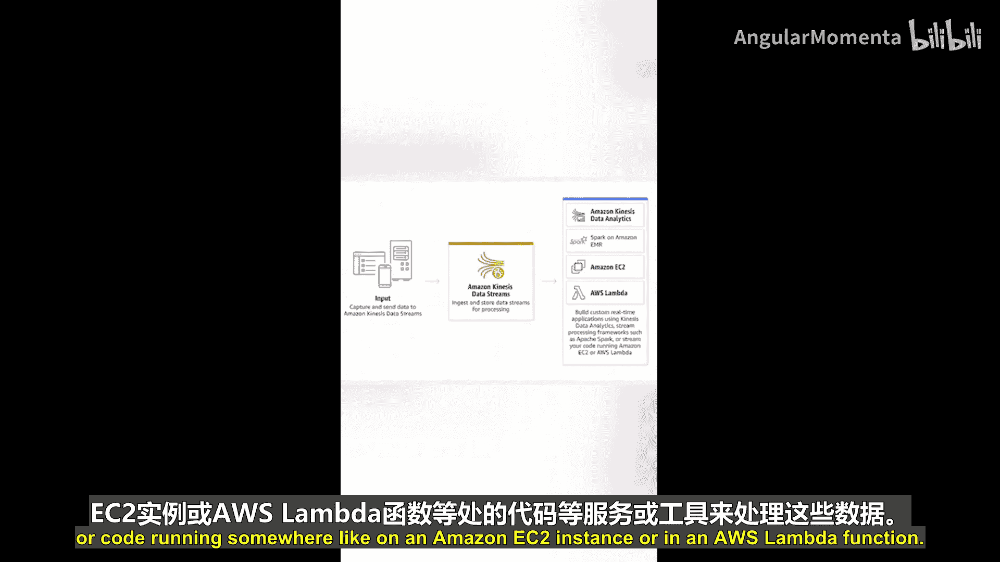
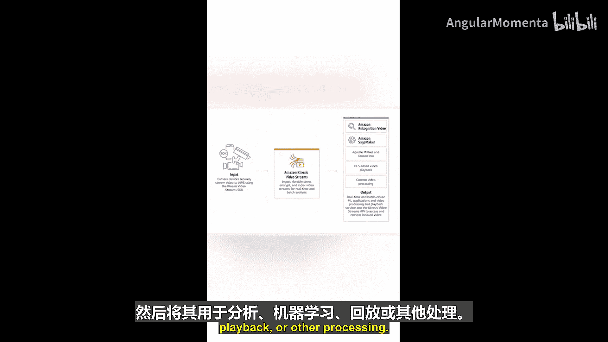
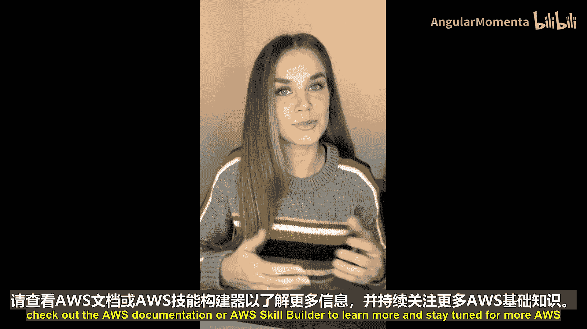

# 011：Amazon Kinesis 📡

在本节课中，我们将要学习AWS云服务家族中以字母“K”为代表的服务——Amazon Kinesis。我们将了解什么是流数据，以及Kinesis如何帮助您实时地摄取、缓冲和处理这些数据。

## 概述

在当今的数字时代，组织需要处理海量实时生成的数据。这些数据包括流事件、音频、视频、应用程序日志、网站点击流数据、物联网遥测数据等。数据正从四面八方源源不断地产生。流数据是由成千上万个数据源持续生成的数据，这些数据源同时发送记录，且数据量通常较小（以千字节计）。人们越来越需要在数据生成时进行实时处理，以便用于获取可操作的洞察、检测异常、做出实时决策，或用于数据分析和机器学习。传统的批处理解决方案通常无法有效处理这类数据。

因此，像Amazon Kinesis这样的服务应运而生，它让您能够实时处理这些数据。Amazon Kinesis的核心就是为您提供一种摄取、缓冲和处理流数据的方法，让您能在几分钟内而非几天后获得洞察。

## Kinesis服务家族

Amazon Kinesis并非单一服务，而是一个服务家族，主要包括以下三个成员：




*   **Amazon Kinesis Data Streams**
*   **Amazon Kinesis Data Firehose**
*   **Amazon Kinesis Video Streams**

接下来，我们将逐一了解这些服务。

### Amazon Kinesis Data Streams

上一节我们介绍了流数据处理的必要性，本节中我们来看看Kinesis Data Streams如何实现数据摄取。该服务让您能够更轻松地摄取和捕获流数据，以便使用其他服务或工具进行处理，例如Apache Spark、Apache Flink的托管服务，或运行在Amazon EC2实例、AWS Lambda函数中的自定义代码。

随着数据源的持续生成，新数据会不断被添加到数据流中。这意味着，当您的代码正在处理现有数据时，更多的新数据正源源不断地流入。这正是**实时处理**的体现。

以下是其核心工作流程的简化表示：
```
数据源（如日志、点击流） -> Kinesis Data Streams -> 处理应用（如Lambda, EC2, Flink） -> 结果（如数据库、分析工具）
```

### Amazon Kinesis Data Firehose



了解了Data Streams的实时处理能力后，我们来看看Kinesis Data Firehose。它同样是一个数据摄取服务，但其侧重点不同。







与Data Streams不同，Data Firehose在摄取流数据后，并不会立即进行复杂处理，而是将数据**持续地、自动地**输送到指定的存储和分析目的地，例如数据湖、数据存储和数据分析工具。它更侧重于数据的可靠传输和加载。






以下是其核心工作流程的简化表示：
```
数据源 -> Kinesis Data Firehose -> 存储/分析目的地（如Amazon S3, Redshift, Elasticsearch）
```

### Amazon Kinesis Video Streams

最后，我们来看Kinesis家族中专门处理视频数据的成员——Kinesis Video Streams。

您可以使用此服务，更轻松、安全地从使用Kinesis Video Streams SDK的摄像设备流式传输视频数据到AWS。传输到云端后，这些视频数据可以用于分析、机器学习、回放或其他处理。处理可以是实时的，也可以是批量的。

以下是其核心工作流程的简化表示：
```
摄像设备（使用Kinesis Video SDK） -> Kinesis Video Streams -> 处理服务（如Rekognition, Lambda） -> 分析结果/存储
```

## 总结

本节课中，我们一起学习了Amazon Kinesis服务家族。我们了解到，Kinesis Data Streams用于实时摄取和处理流数据；Kinesis Data Firehose用于将流数据自动传输到存储和分析目的地；而Kinesis Video Streams则专门用于安全地摄取和处理来自摄像设备的视频流。这些服务共同为处理现代应用程序产生的海量实时数据提供了强大而灵活的解决方案。





如想了解更多，请查阅AWS官方文档或AWS Skill Builder学习平台。请继续关注更多AWS ABCs课程内容。