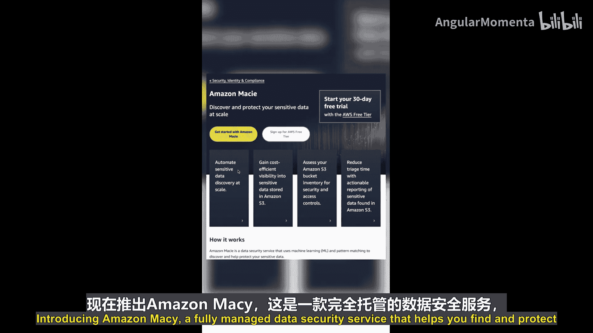
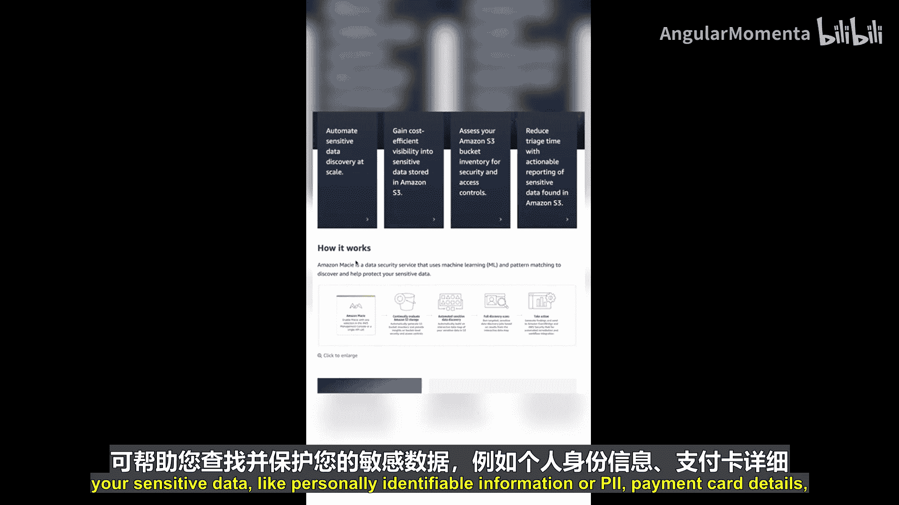
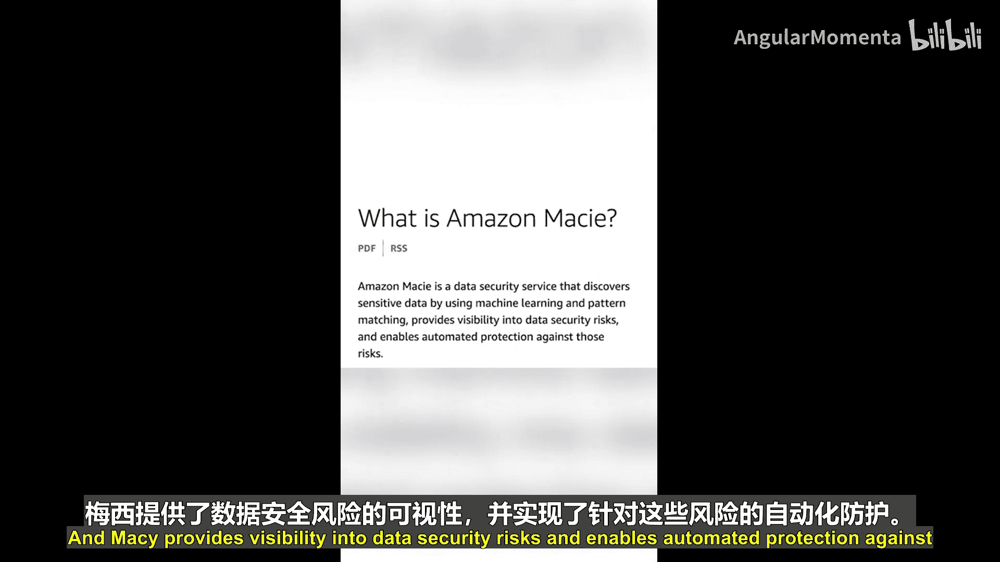
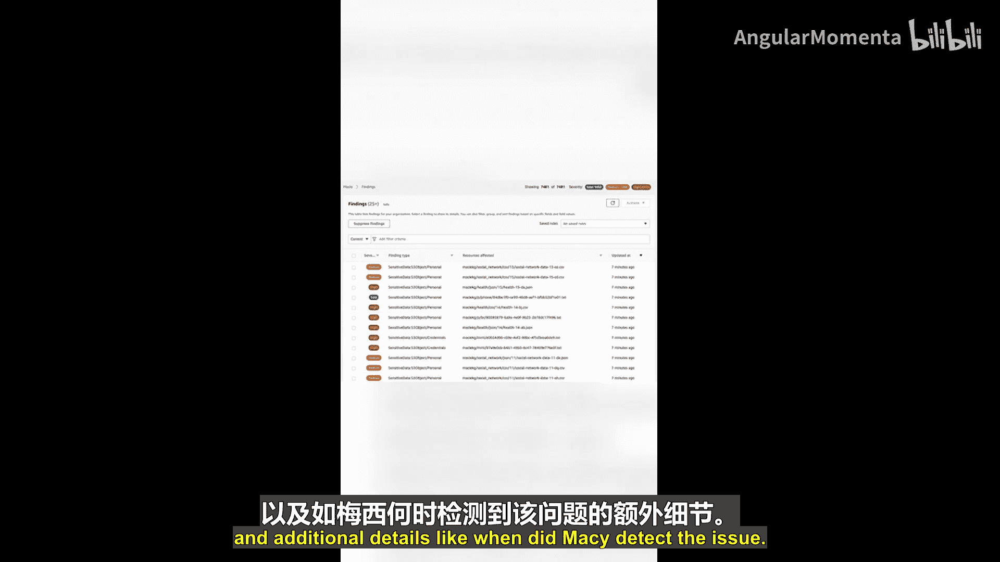
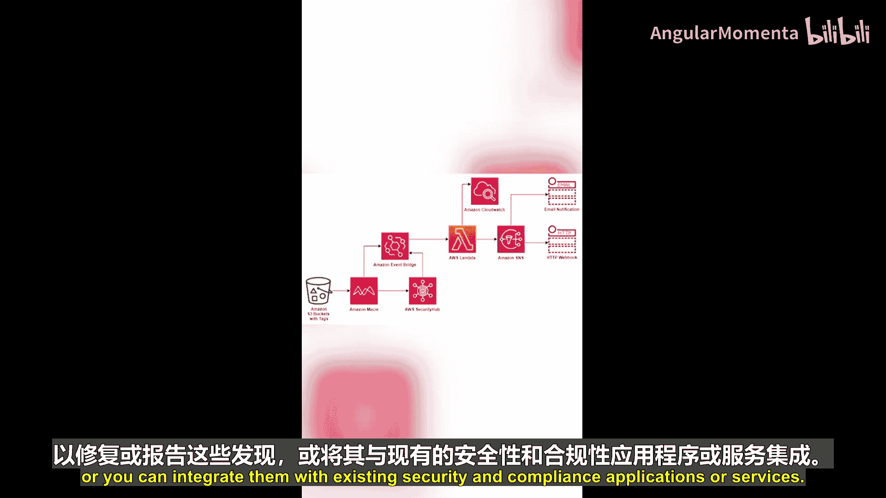
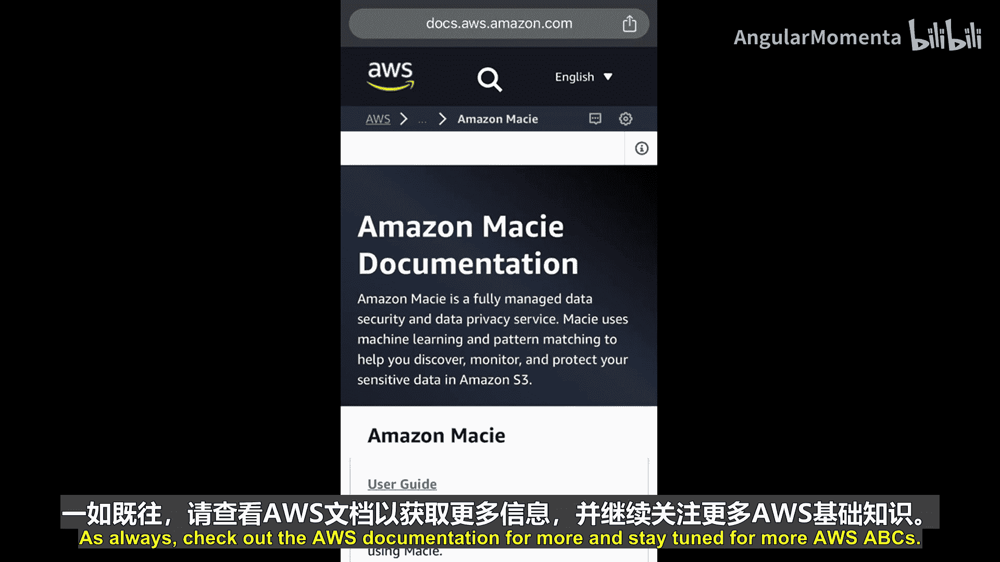

AWS云基础：P13：M代表Amazon Macie 🔍

在本节课中，我们将学习AWS服务Amazon Macie。这是一个完全托管的**数据安全服务**，它能帮助您发现和保护存储在Amazon S3中的敏感数据。

---

当今世界，组织管理着难以想象的海量数据。在使用AWS时，通常会将数据存储在Amazon S3中。这些数据中，有些可能具有敏感性，有些则没有。不同类型的数据可能需要遵循不同的安全与合规规则。

那么，当您有大量数据存储在成千上万个Amazon S3存储桶中，并且跨越AWS组织内的多个账户时，如何知道哪些存储桶包含敏感数据，哪些不包含？或者，如何知道哪些存储桶是安全的，哪些不安全？

为了解决这个问题，我们引入Amazon Macie。

### 什么是Amazon Macie？

Amazon Macie是一项完全托管的**数据安全服务**，它利用**机器学习**和**模式匹配**技术，帮助您发现和保护敏感数据，例如：
*   **个人身份信息**
*   **支付卡详情**
*   **AWS凭证**

当您启用Macie后，它会自动开始扫描您的存储桶以发现敏感数据。

### Macie的核心功能

上一节我们介绍了Macie的基本概念，本节中我们来看看它的具体功能。

Macie主要提供以下三项核心功能：

1.  **自动发现与分类**
    Macie会自动对您Amazon S3存储桶中的数据进行分类。它会提供一个S3存储桶的清单，并持续监控和评估这些存储桶的安全性与访问控制设置，以检测敏感数据。

2.  **灵活的分类标准**
    您可以使用Macie提供的**内置标准**和机制来识别敏感数据。同时，您也可以使用**正则表达式**创建自己的**自定义标准**。或者，结合使用这两种方式。

3.  **风险识别与告警**
    如果Macie检测到数据安全或隐私存在潜在问题（例如，某个S3存储桶意外变为公开访问），它会创建一个**发现项**供您审查和处理。

### 理解“发现项”

Macie会创建多种类型的发现项。每个发现项都包含以下信息：
*   **严重性评级**
*   **受影响资源的信息**
*   **其他详细信息**（例如问题被检测到的时间）

这些发现项会被发布到以下位置：
*   **Macie控制台**
*   **AWS Security Hub**
*   **Amazon EventBridge**

这种发布机制非常有用，因为它允许您：
*   创建自动化系统来修复或报告这些发现。
*   将它们与现有的安全及合规应用程序或服务集成。

---

本节课中，我们一起学习了Amazon Macie。它是一个强大的工具，通过**机器学习**自动发现Amazon S3中的敏感数据，评估安全风险，并通过**发现项**机制提供可见性和自动化修复的途径，帮助您更好地管理和保护云端数据。

要了解更多信息，请随时查阅AWS官方文档。请继续关注AWS ABCs系列的其他内容。