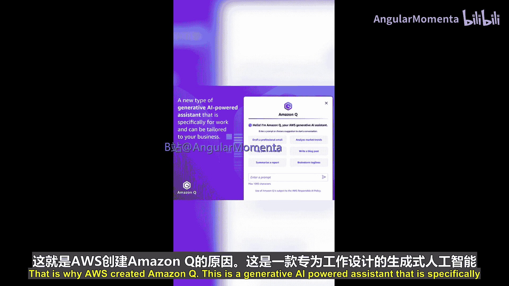
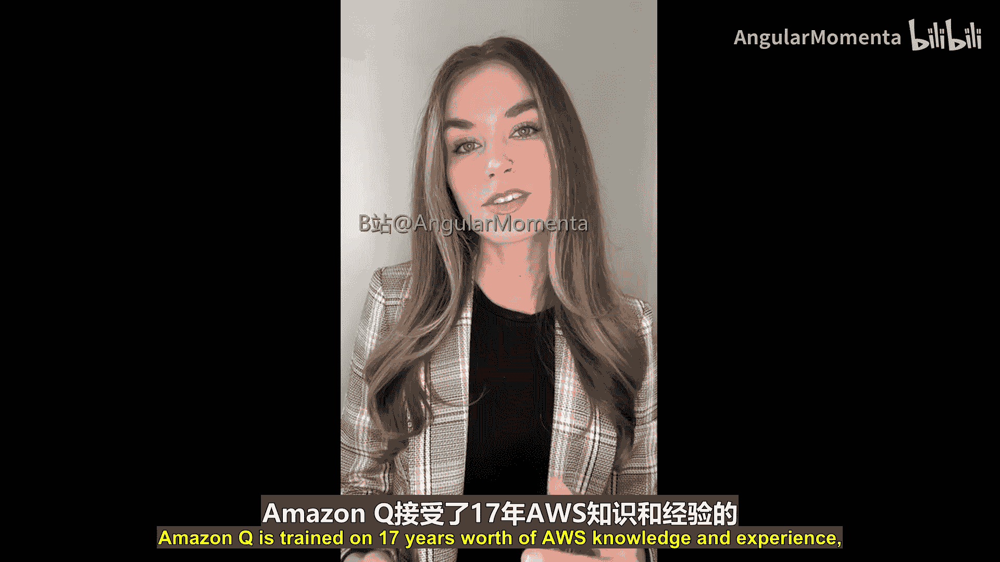
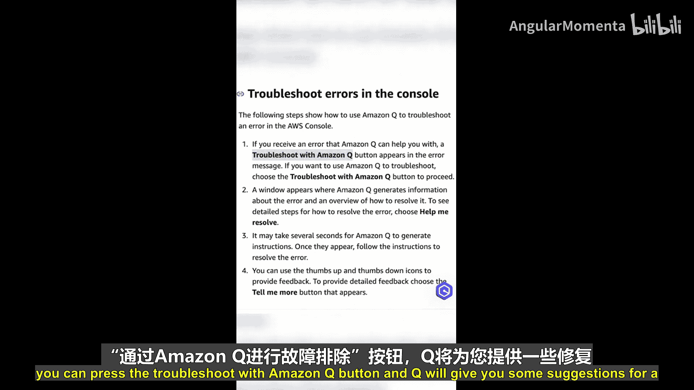
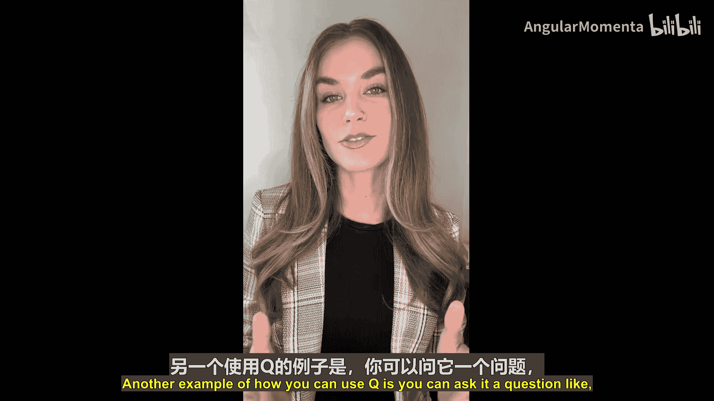
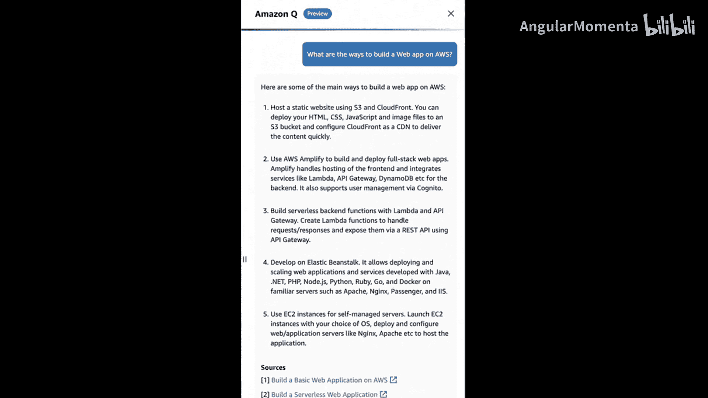
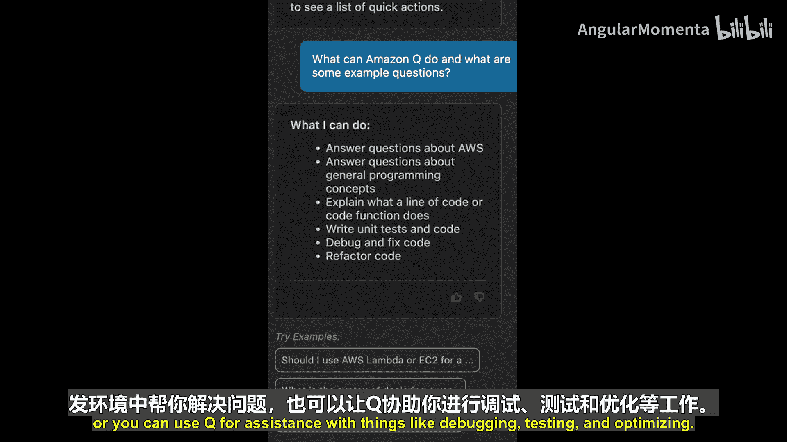
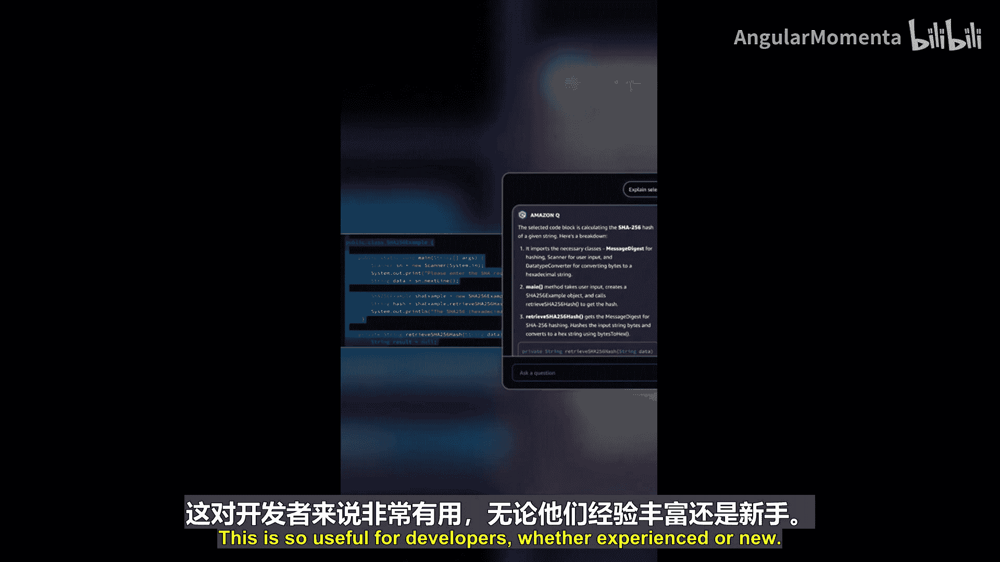
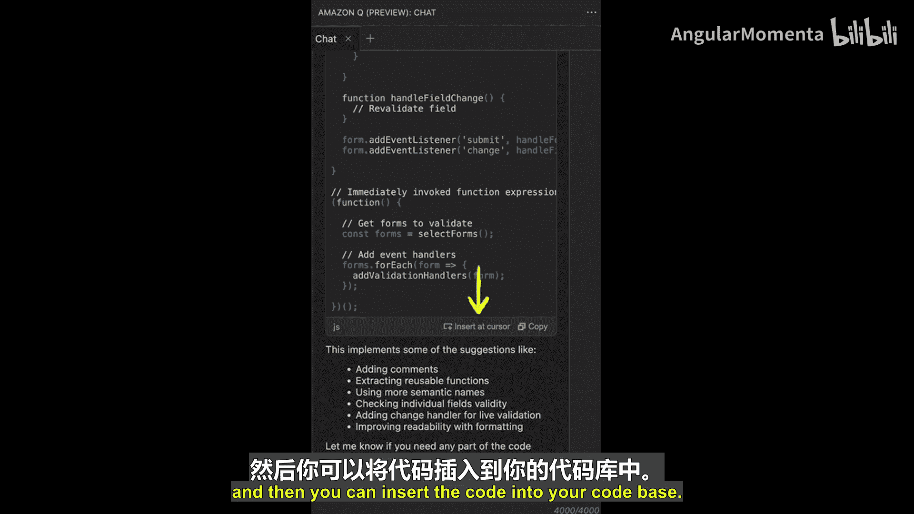
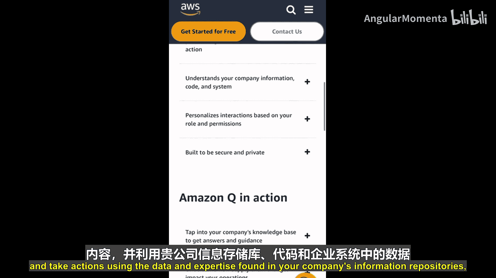

# 017：Q代表Amazon Q 🤖

在本节课中，我们将要学习AWS云服务系列中的字母“Q”所代表的服务——**Amazon Q**。这是一个专为工作场景设计的生成式AI助手，能够根据您的业务数据进行定制，帮助解决各种问题。

通用AI聊天应用虽然强大，但如果它不了解您的公司、数据、客户或业务，其帮助作用就会受限。为此，AWS创建了Amazon Q。这是一个由生成式AI驱动的助手，专为工作设计，并可针对您的业务进行定制。

Amazon Q基于AWS长达17年的知识和经验进行训练，能够帮助您完成多种任务。

以下是Amazon Q的一些核心功能：
*   **问题排查与诊断**：帮助您解决使用AWS时遇到的问题。
*   **架构与最佳实践指导**：引导您了解常见的AWS架构和最佳实践。
*   **服务对比**：针对特定用例，帮助您比较和对比不同的AWS服务。
*   **快速解答**：为您提供快速且相关的AWS问题答案。

---

上一节我们介绍了Amazon Q的基本概念，本节中我们来看看如何访问和使用它。

您可以在多个位置找到Amazon Q的界面，包括：
*   AWS管理控制台
*   AWS官方文档
*   您的集成开发环境（通过Amazon CodeWhisperer）
*   其他聊天应用，例如Slack

当您在AWS管理控制台中遇到问题时，例如EC2权限错误或S3配置错误，可以点击“使用Amazon Q进行故障排除”按钮，Q会为您提供一些修复建议。

另一个使用示例是，您可以向Q提问：“如何在AWS上构建Web应用程序？”。随后，Q会回复一些建议以及在AWS上构建和托管Web应用的常见方法供您探索。Q还会在底部提供文档和资源的链接，方便您进一步阅读。

---

对于开发者而言，Amazon Q在IDE中的集成是一个非常实用的功能。接下来，我们专门探讨一下这个特性。

当您在IDE中使用Amazon Q时，您可以就您的代码与Q进行对话。

以下是Q在IDE中的主要用途：
*   **代码建议与改进**：向Q寻求编码建议或改进方案。
*   **问题解决**：让Q直接在您的IDE中帮助您解决问题。
*   **调试、测试与优化**：使用Q协助进行代码调试、测试和性能优化。

IDE中一个令人喜爱的功能是，您可以选中一段代码，然后要求Q解释这段代码的作用。这对于开发者，无论是经验丰富还是新手，都非常有用。您还可以要求Q根据对话内容为您生成代码，并将其插入到您的代码库中。

可以肯定的是，我将在未来的编码项目中使用Amazon Q和Amazon CodeWhisperer。它可以帮助您改进代码、提高生产力，并让您更深入地理解代码的具体行为。

---

本节课中我们一起学习了Amazon Q。总而言之，Amazon Q能够帮助您快速获得相关问题的答案，利用您公司信息库和数据中的专业知识来解决问题、生成内容并执行操作。

目前，Amazon Q仍处于预览阶段，请持续关注AWS的最新动态以了解其后续发展。这远非Amazon Q全部功能的完整介绍，请务必查阅AWS官方文档以了解更多信息。

请继续关注更多AWS云基础课程。