AWS云基础：P18：R代表Amazon RDS 🗄️

在本节课中，我们将要学习AWS云基础系列中的字母“R”，它代表Amazon关系型数据库服务（Amazon RDS）。我们将了解什么是RDS，它的核心优势，以及如何配置和使用它。

---

### 什么是Amazon RDS？

Amazon RDS是一项托管的**关系型数据库服务**。它简化了在AWS上创建和运行关系型数据库的过程。

要创建一个RDS数据库，你需要为你的数据库实例提供所需的配置。这些配置包括：
*   **数据库引擎类型**：例如MySQL、PostgreSQL等。
*   **数据库实例类型**：决定计算和内存能力。
*   **网络配置**：例如VPC和子网。
*   **其他管理设置**：例如备份、补丁和维护窗口。

RDS会接收所有这些配置信息，并为你创建底层的基础设施，安装好你选择的数据库引擎。这使你无需自行创建和管理基础设施，从而可以将更多时间专注于优化数据库的使用方式。

---

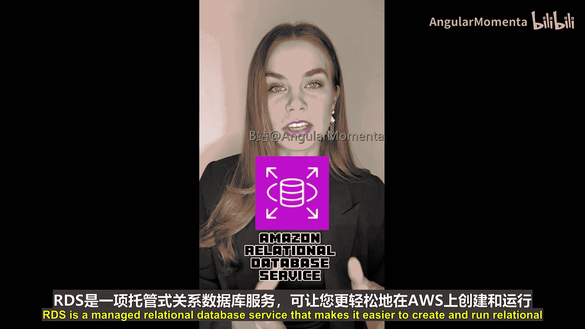

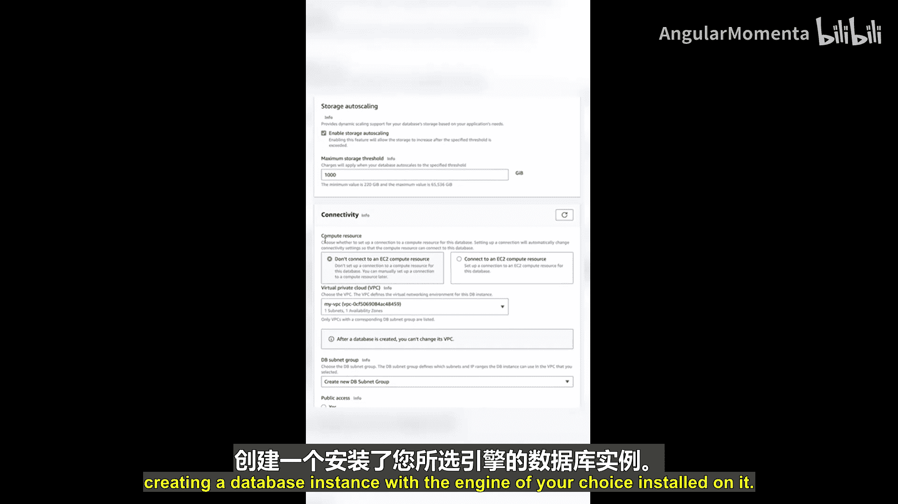

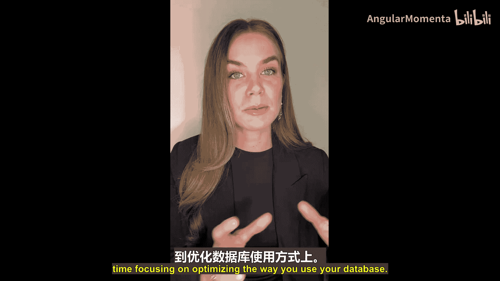

### 连接与使用数据库

数据库创建完成后，你可以通过以下方式连接它：
*   使用**连接字符串**通过应用程序连接。
*   使用**数据库工具**（如MySQL Workbench）连接。

连接成功后，你就可以开始加载数据库**模式（Schema）**、导入数据以及运行查询。

---

### 支持的数据库引擎

Amazon RDS支持多种流行的数据库引擎，包括：
*   MySQL
*   MariaDB
*   PostgreSQL
*   Oracle
*   Microsoft SQL Server
*   Db2

此外，还有**Amazon Aurora**。Aurora与MySQL和PostgreSQL完全兼容，旨在以十分之一的成本提供商业级数据库的可用性和性能。

---

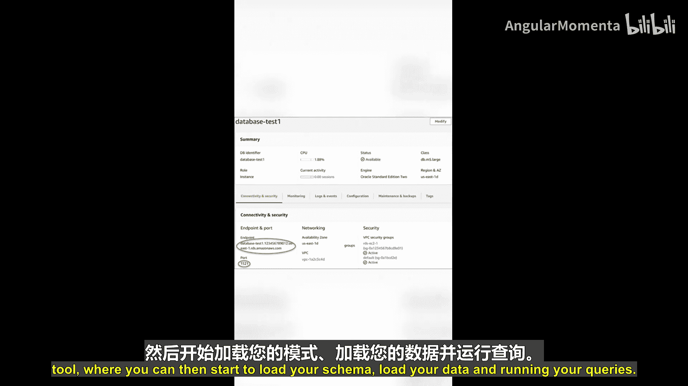

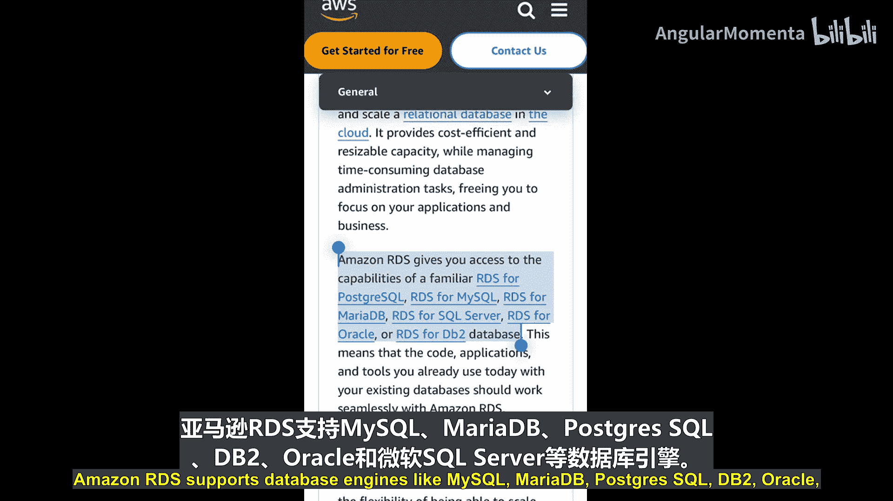

### RDS的管理优势

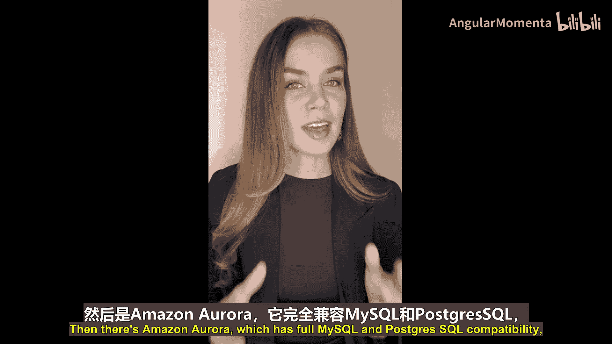

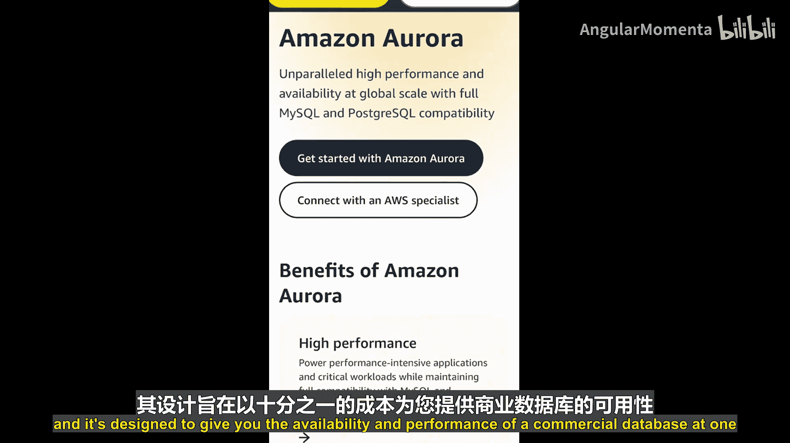

Amazon RDS降低了在AWS上运行关系型数据库的管理负担，因为它可以处理一些无差别的管理任务，例如：
*   配置底层基础设施
*   执行计划的维护作业
*   进行数据库备份
*   应用安全补丁

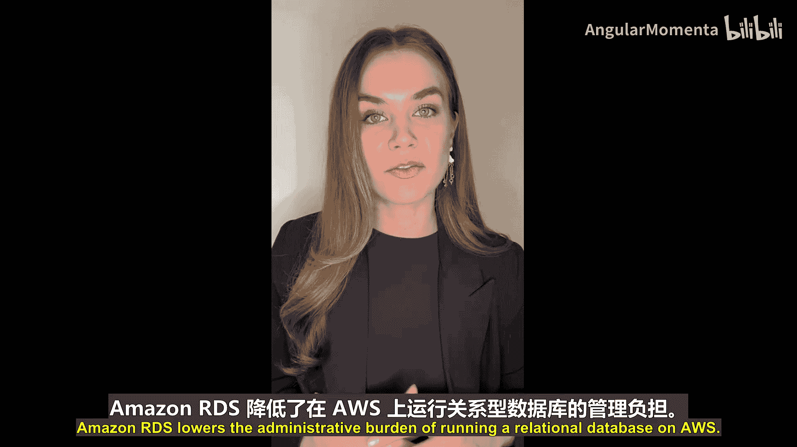

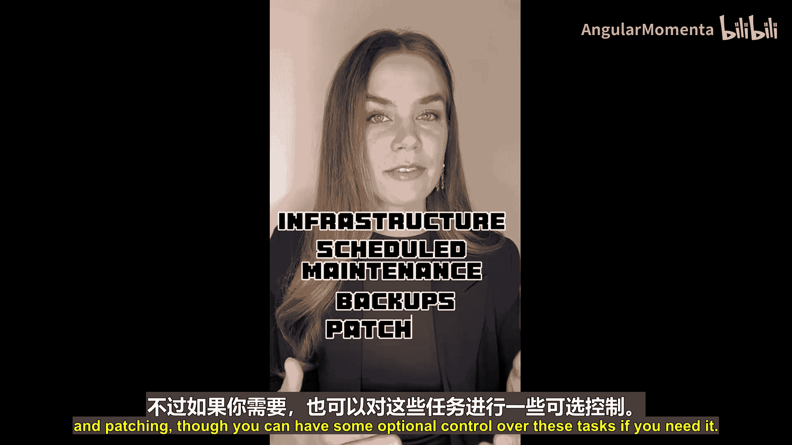

当然，如果你有需要，也可以对这些任务保留一定的可选控制权。

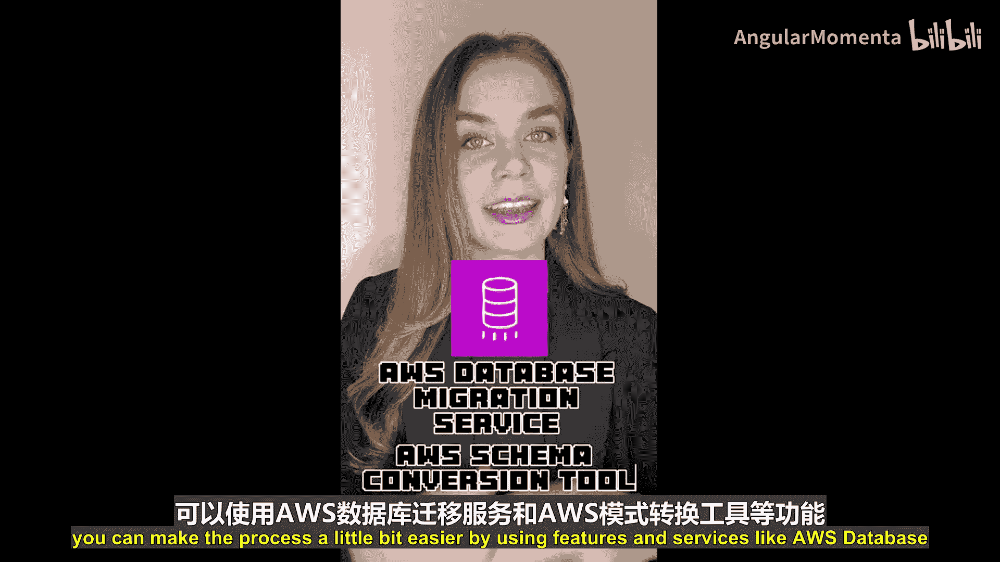

---

### 数据库迁移

如果你计划迁移到Amazon RDS，可以使用以下功能和服务来简化流程：
*   **AWS数据库迁移服务（DMS）**：使用DMS，你可以在几乎不停机且不丢失数据的情况下，将数据库和分析工作负载迁移或复制到AWS。
*   **AWS模式转换工具**：此工具可以帮助你将数据库模式从一种引擎转换为另一种引擎。

---

### 网络与高可用性配置

上一节我们介绍了RDS的基本创建和管理，本节中我们来看看如何配置网络和高可用性。

**网络配置**
创建数据库实例时，必须选择将其放置在哪个网络中。这包括：
1.  选择要使用的**VPC（虚拟私有云）**。
2.  选择要将数据库实例放入的**子网**。
3.  使用**安全组**和**网络ACL**来控制哪些网络流量可以访问你的实例。

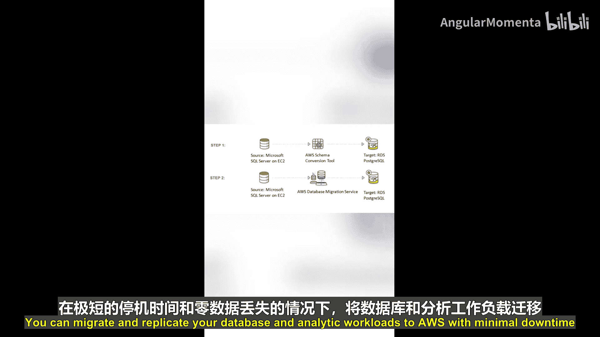

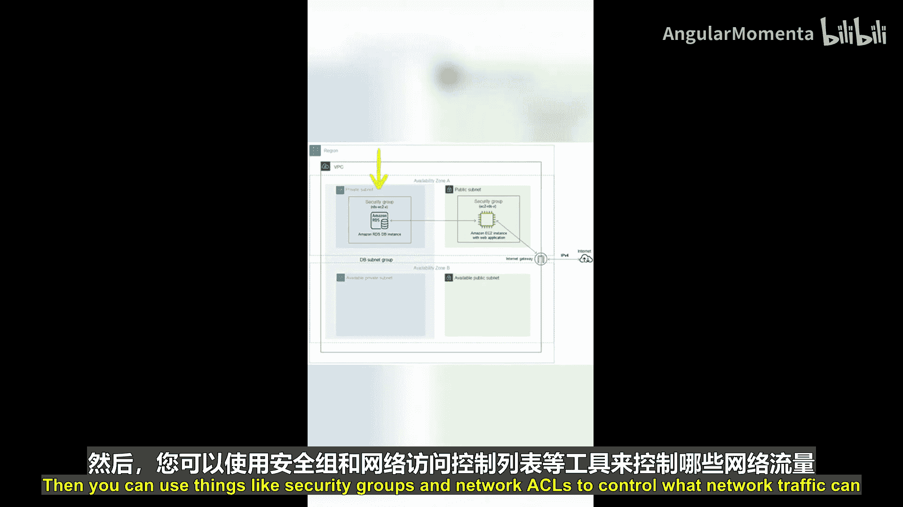

一个数据库实例位于一个可用区的一个子网中。为了提高对潜在故障的恢复能力，你应该考虑使用RDS的**多可用区（Multi-AZ）部署**。

**高可用性：Multi-AZ部署**
在RDS Multi-AZ部署中：
*   你有一个位于一个可用区（AZ）的**主实例**。
*   在另一个不同的可用区中，会有一个**备用实例**。
*   这两个实例之间的数据复制由RDS自动管理。

你的应用程序通过一个**单一的DNS端点**连接到数据库。如果检测到故障，RDS会在后台自动故障转移到备用实例，而你的应用程序仍然可以使用相同的DNS端点进行连接，从而实现高可用性。

你还可以进行**多副本（Read Replicas）部署**，其中可以拥有最多两个可读的备用实例，用于扩展读取性能。

---

### 总结

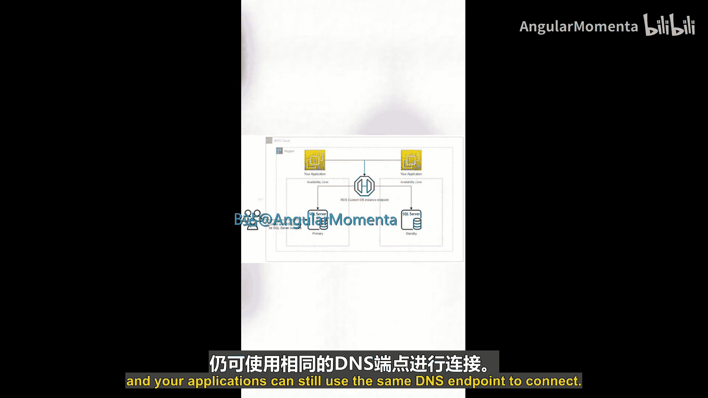

本节课中我们一起学习了Amazon RDS的核心概念。我们了解到RDS是一项托管的数据库服务，它支持多种引擎，并能自动处理基础设施、备份、补丁等任务，从而减轻管理负担。我们还探讨了如何配置网络、使用Multi-AZ部署实现高可用性，以及借助DMS进行数据库迁移。掌握RDS能让你更高效地在云上运行关系型数据库。