# 019：Amazon S3 🗂️

在本节课中，我们将要学习AWS云基础系列中字母“S”所代表的服务：**Amazon S3**。Amazon S3是一个海量可扩展的对象存储服务，拥有极其广泛的应用场景。

## 概述

上一节我们介绍了其他AWS服务，本节中我们来看看**Amazon S3**。S3是AWS提供的一种对象存储服务，它设计用于存储和检索任意数量的数据，适用于从网站托管到大数据分析的多种场景。

## 核心概念与用途

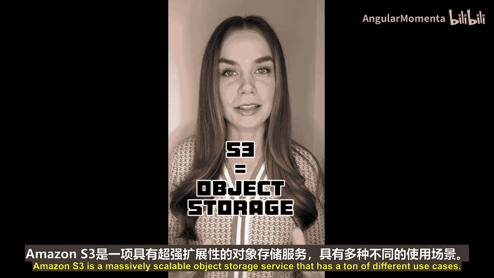

Amazon S3的核心是一个**对象存储**系统。这意味着你可以将任何类型的文件作为“对象”存储在其中。以下是S3的一些主要用途：

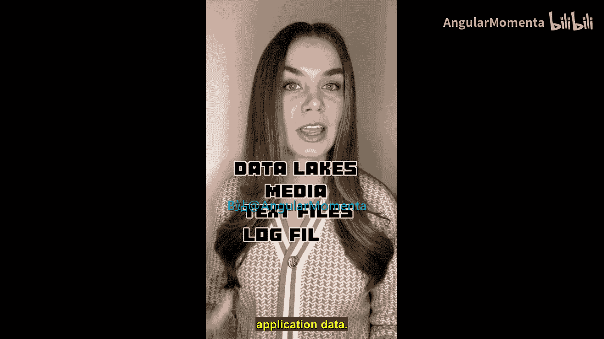

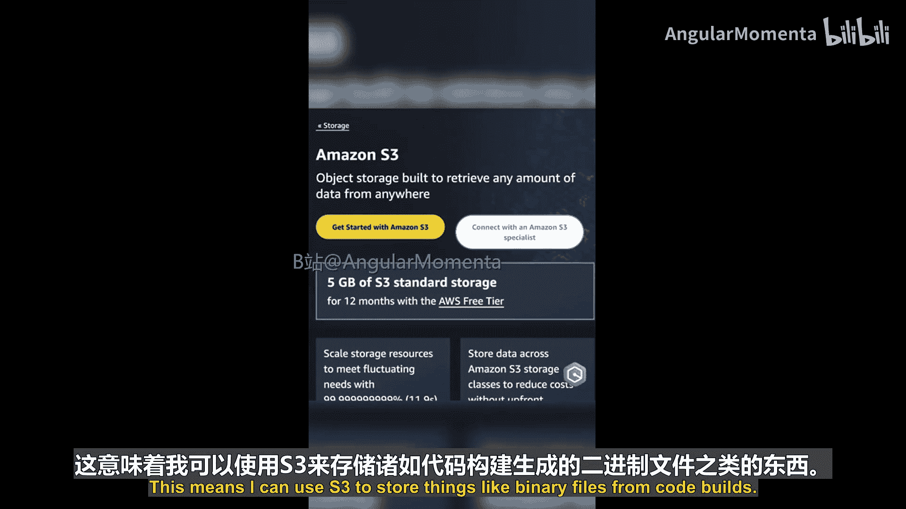

*   **数据湖与数据分析**：存储用于分析的海量数据。
*   **媒体存储**：存储照片、视频、音乐等媒体文件。
*   **文件存储**：存储文本文件、日志文件、应用程序数据等。
*   **静态网站托管**：利用其静态网站托管功能托管网站。
*   **构建产物存储**：存储代码构建过程中产生的二进制文件。

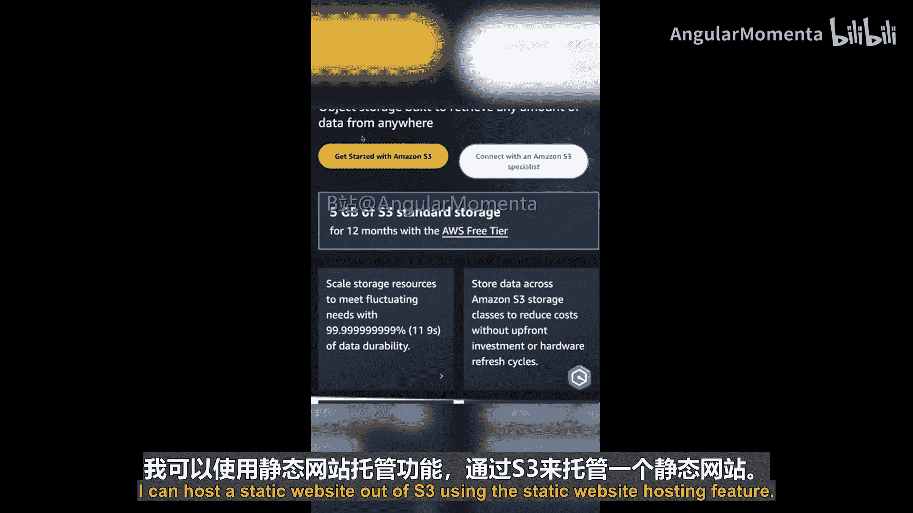

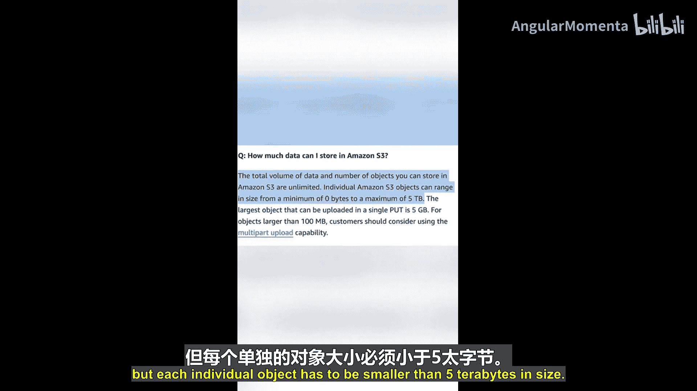

你可以向S3中存储无限量的数据，但每个单独的**对象**大小必须小于 **5 TB**。

## 存储结构：桶与对象

当你上传一个对象到S3时，必须将其上传到一个**桶**中。桶是S3中对象的容器，一个桶内可以存放任意数量的对象。

关于桶，有几个关键点需要注意：
*   桶的名称必须在**全球范围内唯一**。
*   桶创建在**单个AWS区域**内。
*   默认情况下，上传到S3的对象会自动在该区域的**至少三个可用区**内复制，以实现高耐久性。
*   如果需要跨区域复制对象（例如为了灾难恢复），可以使用**跨区域复制**功能。
*   默认情况下，桶和对象是**私有**的。你可以通过**桶策略**和**访问控制列表**来控制访问权限。大多数用例要求桶和对象保持私有。

## 安全与访问控制

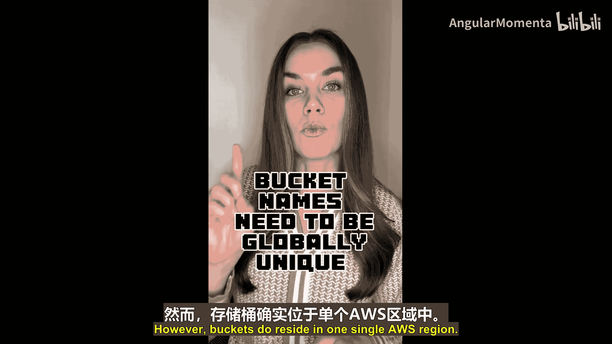

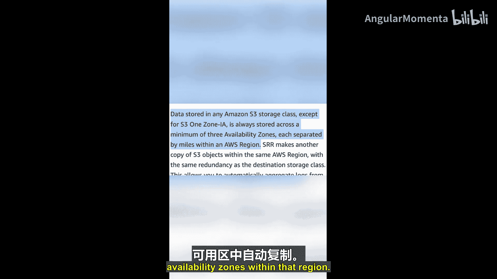

S3提供了多层次的安全功能来保护你的数据。

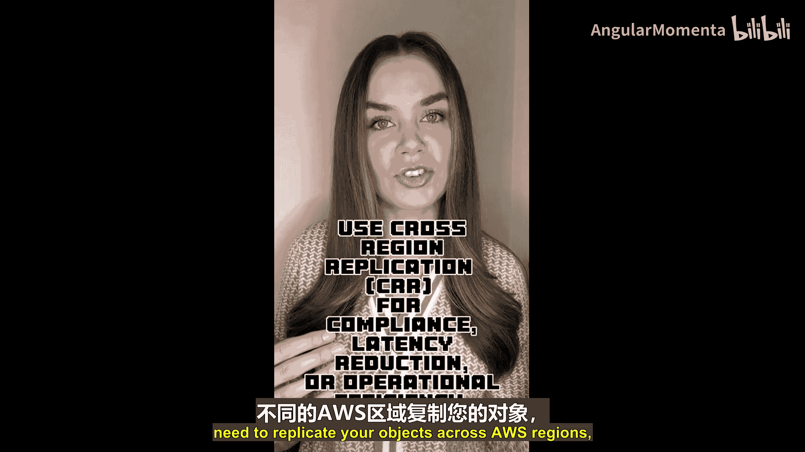

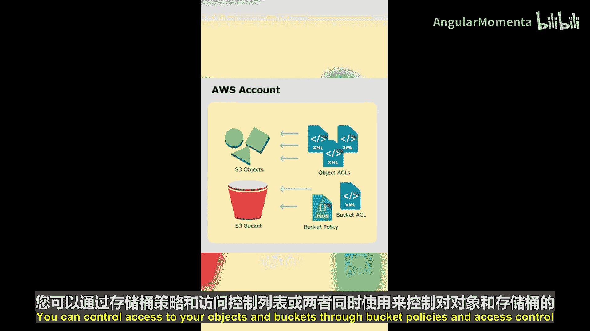

*   **阻止公共访问**：此功能可以覆盖ACL或桶策略的设置，强制限制对你的资源的公共访问，是防止数据意外公开的重要安全措施。
*   **默认加密**：S3默认会自动加密所有数据。
*   **服务器端加密**：支持四种密钥管理选项进行服务器端加密。
*   **敏感数据保护**：可以结合使用其他AWS服务（如本系列“M”章节介绍过的**Amazon Macie**）来发现和保护存储在S3中的敏感数据。

## 存储类别与成本优化

为了在不同数据访问模式下提供最具成本效益的存储，S3提供了分层的**存储类别**。

主要的S3存储类别包括：
*   **S3 Standard**：适用于频繁访问的数据。
*   **S3 Standard-IA**：适用于不常访问但需要快速检索的数据。
*   **S3 Glacier Instant Retrieval**：适用于很少访问且需要毫秒级检索的数据。
*   **S3 Glacier Flexible Retrieval**：适用于长期存档且检索时间从分钟到小时不等的数据。
*   **S3 Glacier Deep Archive**：适用于极长期存档且检索时间在12小时以上的数据。
*   **S3 One Zone-IA**：适用于可容忍单个可用区丢失的不常访问数据。

此外，你还可以使用**智能分层**功能。它能根据数据的访问模式，自动将数据移动到最具成本效益的存储层。

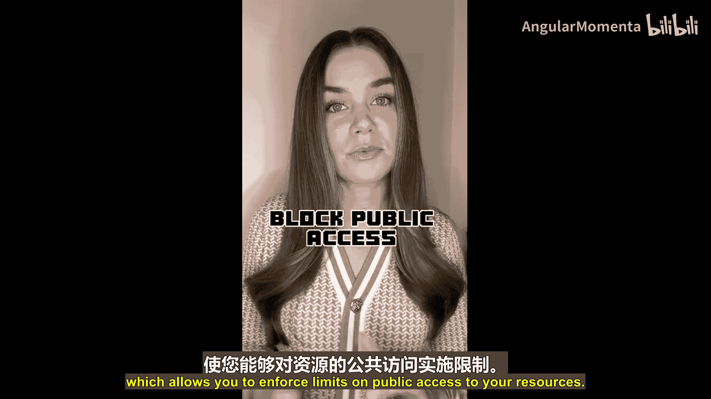

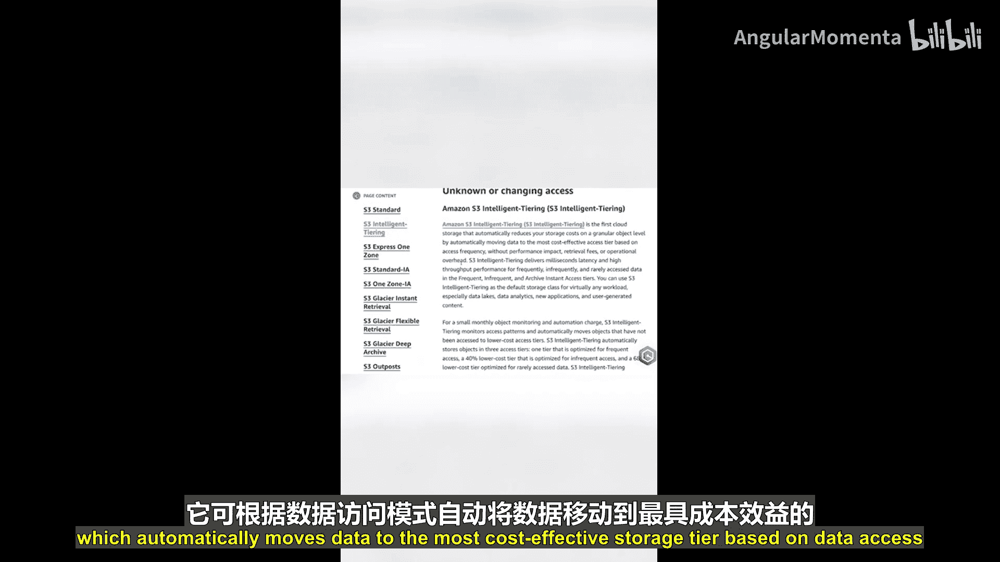

## 监控与管理

S3还提供了强大的监控工具来帮助你管理存储。

*   **S3 Storage Lens**：此功能提供组织范围内对象存储使用情况的可见性，包括活动趋势，并能提出建议以优化成本效率和应用数据保护最佳实践。

## 总结

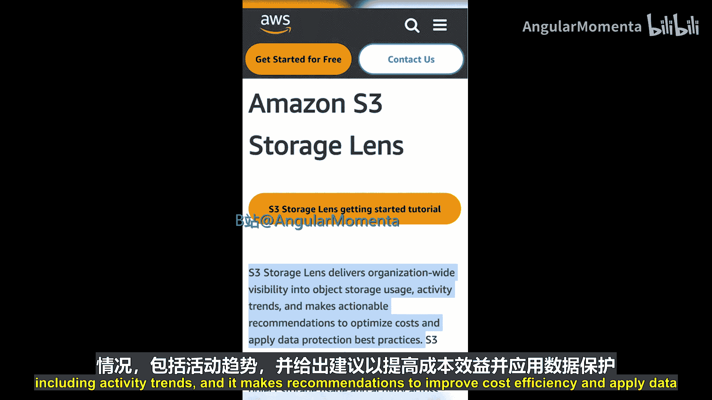

本节课中我们一起学习了**Amazon S3**的基础知识。我们了解到S3是一个功能强大、用途广泛的对象存储服务，它通过“桶”来组织“对象”，并提供多种存储类别、强大的安全功能和监控工具来满足不同场景的需求。本次介绍仅是S3功能的冰山一角，建议你查阅官方文档以深入了解。请继续关注更多AWS云基础内容。