# 020：T代表AWS Trusted Advisor 🔍

在本节课中，我们将要学习AWS Trusted Advisor服务。这是一个能够检查您的AWS环境并提供优化建议的工具，帮助您在成本、性能、安全性和容错能力等方面做出改进。

AWS Trusted Advisor是一项服务，它会检查您的AWS环境，并向您提供关于如何节省资金、提升性能、加强安全性、提高容错能力、了解服务限制等方面的建议。该服务之所以能提供有意义的建议，是因为其设计基于帮助数十万AWS客户所获得的洞察和经验教训，并将AWS最佳实践融入其建议中。

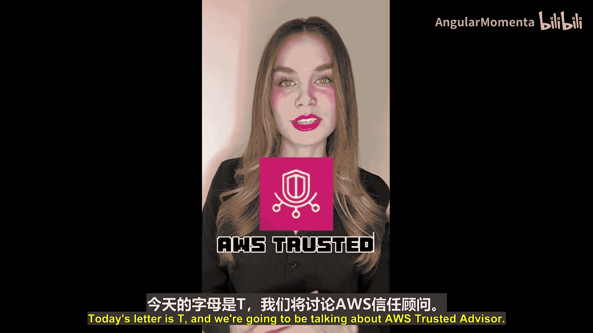

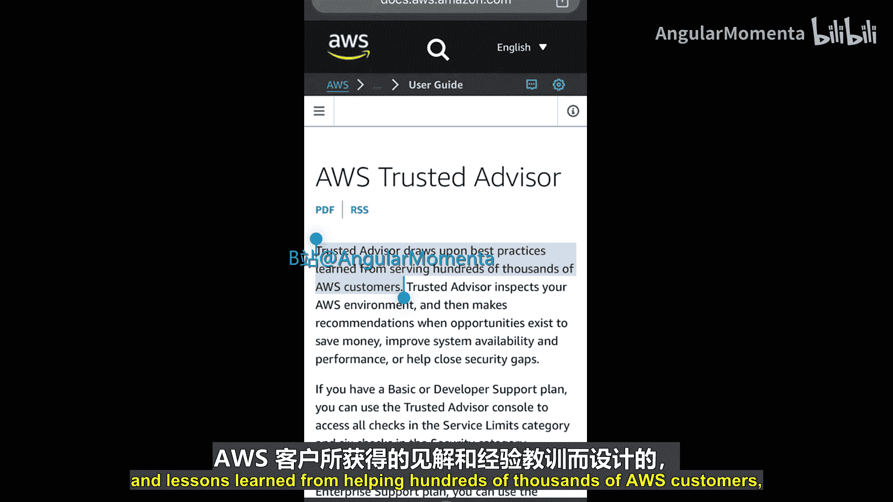

上一节我们介绍了Trusted Advisor的基本概念，本节中我们来看看它的具体检查类别。

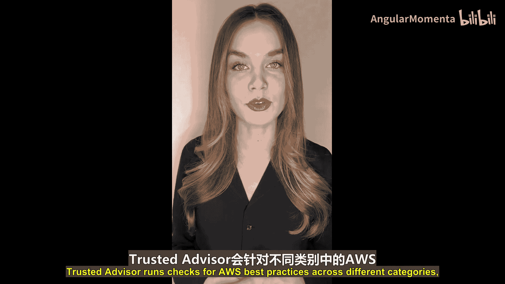

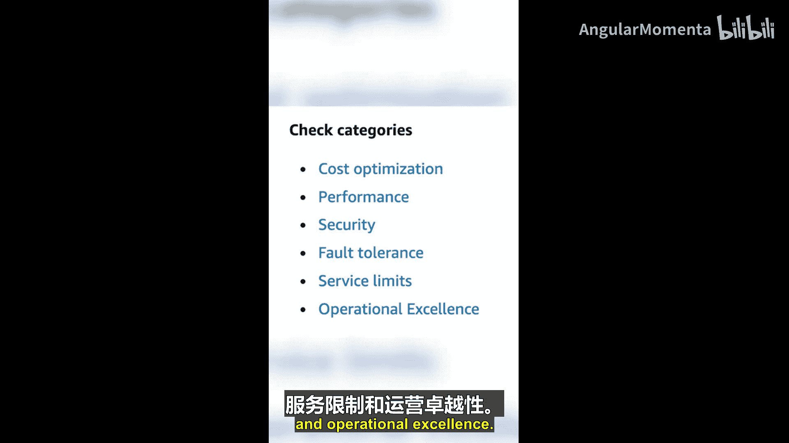

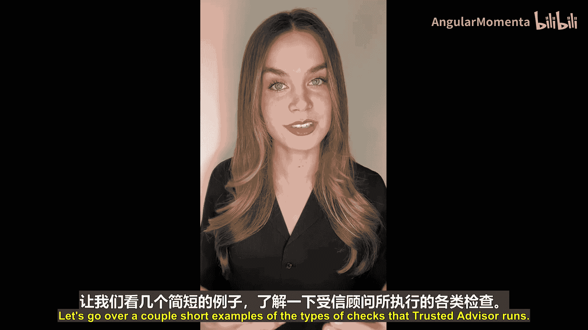

Trusted Advisor会针对不同类别运行检查，这些类别包括：
*   **成本优化**
*   **性能**
*   **安全性**
*   **容错能力**
*   **服务限制**
*   **卓越运营**

以下是几个简短的检查示例，帮助您理解该服务的功能。

**成本优化检查示例**：一项检查是查找闲置的负载均衡器，这可能表明存在未被有效使用、可以删除的负载均衡器。例如，某个账户中存在一个没有活动后端实例的负载均衡器，这个负载均衡器就可能被删除，是需要跟进的事项。

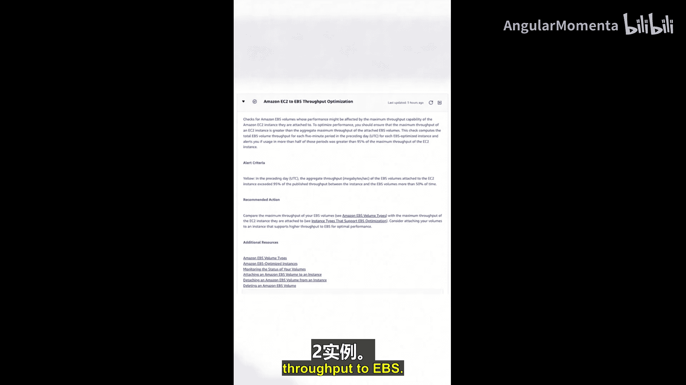

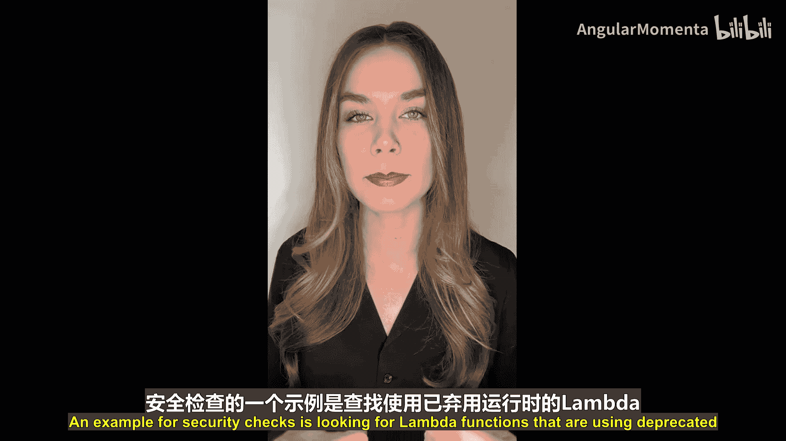

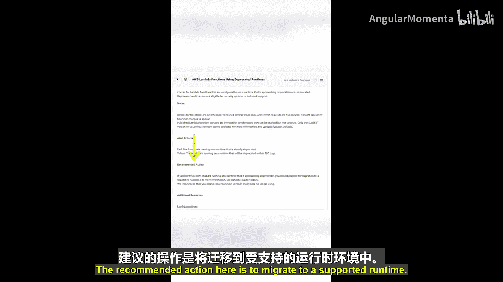

**性能检查示例**：一项检查是Amazon EBS吞吐量优化。该检查会查找那些性能可能受限于其所连接的EC2实例最大吞吐量容量的Amazon EBS卷。对此的建议操作是使用能够支持更高EBS吞吐量的EC2实例类型。

**安全检查示例**：一项检查是查找使用已弃用运行时的Lambda函数。已弃用的运行时无法获得安全更新，因此从安全角度出发，这需要处理。这里的建议操作是迁移到受支持的运行时。

AWS Trusted Advisor可以运行许多检查，以上只是几个简单的例子，让您了解该服务的功能。

根据检查结果，其状态可能为“未发现问题”、“建议调查”或“建议操作”。您可以使用其他AWS服务（如Amazon EventBridge）来监控AWS Trusted Advisor的结果。如果检查状态发生变化，它会向Amazon EventBridge发布一个事件，该事件随后可以选择性地调用其他AWS服务，例如，可以触发一个向Slack频道发送消息以通知团队的Lambda函数，或者使用Amazon Simple Notification Service发送电子邮件通知。

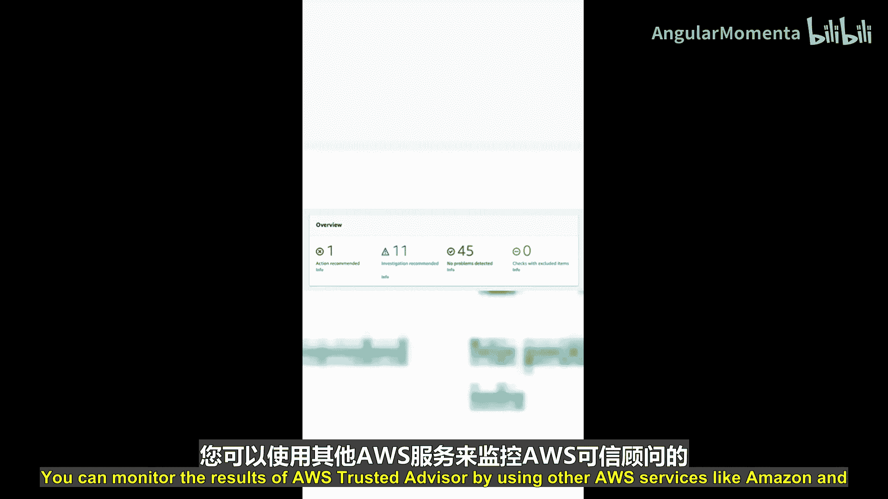

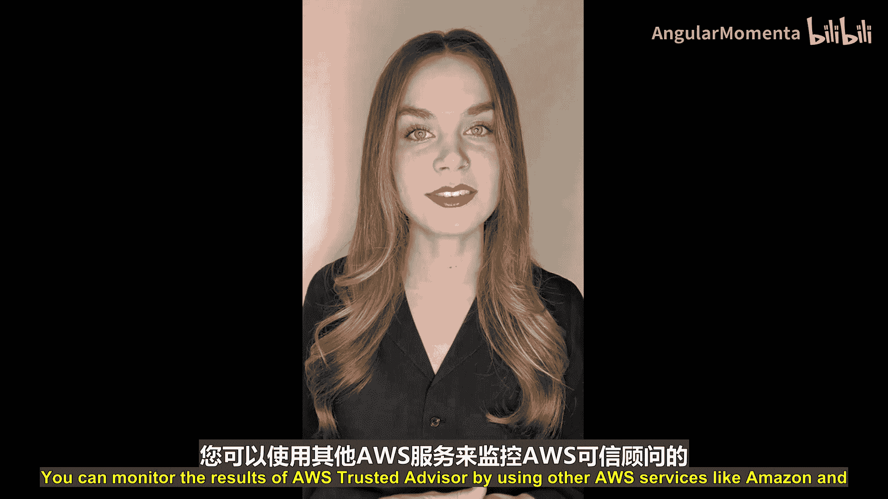

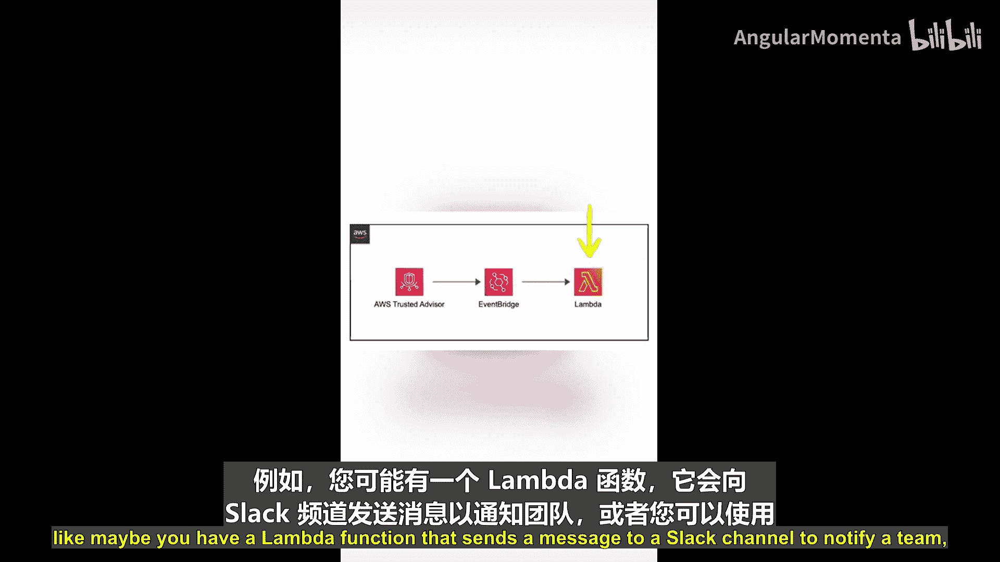

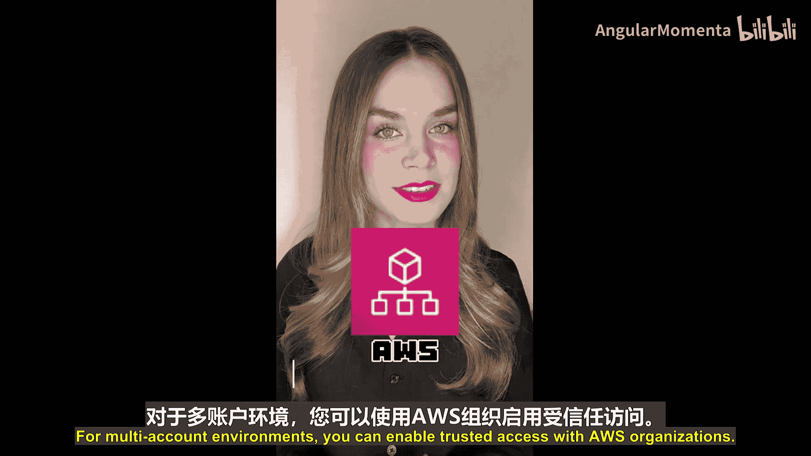

Trusted Advisor显示的结果涵盖了AWS账户内的所有区域。然而，如果您大规模使用AWS，很可能需要在多个AWS账户中操作。对于多账户环境，您可以启用与AWS Organizations的信任访问（这是我们在此视频系列字母O部分介绍过的服务）。组织视图将允许您在一个位置查看组织内所有账户、所有区域的所有检查结果。

另外需要注意的是，AWS Trusted Advisor是AWS Support的一项功能，因此您可用的检查项目取决于您的AWS Support支持计划。

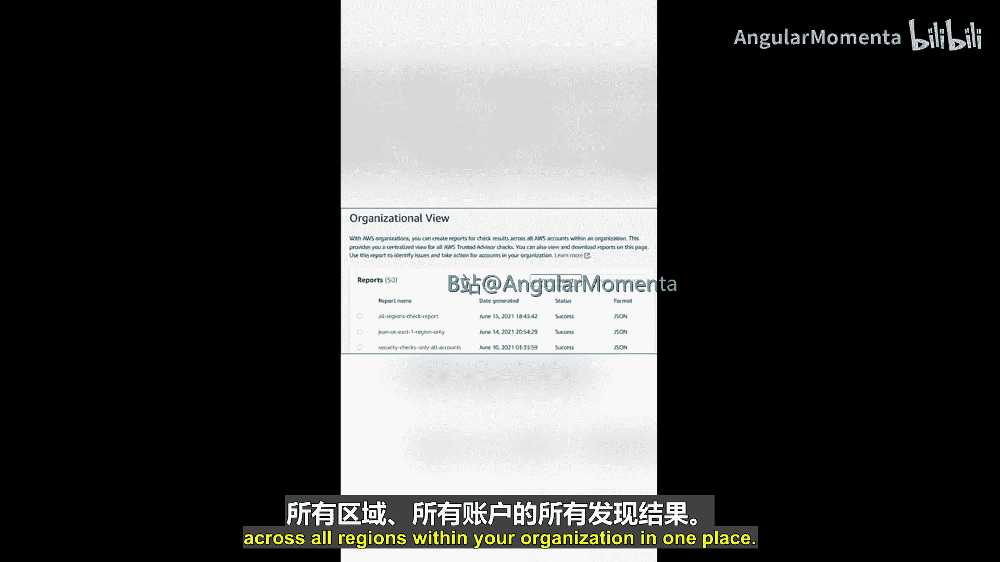

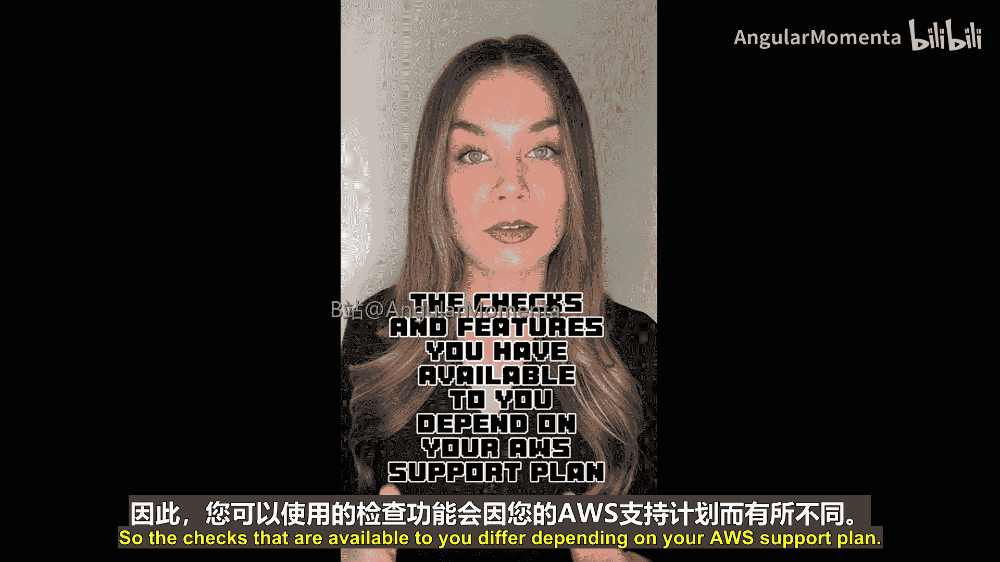

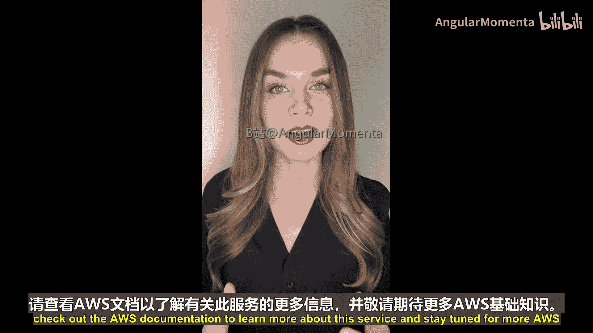

本节课中我们一起学习了AWS Trusted Advisor服务。它通过自动化检查，帮助您遵循AWS最佳实践，优化云环境。请务必查阅AWS官方文档以了解更多关于此服务的详细信息，并请继续关注更多AWS基础知识。