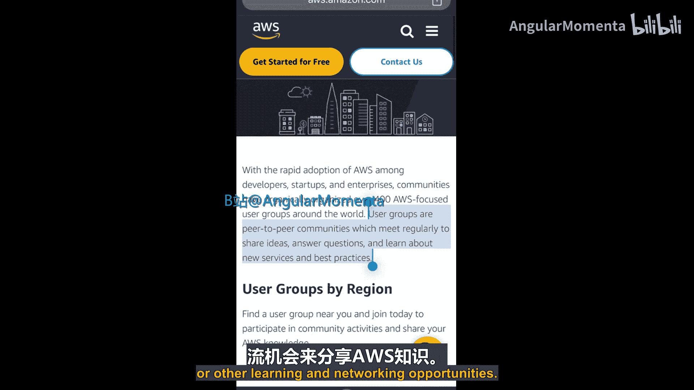
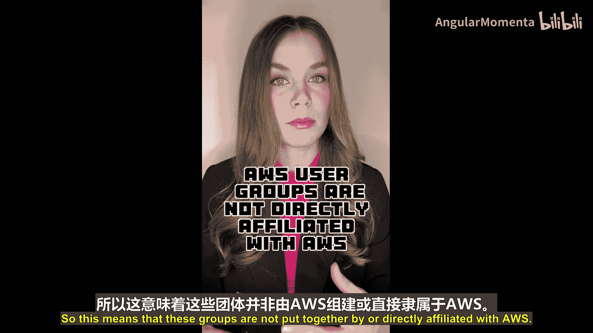
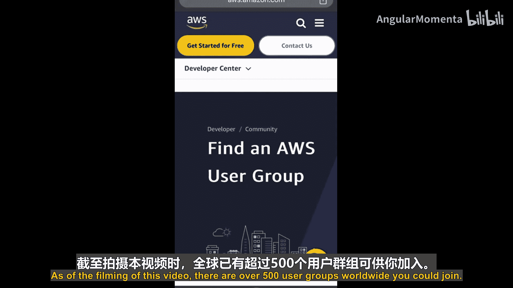
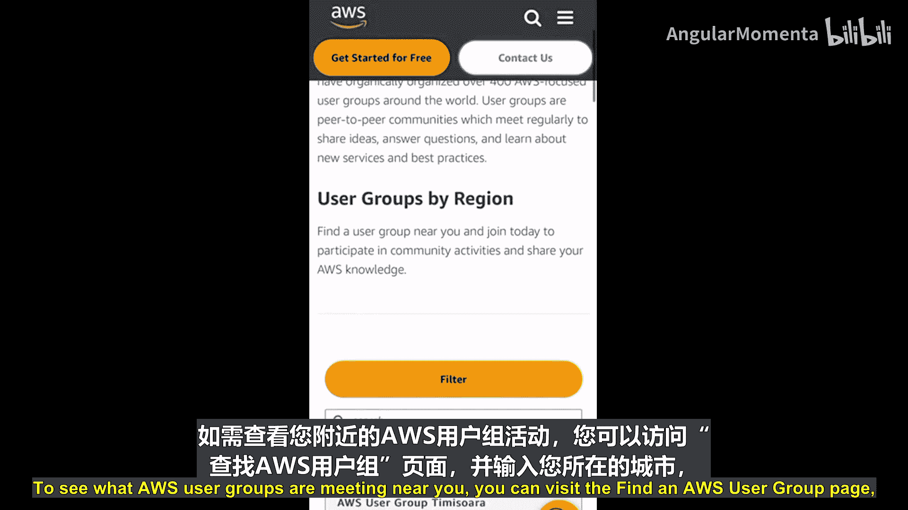
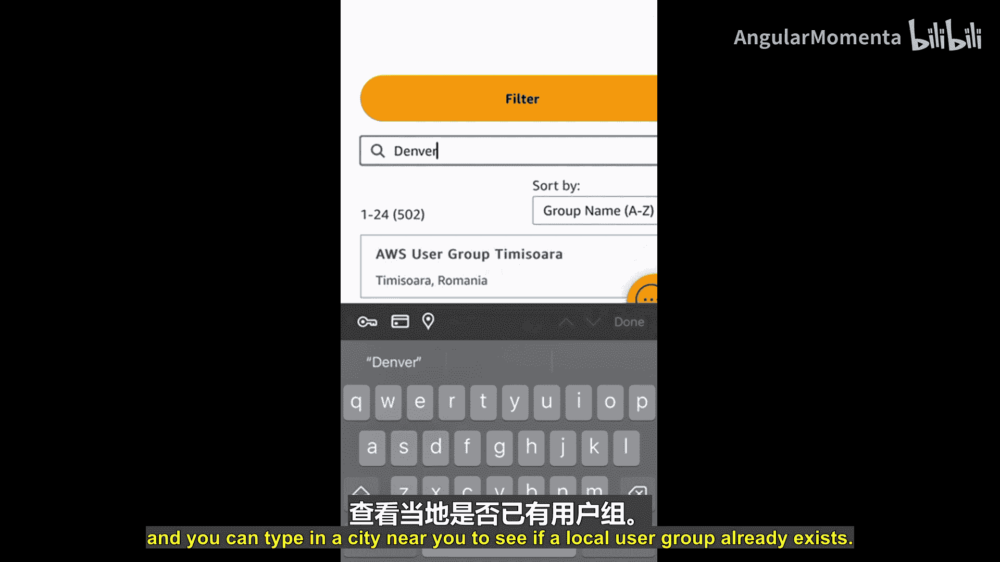
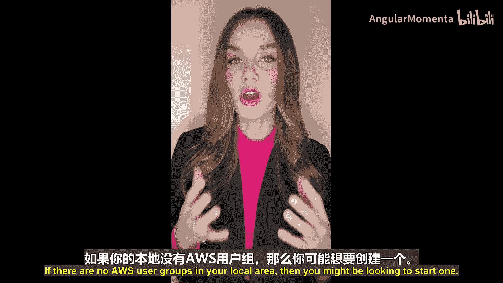
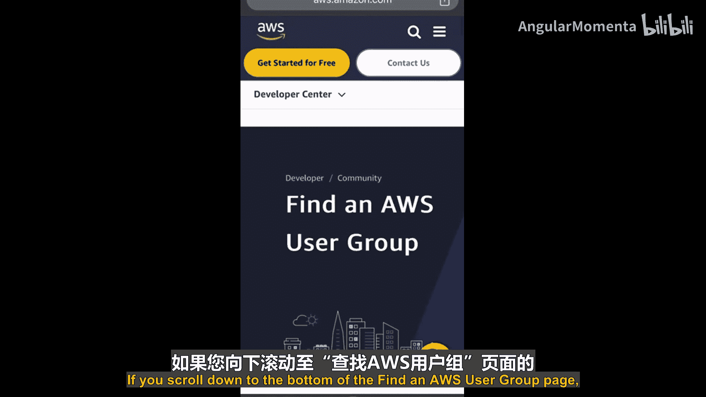
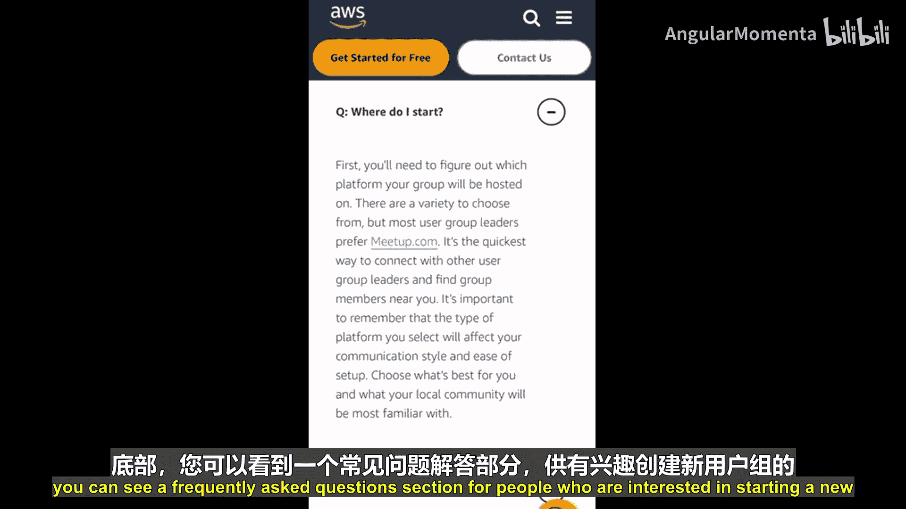
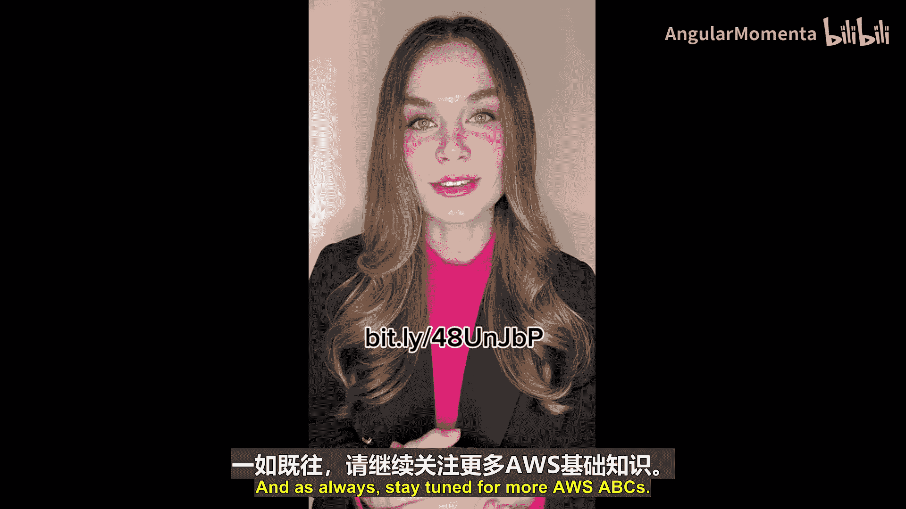

# 021：AWS用户组 👥

在本节课中，我们将要学习AWS用户组。用户组是AWS社区的重要组成部分，为学习、交流和建立人脉提供了宝贵的机会。

欢迎回到AWS ABCs系列。今天的字母是“U”。虽然今天没有特定的AWS服务要介绍，但我想讨论一个与AWS社区密切相关的话题——AWS用户组。

## 什么是AWS用户组？

AWS用户组是由社区成员自发组织的、点对点的交流社区。这些团体定期举办聚会，通过演示、网络研讨会、研讨会或其他形式的学习与社交活动，分享AWS相关知识。

上一节我们介绍了用户组的定义，本节中我们来看看参与用户组能带来哪些具体好处。

## 用户组的价值




在云技术领域，能够实时提问、与同行建立联系并分享见解，对职业发展大有裨益。以下是参与用户组的主要价值：





*   **实时交流**：在活动中直接向经验丰富的从业者提问。
*   **建立人脉**：与云技术领域的同行建立联系和关系。
*   **经验分享**：与他人分享自己的见解，并从他人的经验中学习。

这些用户组的创建及其举办的活动完全由社区驱动。这意味着这些团体并非由AWS官方组织或直接隶属，而是由当地对AWS技术感兴趣、并乐于分享的人们自发形成的社区。

## 如何找到并加入用户组

通过他人的经验可以学到很多。参加AWS用户组是聆听本地专业人士分享故事、深入了解如何在AWS上成功运营的绝佳方式。

截至本视频录制时，全球已有超过500个用户组可供加入。要查找您附近是否有AWS用户组在活动，可以访问“查找AWS用户组”页面，并输入您所在的城市进行搜索。

目前许多用户组也举办线上线下混合活动，因此您可以选择在线参加，或寻找线下见面的团体。

无论您是希望了解更多知识的云技术新手，还是寻找志同道合者交流想法的经验丰富的专业人士，亦或是希望分享知识的AWS专家，都可以找到适合您的本地AWS用户组。

以下是加入用户组的步骤：




1.  访问“查找AWS用户组”页面。
2.  在搜索框中输入您所在的城市或地区。
3.  查看搜索结果，找到附近的用户组。
4.  联系该用户组的组织者，了解如何参与活动。





## 如何创建新的用户组

如果您所在的地区没有AWS用户组，您或许可以考虑创建一个。

在“查找AWS用户组”页面底部，有一个“常见问题”部分，专门为有兴趣创建新用户组的人士提供指导，您可以在此了解更多信息。

## 总结与资源

本节课中我们一起学习了AWS用户组。每个用户组都各有特色，活动安排也各不相同。





要查找您附近的AWS用户组，可以访问“查找AWS用户组”页面。您可以通过以下短链接快速访问：
```
https://aws.amazon.com/developer/community/usergroups/find/
```





请持续关注，获取更多AWS基础知识。