# 022：Amazon VPC 🏗️

在本节课中，我们将要学习AWS云基础中的字母“V”所代表的核心服务：**Amazon Virtual Private Cloud**。我们将了解什么是VPC，如何创建和配置它，以及它在构建安全、隔离的云网络环境中的关键作用。

---

## 概述

Amazon Virtual Private Cloud，简称VPC，是您在AWS云中专属的逻辑隔离虚拟网络。您可以在VPC内部署AWS资源，例如Amazon EC2实例或RDS数据库。您可以将其理解为云端的“数据中心网络”。

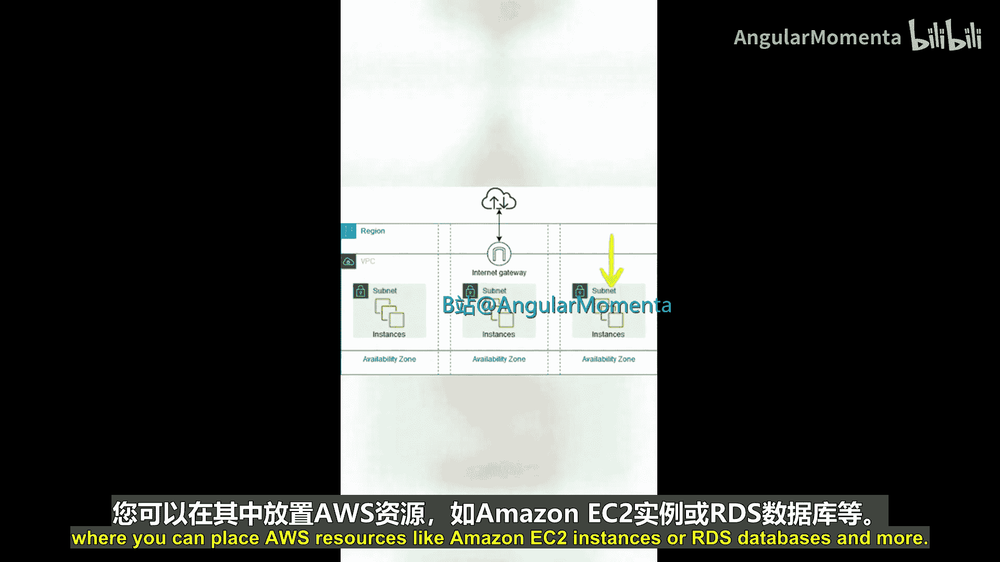

上一节我们介绍了其他AWS服务，本节中我们来看看如何构建自己的云网络基础——VPC。

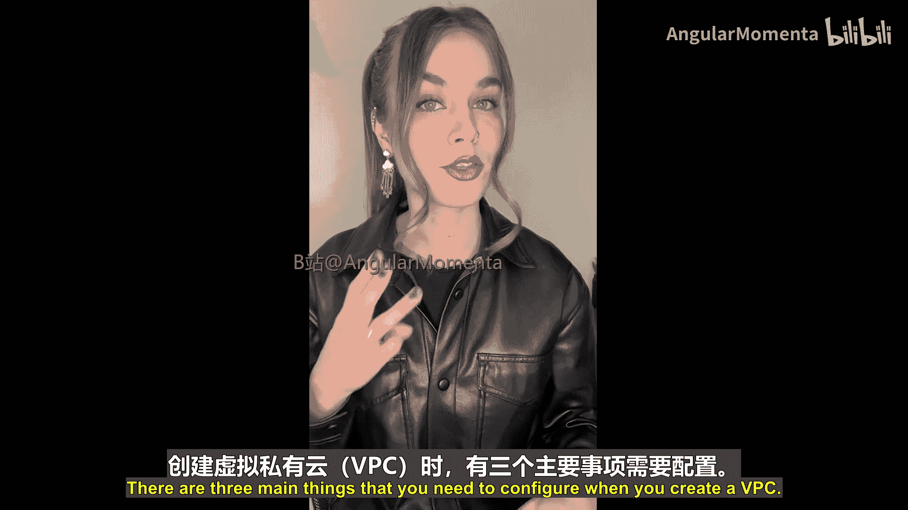

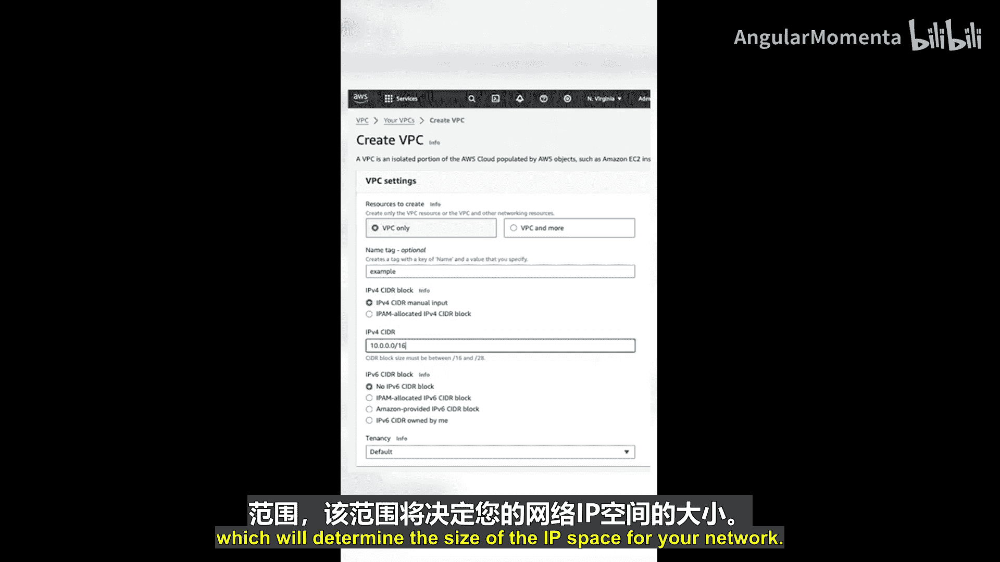

## 创建VPC的三大配置项

创建一个VPC时，您需要配置以下三个主要部分：

1.  **VPC名称**：为您的VPC指定一个易于识别的名称。
2.  **AWS区域**：选择您的VPC将部署在哪个AWS地理区域。VPC会**自动横跨**所选区域内的所有可用区，但**不会跨区域**。
3.  **CIDR范围**：配置一个CIDR（无类别域间路由）地址块，例如 `10.0.0.0/16`。这将决定您VPC网络的IP地址空间大小。

## 子网：网络中的网络

创建VPC后，您还需要创建子网才能在其中部署资源（如EC2实例）。子网是VPC网络内的细分网络段。

以下是创建子网时需要确定的配置：

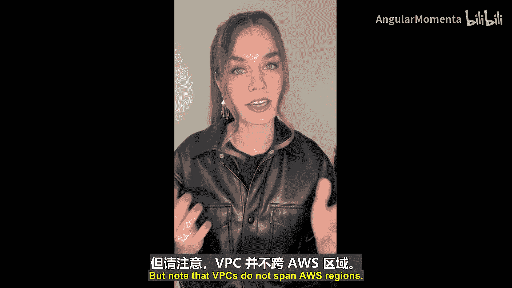

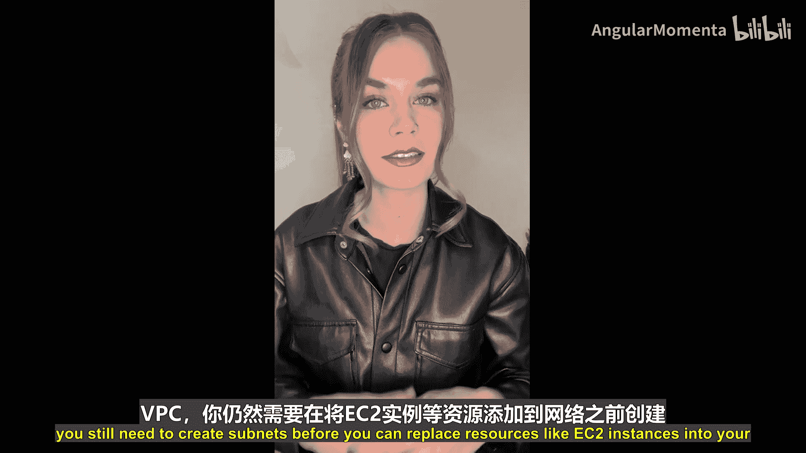

*   **所属VPC**：指定子网属于哪个VPC。
*   **可用区**：选择子网位于哪个可用区内。为了实现冗余并遵循AWS最佳实践，您应确保在计划使用的每个可用区中都创建子网，并且架构至少跨**两个可用区**部署。
*   **CIDR范围**：为子网分配一个CIDR块，它必须是其所属VPC的CIDR块的子集。例如，如果VPC是 `10.0.0.0/16`，子网可以是 `10.0.1.0/24`。

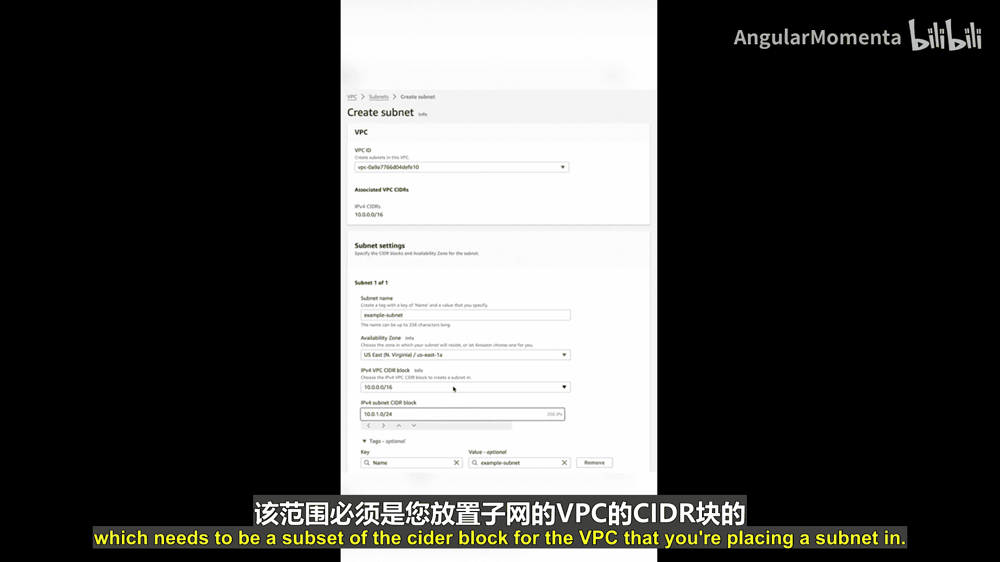

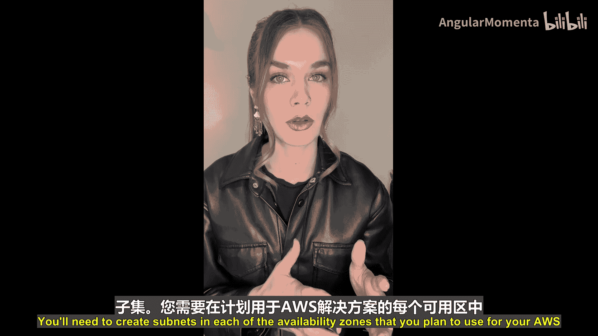

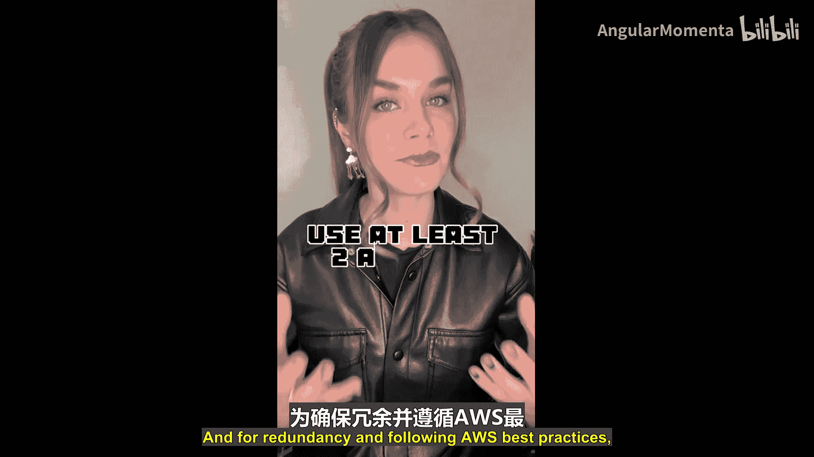

## 公共子网与私有子网

一个常见的网络设计模式是在每个可用区创建至少一个**公共子网**和一个**私有子网**。

*   **公共子网**：包含允许与互联网通信的资源。
*   **私有子网**：包含没有互联网连接性的资源。

需要明确的是，子网的“公”或“私”并非由其名称决定，而是由与之关联的**路由表**决定的。路由表中的规则决定了子网是否具有互联网连通性。

此外，您还可以使用**网络访问控制列表**和**安全组**等其他网络安全规则来控制网络流量。

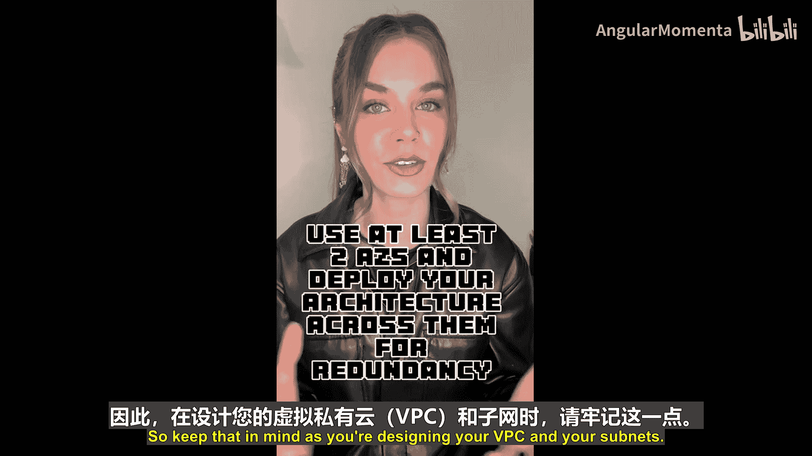
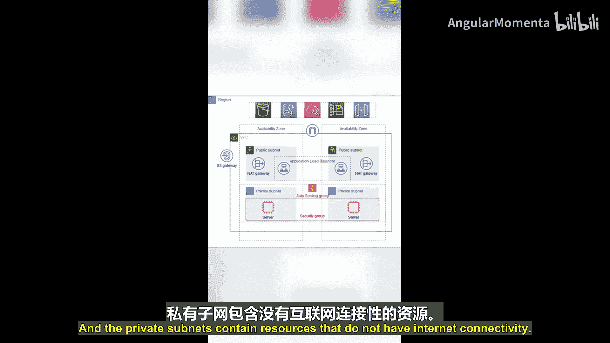

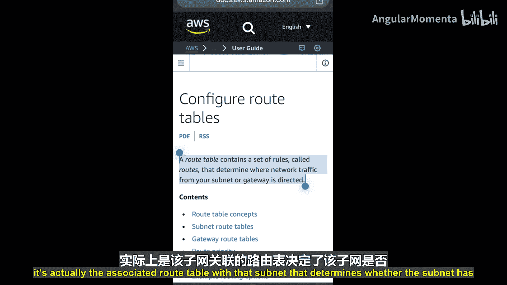
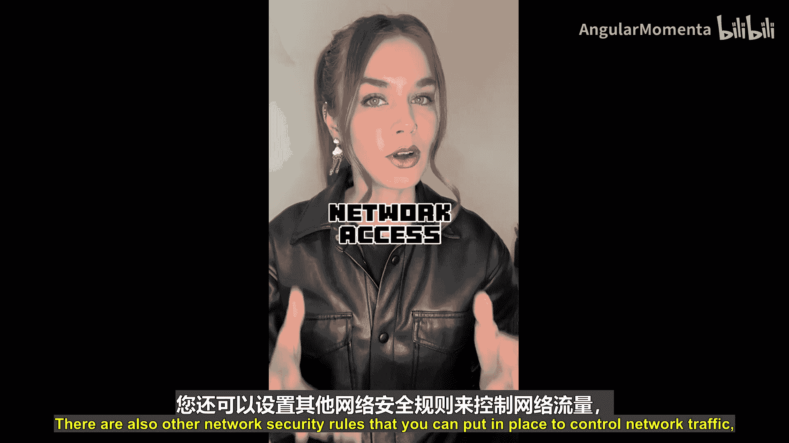
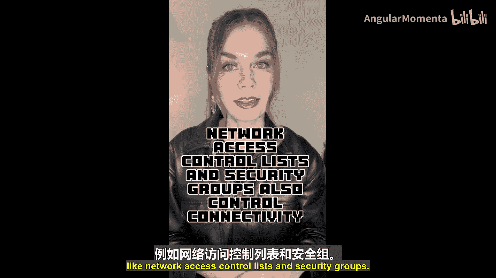
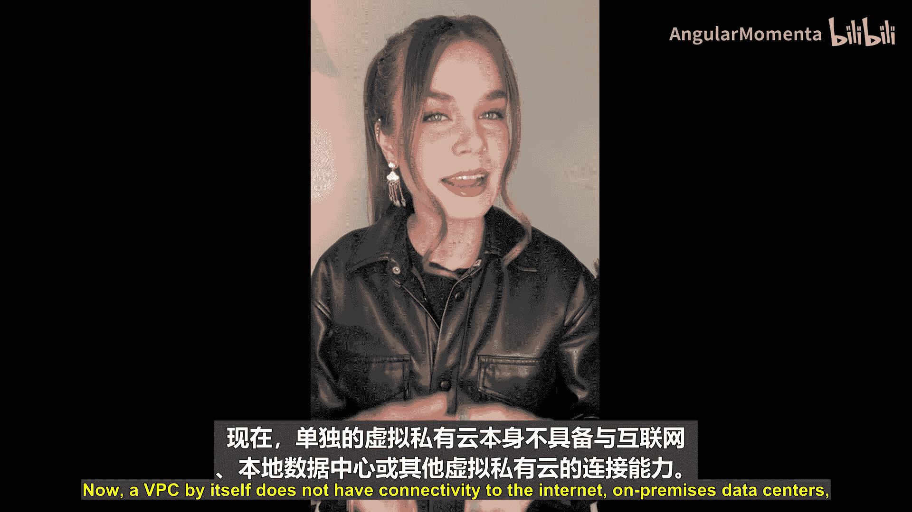

## VPC的网络连接

默认情况下，一个VPC自身不具备与互联网、本地数据中心或其他VPC的连接能力。

*   **互联网连接**：您需要创建并附加一个**互联网网关**到您的VPC。然后，在公共子网的路由表中，添加指向该互联网网关的路由。
*   **VPC间连接**：要连接不同的VPC，可以使用 **VPC对等连接**，或者使用 **AWS Transit Gateway**（中转网关）。
*   **与本地数据中心连接**：**AWS Transit Gateway** 也可用于路由VPN连接到本地数据中心的流量。

VPC还有其他类型的网关和连接选项，建议查阅AWS官方文档以了解更多。

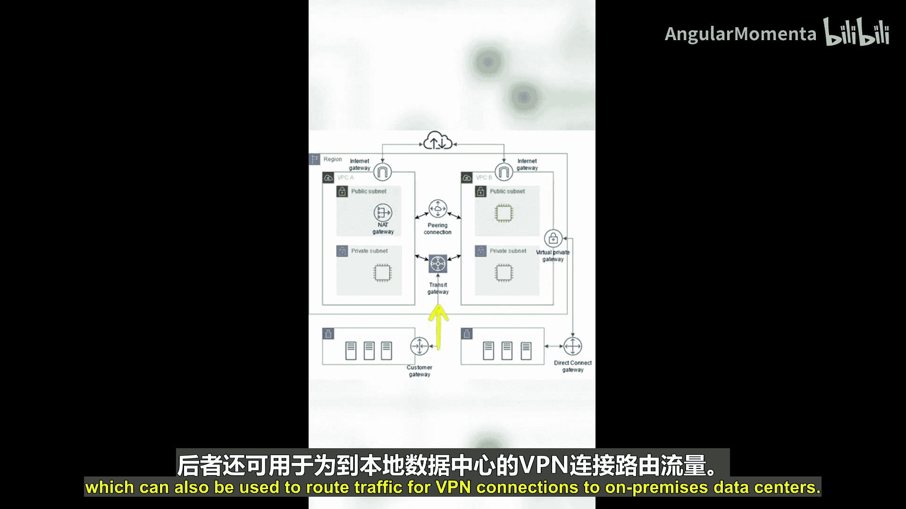

---

## 总结

本节课中我们一起学习了 **Amazon VPC**。我们了解到VPC是一个逻辑隔离的虚拟网络，是部署AWS资源的基石。创建VPC需要配置名称、区域和CIDR范围。为了部署资源并实现高可用，需要在VPC内跨多个可用区创建子网，并区分公共子网和私有子网。最后，通过互联网网关、VPC对等连接或中转网关等组件，可以实现VPC与互联网、其他VPC及本地网络的连接。

关于VPC的讨论到此为止。下一节，我们将迎来字母“W”，敬请期待更多AWS云基础知识。