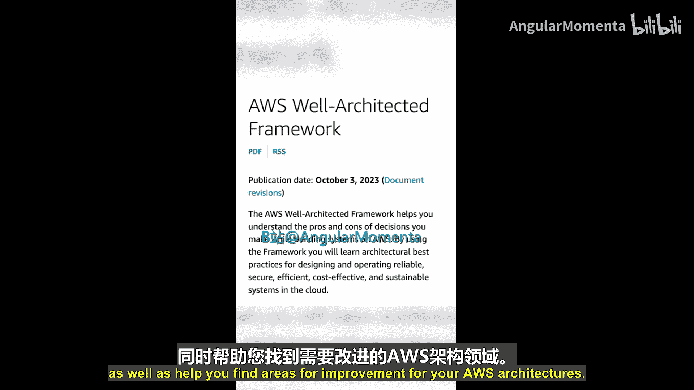
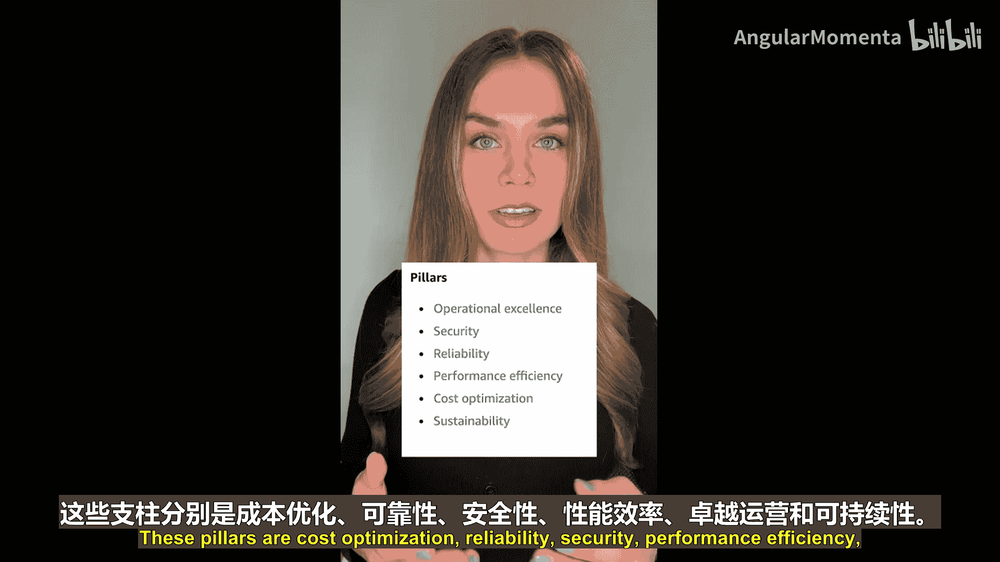
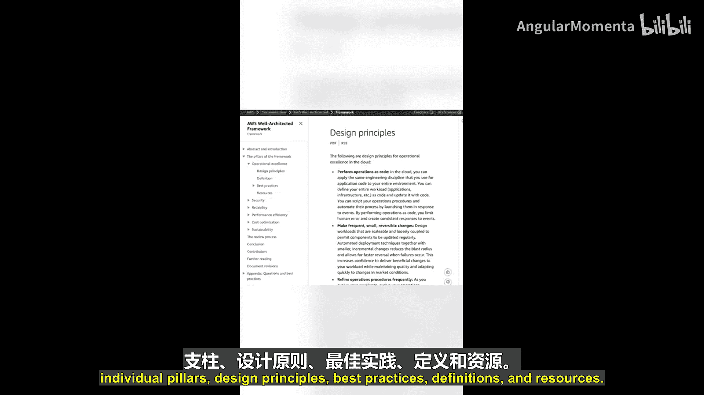
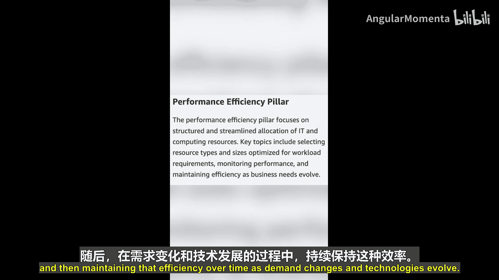
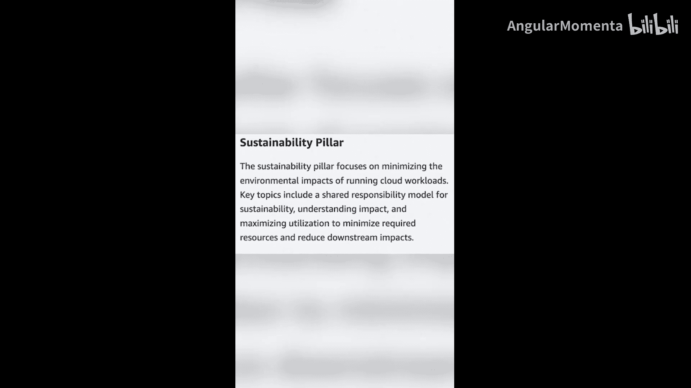
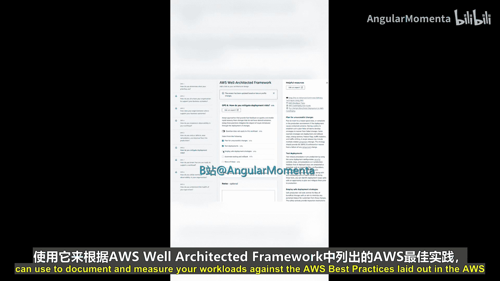
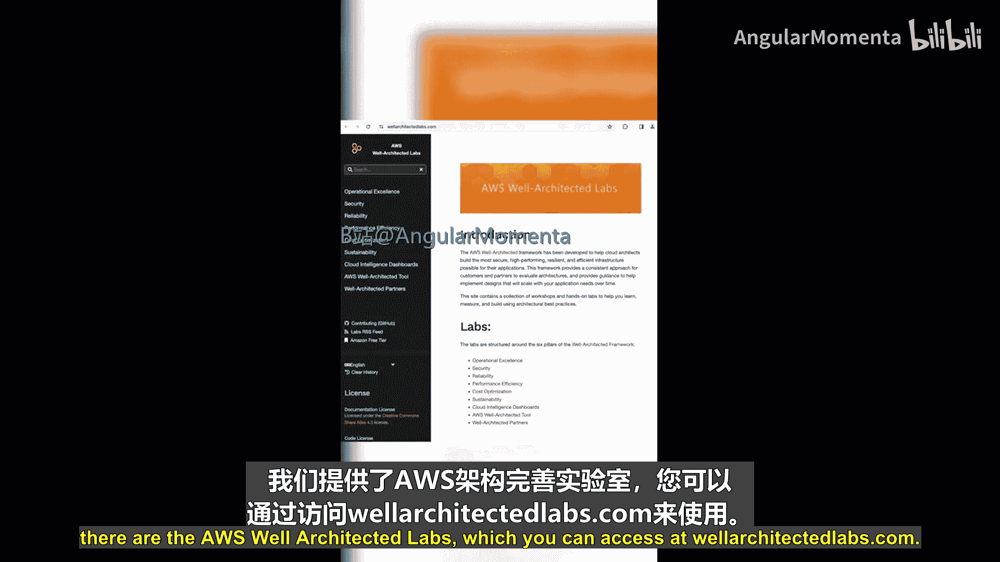

AWS云基础：W：AWS架构完善的框架 🏗️

在本节课中，我们将要学习AWS架构完善的框架。这个框架是AWS提供的一套最佳实践指南，用于帮助您评估和改进在AWS云上构建的工作负载。

AWS架构完善的框架帮助您根据云最佳实践来评估您的AWS工作负载。它可以引导您围绕工作负载的设计和运维展开建设性的讨论，并帮助您找到AWS架构中需要改进的领域。AWS解决方案架构师拥有多年帮助客户评估其AWS工作负载的经验，致力于寻找在成本、安全性、卓越运维或其他方面进行改进的方法。AWS架构完善的框架汲取了这些经验，并整合了一套资源，包括评估问题和文档，供团队协作使用，以便对AWS架构进行建设性的讨论。

上一节我们介绍了框架的目的，本节中我们来看看它的核心组成部分。

该框架的信息被组织在六个不同的类别中，即架构完善框架的六大支柱。

以下是这六大支柱的列表：
*   **成本优化**：以最低的价格点提供所需的功能。
*   **可靠性**：确保工作负载在需要时能够正常工作。
*   **安全性**：保护数据、系统和资产，并利用AWS服务提升安全状况。
*   **性能效率**：高效使用资源以满足需求，并在需求变化和技术演进时保持效率。
*   **卓越运维**：有效支持开发、运行工作负载、获取运维可见性与洞察，并改进流程。
*   **可持续性**：审视工作负载对环境的影响，包括能源消耗和整体效率。

每个支柱都包含设计原则。以卓越运维支柱为例，其部分设计原则包括：
*   **将运维作为代码执行**：使用代码自动化运维任务。
*   **进行微小、频繁且可逆的变更**：降低变更风险，便于回滚。
*   **预见故障**：提前设计应对故障的方案。

您应该查阅AWS架构完善框架的文档，以了解每个支柱的具体设计原则、最佳实践、定义和资源。但现在，让我们继续定义每个支柱。

对于**安全性**，这个支柱关注保护数据、系统和资产，以及使用AWS服务来改善您的安全状况。

下一个支柱是**可靠性**。这个支柱帮助您评估工作负载在需要时正常工作的能力。您的系统可靠吗？

接下来是**成本优化**，它将帮助您评估工作负载，看其是否以尽可能低的价格点提供了所需的功能。

然后是**性能效率**，这是关于高效使用资源以满足需求，并在需求变化和技术演进时长期保持这种效率。

最后但同样重要的是**可持续性**，它帮助您更仔细地审视工作负载对环境的影响，包括能源消耗和整体效率。

每个支柱都有关联的问题，您可以与团队一起使用这些问题来评审您的架构。这些评审旨在鼓励团队深入探讨的对话，而不是对架构的审计。

此外，AWS管理控制台中有一个名为 **AWS架构完善工具** 的工具，您可以用它来根据AWS架构完善框架中列出的AWS最佳实践，记录和衡量您的工作负载。

为了帮助您获得一些实践这些AWS最佳实践的经验，还有 **AWS架构完善实验室**，您可以通过访问 `wellarchitectedlabs.com` 来使用。

好的，关于AWS架构完善框架，我们就介绍到这里。我建议任何尝试学习AWS的人都阅读一下架构完善框架的文档，您可以点击此链接了解更多信息。接下来，我们将学习字母X。您认为我们会涵盖什么内容呢？请一如既往地关注更多AWS基础知识。

在本节课中，我们一起学习了AWS架构完善的框架，了解了它的六大支柱：**成本优化**、**可靠性**、**安全性**、**性能效率**、**卓越运维**和**可持续性**，以及如何利用框架提供的工具和资源来评估和改进您的云架构。