# 024：X代表AWS X-Ray 🔍

在本节课中，我们将要学习AWS X-Ray。这是一个用于分析和调试分布式应用程序性能的服务。我们将了解它如何帮助您快速定位问题，并介绍其核心概念。

---

想象一个场景：您在AWS上托管了一个电子商务应用程序。客户通过支持渠道反馈，他们在尝试结账和购买产品时遇到了中断和速度变慢的问题。

这个电子商务应用程序以分布式方式托管，由多个服务共同构成结账或购买功能。在后端的某个环节，其中一个服务出现了性能问题，可能是代码中存在错误，或者某个地方配置不当，导致了这些问题。

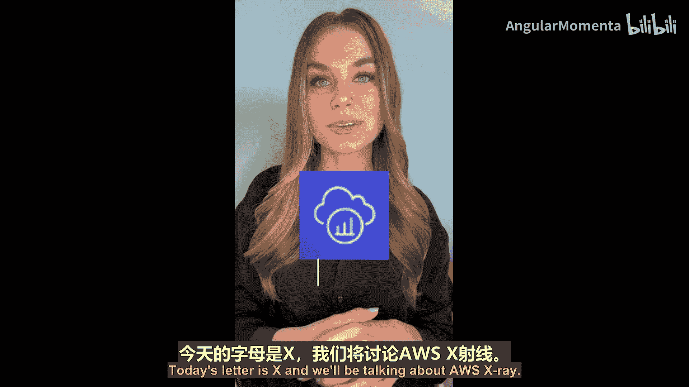

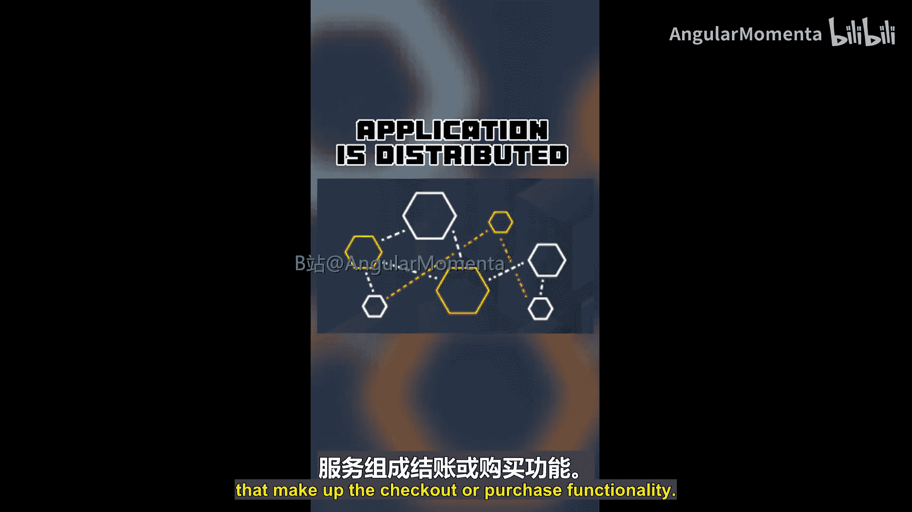

关键在于，您如何知道问题出在哪里？如何快速缩小范围，从而准确定位是哪个服务给最终用户带来了问题？这是分布式应用程序的常见问题，而实施跟踪将是一个很好的解决方案。

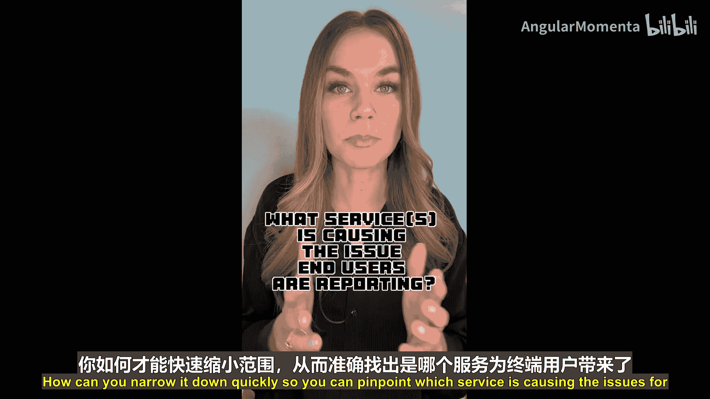

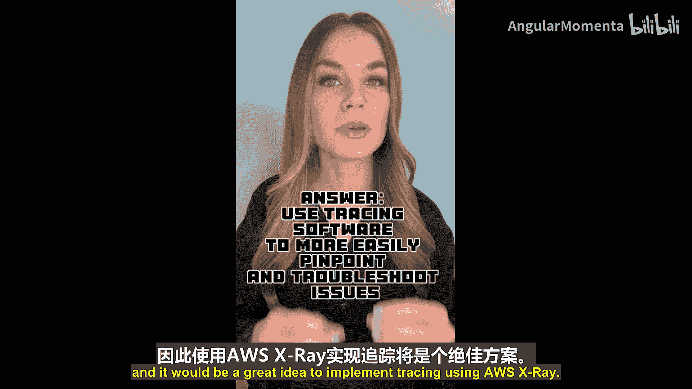

---

## 使用AWS X-Ray进行跟踪

AWS X-Ray是一项完全托管的服务。它收集您的应用程序在处理请求时，跨越构成分布式应用程序的各个服务的信息，并将这些信息汇集在一起。这样，您就能更快地定位问题或瓶颈，并发现优化应用程序的机会。

它提供了仪表板和API等工具，您可以使用这些工具来查看、筛选和从跟踪数据中提取见解。在调查问题时，获取这种细粒度的时间信息非常有帮助。使用X-Ray控制台，您可以通过服务地图直观地看到是哪个服务导致了速度变慢。

然后，您可以通过查看日志或相关指标，进一步深入进行故障排除。

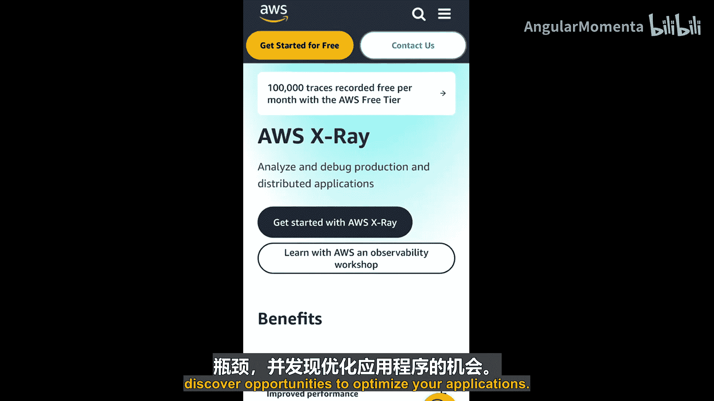

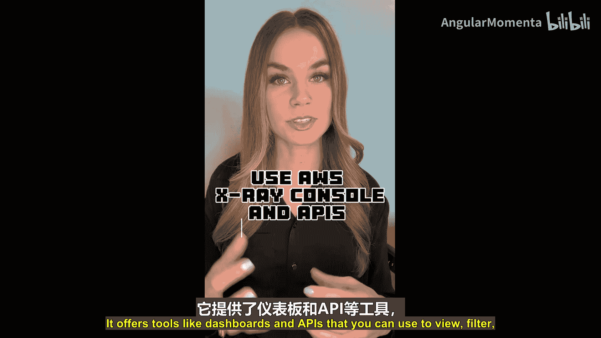

---

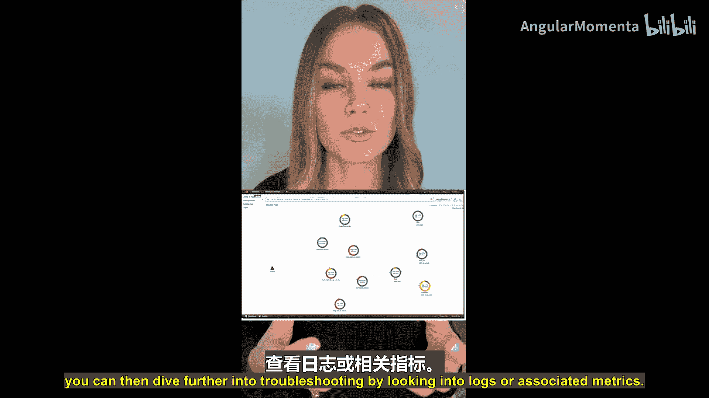

上一节我们介绍了AWS X-Ray的用途和基本价值，本节中我们来看看其核心工作概念。

以下是使用X-Ray时需要了解的一些基本概念：

*   **段**：您的应用程序运行所在的主机会收集**段**并将其发送到X-Ray。段包含有关应用程序正在处理的请求的信息。
*   **子段**：**子段**提供更细粒度的时间信息，可以更详细地描述您的应用程序对下游的调用，例如对外部API、AWS API甚至数据库的调用。
*   **服务地图**：由X-Ray生成，为您提供服务的完整可视化视图以及它们彼此之间的关系。
*   **跟踪**：一个**跟踪**收集由单个请求生成的所有段。您可以在X-Ray控制台中查看跟踪，并深入查看有关单个段或子段的更多详细信息以获得洞察。

---

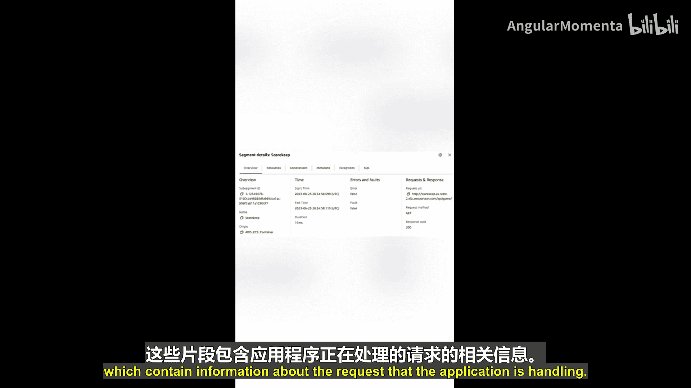

根据您使用的计算服务，实施跟踪可以像通过配置开启一样简单。例如，如果您使用AWS Lambda，只要配置了正确的权限即可。

您还可以对应用程序进行**插桩**，以便查看从您的应用程序发出的请求的更多数据。例如，如果您的应用程序每个请求会发出四个不同的API调用，您可以对应用程序进行插桩，以便查看每个单独API调用的更细粒度时间信息。

您可以使用**AWS Distro for OpenTelemetry**进行此类插桩。这是基于云原生计算基金会（CNCF）OpenTelemetry项目的AWS发行版。

---

本节课中我们一起学习了AWS X-Ray。我们了解到它是一个强大的工具，用于跟踪和分析分布式应用程序中的请求流，帮助快速定位性能瓶颈和故障点。其核心概念包括段、子段、服务地图和跟踪。根据服务类型，启用方式可能很简单，也可以通过SDK进行更深入的插桩。

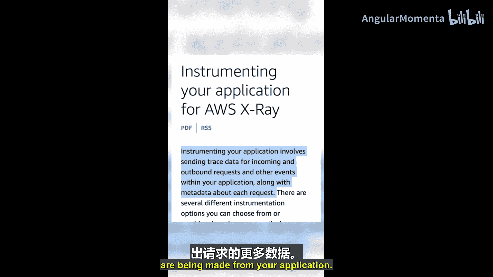

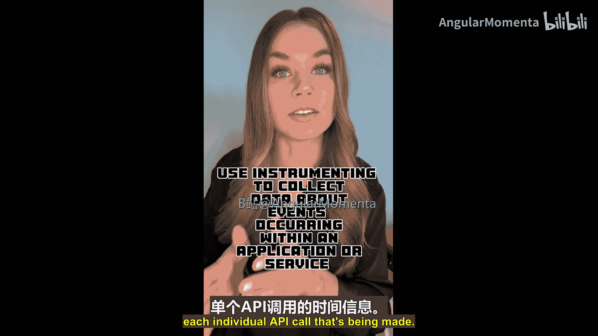

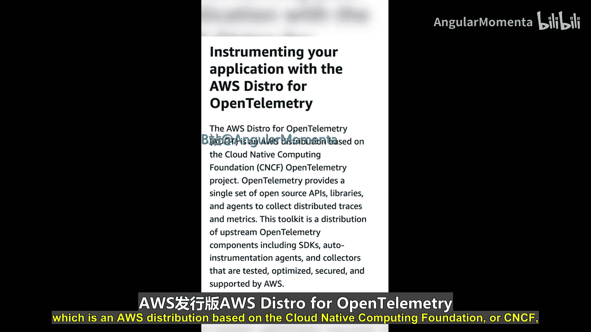

接下来，我们将迎来字母Y，这可能需要一点创意。请在评论中告诉我您认为我们接下来会讲什么。请继续关注更多AWS基础知识。