# 026：AWS Local Zones 🏙️

在本节课中，我们将要学习AWS全球基础设施的最后一个核心概念——AWS Local Zones。我们将了解它是什么、为什么需要它，以及如何使用它。

---

## 概述

AWS Local Zones是一种将AWS计算、存储、数据库和其他服务部署到更靠近最终用户和企业的地理位置的基础设施。它旨在为需要极低延迟（毫秒级）访问的特定工作负载提供支持。

上一节我们介绍了AWS区域和可用区，本节中我们来看看AWS如何通过Local Zones进一步扩展其基础设施的覆盖范围和能力。

---

## AWS全球基础设施核心概念回顾


在深入了解Local Zones之前，让我们快速回顾一下相关的AWS全球基础设施概念。

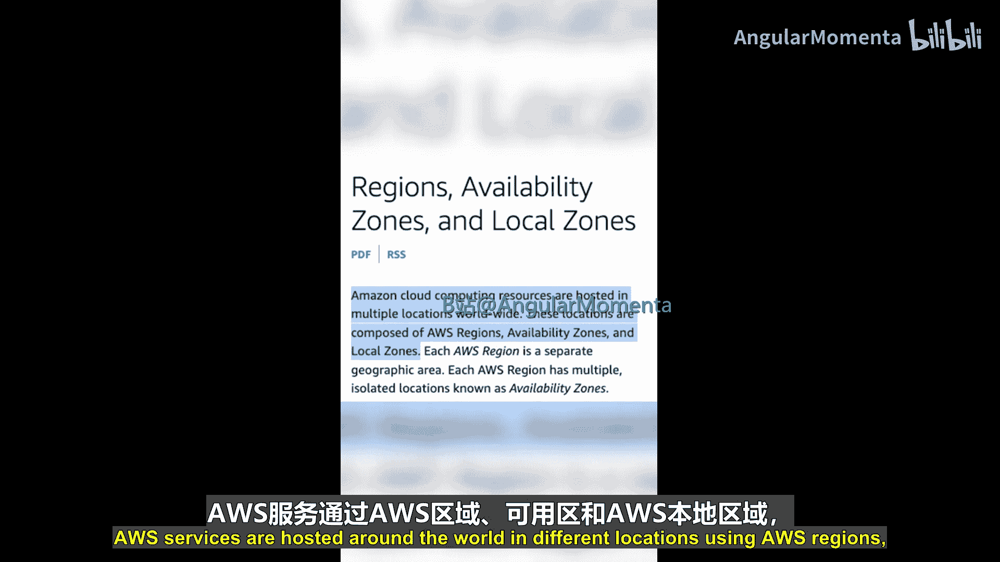

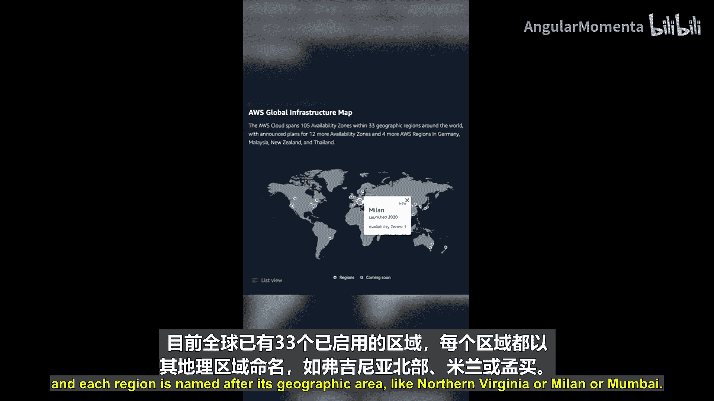

AWS服务通过**AWS区域**、**可用区**和**AWS Local Zones**在全球不同位置进行部署。


*   **AWS区域**：是AWS资源所在的地理区域。目前全球已启动33个区域，每个区域以其地理区域命名，例如“美国东部（弗吉尼亚北部）”、“欧洲（米兰）”或“亚太地区（孟买）”。
*   **可用区**：是AWS区域内的一个或多个离散的数据中心。每个可用区都设计为相互隔离，但通过低延迟链路相连。最佳实践是在一个AWS区域内跨多个可用区部署架构，以实现高可用性。

在AWS中创建资源时，其位置绑定规则如下：
*   部分资源绑定到单个可用区。
*   部分资源绑定到单个区域。
*   部分服务是全球性的。

需要查看每个具体服务的文档来确定其位置规则。例如：
*   **Amazon EC2实例**或**Amazon RDS数据库实例**绑定到单个子网。
*   子网则绑定到单个可用区。

因此，在创建这些资源时，你需要选择将其放置在哪个可用区及其对应的子网中。

---

## 什么是AWS Local Zones？🎯

现在让我们正式讨论Local Zones。

AWS Local Zones将AWS基础设施（如计算、存储、数据库和其他服务）部署到更靠近最终用户和企业的位置。它们为需要**个位数毫秒级延迟**访问特定AWS服务的工作负载提供支持。

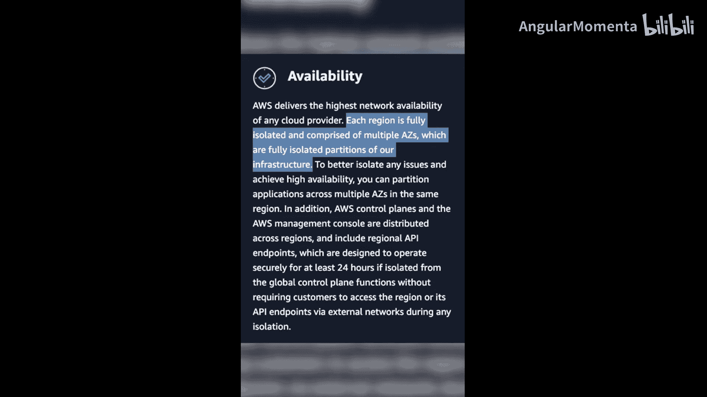

Local Zones可以帮助你运行对延迟敏感的应用，例如：
*   **实时游戏**
*   **媒体流处理**
*   **数据实时处理与分析**


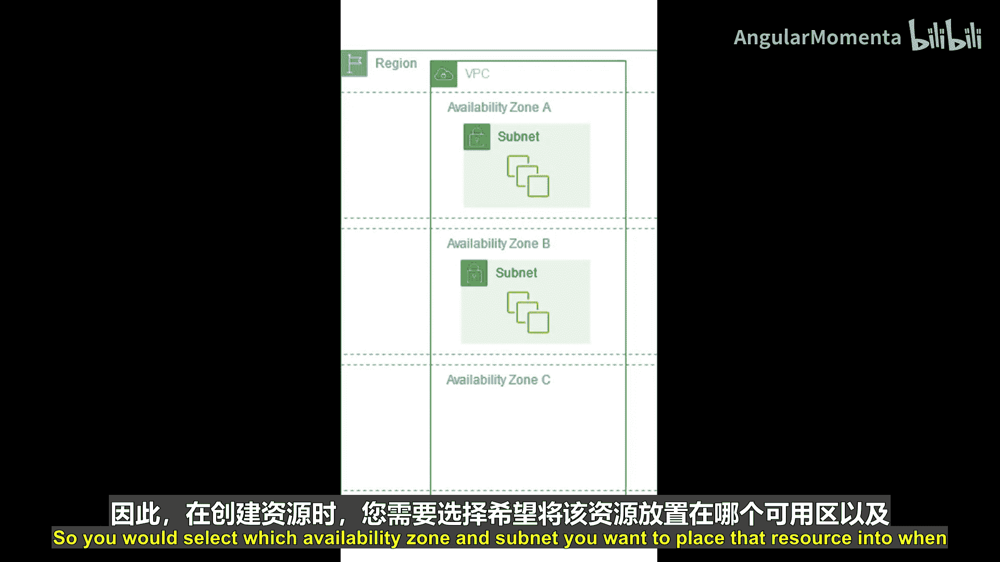

因为这些Local Zones在物理上更接近你的最终用户，从而显著降低了网络延迟。

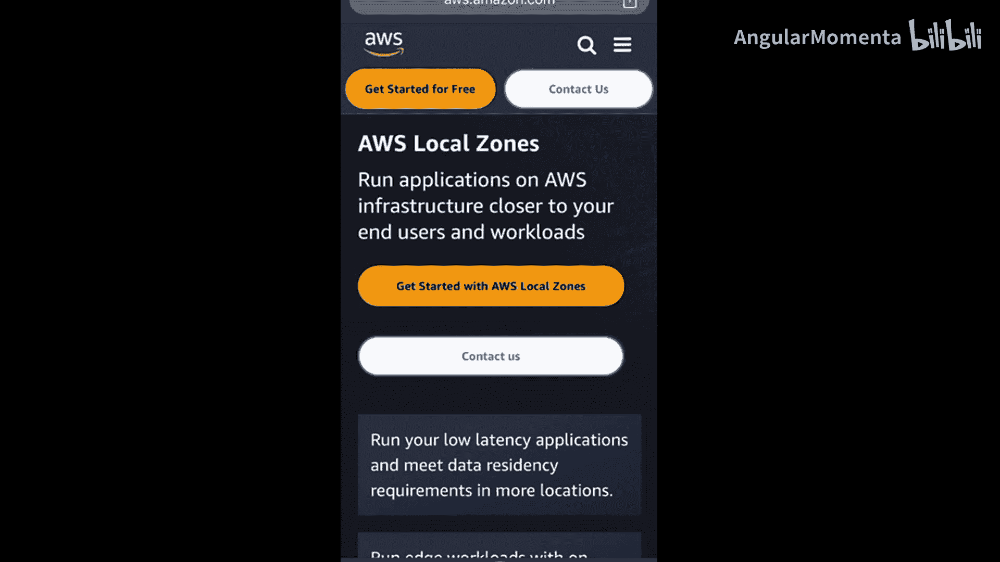

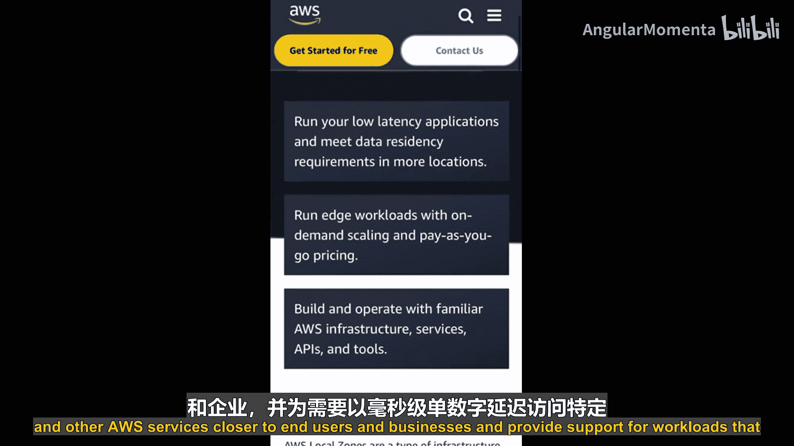

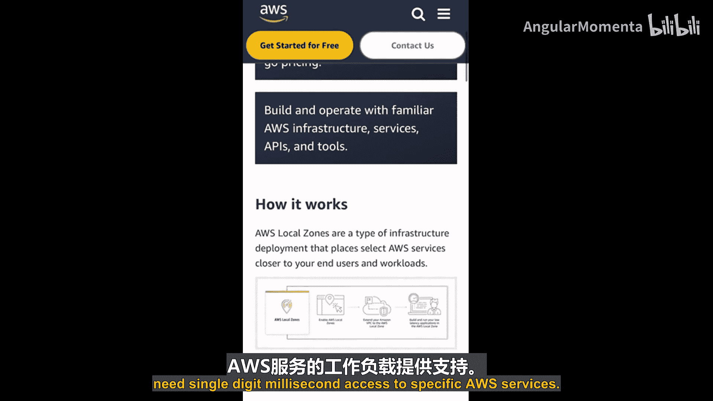

以下是Local Zones的其他典型用例：
*   数据处理
*   混合云迁移
*   具有本地数据驻留要求的工作负载
*   增强现实/虚拟现实工作负载
*   媒体内容创作与流媒体工作负载

---

## 如何使用AWS Local Zones？🔧

要使用AWS Local Zones，你需要遵循以下步骤：

1.  **启用Local Zone**：首先，你需要在你的AWS账户中启用目标Local Zone。
2.  **扩展VPC**：然后，你可以将父区域（例如`us-west-2`）中的任何**VPC**扩展到已启用的Local Zone。
3.  **创建子网与部署资源**：接下来，你可以在Local Zone内创建一个子网，并在该子网中部署EC2实例、RDS数据库等资源。

其配置关系可以简化为以下逻辑：
```
AWS 账户
└── AWS 区域 (例如: us-west-2)
    ├── 可用区 1 (例如: us-west-2a)
    ├── 可用区 2 (例如: us-west-2b)
    └── Local Zone (例如: 洛杉矶)
        └── 你的VPC的子网
            └── 你部署的资源 (如 EC2 实例)
```

---

## AWS专用Local Zones

除了标准的Local Zones，AWS还提供**AWS专用Local Zones**。

AWS专用Local Zones是为特定客户或社区构建和使用的Local Zones。它们旨在为客户提供更强的安全性和治理控制，适用于有严格合规性、数据主权或特殊性能要求的场景。


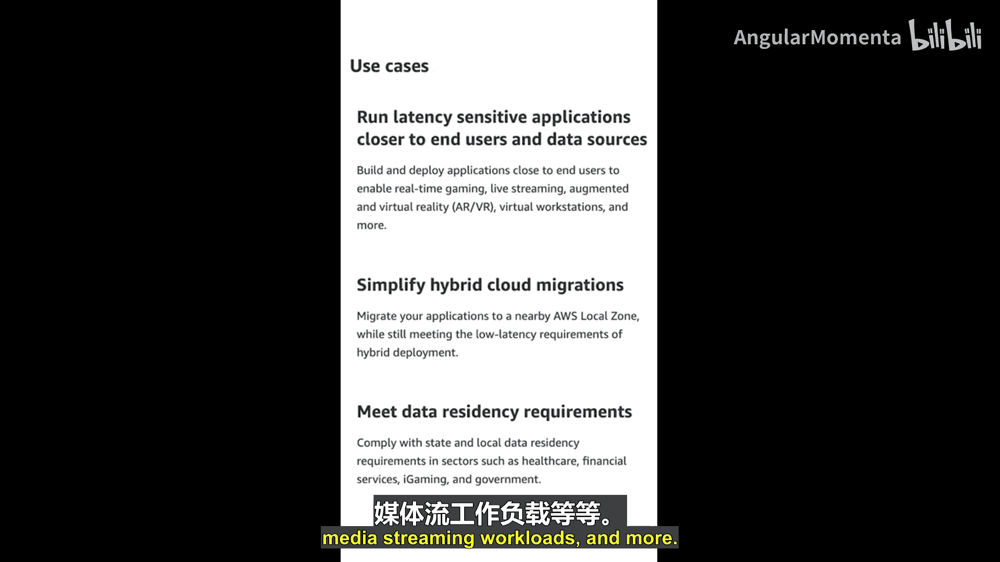

---

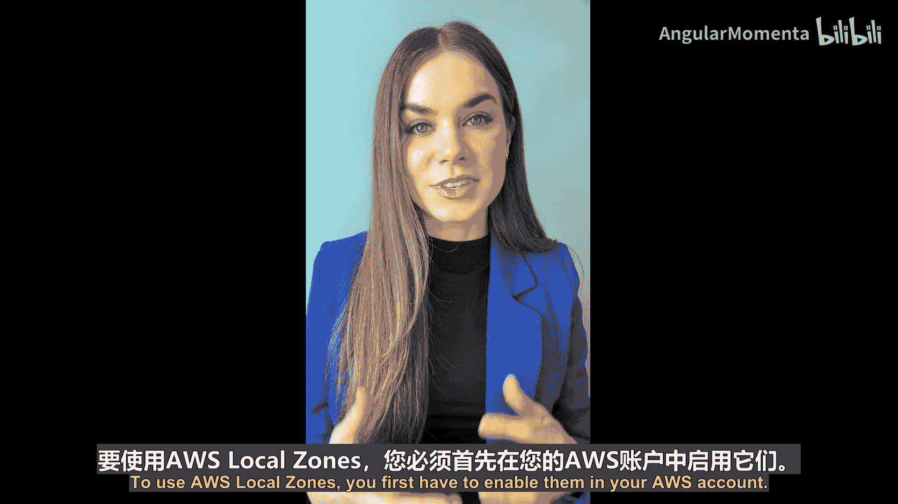

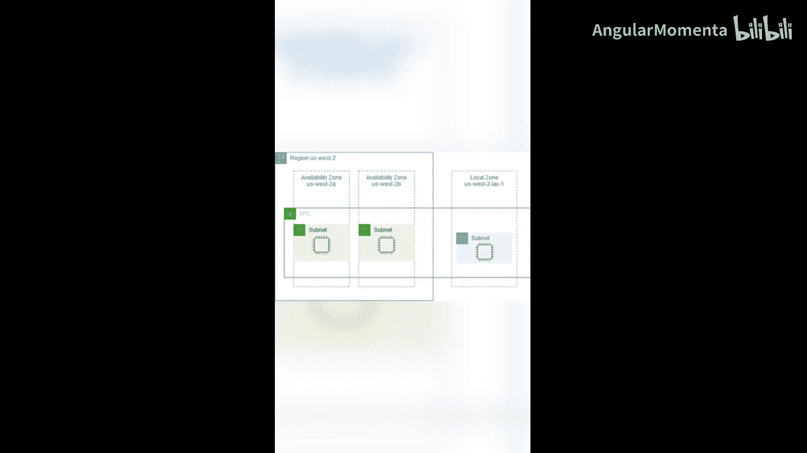

## 总结

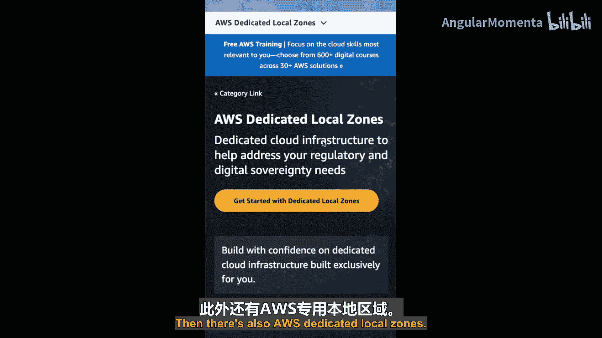

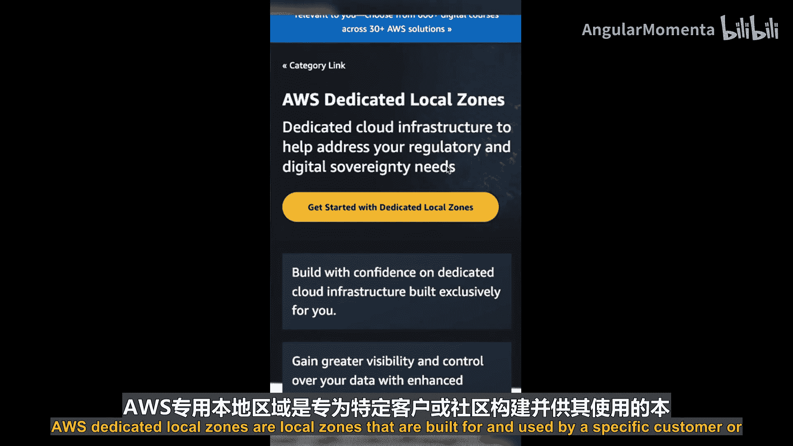

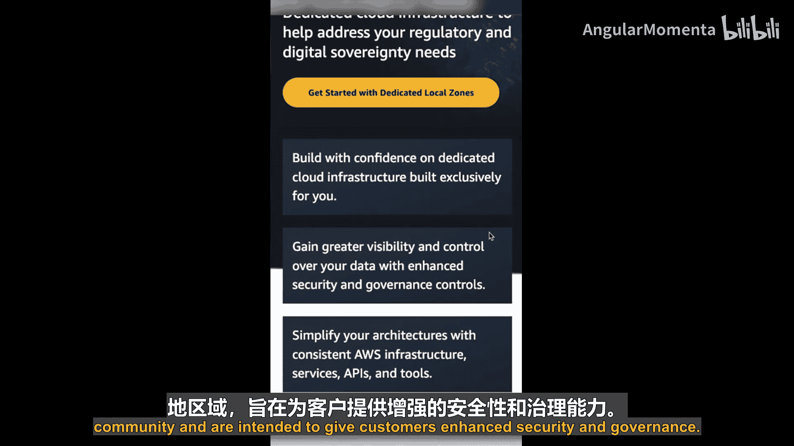

本节课中我们一起学习了AWS全球基础设施的最后一个组成部分——AWS Local Zones。

我们回顾了区域和可用区的概念，明确了Local Zones的定义及其降低延迟的核心价值。我们列举了其对实时游戏、流媒体等场景的适用性，并介绍了启用和使用Local Zones的基本步骤。最后，我们还了解了为特定需求设计的AWS专用Local Zones。

至此，AWS云基础系列课程也迎来了尾声。感谢你的学习。如果你想深入了解AWS，建议你查看**AWS Skill Builder**上的课程，你也可以在**Coursera**上找到我们的一些课程。


下次再见！