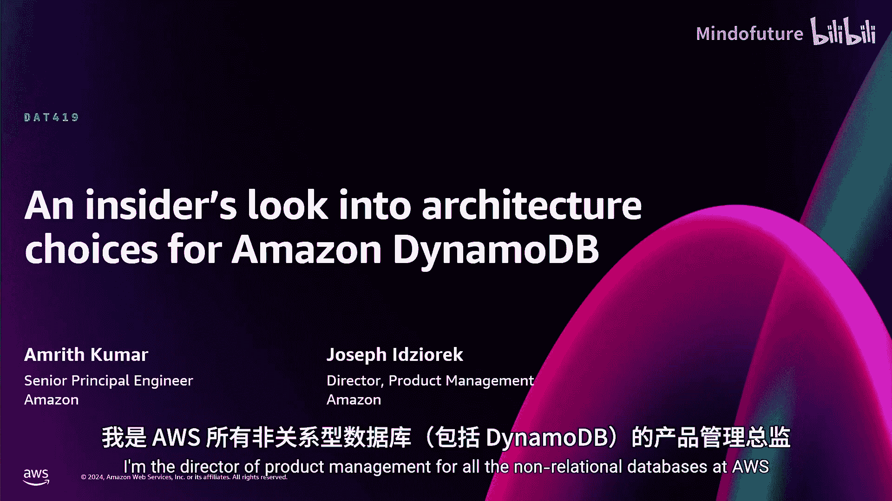

# 001：Amazon DynamoDB 架构选择的内幕洞察 (DAT419) 🚀

在本节课中，我们将深入探讨 Amazon DynamoDB 的核心架构设计原则。我们将了解 DynamoDB 如何实现近乎无限的扩展能力、高可用性以及大规模下的稳定性能。通过理解这些设计背后的“原因”和“方法”，你将能更好地使用 DynamoDB，并从中汲取构建分布式系统的宝贵经验。

我是 Josephified Zoric，负责 AWS 所有非关系型数据库的产品管理，包括 DynamoDB。

今天与我一同分享的是 Amth Kumar，他是 DynamoDB 的高级首席工程师。Amth 是那种能让每一天都变得更好的人，无论是从他那里获得反馈、学到知识，还是他的幽默感，都让我受益匪浅。今天能与他同台，我感到非常荣幸。我们对即将分享的内容感到非常兴奋。

我们将回顾 DynamoDB 过去做出的一些架构选择，以及我们为服务客户而持续进行的决策。我们将尝试更多地解释“为什么”以及我们如何实现某些功能，以便让你更好地理解如何使用 DynamoDB、如何思考 DynamoDB，并从我们遇到的挑战中学习。

观察屏幕上的这些客户和技术公司，它们有什么共同点？它们都拥有高吞吐量的应用程序，这些程序一遍又一遍地重复执行相同的操作：将商品放入购物车、获取出租车位置、启动会话状态、记录积分、获取游戏玩家状态。这些都不是复杂的查询。它们只是需要反复执行相同的操作。它们都使用 DynamoDB 来实现这一点。

因此，我们将讨论一些架构选择，探讨我们如何实现任意规模、高可用性以及大规模下的稳定性能，并思考如何减少性能波动。在我们探讨的过程中，我希望你建立的一个心智模型是：DynamoDB 本质上是一种优化。当我们着手构建 DynamoDB 时，我们并没有想做一个稍好一点的关系型数据库。我们真正想要构建的是一个在可扩展性、稳定性能和高可用性方面显著更优的系统。我们将讨论其中的一些方面。

按照亚马逊的习惯，我们总是从客户出发，思考我们真正要构建什么。这一切大约始于20年前。想象一下，你现在正在进行假日购物，而 Amazon.com 网站宕机了数小时，这在20年前确实发生过。对于在线零售商来说，这可不是好事。那么，在亚马逊，当发生如此重大的故障时，我们会怎么做？我们会撰写一份“错误纠正”文档。从技术角度，这份文档会深入分析问题所在，通过“五个为什么”分析法寻找根本原因，并思考补救措施。从这份文档中，我们学到的一个非常有趣的事情是：20年前我们使用关系型数据库的方式中，70%的访问模式是访问单个表中的单个键，20%只是访问单个表中的多个键。也就是说，我们在数据库上90%的操作与关系型数据库的任何关系能力都无关。

因此，Swwami 和 Warrner（你们本周可能已经听过他们的演讲）等人提出了疑问：为什么我们要用关系型数据库来处理这种工作负载？我们只是一遍又一遍地做同样的事情，为什么需要查询处理器？为什么需要启发式算法？为什么需要统计信息？为什么需要查询规划器？他们深入研究并撰写了名为“Dynamo 论文”的文章。实际上，他们在撰写论文之前已经在生产环境中运行该系统多年，因此他们能够从经验出发进行阐述。

Dynamo 论文是亚马逊在 NoSQL 数据库领域的首次尝试，效果不错，但也存在一些缺点。它仍然是一个自我管理的系统，只对亚马逊内部团队可用。多年来，我们继续使用 Dynamo。需要澄清的是，Dynamo 和 DynamoDB 是两个完全独立、不同的东西。是的，它们都是非关系型数据库，也都是分布式数据库，但它们是两个完全独立的系统。

我们继续发展，并开始与外部客户交流。我们发现许多外部客户在 MySQL 之上构建分片架构，面临着同样的问题：他们执行相同的访问模式，仅使用主键查找，并且需要投入大量精力来维护这些分片应用，尤其是在云和更可扩展的应用兴起之时。因此，在2012年，我们推出了 DynamoDB。到明年1月，它已经运行了13年。在这些年里，我们学到了很多，并且仍在不断学习未来的发展方向。

虽然我们在创新方面做了很多工作，你可以在“新功能发布”、博客等面向客户的内容中看到，但我们还在幕后做了大量工作，持续思考扩展性、高可用性、可靠性和稳定性能。今天我们将分享一些与常规功能发布略有不同的幕后工作。我还会谈谈一些实际促成这些功能的设计选择。

多年来，我们经常遇到这样的情况：客户选择 DynamoDB。外部有超过一百万客户使用 DynamoDB，这让我们对它的起点和现状感到谦卑。我们看到客户主要分为两大类：一类客户找到我们说，他们现有的数据库能力已经达到极限，或者他们计划构建一个从一开始就需要扩展的应用程序，他们知道将拥有数亿用户，需要一个能够扩展的数据库。例如，我们有数百个超过200 TB的表，有数百个表每小时处理超过10亿次请求，还有数百个表每秒处理超过50万次请求。

另一类客户找到我们说，也许有一天我们会发展到那么大，但我们真正喜欢 DynamoDB 的是它的“无运维”特性。我们不需要配置基础设施，不需要管理版本，不需要管理硬件，甚至几乎不需要考虑容量。这类用例也非常普遍。

因此，如果我们真正思考的是大型用例，并且以此为目标来构建，那么我们需要构建什么样的架构才能提供这些能力？你可以将 DynamoDB 视为一个分布式哈希表作为心智模型。我们需要思考如何提供一个近乎无限扩展且性能稳定的系统。为此，我们必须将 DynamoDB 视为一种优化，我们需要做出权衡以实现这些目标。其中一些权衡体现在我们提供的 API 接口范围上，通过限制接口范围来换取这些能力。

作为一个分布式系统，一旦数据脱离了单机系统（共享处理器、共享内存或共享磁盘），数据建模的重要性就凸显出来。这对于任何将数据分布在一台或多台机器上的系统都是如此，而不仅仅是 DynamoDB。你需要考虑数据模型以及如何放置数据。这就是为什么在 re:Invent 大会上，你会看到不少关于 DynamoDB 数据建模的讲座。Alex DeBrie 在这方面是大师，他是一位出色的演讲者。他的讲座和书籍之所以如此有价值，正是因为作为分布式系统，你必须考虑如何访问数据以及数据分布在何处。

为了让 DynamoDB 实现这些目标，我们对数据进行分区。我们将使用这个绿色的小图标来表示一个分区。你可以将一个分区视为一个计算单元，它有一定的读取、写入和存储能力。我们将你表中的数据项放置在一个或多个分区中。简化来说，你有一个表，有一个分区键。该分区键通过我们内部的哈希函数处理，我们使用该哈希函数来确定该分区位于哪个服务器上。

我们思考如何开始扩展一个数据库。考虑一个非常简化的场景：假设一个表只有一个分区，键值范围在0到9之间。现实中要复杂得多，但为了说明问题。你向该表驱动流量，或者增加流量（假设是一个按需表）。为了适应额外的规模，我们最终会拆分该分区。我们会拆分键空间，将一半的键空间（简化起见）放在一个分区，另一半放在另一个分区，然后继续扩展。你继续驱动更多流量，我们会继续拆分。

假设你继续向键3和4驱动流量。实际上，我们可以将数据库中的数据项分区或扩展到这样的程度：你甚至可以将单个主键放在一个独立的分区上。这是 DynamoDB 的一个关键设计点：我们从一开始就将其设计为可分区/分片的，一直细化到数据库中数据项的最小粒度。这不是事后添加的功能，也不是后来才想到的，这是我们构建 DynamoDB 时的核心设计原则。

那么，如果有了这样的架构，它能支持什么样的访问模式呢？作为一个哈希表，主键查找非常快，时间复杂度是 O(1)，非常直接。对于这种数据模型来说，这是一个非常好的访问模式，这也是它如此吸引人的原因。DynamoDB 还有范围键的概念（本次演讲不深入讨论），但除了分区键，范围键允许我们在给定分区键内进行范围扫描。当然，如果你同时拥有分区键和范围键，你也可以进行全表扫描。

我们在哪里见过这种模式？分区键查找或主键查找，占我们目标用例的70%；范围扫描占另外20%。这正是我们设计的目标，也是我们选择的架构，用以满足亚马逊内部的用例，事实证明这对亚马逊外部的用户也高度适用。

当我们审视 DynamoDB 的整体架构时，我们必须考虑的每一个方面都必须能够水平扩展。我们不能让服务中的任何一个组件成为其后其他层的瓶颈。我们对此思考了很多，无论是事务管理器、分区器、请求路由器还是负载均衡器，系统的每个方面都必须具备近乎无限的扩展能力，并且从一开始就内置其中。

既然我们谈到了分区，接下来让我们看看存储节点。在一个给定的存储节点内，我不想打破这个幻想，但无服务器背后的魔力其实是幕后有大量的服务器，我们做了所有艰苦的工作将其抽象出来，所以你确实不需要关心。但我向你保证，背后有非常多、非常多的服务器。逻辑上，你会想，DynamoDB 有一堆存储节点，我的表有很多分区，它们都驻留在某个存储节点上。如果我们是单租户系统，情况确实如此。但 DynamoDB 的一个关键点是它是一个真正的多租户系统。这使我们能够大规模地、高效地管理容量，从而为你们开发者提供那些在单租户系统中难以实现的能力。

我们观察数据的分布和一个存储节点。可能有一个存储节点，你的表在该节点上有一个分区。但在该节点上，可能还有一大堆其他分区，来自其他租户。DynamoDB 无服务器的“幻觉”就在于，让你感觉这些是专用资源。我们在这些服务器的资源治理上做了大量工作，以提供隔离和性能保证。

我认为，这项新功能真正赋予我们的能力是：如果你查看支持你表的所有分区，每个不同分区的吞吐量之和，真正告诉你这个表能够做什么。你查看这些分区的总和，这个概念已经存在一段时间了。如果你对 DynamoDB 非常精通，你大概可以推算出这一点，我们也曾与你们讨论过。但这是我们几周前刚刚推出的一个概念，我们称之为“预热吞吐量”。这真正代表了表的能力，是幕后分区能够支持你现有流量的能力。

为了说明为什么我认为这非常重要，以及多租户架构、横向扩展架构和我们这样做的方式为何对作为客户和开发者的你至关重要，请看这张图。假设你有一个按需表，我们沿着时间线看，顶部的橙色线代表预热吞吐量，这是你的表能够处理的能力。随着你持续向 DynamoDB 驱动流量，我们会不断拆分分区以增加更多资源来适应你的工作负载，从而有效提升该表的预热吞吐量。然后，当你的流量下降时，预热吞吐量仍然保持在那里，而你的流量可能降至零一段时间。预热吞吐量依然存在。因此，你获得了拥有专用资源的“幻觉”，尤其是在按需模式下，你只需为实际使用的请求付费，但你感觉好像有一大堆资源闲置在那里，这样当你的工作负载再次激增时，你不需要再次经历拆分或扩展的过程，资源已经就绪。这正是分布式、多租户架构真正能为我们的客户做到的。

接下来，我将把时间交给我的好朋友 Amrith。

大家好，能听到我说话吗？有人说“是”或“不是”吗？好的，谢谢 Joe。

做这个演讲很有趣，因为我热爱我的工作之一就是与你们——我们的客户——合作，理解你们试图解决的问题，以及我们如何能帮助你们。你们中有多少人的客户，会乐意你们的应用在任何时间点因维护而停机？如果你认为你的客户乐意接受维护和停机，请举手。我看不太清楚，但似乎没人举手。

我相信我们需要构建绝对没有停机的系统。你的客户需要这个，而为了做到这一点，你需要一个也能为你做到这一点的数据库。我在 DynamoDB 团队已经工作了四年多，不到五年。在这段时间里，我们计划内维护停机的总次数是：0。如果你使用 DynamoDB 有一段时间了，告诉我你收到过多少次邮件说 DynamoDB 将要升级因此会有停机时间？有人收到过吗？没有。

我们投入了大量时间来构建 DynamoDB 以实现这一点，并且我们很高兴能够做到。当然，墨菲定律总是存在的，意外也会发生。原因很简单：如果数据库需要维护，就意味着你的应用程序没有可用性。我在数据库领域工作了大约35年，没人喜欢停机，而构建高可用系统是困难的。你无法在事后才为系统添加高可用性。因此，我们做这类演讲的原因，就是告诉你们我们在构建高可用系统时学到了什么，因为我们知道你们也想做同样的事情。

我确信我们每个人在设计系统时都会犯错。请不要犯我们犯过的同样错误，犯你自己的错误，然后告诉我们，告诉所有人，这样我们都能学习。接下来的演讲将以一些规则和例子的形式展开。

Joe 谈到了 DynamoDB 的运营规模：数百个客户每秒驱动超过50万次请求。顺便说一下，这还不包括亚马逊自己。数百个客户每秒驱动超过50万次请求。

其中一件事，既然我们在拉斯维加斯，这个比喻很合适：如果你有一枚公平无偏的硬币，抛掷50次，预计会出现多少次正面？25次。期望值是总次数乘以概率。如果一个工程师来找你说：“我写了这段代码，我测试过了，它只在十亿次交易中失败一次。”你会接受这段代码吗？在我们这种情况下，“十亿次中失败一次”意味着这东西一天会失败很多次。绝对不行。努力构建一个没有故障的系统，因为在规模下，任何可能失败的东西，终将失败。这是统计规律。现实是，它会在最不方便的时候失败。在你最不想被呼叫的时候，你的寻呼机就会响。不，要设计你的系统，让它不失败。

我们做这些事情的方式，让我举个例子。在座的各位可能都听说过 DynamoDB 全局表。这是一个在四个区域的全局表示意图。你向任何区域写入，这是主动-主动模式。DynamoDB 全局表是主动-主动的。昨天，我们宣布了主动-主动、同步的全局表。在一个区域写入，它会同步更新到其他区域。我们是如何做到的呢？看上面的架构，你有一个单一的复制器。从 US East 1 的写入通过这个复制器传到 AP East 1。从 US East 2 的写入通过同一个复制器传到其他三个区域。这是另一种架构：每个区域组合之间都有一个复制器。这是两种选择。

我们思考了第一种和第二种。显然，第一种更便宜，对吧？你有一个复制器运行在一个主机上。这里我有三个复制器，每个方向一个。所以如果你在 US East 2 写入，会有一个不同的复制器（图中未显示）将数据传到 US East 1。四个区域，12个复制器。一个复制器 vs 多个复制器，你认为哪个系统可用性更高？第二个。这就是我们构建全局表复制的方式：对于每一对源和目的地区域组合，都有一个独立的复制器。为什么？因为 US East 1 和 US East 2 之间的网络链路可能出现一些延迟。你希望负责该链路复制的复制器也停止向其他区域的复制吗？不。你希望将故障域限制在出问题的那条链路上。如果你采用第一种架构，其他区域可能会受到影响。如果你想构建一个高可扩展、高可用的系统，开始思考什么会失败。当它失败时（因为它肯定会失败），它会造成的最小损害是什么？使用多个复制器。这就是我们开始思考的方式。

所以当有新工程师加入团队时，我们开始教他们这类事情。我再举一个例子。我告诉过你们我在数据库领域工作了30多年。在亚马逊，他们有一个术语，描述了我期待已久的东西：当你构建一个系统时，构建它来做恒定的工作，尽可能让系统在稳定负载下运行。原因是：当一个系统在各种可能条件下都以稳定负载运行时，如果发生意外，它也能继续运行。

思考一个带有缓存的系统。你有一个客户端，客户端绑定了缓存，还有一个数据库。缓存是很好的东西。如果你的缓存是热的，你99%的时间都能命中缓存，那么当客户端发出请求时，只有1%的流量会到达数据库。响应快，数据库负载低。这里有一个小测验，花一秒钟读一下。同样的计划，同样的缓存和数据库。你的客户端驱动着每秒20亿次请求的流量。你的缓存命中率是99.99%。你会如何设计这个数据库？我给你一个提示：不是“以上都不是”。除此之外，我不给更多提示了。让我们从底部开始，有多少人认为 D 是正确答案？认为 D 是正确答案的请举手。有人吗？好的。C 呢？有人吗？房间里有人吗？我看不到举手。B 呢？好的，我看到有几个人举了 B。有人选 A 吗？好的。你们应该去听听他们的演讲，你们知道正确答案，A 是正确的。

设计你的系统做恒定工作。假设缓存失效了。你这样做的原因是因为有时缓存可能会失效。在一个驱动着每秒20亿次请求的分布式系统中，想象一下，如果你设计的系统只能处理99.99%的缓存命中率。假设你正在对托管缓存的任何东西进行软件部署，你搞砸了1%的缓存。接下来，你的数据库就崩溃了。这不是一个高可用系统。如果你想构建一个高可用系统，它成本会更高，但从长远来看，这是值得的。所以前天我做了一个关于 MDS（DynamoDB 内部组件）的演讲。我们就是本着这种理念来设计它的：假设所有缓存都是冷的。因为总有一天，缓存会变冷，你会为此感谢自己，你的客户也会感谢你，因为你的系统保持在线。

所以，为高可用性进行设计，就是提前思考这些事情，并付出代价，因为这是值得的。让我再举一个类似的例子。DynamoDB 有请求路由器，你的请求到达请求路由器，然后被发送到存储你数据的存储节点，依此类推。和你们一样，每当有新硬件出现时，我们都喜欢使用 AWS 服务，因为它更高效。在我们运营的规模下，我们可以节省资金，可以为地球做贡献。我们测试了一种新的硬件，发现大约在每秒9000次请求时，这个请求路由器能够提供良好的延迟。标准做法是：驱动更高的请求速率通过请求路由器，利用率上升，延迟变差。这是红线，我们不能越过它。所以每秒9000次请求是它的极限。大家都明白这个意思吗？是的，好的。

那么现在的问题是：在标准操作下，你会设计这个请求路由器处理多少负载？你首先应该思考的是：什么会失败？DynamoDB 是一项区域服务。我们希望设计成能够承受单个可用区故障。整个可用区宕机了，我们进行了软件部署或者出现了网络问题，一个可用区没了，DynamoDB 应该继续运行。我们确定主机规格的方式是：当一个完整的可用区消失时，整个负载将落在请求路由器机群的正常环境中。如果9000是极限，你不能创建一个超过6000的主机。我们持续向我们的请求路由器机群添加主机，以确保在任何时候，单个可用区都可能宕机。这对我们有什么好处？你知道我们多久向请求路由器部署一次软件吗？持续不断地。在任何时间点，世界上某个地方都有数百个请求路由器正在获取最新版本的软件。它们只是下线，缓存变冷，然后重新上线，继续运行。这就是你为高可用性进行设计的方式。到目前为止都清楚吗？快速举手示意一下，有道理吗？好的。

第二条规则：当你构建复杂系统时，不要把它们构建成复杂的单体，要用简单的部件来构建。原因很简单：简单的部件有简单的故障模式。在许多地方使用相同的部件，在一个地方修复该部件的问题，所有地方都受益。你有一个复杂的单体，它有非常特殊的故障模式。你可以用这些简单的部件构建这辆看起来复杂的汽车。这是一个简单的 DynamoDB 架构框图。我们实际上将每一个都构建为微服务。在每个微服务内部，还有子服务。这给了我们很多优势。撇开所有技术细节不谈，亚马逊有一个“两个披萨团队”的概念，即一个团队能被两个披萨喂饱。康威定律指出，随着时间的推移，你的组织结构图和你的架构图会越来越相似。如果你将事物构建为小型微服务，你就有这样的优势：每一个都做自己的事情。请求路由器团队说：我向你暴露一个合约，你可以调用这个 API，我将服务这个 API 调用，我会在这个时间内完成。流团队说同样的话。每个组件都暴露一个 API，它们提供一个合约，并且它们是独立的故障域。它们不是一个单体系统，每一个都由自己的团队管理。我们将它们全部构建为独立的系统，各自独立地进行持续部署。

举个例子：我有存储节点，我有请求路由器。我们在你的存储节点上存储数据，每个数据项存储三个副本。请求路由器大多是无状态的。我们一直在进行部署。只要你一次只在一个可用区部署，就是完全安全的，因为另外两个可用区一直在运行。你想部署到请求路由器？去吧，你可以让整个可用区下线，你都不会注意到。通过思考这类事情来为高可用性进行设计。从长远来看，你将拥有一个更稳定、零停机的系统。

现在，你不能只是说“我写了一堆代码，我要在数十万台主机上部署一个存储节点”。所以我们花了大量时间做软件工程团队通常会做的事情：工程师进行一些开发，在沙盒环境中测试。当他们在沙盒中完成并提交后，代码会进入一个单箱环境，这是 DynamoDB 的一个较小环境，主要用于测试。然后是越来越大的集群：Alpha、Gamma、Zeta。我们在 Zeta 集群上运行非生产工作负载。在任何时候，如果出现问题，如果延迟出现回归，如果我们注意到内存使用率上升，如果你注意到文件描述符数量开始随时间增加，好的，立即回滚，找出问题所在。在你的工程组织中，一个好的实践是：建立这样的实践，规定在任何时候，如果你有问题，就回滚。你这样做的原因是：当你在规模下运营时，如果可能失败，它终将失败。总有一天你会在生产环境中遇到故障。如果那是你第一次思考如何回滚，那将不是一个好日子。持续计划：如果不行，就回滚。这应该是第一反应。如果你以规模设计你的系统，并且用足够多的、隔离的微服务来设计它，那么一个获得部署和回滚的组件，美国客户不会注意到，你的客户不应该注意到。

第三件事，既然我们正在进行持续部署，以兼容的方式进行这些部署非常重要。如果你部署代码，并且客户端和服务器之间有紧密的版本依赖，那就没有意义了。我们做了一个非常、非常慎重的决定：SDK 提供了一个非常薄的客户端。有些客户不使用 SDK，而是直接与原生 API 通信。你可以通过原生 API 做所有通过 SDK 能做的事情，但这个客户端是一个薄客户端。原因是：当你在规模下运营时，你认为这个客户端需要部署到多少台主机上？数万台。我们有客户部署到数十万台主机。如果我们说你需要同步更新所有客户端，那将非常可怕。如果你需要新功能，就更新到新的 SDK。如果你不需要新功能，就不更新 SDK。安全修复之类的事情意味着定期更新你的 SDK 是个好习惯，但当你设计那个系统时，要设计成你不需要同时对所有客户端进行同步升级。新的渐进式部署：部署到0.5%的主机，看看是否有效。然后部署到1%的主机，然后5%，以此类推。但始终要以能够适应渐进式部署的方式进行。

我们今年11月（两周前）推出了一个名为“预热吞吐量”的功能。这个功能做什么？它允许你作为客户说：我有一个表或索引，这个表或索引每秒可以执行多少次读取或写入。我们花了大约六个月时间进行开发。我们部署了整个功能，现在已有数百个客户在使用它。对于不使用此功能的客户来说，这完全是透明的。不需要预热吞吐量的客户，没关系。需要它的客户，他们只需要更新 SDK。我们花了很多时间来设计它。我们是这样做的：首先，有客户端，有 SDK。在客户端和服务器之间，有一个用于交换的数据模型。现在，这是一个向后兼容的数据模型。所有功能实现都在这里。在功能部署前的几周，我们开始查看 DynamoDB 中的每个表和每个索引，计算它们的预热吞吐量。我们构建了一个作业，它会说：你的表的预热吞吐量是多少？然后我们开始填充元数据。这发生在几个月前。我们有数十万个表，数百万个表，遍布34个区域。我们填充了元数据。现在有一个管道持续维护这些元数据。很好，现在这项工作完成了。接下来，我们向请求路由器部署了理解新 API 的代码，但我们禁用了它。如果出于某种原因，你发现即将推出这个功能，并且你使用预热吞吐量参数调用了 `DescribeTable` 或 `UpdateTable`，请求路由器会说：抱歉，我不知道。我们是如何部署的？我们一次部署一个可用区。代码被禁用，没问题，没人能用。好了，现在数十万个请求路由器都有了新代码。我们开始测试，启用了一些内部账户，开始测试，一切正常。我们检查了几个表，预热吞吐量看起来没问题。我们确保 CloudFormation 能够正确使用它，因为人们首先会通过 CloudFormation 使用 DynamoDB。我们启用了那个账户，一切正常。我们做了什么？我们发布了公告，翻转了开关。代码现在启用了。数十万个请求路由器现在可以接受新的请求。代码已经在那里了。我们发布了新闻稿，推出了 SDK。几个小时内，我们就有了第一批客户开始使用它。因此导致的停机总时间为：0。想要使用它的客户能够使用它。不想使用的客户，没问题。但是，SDK 被推送到了控制台。控制台也是 SDK 的用户。在我们翻转开关启用它的那一刻，如果你刷新控制台，你就会看到预热吞吐量。总停机时间：零。

我谈到了并行部署。安全部署很重要。我提到过，你的数据有三个副本，每个可用区一个。在规模下，如果可能失败，它终将失败。此时此刻，现在是周三晚上5点10分。全球范围内，有大约一百个存储节点要么正在软件部署，要么发生了故障或其他问题。它们状态不佳。上面有一些分区。这些分区现在只有两个副本，分别在另外两个可用区。向这个存储节点部署软件安全吗？不，那样你就只剩下一个副本了。所以，在我们进行软件部署的过程中，我们会检查该存储节点上的每一个副本。我们会去其他可用区问：你有冗余吗？如果你有冗余，那么我们就部署。如果你没有冗余，我们不会部署，我们会列出这些未部署的存储节点，稍后再回来清理。所有这些都是自动化的。我们在过去13年中学到的另一件事是：有些事情你永远不应该手动操作。整个软件部署过程是自动化的。如果你能使其自动化并持续进行，对你的系统也更好。

到目前为止，我们已经讨论了可用性部分，但客户选择 DynamoDB 的另一个原因是，除了它始终可用之外，我们还为你提供可预测的延迟，在任何规模下都有可预测的性能。让我谈谈我们为使这成为可能而做的一些事情。

Joe 之前谈到了这一点：大规模应用程序一遍又一遍地做同样的事情。想想你的应用程序，当你在规模下运营时，你的购物车会突然决定做别的事情吗，比如搜索？不，购物车做购物车的事情，搜索做搜索的事情，它们一遍又一遍地做同样的事情。我想让你思考的另一件事是：人类可以容忍延迟，但他们会发现不一致的性能是无法忍受的。他们要求一致性。我从波士顿飞到这里是六个小时的航班，没人抱怨这是六个小时的飞行。但它晚点五分钟，哦天哪，世界末日要来了，对吧？他们可以容忍延迟，但他们要求一致性，我相信你的客户也是如此。他们会在你的网站上多次搜索东西。有时搜索需要三秒，有时两秒。但如果它始终花费相同的时间，他们会容忍。但如果一次三秒，下一次十秒，他们会非常恼火。所以，你的客户要求提供可预测延迟的应用程序，我们的客户，亚马逊的客户，也要求同样的事情。因此，你的数据库也需要为你提供可预测的延迟。

除了带来更好的客户体验，这也让你更容易设计你的系统。所以我们花了大量时间来构建可预测性。让我告诉你我们做的一些事情，因为这些可能对你们也有帮助。如果你将可预测性和一致性视为两个轴，它们是正交的。你总是希望在任何规模下都是可预测的。我与刚开始使用 DynamoDB 的客户交流过。这是新事物，你不懂 SQL。我们之前在用关系型数据库，但它无法扩展了。我们要做个基准测试。我们担心我们的基准测试达不到真实规模。所以我们要测试一下，每秒一百万次请求。很好，他们测试了每秒一百万次请求，非常满意。他们进入生产环境，现在运行在每秒五百万次请求，他们很高兴。他们上线了。他们告诉我们的第一件事是：你知道吗，在每秒五百万次请求下，延迟完全一样。

在任何规模下都有可预测的延迟，这是我们非常重视的。就像你必须为高可用性进行设计一样，你也必须在你的应用程序中思考这一点。在我们的代码中，有些地方我们确实在计数。我们使用火焰图，查看代码中的执行时间，我们确实看到在每个代码部分花费了多少时间，并且我们花了大量时间来消除变异。如果你的代码在不同场景下要做非常、非常不同的事情，它就不会有可预测的延迟。所以我们努力确保它总是做同样的事情，并且花费大致相同的时间。

让我举个例子。DynamoDB 在许多可用区都有主机。假设你有一个客户端应用程序在这里，它恰好在可用区1。你解析了该区域 DynamoDB 的区域端点。假设我们终止了你的连接，或者将你终止到一个在可用区3的请求路由器。你发出一个一致性读请求。或者在这个特定情况下，你做一个写请求，而领导者恰好在可用区2。为了完成这个写操作，你在可用区1的客户端与可用区3通信，可用区3与领导者（恰好在可用区2）通信，领导者需要保证数据到达另一个可用区。我们已经跨可用区边界传输了无数次。领导者可能在另一个可用区，就像这里。现在会发生什么？在可用区内边界上的遍历次数完全不同。没有可预测的延迟。所以我们花了很多时间。我们去年构建了这两个功能，我们说：我们会查看你的客户端来自哪里，并尽可能尝试将你连接到同一可用区的请求路由器。当你发出请求时，如果是一个最终一致性读，我们尽可能在同一可用区内服务该请求，跨可用区遍历的总次数为零。为你的请求提供可预测的延迟。做同样的事情，如果没必要，就不要一直跨可用区边界。我说过，尽可能这样做。当不可能时，如果你尝试写入而领导者在另一个可用区，或者你做一个强一致性读而它在另一个可用区，我们将不得不进行跨区传输。尽可能一遍又一遍地做同样的事情。这需要一些思考和工程设计，你需要让你的开发者以这种方式思考。

另一类事情：我们谈论的应用程序一遍又一遍地做同样的事情。对我来说，写这样的 SQL 很简单：`SELECT 这三个字段 FROM 表 WHERE 某个条件`，对吧？如果你用关系型数据库做这个，第一件事是你要解析 SQL 语句，理解它，尝试弄清楚用它做什么，查看一些统计信息，尝试优化它。你在一遍又一遍地做同样的事情。我们说：尝试一遍又一遍地做同样的事情。上面那个词是什么？“统计信息”？统计信息本身就意味着变异性。如果你想要可预测的延迟，这是计划执行，一步完成。这是声明式模型和命令式模型之间的区别。我们选择这个模型是有原因的。

另一个例子：我们在 DynamoDB 中实现了事务。在关系型数据库中，你可以通过说 `BEGIN`，一些语句，另一个语句，等等来进行事务。它们是独立的语句，你可以穿插读写。在 DynamoDB 的事务中，整个事务都在 API 调用中。你们中有多少人遇到过这样的情况：调试一个似乎因某种原因在事务中间挂起的问题，然后你调试发现别人开始了一个事务，然后决定去喝咖啡了？在 DynamoDB 中不可能发生，因为整个事情都在那里。一遍又一遍地做同样的事情，但在相同的时间内完成。所以我们有意识地决定实现单次请求事务，因为我们想要可预测的延迟。

我想到的最后一条规则是：尽可能分而治之，并利用并行性为你服务。我们有数百个超过200 TB的表。假设我们将一个200 TB的表存储为单个分区，并且我们必须恢复它。故障隔离表明这将非常糟糕。但如果我把它切成小块，比如10 GB一块，顺便说一下，无论你的表是200 TB还是什么，16乘以10是160 GB。我们可以并行做所有这些事情，恢复时间是相同的。恢复时间就是恢复10 GB的时间。分而治之。但你必须在你设计应用程序的时候就思考这些事情，因为你无法事后添加这些。当我们有新工程师加入团队时，我们首先告诉他们这些事情。

许多客户想要可预测的低延迟。我们发现很多客户试图通过调整超时来实现这一点。这是危险的，我告诉你为什么。我们在内部发现，如果你有一个客户端向分布式服务发出请求，每个独立的服务器都会有一个响应时间特征，看起来像正态分布。如果你想要可预测的低延迟，那么向两个服务器同时发出相同的请求。如果一个请求恰好处于延迟曲线的坏端，而统计上另一个处于好端，就取第一个响应，继续前进。这不是亚马逊的发明，这是谷歌多年前一篇论文中的内容，我们的代码就在那里。

让我给你举个例子，同样的客户端-服务器带缓存。你想服务每秒20亿次请求，你有99%的缓存命中率，你有一个分布式数据库。如果你要服务每秒20亿次请求，你将如何确定那个数据库的规模？我们会这样做，我们内部也是这样做的：那个数据库将服务每秒40亿次请求。因为它不仅要对冲，还要以恒定工作运行，这是我们谈到的第一部分。所以如果 DynamoDB 每秒服务数亿次请求，我们内部的 MDS 数据库服务两倍于此。以可预测的低延迟，MDS 在几十微秒内完成。如果你想为高可用性和低延迟进行设计，这就是你必须教你的工程师思考的方式，也是我们做的方式。

我说调整超时是危险的，原因如下：

这是一个模拟，使用了与一些客户实际接触的数据，我们也在内部测试过。我移除了 X 轴上的延迟数值，因为具体数字不重要。客户对他们的应用程序进行了一些测试，看起来我们亚马逊建议他们使用较低的延迟。他们选择了一个延迟，就是这个红线。系统运行良好，运行了很长时间。所以我们做了这个模拟，我们说：好的，这是延迟的直方图。我们计算了高斯模型，这是两条曲线，它是一个三峰分布，很好。有非常小的一部分时间，他们遇到了超时。有一天，网络中发生了某些事情。这是他们应用程序的延迟。这意味着什么？他们的应用程序基本上陷入了中断。改变超时是一种危险的尝试改善延迟、改善响应时间的方式。对冲，要安全得多。

这些是我们学到的一些事情。让我快速回顾一下：

人类可以容忍延迟，但他们绝对要求你保持一致。
如果可能失败，它终将失败，为此做好准备。
用简单部件一遍又一遍地使用来构建简单系统。
以你将要做向后兼容的事情为理念来构建它们。
以你能进行持续部署的方式来构建。
以你能利用并行性为你服务的方式来构建。
归根结底，我们想要做的是构建“无聊”的系统。原因可能听起来有点奇怪：你们中有多少人，当你构建东西并使用 DynamoDB 时，你会喜欢说选项一：“我们决定将数据放在 DynamoDB 上，从那以后，它一直令人兴奋、着迷，我的寻呼机每天都在响”？我不认为你们中有任何人会这样。我们想要的是这个。这是一个真实的客户评价：“我们把数据放在 DynamoDB 上，它很无聊。”构建它，这样你的应用程序就不会让你夜不能寐。这是值得花时间的。

说到这里，我将把它交还给 Joe。谢谢你，Joe。你们应该能明白为什么和他一起工作很有趣。

好的，让我们快速回顾一下。我们讨论了 DynamoDB 的一些方面，我希望你对我们所使用和讨论的一些原则有了更好的理解，我们真正平衡了许多这些概念，思考我们能为客户做什么，以及我们应该如何推理接下来要构建什么功能。我想向你介绍我们今年做的一些事情。

如果你没看到，这对我们来说是一件大事：大约三周前，我们将按需价格降低了50%。我们团队工程师做的一些你看不到的工作是：我们持续优化我们的系统，直到我们能够将这些节省的成本回馈给我们的客户。我们不常这样做，但这次我们非常兴奋，让 DynamoDB 按需模式，我们真的希望它成为你的默认选项。这对客户来说工作量小得多，也更容易使用。有了预热吞吐量，你现在对表的能力有了更高的透明度，你现在有一个 API 来扩展你的表以增加吞吐量。这真是一件大事，我们非常高兴能推出这个。全局表也一样，我们降低了全局表的溢价。以前，当你跨区域写入 DynamoDB 时是有溢价的。现在，区域写入与复制写入的成本相同，没有溢价，成本一样。

我们在安全方面今年也有很大进展，推出了不少功能：基于资源的策略，这对于控制对特定表的访问非常有帮助，我们可以将策略附加到表上；私有链接支持；以及我们刚刚正式发布了基于属性的访问控制。所以，只是增加了与整个 AWS 系统的集成量。正如 Matt 昨天宣布的，我们为全局表添加了强多区域强一致性。以前全局表已经存在一段时间了，是最终一致性复制，我们现在有了同步复制，允许你为使用强一致性的应用程序实现零恢复点目标，并且能够跨 AWS 区域使用 DynamoDB 进行强一致性读取。

其他一些好东西：除了预热吞吐量和降价，我们今年还引入了一项功能，能够为按需表指定最大吞吐量。这对于开发测试非常有用。我收到很多工单，或者人们实际上有工单或测试工作负载意外激增了成本，我们通常会经历一番周折。但能够为你的客户或你自己在按需表上限制吞吐量，是一项很好的成本节约措施，在某些场景下非常有帮助。DynamoDB 现在有30个 ETL 集成，我们已经有 OpenSearch 和 Redshift，现在我们刚刚推出了与 S3 的零 ETL 集成。还有很多其他好东西。我们真正喜欢的一件事是，当我们的客户谈论他们在 DynamoDB 上构建的经验时。今年有一些来自客户的讲座，比如 Duolingo、JP Morgan、Maize、Roblox，来自不同行业、构建不同应用程序的客户。这些都会上传到 YouTube，强烈建议你去