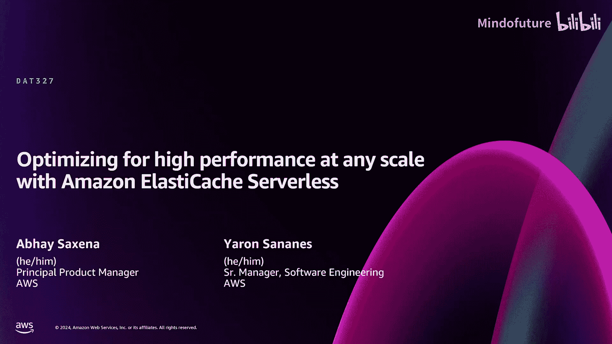
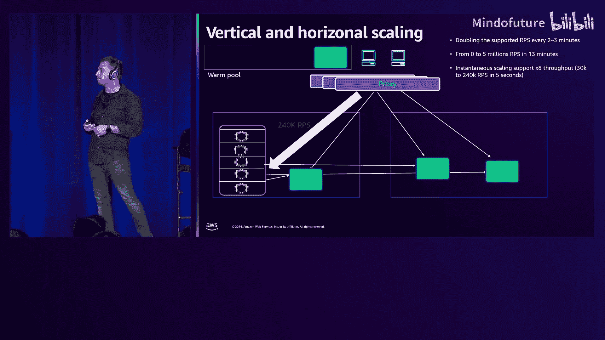
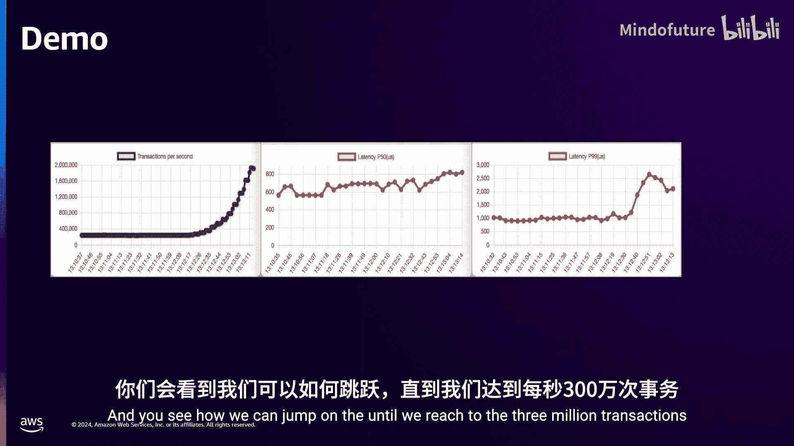
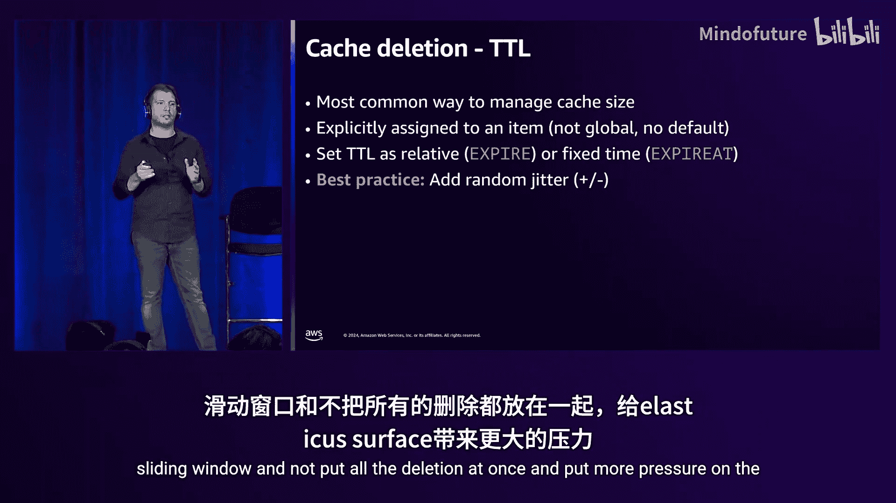

# 002：缓存策略与架构深入解析

在本节课中，我们将学习如何在无服务器架构中实现缓存，深入探讨 Amazon ElastiCache Serverless 的工作原理、过去一年的性能改进，以及如何将其高效地应用于您的应用程序。

## 什么是缓存？

在最基本的形式中，缓存是指将某些内容放在可以快速获取的地方。因为当您急需时，没有时间或无法承受去原始位置获取数据的延迟。缓存就是将数据放在一个易于访问、能够承受高频率使用并能提供极低数据获取延迟的位置。

## 为何需要缓存？

您可能会问，为什么需要缓存？最基本的原因是为了帮助降低延迟。在一个典型的无服务器架构中，客户端通过 Amazon API Gateway 与计算层（如 Lambda）通信，然后访问数据存储（如 DynamoDB）。应用程序运行缓慢的原因有很多，例如数据库查询昂贵或流量过大导致过载，网络可能因拥塞而增加延迟。缓存可以帮助减少这些延迟。

另一个常见的缓存原因是应对读密集型工作负载。如果应用程序需要多次读取相同的数据，例如用户的会话数据，您不希望每次都从数据库重新加载。虽然可以为数据库添加多个只读副本，但这会迅速变得昂贵。相反，添加缓存可以更快速、更低成本地扩展读取操作。

## 如何实施缓存？

在无服务器应用程序中添加缓存时，需要考虑多个方面。我们将涵盖屏幕上显示的所有主题。首先从缓存策略开始。

以下是几种主要的缓存策略：

### 旁路缓存 / 查询缓存

这是最基本或最基础的策略。计算系统首先从缓存读取数据。如果缓存命中，则直接使用数据服务应用程序。如果缓存未命中，则从数据库读取数据，然后将数据写回缓存。这本质上是一种旁路模式。

这种方法的优点是简单直接。您无需在数据库中部署特定逻辑，缓存可以存在于独立的系统，并且易于在应用程序中部署。应用程序逻辑的更改相对简单。您还可以通过计算层控制放入缓存的内容，从而控制缓存的大小。

这种方法的缺点是首次读取几乎总是较慢，因为数据不在缓存中，除非您实现特定的逻辑来预先填充缓存。此外，实现数据一致性很困难，因为数据现在存储在两个不同的地方：数据库和缓存。维护这两个源之间的一致性具有一定挑战性。

### 直写缓存

在这种策略中，数据同时写入缓存和数据库。这样做的好处是缓存中的数据几乎不会过时，因为您同时更新两者。一致性也更好，因为您同时写入。通常，在这种情况下发生缓存未命中的可能性较低。

缺点是写入操作会更慢，因为您需要写入两个系统。通常数据库是较慢的一方，因此写入延迟会增加。另一个常被忽视的点是缓存可能变得非常大，因为所有写入的数据都会同时进入缓存和数据库。

### 回写缓存

这是对直写缓存的一种优化。您先将数据写入缓存，然后立即响应应用程序。随后，在某个时间点异步地将数据写入数据库。这样，写入速度更快，因为应用程序无需等待数据库提交。这对于具有高写入吞吐量的应用程序非常有用。

缺点是实现复杂。您需要在计算层实现异步写入策略，确保数据最终能写入数据库，并且存在数据丢失的风险。如果计算失败，仅写入缓存的数据可能丢失。数据不一致也是可能的，因为异步写入可能导致状态不同步。

## 缓存一致性策略

我们讨论了如何实施缓存，这些是基本的缓存策略。缓存验证或数据一致性是一个难题，并非已完全解决，您需要考虑其中的权衡。

以下是几种主要的缓存一致性策略：

### 基于时间的失效

最基本的方法是设置生存时间。当从缓存读取数据命中后，经过设定的 TTL，缓存会自动驱逐该数据，导致缓存未命中。此时，您从数据库读取数据并写回缓存。

这种方法实现简单，大多数缓存服务都开箱即支持。您可以为每条数据设置 TTL，之后会自动失效。

然而，选择合适的 TTL 可能很复杂，通常需要基于判断。例如，用户会话数据可以设置一个合理的 TTL。但管理缓存和数据库之间的一致性很困难，因为在 TTL 到期前，即使数据库中的数据已更改，缓存数据也不会失效，从而导致不一致。

### 基于事件的失效

这种方法构建一个独立的系统来使缓存数据失效。如图所示，一个新的计算层（如 Lambda）通过读取 DynamoDB 流来消费数据变更事件。当数据变更时，该 Lambda 会使缓存中对应的数据失效或更新。

这种方法能实现更快的一致性。它仍然是异步的，但通常非常快，在毫秒或秒级别。它只在底层数据库发生变更时才使数据失效，比基于 TTL 的方法更快。

然而，这增加了实现的复杂性。您现在有了一个独立的缓存失效系统，需要测试和部署，为应用程序架构增加了复杂度，尤其是在这种依赖流和异步更新的系统中。

### 基于版本的失效

这是本演示中涵盖的最复杂但也最精确的方法。您为缓存中的每个键维护一个版本号。读取数据时，确保读取的是该键的最新版本。在多个系统同时访问缓存的高并发场景下，这能提供更高的一致性。

读取时，先获取键的版本，然后从缓存中读取该版本的数据。写入时，先更新键的版本，然后更新数据，确保下一次读取能获取最新版本。

可以想象，这实现起来比较复杂。您需要在计算系统中实现此逻辑。像 ElastiCache 这样的缓存服务通常不提供开箱即用的版本支持，但您可以自行实现，例如在缓存中同时存储数据和键的版本信息。如果您的应用程序无法容忍陈旧数据，并且需要在数据库和缓存之间保持更强的一致性，这是一个很好的方法。

## 如何在缓存中存储数据？

我们介绍了缓存策略和缓存失效方法，现在讨论如何在缓存中存储数据。我们将介绍几个用例，并说明如何使用 ElastiCache Serverless 存储这些数据。

### 会话管理

大多数应用程序开始使用缓存时，基本用途是会话管理，将用户会话数据存储在缓存中。通常，数据以哈希数据结构存储在缓存中。ElastiCache Serverless 支持 Valkey 和 Redis OSS 引擎，它们支持像哈希这样的高级数据结构，您可以在一个键下存储多个子值。

您也可以以 JSON 格式存储数据。ElastiCache Serverless 支持 JSON 格式，这是一种更结构化的格式，便于搜索数据，并支持更新 JSON 文档的特定部分。您可以使用这两种数据结构来维护会话数据。

### 速率限制

在无服务器架构中，另一个常用模式是速率限制。您可以使用缓存来实现这一点。其原理是，您希望限制对某个宝贵资源（如数据库或昂贵服务调用）的访问频率。

您只需在缓存中将数据存储为一个字符串，每次有人访问该资源时递增计数器。只要在给定时间窗口内的请求计数低于设定值，就允许访问。您通过 TTL 来控制时间窗口。例如，如果想限制在 5 秒内最多访问 10 次，就为该值设置 5 秒的 TTL，然后每次访问时递增。当计数超过设定值（如 10）时，就拒绝访问。在无服务器架构中，速率限制对于保护宝贵资源非常重要，使用无服务器缓存可以轻松实现。

### 缓存昂贵计算

如果您使用关系型数据库，某些查询可能非常昂贵。例如，在电子商务应用中，一个根据折扣和高评分从库存中拉取产品详情的查询，可能涉及多表连接，这会消耗大量数据库资源和时间。

如果用户正在查看网站上的产品详情并刷新页面，这些数据不会频繁变化。因此，这是缓存的绝佳候选。您可以将查询结果作为 JSON 文档存储在缓存中，并设置一个 TTL（例如，假设产品库存数据在几秒或几分钟内不变）。这样，您通过将昂贵查询结果存储在缓存中，显著降低了数据库的负载。

### 排行榜和排名

如果您正在构建游戏应用，希望存储顶级用户的数据，可以将其存储在有序集合中。如果您熟悉 Valkey 或开源 Redis，应该了解这些数据结构。ElastiCache 支持多种数据结构来存储不同格式的数据。

## 缓存基础设施考量

我们介绍了缓存的基础知识，包括策略、数据失效和存储方式。现在，让我们深入探讨缓存的基础设施部分。当人们设置缓存时，还需要考虑如何构建缓存基础设施。这正是像 Amazon ElastiCache Serverless 这样的托管服务发挥作用的地方，它可以在幕后自动处理许多工作。

### 大规模性能

我们在实现 ElastiCache Serverless 高性能方面投入了大量精力。我们支持多可用区数据复制，并在从副本读取时提供低延迟。系统内置智能，当应用程序从 ElastiCache Serverless 读取时，我们会检测请求来自哪个可用区，并将其路由到该可用区的本地代理节点，确保您获得本地可用区的读取性能。

我们能够从零扩展到每秒 500 万次请求。这个扩展过程在几分钟内（不到 13 分钟）完成。我们将在稍后讨论如何实现这一点。与去年相比，我们现在能够每两分钟将请求吞吐量翻倍，而去年是每 10 到 12 分钟翻倍。

这张图从高层展示了幕后工作原理。我们有一个代理层为 ElastiCache Serverless 应用程序服务请求。您的客户端应用程序与单个端点通信，请求被路由到本地可用区的代理节点。在幕后，我们自动为您控制扩展，既垂直扩展以提供瞬时突发容量，也水平扩展以随时间提供更多容量（即之前提到的每两分钟容量翻倍）。这提供了非常快速的高吞吐量性能，能够非常迅速地支持极高的规模。

### 代理架构的优势

代理架构还有其他好处。因为您与代理层通信，它向您的应用程序抽象了底层缓存节点的拓扑结构及其变化。例如，当拓扑发生变化时，您的应用程序不会与缓存断开连接，因为您连接到的是代理节点，代理有智能来快速维护与缓存节点的连接。

这使我们能够自动、透明地应用软件补丁。我们可以在不影响应用程序的情况下，自动更新缓存的所有主要、次要和补丁版本。

### 容量管理的挑战

部署缓存时，容量管理是一个重要考量。传统上，您需要查看过去一段时间（如六个月或一年）的峰值，并为此配置足够的容量。但当出现新的峰值时，您可能容量不足，或者需要手动扩展缓存。同时，在非峰值时期，您需要为未充分利用的缓存容量付费。

容量管理比乍看起来更困难。您需要考虑数据大小。根据之前讨论的缓存策略，缓存大小可能与数据库一样大，也可能只是子集。但在实际运行应用程序或进行大量计算之前，决定缓存大小是很困难的。

决定缓存每秒需要处理多少请求或吞吐量，会导致不同的计算需求。高吞吐量需要更高的计算能力。命令的复杂性也会影响所需计算容量。例如，排行榜应用中，需要从数十万玩家中不断找出前三名，即使是在内存中操作，这也是昂贵的计算，高吞吐量下需要大量计算。

有效负载大小会导致不同的网络需求，连接需求也会影响网络需求。因此，决定缓存需要多少容量并不简单。

### 无服务器的优势

无服务器本质上为您消除了所有这些烦恼。ElastiCache Serverless 的设计原则是无容量管理。我们确保在幕后根据应用程序增长进行扩展，并在适当时机内部缩减。但容量扩展或缩减的时机并不重要，因为您按使用付费。

基于无服务器原则，我们确保 ElastiCache Serverless 提供真正的按使用付费定价。您始终为存储在内存中的数据付费，也为在缓存上执行的请求付费。当您不执行任何请求时，您无需为计算付费。

## ElastiCache Serverless 深度解析

我们已经在高层面上介绍了无服务器如何帮助您实现缓存部署的基础知识，以及如何在应用程序中实现缓存。现在，让我们更深入地了解 ElastiCache Serverless 的工作原理，希望能让您一窥幕后机制，帮助您更好地理解如何为应用程序利用无服务器 ElastiCache。

### 高层架构

您的应用程序在您的 VPC 中运行，并通过我们提供的端点连接到服务 VPC。请求首先经过节点负载均衡器，将连接平衡到代理机群。

代理负责将请求路由到正确的分片。它封装了从您视角看到的所有连接性，但实际上比这更智能。代理使用多路复用连接，我们实际上有一个单一的 TCP 通道，可以发送多个不同的客户端连接。这样，在进行网络操作时，我们可以使用更少的系统调用，首先提高了性能，并最终帮助我们维护与存储节点更少的连接。

如图所示，我们的架构分布在多个可用区。这支持高可用性，如果一个可用区发生故障，您仍然可以访问数据存储。

我们可以承诺微秒级的响应时间，因为我们使用 Route 53 来定位与您应用程序运行在同一可用区的代理。

### 缓存节点与资源管理

您可能会惊讶，无服务器背后有许多服务器在运行，我们的工作是妥善管理它们，并在您需要无服务器扩展工作负载时进行扩展。

缓存节点运行在多租户环境中，共享 CPU、内存和网络等资源。我们的工作是持续监控，确保您有足够的容量和资源来运行工作负载。

我们密切监控每个物理主机上的硬件利用率，以确保您有足够的容量。例如，如果某个物理主机达到某些网络、CPU 或内存利用率阈值，我们需要开始移动资源以确保容量。

### 热度管理

我们首先采用热度管理。其目的是在整个物理主机机群中运行，将它们分类为“热”或“冷”，然后决定哪些缓存节点需要移动到其他物理主机。

我们使用“两个随机选择的力量”算法。我们总是移动第二热的节点，而不是最热的节点。原因是最热的节点可能正承受非常重的负载，可能正在进行扩展，我们不想中断它。但我们仍然需要找到一个缓存节点，将其移动到不同的物理主机后，能释放足够的资源。

一旦将其移动到不同的物理主机，我们开始缓解原始物理主机的压力，从而保持机群平衡，确保您有足够的资源运行工作负载。

### 应对突发工作负载

在某些情况下，会出现工作负载突发，例如直播活动或意外的流量高峰。您期望我们能够非常有效地消化和处理这些峰值工作负载。正如之前提到的，我们今年投入了大量精力，使我们的服务器比发布时快得多。

我们使用的平台技术没有固定的内存或 CPU 占用，允许我们非常快速、轻松地向上和向下扩展。这项技术在降低成本的同时提供了非常好的性能，因为我们使用了超额订阅技术。

它实际上允许我们即时地原地增长和缩减计算资源，在需要重新分片时提供额外的内存、CPU 和网络带宽。

这种能力使我们能够确保即时扩展。例如，我们可以在短短 5 秒内从每秒 3 万次请求跃升到每秒 23 万次请求。当工作负载激增时，我们能够快速消化它。

### 水平扩展

水平扩展主要有三个阶段。

第一阶段是检测。我们不断监控缓存节点和物理负载，确保您有足够的资源运行工作负载。不仅如此，我们还能通过监控使用模式来预测未来的需求，从而提前扩展集群。一旦工作负载激增，我们已经具备了消化工作负载的能力。

第二阶段是配置。我们可以在不到一分钟的时间内配置新节点并将其附加到集群。我们使用热池技术来实现这一点。热池技术是指我们有一组预安装的缓存节点处于待机模式，准备附加到现有集群。例如，如果达到某个 CPU 阈值，我们可以动态、快速地将缓存节点添加到现有集群，附加它们，然后它们可以迅速成为集群的一部分。

第三阶段是数据重新平衡。我们需要将数据移动到新附加到集群的分片上。

ElastiCache 中的数据存储按槽划分，每个槽代表一个数据范围。我们开始将数据从原始槽、原始分片移动到新分片。我们通过监控每个槽级别的使用情况来实现这一点，从而确定哪些槽比其他槽更“热”，然后平衡集群本身。

今年，我们还引入了同时向多个不同目标移动多个不同数据槽的能力，因此我们实际上可以每两到三分钟将支持的每秒请求数翻倍，这是一个惊人的结果。

### 连接性与代理

我们决定为 ElastiCache Serverless 产品构建一个单一的逻辑入口点，为此我们构建了代理。

代理使我们能够抽象底层集群拓扑的任何变化，与扩展、故障、修补、断开连接等相关的一切都对客户端隐藏。代理负责处理所有这些。

代理的主要工作是将请求路由到正确的分片。它不断监控集群拓扑，拥有一种分布式拓扑表，并确保拓扑表是最新的。这样，我们将管理拓扑的责任从客户端移除，由我们全权负责。

代理及其技术使我们能够支持幕后数百个连接的大规模扩展，同时只要求客户端管理单个连接。除此之外，它还能实现巨大的吞吐量扩展，正如之前提到的，我们可以在 30 分钟内从 0 扩展到每秒 500 万次请求。

### 低延迟读取与副本

如果您的应用程序对延迟敏感且没有强一致性要求，使用 ElastiCache Serverless 可以获得微秒级的响应时间。

ElastiCache Serverless 内置了两个副本，您无需配置，这是产品自带的，主要用于高可用性。但它也可以增加您的读取吞吐量并实现微秒级响应时间。

代理提供了到副本的单一入口点。如果您将通道配置为从副本读取，代理将始终尝试从同一可用区的最近节点读取数据，从而实现微秒级响应。您无需在服务器端进行任何配置，只需将建立的 TCP 连接通道配置为使用“从副本读取”选项即可。

以下是一个简单的代码示例，展示了如何连接到 Serverless，使用单一连接，启用 TLS（这是默认且唯一选项），并开启“从副本读取”选项。这样，代理将承诺始终从本地可用区读取数据（如果可能）。

### Valkey 引擎与性能优化

现在，我想谈谈缓存节点本身，并深入探讨我们在该领域投入的技术。但在此之前，我想先介绍 Valkey。

今年，Amazon ElastiCache 和 MemoryDB 宣布支持第三个开源引擎：Valkey。Valkey 是一个高性能的键值数据存储，是 Redis 的社区替代品。它由现有的 Redis 开源贡献者构建，是 Redis 开源 7.2 的替代品。它由 Linux 基金会托管，这保证了 Valkey 将永远保持开源。

回顾历史，Valkey 和 Redis 开源最初都是单线程架构。这意味着我们等待命令，一旦收到命令，就从网络读取数据，然后处理命令，最后发送响应。这种设计的主要优点是简单，没有竞态条件，无需同步，在扩展时可以受益于无共享架构，当然也提高了缓存一致性。

但使用这种技术，每秒大约只能处理 20 万次请求，大部分时间花在 I/O 读写上。

后来引入了 I/O 线程，其工作是将 I/O 卸载到不同的线程。这改善了 I/O 处理时间，因为卸载了 I/O 处理。但这项技术仍然不允许我们根据工作负载本身动态添加和移除 I/O 线程。

使用这种技术，我们能够达到每秒约 40 万次请求，这次大部分时间花在处理命令上。当然，原因是 I/O 已经卸载到不同线程，现在大部分时间将用于等待或处理命令本身。这种架构还有其他问题，例如主线程在等待 I/O 线程完成时处于空闲状态，我们实际上有额外的时间可以用来提高性能。

今年，AWS 为 Valkey 贡献了新的线程架构，以解锁单实例每秒 100 万次请求。这是一个惊人的贡献，我们通过三个主要方面实现：支持命令并行处理的异步 I/O 线程、基于实时使用情况在多个核心间分配 I/O 线程的智能核心利用，以及通过预取数据优化内存访问模式以最小化 CPU 缓存未命中的命令批处理。

现在，我们根据工作负载生成 I/O 线程，并可以根据需要添加和移除它们。它还要确保没有同步问题，因为它会不断保持客户端连接与 I/O 线程之间的亲和性，并确保每个线程有足够的工作负载来消化，从而完美利用硬件。

### 性能演示

我想展示一个非常酷的简短演示。我们从一个稳定的每秒 250 次请求开始，然后慢慢添加更多客户端和连接。您将看到每秒事务处理量的增长图，以及我们如何能够非常轻松、快速地消化越来越多的工作负载。

如图所示，P50 延迟有些波动，但我们仍然保持在毫秒级延迟以下，P50 延迟仍在微秒级。在 P99 上，我们看到有些跳跃到 3 毫秒，因为每次我们添加更多负载，直到系统达到某个饱和水平。但好的一点是，我们仍然将读取延迟保持在微秒级，并且可以看到我们如何跃升，直到达到每秒 300 万次事务处理量。

## 最佳实践

在结束之前，我想给您一些最佳实践，以更好地利用您的 ElastiCache Serverless。

首先，我们始终建议使用长连接以获得最佳性能。要知道，创建 TCP 连接与任何典型的批量命令相比，在计算上都是昂贵的操作。例如，使用现有连接时，简单的 GET 和 SET 命令要快一个数量级。

我们还讨论了“从副本读取”。如果您想扩展读取吞吐量并希望实现微秒级响应时间，需要使用“从副本读取”。您还应避免使用昂贵的命令，如扫描整个引擎，以免使其繁忙。当然，还要限制大对象的使用，因为它会影响网络带宽和 CPU 处理周期。

如果您将 ElastiCache Serverless 用于缓存，使用生存时间来管理缓存大小是很常见的。请注意，TTL 是针对每个项目设置的，而不是全局的。我们还建议使用相对选项或固定选项来删除它们，但最重要的是使用随机抖动，以便将删除操作分散到多个不同的滑动窗口，而不是一次性进行所有删除，从而给 ElastiCache Serverless 带来更大压力。

## 总结

在本节课中，我们一起学习了在无服务器架构中实施缓存的核心概念。我们探讨了多种缓存策略（旁路、直写、回写）及其权衡，深入了解了维护缓存一致性的不同方法（基于时间、事件和版本）。我们还介绍了如何使用 ElastiCache Serverless 存储不同类型的数据，并深入解析了其高性能架构，包括代理层、多租户节点管理、垂直与水平扩展机制，以及全新的 Valkey 多线程引擎如何实现每秒百万级请求的性能飞跃。最后，我们回顾了使用 ElastiCache Serverless 的最佳实践，以帮助您构建高性能、可扩展且成本优化的应用程序。