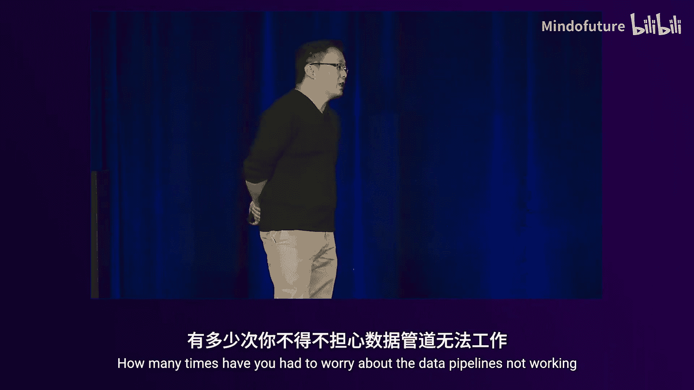
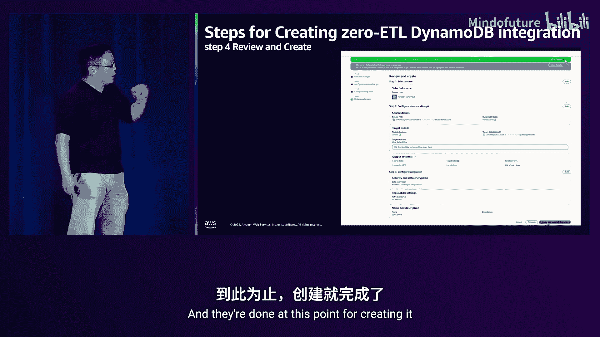
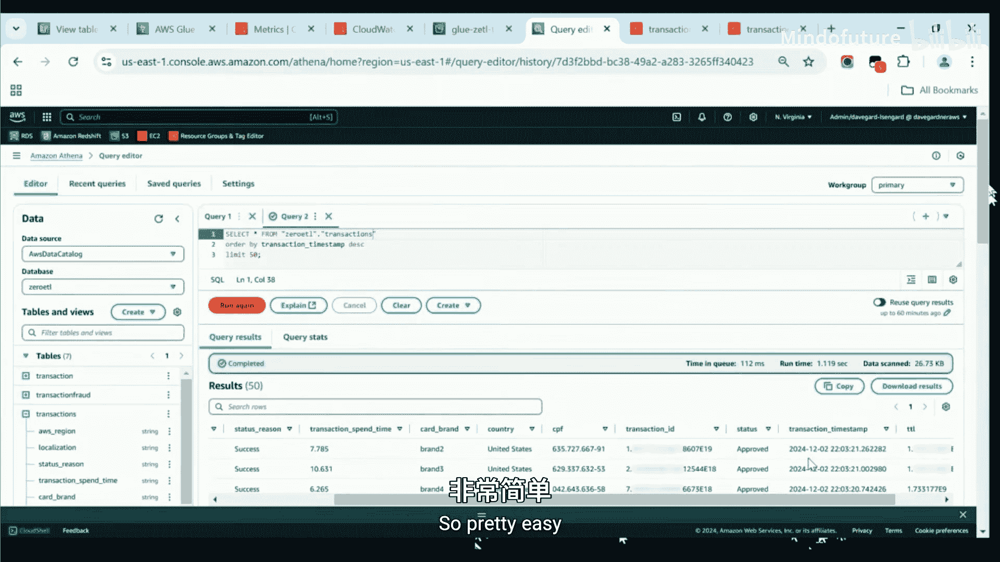
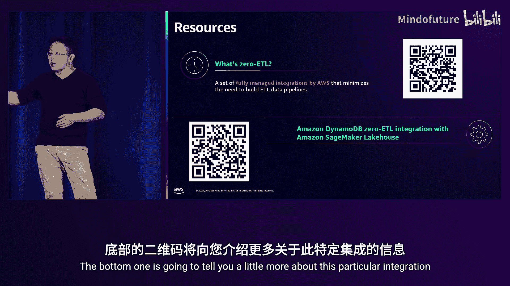

# 003：深入探讨Amazon DynamoDB零ETL集成

在本节课中，我们将要学习AWS零ETL（提取、转换、加载）集成的概念，特别是针对Amazon DynamoDB。我们将探讨其如何简化数据管道，使您无需构建和维护复杂的ETL流程，即可将操作数据轻松复制到分析目的地，如Amazon Redshift和Amazon SageMaker Lakehouse。

## 概述：数据驱动企业的挑战与机遇

越来越多的企业希望变得数据驱动，以支持个性化、营销优化、物联网等广泛用例。挑战在于，数据通常分散在多个来源，尤其是在生成式AI时代，需要将数据集中到统一位置进行模型训练、分析和转换。此外，数据在不断变化，企业需要确保拥有最新数据以进行实时推荐和分析。

通常的解决方案是构建自定义的ETL管道。这需要专门的技能和团队来开发、部署、调度和维护，以确保数据处理逻辑正确并处理错误。虽然对于需要复杂自定义业务逻辑的场景，这是正确的模式，但我们也发现，很多时候（例如超过25%的情况），客户只是简单地将数据摄取或复制到数据仓库或数据湖中，并未进行复杂的转换。日常运维成本可能过高，企业更希望获得一种“设置即忘”的简单解决方案。

## 什么是零ETL？🚀

AWS一直在投资零ETL的未来。零ETL是一套由AWS完全管理的、旨在最小化您为常见用例（如数据摄取和复制）构建ETL管道需求的数据管道。如果您的目标是从DynamoDB获取数据，并拥有一个包含所有持续更新的单一副本，零ETL可能是一个非常好的选择。

零ETL的整体目标是将事务数据、操作数据和应用程序数据汇集到一处，以便更轻松、更快速地进行分析和机器学习。它不仅支持各种AWS数据源（如DynamoDB、Aurora、RDS），还支持Salesforce、SAP、ServiceNow等应用程序，以及新的SageMaker Lakehouse数据湖。

零ETL的主要优势有三点：
1.  **提高敏捷性**：AWS为您构建和维护ETL管道，您的团队可以更自由地执行必要的业务转换，尝试不同的数据组合。
2.  **提升效率**：它是基于云的按需付费服务，您只需为流入和写入目的地的数据付费。它能够无服务器地自动扩展，无需您管理基础设施。
3.  **集中治理与访问**：数据被传送到集中且受治理的目的地（如Redshift或Lakehouse），安全且易于访问，其他AWS服务可以立即利用这些数据。

上一节我们介绍了零ETL的核心概念和优势，本节中我们来看看其背后的架构模式。

## 架构模式：命令查询职责分离（CQRS）

DynamoDB是AWS完全托管的NoSQL服务，具有无服务器、高安全性、高弹性等特点，可支持从每秒几次事务到亚马逊Prime Day期间每秒1.46亿次事务的任意规模。它通常用于会话管理、键值查找等操作型用例，提供个位数毫秒级的响应时间。

Amazon Redshift则是完全托管的AI云数据仓库，用于集中存储事务数据、点击流、物联网遥测等各类数据集，并通过熟悉的SQL接口进行跨数据集查询，以获取关键洞察。它是自学习、自调优的，可以处理高并发，并能随数据规模扩展，也提供无服务器选项。

每种技术都有其特定用途。DynamoDB服务于组织或应用程序的操作端（如前端应用、电商网站），而业务希望分析这些操作数据以生成洞察。使用正确的技术处理正确的任务是关键。

一种解决此问题的架构模式是**命令查询职责分离（CQRS）**。该架构将操作和分析解耦为独立的流，确保运行分析查询不会影响操作数据库的性能。操作端（如API网关）通过DynamoDB提供可靠的下游数据交付。DynamoDB Streams提供近乎实时的数据流，可以推送到OpenSearch等目标用于分析目的。对于S3等存储库，如果不需要秒级近实时更新，可以采用成本更低、例如15分钟批处理的选项。AWS在幕后会利用这些机制，以合适的成本和速度将数据传送到分析端。

这种架构方法的一个常见讨论点是DynamoDB不支持联接（Join）或任意属性搜索。通过将数据分离到两个专用的服务和应用程序中，可以很好地解决这些问题。

## DynamoDB零ETL集成详解 🛠️

DynamoDB数据复制管道中间那个巨大的红色方框，代表了数据工程师们过去不得不做的繁重、无差别的劳动。而零ETL功能的目标正是接管这部分工作。

设置零ETL集成非常简单，易于管理，并能实现强大的分析能力。其关键是将无差别的繁重工作变成一个“黑盒”。就像做早餐煎饼：您只需告诉我们需要多少煎饼，我们来为您制作和交付。

以下是DynamoDB到Redshift零ETL集成的关键特性：
*   **快速复制**：通常在15到30分钟内完成，对于大多数分析用例，几分钟的数据延迟是可接受的。
*   **无服务器扩展**：后端完全无服务器，可根据DynamoDB表的变更速率自动扩展管道。
*   **灵活性**：可以从多个DynamoDB表摄取数据到单个Redshift集群。由于DynamoDB本身不支持联接，通过零ETL将数据推送到Redshift后，您可以随心所欲地进行联接操作。

接下来，我们通过控制台演示如何设置一个这样的管道。

### 控制台设置演练

首先，在DynamoDB控制台中，找到新的“零ETL集成”菜单项并点击。选择“创建集成”，在下拉菜单中您会看到Redshift和OpenSearch选项。Redshift适用于分析用例，OpenSearch则适用于搜索功能（例如，汽车租赁公司搜索特定地点、颜色的可用特斯拉汽车）。

下一步是选择源。浏览DynamoDB表列表并选择一个。此时，一个便捷的窗口会弹出，提示您缺少正确的IAM策略。您可以点击“立即为我修复”按钮，系统会自动为您生成和配置所需的JSON策略，这极大地简化了操作。

然后，您将看到零ETL集成详情。创建用于数据摄取的数据库后，选择目标。在这里选择您的Redshift数据仓库。此功能支持跨账户操作，您可以选择不同的AWS账户，轻松地将数据从操作账户移动到分析账户。

### 数据映射与最佳实践

DynamoDB是一个NoSQL解决方案，表包含分区键和排序键，项目（行）可以有不同的属性。Redshift则是列式数据仓库，表有固定的列结构。

在零ETL过程中，DynamoDB的**分区键和排序键**会被直接映射到Redshift。而DynamoDB表中的**其他属性**，则会作为一个`SUPER`数据类型（本质上是嵌套的JSON）被带到Redshift中。这是因为DynamoDB中不同项目的属性可能不同。

关于最佳实践和注意事项，“立即为我修复”向导非常有用，您无需担心编写复杂的IAM策略。同时，跨账户功能已准备就绪。

## 新功能发布：集成SageMaker Lakehouse 🆕

除了已有的集成，AWS在近期发布了新功能：为DynamoDB添加了到**SageMaker Lakehouse**的零ETL集成。SageMaker Lakehouse是新一代平台，将您喜爱的服务统一到一个体验中。结合零ETL和Lakehouse，您现在可以将数据仓库、数据湖、操作数据库（如DynamoDB）和应用程序的数据统一到一处。

Lakehouse的目标是开放、可互操作且安全。其优势包括：
1.  **单一数据副本**：结合了Redshift托管存储的优势和S3的扩展能力。
2.  **集中治理**：通过Lake Formation和数据目录进行治理，易于定义安全策略并向多服务开放。
3.  **标准接口访问**：通过标准的Iceberg API接口访问，任何能理解Iceberg的服务都可以访问其中存储的数据。

这一新集成的目标是简化数据复制和摄取需求，使数据在不影响生产工作负载的情况下可用，并减少此类用例的日常运维负担。

### 新集成的增强功能

零ETL正在扩展，不仅支持DynamoDB等AWS数据源，也支持Salesforce等应用程序。我们保留了客户喜爱的“立即为我修复”功能。

针对Lakehouse目的地，新增了**输出设置**。现在，您可以对数据进行有限的转换，特别是可以选择对嵌套JSON数据进行**解嵌套（Unnest）** 的程度。您可以选择仅解嵌套顶层，或解嵌套所有数据，以便数据以行和列的形式存储在Lakehouse中，方便通过Spark引擎、Athena等其他系统轻松访问。

集成过程与之前类似：定义源（DynamoDB）、定义新目标（Lakehouse目录）、选择输出设置（解嵌套选项）、配置加密和复制设置（默认为15分钟），最后命名并创建集成。

## 实战演示：构建DynamoDB到Lakehouse的零ETL管道 🎬

让我们通过一个演示来具体了解如何设置。演示基于一个欺诈检测用例的DynamoDB交易表。

**前提条件：**
1.  为DynamoDB表**启用时间点恢复（PITR）**。
2.  在DynamoDB表权限中，添加一个资源策略，允许Glue和Redshift（取决于您选择的目标）描述表和使用PITR导出功能。

**设置步骤：**
1.  在Glue控制台，进入“零ETL集成”，选择DynamoDB作为源，并选择交易表。
2.  选择目标细节。在目录下拉列表中，选择“Glue目录”，然后选择数据库和策略。
3.  如果系统检测到权限问题，点击“立即为我修复”。
4.  在输出设置中，选择解嵌套选项，将DynamoDB属性转换为独立的列。
5.  配置集成名称、描述、加密和复制设置（默认15分钟），然后创建。

初始设置和数据的首次全量同步（称为“种子”过程）大约需要10-15分钟。之后，管道会每隔15分钟（或您设置的间隔）持续捕获变更（CDC）并同步到Lakehouse。

**监控与访问：**
*   **CloudWatch日志**：记录管道操作详情，包括种子和CDC过程的行数统计（插入、更新、删除）。
*   **CloudWatch指标**：提供可观察性，例如最后同步时间、摄取是否完成、插入计数等，您可以基于此设置警报。
*   **数据访问**：同步完成后，表会出现在Glue数据目录中。数据以Parquet格式存储在S3，并支持Iceberg表格式。您可以使用Athena编写简单的SQL查询这些数据，例如按交易时间戳排序，这比在DynamoDB中执行此类查询要灵活得多。

演示展示了在约10-15分钟内，通过几次点击就建立了一个持续运行的零ETL管道，使分析师和数据科学家能够直接访问操作数据进行分析，而无需频繁求助数据工程师。

## 总结与核心要点 ✅

本节课中我们一起学习了Amazon DynamoDB零ETL集成的强大功能。关键要点如下：

1.  **简化架构与管理**：零ETL由AWS构建和维护背后的ETL管道，极大地简化了您的数据架构和管理工作，让团队能更专注于创造业务价值。
2.  **无服务器与高效**：基于无服务器技术，按需付费，自动扩展，无需预置或管理基础设施，高效且经济。
3.  **即时数据可用性**：数据被集中、安全地治理，并立即可供Athena、Redshift、SageMaker Studio（用于数据处理、SQL分析、模型开发、GenAI应用部署）等多种服务使用。
4.  **更多选择与灵活性**：DynamoDB的零ETL集成现已支持OpenSearch、Redshift以及新的SageMaker Lakehouse，为您存储和使用数据提供了更多选择和灵活性。

总而言之，DynamoDB零ETL集成旨在减少数据工程负担，提高敏捷性，并使企业能够更轻松地成为数据驱动型组织。

---
*想要了解更多？*
*   扫描上方二维码（左侧）了解零ETL整体信息。
*   扫描上方二维码（右侧）了解此特定集成的更多详情。
*   请通过大会App完成课程反馈调查。感谢您的时间！