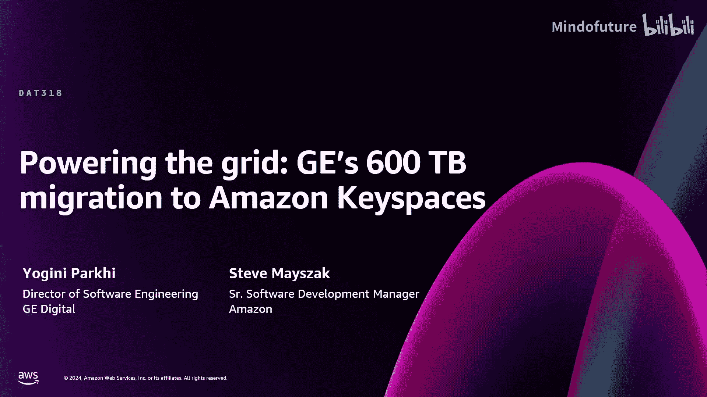
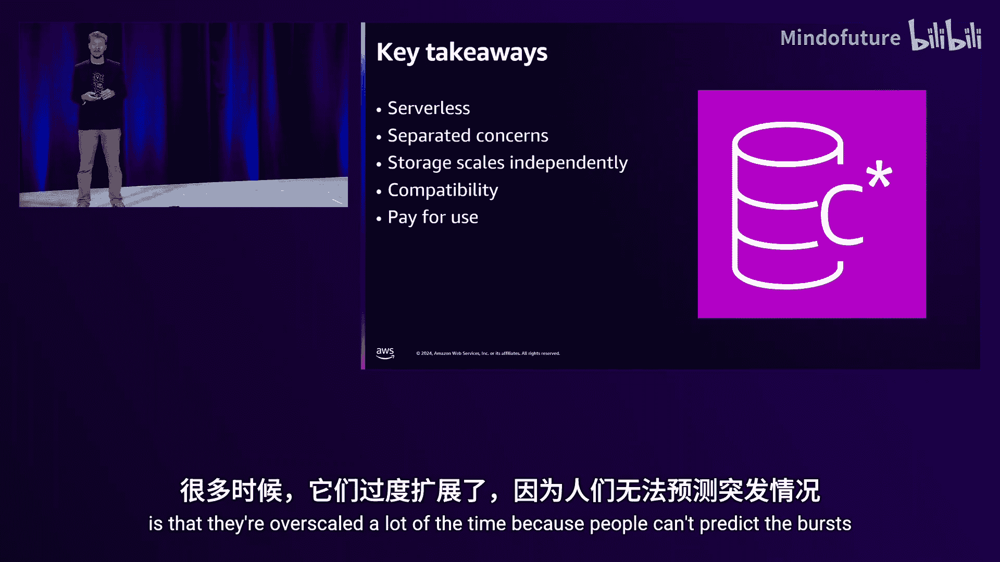
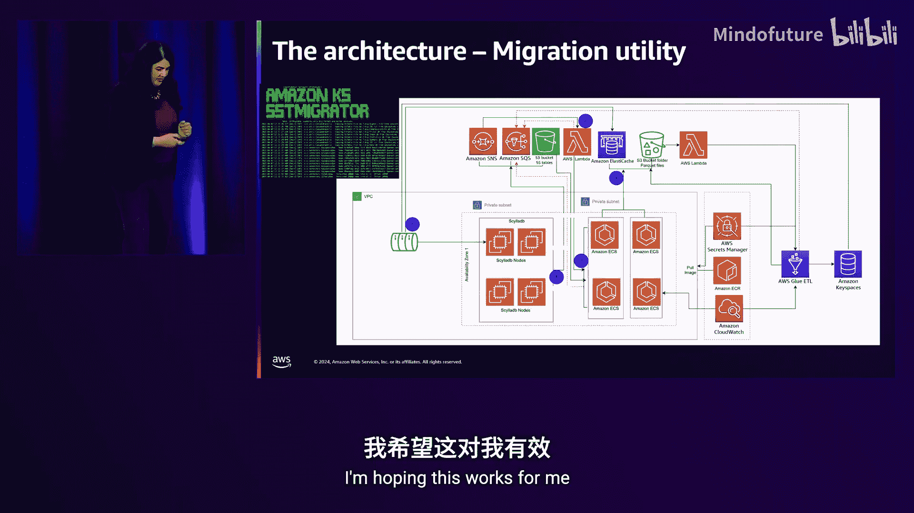
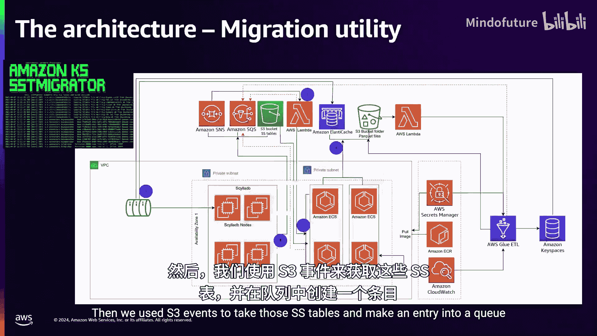
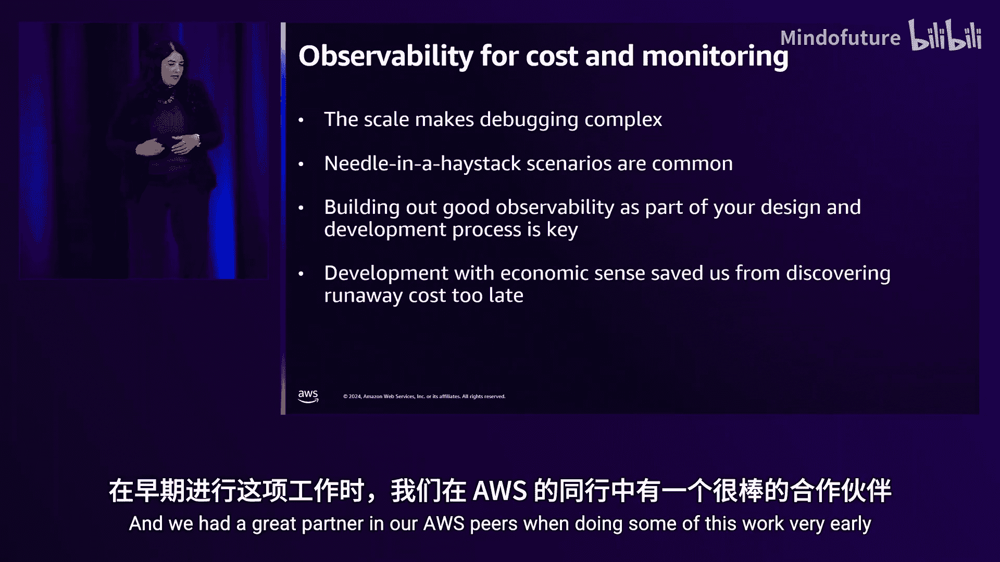
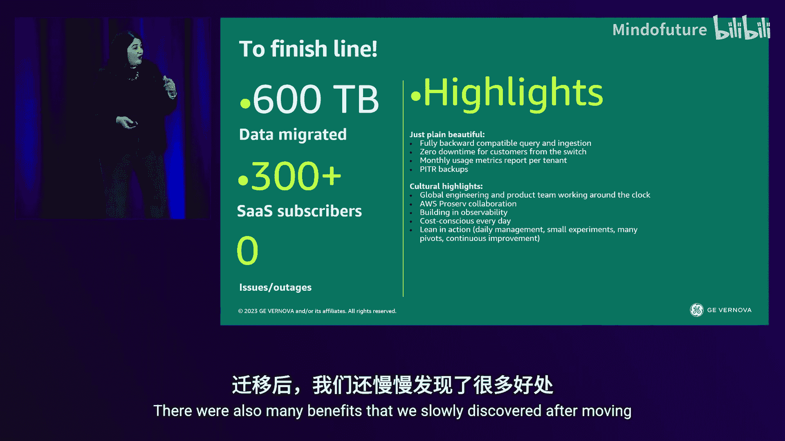

# 005：赋能电网——GE 600TB数据迁移至Amazon Keyspaces实战教程

在本教程中，我们将学习GE Vernova如何将一套关键的、承载着300家SaaS企业客户实时数据的600TB时序数据库，从自管理的Apache Cassandra迁移到Amazon Keyspaces。这是一个关于大规模、零停机现代化迁移的完整故事，涵盖了技术选型、架构设计、迁移策略和实战经验。

## 概述：为什么选择迁移？

上一节我们介绍了GE Vernova的使命和面临的挑战。本节中，我们来看看驱动这次迁移的核心原因。GE的团队运行自管理Cassandra集群时，遇到了诸多运维挑战：

*   **运维负担重**：需要手动处理数据压缩、节点扩展、补丁更新等。
*   **存在“吵闹的邻居”问题**：在数据洪峰期间，性能难以保证。
*   **灵活性不足**：难以根据不同的企业客户需求灵活配置数据生存时间。
*   **创新受阻**：团队大量时间花在数据库维护上，而非专注于满足客户需求的业务创新。

因此，团队决定迁移到**Amazon Keyspaces（for Apache Cassandra）**，这是一款与Cassandra查询语言兼容的**无服务器**数据库服务，旨在消除上述运维负担。

---

## 第一部分：从Apache Cassandra到Amazon Keyspaces

在深入了解迁移细节前，我们需要理解源端（Cassandra）和目标端（Keyspaces）的核心差异。本节将对比两者的架构与运维模型。

### Apache Cassandra 运维核心

Apache Cassandra是一个开源的、分布式的宽列NoSQL数据库。其设计目标是高可用、可水平扩展且无单点故障。对于运维人员而言，管理一个Cassandra集群涉及对以下核心组件的深入理解：

**单节点架构与写入流程**
一个Cassandra节点本质是一个单体应用。当写入请求到达时：
1.  数据首先被追加到**提交日志**中，确保持久性。
2.  随后数据被放入内存中的**MemTable**。
3.  完成上述两步后，即向客户端返回写入成功。
4.  当MemTable填满时，其内容会被刷新到磁盘，形成不可变的**SSTable**文件。

**SSTable与压缩**
*   每个表由多个SSTable文件组成。
*   SSTable可能包含有效数据、已过期数据、逻辑删除标记等。
*   **压缩**是一个关键的后台进程，它合并多个SSTable，清除过期数据和逻辑删除，以优化读取性能和磁盘空间。在压缩过程中，数据会被短暂复制，增加磁盘压力。

**集群与数据分布**
*   多个节点组成一个**令牌环**，通过哈希函数将分区键均匀分布到环上。
*   所有节点对等，通过Gossip协议通信。
*   通过设置**复制因子**（通常为3），数据被复制到多个节点以确保高可用。写入时，由协调节点负责将数据写入所有副本。

**运维挑战**
管理大规模Cassandra集群（GE的集群有54个节点）意味着需要持续监控磁盘空间、内存使用、执行压缩、处理节点故障、配置备份与恢复，并进行复杂的性能调优。这需要深厚的专业知识和大量的手动操作。

### Amazon Keyspaces 的核心优势

Amazon Keyspaces 是一项完全托管的、与Apache Cassandra CQL兼容的无服务器数据库服务。它从根本上简化了运维：

**无服务器架构**
您无需预置、管理或扩展服务器，也无需处理操作系统或数据库软件的修补、备份、压缩等任务。您只需为实际使用的读写和存储量付费。

**高性能与弹性扩展**
Keyspaces 保证个位数毫秒的延迟，并能随工作负载自动扩展。其秘诀在于架构上的解耦：
*   **客户端**连接到Keyspaces服务端点。
*   **请求路由层**处理查询解析和路由，可独立扩展以应对高连接数。
*   **存储层**基于Amazon DynamoDB久经考验的存储技术构建，数据默认跨3个可用区复制，并提供自动的分区管理以消除热点。

**企业级功能**
*   **高可用性**：提供99.99%的可用性SLA，支持多区域复制。
*   **安全性**：静态数据加密。
*   **时间点恢复**：支持精细到秒级的数据恢复能力。

**关键差异总结**
| 特性 | Apache Cassandra (自管理) | Amazon Keyspaces (托管) |
| :--- | :--- | :--- |
| **运维模式** | 手动管理节点、磁盘、压缩、备份 | 完全托管，无服务器 |
| **扩展性** | 手动添加/移除节点，重新平衡令牌环 | 自动、即时扩展，无需容量规划 |
| **可用性** | 自行设计并维护多副本、多可用区架构 | 默认跨3个AZ复制，提供SLA |
| **成本模型** | 为预置的容量付费（常存在资源闲置） | 按实际使用的读写单元和存储量付费 |

---

## 第二部分：GE Vernova的迁移实战

上一节我们对比了Cassandra和Keyspaces的技术特点。本节中，我们来看看GE团队是如何在保证系统零停机、用户无感知的前提下，完成这次史诗级迁移的。

### 迁移挑战与原则

迁移并非易事，GE面临严峻挑战：
*   **零停机**：系统服务300家SaaS企业客户，必须保证99.999%的可用性承诺。
*   **数据一致性**：迁移600TB历史数据的同时，还需持续处理实时数据流入。
*   **时间紧迫**：整个迁移计划必须在6个月内完成。
*   **成本可控**：需要在享受托管服务便利的同时，控制成本。

团队采用**精益**工作方法，核心原则是：**从小实验开始，基于数据决策，快速迭代**。

### 第一阶段：可行性实验与数据模型优化

团队首先进行了一个小规模实验：将实时数据双写到现有的Cassandra集群和新的Keyspaces表中。

**实验发现的问题**
实验暴露了一个关键问题：写入Keyspaces的数据量**激增了5倍**，导致存储和写入成本远超预期。

**根本分析与解决**
经过与AWS专家团队共同分析，发现根源在于其**数据模型**。GE的时序数据（传感器读数）值本身很小，但用于定位数据的**分区键非常长**（包含多年历史信息的标识符）。在Cassandra中，这影响不大，但Keyspaces的计费模型会计算写入的总数据量（包括键和值）。
**解决方案**：团队设计并测试了多种**哈希算法**，将长的自然键转换为短的哈希值作为分区键。这显著减少了每条记录的大小，优化了成本和查询性能。

**初期经验总结**
*   **从小处着手**：通过实验快速暴露问题，降低风险。
*   **数据模型是关键**：迁移到托管服务时，需重新审视并优化数据模型以适应新的计费和性能特性。
*   **紧密协作**：与AWS解决方案架构师和专业服务团队紧密合作，能快速找到解决方案。

### 第二阶段：历史数据迁移架构

解决了实时数据写入问题后，重点转向迁移数百TB的历史数据。团队设计了一个高效、可并行化的迁移流水线。

以下是迁移架构的核心步骤：

1.  **数据提取**：在每个Cassandra节点上运行脚本，将SSTable文件直接上传到Amazon S3。
2.  **事件驱动与去重**：S3上传事件触发Lambda函数，将任务放入Amazon SQS队列。这里有一个巧妙的**去重设计**：由于Cassandra每个数据有3个副本，会生成3份相同的SSTable。团队通过一个缓存机制，确保每个唯一数据块只被处理一次，避免了3倍的迁移成本和工作量。
3.  **转换与并行处理**：AWS Glue作业从队列中取出任务，将SSTable转换为Parquet格式。在此过程中，会提取**元数据**（如数据所属的客户/租户）。这些元数据用于动态规划Glue作业的并行度，确保不同数据量的客户都能高效迁移。
4.  **写入新库**：转换后的Parquet数据被另一个Glue作业写入Amazon Keyspaces。
5.  **流量切换**：采用**绞杀者模式**。当某个客户的所有历史数据迁移完毕，且其实时数据已稳定写入Keyspaces后，将该客户的查询流量从旧Cassandra集群切换到Keyspaces。此过程对最终用户完全透明。

### 第三阶段：精益的日常管理与挑战应对

管理一个运行数月、涉及数百万个并行Glue作业的迁移项目，需要卓越的运营管理。

**每日站会与数据驱动**
团队建立了跨时区、跨公司（GE、AWS、专业服务）的每日站会。会议严格**以数据为中心**，监控各项指标：
*   已完成的Glue作业数量与进度
*   Keyspaces的读写消耗与性能
*   错误率与重试情况
*   成本消耗情况

**应对突发挑战**
迁移过程中遇到了各种意外：
*   **成本警报**：一次因调试日志级别设置不当，险些导致月度账单激增。得益于CloudWatch的细致监控和团队的快速响应，问题在一小时内解决。
*   **弹性极限**：并行运行的Glue作业数量一度触及服务默认限制。在AWS支持团队协助下，迅速提升了限额。
*   **数据形状多样性**：不同客户的数据特征差异巨大，需要持续调整并行化策略。
*   **垃圾回收调优**：在数据转换管道中遇到了Java垃圾回收问题，通过实验不同GC算法得以解决。

**团队与信任**
成功的关键在于**人**。GE与AWS组建了真正的“一个团队”，建立了深厚的信任。关注团队成员的健康状态（例如，确保按时吃饭），保持透明沟通，是应对长期高压项目的基石。

### 第四阶段：收尾、验证与收益

**数据验证与最终问题**
迁移完成后，验证脚本发现极少量数据“缺失”。团队没有忽视，而是深入调查。最终发现，这些“缺失”数据源于多年前边缘设备的错误数据，本就不应存在于系统中。这次调查体现了对数据完整性的极致负责。

**迁移成果**
迁移取得了全面成功：
*   **零停机，零事故**：在整个迁移期间，生产系统保持100%可用。
*   **成本节约**：成功退役旧Cassandra集群，降低了总体拥有成本。
*   **团队解放**：运维负担消除，团队能专注于开发客户所需的新功能。

**获得的额外收益**
*   **时间点恢复**：获得了Keyspaces提供的精细到秒的数据恢复能力。
*   **配置灵活性**：可以按客户灵活配置数据留存策略。
*   **自动扩展**：无需再为流量高峰操心。
*   **卓越的可观测性**：内置的监控指标为系统优化提供了强大支持。

---

## 总结

在本教程中，我们一起学习了GE Vernova将其600TB关键时序数据库从Apache Cassandra迁移至Amazon Keyspaces的完整历程。我们深入探讨了：

1.  **技术选型**：理解了自管理Cassandra的运维复杂性与Amazon Keyspaces无服务器架构带来的解放。
2.  **迁移策略**：采用了“双写 -> 历史数据并行迁移 -> 绞杀者模式切换”的稳健方案。
3.  **核心挑战与解决**：包括数据模型优化、大规模并行迁移架构设计、成本控制以及应对各种意外挑战。
4.  **成功要素**：强调从小实验开始、数据驱动的精益管理、跨职能团队的紧密协作与信任，以及对数据完整性的不懈追求。

这次迁移不仅是技术的升级，更是工作模式的转型。它使GE的团队从繁重的数据库运维中解脱出来，能够更专注于其核心使命——推动能源转型，赋能电网。对于任何考虑进行类似现代化迁移的团队而言，这个故事提供了宝贵的路线图与实战经验。