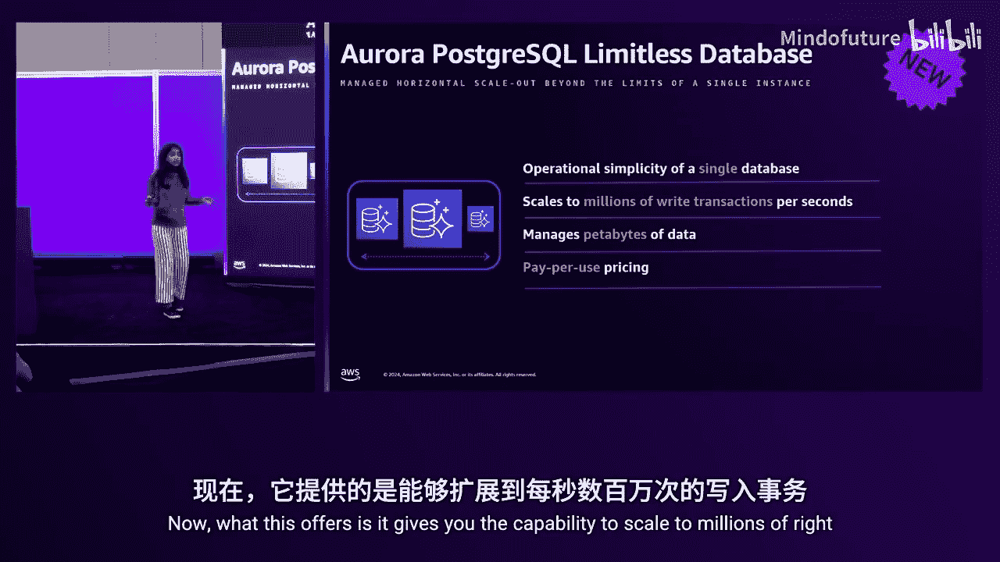
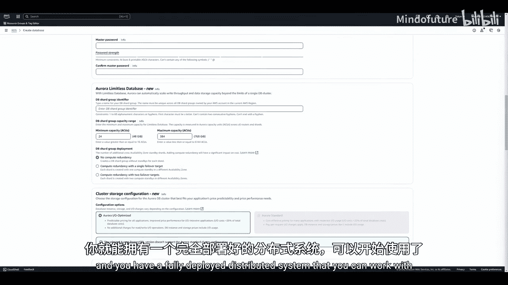
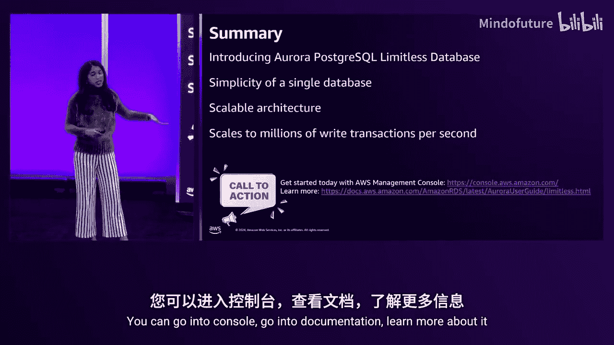

# 006：使用Amazon Aurora PostgreSQL无服务器扩展与Limitless数据库 (DAT338) 🚀

在本节课中，我们将要学习Amazon Aurora PostgreSQL Limitless Database。这是一个革命性的数据库服务，它允许您突破单个数据库实例的限制，实现水平扩展，同时保持管理单个数据库般的操作简便性。我们将探讨其核心概念、架构、优势以及如何快速上手。

## 概述：从单实例到无限扩展的挑战

上一节我们介绍了AI，现在我们必须谈谈数据库，因为大家对此都感到非常兴奋。

在当今数据密集型应用的世界中，如何将数据库扩展到超出单个数据库实例所能提供的极限？我的名字是A Jhangchei，我是Amazon Aurora的产品经理。在这个闪电会议中，我们将讨论我们最近为Aurora推出的最令人兴奋的功能之一。

我们将向您展示如何超越单个数据库的限制，同时享受管理单个数据库般的操作简便性。

## 传统扩展的困境：分片及其问题

当您的使用量处于合理水平时，通常的做法是配置一个数据库，将应用程序连接到它，一切就绪。

但很快，业务开始蓬勃发展，这很棒，但也给您带来了问题。您开始触及单个数据库所能提供的极限。

因此，您最终需要将数据库拆分成更小的组件，以便通过并行处理获得扩展能力。

现在，您从扩展问题转向了管理问题，因为您获得了扩展能力，但需要管理所有这些数据库。即使使用托管数据库，您也面临管理问题。

这通常被称为分片，您可能都熟悉这种技术。然而，分片带来了一系列问题，我将简要介绍其中几个。

让我们从查询路由开始。当您拆分了数据库并分布式存储数据后，您的应用程序需要知道应该查询哪个数据库。

另一个问题是数据一致性。现在您的数据库不再是单一组件，而是多个组件，您必须确保它们保持一致。当您进行任何更改时，例如添加列、删除列或在午夜进行备份，您可以在午夜运行语句，但每个备份不会完全相同。

最初，当您开始分片之旅时，您按边界分布了数据。但这就结束了吗？并非如此。当您的某个节点负载过重时，您必须重新分布数据。因此，分片实际上变成了一段持续的旅程，并且在整个过程中，您必须确保应用程序正常运行。

您还会遇到容量管理问题。您基本上必须找出系统中哪些部分负载较高，然后基于此故障转移到更大或更小的实例。最终，您可能会过度配置所有资源，导致两个问题：不仅是操作复杂性，还因为过度配置整个系统而支付大量费用。

## Aurora的解决方案：PostgreSQL Limitless Database

为了解决这个问题，Aurora推出了Aurora PostgreSQL Limitless Database。

这是Aurora为托管式水平扩展解决方案提供的答案。它能做什么？它为您提供了分片解决方案的能力和强大功能，同时具备管理单个数据库集群的简便性。

它为您提供了扩展到每秒数百万次写入事务的能力，能够管理PB级的数据。

但最终，您只需与一个单一的端点交互。因此，从您的角度来看，这个分布式系统在底层是一个单一的集群。

这是一个无服务器部署，这意味着您无需担心硬件、基础设施等任何问题。您提供一个容量范围，数据库会自动上下扩展。无论是垂直扩展还是水平扩展，系统都会根据您的工作负载需求自动完成，而从您的角度来看，它仍然是一个单一的数据库集群。

当然，您只需为实际使用的资源付费，因此无需再担心过度配置的问题。

## 快速入门：如何创建Limitless数据库

现在，让我向您展示如何开始使用。您现在可以做什么？这项服务已全面可用。

您看到的这个屏幕是AWS控制台，您可能都很熟悉。这是创建数据库的常规方式。如果您查看控制台并寻找API等，我即将讨论的所有操作，您都可以通过API完成。

我们推出了具有PostgreSQL兼容性的服务。进入创建流程后，该选项已默认选中，您无需进行任何操作。

为了让操作更简单，我们提供了筛选器，您可以选择“高扩展性”或“Limitless数据库”。选择该版本，然后向下滚动。这里是核心部分。

通常，在Aurora中，您需要为计算选择特定的实例类型，例如RG或R7r，这对应于特定的EC2实例类型。然后无服务器服务出现了。因此，您不再选择特定的硬件，而是指定一个容量范围，让实例在此范围内自动扩展，并且只需为实际使用的资源付费。

现在，我们在同一概念基础上进行了构建。因此，除了无服务器垂直扩展外，我们还为您提供了水平扩展。我们采用了与无服务器容量范围相同的概念。

您需要设置一个最小容量。这是什么？可以理解为启动时所需的容量，或者您希望始终保证可用的容量。这就是您的最小ACU。

最大容量本质上是您的预算上限机制。这是您不希望超过的预算点。这就像一个安全机制，防止系统产生巨额账单。

当然，我们使用了与无服务器容量测量单位相同的概念，即ACU（Aurora容量单位）。在此范围内，如果系统需要垂直扩展或水平扩展，数据库会自动处理。因此，您无需担心任何问题。

下一个选项是计算冗余。可用性是每个人的痛点。对于可用性，我们提供与Aurora相同的99.99%可用性。

如果您想选择此选项，必须选择其中一个计算冗余选项。只需点击一下，您就可以指定：我想要一个故障转移目标，或者我想要两个故障转移备用目标。这些只是点击操作，用于指定这个分布式系统。

以上就是计算部分。对于存储，该系统实际上共享Aurora的相同存储层，因此您无需进行任何操作，只需指定需要存储层。我们仅支持IO优化，这为您提供了可预测的价格和您已经习惯的优异性价比，我们在今年早些时候推出了此功能。

现在，只需选择选项、点击几下，您就可以拥有一个完全部署的、可以使用的分布式系统。

## 底层架构揭秘：路由器与分片

现在，Dave，该项目的工程负责人，将告诉我们点击几下后，底层发生了什么。

当您点击并开始创建集群时，我们将在三个可用区中启动您正在构建的系统的框架。通常，在Aurora中，您会有一个集群，然后创建实例。但正如A Jhangchei所展示的，您创建的不是实例，而是分片组概念。我们将分片组分布在三个可用区中，稍后我会解释原因。但在继续之前，我想强调的关键点是，这确实使用了现有的Aurora分布式存储系统。

这为我们提供了跨三个可用区的所有写入的持久性、弹性卷的增减、几乎无限的IO（仅受数据库节点所用网络大小的限制），以及十年创新和经过验证的持久性，覆盖了数十万个数据库和数万客户。

那么，在这个分片组内部有什么？首先，我们创建了所谓的分布式事务路由器（简称路由器）。这是您所有客户端数据库连接的去向。

这些路由器不是简单的代理，它们实际上是深度数据库节点。它们执行查询解析、规划、驱动执行，并且正如其名称所示，作为事务路由器，它们还协调事务系统，使整个系统能够为您提供一致的单一系统视图。

如您所见，路由器实际上分布在三个可用区中。这样，如果一个可用区发生故障，您的路由器已经在其他可用区中。我们可以使用无服务器技术就地垂直扩展它们，或者在正常运行的可用区中根据需要创建更多路由器。

但这些路由器实际上没有任何数据，数据在哪里？数据位于数据访问分片中。我们同样将它们分布在可用区中。在这个示例中，您有三个分片，它们的大小可以不同，因为我们在底层使用了无服务器技术。因此，当某个分片负载增加时，系统会自动适应，根据需要就地扩展节点或缩减节点。

我们还有故障转移节点，我们称之为计算冗余。我们特别称之为计算冗余，因为您的存储已经是跨3个可用区持久化的，因此存储不需要额外的冗余。这将是计算冗余设置为1的情况，意味着每个分片在另一个可用区有一个故障转移节点。在这种情况下，如果可用区1发生故障，分片1将故障转移到可用区2，分片3将故障转移到...（标签可能有误）。我们还有能力设置两个故障转移选项，即计算冗余为2。

这就是系统内部的情况。这些数据访问分片，正如我所说，它们管理和拥有您数据库一部分的数据。它们接收来自路由器的查询，管理自己的本地事务，执行结果并通过路由器返回结果。我们构建的事务系统的一个有趣之处在于，我们将事务时间从路由器传递到所有分片。这使我们能够对所有数据提供一致的快照隔离视图，无论它是单分片事务、多分片事务、单语句隐式事务、多语句显式事务、存储过程还是函数。您将获得与传统的单节点PostgreSQL系统相同的可重复读快照隔离或已提交读隔离级别。

## 表类型与数据分布策略

那么，在这个系统中，表是什么样子的？我们提供了几种不同的表类型。

首先要讨论的是最有趣的一种：分片表。

我们将以客户表为例。我们不想改变您在CREATE TABLE语句中使用的PostgreSQL语法，因此我们为您提供了一个会话设置，您在执行CREATE TABLE语句之前设置它。我们只需将创建表模式设置为“分片”，并指定分片键为客户ID。分片键可以是包含多个列的复合键。这个示例只是一个简单的客户表。然后我们运行CREATE TABLE customers，它将获取我们设置的选项，并将客户表的部分内容分布到整个系统中。

在这个架构中，当我们执行分布式多分片查询时，我们会进行分布式多分片连接。您运行此系统的真正原因是性能和可扩展性。为了从任何系统中获得最佳性能，您希望正在处理的数据与正在处理的计算位于同一位置。一个常见的模式可能是频繁连接客户表和订单表，并且您可能在客户ID上有一个主键和外键关系。因此，为了获得最佳性能，我们为您提供了使用此并置参数将这些表并置在一起的选项。这意味着对于任何给定的客户ID，该客户ID的所有订单将与客户记录位于同一分片上。

因此，如果您在它们之间进行连接，路由器实际上能够将SQL推送到数据所在的位置，在本地处理并获得最佳性能。

我们这里还有另一种表，我们称之为参考表。例如，您可能有一个税率表。在处理订单时，您可能需要找出订单来源管辖区的税率。这些数据不经常更改，您可能每晚刷新一次，但它不是您热事务路径的一部分，除非您从事非常特殊的业务。对于我们大多数人来说，我们不会每秒写入新税率一千次。因此，您可以将税率表创建为参考表。当您创建为参考表时，该数据存在于每个分片上。因此，所有税率的所有行实际上在每个分片上都是重复的。它们具有事务一致性，您可以对它们进行更新和写入，这些操作将是事务一致的。但如果您希望扩展聚合存储或聚合吞吐量，将热表作为参考表没有意义。

因此，我们将其放在这里用于连接。现在，如果您在客户、订单和税率之间进行连接，我们可以将整个连接推送到该客户ID记录所在的位置。

关于参考表，正如我所说，它们是强一致的。因此，不是写入一次然后最终复制到各处，而是强一致的写入，并且它们支持连接下推。

## 性能表现：百万级事务处理能力

我们将快速讨论一下性能，谈谈系统实际如何执行和扩展。这是我们实验室的一个示例。实际上，这是在我们自己的测试中运行的，但确实是在美国东部1区的生产系统上运行的。我们以客户身份启动，并覆盖了一些配额以获得大规模扩展。如果您需要达到这个规模，请联系我们，我们可以为您提高限额，因为我们不希望您直接耗尽所有资源。但让我谈谈为什么这是一个如此庞大的系统。这是一个进行分片更新的示例。我们这里有一个1000亿行的表。

我们正在对这个1000亿行表中的随机行进行更新，这是一个写入事务，包括更新和提交。我们获得了如此高的吞吐量，以至于需要三台不同的24核机器来驱动客户端。这代表了数千个数据库客户端，但每台驱动机器每秒执行超过80万次提交。总体而言，这个系统每秒运行255万次提交，不是每分钟，而是每秒。这在您的数据库中是一个巨大的提交量。整个过程的平均延迟为2.4毫秒。这是从客户端到路由器、更新到分片、跨3个可用区持久化提交、结果返回给客户端的测量时间。每秒255万次事务，延迟仅为2.4毫秒。这只是该系统能够扩展并达到您以前在PostgreSQL数据库中从未达到的性能和写入吞吐量水平的一个示例。

## 总结与行动号召

那么，在过去的15分钟里，您学到了什么？您了解了Aurora PostgreSQL Limitless Database是什么。

因此，如果您正在寻找一个兼容PostgreSQL的水平扩展解决方案，这就是您想要使用的。您看到了它如何为您提供分片的能力，同时保持单个集群的简便性。

我们讨论了支撑这一切的底层可扩展架构，正如Dave刚才提到的，它可以扩展到每秒数百万次写入事务。我们这里讨论的是提交。

今天的行动号召是：该服务已全面可用。您可以进入控制台，查看文档，了解更多信息。这里列出了一些您可能感兴趣的相关会议。今天是星期四，所以其中一些会议已经结束，但我们会在YouTube上发布视频供您观看。

请务必完成调查问卷，非常感谢您的参与。谢谢，谢谢。

感谢Anna。感谢David。请务必填写调查问卷。

---

**本节课中我们一起学习了：**
1.  **传统数据库水平扩展（分片）的挑战**，包括查询路由、数据一致性、持续重新分片和容量管理问题。
2.  **Aurora PostgreSQL Limitless Database的核心价值**：提供类似分片的无限扩展能力，但通过单一端点和管理界面，简化了操作。
3.  **其无服务器架构**：通过指定ACU容量范围，系统自动处理垂直和水平扩展，您只需为实际使用付费。
4.  **底层架构**：由分布式事务路由器和数据访问分片组成，利用Aurora的分布式存储实现高可用和持久性。
5.  **表类型**：支持**分片表**（通过`shard key`分布）、**参考表**（全量复制到各分片以实现高效本地连接）以及普通表。
6.  **卓越性能**：实验室测试中实现了每秒超过250万次写入事务（提交），平均延迟仅2.4毫秒，展示了其处理超大规模工作负载的能力。
7.  **快速入门**：通过AWS控制台或API，只需几次点击即可部署一个完整的、可扩展的分布式数据库系统。