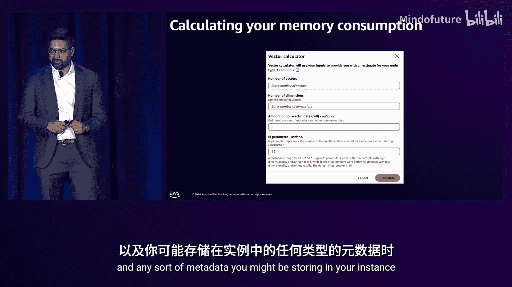
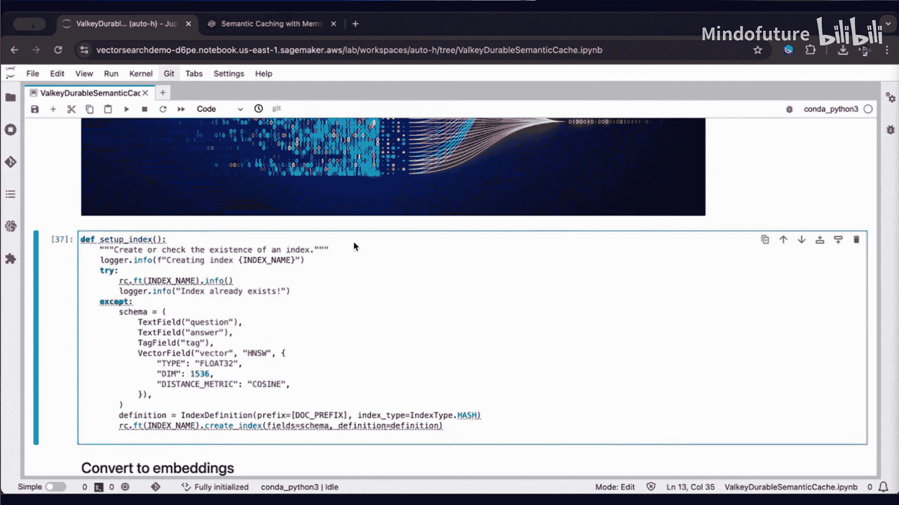
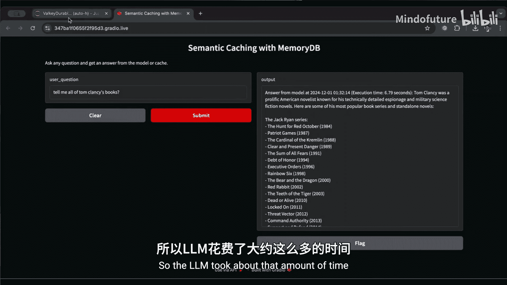
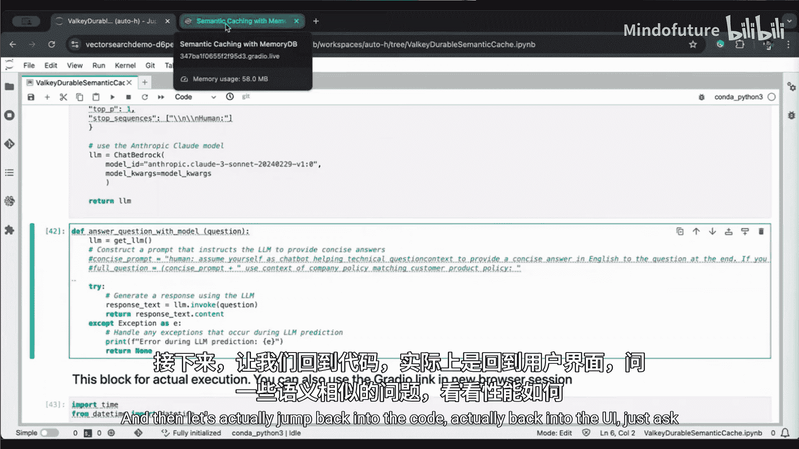
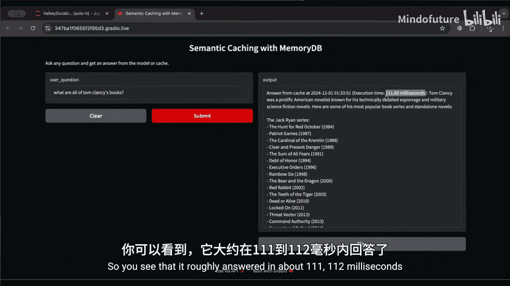
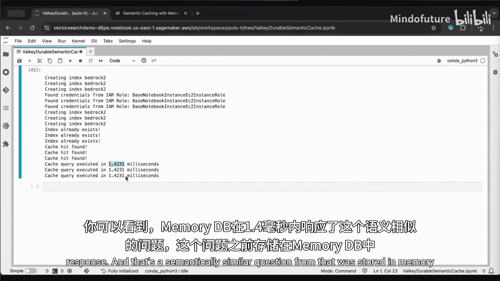
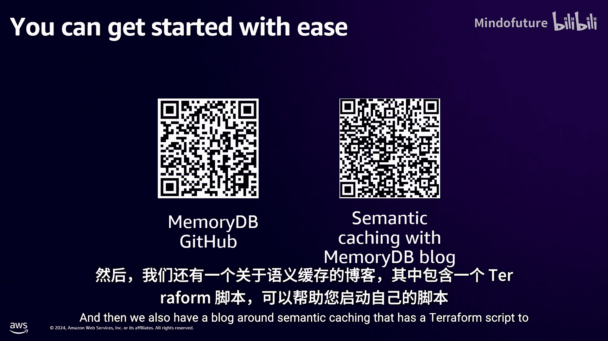

# 007：在Amazon MemoryDB中使用持久语义缓存优化生成式AI应用

在本节课中，我们将学习如何通过实施持久语义缓存，来扩展您的生成式AI应用、提升性能并优化成本。我们将深入探讨语义缓存的核心概念、工作原理，以及如何利用Amazon MemoryDB来实现它。

## 生成式AI的挑战与机遇 🚀

生成式AI是一种能够创造新内容和想法的人工智能，包括对话、故事、图像和音乐。它由机器学习模型（通常称为基础模型）驱动。到2026年，预计80%的企业将在生产环境中使用生成式AI。

然而，随着使用规模的扩大，大型语言模型（LLM）和基础模型的成本会变得昂贵。例如，一个使用Amazon Bedrock和Titan的聊天机器人，其成本会随着用户数量的增加而线性增长。我们的目标是实现亚线性的成本增长。

## 什么是持久语义缓存？ 💡

持久语义缓存的核心思想与您可能熟悉的其他缓存系统类似：缓存昂贵、重复查询的结果，以提高性能、扩展性和降低成本。

那么，语义缓存的独特之处在哪里？关键在于“语义”二字。

### 理解向量嵌入

要理解语义缓存，首先需要理解向量嵌入。您可以将非结构化数据（如文档、视频、音频）转换为包含其语义或上下文含义的数值表示。向量嵌入可以捕获不同语义元素之间的语义关系。

创建这些向量嵌入的过程包括：从源获取数据、将其分块并转换为向量。这些向量通常有数百甚至数千个维度，其排列顺序旨在准确表示语义含义。为了可视化，我们使用三维空间。核心思想是：具有相似语义含义的向量在向量空间中彼此接近。

### 语义缓存的工作原理

假设我们有一个聊天机器人应用，用户提出了一个提示查询。我们以“书籍”、“家具”和“金融”为例，并再次使用三维空间进行简化可视化。

我们已经将这些查询存储在我们的持久语义缓存中。假设有一个历史查询是：“告诉我一些值得阅读的冒险书籍。”现在，我们收到一个新查询：“你推荐什么冒险书籍？”

我们可以看到这两个字符串并不匹配，因此传统的精确匹配或字符串哈希等缓存技术将失效。但作为人类，我们知道这两个字符串具有相似的语义含义。这正是向量要解决的问题。针对新查询，我们开始寻找语义相似的向量。我们逐步扩大搜索半径，一旦找到足够接近的向量（我们稍后会解释“足够接近”的含义），就会返回缓存命中以及该查询的数据。

## 持久语义缓存在应用中的位置 🗺️

我们使用同一个例子。终端用户向生成式AI应用发送提示请求，例如：“告诉我一些值得阅读的冒险书籍。”然后，生成式AI应用会将相同的提示发送给基础模型，获取响应并返回给用户。

现在让我们加入缓存。流程开始时相同，但收到提示后，我们不会直接访问基础模型，而是先创建向量嵌入。这会增加约100毫秒的延迟和少量成本。我们获取向量，然后在持久语义缓存中进行搜索。由于这是第一次见到此类向量，所以会发生缓存未命中。接下来我们会做两件事：首先，从基础模型获取数据（这通常需要数秒，成本高昂）；其次，在将响应返回给用户的同时，我们也会用这个向量数据更新缓存。

缓存未命中时虽然多了一些工作（创建嵌入和缓存操作），但这些操作的成本和延迟都很低。那么，这样做值得吗？

让我们看看缓存命中时的情况。用户再次发送相同的查询：“告诉我一些值得阅读的冒险书籍。”我们创建嵌入，获取向量，并在持久语义缓存中搜索。这次，我们会得到缓存命中，并以极低的延迟将响应返回给用户，从而避免了昂贵且高延迟的基础模型调用。

但这与其他缓存系统有何不同？让我们看看语义缓存的真正威力所在。

假设用户发送了一个不同但语义相似的查询，例如：“你推荐什么冒险书籍？”而不是原来的句子。这并非相同的查询。我们再次创建嵌入，获取向量，并在持久语义缓存中搜索。由于向量非常相似（足够接近），这次我们仍然会得到缓存命中，并再次避免了昂贵的基础模型调用。这就是持久语义缓存的强大之处。

## 成本效益分析 📊

这里有一个使用Amazon Bedrock上Claude Sonnet的应用示例，每天处理10万个问题，配置平衡了成本和相关性，每月成本为28，000美元。

使用带有持久语义缓存的MemoryDB，我们可以看到显著的成本节约。实际上，成本节约与缓存命中率相关。如果缓存命中率为25%，您将获得近25%的成本节约；如果缓存命中率为75%，您将获得近75%的成本节约。这表明大部分成本来自基础模型，而添加持久语义缓存的额外开销非常低。

让我们看一个真实案例：Iterate AI。这家AI公司帮助客户构建生成式AI应用。他们帮助一位客户构建了一个基于Amazon Bedrock的聊天机器人应用，每天处理57，000个问题。他们发现LLM成本成为一个问题，并意识到80%的查询在语义上是重复的。通过使用MemoryDB持久语义缓存，他们节省了70%的成本。此外，他们将延迟从秒级降低到毫秒级，显著改善了客户体验。

## 为何选择Amazon MemoryDB？ 🏆

我们讨论了持久语义缓存，但应该为此选择哪种数据库呢？让我们分解一下需求。

首先，是语义方面。您需要数据库支持语义搜索，即向量相似性搜索，并具备高级功能，如不同的距离度量。

其次，是性能方面。您需要数据库具有低读取和低写入延迟。低写入延迟很重要，因为每次缓存未命中时都需要更新数据库。您还需要低单次查询成本，或者说高单节点吞吐量，因为降低成本是主要目标之一。同时，您希望在不牺牲相关性的前提下实现这些。

最后，是持久性方面。这有点不那么直观。任何具有良好性能的向量相似性搜索都需要某种索引。当您有索引时，重建索引可能非常昂贵。如果发生完全缓存丢失，在任何系统中都不是好事，而重建缓存加上重建索引的影响则更为严重。因此，我们建议为此类用例选择具有持久性的数据库。

与其他数据库用例类似，您还会关心安全性、高可用性、完全托管、AWS卓越运维等方面，这些都是我们所有数据库提供的功能。

AWS提供广泛的目的构建数据库以满足现代应用需求。随着需要不同访问模式、数据模型、性能和规模的云原生应用的激增，您可以从一系列稳固的目的构建数据库中选择适合您应用需求的方案。

MemoryDB符合我们刚才讨论的性能、搜索和持久性要求，我们将在接下来的几张幻灯片中深入探讨。

## 深入了解Amazon MemoryDB ⚡

Amazon MemoryDB是AWS目前提供的最快的持久性数据库，具有微秒级的读取延迟和低个位数的毫秒级写入延迟。我们稍后在讨论向量搜索性能时会更多地谈到性能方面。

MemoryDB与Valkey和Redis开源版本兼容。

在继续讨论MemoryDB之前，让我们花几分钟了解一下Valkey的背景。今年3月，Redis宣布未来版本将不再使用开源许可证。几乎立即，Redis开发者社区分叉了该项目并创建了Valkey。它由一些在许可证变更前就开发Redis的相同人员开发，一些前Redis维护者成为了Valkey维护者，社区中许多其他开发者也加入进来。除了庞大的开发者社区，它还得到40多家公司的支持，包括大型云提供商。它由Linux基金会托管，确保其保持供应商中立并始终开源。Valkey的第一个版本也是Redis最后一个开源版本（7.2），并与之完全兼容。这也是我们在托管服务ElastiCache和MemoryDB中发布的第一个版本。我们以大幅降低的价格在这两项服务中发布了Valkey，并且两项服务都提供只需点击几下即可完成的在线升级，作为从MemoryDB for Redis迁移到MemoryDB for Valkey的无缝替换方案。特别是对于MemoryDB，与MemoryDB for Redis开源版相比，我们在实例上发布了低30%的价格，在写入数据上发布了低80%的价格。当您希望节省成本（这也是实施持久语义缓存的原因之一）时，这为您带来了额外的好处。

回到MemoryDB。它与Valkey和Redis开源版本兼容，您将获得丰富的功能和数据结构（如列表、集合、哈希和有序集合），受益于流行的Valkey生态系统，获得超过50种编程语言的客户端库，并享有具备持久性的Valkey丰富功能。

MemoryDB专为零数据丢失而设计。我们构建到MemoryDB中的主要创新之一是**多可用区事务日志**：每次写入只有在被写入至少两个不同可用区中的至少三个不同副本后，才会被确认。它利用了与S3和Amazon.com订单数据相同的底层技术。我将在接下来的几张幻灯片中深入探讨我们如何通过MemoryDB实现持久性。

然后，与其他AWS数据库类似，它是完全托管的，具有四个9的高可用性，并在安全性、可扩展性和性能方面具备其他重要特性。

## MemoryDB的持久性与高可用性 🛡️

让我们看看MemoryDB在底层如何实现其持久性和高可用性。

这是一个MemoryDB集群中的一个分片，它有一个主节点和一个或多个副本节点。它有我们刚刚讨论过的多可用区事务日志。

让我们看看写入是如何工作的。客户端将写入请求发送到主节点。主节点将请求写入事务日志，然后事务数据在事务日志之间复制。一旦存在三个副本且位于至少两个不同的可用区，就会向主节点发送确认，然后主节点将确认发送给客户端。此时，客户端知道数据已持久保存在事务日志中。我们看到存在到副本的异步复制，这对于高可用性很重要。

让我们看看高可用性。假设发生了故障。同样，客户端发送写入请求到主节点，主节点将其发送到多事务日志，获得确认，然后客户端获得确认。现在，假设主节点发生故障。此时，我们不会立即进行故障转移。我们首先优先考虑持久性而非可用性，并确保将所有数据重放到副本中。在将副本提升为主节点之前，我们确保它拥有所有数据。由于我们持续进行异步复制，这个过程相对较快，通常发生在不到一秒的时间内。这就是我们提供高可用性和持久性的方式。一旦我们将副本提升为主节点，客户端将被重定向到新的主节点并继续发送I/O。数据会再次异步复制到副本，以便在发生额外故障时保持高可用性。

这就是我们实现快速故障转移且不丢失数据的方式。

我们看到许多不同行业的不同工作负载的客户都在使用MemoryDB，一些常见的用例包括微服务数据存储、会话存储和排行榜。客户受益于MemoryDB的数据结构、低延迟和可扩展性。现在，随着向量相似性搜索的推出，我们启用了新的用例，包括我们今天讨论的持久语义缓存。

## 向量搜索用例与核心概念 🔍

正如Eti所指出的，我们通过向量搜索启用了许多不同的新用例。许多客户信任MemoryDB的向量搜索并将其用于生产。

我们今天讨论的主要用例是持久语义缓存，即存储您的LLM推理结果，以便后续语义相似的问题可以从您的向量存储中提供，而不是从LLM提供，从而帮助您提高性能和节省成本。此外，还有快速语义搜索，例如目录搜索。您搜索一个商品（如鞋子），希望返回目录中所有语义相似的产品，并能够在个位数毫秒延迟内交付。我相信你们许多人都非常了解检索增强生成，这实际上是使用您自己的专有数据为LLM提供上下文，以便为用户提供更精确的答案。最后，对于我们许多FSI客户来说，还有异常检测，以在个位数毫秒延迟内检测欺诈，减少损失。

但今天，我们将真正聚焦并深入探讨持久语义缓存。

在我们深入之前，需要对齐几个关键术语。

**精确匹配**：在向量搜索中，精确匹配本质上是搜索每个向量，计算输入向量与向量数据集中所有向量之间的距离。以这里红色圆圈所示的输入向量为例。在精确匹配中，您基本上要对每个向量进行距离计算，以返回（例如）前三个最近的向量（以紫色高亮显示）。这显然计算强度极高且非常耗时。

**近似最近邻搜索**：近似最近邻搜索是在不搜索向量数据中所有向量的情况下，搜索所有相似向量。例如，它比精确匹配快得多，因为您实际上只搜索少量向量来找到前三个最近的向量。让我们看一个例子。这是一种基于聚类的方法。以这三个不同的区域（我们命名为A、B、C）为例。我们在这里所做的本质上是计算到这三个不同聚类中心的距离。一旦完成，我们确定聚类A是最近的，然后我们实际计算到该聚类内所有向量的直接距离，并确定前三个最近的向量（此处高亮显示）。然而，您会注意到那个浅粉色圆圈实际上比这个代表红色向量的圆圈更远。因此，正如名称所示，近似最近邻搜索会返回大部分向量，但可能会遗漏一些像这样的向量。

**召回率**：召回率是衡量ANNS返回结果质量的指标。以右侧的例子为例。所有绿色气泡代表您期望从ANNS返回的向量。然而，假设您只得到了10个中的8个。这基本上意味着您的召回率是80%。这确实是衡量ANNS搜索结果质量的方式。

## 近似最近邻索引算法 📐

让我们回顾一些基本的ANNS索引算法来实现这种搜索。其中一些是基于哈希和基于树的方法。基于哈希和基于树的方法在低维向量中表现良好。然而，在高维向量中，它们会遇到困难，计算密集且占用大量内存。然后是**基于聚类的索引算法**，正如我们之前提到的，这是一种非常简单的方法，构建这些索引非常快。然而，它们在非常高的召回率水平上会遇到困难。最后，还有**基于图的索引算法**。您可以看到这些图是高度互连的，它们在高维度和高召回率水平上表现极佳。

其中一种基于图的索引算法是**HNSW**，它代表**可导航小世界**。这种HNSW在性能和召回率之间进行了优化，并真正为您提供了高吞吐量、高QPS以及在MemoryDB上的低延迟。

当您考虑HNSW时，有三个不同的变量需要考虑：不同的索引参数。
*   **M**：这是索引中所有向量建立的双向连接数。您可以将M设置得非常高，从而获得非常高的召回率水平。然而，这会影响索引消耗的内存。
*   **EF construction**：EF construction基本上代表您希望花多少时间来创建高质量的图。
*   **EF runtime**：当您实际进行搜索时，EF runtime本质上是尝试返回尽可能多的您期望的向量。较高的EF runtime基本上意味着您的向量搜索将花费更多时间，就像较高的EF construction会导致索引创建时间更长一样。

这三个变量都是您在运行自己的向量搜索时需要考虑的。您不能同时大幅增加所有这些变量，因为随着增加，收益会递减。因此，您需要真正理解您的应用程序用例，以确定如何设置它们。

## 在MemoryDB中实现向量搜索 💻

`FT.CREATE`命令基本上允许您指定如何存储向量，无论是Json格式还是哈希格式。您还可以在此处指定要选择的索引算法（这里是HNSW）。您也可以指定精确匹配（如果这是您的选择）。然后指定维度，这与您选择用于基于文本生成向量的嵌入模型保持一致。您还可以指定距离度量：余弦相似度、欧几里得距离或点积。

让我们看看如何使用`FT.SEARCH`命令运行K近邻搜索。在MemoryDB API的`FT.SEARCH`命令中，您看到`K`和`N`为10，这意味着基本上返回输入向量的前10个最近向量，正如我们之前提到并展示的那样。

当我们考虑语义缓存时，这是对传统K近邻搜索的一个小转变。在用于语义缓存的`FT.SEARCH`命令中，我们启用了称为**向量范围**的功能。这基本上允许您设置一个相似性阈值，以返回与输入向量在语义上足够接近的向量。因此，您可以返回0个，也可以返回10个。这在很大程度上取决于您如何设置这个半径。半径设置在0到1之间，默认值为0.2。您设置的值越低，输入向量与返回的语义相似向量之间的接近程度要求就越严格。

让我们实际看一个`FT.SEARCH`命令的例子。正如我们提到的，这就是向量范围功能的工作原理：您指定一个半径。但是，还有额外的功能可以让您个性化从向量范围查询返回的向量数据类型。在MemoryDB中，我们启用了基于数字和标签的过滤器。在这个例子中，您看到我们为每个向量关联了国家等元数据标签。这基本上意味着，在这个查询中，我们首先过滤向量数据集，然后运行搜索。

让我们考虑一个实际例子，看看这具体是什么样子。假设我们有来自美国、加拿大和墨西哥的用户，用不同颜色表示，以及他们提出的问题类型。所有这些数据都存储在您的语义缓存中，并与答案相关联。

假设墨西哥的用户问：“今年最好的爱情小说是什么？”您可以增加半径以扩大语义相似性范围，但最终您会找到美国用户问的：“告诉我今年最顶级的爱情小说。”这在语义上是相似的。但是，您可能不希望将这个答案返回给墨西哥的用户，因为基于他们的国家，这可能不相关。因此，您可以应用一个元数据过滤器，即我们之前提到的国家标签，以预先过滤向量数据集，从而排除来自美国用户的数据。随着您增加半径阈值，您最终会找到墨西哥的另一个用户问的：“今年关于爱情的最高评分小说是什么？”然后，通过这个基于标签的过滤器和半径的语义相似性，您基本上只返回墨西哥另一个用户的答案。

## 内存优化与性能基准 🧠

这些向量会消耗大量内存。需要考虑的一点是，当这些向量被创建时，它们实际上存储在键值对和向量索引中。因此，在我提到的每个问题中，通过Bedrock生成的向量实际上存储在键值对和向量索引中。您可以看到每个向量在内存中被复制了。然而，让我们看看MemoryDB如何通过内存去重来处理这个问题。

在相同的用例中，即美国和墨西哥用户提出的这些问题，向量被生成。但是，MemoryDB实际上是在向量索引中存储一个指向键值对中实际向量的引用指针，从而真正节省了内存。您可以看到大约节省了50%。此外，我们实际上对一些基准和测试进行了运行。在Y轴上，您可以看到消耗的内存。这两组分别是约1536维的500万个向量和768维的1000万个向量。您可以看到，在没有去重的情况下，两者都占用了大约70GB的内存。但是，通过去重技术，您可以看到内存消耗实际上减少了约52%到56%。

为了帮助您不过度配置或配置不足向量工作负载所需的实例类型，我们实际上在MemoryDB控制台中发布了一个向量计算器。它允许您指定向量数量、维度、M值以及您可能存储的任何元数据。这将帮助您正确调整所需资源。

## 实践演示：从缓存未命中到命中 ⚡

为了通过一个真实的实际例子，我这里有一个Jupyter笔记本，我将逐步讲解。它演示了语义缓存未命中和语义缓存命中，以真正展示您将看到的性能改进。

让我们开始。这是如何配置MemoryDB向量索引的。正如我们之前提到的，这确实允许您指定索引、您想要的算法（HNSW）、您实际想要存储数据的方式、这里的维度（1536）以及您想要使用的实际距离度量。

让我们跳转到实际UI来提问。这是我刚刚创建的一个缓存，里面什么都没有。所以让我们问一个新问题：“告诉我所有Tom Clancy的书。”这实际上隐藏在我们的LLM实验室的Claude 3 Sonnet中。您可以看到这实际上花了相当长的时间。发生了缓存未命中，所以它实际上被重定向到LLM来回答这个问题。您可以看到它回答了。我们还可以看到，当我们向上滚动时，会发现这大约花了7秒钟来回答。所以LLM花了大约那么长时间。让我们跳回代码。

在这里我们看到，首先我们从缓存中查找，正如我们之前提到的，我们运行那个向量范围查询。我们在这里将半径设置为0.2，显然，您可以根据需要配置这个。我们存储了那个问题嵌入。我们实际上在这里有一个计时器来输出执行时间，我稍后会向您强调。然后在缓存未命中的情况下，我们显然需要在用LLM响应用户后将此添加回缓存。这里我们有一个“添加到缓存”函数，基本上只是输入问题、答案和实际使用的嵌入模型。最后，在这里您可以看到，当缓存未命中时，我实际选择用于回答问题的模型是Claude 3 Sonnet模型。

现在让我们跳回代码，实际上是跳回UI，问一些语义相似的内容，看看性能如何。也许我们会问类似这样的问题：“Tom Clancy的所有书是什么？”为了简单起见。我们问了这个问题，让我们看看它有多快。您看到它大约在111-112毫秒内回答了。但正如Ethan之前提到的，这其中的大部分实际上来自嵌入瓶颈。所以让我们回到最底部，看看MemoryDB响应有多快。您可以看到这里MemoryDB在大约1.4毫秒内响应了那个来自之前存储在MemoryDB中的语义相似问题的响应。

这里真正要记住的一点是，MemoryDB确实在最高召回率水平上提供了最佳性能。

## 性能基准与最佳实践 📈

我们实际上在AWS进行了大量基准测试来评估MemoryDB的性能。在这张图中，您会看到Y轴是以毫秒为单位的P99延迟，您会看到围绕Cohere 1000万数据集和OpenAI 500万数据集的两个集群，两者都是用于基准测试的常见向量数据集。您可以看到，在这两种情况下，MemoryDB的性能都显著优于其他向量数据库。

然后在QPS方面，这里的Y轴显然是QPS，同样是那两个向量数据集。我们看到，在这种情况下，MemoryDB在提供接近每秒10，000次查询的向量工作负载方面也表现得非常出色。

但这里有一些最佳实践需要考虑。首先是**管理数据陈旧性**。这与操作任何其他缓存非常相似。在陈旧性和缓存命中之间存在固有的权衡。与任何其他缓存用例一样，您可以考虑对您的键使用生存时间或TTL。但这里的一些关键考虑是：显然，较低的TTL会导致较低的缓存命中率和较少的陈旧性；而较高的TTL会导致较高的缓存命中率和较多的陈旧性。因此，您真的需要考虑如何最终平衡以及您的业务用例是什么。有些用例可能需要非常少的陈旧性，而有些用例可能能够容忍它。这在很大程度上取决于您的客户和您的应用程序用例。

具体到向量范围和语义缓存，正如我们之前提到的，有一些关于优化相似性阈值和个性化的内容。我的意思是，真正优化您的半径或相似性阈值，并利用过滤器，即MemoryDB允许的基于标签和数字的过滤器。与上一张幻灯片类似，较小的半径在语义相似性方面限制更严格，更多的过滤器基本上会限制您实际搜索的向量数量。这将导致较低的缓存命中率，但对用户来说相关性更高。相反，较大的半径和较少的过滤器将导致较高的缓存命中率，但对用户的相关性较低。因此，您真的需要考虑如何根据您希望如何响应客户来调整相似性阈值，以及类似地使用过滤器。

然后，MemoryDB还允许您真正选择监控内存和空间消耗。使用`FT.INFO`命令，您可以实际查看向量空间使用情况、索引的文档数量和向量数量。这有助于您根据应用程序的需要适当调整或设置过滤器和半径阈值。

## 总结与资源 🎯

最后，持久语义缓存的一些巨大好处和总结是：
*   **成本降低**：您减少了那些昂贵的LLM调用，可以带来相当可观的节省。
*   **可扩展性**：与其他缓存用例非常相似，您可以处理更多用户，而无需按比例增加成本。
*   **提高速度**：您可以在我们之前强调的个位数毫秒延迟内响应用户。

最后，这里有两个很棒的二维码链接：一个是MemoryDB GitHub，其中包含一些很棒的语义缓存用例和代码示例，帮助您入门，还有一些基本的向量搜索代码示例。我们还有一篇关于语义缓存的博客，其中包含一个Terraform脚本，帮助您启动自己的实例以真正开始。

本节课中，我们一起学习了如何利用Amazon MemoryDB的持久语义缓存来优化生成式AI应用。我们探讨了语义缓存的核心概念、工作原理、实施步骤以及带来的性能与成本优势。通过结合向量相似性搜索和MemoryDB的高性能与持久性，您可以有效扩展应用、降低延迟并显著节约成本。