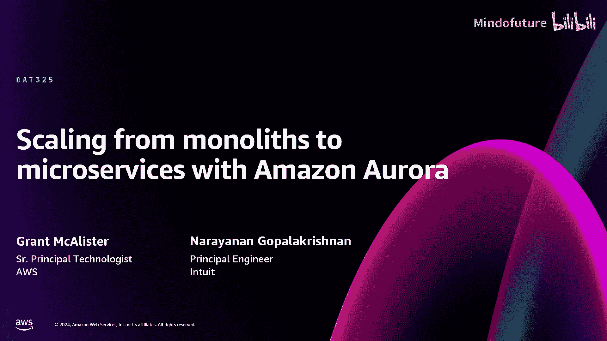
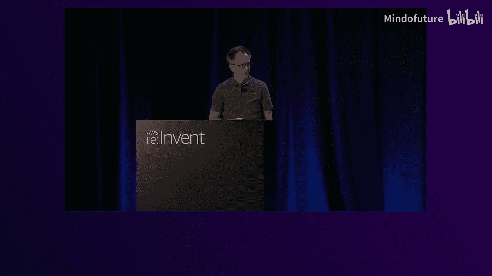
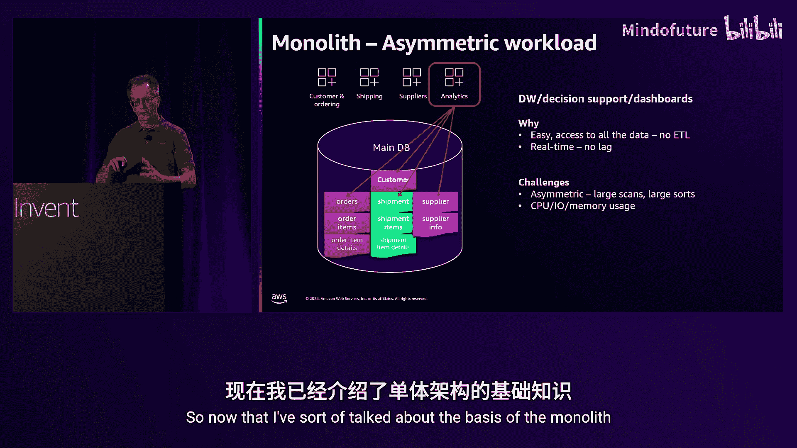
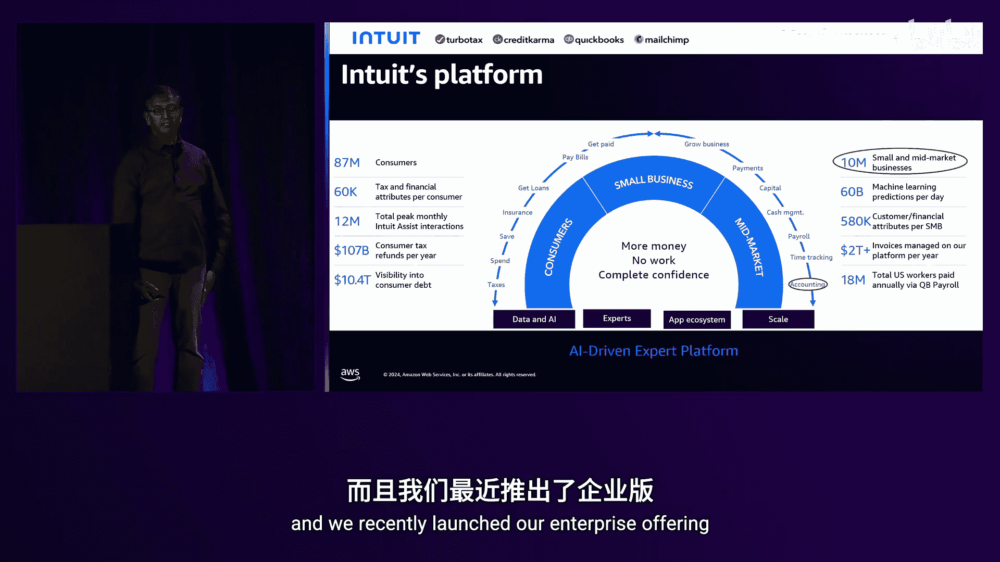
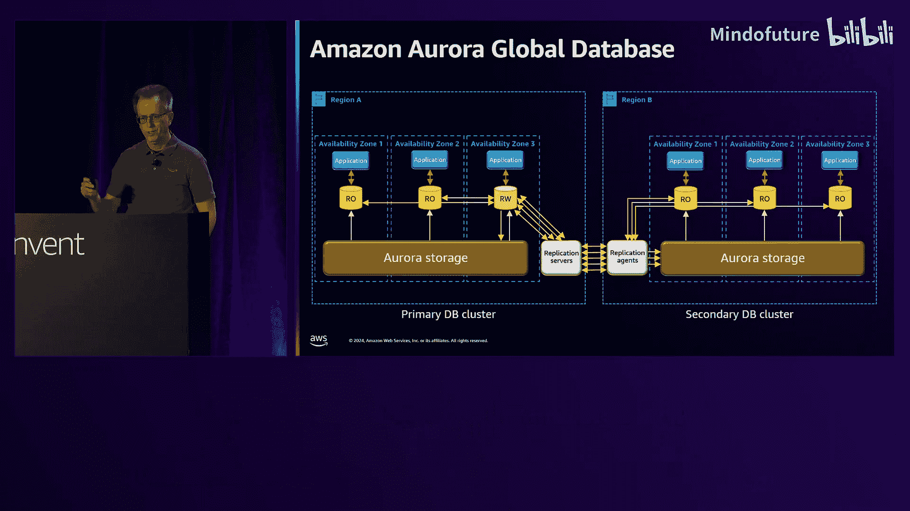
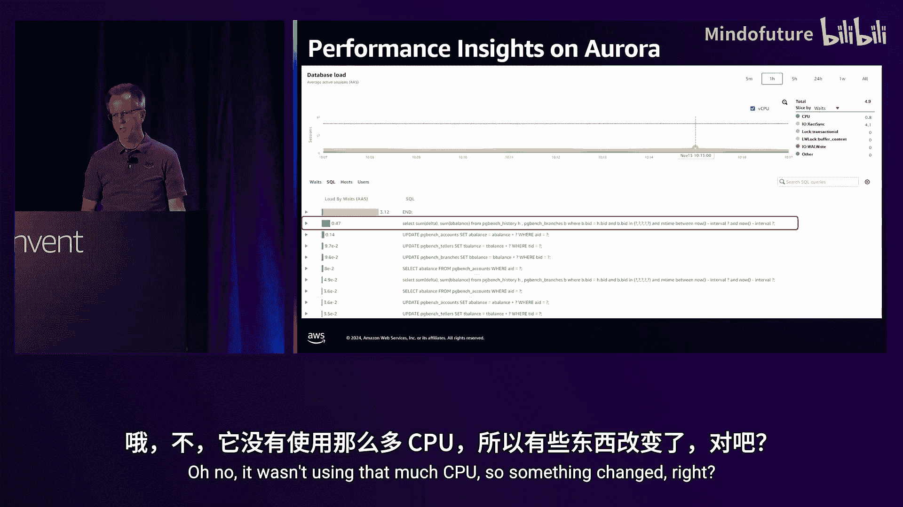
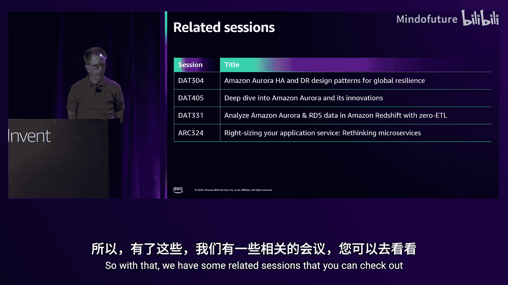
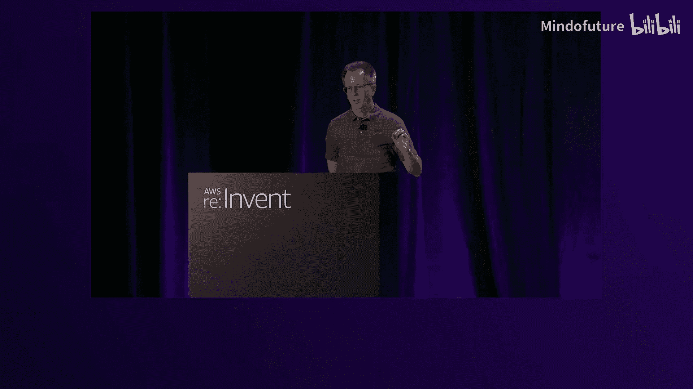
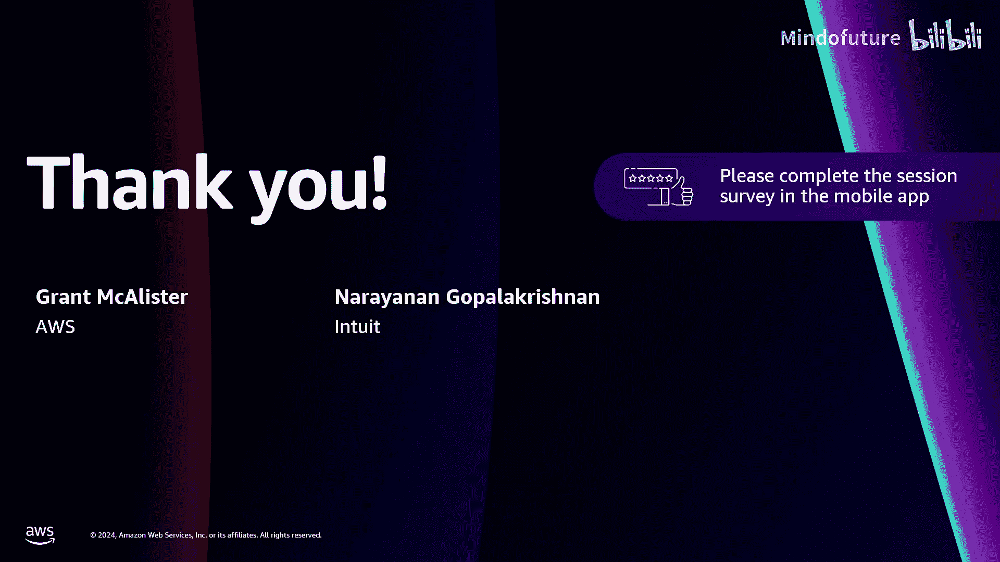

# 008：使用Amazon Aurora从单体架构迁移到微服务架构

在本节课中，我们将学习如何将一个庞大的单体数据库系统，逐步分解并迁移到现代化的微服务架构中。我们将跟随Intuit公司的真实案例，了解他们如何将QuickBooks平台从商业数据库迁移到Amazon Aurora PostgreSQL，并探讨在此过程中使用的关键AWS服务和最佳实践。

## 从认识“单体”问题开始

上一节我们介绍了课程目标，本节中我们来看看什么是“单体”数据库，以及它可能带来的问题。

你有一个单体数据库。这指的是一个非常庞大的数据库。从数据库的角度来看，单体意味着某种失控的状态。典型的情况是，许多不同的应用程序都在与这一个数据库通信，数据库中混杂着各种不同类型的数据。

让我们深入探讨几个具体的单体问题示例。

### 问题一：无关的共置工作负载

你可能会在数据库中运行一些小型、孤立的工作负载。例如，一个供应商应用程序，它只有几张表，规模不大，功能也不多，但它就存在于主数据库中。

以下是导致这种情况的常见原因：
*   **许可挑战**：你可能在使用商业数据库，不想购买额外的许可证。
*   **资源限制**：你可能只有一个服务器，就直接把所有东西都放上去了。
*   **管理负担**：过去，你不想管理另一个数据库，因为那很麻烦，所以干脆放在一起。

但这样做的问题是，即使这个无关的表通常不占用太多CPU，它也可能失控或产生糟糕的查询，从而干扰你的核心应用。此外，你还需要与不同团队协调维护窗口，增加了复杂性。

### 问题二：纠缠的工作负载

这种情况更具挑战性，我称之为“纠缠的工作负载”。多个应用程序（有时是同一个应用，有时是跨不同部署的应用）都在访问同一组紧密耦合的数据，例如客户、订单和发货数据。

除了之前提到的原因，还有一个重要原因：**对开发者来说这样做非常方便**。当你在订单系统中不需要去查找发货数据在哪里时，编写应用会容易得多，因为数据就在同一个数据库中。因此，很多数据库最初就是这样创建的。

但这里有一个关键问题，也是很多管理者容易忽略的：**你现在有了共享状态**。这意味着如果发货团队决定修改一张发货表（例如增加一列），而没有与其他团队协调，就可能导致整个系统宕机。这非常糟糕。因此，你必须进行共享的QA、测试和认证。这会增加错误率，降低开发速度。随着越来越多的开发者在这些系统上工作，挑战会越来越大。所以，我们非常希望消除这种共享状态。

### 问题三：时间序列数据问题

另一个不常被考虑到的问题是时间序列数据。随着时间的推移，尤其是像订单这样的数据，你的数据库会不断增长。起初，一个新订单会被存储在一个数据块中。查找这个订单的成本很低，只需获取那个数据块。几周后，另一个订单进入一个新的数据块，查找成本依然很低，查询性能是可预测的。

但问题出现在类似这样的查询上：`查找我去年的所有订单`。随着时间推移，这个查询的成本会呈指数级增长。一个更现实的例子是，每个订单可能包含多个订单项，每个订单项又有详细信息。这意味着执行这样一个查询可能需要读取数百个数据块。在亚马逊的早期，有些客户的查询甚至需要读取数万个数据块。这种大型查询开始变得像报表查询，而不是主应用应该运行的查询，从而可能破坏系统的稳定性。

### 问题四：非对称工作负载

最后一个问题是“非对称工作负载”。我指的是那些并非核心应用主要操作的工作负载，例如分析、搜索等。你可能直接在OLTP系统上运行数据仓库决策板或实时仪表盘。这听起来不错，因为不需要ETL，数据是最新的，业务领导会满意。

但问题是，这些查询会对数据库执行大规模操作（如大表扫描、大排序），从而可能破坏系统稳定性。这与核心应用的点查询和小连接操作是“不对称”的。一个糟糕的分析查询就可能耗尽CPU、I/O和内存资源。

## Intuit的现代化之旅：从单体到微服务

在了解了单体数据库的常见问题后，我们来看看Intuit公司是如何应对这些挑战，并成功完成现代化迁移的。

Intuit是一家AI驱动的金融科技平台，为消费者、小型企业和中型市场客户提供服务，产品包括TurboTax、Credit Karma、QuickBooks和Mailchimp。QuickBooks不仅仅是一个会计软件，它帮助企业管理整个业务流程，会计只是其中的一部分。该平台服务超过1000万中小型客户，规模巨大。

### 遗留架构与挑战

QuickBooks是一个部署在Kubernetes上的Java应用，后端使用商业关系型数据库。他们采用了一种“泳道”架构进行部署。一个泳道就是一个包含数据库的独立应用部署单元，类似于基于单元的架构。这种架构用于实现横向扩展和地理分区。

他们管理着一个庞大的数据库集群，数据量达数百TB，提供超过百万的预配置IOPS，并在关系型数据库上同时运行OLTP和搜索用例。应用代码量达数百万行，包含数千个动态查询和复杂查询。他们还有自研的数据库模式生成器、数据访问层和动态SQL生成器。

随着QuickBooks不断演进和功能增加，它逐渐变成了一个单体，面临以下挑战：
*   难以扩展，特别是对于一些大客户以及未来10倍数据增长的目标。
*   开发速度变慢。
*   管理成本日益高昂。

### 目标架构与要求

为了应对这些挑战，他们决定转向基于服务的架构，使用云原生的开源数据库。目标架构允许他们根据不同的用例选择最合适的数据库，而不是“一刀切”。

他们的迁移目标非常明确：
*   在最小化对1000万客户干扰的前提下，完成从单体到新架构的转型。
*   实现100%的数据和功能对等，并完全支持回退。
*   提升性能、弹性和完成度，并在基于许可的固定截止日期前完成。
*   在整个迁移过程中，仍需持续开发和发布新功能给客户。这就像“在飞行中更换飞机引擎”。

### 分阶段执行方法

他们采用了分阶段的方法：
1.  **评估阶段**：基于产品所需的功能集评估技术。
2.  **范围界定**：根据可行性定义要更改的范围。
3.  **高层设计**：进行高层技术设计。
4.  **规划阶段**：制定详细计划。
5.  **执行阶段**：进行模式转换、数据迁移和应用转换。
6.  **测试**：进行广泛的测试。
7.  **滚动发布**：采用谨慎的滚动发布策略。

### 关键技术决策

**多租户模型选择**：作为SaaS应用，多租户是基础需求。他们评估了三种模型：
*   **Silo模型**：每个客户一个独立数据库。隔离性最高，但运维开销也最大，适合租户数量有限的情况。
*   **Bridge模型**：单个数据库，每个租户一个独立模式。在数据隔离和运维开销之间取得平衡。QuickBooks早期使用此模型，但发现它无法扩展到数百万租户。
*   **Pool模型**：单个数据库模式由多个租户共享。非常适合大规模租户扩展且运维开销低，但数据隔离性不高。

Intuit从Bridge模型转向了Pool模型，并通过遵循特定的数据库模式设计原则和实现一个保证数据隔离的层，成功解决了隔离性问题，并使租户模型对应用透明。

**数据库选型**：基于对以下关键功能的需求，他们选择了 **Aurora PostgreSQL**：
*   支持数十亿行表和时序数据的商业级分区。
*   无需停机的在线模式变更。
*   完整的SQL功能以支持复杂查询。
*   查询调优工具和**查询计划稳定性**。
*   支持数千个连接以处理负载。

选择PostgreSQL是因为其行级安全等特性，选择Aurora则是因为其扩展性、高可用性、灾难恢复能力，尤其是**Aurora查询计划管理**功能，这提供了他们急需的查询计划稳定性。

### 创新执行与测试

**应用转换**：由于应用是为遗留数据库编写的，他们首先引入了SQL抽象层，将所有数据访问封装其后。然后为PostgreSQL添加了动态查询生成和代码生成工具的支持，并将其置于同一抽象层之后。这使得开发者可以继续工作而无需关心底层数据库，并允许他们在遗留栈和目标栈上并行构建和部署。

**数据迁移**：他们选择了**AWS Database Migration Service**，并使用了两种模式：
*   **前向回退模式**：从源数据库复制到目标Aurora，同时再从目标Aurora复制回源数据库的一个克隆。这样可以持续测试完整管道，且源数据库保持完整。
*   **回退模式**：从源复制到目标，切换后，再反向复制回源。挑战在于只有在切换到Aurora后才测试反向管道，如果需要回退，可能会有数据丢失。

Intuit在初始泳道使用了第一种模式以获取信心，随后为效率切换到了第二种模式。

**创新的捕获-回放测试**：面对全新的数据库和重构的代码，全面的功能和性能测试时间紧迫。他们创新性地采用了捕获-回放技术：
1.  在生产环境中轻量级地捕获每个查询及其绑定变量，存入队列。
2.  通过动态查询生成组件，将每个遗留查询转换为对应的PostgreSQL查询。
3.  将转换后的查询存储到知识库中。
4.  通过持续复制，建立生产环境的克隆（包含源和目标引擎）。
5.  回放工作线程从队列中取出查询，分别在源引擎和目标引擎上执行。
6.  对每个查询，逐行逐列比对结果以发现功能差异，并收集性能指标以识别需要调优的地方。

他们重复此过程超过100次，发现了大量功能和性能问题，并在上线前用此方法测试了不同配置下的目标系统，从而获得了充分的信心。

### 渐进式发布与成果

他们采用了渐进式发布策略：
1.  **4小时发布**：在非高峰时段测试，4小时内监控并计划回退。
2.  **24小时发布**：处理高峰流量，监控24小时内的系统健康状况和稳定性，并计划在24小时内回退。
3.  **1周发布**：目标是在没有意外问题的情况下保持在目标系统上。
4.  **正式切换**：对于初始泳道，设置了两周的回退期（持续反向复制数据），然后正式切换。剩余泳道则重复此过程。

得益于捕获-回放技术带来的细致测试，**整个迁移过程实现了零计划外回退**，发布过程完美，所有泳道都按时完成迁移。

**成果与收益**：
*   **更好的扩展性**：利用Aurora多读副本，为QuickBooks这样的读密集型系统提供了更好的扩展性。
*   **高可用与灾难恢复**：内置HA，使用Aurora Global实现了开箱即用的DR，并能一键进行灾难恢复演练。
*   **搜索升级**：将搜索从关系型迁移到OpenSearch，实现了语义和混合搜索，为AI用例提供了支持。
*   **审计服务化**：构建了可重用的审计服务，解锁了欺诈检测、异常检测和生成式AI用例。
*   **查询计划稳定性**：在PostgreSQL上获得了更好的计划稳定性，因计划翻转导致的意外性能峰值大大减少。
*   **成本节约**：从支付数百万预配置IOPS费用转向按使用量付费模式，节省了托管成本。

**总结**：他们以更低的成本获得了更好的扩展性和开发速度。

## AWS核心服务深度解析

在了解了Intuit的迁移故事后，我们来看看他们使用的一些关键AWS服务，这些服务对于类似的迁移路径非常有帮助。

### AWS Database Migration Service

DMS既是一个迁移服务，也是一个复制服务。它可以帮助你完成从一种数据库引擎到另一种引擎（例如从商业数据库到开源数据库）的迁移。

**迁移流程**：
1.  **评估**：分析源数据库和代码，识别潜在问题。
2.  **模式转换**：使用模式转换工具生成新数据库的模式。对于复杂的存储过程代码，现在集成了生成式AI来辅助转换。
3.  **数据复制**：使用DMS的复制功能，将数据和转换后的模式从源持续复制到目标。

但这只是数据层面的迁移。要完成应用迁移，可以结合使用其他工具（如生成式AI辅助的代码转换工具）来帮助更新应用，使其适应新数据库。当然，如果你是在相同引擎间迁移，可以更直接地使用DMS。

**作为复制服务**：DMS可以进行全量加载和变更数据捕获逻辑复制，直到你准备切换。此外，在微服务架构中，DMS还可以用于数据扇出。例如，从Aurora复制数据到其他Aurora数据库或各种AWS服务，从而减少系统间的紧耦合。

### Amazon Aurora：为云构建的数据库

Aurora是一个为云构建的专用数据库，完全兼容MySQL和PostgreSQL。其核心优势在于性能、可扩展性、可用性、耐久性、安全性和全托管。全托管特性对于转向微服务至关重要，因为你会拥有更多数据库，需要比传统系统更易于管理的方案。

**Aurora架构亮点**：
*   **存储层**：数据跨3个可用区存储，写入6个副本，需要4个副本确认即视为持久化，实现了高性能和高耐久性。存储层自动处理节点故障和数据修复。
*   **计算层**：主实例处理写操作和部分读操作。可添加多达15个**只读副本**实现读扩展，这些副本共享同一存储卷，无需为每个副本购买额外存储，节省成本。只读副本可以采用不同实例类型（如Graviton、Intel、Serverless），方便测试和混合配置。
*   **存储自动扩展**：存储空间根据使用量自动增长和收缩，无需预先过度配置。
*   **快速故障转移**：主实例故障时，可在1分钟内故障转移到只读副本。某些智能驱动程序可以进一步减少因DNS传播导致的延迟。
*   **Aurora Global Database**：提供跨区域的灾难恢复。它使用基于存储的复制，在目标区域无需常驻计算实例，节省成本。同时支持在目标区域配置只读副本，用于全球读扩展或低延迟访问。

### 性能洞察与查询计划管理

确保数据库性能良好至关重要。Aurora Performance Insights 可以可视化数据库和查询的运行状况。例如，你可以看到CPU使用率激增，并钻取到导致问题的具体查询。

但知道“是什么”查询还不够，还需要知道“为什么”性能会变化。通常是因为执行计划发生了改变，这可能是由于统计信息更新、配置变更或索引变化引起的。

这就是 **Aurora Query Plan Management** 的用武之地。QPM 用于保障执行计划的稳定性。
1.  **捕获与基线化**：系统捕获正在运行的查询及其执行计划。你可以批准那些表现良好的计划作为基线。
2.  **稳定执行**：此后，即使查询优化器生成了新的计划，系统仍会使用已批准的基线计划。
3.  **安全演进**：系统会保存新生成的计划。如果因为数据量变化等原因，新计划确实更好，你可以将其与基线计划比较，并安全地演进系统，提升新计划为活动计划。

这确保了系统性能的稳定性，无需担心计划意外变化。根据Intuit的反馈，AWS还增强了QPM，使其也能在只读副本上工作。

### 分层缓存：提升大工作集性能

对于需要频繁从存储读取的大型工作集，Aurora提供了**分层缓存**选项（适用于使用I/O优化存储的实例类型，如R6gd, R6id等）。此缓存大小可达主内存的4倍。

**工作原理**：
1.  读取时，先检查元数据（位于共享缓冲区中）。如果数据块不在缓存中，则从存储读取到共享缓冲区。
2.  当数据块从共享缓冲区被淘汰时，**异步地**将其移动到NVMe分层缓存中，并更新元数据。
3.  下次读取时，元数据显示数据块在分层缓存中，便直接从NVMe读取。
4.  当数据块被更新时，只需使元数据失效，无需触碰分层缓存中的旧副本，因为Aurora的写入是日志式的，没有复杂的检查点过程，这使得缓存失效非常高效。

**性能收益**：对于工作集完全适合内存的负载，有无分层缓存性能相同。但当工作集远超内存大小时，启用分层缓存可以显著降低读取延迟（例如，从存储读取的延迟可能是内存的4倍，而从NVMe缓存读取可能只比内存慢50%）。这使你可以在不升级实例规格的情况下提升性能，或者为了节省成本而选择更小的实例规格。

## 分解单体：实战策略

现在，让我们运用上述服务和技术，回到最初提出的几个单体问题，看看如何具体解决它们。

### 案例一：分离无关的供应商应用

供应商应用很小，使用频率不高（例如每周只用5天）。将其移至独立数据库似乎成本过高。

**解决方案：Aurora Serverless**
*   Aurora Serverless 是按使用量（每秒）计费的版本。它根据负载自动扩展CPU和内存，在无负载时甚至可以缩容到零（新功能），非常适合这种间歇性工作负载。
*   **迁移步骤**：
    1.  首先，从安全角度验证该应用确实独立（修改权限，确保只有供应商应用能访问其数据）。
    2.  创建Serverless数据库，使用DMS将供应商数据复制过去。
    3.  数据同步后，暂停更新，启动新的供应商应用指向新数据库。
    4.  采用Intuit提到的“回退模式”，通过DMS将新数据库的变更反向复制回原单体数据库，以备回滚。
    5.  验证无误后，可删除反向复制链路，并从单体中清除供应商数据。

### 案例二：解耦纠缠的客户与发货应用

假设分析发现，发货应用只读客户数据，订单应用也只读发货数据。它们并非读写纠缠。

**解决方案：分阶段迁移**
1.  为“客户”和“发货”分别创建新的数据库（可以是Serverless或预配置型）。
2.  使用DMS将各自的数据从单体复制到新数据库。
3.  为这两个新数据库构建对应的微服务应用。
4.  **关键步骤**：设置从新数据库**反向复制**回单体数据库。这样，尚未重构的订单应用仍然可以从单体中读取到最新的客户和发货数据。
5.  待订单应用也完成重构后，即可断开反向复制链路，实现完全分离。这种方法允许分阶段迁移，避免“大爆炸”式切换。

### 案例三：处理时序数据（历史订单）

对于“查询去年所有订单”这类扫描大量历史数据的查询，将其移出主OLTP数据库是更好的选择。

**解决方案：使用Amazon S3归档**
*   将一年前的订单数据（包括所有关联的订单项详情）归档到Amazon S3中，并组织成适合查询的格式（如按客户聚合）。
*   重写应用，使此类历史查询直接指向S3。
*   虽然S3的单次请求延迟高于数据库内存访问，但应用只需一次S3调用即可获取所有所需数据，避免了数据库中的成千上万次I/O，总体效率更高，且减轻了主数据库的负担。
*   归档后，可以从主数据库中删除这些历史数据，使其更小、更高效、成本更低。

### 案例四：应对数据量持续增长（订单分片）

即使处理了历史数据，当前订单表仍可能快速增长。我们需要考虑分片（Sharding）。

**传统分片的挑战**：
*   **重新分片**：初始分片数量估计不准，热点分片需要重新拆分，操作复杂。
*   **一致性**：跨分片的DDL（如加列）、全局查询（如统计开放订单数）难以保证一致性。
*   **备份恢复**：跨分片事务在备份恢复时可能因时间点不一致而损坏。
*   **容量管理**：热点在分片间移动，导致需要为所有分片预留高峰容量，造成资源浪费和成本上升。

**解决方案：Aurora Limitless Database**
*   Aurora Limitless 是AWS提供的托管分片解决方案。
*   你创建一个“数据库分片组”而非普通实例。应用连接到一个**分布式事务路由器层**，该层负责路由查询和事务处理，对应用透明。
*   **优势**：
    *   **自动扩展**：数据分片和路由器均采用Serverless容量，可根据负载自动伸缩，无需因临时热点而重新分片。
    *   **自动重新分片**：检测到热点分片可自动或手动触发重新分片。
    *   **强一致性**：使用全局时钟，支持跨分片的一致查询、DDL和备份。
    *   **简化管理**：大大降低了管理自定义分片方案的复杂度。

### 案例五：卸载分析工作负载

最后，我们需要处理那些在OLTP系统上运行的不稳定分析查询。

**传统方案**：构建复杂的数据管道（可能涉及DMS、S3、Glue等），将数据从关系数据库同步到数据仓库（如Redshift），需要数据工程师维护。

**解决方案：Zero-ETL集成**
*   直接在Aurora实例和Redshift之间设置**Zero-ETL集成**。AWS负责所有数据加载和管理工作。
*   **高性能**：延迟极低（约5-10秒），支持近实时仪表盘。其原理是利用Aurora的存储层进行并行直接导出和CDC流式传输，高效且不影响数据库主实例性能。
*   **简化架构**：一个Redshift集群可以接收来自多达50个不同Aurora数据库的Zero-ETL数据流，进一步简化了架构。

## 总结

本节课中，我们一起学习了如何将单体数据库架构迁移到现代化的微服务架构。我们通过Intuit的实战案例，深入探讨了单体数据库的典型问题（如无关负载、纠缠状态、时序数据、非对称查询），并逐步展示了解决方案：

1.  使用 **Aurora Serverless** 经济高效地分离小型、间歇性工作负载。
2.  利用 **DMS** 进行数据迁移和反向复制，支持分阶段解耦纠缠的微服务。
3.  将历史数据归档至 **Amazon S3**，优化主数据库性能。
4.  采用 **Aurora Limitless Database** 应对海量数据增长，获得自动、一致且托管的分片能力。
5.  通过 **Zero-ETL集成** 将分析负载无缝卸载到 **Amazon Redshift**，实现实时分析而不影响OLTP性能。
6.  在整个过程中，借助 **Aurora QPM** 保障查询性能稳定，利用 **Performance Insights** 进行监控诊断，并依靠 **Aurora Global** 实现高可用和灾难恢复。

最终，我们获得了一个由多个专业化、易管理的数据库服务组成的架构，既消除了单体数据库的种种弊端，又避免了微服务带来的管理蔓延，实现了在可控成本下的更好扩展性、弹性和开发速度。