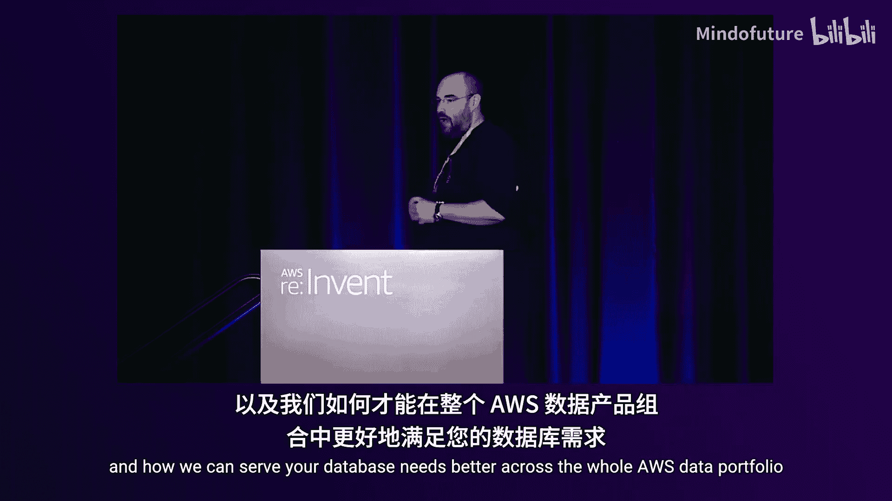
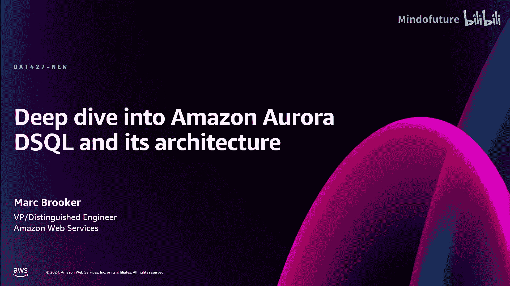
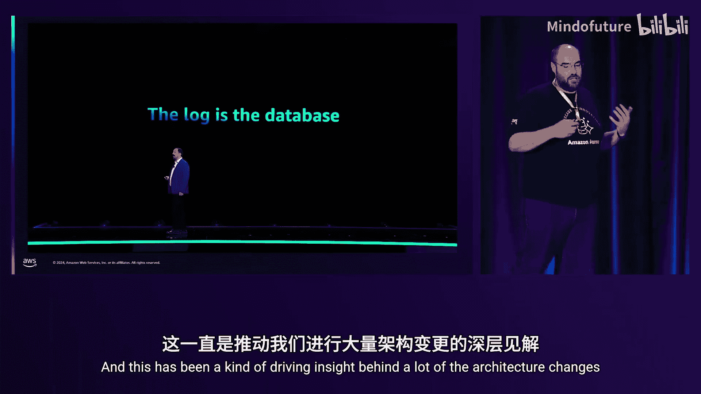
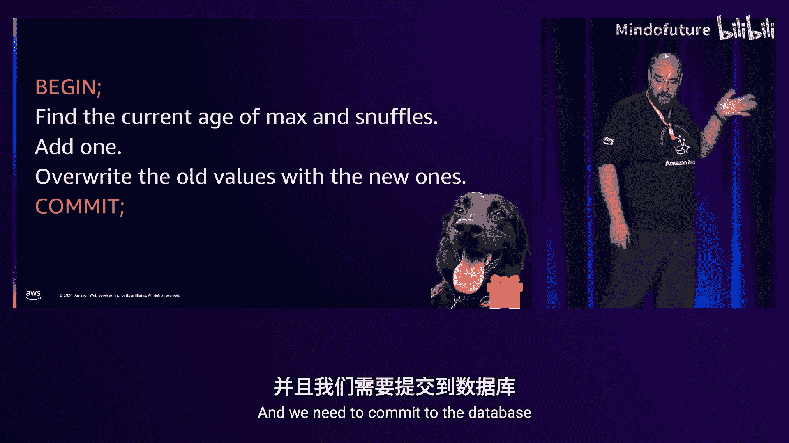
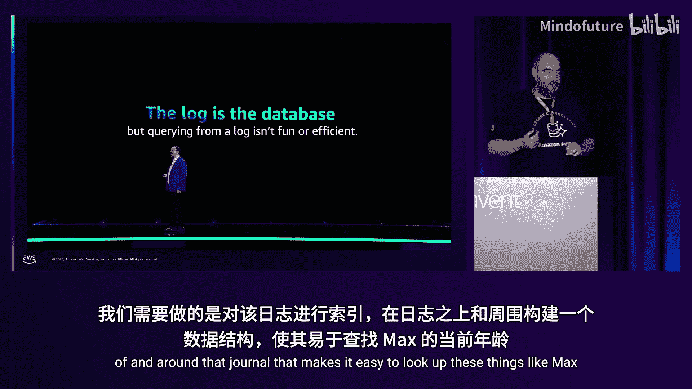
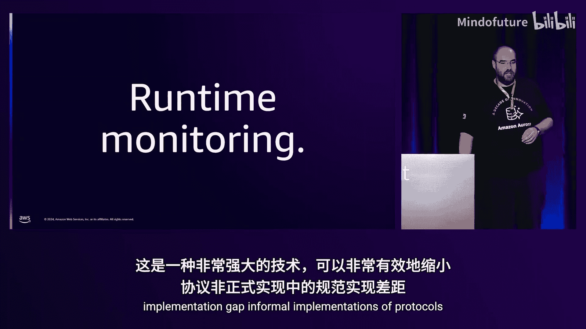
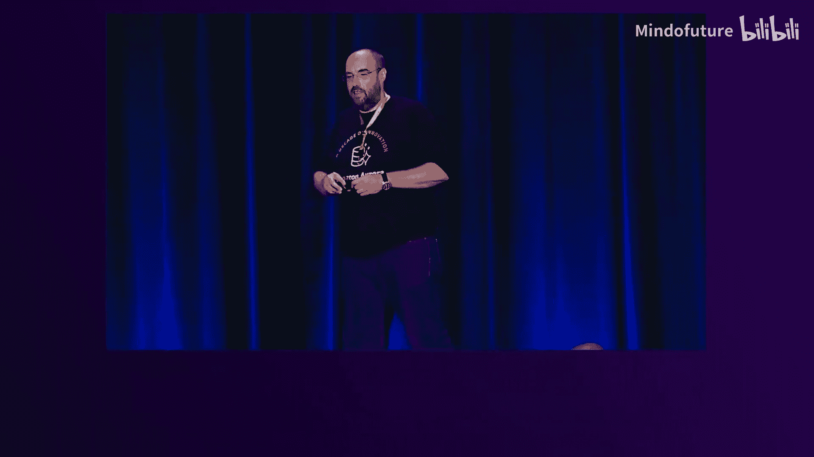

# 009：深入探讨Amazon Aurora DSQL及其架构







在本节课中，我们将深入探讨Amazon Aurora DSQL的架构设计。我们将了解其如何通过解耦传统数据库的各个组件，构建一个可扩展、高可用且强一致性的分布式关系型数据库服务。

---

## 概述：什么是Amazon Aurora DSQL？ 🚀

Amazon Aurora DSQL是一款为事务性工作负载优化的关系型SQL数据库。它专为支持微服务架构、网站和移动应用等OLTP场景而构建。DSQL旨在实现**向上和向下的弹性扩展**，支持从每秒数次请求到数百万次TPS的各类应用规模。它采用无服务器架构，用户无需管理基础设施。同时，它提供**跨可用区和跨区域的主动-主动部署**，并保持与PostgreSQL的高度兼容性。

DSQL的设计融入了AWS近20年运营云服务的经验，旨在重新思考事务型数据库的构建方式。

---

## 事务与ACID属性 🔒

上一节我们介绍了DSQL的定位，本节中我们来看看其如何保障事务的核心特性。理解一个事务型数据库，最好的起点就是事务本身及其ACID属性。

我们从一个简单的包含两条INSERT语句的事务开始：
```sql
BEGIN;
INSERT INTO dogs (id, name, age) VALUES (1, 'Snuffles', 3);
INSERT INTO dogs (id, name, age) VALUES (2, 'Sophie', 5);
COMMIT;
```




对于这个事务，数据库需要提供以下保障：
*   **原子性**：事务要么全部完成，要么完全不生效。
*   **一致性**：事务必须使数据库从一个一致状态转变到另一个一致状态。
*   **隔离性**：并发执行的事务互不干扰。
*   **持久性**：事务一旦提交，其对数据的修改就是永久性的。

DSQL通过其独特的架构来实现这些属性。

---

## 架构核心：日志即数据库 📜

DSQL架构的一个核心驱动力是“日志即数据库”的理念。这意味着所有数据的变更首先被记录到一个持久化的日志中。



对于我们的INSERT事务，系统会将‘Snuffles’和‘Sophie’这两条记录写入一个称为**日志服务**的内部组件。这个日志服务是AWS构建了超过10年的基础设施，为S3、DynamoDB等服务提供支持。它是一个原子、分布式、可扩展的复制系统。通过写入日志，我们立即获得了**原子性**和**持久性**。



然而，仅靠日志无法解决**隔离性**问题。例如，如何防止两个并发事务插入具有相同主键的行？为此，DSQL引入了另一个组件：**裁决器**。

裁决器负责检测事务之间的冲突。在提交前，事务会询问裁决器：“我可以提交吗？”如果裁决器基于其冲突检测规则（检查与近期已提交事务的冲突）判断可以，事务才会被写入日志。至此，事务具备了原子性、持久性和隔离性。

为了支持海量规模，裁决器本身也是可水平扩展的服务。它将键空间分区，每个分区独立工作。当涉及多个分区的跨分区事务需要提交时，裁决器会使用一个经过优化的**分布式提交协议**（一种两阶段提交的变体）来协同工作。

---

## 存储引擎：高效的查询与扩展 💾

上一节我们提到日志是权威数据源，但直接从日志查询历史数据效率很低。本节中我们来看看DSQL如何高效地服务查询。

DSQL需要一个能够高效查询数据的**存储引擎**。与大多数数据库架构不同，DSQL的存储层不负责持久性和并发控制（这些由日志和裁决器处理）。这使得存储引擎的设计可以更简单、更高效、更专注于查询性能。

存储引擎的主要职责是：
1.  **索引日志数据**：为日志中的数据建立索引结构，支持快速点查和范围扫描。
2.  **支持查询下推**：为了最小化网络往返，存储引擎可以执行部分查询操作，例如：
    *   **点查询**：`SELECT * FROM dogs WHERE id = 1;`
    *   **带谓词的扫描**：`SELECT * FROM dogs WHERE state = ‘hungry’;`
    *   **投影**：`SELECT name, age FROM dogs;`
3.  **通过分区实现扩展**：数据被分区并分布在多个存储节点上。随着数据量或读写负载的增长，可以通过添加节点或拆分分区来水平扩展。

---

## 计算层：无服务器SQL执行 ⚡️

现在让我们看看SQL语句是如何被解析和执行的。一个典型的OLTP事务可能包含应用逻辑与数据库的多次交互，例如：
```sql
BEGIN;
SELECT * FROM dogs WHERE state = ‘hungry’; -- 应用端决定喂哪只狗
UPDATE dogs SET state = ‘well-fed’, food_stock = food_stock - 1 WHERE name IN (‘Fido’, ‘Max’);
COMMIT;
```

这种交互性要求数据库有一个强大的计算层来执行SQL。DSQL借鉴了AWS Lambda的经验，使用**Firecracker微虚拟机**作为计算单元。

以下是计算层的工作流程：
1.  **连接与会话路由**：前端路由器接收PostgreSQL协议连接，并将新事务路由到可用的计算节点。
2.  **隔离的查询处理器**：每个计算节点是一个独立的Firecracker微VM，内部运行着修改后的PostgreSQL引擎，负责解析、优化和执行SQL。这些VM彼此完全隔离，这是实现良好扩展性的关键。
3.  **弹性伸缩**：计算节点的数量可以根据SQL负载动态调整，对用户完全透明。

---

## 读操作与多版本并发控制 🕰️

我们已经了解了写事务的流程，本节重点探讨读操作如何实现一致性。关键在于保证一个事务内的所有读取都来自数据库历史中的一个**一致的时间点快照**。

DSQL通过以下机制实现：
1.  **获取事务开始时间**：事务开始时，查询处理器从AWS的**TimeSync服务**（一个高精度、跨区域的时间同步服务）获取一个时间戳 `T_start`。
2.  **基于时间戳的读取**：此后，该事务的所有读操作都会向存储层请求“在时间 `T_start` 的数据状态”。
3.  **多版本并发控制**：存储节点不仅保存数据的最新版本，还维护一份近期的变更历史。当收到“读取时间 `T_start` 的数据”请求时，它能返回当时正确的数据版本。
4.  **无锁读取**：这种机制的最大优势是**读操作完全不需要加锁**，也不会阻塞写操作。如果存储节点发现它还没有接收到 `T_start` 时间点之后的所有日志，它会等待并应用这些日志，然后返回数据，从而保证一致性。

这种方法避免了读-写冲突和节点间复杂的协调，极大地提升了读性能的可扩展性。

---

## 可扩展性与弹性的基石：避免协调 🤝

分布式系统的可扩展性从根本上源于**避免不必要的组件间协调与通信**。幸运的是，这同样提升了系统的弹性（故障组件不影响健康组件）。

让我们回顾一个读写事务在DSQL中的完整提交流程，看看协调是如何被最小化的：
1.  **读阶段**：查询处理器直接与相关的存储副本通信获取数据，无需全局协调。
2.  **写阶段（本地缓冲）**：事务产生的写入在查询处理器本地缓冲，**不立即发送**到存储或其他节点。这避免了预提交阶段的协调。
3.  **提交阶段（唯一协调点）**：
    *   事务将待写入的键列表发送给相关的裁决器分区，执行冲突检查。
    *   通过后，事务被**原子性地**写入一个日志节点。
    *   日志异步地将数据变更推送给**仅包含相关键**的存储节点进行应用。

**关键点**：只有提交阶段涉及必要的协调（裁决器冲突检查和日志原子写入）。存储节点只关心与自身数据分区相关的事务，无关事务完全不会影响其性能。

---

## 隔离级别：强快照隔离 🛡️

DSQL选择的隔离级别是**强快照隔离**，它等同于PostgreSQL的“可重复读”级别。这是一个经过深思熟虑的选择，平衡了正确性、性能与开发复杂度。

强快照隔离提供以下保证：
*   **读已提交**：不会看到其他未提交事务的数据。
*   **可重复读**：在同一事务内，对同一数据的多次读取结果一致。
*   **写-写冲突检测**：如果两个并发事务修改了同一行数据，至少有一个会在提交时被中止。
*   **强一致性（线性化）**：读写操作具有全局顺序，不会出现数据“时光倒流”或因果颠倒的现象。

**为什么不是可序列化？**
可序列化隔离级别虽然更强，但会导致**只读事务也可能因为读取了某些数据而与其他事务冲突并中止**。在OLTP负载中读远多于写，这会给应用设计带来额外复杂度。快照隔离避免了这个问题，使应用开发者无需过度担忧读取模式。

**为什么不是更低的级别？**
在DSQL的架构中，实现更低的隔离级别（如读已提交）并不会带来显著的性能提升，反而可能增加协调开销。因此，强快照隔离被视为一个“甜点”选择。

---

## 多区域部署与容灾 🌍

对于跨区域部署，性能优化的核心是**最小化区域间的网络往返**，因为光速延迟是固定物理限制。

DSQL的多区域设计完美契合了其“避免协调”的架构：
1.  **读写本地化**：在事务的**读阶段**和**写缓冲阶段**，所有操作都在发起事务的本地区域完成，无需跨区域通信。
2.  **单次协调提交**：仅在**提交阶段**，为了确保持久性和隔离性，需要进行跨区域协调（将日志复制到多数派区域）。这是无法避免的物理定律。
3.  **只读事务零延迟**：只读事务的提交无需任何跨区域协调，可以在本地立即完成。

**快速故障转移**
DSQL支持三区域部署（两个主动区域，一个日志见证区域）。当发生区域级故障时：
*   **裁决器**将其少量的**临时软状态**快速迁移到健康区域。
*   **日志**基于法定人数协议，在健康多数派区域继续工作。
*   健康区域的客户端**读写不受影响**，保持强一致性。
*   故障区域的客户端暂时不可用。

这种设计实现了在保持**CAP定理中CP（一致性+分区容忍性）** 的前提下，在多数派区域维持可用性。

---

## 确保正确性：构建可信系统的工程实践 🧪

构建一个全新的分布式数据库是艰巨的任务。DSQL团队采用了多种先进工程实践来确保系统的正确性：

以下是团队采用的关键方法：
*   **Rust编程语言**：用于所有新组件的开发，兼顾高性能与内存安全，减少了整类稳定性和安全漏洞。
*   **确定性模拟测试**：使用如`Tokio`的`Tremor`等库，在构建时模拟网络故障、时钟偏差等异常情况，对分布式协议进行单元测试。
*   **模糊测试**：针对SQL接口生成海量随机查询，与PostgreSQL参考实现进行结果比对，快速发现兼容性和正确性问题。
*   **形式化方法**：
    *   在架构层面，使用TLA+等工具对协议进行形式化规约和验证。
    *   在代码层面，对关键算法进行形式化推理。
    *   **运行时监控**：将生产日志与形式化规约进行比对，确保实际运行符合理论设计。

这些实践共同构建了对DSQL正确性的高度信心。

---

## 总结与展望 🎯

本节课中我们一起深入探讨了Amazon Aurora DSQL的架构。我们了解到：



1.  **解耦与专精**：DSQL通过将传统单体数据库解耦为**日志服务**、**裁决器**、**存储引擎**和**无服务器计算层**，使每个组件可以独立、弹性地扩展。
2.  **日志为核心**：“日志即数据库”的理念简化了持久化和原子性的实现。
3.  **避免协调**：通过**多版本并发控制**、**基于物理时钟的快照**以及**延迟写入缓冲**，将必要的协调压缩到事务提交的最后一刻，这是实现极致扩展性和弹性的关键。
4.  **强快照隔离**：选择了在正确性、性能和应用开发友好性之间取得平衡的隔离级别。
5.  **多区域优化**：利用架构优势，实现了读写本地化和快速故障转移的多区域部署。
6.  **严谨的工程**：采用Rust、形式化方法、模拟测试等先进实践确保系统正确性。




DSQL代表了AWS对云原生关系数据库的重新思考，旨在让开发者无需关心底层复杂性，就能构建可随业务无限扩展的强一致性应用。