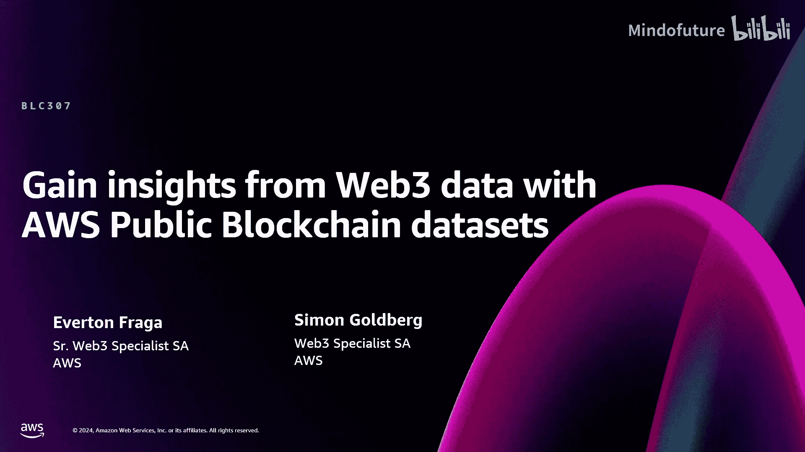
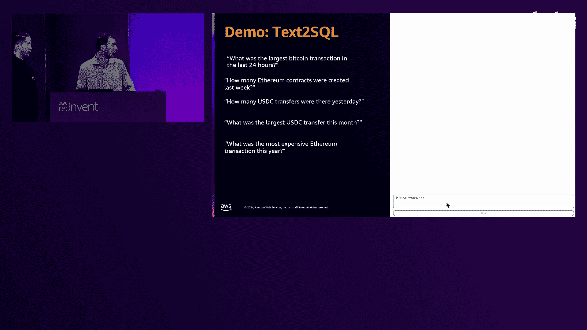
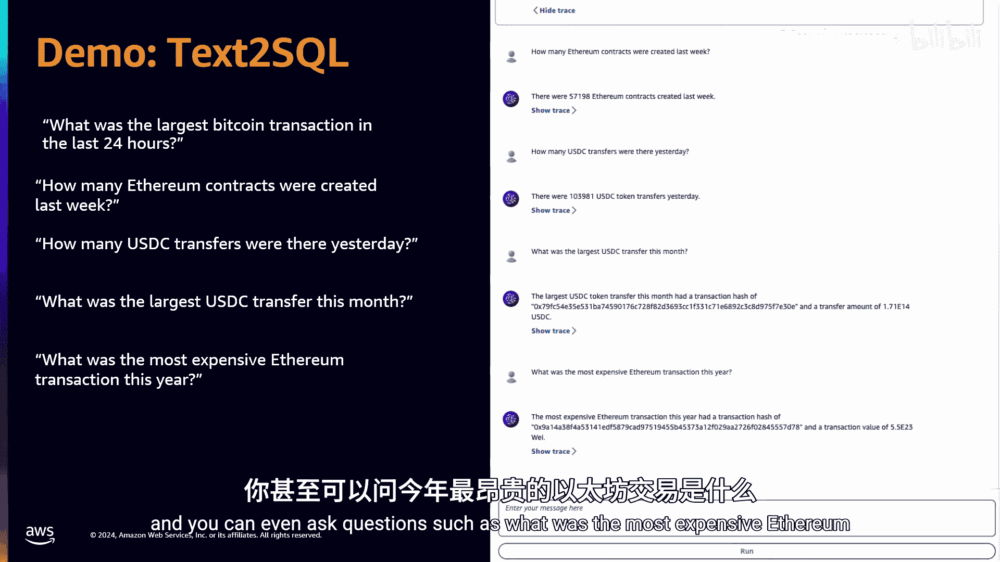
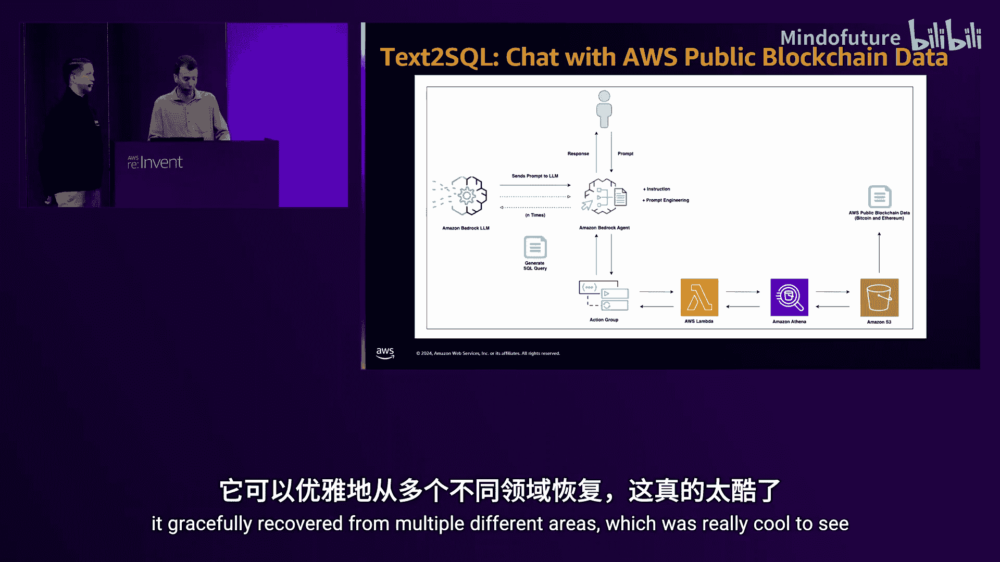
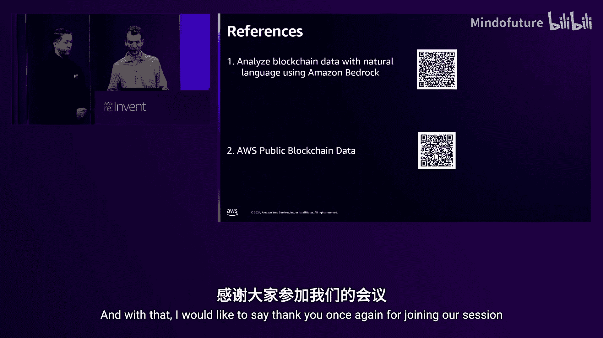

# 010：利用AWS公共区块链数据集从Web3数据中获取洞察

在本节课中，我们将学习AWS公共区块链数据集及其应用。我们将了解Amazon Managed Blockchain Query服务，探索数据集的结构，并学习如何通过SQL查询和生成式AI工具从区块链数据中提取有价值的信息。

---

## 🏗️ 议程概述

我们将首先介绍Amazon Managed Blockchain Query服务。接着，我们会详细讲解AWS公共区块链数据集的架构和新增支持的区块链。然后，我们将通过一个结合生成式AI的演示，展示如何用自然语言查询这些数据。最后，我们会比较不同数据访问方式的优劣并进行总结。

---

## 🔍 Amazon Managed Blockchain Query

Amazon Managed Blockchain Query是一项全托管服务，旨在帮助用户绕过索引区块链数据的复杂性。该服务提供简单的API，允许应用程序直接从区块链工作负载中查询结构化数据。

服务负责所有索引和加载工作，并提供对这些信息的低延迟访问。

目前支持**比特币**和**以太坊**区块链。用户可以通过它查询一些复杂的请求，例如以太坊的历史余额（这通常需要具备完整历史数据的存档节点），或者比特币的原生余额和交易历史。

---

## 📊 AWS公共区块链数据集

AWS公共区块链数据集于2022年作为开源项目发布，最初支持比特币和以太坊。

AWS内部构建了一个ETL流程，在对比特币和以太坊区块链执行RPC请求后，对数据进行转换。转换完成后，数据被持久化存储在一个名为`aws-public-blockchain`的公共S3存储桶中。

以下是数据集架构示例及其所能提供的洞察。

### 以太坊数据集架构

以太坊数据集包含六个不同的表：
*   **blocks**：区块信息
*   **transactions**：交易信息
*   **logs**：日志信息
*   **token_transfers**：代币转账信息
*   **traces**：调用追踪信息
*   **contracts**：合约信息

这是一个非常全面的数据集。

### 比特币数据集架构

比特币数据集包含两个表：
*   **blocks**：包含从2009年第一个被挖出的比特币区块到最新区块头的信息。
*   **transactions**：包含数据集中的每一笔交易。

这些数据集对于执行SQL查询非常有用，无论是基础还是高级查询。例如，您可以查询有史以来最大的比特币交易，或者创建资金流向热力图来展示不同账户间的资金流动。

---

## 🆕 扩展的区块链支持

许多客户询问我们是否会支持比特币和以太坊之外的区块链。我们很高兴地宣布，本周我们刚刚新增了五个由索引合作伙伴提供的数据集。

我们已成功接入了**Aptos**、**Arbitrum**、**Base**、**Polygon** 和 **XRPL**。

其运作方式相当简单：所有数据每天都会被加载到我们的公共S3存储桶中。用户可以免费下载这些数据集，或者将其连接到AWS服务，如Redshift、SageMaker或Amazon Athena，从而立即开始查询。

具体来说，您可以创建一个指向这些S3存储桶的Amazon Athena数据目录，或者创建一个Glue爬虫程序定期检查数据集的示例文件并自动生成模式，这样您就可以通过Athena进行查询。

我们希望通过此举降低研究人员和实验者索引数据的成本。此外，金融服务领域的客户通常有很高的合规性要求，现在他们可以开始使用公共数据，而无需克服重重障碍。他们可以先了解数据，这能有效帮助他们完成采购流程并满足IT要求。

我们视其为减轻客户负担的一种方式。当然，新增的五个区块链加上之前的两个，并不能覆盖所有需求。我们的合作伙伴为超过70个区块链提供数据服务，他们拥有专有的数据质量框架和企业级的可扩展写入基础设施。

---

## 🤖 演示：结合生成式AI的文本转SQL查询

我们基于AWS公共区块链数据集构建了一个演示，并增加了一个新组件：生成式AI。我们思考如何将生成式AI与Web3数据结合，构建真正有用的解决方案。

我们准备了一个Bedrock智能体，它能够实现文本转SQL查询。您可以输入自然语言问题，智能体会理解用户意图，生成SQL查询语句，调用关联的Lambda函数，在Amazon Athena上执行生成的查询，然后将响应返回给智能体。如果出现错误，系统会自动分析错误信息并尝试生成新的查询，这是一种有效提升解决方案整体稳健性的方法。

以下是演示中可提出的问题示例：
*   过去24小时内最大的比特币交易是什么？
*   上周创建了多少个以太坊合约？
*   昨天发生了多少次稳定币转账？
*   本月最大的稳定币转账是什么？
*   今年最昂贵的以太坊交易是什么？
*   过去24小时（或过去一小时）最受欢迎的智能合约是哪些？这能很好地展示整个DeFi生态系统的活跃热点。

---

## 🏗️ 解决方案架构概述

以下是该解决方案的简要架构图，帮助您了解Bedrock智能体模式以及我们如何将其集成到可在Amazon Athena上执行查询的Lambda函数中。

1.  **用户输入**：用户输入提示，例如“有史以来最大的比特币交易是什么？”或“过去一个月的比特币交易量是多少？”。
2.  **Bedrock智能体**：本示例中的智能体使用了Claude Anthropic Haiku模型。该模型能理解用户意图。例如，当询问“今天最受欢迎的智能合约是什么？”时，模型知道以太坊支持智能合约而比特币不支持，因此会为以太坊数据集而非比特币数据集构建查询。
3.  **行动组**：行动组是智能体与某些计算功能之间的中间件。在我们的案例中，行动组的描述很简单：接收SQL查询并将响应返回给用户。它接收单个输入（查询）并返回原始数据响应。
4.  **Lambda函数**：生成的查询被传递给Lambda函数。
5.  **Amazon Athena执行**：Lambda函数在Amazon Athena上执行查询，而Athena查询的是AWS公共区块链数据集。
6.  **错误处理**：由于智能体的非确定性行为，有时可能会出错，生成的SQL查询语法可能无效。通过在给智能体的指令中告知其“分析错误信息以生成新查询”，它能够优雅地从多种错误中恢复。

此解决方案最初仅支持比特币和以太坊区块链，但现在随着我们新增了五个区块链，它可以进一步扩展以支持对其他链（如Base和XRPL）的文本转SQL查询。

---

## ⚖️ AWS公共区块链数据集与AMB Query的协同与比较

AWS公共区块链数据集和AMB Query之间存在一定的功能重叠，但差异也很明显。

*   **AMB Query**：允许您向服务发起低延迟请求，获取已结构化的信息，包括历史余额。您无法在公共区块链数据集中直接找到余额信息。
*   **AWS公共区块链数据集**：包含所有转账、区块信息、交易信息等，但不包含实际余额。

因此，两者之间存在协同效应。可以预见一些用例会结合两者使用。AWS为您提供了多种选择，这只是其中之一。

我们进行了一项具体研究来比较两者。通过Amazon Athena查询单个比特币余额大约需要75秒，因为需要扫描1.15 TB的数据。根据Athena的定价（每扫描1TB数据约5美元），查询一个比特币钱包余额需要等待75秒并支付约6美元，这并非理想的体验。

AMB Query填补了这一空白，它提供毫秒级延迟，并且每百万次请求的固定成本约为6-7美元。相比之下，性能提升可达百万倍。

关于数据存储格式的说明：目前数据集文件以Parquet格式存储在S3上，这有助于快速读取。我们正在探索其他途径来进一步缩短查询时间，缩小性能差距。

---

## 📚 参考资料与总结

本节课我们一起学习了如何利用AWS公共区块链数据集从Web3数据中获取洞察。

我们介绍了Amazon Managed Blockchain Query服务，详细了解了数据集的架构和新增的区块链支持，并通过一个结合生成式AI的演示展示了如何用自然语言便捷地查询数据。最后，我们比较了不同数据访问方式的差异。

我们期待看到这些新链在开放数据集中的表现，并希望在不久的将来扩展支持更多区块链。

**参考资料：**
*   AWS公共区块链数据网站：包含所有S3 URL的登录页面。
*   使用Bedrock通过自然语言分析区块链数据的详细指南。

感谢您的参与。