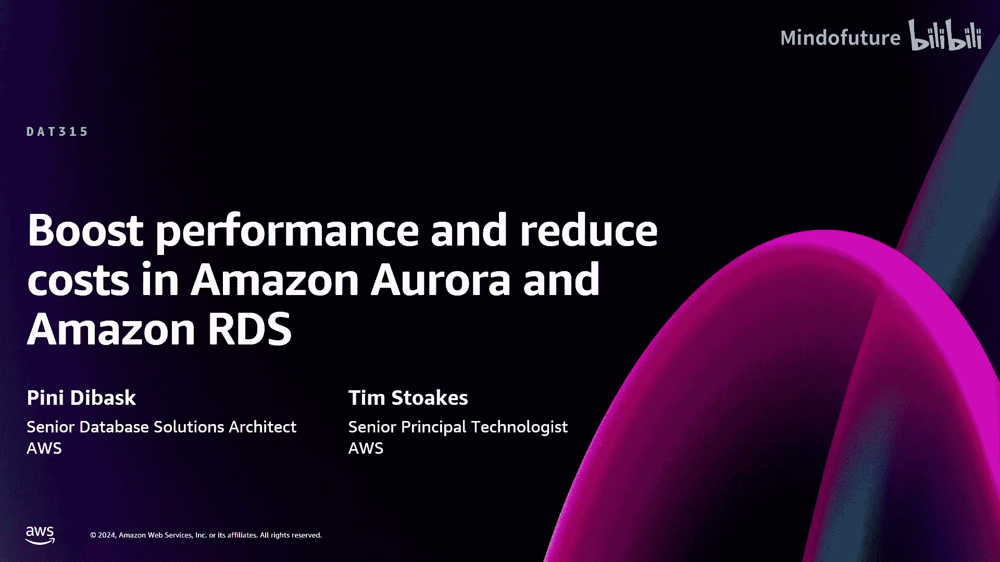
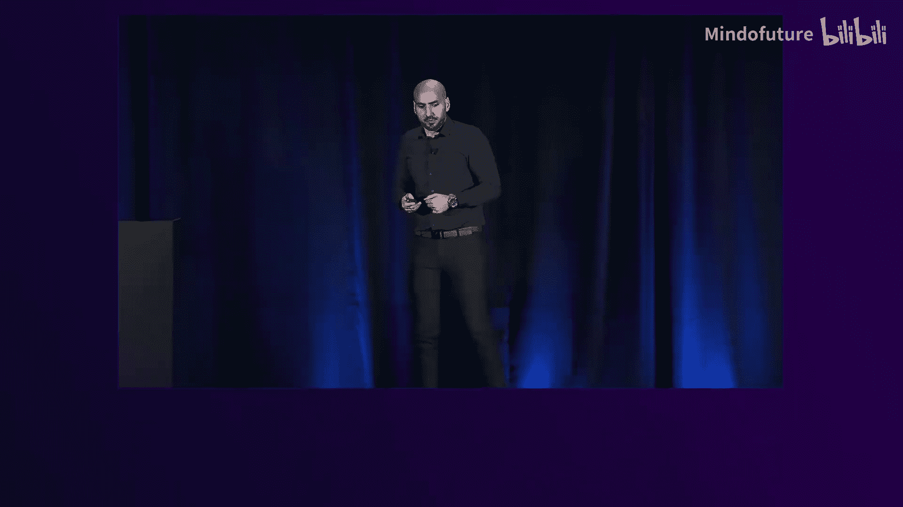
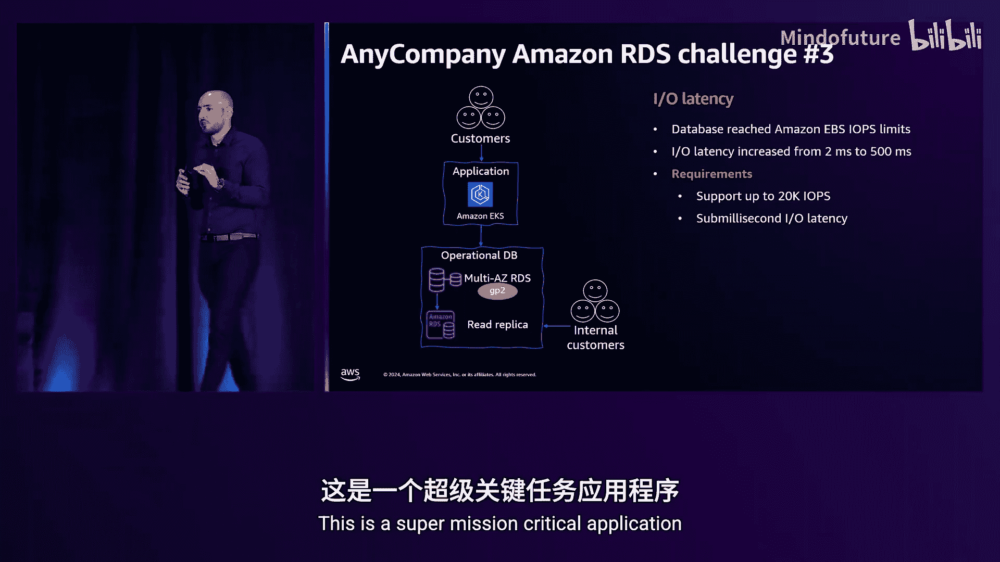
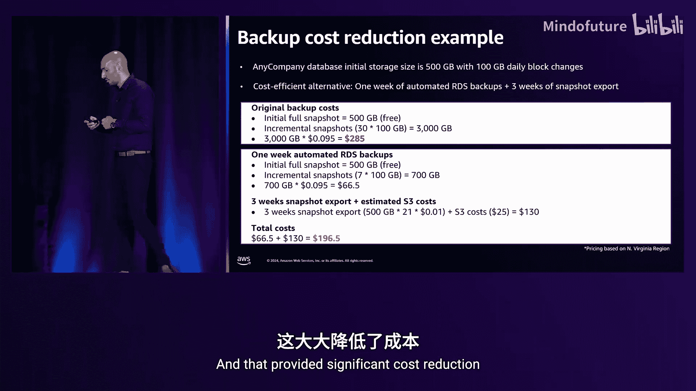
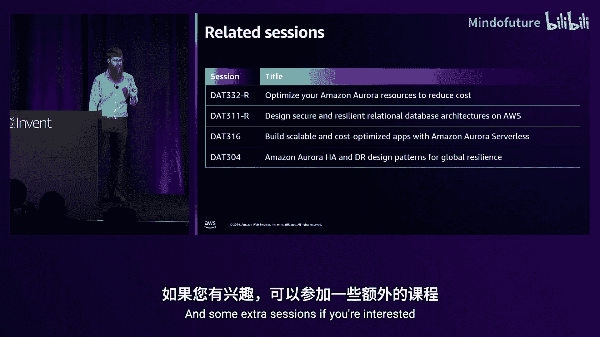

# 013：在Amazon Aurora和Amazon RDS中提升性能并降低成本

在本节课中，我们将探讨如何在Amazon Aurora和Amazon RDS中提升性能并降低成本的技巧与最佳实践。我是Pein Dibask，AWS的数据库解决方案架构师，稍后我的同事Tim，AWS的高级首席技术专家，将加入我们。

我假设许多听众已经熟悉Amazon RDS。它是一个全托管的云关系型数据库服务。使用Amazon RDS，您可以将时间用于创新和优化应用程序，而无需关注数据库的运维管理任务，如升级、备份、资源调配等。它支持Oracle、SQL Server、DB2等商业引擎，以及MySQL、PostgreSQL、MariaDB和Amazon Aurora等开源引擎。

Amazon Aurora非常独特，它是一个云原生的数据库引擎，旨在为您提供商业级企业数据库的企业级安全性、可用性和可靠性，同时兼具开源数据库的简单性和成本效益。凭借其独特的特性和优势，Amazon Aurora已成为AWS历史上增长最快的服务，目前有数十万AWS客户将其用作关系型数据库。

接下来，我们将深入探讨RDS的各种成本维度。每个RDS集群都涉及计算、存储和网络等成本。还有一些非常常见的额外成本，例如备份、数据传输和I/O操作。此外，还有一些成本取决于您特定的应用程序用例以及您为应用程序使用了哪些数据库功能。在本演示中，我们将引导您了解一些最常见的成本维度，以及我们如何应对和优化这些成本。

我们将通过一个名为“Any Company”的公司的示例来完成这个过程。这是一个虚构的客户旅程，但它确实代表了我和我的团队在日常工作中经常看到的、与您类似的客户所面临的一些最常见挑战。

首先，了解一下“Any Company”的背景。该公司利用生成式AI赋能电商卖家，将每个产品打造成畅销品。他们的核心AWS服务是用于应用层的Amazon EKS和用于运营数据库层的Amazon RDS。Any Company是一家快速成长、成功的初创公司，但仍处于早期阶段。他们面临的挑战之一是在扩展规模时平衡成本与性能。这是我们通常帮助客户解决的典型挑战。

我们将引导您了解他们使用Amazon RDS的旅程。然后，在演示的第二部分，Tim将引导您了解一个类似但不同的旅程，这次是使用Amazon Aurora。因此，您还将了解RDS和Aurora在性能和成本方面的异同。

在今天的演示中，我想重点讨论三个关键成本维度：计算、存储和备份。让我们从计算开始。

## 计算成本优化

我想介绍Any Company面临的第一个挑战。Any Company最初使用的是R6G.xlarge实例类型。起初一切运行顺利。然而，随着客户采用率的增加，他们注意到CloudWatch中的CPU利用率指标偶尔会飙升至100%。这对他们解决方案的可靠性产生了影响，甚至有客户抱怨速度慢和超时。

许多客户问我们的一个明显问题是：应该使用哪种RDS实例？这可能是一个棘手的问题，因为有太多RDS实例类型可供选择。这是一个我们经常从客户那里听到的常见问题。我们需要确保找到一个既注重性能又注重成本的解决方案。

在AWS上，您有很多选择。可突增性能实例非常适合小型或可变的工作负载。通用实例适合CPU密集型应用。内存优化实例非常适合内存密集型应用。基于ARM架构的Graviton实例相比x86同类产品提供了更高的性价比，使其成为各种工作负载的理想选择。顺便提一下，这里您看到的是Graviton 3。但我们最近宣布了Amazon RDS对Graviton 4的支持，因此现在Amazon RDS也支持R6G和M6G实例。

现在，您可能会问，找到合适实例的最佳方法是什么，因为有这么多选项。我想向您展示Any Company在做出资源调整决策之前使用了哪些工具。让我们从监控工具开始。

说到监控，最明显的服务是Amazon CloudWatch。这是AWS主要的监控和可观测性服务。它允许您基于数十个实例级指标（如CPU、内存、网络和磁盘利用率）进行监控、可视化和告警。当您需要深入研究更细粒度的操作系统级指标（如Linux大页、交换活动和操作系统进程列表）时，RDS增强监控就派上用场了。当涉及到深入的数据库级监控，包括SQL语句和等待事件的可视化时，RDS性能详情就是正确的工具。

说到RDS性能详情，我们发现许多客户告诉我们，他们发现它在诊断最复杂的数据库瓶颈时非常有效和高效，因为它可以帮助您按各种维度（如等待事件、SQL语句、应用程序、服务器等）可视化、深入分析、切片和切分活动。它支持所有Amazon RDS引擎，因此这是我们通常推荐客户启用的一个非常有用的工具。

我们还发现许多客户在做出资源调整决策之前使用性能详情。当我们看到一个数据库负载图表，其中实例的vCPU数量远高于数据库负载时，我们知道这可能是一个资源过度的实例，因此可能存在成本优化机会。另一方面，当我们查看负载图表，发现特定实例的vCPU数量低于实际工作负载和实际数据库负载时，这可能是一个资源不足的实例。因此，我们需要调整应用程序、数据库、SQL语句，或者调整实例大小。

许多客户告诉我们，您发现在进行资源调整决策时，CloudWatch和性能详情很有用。但您也明确告诉我们，您需要更多关于大规模自动化推荐方面的帮助。有些人有数十、数百或数千个实例，需要更大规模的自动化推荐。这就是为什么几个月前，我们听取了您的反馈，并宣布了AWS计算优化器对Amazon RDS MySQL和Amazon RDS PostgreSQL的支持。现在，我们可以帮助您为整个实例群确定合适的实例大小。在这个示例截图中，您可以看到一个建议，从基于Graviton2代的R6G迁移到基于Graviton3代的R7G，后者提供了更高的性价比。

使用正确的工具和AWS计算优化器帮助我们解决了Any Company的第一个挑战。通过迁移到基于新一代Graviton的R7G.xlarge，他们实现了27%的性价比提升，这使他们能够为客户提供更稳定、更稳定的工作负载。因此，他们提供了改进的性价比。这也是一个很好的例子，展示了利用最新的Graviton创新不仅提升性能，而且以注重成本的方式实现。

## 应对“吵闹的邻居”问题

Any Company面临的第二个挑战是“吵闹的邻居”。当内部客户（本质上是数据分析师）开始查询数据库以生成报告时，性能开始下降。他们需要为执行领导团队构建一些仪表板，而这些报告查询对核心客户应用程序产生了影响。这是一个典型的“吵闹的邻居”案例。当我们说在同一数据库资源上运行竞争性工作负载时，这是一个常见场景。我们需要找到一种方法来有效地分离它们，或者以更有效的方式管理它们，使它们互不干扰。

传统方法是垂直扩展，通过调整实例大小并迁移到更大的实例。然而，使用只读副本，我们有更大的灵活性，可以创建多达15个只读副本，每个副本可以有不同的规格。通过这样做，我们可以消除“吵闹的邻居”问题，并确保应用程序具有更高的吞吐量。

您可能会问垂直扩展和水平扩展之间的成本差异。答案确实取决于您特定的应用程序用例，每个工作负载都是独特的。但在Any Company的案例中，从R7G.xlarge垂直扩展到R7G.2xlarge实际上使计算成本翻倍。因此，他们决定使用只读副本进行水平扩展。他们发现使用一个较小的只读副本R7G.large实际上非常有效和高效地处理了他们的报告查询，为这个“吵闹的邻居”问题提供了一个更具成本效益的解决方案。顺便提一下，您可能会注意到这里有一些价格示例。我们使用的是弗吉尼亚北部地区的按需定价。请注意，使用Amazon RDS，您可以选择使用预留实例。因此，如果您能为稳定状态的工作负载承诺一年或三年的期限，实际上可以获得显著的折扣。但为简单起见，在本示例以及本演示的所有剩余示例中，我们将使用弗吉尼亚北部地区的按需定价。

解决此问题的另一种替代方案是使用Amazon ElastiCache缓存频繁访问的数据，如SQL结果集。这能够提供更快的性能，并且在许多情况下，与其他替代方案相比，成本要低得多。它的工作原理是，有几种分配策略，但一种常见的是，每次我们写入数据库（比如插入或更新记录）时，我们也同时更新缓存（Amazon ElastiCache）。一旦我们需要读取数据，我们可以直接从内存数据库中读取，这提供了改进的性能。

然而，使用ElastiCache缓存频繁的结果集并不适用于所有用例和工作负载。在某些情况下，您有非常独特的临时动态过滤器。在这些情况下，使用ElastiCache不一定能提供最佳结果。因此，在Any Company的这个特定用例中，由于大部分报告查询都是动态的、临时的，基于独特的查询，他们决定采用不同的路线，即使用只读副本来卸载查询。通过这种方法，他们在核心面向客户的应用程序性能（本质上是API）上实现了整体50%的改进。因此，这是一个很好的例子，展示了通过使用只读副本来卸载读取密集型查询，您可以确保消除“吵闹的邻居”，同时让两者都能平稳运行。

## 存储成本优化

现在我想谈谈第二个成本维度，即存储。在Amazon RDS中，您有一系列EBS选项来匹配您的性能需求。GP2将IOPS数量与分配的存储量挂钩。因此，随着您分配更多存储空间（更多GB或TB），您将受益于更多IOPS。另一方面，GP3为您提供了更大的灵活性，您可以独立于存储大小来分配IOPS和吞吐量。同样，灵活性更高。然而，GP2和GP3都最适合开发和测试环境，以及中等规模的工作负载。当您需要确保拥有需要一致低延迟的关键任务应用程序时，IO1和IO2 Block Express是首选选项，其中IO2因其改进的耐用性、吞吐量和低延迟而更受推荐。

为了与IO2进行比较，您获得了五个9（99.999%）的耐用性。这比IO1耐用100倍。您还获得了亚毫秒级的I/O延迟。这是Amazon RDS中唯一为您提供亚毫秒级I/O延迟的EBS选项。顺便提一下，IO1和IO2定价相同。因此，如果您今天使用IO1，您可以并且应该考虑迁移到IO2，以获得改进的性能和耐用性，而无需额外增加成本。因此，强烈建议从IO1迁移到IO2。这是一个在线操作。但正如我们常对客户说的，请在非生产环境中测试，然后再在生产环境中进行。

现在回到Any Company的另一个挑战，该挑战围绕EBS I/O延迟展开。随着他们的数据库扩展，他们达到了EBS IOPS限制，这导致他们的I/O延迟从2毫秒飙升至500毫秒，这是一个显著的性能打击。这是我们偶尔看到的扩展问题，高I/O需求可能导致I/O瓶颈和I/O延迟问题。因此，我们需要找到一个解决方案。有时，除了实例资源调整外，我们还需要进行存储资源调整。来自Any Company DevOps团队的要求非常明确：我们需要亚毫秒级的I/O延迟。这是一个超级关键任务应用程序。

与本演示中讨论的所有其他挑战类似，使用正确的监控工具，我们能够轻松识别瓶颈。在这里，我们可以看到RDS性能详情指标仪表板清楚地表明，EBS I/O数量和I/O延迟都有所增加，如前所述，延迟增加到了500毫秒。

因此，这里的解决方案是使用存储资源调整。在我们的案例中，从GP2迁移到IO2 Block Express是正确的举措，因为这为客户提供了亚毫秒级的I/O延迟。使用CloudWatch、性能详情和计算优化器等工具有助于您了解何时以及何处需要进行调整。

## 优化慢速报告查询

现在来看第四个挑战。第四个挑战是关于慢速报告查询。我们之前提到，内部客户（数据分析师）在只读副本上运行报告查询。他们基本上运行这些复杂的SQL查询，其中包含大量JOIN、ORDER BY和GROUP BY操作。我们发现这些仪表板的平均加载时间约为10秒。执行领导团队表示，他们最多能容忍5秒。

我们开始深入研究性能问题。我们发现这些复杂的SQL查询生成了大量临时对象。像PostgreSQL这样的数据库系统尝试在内存中执行操作以获得最佳性能，但在某些情况下，当没有足够的内存用于这些操作时，它们实际上会将临时对象写入磁盘。在我们的案例中，是写入EBS。这可能会增加延迟，特别是对于大型数据集和复杂查询。

解决此问题的一种方法是使用一个我强烈推荐给大多数遇到此问题的客户的功能，即RDS优化读取。RDS优化读取本质上为您提供了一个本地、快速的NVMe SSD，专门针对该用例。它不将那些需要存储排序或分组查询中间结果的临时对象写入EBS，而是将它们存储在这些本地NVMe SSD中。这要求您使用支持此类本地NVMe SSD的实例，如R6G或R6iD。在我们的案例中，通过使用优化读取，我们成功解决了这个问题。

因此，我们可以看到这里的请求示例。Any Company本可以选择垂直扩展，将只读副本迁移到R7G.2xlarge架构，这会使计算成本翻倍。然而，他们决定使用优化读取，并搭配当前支持优化读取的最新Graviton代实例，即R6GD.large。这为他们提供了所需的性能。他们实现了查询执行时间快两倍，而没有显著增加基础设施开支。实际上，原始实例类型与基于优化读取的新实例类型之间的成本差异不到10%，但却为他们的报告查询提供了两倍的性能。因此，如果您遇到由于需要存储排序、分组或连接操作中间结果的复杂查询而导致大量临时对象写入磁盘的问题，RDS优化读取可能是您解决方案的一个绝佳候选。

## 备份成本优化

现在我想谈谈最后一个成本维度，即备份。RDS提供两种类型的备份：自动备份和数据库快照。自动备份包括每日EBS快照。除此之外，它们还每五分钟将事务日志存储在S3中。自动备份的好处是，它可以在您的保留期内提供细粒度的时间点恢复，保留期最长可达35天（35天是最大值）。另一方面，数据库快照可以随时拍摄，并且您可以保留它们直到删除为止。因此，这些快照没有过期日期，这为您提供了对长期备份管理的更多控制。

这引出了Any Company的最后一个挑战，即高备份成本。Any Company有一个月的备份保留期，这对公司来说是相当标准的。然而，仔细查看客户需求后发现，他们实际上只需要一周的数据可恢复，而一周以上的数据仅用于合规性查询访问，不需要可恢复，仅用于合规性查询访问。因此，我们要求大幅降低备份成本。

有几种经济高效的方法来处理长期备份。一种方法是使用快照导出到S3，可以是完整的也可以是部分的，因此我们可以对整个数据库或特定的模式或表执行此操作。然后我们将其存储在Apache Parquet格式中，这种格式非常适合使用Amazon Athena等工具进行存储查询。它是一种压缩格式。另一种替代方法是使用原生数据库工具进行逻辑备份。例如，对于PostgreSQL，您有pg_dump；对于MySQL，您可以使用MySQL Shell dump。这些都是提供经济高效的长期备份方法的不同方式。

这两种情况的好处是，无论是快照导出到S3还是逻辑备份到Amazon S3，现在数据都存储在您客户拥有的存储桶中。因此，您可以完全控制存储类别。例如，您可以将其定义为S3标准，这非常适合频繁访问的数据。或者，如果您知道访问模式需要较少频繁地访问该数据，您可以使用S3不频繁访问甚至S3 Glacier。因此，它为您提供了关于如何存储数据的更大灵活性，而使用我们之前提到的自动备份和数据库快照等原生RDS备份时，您无法控制使用哪个S3存储类别。这为您提供了这种灵活性。

现在，使用这种方法，我们成功地大幅降低了备份成本。我们可以看到这里的原始备份成本，它使用了30天的自动备份。假设数据库大小为500 GB，我们每天有100 GB的EBS块更改。我们假设初始快照为500 GB，并且是免费的，因为AWS为您提供高达数据库大小100%的免费备份存储成本。然后我们对每个增量快照收费。您可以看到每个增量快照为100 GB，代表每日块更改。另一方面，使用经济高效的替代方案，我们可以看到我们只使用一周的自动RDS备份，剩余数据则使用我们刚才在上一张幻灯片中提到的S3快照导出方法。这显著降低了成本。

更准确地说，这使他们的备份成本降低了30%，展示了高效的备份数据保留如何在保持合规性访问和数据保留要求的同时，带来显著的节省。

现在，我想暂停一下，问您一个问题：这三张图片有什么共同点？我们可以看到这里有手电筒、雷达和放大镜。没错，它们都提供可见性。这些都是提供可见性和检测的工具。展示它们的原因是，当涉及到数据库性能和成本时，您无法修复您看不到的性能或成本问题。

因此，我们讨论了一些工具，如CloudWatch、性能详情、增强监控。这些工具对我们的客户来说非常棒。正如您所见，Any Company在整个旅程中都使用了它们。然而，Any Company也对AWS提供的传统监控工具提出了一些挑战，也许你们中的一些人也能感受到这些挑战。因此，我想谈谈这些挑战，并向您展示我们为解决这些问题而构建了什么。我们即将发布一个有趣的公告。

第一个挑战是，虽然性能详情对于深入的数据库诊断非常有用，但信息始终以实例级视图呈现。您可以在实例之间切换，但您永远看不到全貌，因为您一次只能看到一个实例。当您想到Any Company的旅程时，他们开始时是一个早期初创公司。但一旦他们扩展并变得更大，需要管理数十或数百个实例时，这个问题对他们来说就变得非常相关了。

另一个挑战是，正如您所知，在AWS中，我们有大量数据、性能数据、跟踪、日志分散在许多工具中。例如，CloudWatch和CloudWatch日志、RDS增强监控、RDS性能详情、RDS事件。许多客户要求我们提供集中式遥测，以便他们拥有真正的单一管理平台。

最后，许多客户告诉我们，他们希望更好地理解应用程序上下文，特别是应用程序API与数据库性能之间的关联。因此，我们听取了您的反馈。今天，我们非常高兴地宣布CloudWatch数据库洞察。

借助CloudWatch数据库洞察，通过这项新公告，我们将您所有的数据库监控整合到Amazon CloudWatch内的单一统一视图中，因此您可以通过特定标签或区域内特定实例来定义实例群。一旦您这样做，您会得到一个热图，显示实例摘要，以便您可以根据各种维度（如数据库负载、数据库告警和不同指标）了解瓶颈所在。通过此发布，我们支持Amazon Aurora PostgreSQL和Amazon Aurora MySQL，未来还将支持其他RDS引擎，敬请期待。

此外，这项公告的另一项创新是，首次当您深入某个特定实例时，您可以关联所有跟踪、日志数据和等待事件，因为现在您拥有一个完整的、开箱即用的、原生的集中式遥测。最后，也许你们中的一些人熟悉CloudWatch应用程序信号，这是一个应用程序性能监控解决方案，一个APM工具。CloudWatch应用程序信号允许您使用CloudWatch代理和AWS Distro for OpenTelemetry来捕获性能和跟踪数据。许多客户告诉我们，我们需要一个更好的集成故事。我们需要更好地理解数据库性能与应用程序性能之间的关联。因此，我们需要查看与任何数据库瓶颈相关的依赖API调用和依赖服务。现在，借助CloudWatch，您可以做到这一点。借助CloudWatch数据库洞察，我们为您提供了对每个数据库瓶颈的依赖API调用的可见性。

最后但同样重要的是，你们中许多使用性能详情的人可能熟悉查看特定实例并深入研究有问题的SQL语句。您正在查看指标或统计数据，如执行次数、临时读取或写入次数、页面读取或写入次数。您可能看到的是数字，但通常，该数字是您选择的时间段内的聚合值。因此，查看上周并看到该特定语句执行了10000次是有用的，但查看随时间变化的趋势会更有用。现在，通过此发布，我们还为您提供了查看每个SQL指标和每个SQL统计数据随时间变化趋势的能力。因此，不仅仅是看到一个总数（这可能有所帮助，但信息量不大），现在您可以看到它随时间的行为。

总而言之，您无法修复您看不到的性能或成本问题。因此，您应该利用最新的监控创新，如CloudWatch数据库洞察，并更加积极主动。毫无疑问，Any Company使用这些工具来解决他们的挑战。说到Any Company，我想在将控制权交给Tim之前，快速回顾一下他们的RDS旅程。

我们首先遇到了由于客户采用率增加而导致工作负载增加的问题。我们通过实例资源调整解决了这个问题，特别是通过使用Graviton，最新的Graviton创新，这提供了改进的性价比。后来，我们遇到了“吵闹的邻居”问题，我们通过将报告查询卸载到只读副本来解决。因此，现在核心客户应用程序和报告查询可以平稳地一起运行，互不干扰。后来，我们遇到了I/O延迟问题，通过存储资源调整，从GP2迁移到IO2 Block Express，我们成功实现了亚毫秒级的I/O延迟。后来，我们遇到了慢速报告查询问题。我们注意到这些查询很复杂。它们运行大量JOIN、ORDER BY和GROUP BY操作。因此，我们识别出它们在EBS上创建了大量临时对象。通过迁移到RDS优化读取，我们成功将性能提升了两倍。最后，我们遇到了高备份成本问题，我们通过使用经济高效的长期备份方法（如快照导出到S3）解决了这个问题。

现在，我想将控制权交给Tim，这样您将了解一个不同但相似的旅程，这次是使用Amazon Aurora。Tim，舞台交给您了。

## Aurora成本与性能优化

大家好，我是Tim Stokes，Aurora团队的高级首席技术专家。感谢Pein，您已经了解了RDS。现在，我将告诉您一个类似的故事，但结局完全不同，这次是关于Aurora。我们将再次从Any Company的旅程开始，但这次在这个虚构的初创公司中，他们决定从Aurora开始，而不是从RDS开源开始。Aurora是一个为云构建的关系型数据库管理系统，完全兼容MySQL和PostgreSQL。Pein之前已经告诉您更多相关信息，因此我不再赘述。这里的理念是，它为您提供标准MySQL吞吐量的五倍和标准PostgreSQL的三倍，并在存储布局中为您提供了一整套弹性特性。这就是Aurora与RDS不同的神奇之处，它在讨论价格和性能时带来了不同的权衡。

但仅仅因为虚构的Any Company在开始时选择了这样做，并不意味着您在实际开始时也必须选择这样做。您始终可以使用AWS数据库迁移服务或您自己的工具在RDS和Aurora之间迁移。您可以在任何时候进行此操作。

就像RDS一样，我们需要讨论这三个成本维度。我们将在这里逐一介绍。但正如我所说，Aurora在存储方面谈论得更多。因此，我将打破常规，先讨论存储，因为它对Aurora来说更有趣。

### Aurora存储

首先，我需要先了解一点Aurora存储的工作原理，然后才能讨论其他方面。Aurora将存储与计算节点分离。在底部那个绿色的Aurora存储框中，您可以看到它分布在三个可用区中。它由大量存储节点组成，这里我只画了六个，因为我画得不太好，但每个可用区都有很多存储节点。这些彩色小方块表示其他人的数据，这是一个多租户存储节点，多租户存储集群。当您执行写入操作时，Aurora会在所有这些存储节点上制作六个副本，而您只需为其中一个副本付费。这是我第一次谈到付费，您只需为其中一个副本付费，但您获得了跨三个可用区的六向（甚至无法单手比划）持久性。这意味着，即使我们失去整个可用区的存储节点以及您卷中的一个额外存储节点的可用性，我们也不会出现任何持久性或可用性问题。所有这些都随Aurora开箱即用，这就是您为Aurora存储付费时所获得的功能。

但这如何影响性能？我们稍后会讨论。我们有一些挑战，对这个公司来说是不同的挑战。有些客户的工作负载是突发性的。我们在右上角有这些常规客户，现在我们增加了一些突发性客户。这是一个挑战。这可能发生在地理区域用户醒来时，或者像Taylor Swift演唱会导致规模激增等情况。也许您的Any Company所做的任何事情都有类似的模式。Aurora已经为您处理了其中一些事情，我们不必太担心，不需要太多手动干预。但这种灵活性也可能带来一个问题，即可能导致I/O成本意外。仅仅因为后端拥有几乎无限的I/O能力，并不意味着您可能愿意为此付费。因此，我们面临这些挑战。我们希望的是提高Aurora数据库集群的成本可预测性。我们真正希望的是I/O成本也能降低。我们将讨论如何做到这一点。

Aurora的存储和其他方面也是按使用量付费的。对于存储，是按GB/月计费，就像许多其他AWS服务一样。AWS会在您需要时扩展该卷，您无需手动操作。当您不再需要时，它会收缩。您可以看到发生了什么。您可以查看那个CloudWatch指标：`VolumeBytesUsed`。其中一些在您的控制范围内。如果您使用PostgreSQL，您可以运行一些`VACUUM`操作来控制大小，您可以配置自动清理。

现在我们来谈谈I/O。每个数据库页面读取操作都计为一次I/O。无论您使用哪种数据库引擎，写入操作也是如此。由于Aurora和数据库引擎的工作方式，它们以4KB为单位构建。在Aurora中，按每百万次请求计费。因此，您可以进行的I/O数量是可扩展的。它不像Pein之前讨论的那样是预配置的。只要您能通过实例驱动I/O，我们就会为您提供I/O。这就是Aurora的工作方式。在这里，您可以看到顶部只有一个Aurora实例。稍后我们会讨论更多，但我先透露一下，您可以在顶部拥有多个这样的副本。就价格和性能而言，它们的工作方式相同。它们共享相同的存储，共享相同的构建方法和相同的性能方法。

接下来，我们将像之前一样做一个小例子。我们从100 GB的卷开始，每天增长100 MB。Any Company可以在CloudWatch中查看这一点。这将显示他们的实例成本，您可以看到我们使用的是R6G.xlarge，使用30天，按需费率计算大约为370美元。我们在底部使用了相同的提供商，弗吉尼亚北部按需实例，为了与Pein保持一致，我将做同样的事情。他们的基本负载读取和写入为每秒600次I/O。那么，这看起来像什么？600次/秒乘以30天、24小时，所有这些加起来大约是207美元。存储成本是每GB/月的成本。您可以看到那里有点复杂的数学计算，但并不可怕，每GB/月0.10美元。计算出基本大小加上增长、增长、增长，大约为每月300美元。

当这个客户引入突发负载时，问题就来了。有一个大的突发，达到每秒15000次I/O。您可以在`VolumeReadIOPS` CloudWatch指标中再次看到这一点。我们再次进行相同的计算。我们查看该突发的I/O成本，结果是额外的648美元。这相当可观。在这种情况下，它不太可预测。我们不喜欢这样。那么，我们将如何处理呢？

我们将引入缓存。我相信这对于熟悉数据库的人来说并不陌生。因此，我们并不是像Pein的演讲中那样试图避免配置大量I/O。相反，我们试图通过隔离这些突袭来降低I/O成本。在这里，我们可以扩展实例，实例变得更大，我们不再需要那么多读取，因为缓存变大了。我们再次扩展它，更少的读取必须通过。再次扩展，缓存变大，读取更少。因此，您可以看到更多缓存与更少I/O之间的相关性，可能会在那里节省一些钱，您的性能也可能提高，所以这是一个很好的权衡。

这是一个有效的技术，但对于Any Company来说，这可能不是最佳解决方案，仅仅是因为他们的突发与常规读取的平衡。因此，我们将深入研究另一个解决方案，看看会发生什么。

我们将在这个例子中保持实例大小不变，以便我的例子可以继续。Aurora在这里有一个不同的选项，我们可以使用。它叫做Aurora I/O优化。这是一个定价选项。这与我们一直在讨论的标准选项不同。使用I/O优化，读取I/O操作不收费，为零。我们不再为此担心。您只需为数据库实例付费，并按不同的费率为存储GB/月付费。这使得预测您将产生的成本变得非常容易，因为它内部没有这个可变组件。它还可以为您节省高达40%的成本。如果您的I/O费用通常超过账单的25%左右，这将开始达到收支平衡并为您带来积极效益。这是一个粗略的经验法则，您可以使用定价计算器自己找出答案。此外，它还会增加您的吞吐量并降低延迟，不仅仅是定价选项。我们实际上在存储方面也做了不同的事情，任何未来的性能优化肯定会首先进入优化版本。您只需单击一下即可将集群切换到I/O优化，可以随时打开和关闭，无需停机，可以随时尝试，如果出于任何原因对您不起作用，可以再关闭，由您决定，无需停机，无需故障转移。

让我们再次看看那个成本示例。但这次，我们将使用I/O优化。条件相同。灰色的部分与之前没有不同，因此我们不必关注它们。我们这里的实例成本。实例按不同的费率构建，但所有其他数字都相同，大约为486美元。存储大小，所有参数都相同。因此，您仍然增长相同的量，最终只是成本乘数不同，大约为675美元。现在，您的存储I/O，常规基本负载和突发负载，因为您使用I/O优化，所以不花费任何成本，而且因为它们使用I/O优化，可能运行得更快。把这些加起来，相信我的计算或稍后检查我。这大约节省了28%的成本。这是相当典型的。如果您有一个相当I/O密集型的应用程序，I/O优化将为您节省资金。我们希望您切换到它。

因此，我们对第一个挑战的解决方案是：我们无缝切换到I/O优化，只需在控制台或CLI中单击一下，我们就能够提高可预测性。现在，我们知道我们的账单将是多少，并且我们节省了一些钱，还提高了一些性能。

### 挑战二：内部报告工作负载

第二个挑战。我们在后端有不同的内部客户。他们可能运行读取密集型的报告作业，比如月末报告等。我相信在您的大多数公司中都有类似的想法。这些作业可能导致性能问题，因为它们可能会冲刷掉节点内的缓冲池，并影响其他查询（前端查询）的性能。那是我们公司赚钱的地方，我们不希望这样。因此，我们需要一种方法来减少这些后端作业对前端查询的影响。我们还希望减少这些后端作业的影响，并希望提高整体性能。并且保持成本效益。这就是想法。

我们将如何做到这一点？又是这张图。我们有一个Aurora实例。底部有那个共享存储层。我们要做的是添加另一个实例。我们只是向这个集群添加另一个实例。它们看到相同的物理存储，我们这里没有复制存储，没有迁移任何东西。我们有两个只读副本，我把它们放在不同的可用区，但您可以做任何您想做的事情，您可以将它们打包在同一个可用区，您可以制作超过两个，实际上在Aurora中最多可以制作15个。它们也可以是不同的大小，这里大小相同。这对数据持久性没有影响。这不是持久性问题。持久性都在存储中。只有一个写入节点。它的工作之一是在事务到来时保持所有这些副本最新。它不是完全同步的，但有毫秒级的延迟。因此，您不必太担心结果不一致。

那么，这可以做什么呢？它也是一个故障转移目标，每个副本也是一个故障转移目标，因此我们可以将其视为一种性能改进策略，但同时，它也通过提供故障转移目标来提高您的弹性。因此，您可以在同一尺度上平衡成本、性能和可用性。但对于Any Company来说，它有一个相当大的工作集。也许我们会说，这组权衡没有太大意义。也许这不经济。因此，我们将看看其他东西。

Aurora PostgreSQL的优化读取。Pein之前谈到了RDS的优化读取。这个功能名称相同，理念类似，但有点不同。我们仍然在您的节点中有NVMe SSD，例如R6GD。就像在RDS中一样，我们可以用它来代替EBS存储临时数据。Pein之前解释过，我不再赘述，但出于这个原因，这仍然是一个非常好的主意。但它还为您提供了分层缓存。分层缓存允许您将缓冲池从内存扩展到该SSD上。因此，如果某些查询特别读取密集，这可以为您提供高达八倍的性能改进。而且它可能更具成本效益，因为显然它不如您替换的内存快，但该实例便宜得多。因此，可能达到平衡。只需根据您的工作集进行计算。让我们看看这对这些人来说效果如何。请记住，您可以通过切换实例类型来做到这一点，这只是Aurora中的一个快速故障转移操作。您必须选择那些以D结尾的实例之一。就是这样。而且您必须使用我之前谈到的I/O优化。没有其他设置需要您打开。

我们来看一个使用优化读取的成本示例。任何缓存解决方案都将取决于您的工作负载的可缓存性。因此，我们必须讨论工作集、查询的大小、这些页面再次被读取的可能性，您必须有这个概念，与内存缓冲池所做的计算相同，您将在这里做相同的计算。如果您不熟悉，可以通过查看几个CloudWatch指标来估算这一点。希望您能很快掌握。

到目前为止，在示例中我们一直使用R6G.xlarge。我们要做的是将其切换到R6GD.xlarge，并使用优化读取。该实例支持230 GB的分层缓存。如果您想要更多，请选择不同大小的实例。为了在缓存中获得等效的内存量，我们本应使用iXG.12xlarge。显然，这比单个xlarge大得多。那么，这将花费我们多少？如果我们选择12xlarge，实例成本大约为5830美元，整整一个月。如果我们选择GD.xlarge，不同大小是583美元，少了10倍。因此，显然，如果性能对您来说具有可比性，这是一个更经济的选择。在这两种情况下，存储I/O都包含在内，因为我们使用I/O优化。所以这没有区别。大小对两者都相同。因此，我们不将其视为差异。总体而言，成本降低了90%。我认为，如果您使用Aurora PostgreSQL并且它适合您的模型，这是一个非常好的技术。

因此，对第二个挑战的解决方案，我们做了什么？我们使用了I/O优化，将成本降低了90%，而且很简单。我们只是切换了那里的实例类型。

### 挑战三：测试环境成本

现在，Any Company的开发人员需要测试他们的工作。他们不能在生产环境中进行，因为那是个坏主意。但他们需要使用类似生产的数据进行测试。到目前为止，他们一直在复制生产数据，并且他们一直在使用ETL作业进行复制，这很复杂且昂贵，因为您需要数据的完整副本。我们不想再这样做了。此外，这些开发人员非常积极，但他们不是24小时工作。因此，当他们不使用系统时，系统处于空闲状态，也在浪费金钱。而且通过ETL作业刷新这些环境需要时间，因此人们不会经常这样做。最终，您的测试没有非常准确的表示，您只是得到过时的测试，不太好。因此，我们希望的是，通过使用一些新技术和创建时间，减少存储成本并减少计算成本。

我们将在这里为Aurora使用快速克隆。Aurora有一个叫做快速克隆的功能，它就像一个虚拟副本，使用写时复制来复制这些内容。我们创建一个新卷，但不复制实际数据。这不需要很长时间。而且不花费您任何成本，因为您实际上并没有制作数据副本。您创建一个新卷，它只是制作一些指针。因此，我们可能选择做的是，比如说每天（或任何时候您喜欢）制作一个每日克隆。我们可能会匿名化数据，因为这是测试所需要的。我们称之为黄金镜像。这样，它通过一个新的数据库实例、新卷、新数据库实例可见。由于您尚未修改它，因此存储方面尚未花费任何成本。当然，您需要为使用的实例付费。

然后，我们可以做的是克隆那个东西，我们制作一个测试环境。我们可以制作另一个测试环境，再一个，您想要多少就制作多少，最多在这个家族中制作15个克隆。只有当您修改卷时，这些修改才会开始添加到您的存储成本账单中，当然还有任何I/O，如果您不使用I/O优化。

在我们的例子中，这解决了存储问题，我对此相当满意，但我们需要离开存储的世界来讨论下一件事，讨论计算，他们在计算中遇到的问题。

请记住测试环境的事情。我们必须找到一种方法，在他们需要时为他们提供良好的性能，以便他们的测试能够正常工作，但不必在所有时间（比如人们睡觉时）为所有这些巨大的实例付费。那么，我们将做什么？我们可以在这里使用Aurora无服务器。Aurora无服务器是一种按需自动扩展的实例大小。它就像一个常规实例。您在控制台中选择它，就像一个常规实例，只是它是一个可以根据需要变大变小的魔法井。您可以根据所谓的ACU（Aurora容量单位）来设置限制。您告诉我，Tim，我希望这个东西不要小于这个大小，不要大于这个大小，但除此之外，在该范围内做您认为正确的事情。您只需为您使用的ACU付费，每秒计费，粒度非常细。

这绝不仅限于测试工作负载。我们在这里谈论的是测试负载，但完全可以在生产中使用它，许多客户已经在这样做。我们刚刚宣布了无服务器的两项新变化，以防您错过。无服务器现在可以扩展到最大256个ACU，比以前大了一倍，相当大。它也可以一直缩减到零，或者如果您完全不使用它，实际上可以进入睡眠状态，不收取任何费用。

我们来看这个成本示例。我们之前讨论的Aurora标准是没有I/O优化的版本。在测试中，我们没有做太多I/O，因此我们并不太担心I/O优化部分，我们在这个例子中使用标准。他们有一个10人的开发团队。他们有100 GB的存储，10%的更改率，就像我们之前讨论的那样。通过查看他们的历史负载模式，他们知道在他们这些开发人员进行的一个工作日轮班中，他们使用的实例大约有一半时间是空闲的。我们将在计算中使用所有这些。我们将使用大约8个ACU大小的工作负载，似乎适合他们正在做的事情。

因此，如果我们使用R6.large这个预配置实例，实例成本大约为62美元。如果我们使用无服务器，加上之前的条件，为38美元。这减少了35%，相当不错。对此感到满意。现在我们回到克隆的事情。我们记得，如果我们使用完整卷副本，我们最终会得到1000 GB。如果我们使用克隆，那将是100 GB，因为我们只支付更改率。那里也减少了90%。I/O对两者都相同，因此我们不考虑它。

那么，我们做得如何？我们实现了90%的存储成本降低。通过使用无服务器作为测试实例，我们在计算上也节省了38%。作为额外的好处，我们能够缩减到零（新功能），并且可以扩展到256，非常大。因此，如果我们希望测试人员能够做一些非常大的事情，我们也可以做到。

### 备份

我们快速谈谈备份。Aurora提供内置的连续备份。我们从底部的存储层持续写入S3，这是由存储层完成的，而不是由数据库实例完成的，因此您不必将其纳入性能计算中。没有预定的维护时间，它一直在发生